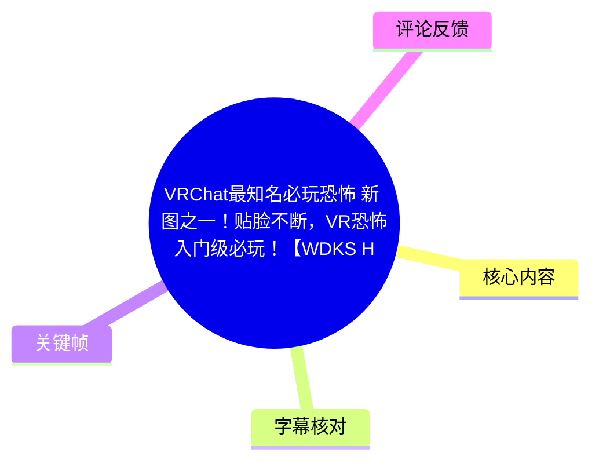
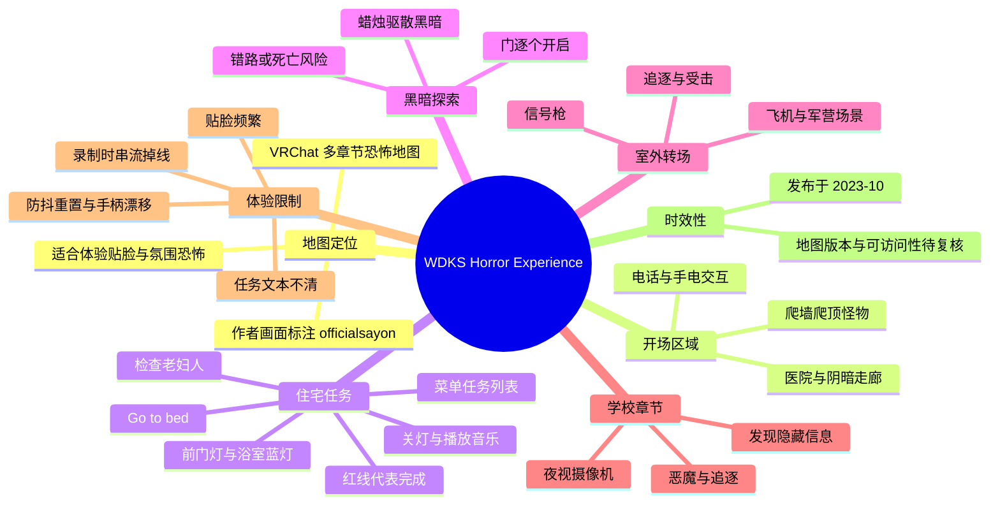
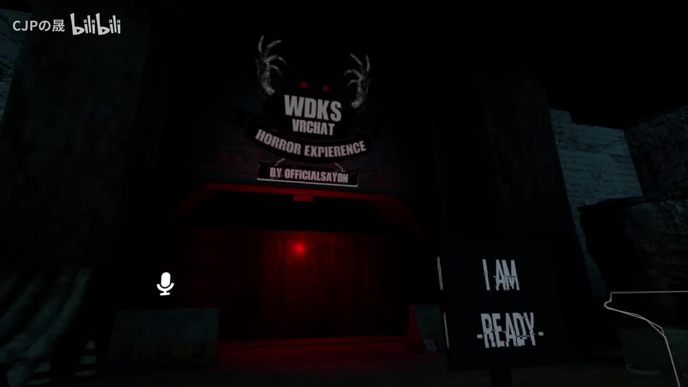
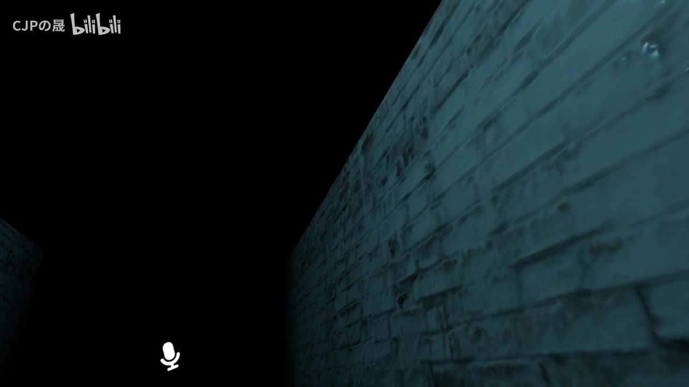
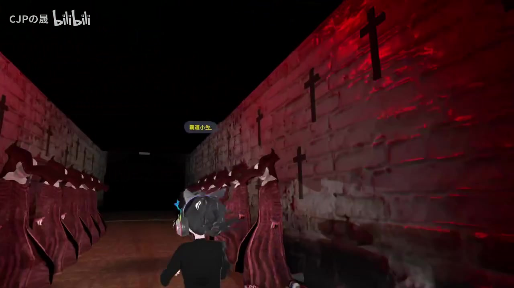
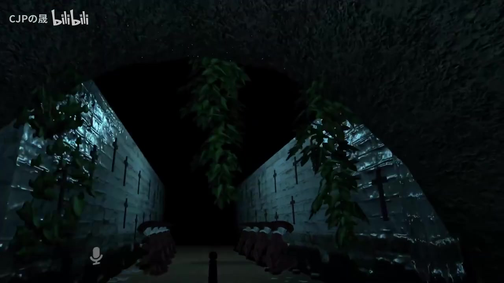

# VRChat最知名必玩恐怖“新”图之一：WDKS Horror Experience 游玩记录

> 来源：[Bilibili 视频](https://www.bilibili.com/video/BV1iB4y1o7dT) 
> UP 主：CJPの晟｜发布时间：2023-10-21｜视频时长：46 分 37 秒｜分辨率：1920×1080  
> 地图名称以视频画面为准：**WDKS Horror Experience**；入口画面标注作者为 **officialsayon**。

## 小结

本视频是 UP 主与同行玩家游玩 VRChat 恐怖地图 **WDKS Horror Experience** 的实录。地图由多个相互衔接、题材不同的区域构成：开场通道与医院、以任务清单驱动的住宅、黑暗与蜡烛机制、室外逃离与飞机转场，以及带夜视摄像机要素的学校。其核心体验不是传统战斗，而是依赖黑暗环境、强制移动、怪物追逐、突然贴脸和叙事场景切换制造压迫感。

对初次进入者最有价值的信息，是住宅关卡的任务推进逻辑：通过 VRChat 菜单查看英文任务列表；完成事项后对应条目会出现红线标记。视频实际完成的流程包括关灯、播放音乐、反复检查床上的老妇人、确认前门灯光、确认浴室蓝灯，以及最后“Go to bed（上床）”等。后续任务目标变为“杀死老妇人”，但视频没有明确展示常规武器解法，而是进入了偏剧情驱动的黑暗探索与转场。

地图恐怖设计的特点是“持续干扰”而非单点惊吓：怪物可在地面、墙面和天花板移动；某些门会缓慢开启；黑暗区域需要借助可互动蜡烛驱散；学校段使用摄像机观察隐藏信息或环境。UP 主肯定地图创意与室内氛围，但也多次批评任务表达不清、流程引导草率、频繁贴脸和怪物全程跟随会造成烦躁。

这是一段带有设备与游玩状态干扰的录制。开场出现串流掉线，随后 UP 主提到防抖设置被重置；中后段还出现手柄漂移，需要临时调整设置。因此，视频所见移动迟滞、画面调整与部分中断，不能全部视为地图本身的设计。评论中也有观众提到 HTC 头显加无线套件存在类似情况，但这只是个体反馈，不能据此认定为地图或特定设备的普遍故障。

视频发布于 2023 年 10 月，地图可访问性、任务机制、VRChat SDK 行为与世界版本均可能在之后变化。视频中关于“当时推荐时地图已经不存在”的转述亦缺乏当前状态验证；如准备实际游玩，应以 VRChat 世界搜索结果、作者页面和最新玩家反馈为准。

## 思维导图

## 目录

- [视频背景、地图身份与时效性](#视频背景地图身份与时效性)
- [开场：医院、电话与贴脸机制](#开场医院电话与贴脸机制)
- [住宅章节：任务清单的实际推进步骤](#住宅章节任务清单的实际推进步骤)
- [黑暗区域：蜡烛、慢开门与探索风险](#黑暗区域蜡烛慢开门与探索风险)
- [室外逃离、信号枪与飞机转场](#室外逃离信号枪与飞机转场)
- [学校章节：夜视摄像机与强制追逐](#学校章节夜视摄像机与强制追逐)
- [可迁移的游玩建议与限制](#可迁移的游玩建议与限制)
- [关键帧索引](#关键帧索引)
- [字幕比对](#字幕比对)
- [评论分析](#评论分析)
- [处理记录](#处理记录)

## 视频背景、地图身份与时效性 [00:00](https://www.bilibili.com/video/BV1iB4y1o7dT?t=0)

视频开头，UP 主说明自己此前已玩过约十至十五分钟，但因中断而重新开始；他表示前面一小段流程已经知道，会“假装第一次玩”。这意味着视频既包含首次反应，也包含少量先验信息，尤其在住宅任务段，同行玩家会直接口述部分任务顺序。

录制过程中出现了明确的技术问题：

1. **串流突然掉线**，导致录制或游玩重新衔接。
2. UP 主因手抖将**防抖设置重置**，因此画面调整和节奏一度变慢。
3. 后续又提到**手柄漂移**，需要暂停修改设置。
4. 玩家间还有麦克风音量、是否开麦与听不清对话的问题。

因此，本视频可以作为地图氛围、关卡机制和多人反应的参考，但不适合作为严格无干扰的速通路线或性能测试。

> 图：入口画面可见“WDKS VRCHAT HORROR EXPERIENCE”以及“BY OFFICIALSAYON”字样，是确认地图名称和画面所示作者标注的直接依据；同时也呈现了本图以暗场、红光和入口仪式感建立氛围的方式。

## 开场：医院、电话与贴脸机制 [约 01:30](https://www.bilibili.com/video/BV1iB4y1o7dT?t=90)

开场进入类似医院的第一个房间。玩家注意到手机或电话相关交互：视频中提到“拿手机开手电，自己的也行”，随后电话响起。由于 ASR 对英文台词识别较差，电话中的具体叙事内容无法可靠还原，不能据此补全剧情。

这一段已经展示出地图的几种惊吓方式：

- 环境会突然变暗或出现短暂视觉干扰；
- 老妇人等人形实体以近距离、短暂露面的形式出现；
- 有怪物会在地面、墙壁、天花板等不同平面爬行；
- 怪物或模型会突然从视野边缘接近，造成贴脸；
- 玩家被提示“需要回头”，强制回望成为惊吓触发条件之一。

UP 主将部分怪物模型联想到《生化危机》中的角色或素材，并称某个角色是“老演员”、在其他地图中也见过。这是对素材复用的主观观察，并非对模型来源的可验证结论。

> 图：画面以近距离砖墙和大面积黑暗构图，说明本图并不完全依赖复杂场景，而是通过受限视野、近距离环境和不确定的前方空间制造紧张感。

## 住宅章节：任务清单的实际推进步骤 [约 10:00](https://www.bilibili.com/video/BV1iB4y1o7dT?t=600)

第二个主要区域被玩家称为 **House（住宅）**。此处的关键不在于即时逃跑，而在于依任务列表完成一串看似日常、实则带有恐怖叙事意味的事项。

视频确认的交互入口是：打开 **VRChat 菜单**查看任务。同行玩家说明，任务完成后，英文任务行会被画上一条红线，作为完成状态标记。由于原视频未提供可用站内字幕，且 ASR 对部分英文句子有漏识和断句，以下保留可从 ASR 中较清楚辨认的任务名称和操作，不擅自扩写未显示的剧情。

### 实际流程整理

1. **上楼检查床上的老妇人**
   - 上楼后可找到躺在床上的老妇人。
   - 该角色会被多次要求“检查”，即使其看似一直处于睡眠状态。

2. **关闭老妇人房间的灯**
   - 任务英文被识别为接近“Make sure turn off the lights”。
   - 玩家一开始误以为要开灯，随后通过英文提示确认是关灯。
   - 对话尚未结束或交互条件未满足时，灯可能无法立即操作；待对话结束后才可关闭。
   - 关灯完成后，菜单第一行任务出现红线。

3. **下楼播放音乐播放器**
   - 第二项任务被同行玩家概括为播放音乐播放器。
   - UP 主质疑播放音乐在当前环境中是否听得清，体现出任务反馈不够直观。

4. **再次检查老妇人**
   - 任务中反复要求检查老妇人，形成重复往返。
   - 视频中玩家多次走错门或寻找房间，说明住宅布局与任务指向不够明确。

5. **确认前门区域的灯**
   - ASR 可辨认出任务意图接近“确保前门的灯开着”。
   - UP 主尝试点按灯具时遭遇交互不明确的情况，随后任务自行标记完成；视频未充分解释触发条件。

6. **再次播放音乐、再次检查老妇人**
   - 视频继续出现“接着播放音乐”“check on mrs.”等任务语句。
   - 这里可确认任务结构以重复检查与环境状态切换为主，但不能确认每一项的精确文本和所有先后条件。

7. **确保浴室灯为蓝色**
   - ASR 中出现“确保浴室的……灯是蓝色的”。
   - 玩家寻找厕所时发现其位置、入口或可达性并不直观，并多次受环境变化打断。

8. **Go to bed（上床）**
   - 最后一项日常任务被明确读作“Go to bed”。
   - 玩家尝试进入床位或靠近床铺时发现通行受限，随后场景灯灭、氛围转向更强烈的恐怖阶段。

9. **目标转为“杀死老妇人”**
   - UP 主再次查看任务列表后，判断当前唯一目标是杀死老妇人。
   - 他与同行玩家寻找武器和可交互对象，但视频中没有展示明确、可重复验证的“击杀老妇人”操作。
   - 因此，该任务的完整解法在本视频中仍不清楚。

### 住宅章节的设计评价

UP 主认为这种任务模式“像网游交任务”，但又评价其表达比较草率。换言之，地图将恐怖体验建立在重复日常劳动、有限交互和不确定触发条件上；其优点是能让玩家持续处于等待变化的状态，缺点是容易让不熟悉英文或未掌握菜单系统的玩家卡关。

## 黑暗区域：蜡烛、慢开门与探索风险 [约 18:30](https://www.bilibili.com/video/BV1iB4y1o7dT?t=1110)

住宅后段进入极暗区域。视频中最明确的机制信息是：**蜡烛可以驱散黑暗**。玩家先在环境中发现蜡烛，并确认其用途是将一片异常黑暗的区域“弄走”或削弱。

可归纳的实际经验如下：

- 黑暗并非纯粹的视觉效果，至少部分区域与蜡烛互动相关；
- 蜡烛可能需要在指定位置取得，或需要玩家带入黑暗区域；
- 玩家提到蜡烛会“废了”，表明它可能存在消耗、失效或不可持续使用的情况，但视频没有给出数值、耐久度或明确失效规则；
- 部分门只能逐扇尝试打开，且“慢慢开”本身就是恐怖设计的一部分；
- 玩家预期某扇门开启后会贴脸，因此通过站在侧面等方式降低正面受惊程度；
- 迷路、选错路径和进入黑暗深处可能带来死亡或重置风险，但视频无法确认每次死亡是否由路径选择、怪物接触还是剧情节点触发。

> 图：该画面展示红光、砖墙、十字架和排列式摆设共同形成的宗教恐怖视觉语汇。它适合说明地图在黑暗机制之外，还通过高对比红光和重复符号强化心理压迫。

视频中还有一段玩家被厕所门、狭窄空间和自身视角限制困住的情况。UP 主提到自己“卡在这个位置”“看都看不到”，加上此前手柄漂移问题，说明这类地图对 VR 移动、转向和空间定位要求较高。对于容易眩晕或控制器定位不稳定的玩家，建议优先确认舒适度设置与移动方式。

## 室外逃离、信号枪与飞机转场 [约 27:00](https://www.bilibili.com/video/BV1iB4y1o7dT?t=1620)

后续场景从室内转换到室外。玩家经过悬空或危险地形，并提醒“掉下去应该就活不了了”。视频中并没有用界面参数证实坠落惩罚的具体规则，因此只能将其视为玩家对场景风险的即时判断。

该段出现了追逐和受击：

- 玩家看到熟悉感较强的怪物模型，并联想到《虐杀原型》；
- 有玩家被撞倒或死亡，但随后又说“我还活着”，说明本图可能存在复活、剧情击倒或多人状态差异；
- 玩家尝试使用被识别为**信号枪**的道具；
- 英文提示被 ASR 识别为接近“Shoot the flag room”，识别质量不足，无法据此确认真正的目标文本；
- 射击似乎会让怪物直接靠近，至少在这次游玩中并未形成显著的安全效果。

随后玩家发现可进入飞机，并抵达类似军营的场景。军营中存在大量尸体或静态死亡角色，UP 主吐槽“为什么不带我们出去”“一把枪都没有”。这段更像线性剧情转场，而非开放的资源管理或战斗系统；尽管视觉上出现军营和枪械语境，视频并未展示玩家获得常规武器、弹药管理或可自由战斗的机制。

> 图：通道保留了宗教符号、潮湿石墙、植被与黑暗顶棚，展示地图从室内房屋转向异质空间时仍维持相同的封闭感和不确定性，有助于理解其多场景拼接式结构。

## 学校章节：夜视摄像机与强制追逐 [约 34:00](https://www.bilibili.com/video/BV1iB4y1o7dT?t=2040)

学校是视频后段的独立主题区域。玩家进入后获得或使用摄像机，并提到摄像机有电量、画面变绿、需要借助相机寻找隐藏项目。这是本视频最接近“工具驱动探索”的关卡设计。

### 可确认的学校段机制

- 玩家通过摄像机观察环境；
- 画面会呈现绿色夜视风格；
- 视频明确提到“用这个相机找到隐藏的项目”；
- 玩家尝试关闭手电，以判断手电与摄像机夜视之间的关系；
- ASR 中提到“只能录 30 帧”之类的话，但语境不完整，无法确认是否真是地图对摄像机帧率或录制性能的设定，不能将其作为技术参数；
- 墙面或环境中可能有需要通过摄像机确认的内容，但视频没有清晰、完整地展示所有隐藏文本。

剧情提示方面，UP 主将学校内的内容概括为“恶魔住在这个学校”，也提到角色遭受霸凌、被打等信息。由于英文原文不完整、ASR 识别混杂，以下只能作为玩家从场景台词中得到的概略理解，不能视为完整官方剧情梗概。

学校段延续了地图最具争议的机制：**怪物跟随和频繁贴脸**。UP 主明确表示不喜欢作者把鬼“全程跟着你”的做法，认为这比单次惊吓更烦人。后段出现倒计时、“I'm coming for you”、找怪和继续往前跑等内容；玩家判断本段似乎没有完整的躲藏系统，更多是向前移动直到剧情触发。

结尾附近，玩家认为某次贴脸可能是“必须得贴一次”的强制事件；在没有死亡的情况下完成或离开了该段。视频中没有展示通关结算、最终世界传送信息或完整结局画面，因此不能断言地图被完全打通。

## 可迁移的游玩建议与限制 [约 44:00](https://www.bilibili.com/video/BV1iB4y1o7dT?t=2640)

### 建议的游玩准备

1. **优先多人进入**
   - 视频全程是多人交流式游玩；同伴会帮助解释任务、提示路线，也会分散紧张感。
   - 但多人语音也可能遮挡环境台词，建议在关键提示出现时降低闲聊音量。

2. **熟悉 VRChat 菜单**
   - 住宅段的任务进度依赖菜单查看。
   - 英文任务条目在完成后会出现红线；这是确认是否真正推进的最可靠视频内依据。

3. **准备处理黑暗与方向感问题**
   - 注意蜡烛等环境道具，不要把黑暗区域简单当作不可进入的背景。
   - 在门逐一开启、通道狭窄或可能贴脸的地方，可侧身观察、保留转向空间。

4. **降低眩晕与设备干扰**
   - 提前检查串流稳定性、控制器漂移、防抖和麦克风音量。
   - 视频中多次暂停调设置，说明连续体验很容易被硬件问题破坏。
   - 若容易受到贴脸惊吓、黑暗封闭空间或强制移动影响，应谨慎尝试。

5. **不要将视频中的所有提示当成确定攻略**
   - “杀死老妇人”的完整做法没有在视频中被清楚验证。
   - 信号枪的英文指令、学校隐藏信息和最终结局都存在 ASR 不完整问题。
   - 地图版本可能变动，旧路线或旧触发条件不一定仍适用。

### 视频内可确认的限制

| 项目 | 视频中呈现的情况 | 结论 |
| --- | --- | --- |
| 地图可访问性 | UP 主转述曾看到推荐时地图已不存在 | 仅反映当时转述，当前是否可搜到未验证 |
| 攻略完整性 | 有任务流程，但多次迷路、任务含义不清 | 可作体验参考，不是完整解法 |
| 语言门槛 | 任务主要以英文显示，玩家需自行解释 | 不熟悉英文可能增加卡关概率 |
| 恐怖强度 | 频繁贴脸、爬墙怪、暗场、强制回头与追逐 | 对 VR 新手可能刺激较强 |
| 战斗系统 | 出现“杀死”目标、信号枪和军营，但无明确战斗教学 | 不应假定地图是战斗型恐怖图 |
| 设备稳定性 | 串流掉线、防抖重置、手柄漂移 | 视频体验受到外部技术因素影响 |

## 关键帧索引

| 关键帧 | 正文位置 | 画面价值 |
| --- | --- | --- |
| `frames/frame-001.jpg` | 地图身份与时效性 | 直接显示 WDKS Horror Experience 名称和画面标注的作者信息，是地图身份识别依据。 |
| `frames/frame-002.jpg` | 开场机制 | 体现极暗环境、狭窄空间与受限视野，是理解“未知方向可能出现贴脸”的氛围依据。 |
| `frames/frame-003.jpg` | 室外与场景转换 | 展示石墙、拱顶、植被和十字架等混合环境，说明场景并不限于住宅或学校。 |
| `frames/frame-004.jpg` | 黑暗区域 | 红光与密集十字架突出地图的宗教恐怖视觉设计，也便于解释压迫性布景。 |

> 未将其余关键帧强行加入正文：给定素材仅提供了路径列表，当前可见画面中以上四张与地图身份、环境设计和机制说明的对应关系最明确。为避免对未核验画面内容作出推断，其余帧不作描述性引用。

## 字幕比对 [46:10](https://www.bilibili.com/video/BV1iB4y1o7dT?t=2770)

本次任务已执行 ASR。站内字幕获取失败：素材记录显示字幕工具报错，原因为 `Missing JSON resource URL`，因此没有可用的 Bilibili 站内字幕文件。

| 字幕来源 | 完整性 | 专有名词 | 时间轴 | 主要问题 |
| --- | --- | --- | --- | --- |
| Bilibili 站内字幕 | 不可用 | 无法核验 | 无 | 字幕资源 URL 缺失，工具进程以错误码 1 退出。 |
| 本次 ASR 字幕 | 覆盖整段语音，但断句与误识别较多 | 可识别 VRChat、House、Go to bed、信号枪等部分词；英文任务和怪物名称误识较多 | 未提供逐句精确时间戳 | 多人重叠说话、口语、省略句、环境音和中英文混杂导致大量错字、漏字与错分段。 |

### 最终字幕采用策略

- **正文以本次 ASR 为唯一字幕文本来源**，并结合视频元数据、标题、入口关键帧和上下文进行保守整理。
- 对明确显示或语音中较清晰的名称，采用以下校正：
  - `WDKS Horror Experience`：来自标题与入口画面；
  - `officialsayon`：来自入口画面作者标注；
  - `House`：ASR 中明确出现“第二个房间是 House”；
  - `Go to bed`、`Make sure turn off the lights`、`check on mrs.`：保留 ASR 能辨认的英文片段，不扩展为未经确认的完整任务原文；
  - “蜡烛可以驱散黑暗”：来自多次中文口述，语义一致。
- 对无法确定的内容不作修复性编造，包括电话英文台词、信号枪精确指令、学校墙面文字、怪物名称、剧情人物关系及最终结局。
- 本文的章节时间是根据视频总时长与 ASR 叙事顺序整理的**导航定位**；由于 ASR 素材未提供逐句时间戳，不能视为逐秒转录时间码。

## 评论分析 [46:25](https://www.bilibili.com/video/BV1iB4y1o7dT?t=2785)

以下仅处理本次可获取的热评前三条，不将评论中的回忆和判断当作已验证事实。

1. **路西法-地狱CEO｜6 赞**
   - 评论观点：该用户认为地图“质量真不错”，并回忆自己刚玩 VRChat 时，第一位朋友带其去过类似或同一张恐怖图。
   - 补充信息：评论者称当初没有收藏，后来再也找不到该图。
   - 可信度与边界：这是个人游玩记忆，能侧面说明地图具有早期 VRChat 恐怖图的社交传播属性，但不能据此确认其当前下架、改名或无法访问。

2. **帕秋莉酱｜2 赞**
   - 评论观点：用户表示自己使用 HTC 头显加无线套件时也出现过“这样”的情况。
   - 补充信息：与视频开场的串流掉线、设备调整形成呼应。
   - 可信度与边界：评论没有明确指出具体故障现象、设备型号、网络环境或软件版本，不能据此归因于 HTC 无线套件、VRChat 或该地图。

3. **小小的萌新啊｜2 赞**
   - 评论观点：鼓励 UP 主继续制作。
   - 补充信息：无关于地图机制、剧情、性能或攻略的实质信息。
   - 可信度与边界：属于正向互动，不构成可用于验证内容质量或地图状态的证据。

## 评论分析

本次流程未获取到可用热评，因此不推断观众态度或额外结论。

## 处理记录

- **Worker ID**：worker-mri3sp0r-0d15ab26
- **模型**：gpt-5.6-terra
- **调用工具与素材**：视频元数据、已合并视频素材、音频 ASR 结果、关键帧目录、评论 JSON、站内字幕获取结果。
- **使用的应用工具**：素材读取与整理流程已提供 `merged.mp4`、`audio/audio.wav`、`frames/`、`comments/comments.json`、`asr/` 等输出；未提供可用站内字幕资源。
- **字幕选择**：站内字幕不可用，原因是字幕工具返回 `Missing JSON resource URL`；本次 ASR 已执行，正文以 ASR 为主，并仅对标题、入口画面和上下文能确认的信息进行保守校正。
- **关键帧选择依据**：选择 `frame-001` 用于确认地图标题与作者标注；选择 `frame-002`、`frame-003`、`frame-004` 分别说明暗场压迫、场景转换与宗教恐怖布景。未对未核验关键帧作内容推断。
- **评论范围**：仅分析可获取热评前三条，未扩展至其他普通评论或不可获取评论。
- **缓存清理**：未获得可核验的缓存清理执行回执；本记录不声称已删除本地视频、音频、帧图或 ASR 中间文件。
- **未解决问题**：
  - 地图在 2026 年当前是否仍可访问、是否改名或更新，素材未提供验证结果；
  - “杀死老妇人”任务的确切解法未在视频中清楚展示；
  - 信号枪指令的英文原文、学校隐藏信息和完整剧情缺少可靠字幕或文字证据；
  - ASR 无逐句时间戳，正文中的分段时间链接为按叙事顺序整理的导航定位。
