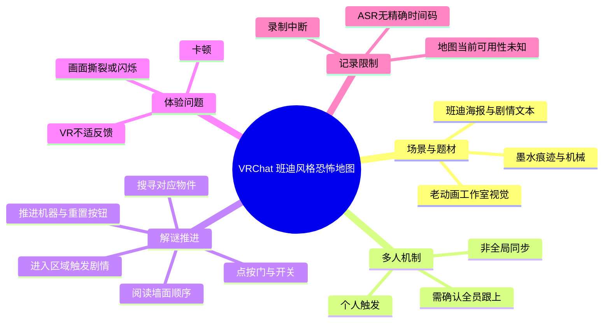
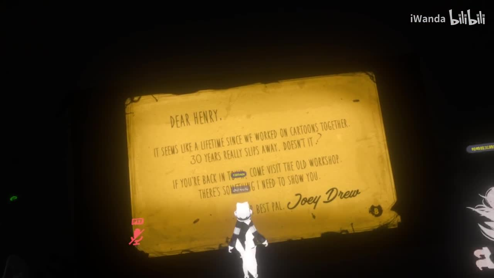
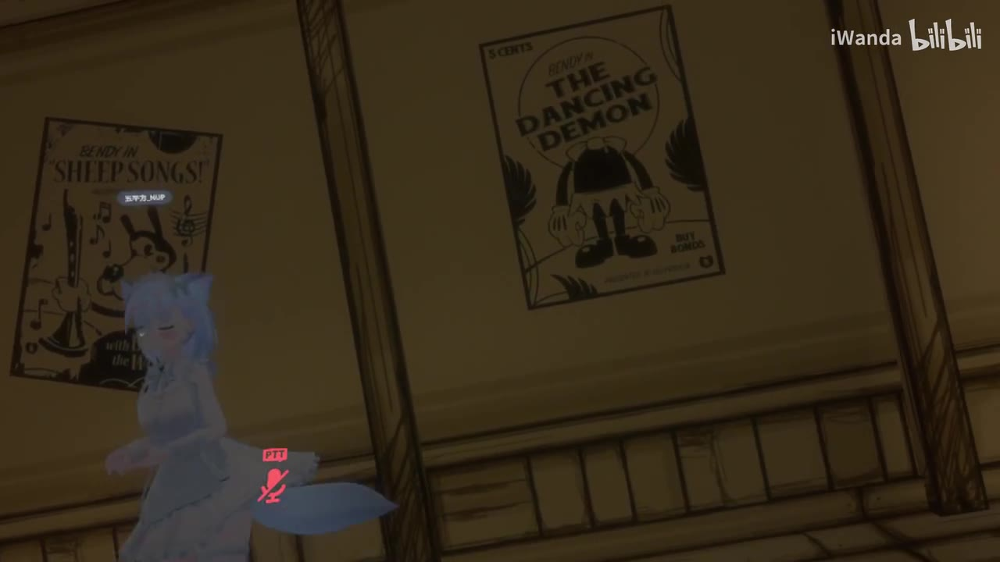
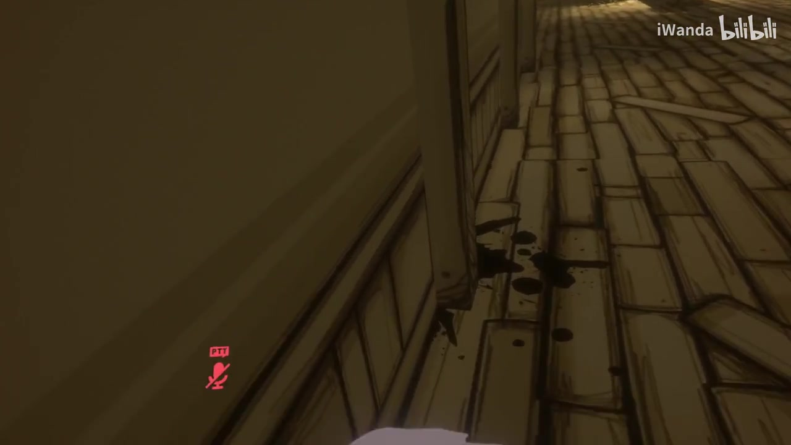
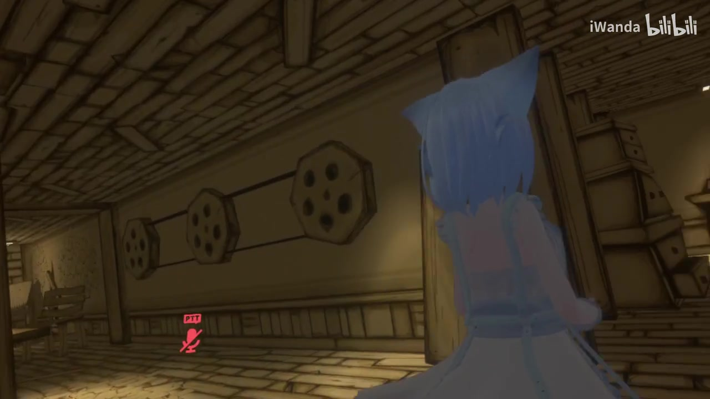

# 【vrchat】迪士尼风格的恐怖地图但是录一半掉了

> 来源：[Bilibili 视频](https://www.bilibili.com/video/BV1w84y1N7yT)<br>
> UP 主：水水兑水｜发布时间：2023-03-07｜视频时长：14 分 15 秒｜分辨率：1920×1080<br>
> 标签：VR、迪士尼、恐怖、恐怖地图、VRChat｜简介：`Bendy`

## 小结

视频记录了一组玩家在 VRChat 中游玩一张以《班迪与墨水机器》（*Bendy and the Ink Machine*）视觉元素为基础的恐怖解谜地图。地图采用黄褐色老动画工作室风格、墨水痕迹、海报和机械装置等场景设计；标题中的“迪士尼风格”主要指早期卡通动画的美术联想，并非视频提供了与迪士尼官方作品或资产有关的证据。

游玩的核心并非战斗，而是多人协作下的触发与搜寻：玩家需要先进入区域触发剧情，再根据墙上给出的顺序寻找并交互场地内物件，随后尝试推进墨水机器、电源、门与类似 `Reset` 的按钮等机关。视频中明确出现的英文任务提示包括 `Turn on the machine`、`Low pressure`、`Restore...`（后半部分未辨清）以及疑似“打开墨水机器”的提示。

本视频最有价值的经验是：该地图存在**个人触发而非全局同步**的机制。有人没有及时进入触发区域、没有完成自己的前置交互，便可能无法跟上团队进度。组织多人游玩时，应先确认全员到场、让每位成员自行触发剧情，并按顺序检查可交互物件，而不要只依赖一名领路者完成操作。

体验层面，录制者反馈出现明显卡顿、画面撕裂或闪烁，并称其“不友好”“很难受”。这说明该地图或当时的运行环境对其 VR 显示体验造成了不适；但素材没有提供显卡、头显、帧率、网络延迟、VRChat 图形设置或地图性能数据，因此不能把问题归因为某一项确定的技术原因。

视频标题称“录一半掉了”，而现有 ASR 在寻找书本、准备继续推进时中断，未覆盖完整通关过程。故本文只整理素材实际呈现的前半段探索与解谜流程，不把未录到的剧情、结局或完整解法视为已验证信息。评论中还有用户表示地图“好像找不到了”，提示该世界的可访问性可能已变化；截至素材抓取时间（2026-07-12），这一说法仅能作为用户反馈，不能替代实际检索结果。

## 思维导图



## 目录

- [视频定位、题材与时效性](#视频定位题材与时效性)
- [时间轴：进入地图与多人集合](#时间轴进入地图与多人集合)
- [时间轴：墨水机器与前置条件](#时间轴墨水机器与前置条件)
- [时间轴：个人触发与团队同步问题](#时间轴个人触发与团队同步问题)
- [时间轴：顺序谜题与物件搜寻](#时间轴顺序谜题与物件搜寻)
- [可复用的多人解谜步骤](#可复用的多人解谜步骤)
- [技术体验、参数与限制](#技术体验参数与限制)
- [关键帧索引](#关键帧索引)
- [字幕比对](#字幕比对)
- [评论分析](#评论分析)
- [处理记录](#处理记录)

## [视频定位、题材与时效性](https://www.bilibili.com/video/BV1w84y1N7yT?t=0)

这是一期 VRChat 多人地图实录，不是地图制作教程、新闻报道或完整攻略。视频元数据中的简介仅写有 `Bendy`，结合场景内出现的 “BENDY IN SHEEP SONGS!”、“BENDY IN THE DANCING DEMON” 海报，以及评论“班迪的墨水机器”，可以较稳妥地将其主题概括为对《班迪与墨水机器》式工作室与墨水恐怖意象的地图体验。

素材中没有关于 VRChat 版本更新、地图作者、地图 ID、上传日期、世界容量、推荐人数、PC/Quest 平台兼容性或硬件配置的新闻性信息。因此，不能将本片作为“地图仍可游玩”或“某版本机制仍然有效”的证明。

视频发布于 2023 年 3 月，素材元数据抓取于 2026 年 7 月。VRChat 世界可能被下架、改名、设为私密或更新机制；热评中“找不到了”的说法也反映出这一时效风险。若要复现，应以 VRChat 当下世界搜索结果和作者页面为准。



> 图：信件以 “DEAR HENRY” 开头，落款可见 “Joey Drew”，直接呈现了班迪系列式的旧动画工作室叙事符号。它可帮助读者理解本视频的恐怖感主要来自复古卡通与墨水工作室氛围，而非现代写实恐怖场景。

## [时间轴：进入地图与多人集合](https://www.bilibili.com/video/BV1w84y1N7yT?t=0)

> 以下时间轴按视频时长、关键帧顺序及 ASR 的话题推进整理。素材未提供 ASR 的逐句时间码，故除视频起点外，其余节点用于跳转定位，不应视为逐秒精确转写。

| 跳转 | 内容 | 可确认事实 |
| --- | --- | --- |
| [00:00](https://www.bilibili.com/video/BV1w84y1N7yT?t=0) | 进入及等待成员 | 玩家确认是否有人尚未进入，并等待一名被称为 “JX” 的成员。 |
| [00:35](https://www.bilibili.com/video/BV1w84y1N7yT?t=35) | 解释同步机制 | 录制者说明地图内“很多都是个人的，不是全局的”；未跟上的人可能错过内容。 |
| [01:10](https://www.bilibili.com/video/BV1w84y1N7yT?t=70) | 小队开始探索 | 成员被允许先探索；录制者开始反馈画面体验问题。 |

开场的组织重点在于“人是否到齐”。一名成员一度站着不动，队友怀疑其挂机，之后观察到其移动，并推测他若点击了相关对象会被传送过来。这里没有足够素材确认传送的具体触发物或空间位置，但能确认队伍推进前存在等待与重组过程。

录制者随后特别说明：地图中的许多内容是“个人”的，而非“全局”的。这意味着某人即使看到其他玩家已推进，也可能需要自己进入区域或点击对象，才会在本地获得相同剧情、门状态或下一步交互资格。该机制是后续多次“为什么没有触发”“你还没触发”的直接背景。

## [时间轴：墨水机器与前置条件](https://www.bilibili.com/video/BV1w84y1N7yT?t=105)

| 跳转 | 内容 | 任务状态 |
| --- | --- | --- |
| [01:45](https://www.bilibili.com/video/BV1w84y1N7yT?t=105) | 识别墨水机器 | 玩家称其为“墨水制造机”，并将其理解为介绍性场景元素。 |
| [02:15](https://www.bilibili.com/video/BV1w84y1N7yT?t=135) | 出现机器任务 | 可听到英文提示 `Turn on the machine`。 |
| [02:35](https://www.bilibili.com/video/BV1w84y1N7yT?t=155) | 压力条件未满足 | 玩家提到 `Low pressure`，判断当前还不能开启机器。 |
| [03:05](https://www.bilibili.com/video/BV1w84y1N7yT?t=185) | 寻找前置开关 | 队伍决定先到另一处打开按钮。 |

`Turn on the machine` 是素材中最清楚的英文任务文本之一，可对应“开启机器”。但当玩家尝试操作时，画面或系统提示为 `Low pressure`，录制者据此判断“还不行开”，需要先前往其他地点打开一个按钮。

这里应注意两个边界：

1. 视频未展示完整任务 UI，也未给出机器的完整名称、数值要求或具体按钮坐标。
2. “低压”是由英文 `Low pressure` 和玩家即时判断组成；可确认的是它阻止了当前尝试，不能进一步推断为必须收集多少压力值、打开多少阀门。



> 图：画面中的 “BENDY IN SHEEP SONGS!” 与 “BENDY IN THE DANCING DEMON” 海报强化了地图的班迪式卡通工作室风格；玩家角色同时说明这是多人 VRChat 环境，而不是原作单人游戏画面。

## [时间轴：个人触发与团队同步问题](https://www.bilibili.com/video/BV1w84y1N7yT?t=210)

| 跳转 | 现象 | 对应处理 |
| --- | --- | --- |
| [03:30](https://www.bilibili.com/video/BV1w84y1N7yT?t=210) | 后方成员未跟上 | 录制者回头寻找队友。 |
| [04:00](https://www.bilibili.com/video/BV1w84y1N7yT?t=240) | 有成员尚未到达 | 队伍再次清点人数并带人前往目标区域。 |
| [04:30](https://www.bilibili.com/video/BV1w84y1N7yT?t=270) | 剧情未触发 | 领队要求先进入区域“触发剧情”。 |
| [05:00](https://www.bilibili.com/video/BV1w84y1N7yT?t=300) | 走到走廊尽头仍无进展 | 玩家指出有人“还没触发”。 |

视频反复出现“还有谁没到”“人呢”“先进去触发剧情”“你还没触发”等沟通。这不是单纯的队伍走散，而是与个人触发机制直接相关：即使有人已经走到走廊尽头，另一个人的本地进度仍可能停在前一步。

对多人地图而言，领队可以从视频中提炼出以下操作经验：

- 在进入关键门、走廊、剧情点前先报数或确认成员状态。
- 不要让队员只远距离观看别人触发；要求每个人实际跨入触发区域。
- 当门、按钮或电影/剧情未出现时，优先排查是否有人漏掉前置触发，而不是立即认定地图故障。
- 领队带路时应重复说明目标，例如“走廊走到尽头”“先进去触发剧情”，减少因空间分离导致的信息差。

这些是对视频内对话和行动的归纳，并不是该地图作者公布的正式规则。



> 图：木板走廊与地面的墨水污迹体现了地图的路径氛围和视觉线索。该画面适合配合“走廊尽头”“进入区域触发”的叙述，说明探索发生在狭长、低照度的室内空间中。

## [时间轴：顺序谜题与物件搜寻](https://www.bilibili.com/video/BV1w84y1N7yT?t=360)

| 跳转 | 解谜进展 | 素材中可确认的内容 |
| --- | --- | --- |
| [06:00](https://www.bilibili.com/video/BV1w84y1N7yT?t=360) | 尝试点按发光门缝 | 玩家记得门下发光的门可能要逐一点击，以熄灭灯光。 |
| [06:40](https://www.bilibili.com/video/BV1w84y1N7yT?t=400) | 发现遗漏前置 | 领队称“先漏了一个东西”，转而解释墙面图案与顺序。 |
| [07:10](https://www.bilibili.com/video/BV1w84y1N7yT?t=430) | 读取顺序 | 口述顺序为“1、1、2、3、4、5、6”。 |
| [07:40](https://www.bilibili.com/video/BV1w84y1N7yT?t=460) | 搜寻对应物件 | 对话中出现娃娃、音乐、唱片/碟片、墨水、扳手等候选物。 |
| [08:30](https://www.bilibili.com/video/BV1w84y1N7yT?t=510) | 继续寻找按钮/书本 | 玩家提到像小电影院的位置、`Reset` 按钮，以及在大厅或出生点附近的书本。 |

### 1. 门与灯光的尝试

玩家回忆某些门下方会发光，认为这类门需要先点击一遍，可能的效果是“把灯点灭”。随后队员尝试多个门，却遇到“点不了”“这个不能点吗”的情况。素材无法确认究竟有多少扇门可交互，也无法确认“所有门都必须点”的说法是否正确；它更像是玩家基于先前经验提出的排查方向。

### 2. 墙面顺序与物件交互

在进度卡住后，领队发现遗漏前置，说明墙壁上存在图案与顺序，并口述为：

```text
1 → 1 → 2 → 3 → 4 → 5 → 6
```

随后队伍需要在场地中寻找相应物件。ASR 可辨认出或疑似辨认出的对象包括：

- 娃娃；
- 音乐相关物件；
- 唱片/碟片（ASR 在此存在明显误识，见“字幕比对”）；
- 墨水；
- 扳手；
- 书本。

其中，“墨水在这里”“娃娃在这儿”可确认是队员发现物件时的即时反馈；“扳手”则来自多次含混识别，不能保证其物件名称无误。视频没有完整展示每个物件对应的编号，也没有展示完成顺序后的最终成功反馈，因此不能据此写成可无误复现的完整谜题答案。

### 3. 后续目标仍未完成

队员之后提到一个“像小电影院的地方”，并认为有一个类似 `Reset` 的按钮需要打开；还有人说书本在大厅、出生点附近。此时仍存在“按不到”“还差一个东西”的状态。ASR 在“书本再出生点，往前走往前”附近结束，未给出后续操作和成功结果。



> 图：画面显示走廊墙面上的多个圆形图案/轮盘式装饰，是本段“墙面图案—顺序—物件”的重要视觉上下文。它不能单独证明每个数字对应的物件，但能帮助定位玩家为何会转向观察墙面线索。

## [可复用的多人解谜步骤](https://www.bilibili.com/video/BV1w84y1N7yT?t=35)

以下流程是对视频实际行为的整理，适合用于处理具有个人触发机制的多人 VRChat 解谜地图；其中未被视频验证的地图专属细节不作补充。

1. **集合并确认成员进入实例。**  
   在开局和关键区域前确认是否有人未进入、挂机或落在后方。视频中有成员未及时跟上，队伍必须暂停等待。

2. **让每名玩家自行进入剧情触发区域。**  
   不要只让一人走到门口或走廊尽头。视频明确表明，部分内容为个人状态，玩家可能需要亲自触发才会获得进度。

3. **先读任务文本，再操作主机关。**  
   面对机器时，先确认任务是 `Turn on the machine`；若出现 `Low pressure`，不要反复强行操作，应寻找上游开关或前置条件。

4. **记录可见提示与已交互对象。**  
   对发光门、墙面图案、文字提示、墨水机器附近的装置逐项记录。视频中的“门缝发光”“灯灭”“还有一个漏掉的东西”说明遗漏检查会导致进度停滞。

5. **按场景给出的顺序搜寻物件。**  
   视频口述顺序为 `1 → 1 → 2 → 3 → 4 → 5 → 6`。应由一人负责复述顺序，其他人分区寻找，并在每次成功交互后回报状态。

6. **遇到“点不到”时分层排查。**  
   依序检查：  
   - 当前玩家是否完成个人剧情触发；  
   - 是否漏了某个顺序物件；  
   - 是否需要先打开额外按钮；  
   - 目标是否只是场景装饰、对当前进度不可交互；  
   - 是否有队员尚未完成其本地步骤。  

7. **确认录制与进度保存预案。**  
   本片因“录一半掉了”未保留完整过程。多人长地图建议在关键节点检查录制状态，并在可能的情况下记录世界名称、房间信息和已完成机关，便于中断后重开排查。

## [技术体验、参数与限制](https://www.bilibili.com/video/BV1w84y1N7yT?t=70)

### 已知参数与事实

| 项目 | 信息 |
| --- | --- |
| 视频时长 | 855 秒（14 分 15 秒） |
| 视频分辨率 | 1920×1080 |
| 视频类型 | VRChat 多人地图实录 |
| 主题线索 | Bendy、墨水机器、老动画工作室视觉 |
| 站内字幕 | 未提供可用字幕 |
| 本次 ASR | 已执行，但无逐句时间码且存在误识 |
| 可获取评论数 | 热评前三条 |
| 视频数据抓取时间 | 2026-07-12 |

### 录制者报告的体验问题

录制者在探索初段表示“好卡”，并提到画面撕裂、屏幕变亮或一闪一闪，感到“不友好”“很难受”。这些话能够证明其当时的主观体验，但不能证明问题来自地图优化、电脑性能、网络、SteamVR、头显刷新率、串流链路或 VRChat 设置中的任一特定因素。

如果要从技术上复现或排查，只能提出与素材一致的谨慎建议：

- 在进入高复杂度恐怖地图前预留性能余量，避免队伍聚集时额外增加负荷；
- 若出现闪烁、撕裂或明显不适，应优先退出或暂停，不应强行继续游玩；
- 多人实例中同时存在性能问题和个人触发问题时，应先区分“画面无法流畅显示”与“任务逻辑未推进”；
- 素材未提供配置，不应从本视频推导任何推荐显卡、帧率阈值或画质参数。

### 录制中断与信息边界

标题已经说明录制在中途掉线或中断，但没有说明是 VRChat 崩溃、录屏软件故障、网络掉线还是人为停止。ASR 末尾停在继续寻找书本与前进方向的对话中，印证视频没有完整覆盖该地图后续内容；但不能据此判断中断发生的技术原因。

## [关键帧索引](https://www.bilibili.com/video/BV1w84y1N7yT?t=0)

| 关键帧 | 正文用途 | 选择依据与信息价值 |
| --- | --- | --- |
| `frames/frame-001.jpg` | 题材与叙事背景 | 信件包含 “DEAR HENRY” 与 “Joey Drew”，是识别班迪式世界观的强视觉证据。 |
| `frames/frame-002.jpg` | 场景风格说明 | 两张班迪主题海报和玩家角色同时呈现题材来源与 VRChat 多人环境。 |
| `frames/frame-003.jpg` | 路径探索与氛围 | 木板走廊、低照度和墨水污迹对应视频中的走廊推进与恐怖氛围。 |
| `frames/frame-004.jpg` | 谜题线索上下文 | 墙面轮盘式图案可辅助理解玩家转向观察图案、寻找顺序机制的过程。 |

其余关键帧文件虽在素材目录中可用，但本篇未将其用于论证：提供的可见素材中，以上四帧分别覆盖叙事文本、主题海报、环境路径和谜题视觉线索，信息密度更高。由于关键帧清单未附带逐帧时间码，本文不将文件序号误写为精确视频秒数。

## [字幕比对](https://www.bilibili.com/video/BV1w84y1N7yT?t=0)

| 字幕来源 | 完整性 | 专有名词 | 时间轴 | 主要问题 |
| --- | --- | --- | --- | --- |
| Bilibili 站内字幕 | 无可用字幕，无法覆盖 | 无法评估 | 无 | 素材采集记录显示字幕工具进程以 code 1 退出，未获得可用站内字幕。 |
| 本次 ASR 字幕 | 覆盖了开场集合、机器任务、同步问题与部分谜题讨论；末尾中断 | 英文短语部分可辨认，如 `Turn on the machine`、`Low pressure`、`Restore...`；中文物件名存在误识 | 未提供逐句时间码 | 中英夹杂、多人重叠说话、口语停顿与环境音导致词语混淆，且未覆盖完整结局。 |

最终采用**本次 ASR 作为唯一文本依据**，并以视频标题、元数据、关键帧和上下文进行有限校正；不存在可与之合并的站内字幕。

重要校正与保留原则如下：

- 将 ASR 中的“不是全职”结合前文“不是全局”校正为“不是全局”，因为语义指向多人任务状态是否共享。
- 保留 `Turn on the machine` 与 `Low pressure` 的英文形式，避免将其扩写成素材未显示的完整系统说明。
- “opened list machine”可能是听写误识；正文仅表述为“疑似打开墨水机器的提示”，不将其作为准确英文。
- “燙片”“燙.片”等识别结果可能指向唱片、碟片或其他物件，无法仅凭 ASR 定名，故使用“唱片/碟片（待核）”。
- “扳手”的音频辨识亦不稳定，正文标为候选物件，而不是已确认谜题答案。
- 评论中的“班迪的墨水机器”与视频简介 `Bendy`、场景海报相互印证主题，但评论不用于补写视频未出现的剧情内容。

## [评论分析](https://www.bilibili.com/video/BV1w84y1N7yT?t=0)

仅处理素材中可获取的热评前三条。三条评论点赞数均为 1，样本规模很小，不能代表整体观众意见。

1. **木叶萧影Yco：**“这个图好像找不到了( ゜- ゜)つロ”  
   - **观点：** 评论者称自己似乎无法找到这张地图。  
   - **补充价值：** 提醒读者地图可能已下架、改名或难以检索，与视频发布时间较早的时效风险有关。  
   - **可信度与边界：** 使用“好像”表明评论者并不确定；没有提供搜索关键词、搜索时间、平台版本或截图，不能据此确认地图已失效。

2. **CHenjunxi先生：**“[嘉然2.0_可爱捏]”  
   - **观点：** 对视频中角色或氛围作表情化、正向互动。  
   - **补充价值：** 不提供地图机制、剧情或技术信息。  
   - **可信度与边界：** 属于情绪表达，不应作为事实来源。

3. **叶水无神：**“班迪的墨水机器”  
   - **观点：** 将视频主题指认为《班迪与墨水机器》。  
   - **补充价值：** 与视频简介 `Bendy`、墨水机器任务及关键帧海报相互呼应。  
   - **可信度与边界：** 评论本身不是权威鉴定；本文对主题的判断主要仍基于视频内可见文字、元数据和 ASR 上下文。

## [处理记录](https://www.bilibili.com/video/BV1w84y1N7yT?t=0)

- **Worker ID：**`worker-mri3t0px-8b394786`
- **模型：**`gpt-5.6-terra`
- **调用工具与素材产物：**使用任务提供的视频元数据、素材采集结果、音频 ASR 文本、关键帧目录、评论 JSON 与封面信息进行整理；素材产物包括 `merged.mp4`、`audio/audio.wav`、`frames/`、`comments/comments.json`、`asr/`。
- **站内字幕处理：**已尝试获取站内字幕，但素材记录为 `subtitles: Tool process exited with code 1.`，因此没有可用站内字幕；本次 ASR 已执行并作为正文主要转写依据。
- **字幕选择：**选择本次 ASR，结合上下文对“非全局”“Turn on the machine”“Low pressure”等高置信内容作有限校正；对唱片/碟片、扳手、`Restore...` 等低置信内容保留不确定性。
- **关键帧依据：**优先选取可直接支持主题识别、多人 VR 场景、走廊探索和墙面谜题语境的四张帧图；分别使用 `frame-001.jpg` 至 `frame-004.jpg`，未将未附时间码的帧序号伪造为精确发生时间。
- **评论范围：**严格限于可获取热评前三条，未扩展到其他评论或将评论内容当作已验证地图资料。
- **缓存清理：**任务素材未提供缓存清理执行回执；无法确认采集侧临时缓存是否已清理，故不作“已清理”的无依据声明。
- **未解决问题：**地图名称、作者、世界 ID、当前可访问性、完整通关流程、掉录原因、硬件与图形设置、各物件的准确名称及其完整交互顺序，均未能从现有素材中确认。
