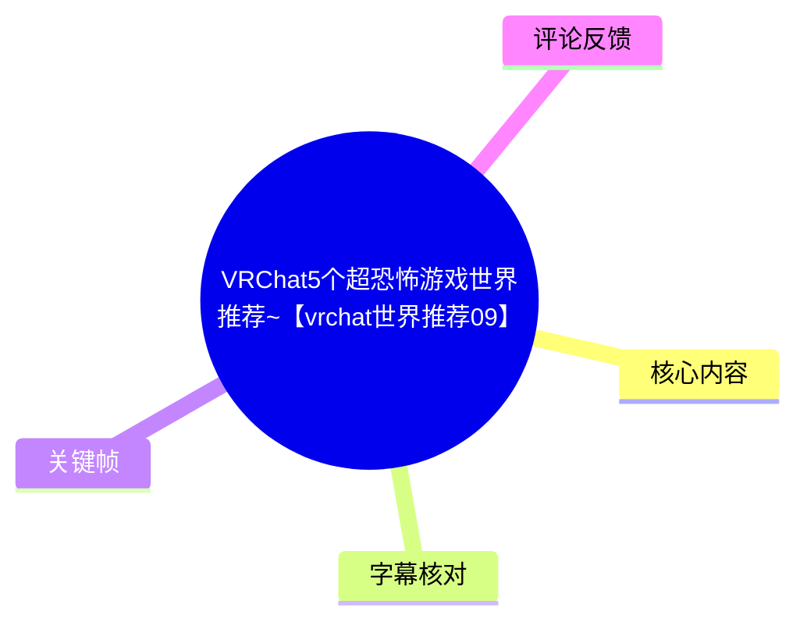
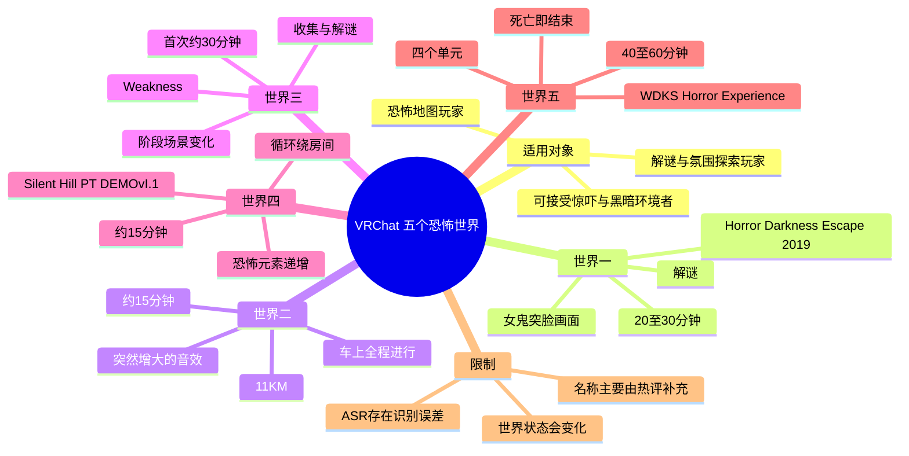
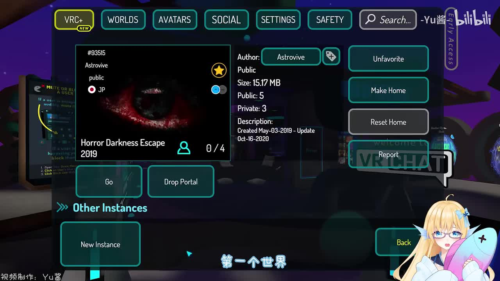
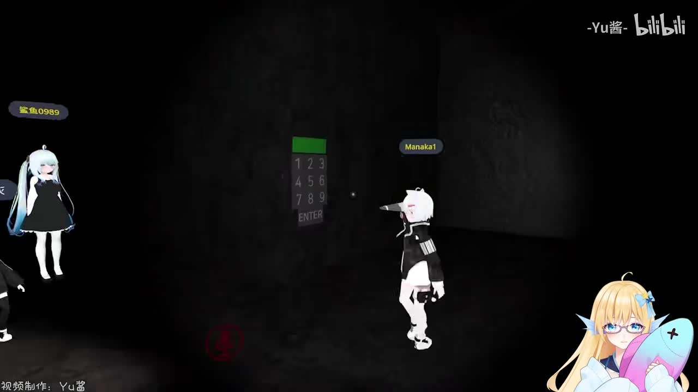
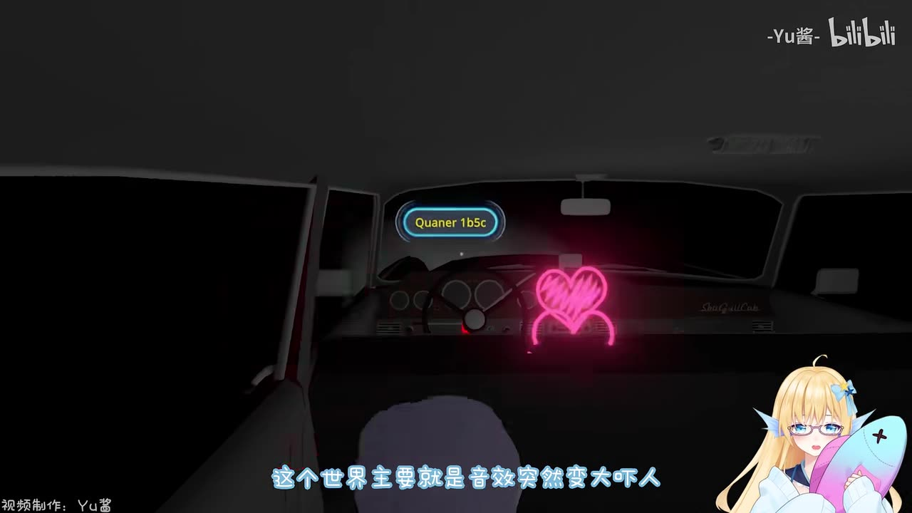
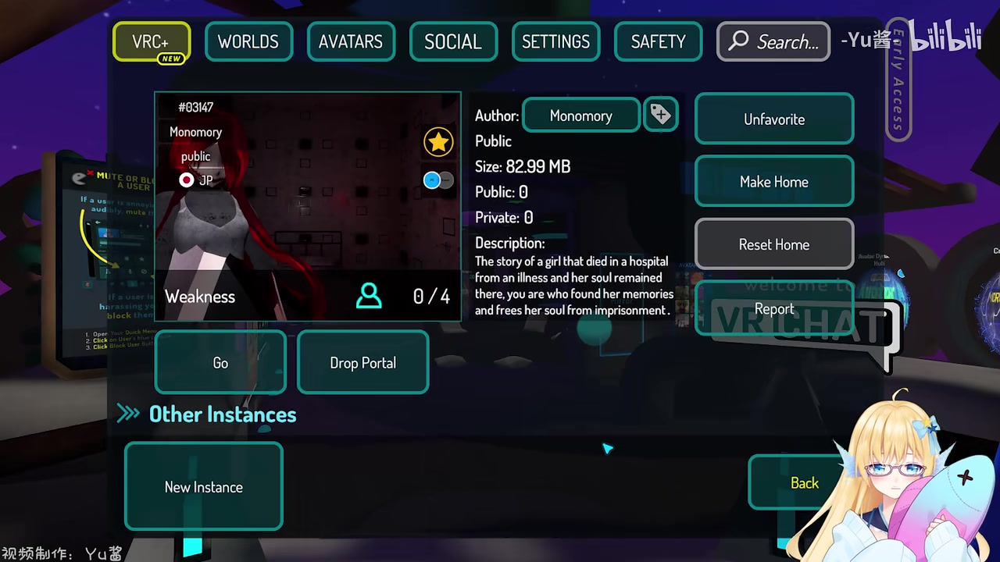

# VRChat5个超恐怖游戏世界推荐~【vrchat世界推荐09】

> 来源：[Bilibili 视频](https://www.bilibili.com/video/BV11u411y73h) 
> UP 主：小鱼一号w｜发布时间：2022-04-18｜视频时长：4 分 22 秒｜分区内容：第九期「恐怖地图推荐」  
> 视频简介注明游戏为 VRChat、平台为 Steam；剪辑、配音、文案署名为 Yu 酱。

## 小结

这是一支面向 VRChat 玩家制作的恐怖世界推荐视频。UP 主按个人游玩体验介绍 5 张恐怖游戏地图，分别覆盖解谜、车载音效惊吓、阶段式场景变化、循环行走，以及多单元生存挑战等不同玩法。可获取的热评补充了五张地图的英文名称，依次为 **Horror Darkness Escape 2019、11KM、Weakness、Silent Hill PT DEMOvI.1、WDKS Horror Experience**；其中第 1、3 张名称也能由关键帧中的 VRChat 世界信息界面直接核对。

最重要的选图结论不是“哪张最吓人”这一单一排名，而是应按自己的恐怖耐受度和游玩偏好选择：想体验突脸与密码解谜，可尝试第一张；偏好低操作、依赖音效惊吓的，可选第二张；希望有较完整解谜流程的，可选第三张；想轻量感受氛围递进的，可选第四张；若能接受失败结束、较长通关时间和更高压力，则第五张是视频中 UP 主主观认定最恐怖的一张。

视频给出的单次游玩时长约为：第 1 张 20–30 分钟、第 2 张约 15 分钟、第 3 张首次约 30 分钟、第 4 张约 15 分钟、第 5 张约 40–60 分钟。第五张还具有明确惩罚机制：玩家死亡后游戏结束；UP 主表示其经历中失败后需要从头再来。因此，想一次连续体验五张地图，应预留至少约 2 小时；实际时间会受解谜效率、同行人数、是否失败与个人适应程度影响。

本视频发布于 2022 年。VRChat 世界可能被作者下架、私有化、改名、更新或因平台客户端与安全机制变化而无法按旧方式访问；视频中展示的世界容量、公开实例数量和界面状态只能作为录制时的历史参考，不能视为 2026 年仍然有效的可访问性承诺。恐怖内容还包括突脸画面、黑暗环境、突然增大的音效与令人不适的场景，建议根据个人身心状态、音量和 VR 不适风险谨慎游玩。

## 思维导图

## 目录

- [背景、范围与游玩前准备](#背景范围与游玩前准备)
- [五个恐怖世界逐项整理](#五个恐怖世界逐项整理)
  - [1. Horror Darkness Escape 2019](#1-horror-darkness-escape-2019-0015)
  - [2. 11KM](#2-11km-0103)
  - [3. Weakness](#3-weakness-0143)
  - [4. Silent Hill PT DEMOvI.1](#4-silent-hill-pt-demovi1-0221)
  - [5. WDKS Horror Experience](#5-wdks-horror-experience-0257)
- [实战选择与游玩步骤](#实战选择与游玩步骤)
- [参数、限制与时效性](#参数限制与时效性)
- [字幕比对](#字幕比对)
- [评论分析](#评论分析)
- [处理记录](#处理记录)

## 背景、范围与游玩前准备 [00:00](https://www.bilibili.com/video/BV11u411y73h?t=0)

视频开头说明本期不推荐模型展示类世界，而是推荐 5 个“恐怖的游戏地图”。这里的“游戏地图”并非统一类型：有的以解谜为核心，有的强调脚本触发的音效与视觉惊吓，有的则以循环环境和氛围变化构成体验。

视频没有展示从搜索、进入实例到完成所有关卡的完整教学，因此以下整理聚焦于 UP 主明确说出的机制、时长和风险。地图名称中，第 1、3 张有关键帧的 VRChat 世界菜单可交叉验证；完整五项名称由热评第一条列出，属于评论者提供的补充信息，不应与视频画面直接证实的内容混为一谈。

游玩前可据视频内容进行以下准备：

1. **控制输出音量。** 第二张地图以“游戏音效突然变大”制造惊吓；不要一开始使用过高耳机音量。
2. **做好黑暗环境准备。** 第四张后段较暗。UP 主在录制中因害怕开启了模型灯，并明确表示未开灯时后段会更黑。
3. **预留完整时间。** 前四张单图约 15–30 分钟，第五张需 40–60 分钟；第五张死亡会直接结束本局。
4. **把地图名称作为检索线索，而非可用性保证。** 视频为 2022 年内容，当前应以 VRChat 内实际搜索结果、世界详情和实例状态为准。
5. **按耐受度组队。** 视频画面可见多人同场，但 UP 主没有给出强制人数或单人/多人兼容性规则；是否组队应依据地图当前说明与实际情况判断。

## 五个恐怖世界逐项整理

### 1. Horror Darkness Escape 2019 [00:15](https://www.bilibili.com/video/BV11u411y73h?t=15)

第一张是 UP 主刚开始接触 VRChat 时玩过的恐怖世界，并称当时“真的把我吓死了”。核心玩法为**解谜**，视频明确说明其中**没有会追逐玩家的女鬼**，恐惧设计主要来自在多个位置布置的“突脸女鬼图”，且有占满整个画面的效果。

这意味着它更适合希望体验“解谜推进 + 定点视觉惊吓”的玩家，而不是专门寻求被 AI 敌人追逐的玩家。UP 主也给出了适应性判断：第一次游玩会很可怕，但多玩几次后恐惧感会下降。其估计时长为 **20–30 分钟**。

> 图：关键帧直接展示 VRChat 世界详情卡，世界名为 **Horror Darkness Escape 2019**，作者显示为 **Astrovive**，并可见录制时界面列出的大小 **15.17 MB**、Public **5**、Private **3**。这张图的价值在于核对第一张地图的拼写与录制时信息；实例数量和容量可能已变化。

> 图：画面中可见黑暗场景、数字输入面板以及多名玩家角色，直观说明第一张地图包含密码类解谜环节，也说明环境照明较低。它不能证明密码答案或完整解谜流程，因此不应据此推导具体密码。

**机制与风险整理：**

- 类型：解谜恐怖。
- 明确不存在的机制：女鬼追逐。
- 主要惊吓：多处突脸女鬼画面、全屏视觉冲击。
- 推荐对象：能接受突脸、希望在恐怖氛围中解谜的玩家。
- 视频估计时长：20–30 分钟。
- 未提供的信息：具体谜题答案、失败条件、存档/重开规则及当前可用性。

### 2. 11KM [01:03](https://www.bilibili.com/video/BV11u411y73h?t=63)

第二张地图的体验被 UP 主概括为：让玩家坐上一辆车并一路向前行进，途中会听到奇怪声音，游戏音效还会突然变大。它同样会出现全屏突脸画面，但 UP 主主观认为这些突脸不如第一张的女鬼画面吓人。

与第一张不同，第二张的主要恐怖手段是**声效突增**而非复杂解谜；并且“全程都在车上进行”，玩家不需要其他操作。视频给出的游玩时长约 **15 分钟**，将其评价为“挺刺激”。

> 图：关键帧展示角色位于车辆内部，画面底部字幕为“这个世界主要就是音效突然变大吓人”。其价值是将“车上全程进行”和“音效突增”这两项视频陈述对应到实际场景；画面中的个别装饰不代表完整玩法。

**机制与风险整理：**

- 类型：乘车式线性恐怖体验。
- 操作要求：UP 主称全程在车上，玩家不需要其他操作。
- 主要惊吓：奇怪声响、突然变大的游戏音效、全屏突脸。
- 视频估计时长：约 15 分钟。
- 实用建议：进入前调低音量，尤其是佩戴耳机或 VR 设备时。
- 未提供的信息：车辆是否由脚本自动运行、是否可中途退出、是否支持跳过特定段落。

### 3. Weakness [01:43](https://www.bilibili.com/video/BV11u411y73h?t=103)

第三张地图以**收集和解谜**为主。UP 主将其与前两张对比，认为这张的解谜性更高，且没有女鬼追逐。恐怖感来自各阶段解谜完成后的场景变化；随着流程推进，场景会变得更令人不适。UP 主同时强调其游戏性较高，明确表示推荐。

时长方面，UP 主第一次游玩约花了 **30 分钟**，并认为更擅长解谜的玩家可能能更快完成。这里是主观经验时间，不是限时机制。

> 图：关键帧中的世界详情卡明确显示名称 **Weakness**、作者 **Monomory**，并写有英文简介：故事涉及一名在医院因病去世、灵魂仍被困在那里的女孩，玩家需要找到她并使其灵魂获得自由。该图的价值是核对第三张地图名称及其世界页叙事简介；介绍文本不等于完整剧情解析。

**机制与风险整理：**

- 类型：收集、解谜与阶段推进。
- 明确不存在的机制：女鬼追逐。
- 恐怖来源：解谜通关后的场景变化，后期出现更令人不适的环境内容。
- 视频估计时长：首次约 30 分钟；熟练或解谜效率更高者可能更快。
- 推荐理由：UP 主认为游戏性高、解谜比前两张更突出。
- 未提供的信息：收集物数量、谜题分支、是否可多人分工及当前版本差异。

### 4. Silent Hill PT DEMOvI.1 [02:21](https://www.bilibili.com/video/BV11u411y73h?t=141)

第四张地图没有解谜。玩家需要持续绕着房间走，随着绕行圈数增加，出现的恐怖元素也会越来越多。它的核心不是难度，而是利用重复路线和逐步变化来营造恐怖氛围。

UP 主的评价是“没有难度、略微吓人”。她同时提示，其视频素材中因为害怕而打开了模型灯；若不开灯，后面的环境会更黑。因此，观看视频时感受到的亮度并不完全等于默认游玩条件。预计时长约 **15 分钟**。

**机制与风险整理：**

- 类型：循环步行、环境变化式恐怖。
- 操作与目标：持续绕房间行走；无需解谜。
- 难度：UP 主称没有难度。
- 恐怖递进：绕行次数越多，恐怖元素越多。
- 光照提示：UP 主开启模型灯录制，默认或不开灯时后段可能更暗。
- 视频估计时长：约 15 分钟。
- 名称来源说明：该英文名来自热评第一条的列表，视频提供的 ASR 文本未清晰识别名称。

### 5. WDKS Horror Experience [02:57](https://www.bilibili.com/video/BV11u411y73h?t=177)

第五张被 UP 主评价为本期推荐中“最恐怖”的世界。这是个人感受，不是可量化的客观等级。地图分为 **4 个单元**，每个单元都可以看作独立的恐怖关卡；整体通关约需 **40 分钟到 1 小时**。

它与前四张最关键的差别在于**死亡机制**：玩家死亡后游戏会结束。UP 主描述自己曾失败并需要从头再来，感到“很绝望”，但最后仍成功通关。由此可知，进入前应预留完整时间，并把失败重玩视为可能发生的成本；视频未说明是否每次死亡都必然从整个地图第一单元开始，还是该体验仅对应 UP 主当时的具体情况，不能进一步扩展断言。

**机制与风险整理：**

- 类型：多单元恐怖挑战。
- 结构：4 个单元，每个可视作独立恐怖关卡。
- 视频估计时长：40–60 分钟。
- 核心限制：会死亡；死亡后结束游戏。
- 失败代价：UP 主称自己失败后从头再来。
- 强度判断：UP 主主观认为其为本期最恐怖。
- 名称来源说明：**WDKS Horror Experience** 由热评第一条补充；该名称未能通过本次 ASR 直接稳定识别。

## 实战选择与游玩步骤 [03:44](https://www.bilibili.com/video/BV11u411y73h?t=224)

依据视频中的玩法、时长与限制，可按以下顺序选择和进入：

1. **先确定希望体验的恐怖机制。**  
   - 想解谜且能接受突脸：优先第一张。  
   - 想低操作、短流程、主要受声音惊吓：选择第二张。  
   - 想要收集和更高解谜比重：选择第三张。  
   - 想体验循环空间与逐步加压：选择第四张。  
   - 想挑战长流程、四单元及死亡失败机制：最后再尝试第五张。

2. **在 VRChat 世界搜索中使用英文全名检索。**  
   可用名称为：`Horror Darkness Escape 2019`、`11KM`、`Weakness`、`Silent Hill PT DEMOvI.1`、`WDKS Horror Experience`。其中后两项来自评论补充，应以搜索返回的世界详情为准。

3. **进入前检查当前世界页。**  
   对照作者、缩略图、描述和公开实例状态，避免进入同名或相似名称的非目标世界。视频中第一张显示作者 Astrovive，第三张显示作者 Monomory；但作者信息也可能因世界迁移、重制而不同。

4. **先测试音量和画面舒适度。**  
   第二张有突然增大的音效；第四张可能很黑。建议使用低至中等音量进入，并避免在不适合的环境中游玩。

5. **按地图机制推进。**  
   - 第一张：观察环境并处理密码等解谜。  
   - 第二张：按视频描述以乘车体验为主，无需额外操作。  
   - 第三张：进行收集与解谜，留意每阶段完成后的场景变化。  
   - 第四张：不断绕房间行走，观察递增元素。  
   - 第五张：按四单元连续推进，并为死亡结束、可能重开预留时间。

6. **第五张优先保证连续游玩时间。**  
   不要把 40–60 分钟的地图安排在即将中断的时间段。视频没有确认断线、退出后重进或其他异常是否保留进度，故不应假设存在存档。

## 参数、限制与时效性 [04:04](https://www.bilibili.com/video/BV11u411y73h?t=244)

| 世界 | 视频中的玩法重点 | 追逐要素 | 视频给出的时长 | 明确限制或风险 |
| --- | --- | --- | --- | --- |
| Horror Darkness Escape 2019 | 解谜、密码、突脸女鬼图 | 无女鬼追逐 | 20–30 分钟 | 全屏突脸视觉惊吓 |
| 11KM | 车上行进、奇怪声音、音效突增 | 视频未提及 | 约 15 分钟 | 突然变大的游戏音效、突脸 |
| Weakness | 收集、解谜、阶段场景变化 | 无女鬼追逐 | 首次约 30 分钟 | 后期场景更令人不适 |
| Silent Hill PT DEMOvI.1 | 循环绕房间、元素递增 | 视频未提及 | 约 15 分钟 | 后段偏黑；录制中开了模型灯 |
| WDKS Horror Experience | 4 个独立感较强的单元 | 视频未提及 | 40–60 分钟 | 死亡后结束；UP 主曾从头再来 |

需要区分以下几类信息：

- **视频直接陈述：** 各地图的玩法、时长估计、第四张亮度提示、第五张死亡结束机制，以及 UP 主对恐怖程度的个人评价。
- **关键帧直接可见：** 第一张的名称/作者/录制时世界详情；第三张的名称/作者/英文故事简介。
- **热评补充：** 全部五张的英文名称列表，特别是第 2、4、5 张的名称对应关系。
- **不能由现有素材确认：** 这些地图在当前时间是否仍公开、是否支持 PC/VR 双端、最大人数、是否需要特定 SDK/权限、是否有版本更新、确切通关路线或谜题答案。

视频元数据抓取时间为 **2026-07-13**，但视频发布于 **2022-04-18**。时间跨度较大，VRChat 世界内容具有明显时效性：即使名称无误，也可能出现不可搜索、实例限制变化、脚本失效或内容更新。实际游玩前必须以客户端中当前世界详情为准。

## 字幕比对 [04:12](https://www.bilibili.com/video/BV11u411y73h?t=252)

本次任务已执行 ASR，但未提供可用的 Bilibili 站内字幕。

| 字幕来源 | 完整性 | 专有名词 | 时间轴 | 主要问题 |
| --- | --- | --- | --- | --- |
| Bilibili 站内字幕 | 不可用 | 无法核验 | 无 | 素材明确标注“未提供可用站内字幕” |
| 本次 ASR 字幕 | 覆盖开场、五张地图介绍与结尾，整体可用 | 较弱 | 未提供逐句时间戳，只能按视频段落估算 | 中英混杂名称和少数词语误识别，如“VCR”“地圆”“事件”“直肠”等 |

最终采用策略为：**以本次 ASR 的语义内容作为主体，结合关键帧与上下文校正；地图完整英文名以可获取热评第一条作补充标注。** 不将无法从视频画面或 ASR 稳定确认的内容写成确定事实。

重点校正如下：

| ASR 原始或疑似误识别表述 | 整理后的处理方式 | 依据 |
| --- | --- | --- |
| “在玩VCR的时候” | 按语境理解为“刚开始玩 VRChat 的时候”，不保留“VCR”作为产品名 | 视频主题与上下文均为 VRChat |
| “五个超酷的地圆” | 校正为“五个超恐怖的游戏地图” | 标题、开场上下文 |
| “第一/第五个事件” | 校正为“第一/第五个世界” | 视频整体均在介绍 VRChat 世界 |
| “直肠的话” | 校正为“时长的话” | 后接分钟数，语义明确 |
| 第 4、5 张世界名称未被 ASR 清晰说出 | 在正文中注明名称来自热评补充 | 避免将评论信息伪装成 ASR 识别结果 |

## 评论分析 [04:17](https://www.bilibili.com/video/BV11u411y73h?t=257)

本任务仅获取到 2 条热评，虽请求上限为前三条，但没有可获取的第 3 条，因此不补写或推测第三条内容。

1. **月零Ray｜141 赞**  
   评论按顺序列出了五个英文世界名：`Horror Darkness Escape2019`、`11KM`、`Weakness`、`Silent Hill PT DEMOvI.1`、`WDKS Horror Experience`。  
   - **补充价值：** 为视频中未被 ASR 清晰识别的地图名称提供了直接检索线索。  
   - **可交叉核验部分：** 第一张和第三张分别与关键帧中的 `Horror Darkness Escape 2019`、`Weakness` 相符。  
   - **可信度边界：** 该评论并非官方世界页或 UP 主置顶说明；第 2、4、5 项名称在给定关键帧中无法直接复核，使用时仍应以 VRChat 搜索结果确认。

2. **classic-x｜56 赞**  
   评论认为恐怖地图数量很多，并补充了若干未在本视频主体中介绍的线索：一个包含 `big sister/brother` 等旧地图的日语名称恐怖地图合集、中国玩家制作的《执念》，以及日本夜巡、校园传说类地图。  
   - **补充价值：** 说明 VRChat 恐怖世界题材丰富，视频的五张推荐并非完整清单。  
   - **与视频的关系：** 属于拓展推荐，不是 UP 主在本视频中正式介绍或验证的内容。  
   - **可信度边界：** 评论未给出这些世界的准确英文名称、作者、版本或访问方式，不能据此直接形成可执行的检索结论。

## 评论分析

本次流程未获取到可用热评，因此不推断观众态度或额外结论。

## 处理记录

- Worker ID：`worker-mri24eea-7db640f7`
- 模型：`gpt-5.6-terra`
- 调用工具与素材：基于任务提供的视频元数据、ASR 字幕、关键帧清单、关键帧图像及热评数据整理；未提供可用站内字幕。
- 字幕选择：已执行本次 ASR；因站内字幕缺失，正文以 ASR 为主，并使用上下文和关键帧校正明显误识别。地图英文名的补充来源单独标注为热评，未与视频原话混同。
- 关键帧选择依据：  
  - `frames/frame-001.jpg`：可直接核对第一张世界名、作者及录制时世界详情。  
  - `frames/frame-002.jpg`：展示第一张黑暗环境与数字面板，支撑“解谜/密码”描述。  
  - `frames/frame-003.jpg`：展示第二张的车内场景，并与音效惊吓的字幕内容对应。  
  - `frames/frame-004.jpg`：可直接核对第三张 `Weakness` 的名称、作者及英文简介。  
  其余关键帧未在给定素材中附带可视内容说明，未为凑图而进行未经核实的描述。
- 时间轴依据：ASR 为无逐句时间戳文本，正文时间点按 262 秒视频的内容顺序估算，用于快速定位，不应视为逐帧精确切点。
- 缓存清理：提供的素材清单未记录缓存目录、清理命令或清理结果；因此无法确认是否执行缓存清理，未编造“已清理”结论。
- 未解决问题：第 2、4、5 张的世界名仅能由热评列表补充；五张世界的当前可访问性、版本、实例状态、多人规则和谜题细节均未在现有素材中得到验证。
