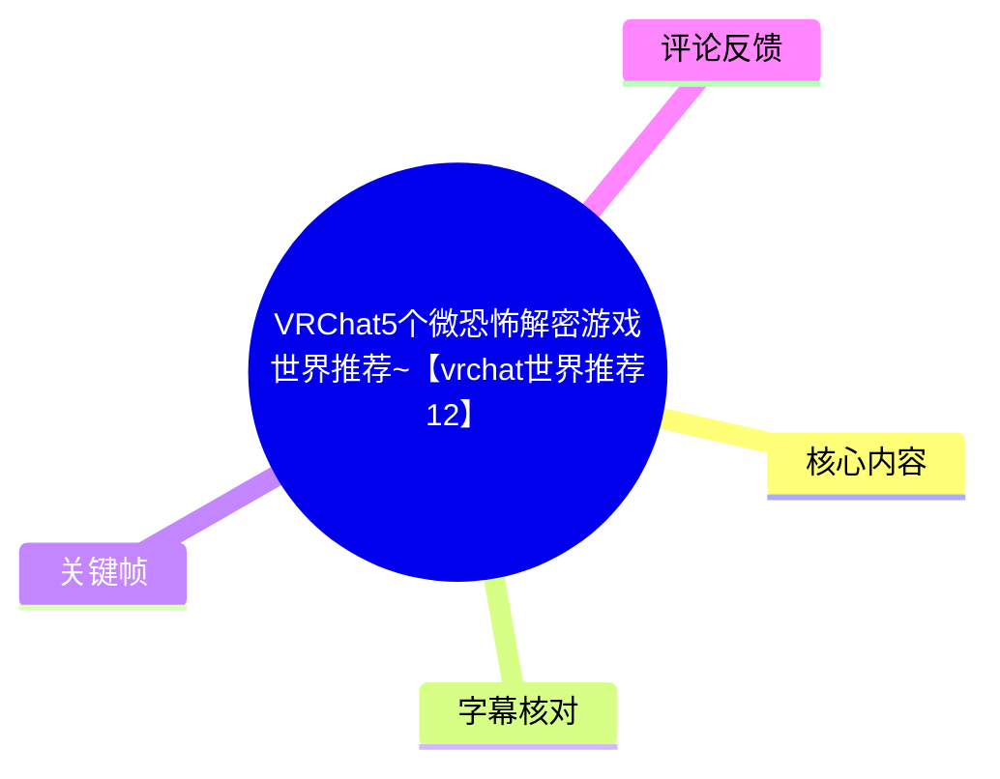
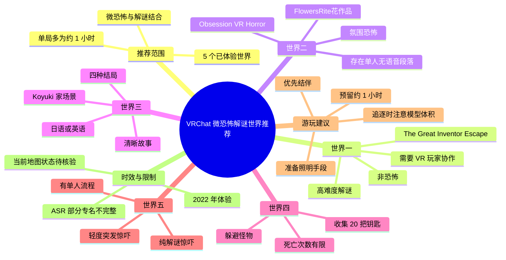
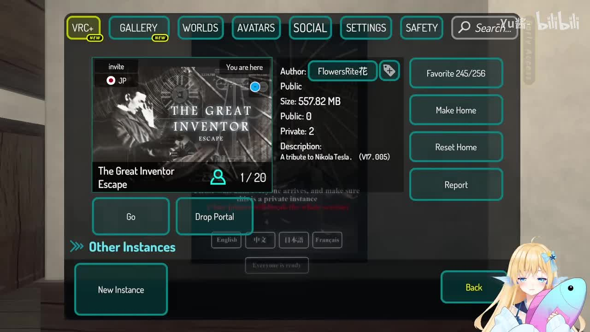
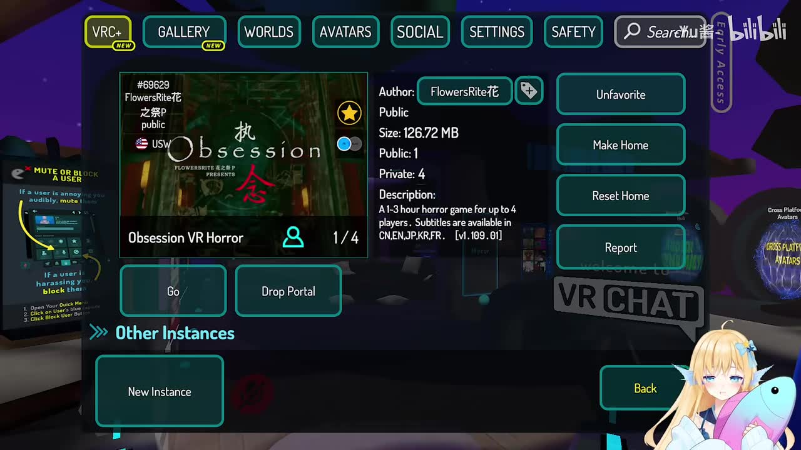
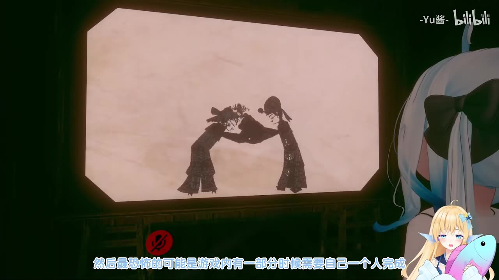
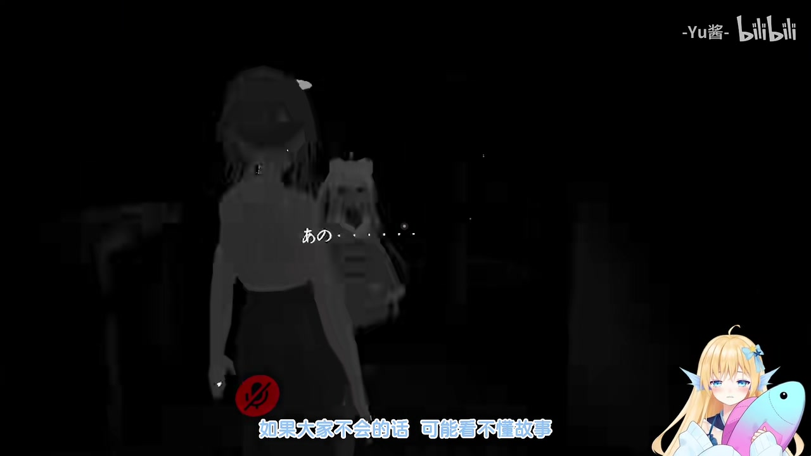

# VRChat5个微恐怖解密游戏世界推荐~【vrchat世界推荐12】

> 来源：[Bilibili 视频](https://www.bilibili.com/video/BV15B4y1i7Ju) 
> UP 主：小鱼一号w｜发布时间：2022-07-10｜视频时长：03:45｜平台：Steam / VRChat

## 小结

视频由 UP 主小鱼一号w推荐 5 个自己玩过的 VRChat 微恐怖解谜世界。这里的“微恐怖”并不意味着完全没有压力：不同地图分别包含高难度协作解谜、气氛恐怖、强制单人流程、黑暗场景、怪物追逐与闪现式惊吓等要素。

第一个世界是本期唯一被 UP 主明确归为“不恐怖”的作品，关键卖点是画面与高难度谜题；其首通预计约 1 小时，并且存在需要 VR 玩家配合的关卡。素材关键帧显示该世界名为 **The Great Inventor Escape**，由 **FlowersRite花** 制作。

第二个世界与第一个世界出自同一作者，是较早发布的恐怖解谜图。UP 主认为它以氛围恐怖为主，突脸内容较少；其最有压迫感的设计是某一段要求玩家独自完成，且听不到同伴语音。关键帧显示的世界条目为 **Obsession VR Horror（执念）**，同样标注作者 FlowersRite花。

第三个世界以清晰故事和氛围感见长，UP 主特别提到“Koyuki 家”令人害怕；其有四种结局，但语言支持似乎只有日语与英语，没有中文，因此不懂这两种语言的玩家可能无法理解剧情。第四、第五个世界则更偏向纯机制型恐怖解谜：前者要收集 20 把钥匙并躲避怪物，后者有轻度突发惊吓及单人段落。

本视频发布于 2022 年 7 月。VRChat 世界可能被作者下架、改名、重制或调整语言、人数、碰撞与难度；视频内约 1 小时的时长、多人条件和死亡次数均应视为当时体验描述，而非当前版本保证。进入前建议在 VRChat Worlds 搜索世界名与作者名，并确认实例人数限制、语言及可用平台。

## 思维导图

## 目录

- [视频背景、范围与时效性](#视频背景范围与时效性)
- [世界一：The Great Inventor Escape](#世界一the-great-inventor-escape)
- [世界二：Obsession VR Horror（执念）](#世界二obsession-vr-horror执念)
- [世界三：故事、多结局与语言门槛](#世界三故事多结局与语言门槛)
- [世界四：20 把钥匙与怪物追逐](#世界四20-把钥匙与怪物追逐)
- [世界五：轻度突发惊吓的纯解谜图](#世界五轻度突发惊吓的纯解谜图)
- [游玩步骤与配置建议](#游玩步骤与配置建议)
- [结论、限制与时效性](#结论限制与时效性)
- [字幕比对](#字幕比对)
- [评论分析](#评论分析)
- [处理记录](#处理记录)

## 视频背景、范围与时效性 [00:00](https://www.bilibili.com/video/BV15B4y1i7Ju?t=0)

UP 主开场说明，本期将推荐 5 个“微恐怖”的解谜游戏世界，且均为其亲自游玩后筛选的作品。视频并非完整攻略，没有给出逐题答案或世界链接，核心目标是帮助观众按恐怖强度、协作需求、叙事语言和预估时长挑选地图。

素材描述中标明游戏为 VRChat、平台为 Steam；不过视频本身同时强调 VR 玩家在特定关卡中的必要性。这意味着“能进入 VRChat”与“能顺利完成所有流程”是两回事：桌面模式或非 VR 玩家可能受动作、空间移动或交互限制影响。

视频在 2022 年发布。截至素材抓取时间（2026-07-13），未提供这些世界当前是否仍可搜索、是否更新、是否保留原玩法的验证结果。以下内容严格记录视频及热评中出现的信息，不将其延伸为当前版本的确定事实。

## 世界一：The Great Inventor Escape [00:14](https://www.bilibili.com/video/BV15B4y1i7Ju?t=14)

这是本期唯一被 UP 主明确称为“不恐怖”的世界。其特点不是惊吓，而是制作画面较好、解谜难度很高；UP 主直言其中不少谜题“很难”。

- **世界名**：The Great Inventor Escape（由关键帧界面读取）。
- **作者**：FlowersRite花（由关键帧界面读取）。
- **定位**：非恐怖、高难度解谜。
- **预估时长**：第一次通关约 1 小时。
- **多人条件**：可进入较多玩家；但 UP 主建议至少带一名 VR 玩家同行。
- **关键限制**：UP 主不剧透具体关卡，但明确说明存在“不带 VR 玩家就会非常困难”的环节。

> 图：关键帧展示 VRChat 内的世界信息页，可直接辨认世界名 **The Great Inventor Escape** 与作者 **FlowersRite花**。这比 ASR 中未能稳定识别的专有名词更可靠，也为玩家在 Worlds 中检索提供了准确线索。

热评进一步补充了一个**未经本次素材独立验证的玩家经验**：评论者“老白梦游了”称，地图中“绕圆环”关卡必须依赖 VR 玩家，否则难以通过；另一条热评则称，曾有两名 VR 玩家受阻，最后由使用全身追踪的玩家协助过关。两者都与 UP 主所说的 VR 玩家需求相互呼应，但具体关卡机制与全身追踪是否为必需条件，仍应以当前地图实测为准。

## 世界二：Obsession VR Horror（执念） [00:51](https://www.bilibili.com/video/BV15B4y1i7Ju?t=51)

UP 主介绍第二个世界时表示，它与上一个世界出自同一作者，是作者较早发布的地图，可能已有不少玩家体验过。它与早期“纸人”类游戏的画风有相似感，但该类比属于 UP 主的主观感受，并非作品的正式关联。

- **世界名**：Obsession VR Horror；封面同时显示“执念”（由关键帧界面读取）。
- **作者**：FlowersRite花。
- **世界说明文字**：关键帧可见描述为“1–3 hour horror game for up to 4 players”，并标注提供 CN、EN、JP、KR、FR 字幕；这是画面中展示的世界说明，未对其当前有效性做验证。
- **恐怖类型**：主要是气氛恐怖；UP 主称突脸很少。
- **玩法重心**：解谜。
- **高压环节**：游戏中有一部分必须独自完成，且无法听到其他伙伴的声音。
- **预估时长**：UP 主估计约 1 小时。

> 图：该帧明确展示 **Obsession VR Horror**、中文名“执念”、作者 FlowersRite花、实例人数“1/4”及英语描述。它一方面确认了世界检索线索，另一方面显示界面文字中的语言信息与 ASR 对后续地图语言的叙述不能混为一谈。

> 图：画面为暗色环境中的影像场景，字幕说明“游戏内有一部分时候需要自己一个人完成”。该帧直观体现本图恐怖感并非主要来自突脸，而是来自隔离、昏暗视觉与失去队友语音支援的设计。

热评“老白梦游了”提出该图“每个人剧情都是分开的，不能共享恐怖感觉不怎么好”，并称其曾花约 1 小时通关、认为谜题难度较大。这是单一玩家体验，能作为组队预期的参考，但不应替代视频原话，也不能确认所有版本或所有流程均如此。

## 世界三：故事、多结局与语言门槛 [01:31](https://www.bilibili.com/video/BV15B4y1i7Ju?t=91)

第三个世界是 UP 主个人较喜欢的一张图，理由是故事整体清晰、氛围感好。她特别提到其中的 **Koyuki 家** 很可怕；自己游玩时如果没有开启模型灯，会感到害怕。

- **优势**：故事表达相对清晰，氛围感较强。
- **场景印象**：Koyuki 家被 UP 主称为可怕。
- **照明建议**：可考虑开启模型自带灯光；这来自 UP 主的游玩感受，并非地图强制要求。
- **语言限制**：UP 主称“好像”只有日语与英语、没有中文；该措辞反映其并非对语言支持做了正式核验。
- **结局数量**：4 种，包括好结局和坏结局。
- **预估时长**：约 1 小时。

> 图：关键帧呈现低照度场景、角色剪影与日文文本，适合说明本图的黑暗氛围以及语言理解可能影响叙事体验。画面并不能单独证明只有日语与英语，因此语言结论仍以 UP 主的保留性表述记录。

这里需要区分两件事：第二个世界信息页上可见多语言字幕说明，而第三个世界被 UP 主评价为可能只有日语和英语；二者并不冲突，因为它们是不同地图。对于以故事和多结局为卖点的作品，若无法阅读日语或英语，可能仍能完成部分操作，但会损失剧情理解与结局判断依据。

## 世界四：20 把钥匙与怪物追逐 [02:16](https://www.bilibili.com/video/BV15B4y1i7Ju?t=136)

第四个世界被 UP 主定义为“纯纯的游戏图”，与前面几张具有较明显故事线的地图不同，重点在规则、收集和追逐。

### 目标与机制

1. 在各个房间中收集 **20 把钥匙**。
2. 同时躲避大怪物的追杀。
3. 用钥匙开启门并推进流程。
4. 注意被怪物击杀的次数；UP 主记忆中，玩家最多可能被杀 3 次，而第 4 次会导致无法继续游戏，但她本人也明确不确定是“第三次还是第四次”死亡后结束。

### 恐怖来源与预期

- 怪物设计本身在 UP 主看来“不算很恐怖”。
- 真正容易受惊的点在于每次开门时的“闪影”效果。
- 单局时长约 1 小时。

因此，这张图的风险并不只是视觉恐怖，还包括收集压力与有限容错。视频没有说明钥匙是否多人共享、怪物移动规律、复活机制或精确死亡上限，游玩时不应假定可以无限试错。

## 世界五：轻度突发惊吓的纯解谜图 [02:53](https://www.bilibili.com/video/BV15B4y1i7Ju?t=173)

第五个世界同样没有故事线，整体是“纯解谜吓人”的设计。UP 主认为它的氛围感不错，包含一点突发惊吓，但并非满屏式的高强度 Jump Scare，因此总体仍在可接受范围内。

- **玩法定位**：无明显故事线，以解谜与惊吓为核心。
- **恐怖强度**：有少量突发内容，但 UP 主认为不是全屏式冲击。
- **多人体验限制**：流程中也会出现玩家单独行动的阶段。
- **UP 主主观感受**：她尤其不喜欢原本与伙伴一起玩恐怖地图、却突然被分成独自一人的情况，认为这种设计很可怕。
- **时长信息**：ASR 在此处将时长识别为“游戏时常在办事”，语义不完整，无法可靠还原具体数值；因此不能据此声称本图时长。

视频结尾邀请已经玩过这些地图的观众在评论区分享感受，也建议尚未游玩的观众可在体验后留下反馈，供其他玩家参考。

## 游玩步骤与配置建议 [03:11](https://www.bilibili.com/video/BV15B4y1i7Ju?t=191)

以下是依据视频陈述与热评整理的准备顺序；其中标注“热评经验”的内容不等同于视频已验证事实。

1. **先用明确名称检索世界。**  
   已能从关键帧确认的名称包括 `The Great Inventor Escape` 与 `Obsession VR Horror`，作者均显示为 `FlowersRite花`。其余三图在提供的 ASR 与关键帧材料中未获得可可靠确认的正式世界名，不应自行补写。

2. **为单局预留足够时间。**  
   前四个世界中，UP 主多次给出“约 1 小时”的首通或游玩时长判断；若队伍首次游玩、解谜卡关或需要重试，实际时间可能更长。第二张图的世界信息页则显示“1–3 hour”，与 UP 主约 1 小时的体验估计并列存在，说明耗时可能因熟练度与版本而变化。

3. **第一张图优先安排 VR 玩家。**  
   视频明确提示存在需要 VR 玩家参与的困难关卡。热评还提到圆环关卡和全身追踪玩家的案例，但全身追踪并未被视频确认是硬性要求。

4. **明确语言与剧透预期。**  
   第三张图的剧情与四结局是体验重点；若没有日语或英语阅读能力，建议先接受可能看不完整故事的情况。若追求首次体验，避免直接搜索完整攻略。

5. **准备照明与降低恐惧的方案。**  
   对第三张图，UP 主提到开模型灯能缓解黑暗带来的恐惧。热评还建议使用带手电筒的“机甲喵喵”模型；这是评论者个人推荐，需自行确认该模型在当前 VRChat 环境、目标世界及性能限制下是否可用。

6. **追逐图使用体积较小、移动不受限的 Avatar。**  
   热评“饕餮-麒麟”提醒“执念”末段有追逐戏，建议使用较小的 Avatar，否则可能跑不过鬼。这是单条评论提供的经验，未由视频或关键帧验证，但对追逐场景具有实用参考价值。

7. **第四张图优先控制死亡次数。**  
   目标是收集 20 把钥匙并躲避怪物。由于视频对第几次死亡导致结束并不确定，稳妥策略是将每次被击杀都视为有限资源消耗，而非依赖可反复复活。

## 结论、限制与时效性 [03:28](https://www.bilibili.com/video/BV15B4y1i7Ju?t=208)

本期推荐可以按偏好概括为：

| 需求 | 可优先考虑的内容 | 视频依据 |
| --- | --- | --- |
| 不想玩恐怖、但愿意挑战难谜题 | 世界一：The Great Inventor Escape | 唯一明确“不恐怖”，但很费脑 |
| 偏好氛围恐怖与单人压迫感 | 世界二：Obsession VR Horror | 突脸少、重气氛，有独自且无语音的段落 |
| 重视剧情与多结局 | 世界三 | 故事清晰、4 种结局，但可能有语言门槛 |
| 喜欢收集、追逐和有限容错 | 世界四 | 收集 20 把钥匙、躲避怪物、死亡次数受限 |
| 希望惊吓强度相对可接受 | 世界五 | 少量突发惊吓、非全屏式冲击 |

需要注意的限制如下：

- 视频没有给出五张地图完整的可复制链接；目前仅两张地图可由关键帧确认名称与作者。
- ASR 没有时间戳，章节秒数依照视频总长和语义段落定位，适用于回看导航，不应视作逐字级切分。
- 第四张图的失败次数上限，UP 主本人也不能确认是第 3 次还是第 4 次死亡后结束。
- 第三张图的语言支持使用了“好像”这一保留说法；第二张图画面可见的语言列表不能被移用到第三张图。
- 视频为 2022 年体验记录；当前世界可用性、内容、性能、语言与跨平台支持均可能发生变化。

## 字幕比对 [03:35](https://www.bilibili.com/video/BV15B4y1i7Ju?t=215)

本次任务已执行 ASR；未提供可用的 Bilibili 站内字幕。

| 字幕来源 | 完整性 | 专有名词 | 时间轴 | 主要问题 |
| --- | --- | --- | --- | --- |
| Bilibili 站内字幕 | 不可用 | 无法评估 | 无法评估 | 素材明确说明未提供可用站内字幕。 |
| 本次 ASR 字幕 | 覆盖了开场、五张图的主要评价与结尾号召，但第五张图时长处不完整 | 多个地图正式名称未识别；“Koyuki”等词存在音译不确定性 | 未提供逐句时间戳，仅能依据内容段落定位 | 存在“游戏事件”“办事”等明显识别错误或截断；部分句子有繁简混用。 |

**最终字幕选择：**以本次 ASR 为正文基础，结合元数据、关键帧可见文字和上下文进行有限校正；没有站内字幕可供交叉合并。

**已校正或保留处理的重点：**

- ASR 开头的“微恐怖的解谜游戏事件”按上下文整理为“微恐怖的解谜游戏世界”，不改变其推荐对象为 VRChat 世界的事实。
- 关键帧可确认第一个世界为 **The Great Inventor Escape**、作者为 **FlowersRite花**。
- 关键帧可确认第二个世界为 **Obsession VR Horror（执念）**、作者为 **FlowersRite花**。
- “Koyuki 家”来自 ASR 音译，缺少可读取的世界标题或原文拼写，保留该写法并标示其不确定性。
- 第五张图的时长被识别为“在办事”，无法从现有素材可靠校正，因此正文不填写具体时长。

## 评论分析 [03:38](https://www.bilibili.com/video/BV15B4y1i7Ju?t=218)

仅处理可获取热评前三条。以下内容属于评论者个人经历，不作为已独立验证的地图事实。

1. **老白梦游了｜98 赞**  
   - 观点：第一张图的圆环关卡必须有 VR 玩家，否则很难通过；第二张图有一定恐怖感，但各玩家剧情分开，难以共享恐怖体验，解谜也偏难。  
   - 补充价值：为视频“第一张图最好带 VR 玩家”和“第二张图约 1 小时、解谜为主”提供玩家侧印证；还建议使用自带手电筒的“机甲喵喵”模型降低恐惧。  
   - 可信度边界：评论是具体游玩心得，但未说明地图版本、队伍人数或设备条件；“必须”与“不能共享”的适用范围无法确认。

2. **饕餮-麒麟｜36 赞**  
   - 观点：称“执念”末尾存在追逐段，建议使用体积较小的 Avatar，否则可能跑不过鬼。  
   - 补充价值：将第二张图的风险从解谜和孤立感延伸到追逐机制，并提出 Avatar 体积可能影响移动或碰撞表现。  
   - 可信度边界：视频正文未讲到这段追逐，也没有说明 Avatar 判定机制；该建议应视为规避风险的经验，而不是硬性配置规范。

3. **某安东星超能狐｜22 赞**  
   - 观点：称第一张图曾让两名 VR 玩家卡在某关，最后依靠全身追踪玩家才通过。  
   - 补充价值：说明第一张图的 VR 相关难点可能不只是“有无 VR”这么简单，部分交互或移动挑战可能受追踪能力影响。  
   - 可信度边界：这只是个案，不能推导出全身追踪为通关必备条件；与视频可确认的结论相比，更稳妥的做法仍是优先组成至少含 VR 玩家的队伍。

## 处理记录 [03:42](https://www.bilibili.com/video/BV15B4y1i7Ju?t=222)

- **Worker ID**：worker-mri3t0px-8b394786
- **模型**：gpt-5.6-terra
- **调用工具与素材**：任务提供的 Bilibili 元数据、视频素材清单、ASR 字幕、关键帧、热评 JSON；未使用素材之外的地图检索结果补充事实。
- **字幕选择**：站内字幕未提供可用版本；本次 ASR 已执行并作为主文本来源。对世界名仅在关键帧可见时校正，对无法可靠还原的 ASR 片段保留不确定性。
- **关键帧依据**：  
  - `frames/frame-001.jpg`：可读出 The Great Inventor Escape 与 FlowersRite花，用于确认第一张图的检索信息。  
  - `frames/frame-002.jpg`：可读出 Obsession VR Horror（执念）、作者、人数和世界描述，用于确认第二张图信息。  
  - `frames/frame-003.jpg`：呈现暗色影像与单人流程字幕，用于说明第二张图的孤立恐怖感。  
  - `frames/frame-004.jpg`：呈现黑暗环境与日文文本，用于辅助说明第三张图的氛围与语言门槛。  
  - 其余关键帧未在已提供画面说明中获得足够清晰、可归属且能增加事实信息的内容，未强行使用。
- **热评范围**：仅分析任务提供的热评前三条，未扩展至其他评论。
- **缓存清理**：素材中未提供缓存清理执行回执；无法确认任务运行环境是否已完成临时缓存清理。
- **未解决问题**：第三至第五个世界的正式名称未能从现有 ASR、元数据和可见关键帧可靠确认；第四张图精确失败次数上限、第五张图具体时长及全部地图当前状态均待实际进入世界核验。

## 评论分析

本次流程未获取到可用热评，因此不推断观众态度或额外结论。
