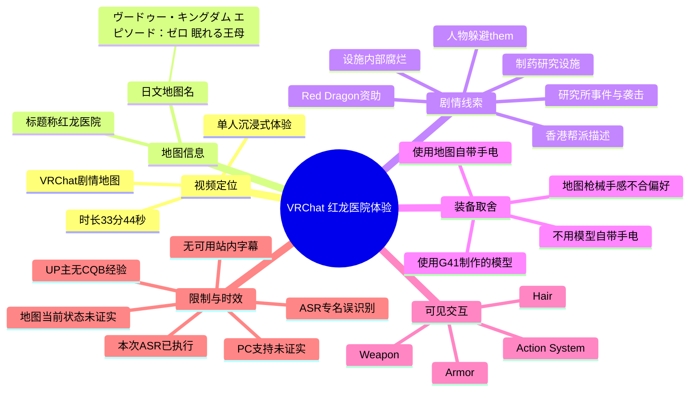
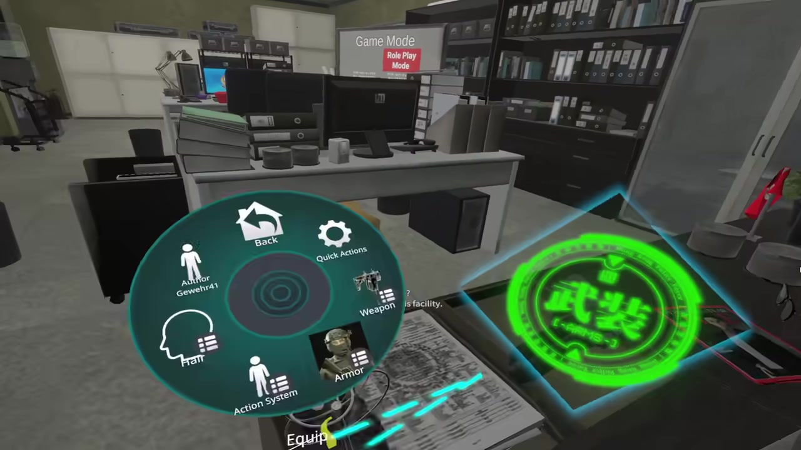
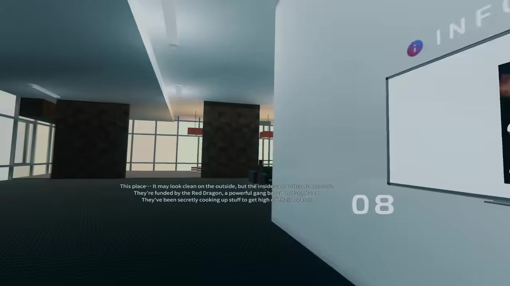
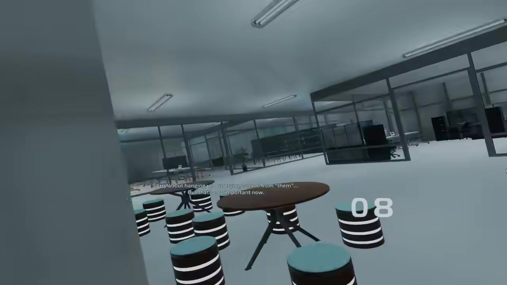

## 小结

这段视频是 UP 主「奥利泰尔」在 VRChat 中进行的单人剧情地图体验记录，标题称其为“红龙医院”，视频简介提供的地图名为 `ヴードゥー・キングダム エピソード：ゼロ 眠れる王母`。视频时长为 2024 秒（33 分 44 秒），画面规格为 1920 × 1080；标签涵盖 VR、丧尸、CQB、沉浸式体验与 VRChat。

现有画面和字幕线索显示，地图故事围绕一处制药研究设施展开：设施外观整洁，但内部被叙述为“腐烂至核心”；一股名为 **Red Dragon** 的势力被提及为资助方，英文画面字幕称其为“位于香港的强大帮派”。此外，人物对话还涉及躲避“them”、研究所事件、袭击、药物调查人员与电梯下楼等情节。不过，ASR 没有提供逐句时间码，且专名误识别明显，因此不能据此还原完整剧情或确认人物、研究所的官方译名。

视频最明确的体验经验来自简介中的装备取舍：UP 主认为地图自带枪械手感不够理想，改用 G41 制作的模型；但为保留场景的阴暗氛围，不使用模型自带手电筒，而采用地图自带手电。该方案的核心是将“武器操作手感”与“关卡光照氛围”分开选择。

这不是 CQB 教程。UP 主明确表示“没有 CQB 经验，随便玩玩”，因此视频适合作为 VRChat 剧情地图、环境叙事、个人 Avatar 装备功能和沉浸感取舍的参考，而不应被当作室内战术、武器安全或战斗效率的权威指导。

视频发布于 2024-03-24；本次素材抓取时间为 2026-07-12。当前素材未提供地图入口、World 当前可访问状态、PC Desktop 支持、推荐人数、性能要求或模型下载链接。VRChat 的地图、Avatar、权限与兼容性可能已发生变化，本文仅记录素材能够支持的历史体验信息。

## 思维导图



## 目录

- [视频定位、素材范围与时效性](#视频定位素材范围与时效性)
- [装备配置与沉浸感取舍](#装备配置与沉浸感取舍)
- [地图剧情与环境叙事线索](#地图剧情与环境叙事线索)
- [单人体验的可复用准备步骤](#单人体验的可复用准备步骤)
- [已知参数、限制与未证实事项](#已知参数限制与未证实事项)
- [字幕比对](#字幕比对)
- [评论分析](#评论分析)
- [处理记录](#处理记录)

## 视频定位、素材范围与时效性 [00:00](https://www.bilibili.com/video/BV1vi42197Lt?t=0)

视频标题为「【VRChat】单人沉浸式体验丧尸剧情神图 红龙医院」，UP 主为「奥利泰尔」。元数据表明，该视频于 2024-03-24 发布，时长 2024 秒，分辨率为 1920 × 1080，只有一个分 P，名称为「【VRChat】单人沉浸式体验红龙医院」。

### 可确认的基本信息

| 项目 | 内容 |
| --- | --- |
| BV 号 | `BV1vi42197Lt` |
| UP 主 | 奥利泰尔 |
| 发布时间 | 2024-03-24 |
| 视频时长 | 2024 秒，即 33 分 44 秒 |
| 分辨率 | 1920 × 1080 |
| 录制形式 | 单一分 P 的单人沉浸式体验记录 |
| 所属收藏 | `vrchat地图` |
| 视频标签 | VR、丧尸、CQB、沉浸式体验、VRChat |
| 地图名 | `ヴードゥー・キングダム エピソード：ゼロ 眠れる王母` |

“红龙医院”来自视频标题；地图的日文全名来自 UP 主简介。两者是否为官方中文名与日文 World 名的一一对应关系，当前素材没有额外的地图页面或作者说明可供验证，因此应优先使用简介中的日文名检索。

视频标签写有“丧尸”与“CQB”，但当前可用素材并未完整呈现敌人类型、战斗规则、任务目标或过关条件。因此，“丧尸剧情”可作为视频标题和标签所表达的题材定位，不应扩展为对敌人数量、AI 行为、生化设定或武器机制的具体断言。

### 时效性边界

视频发布时间与本次素材抓取时间间隔较长。对于 VRChat 内容，以下事项都有可能变动：

- World 是否仍可搜索、进入或公开；
- World 支持的平台与实例权限；
- Avatar 的功能、性能等级与兼容性；
- 地图内交互逻辑、字幕、光照或任务流程；
- 模型作者提供的版本与下载渠道。

因此，本文所说的“地图体验”“装备选择”均是对该视频素材的归纳，不构成当前版本的进入指南或兼容性保证。

## 装备配置与沉浸感取舍 [00:00](https://www.bilibili.com/video/BV1vi42197Lt?t=0)

UP 主在视频简介中给出了最明确的配置说明：

> 地图自带枪手感不好还是G41做的模型有感觉  
> 追求沉浸感就不用模型的手电筒了（地图自带的手电好阴间）  
> 没有CQB经验，随便玩玩

这里至少包含三层可区分的信息：

1. **对原生枪械的个人评价**：UP 主觉得地图自带枪械的手感不符合偏好。
2. **替代方案**：使用 G41 制作的模型，以取得更满意的武器交互体验。
3. **氛围优先的光照选择**：不用模型自带手电筒，而使用地图本身的手电筒。

“手感不好”“有感觉”“好阴间”均是 UP 主的主观体验，不是可量化的技术测试结论。素材没有提供枪械的后坐力、装填方式、扳机逻辑、碰撞、瞄具、弹药、模型版本或手电照射范围等参数，不能将这些描述写成地图或模型的客观性能结论。



> 图：该帧显示办公环境中的 VRChat 径向菜单，可见 `Weapon`、`Action System`、`Armor`、`Hair`、`Quick Actions` 等入口，并显示作者标记 `Gewehr41`。它的价值在于：画面直接证明录制角色具备独立的装备与动作功能菜单，能够支撑“使用自定义模型或装备功能”的讨论；但仅凭该帧不能确认各菜单的具体操作逻辑。

### 武器与照明分离选择

从 UP 主的说明可以整理出如下体验思路：

| 体验维度 | 选择 | 目的 |
| --- | --- | --- |
| 武器交互 | 使用 G41 制作的模型 | 满足个人对持枪手感的偏好 |
| 场景照明 | 使用地图自带手电筒 | 保留地图预设的阴暗、压迫氛围 |
| 外部补光 | 不使用模型自带手电 | 避免削弱地图原生恐怖感 |
| 游玩定位 | 非专业 CQB 演示 | 以个人沉浸式游玩为主 |

这一思路具有一定可迁移性：如果玩家希望兼顾熟悉的 Avatar 武器操作与地图原生氛围，可分别决定“用什么武器系统”和“用什么光照工具”。但是否能在具体 World 中正常工作，仍取决于地图对 Avatar、Pickup、交互层、镜头效果与玩家功能的限制。

### CQB 标签的正确理解

UP 主已经说明自己“没有 CQB 经验”。因此，视频中若出现室内移动、持枪视角或近距离场景，其价值主要在于展示 VR 第一人称沉浸感，不适合被视为以下内容的规范示范：

- 现实 CQB 战术动作；
- 枪口控制与人员协同；
- 房间搜索流程；
- 真实枪械安全规范；
- 高风险环境的战术决策。

## 地图剧情与环境叙事线索 [00:00](https://www.bilibili.com/video/BV1vi42197Lt?t=0)

现有素材中最可靠的剧情信息来自关键帧内可直接阅读的英语字幕。它们优先级高于本次 ASR 中的中文转写，因为 ASR 文本缺少时间码，且多个专名与句子存在明显不确定性。

### 研究设施与 Red Dragon 线索

关键帧中的英语字幕为：

> This place... It may look clean on the outside, but the insides are rotten to the core.  
> They're funded by the Red Dragon, a powerful gang based in Hong Kong.  
> They've been secretly cooking up stuff to get high off their rocks

在不超出原文证据范围的前提下，可以确认：

- 当前叙事对象是一处外表整洁的设施；
- 说话者认为该设施内部已经“腐烂至核心”；
- 字幕称设施受到 **Red Dragon** 资助；
- 字幕将 Red Dragon 描述为位于香港的强大帮派；
- 字幕还暗示设施存在秘密制造或秘密活动。

最后一句的口语表达依赖上下文，不能据此直接确认其制造物的具体类别，更不能推断为某种明确的药物、毒品、生化武器或感染源。



> 图：画面为一处明亮的现代设施走廊，墙面可见“08”编号；画面字幕直接给出了“外部整洁、内部腐烂”“由 Red Dragon 资助”“香港帮派”等剧情线索。这一帧是本文关于 Red Dragon 与研究设施关系的直接视觉依据。

### 躲避“them”的通讯片段

另一张关键帧显示人物以躲藏、窥视式视角观察办公区域，同时出现英文字幕：

> Sorry about hanging up. I'm trying to hide from “them”...  
> But that's not important now.

该画面支持以下表述：

- 角色曾中断通讯；
- 角色解释中断的原因是正在躲避某个被称为“them”的对象；
- 对话营造出设施内存在即时威胁的紧张感。

但“them”在这一帧中没有明确指代对象。不能仅因视频标题或标签中出现“丧尸”，就将其断言为丧尸；也无法确认是安保、帮派成员、实验体或其他角色。



> 图：画面呈现开放办公区、隔断、桌椅和人物从遮挡物边缘观察的视角，字幕说明角色正在躲避“them”。其价值在于展示地图并非仅依赖武器元素，而是通过空间遮蔽、办公环境与通讯文本共同建立紧张叙事。

### 本次 ASR 提供的补充剧情片段

本次 ASR 已执行，输出中包含如下片段：

- “这个药物调查官”
- “在本郎製藥研究所發生了事件”
- “救命”
- “我是張晋煒”
- “是藥物取締官”
- “这个研究所，所以才潜入的”
- “半年前”
- “確實是有個奇怪的標誌”
- “研究院被襲擊了”
- “到達了電梯，就直接下樓一層”
- “警察也在追求我”
- “And shooting by security without warning”

这些片段共同指向一种可能的叙事框架：药物调查人员与研究设施有关，设施发生事件或遭遇袭击，人物可能处于躲避或被追踪状态，流程中提及电梯与下一层。

但是，下列内容不可当作已确认的官方设定：

| ASR 内容 | 不确定性说明 |
| --- | --- |
| “本郎製藥研究所” | 可能是外语名称的音译、误听或机器翻译结果，未获关键帧或简介验证。 |
| “張晋煒” | 未获画面文字或其他素材验证，不应认定为人物官方姓名。 |
| “警察也在追求我” | 中文语义异常，可能是“追捕”“追踪”或其他表达的识别偏差。 |
| “奇怪的标志” | 缺少上下文，不能确认其是地图任务提示、场景文字还是误识别。 |
| “shooting by security without warning” | ASR 捕获到与安保未警告开枪有关的英文片段，但语法与上下文不完整，不能延伸出完整事件因果。 |

## 单人体验的可复用准备步骤 [00:00](https://www.bilibili.com/video/BV1vi42197Lt?t=0)

以下是基于视频简介、关键帧和可用字幕整理的准备思路。它们不是地图官方攻略，也不包含未提供的按键绑定、地图入口、通关路线或战斗机制。

### 步骤 1：以地图日文全名进行检索

优先使用 UP 主简介中的地图名：

```text
ヴードゥー・キングダム エピソード：ゼロ 眠れる王母
```

视频标题中的“红龙医院”适合作为中文内容识别词，但未必是 VRChat 中可直接搜索到的 World 标题。当前素材没有提供 World 链接、作者页或收藏链接，因此无法保证该名称在当前 VRChat 搜索中的可用性。

### 步骤 2：先确定体验目标

该视频强调的是“单人沉浸式体验”，而非速通、多人协作或战术训练。进入类似地图前，可将关注点放在：

1. 设施环境与房间编号等视觉线索；
2. 对话、通讯和字幕中的剧情信息；
3. 原生光照带来的压迫感；
4. Avatar 装备是否遮挡画面、字幕或场景交互；
5. 黑暗与紧张场景是否符合个人舒适度。

如果玩家对幽暗环境、突发音效、追逐感或恐怖叙事敏感，应提前保留退出实例、暂停游玩或降低沉浸强度的余地。

### 步骤 3：检查 Avatar 装备功能是否适配

视频中可见径向菜单含 `Weapon`、`Action System`、`Armor` 等入口，UP 主也说明使用了 G41 制作的模型。若尝试类似配置，应自行核实：

- Avatar 是否可正常加载；
- 武器功能能否在目标 World 中显示与触发；
- 外部装备是否挡住字幕、任务物品或视野；
- 是否会与地图原生交互产生冲突；
- 当前实例规则是否允许相关 Avatar 或功能。

素材没有提供该模型的下载地址、版本、授权方式、性能评级或具体操作方法，不能将评论区提及的模型名称视为已验证的替代方案。

### 步骤 4：保留地图原生照明

UP 主的选择是不用模型手电，使用地图手电。这可以理解为一种“氛围优先”的做法：

1. 先观察地图原生光照是否足以探索；
2. 若地图提供手电或照明交互，优先体验其原有设计；
3. 避免外部光源过亮而冲淡恐怖、神秘或封闭感；
4. 如黑暗导致不适、眩晕或难以辨识道路，则以个人舒适度优先。

视频没有提供地图手电的亮度、续航、开关方式、照射距离或是否与剧情触发绑定，因此这些均不能写成固定参数。

### 步骤 5：把 ASR 作为线索，而非任务说明

ASR 中出现“药物取缔官”“研究所”“袭击”“电梯”“下楼一层”等词语。它们可以帮助观看者回看剧情片段时定位关注方向，但由于缺乏逐句时间码与官方字幕校验，不应将其当作精确任务指令。

## 已知参数、限制与未证实事项 [00:00](https://www.bilibili.com/video/BV1vi42197Lt?t=0)

### 已知参数

| 分类 | 可确认内容 |
| --- | --- |
| 视频时长 | 2024 秒，33 分 44 秒 |
| 视频尺寸 | 1920 × 1080 |
| 分 P 数量 | 1 |
| 地图名称 | `ヴードゥー・キングダム エピソード：ゼロ 眠れる王母` |
| 体验形式 | 标题写明为单人沉浸式体验 |
| UP 主的枪械偏好 | 认为地图自带枪械手感不佳，倾向使用 G41 制作的模型 |
| UP 主的照明偏好 | 不用模型自带手电，使用地图自带手电 |
| 可见功能菜单 | `Weapon`、`Action System`、`Armor`、`Hair`、`Quick Actions` |
| 画面剧情文字 | 涉及 Red Dragon、香港、设施腐烂、躲避“them”等内容 |

### 无法确认的事项

| 问题 | 素材情况 | 当前结论 |
| --- | --- | --- |
| 是否支持 PC Desktop 模式 | 热评提出问题，但无视频答复或地图页面 | 无法确认 |
| 当前是否仍可进入地图 | 未提供当前 World 状态 | 无法确认 |
| 是否支持多人及推荐人数 | 标题只说明单人体验 | 无法推断 |
| 丧尸的具体设定 | 标题与标签出现“丧尸”，但无完整机制说明 | 无法确认 |
| 地图枪械具体问题 | 只有“手感不好”的主观评价 | 无法量化或复现 |
| G41 模型的版本和下载方式 | 简介未给出链接或版本号 | 无法确认 |
| Red Dragon 的官方中文译名 | 仅见英文字幕与标题“红龙医院” | 无法确认对应关系 |
| ASR 中人名与研究所名称 | 未获视觉文字验证 | 不作为官方设定采用 |
| 完整剧情顺序 | ASR 无时间码，关键帧无对应秒数 | 无法精确复原 |

### 内容使用边界

- 视频属于个人游玩记录，不是官方地图文档。
- UP 主自述无 CQB 经验，因此不能将体验过程用作专业操作教学。
- 评论区信息为用户发言，应视为待核实线索。
- 关键帧仅能证明其展示时刻的界面、环境和字幕，不能证明整段视频都存在相同状态。
- 本文所有时间轴链接使用 `t=0`，原因是提供的 ASR 与关键帧没有可验证的逐帧秒数；不能编造精确时间点。

## 字幕比对 [00:00](https://www.bilibili.com/video/BV1vi42197Lt?t=0)

本次任务中，**Bilibili 站内字幕未提供可用文件；本次 ASR 已执行**。由于不存在可用站内字幕，无法进行逐句一致性比对；正文采用“视频简介与关键帧可见英语字幕优先、ASR 作为辅助线索”的证据策略。

| 字幕来源 | 完整性 | 专有名词 | 时间轴 | 主要问题 |
| --- | --- | --- | --- | --- |
| Bilibili 站内字幕 | 未提供可用字幕，无法评估覆盖率 | 无法评估 | 无可用时间码 | 无字幕文件，无法用于逐句比对、校时或校正专名 |
| 本次 ASR 字幕 | 仅提供若干片段，未覆盖完整 33 分 44 秒内容 | 存在明显不可靠专名，如“本郎製藥研究所”“張晋煒” | 未提供逐句时间码 | 中英混杂、部分中文语义异常、专名可能为音译或误识别 |

### 最终字幕采用原则

1. **优先采用关键帧中直接可读的英语字幕。**  
   例如 `Red Dragon`、香港帮派、设施外部整洁而内部腐烂、角色躲避“them”等内容都有画面文字依据。

2. **以 UP 主简介补充体验配置。**  
   地图全名、G41 模型选择、手电筒取舍、无 CQB 经验均直接出自 UP 主描述。

3. **将本次 ASR 作为有限的剧情提示。**  
   ASR 可辅助识别“药物调查”“研究所事件”“袭击”“电梯”等主题，但不用于确认专名或精确剧情顺序。

4. **不强行校正未经证实的 ASR 专名。**  
   “本郎製藥研究所”“張晋煒”等表述未能通过关键帧或简介核验，保留为 ASR 原样线索，不写作官方名称。

## 评论分析 [00:00](https://www.bilibili.com/video/BV1vi42197Lt?t=0)

以下仅分析可获取的热评前三条，不将评论内容直接视为已验证事实。

### 1. Gewehr41：建议使用更新模型

> 两年前的老模型了 建议还是去找我的新模型玩 lime murk还可以在持步枪情况下直接从腰间拔手枪出来

- **观点概括：** 评论者认为视频中相关模型已经较旧，并建议尝试其所称的新模型；同时提到 `lime murk` 具备持步枪时从腰间拔手枪的功能。
- **补充价值：** 该评论提示了 Avatar 武器系统中“主武器与腰间手枪切换”的交互差异，可能影响 VR 沉浸体验。
- **可信度边界：** 评论者用户名与关键帧菜单中的 `Gewehr41` 存在表面关联，但仅凭用户名不能确认其身份、模型作者资格、功能描述或兼容性。`lime murk` 的名称、版本、取得方式和适配情况均未在当前素材中核实。

### 2. 嘁笨蛋：惊讶于 VRChat 的玩法形式

> 啊？？？VRchat还能这么玩？

- **观点概括：** 评论者对 VRChat 能呈现这种剧情、探索和第一人称沉浸体验感到惊讶。
- **补充价值：** 这反映视频的展示效果使观众意识到 VRChat 不仅具有社交用途，也可能承载叙事型 World。
- **可信度边界：** 这是主观感受，不包含可验证的技术结论；不能因此推断所有 VRChat 地图都具有相同质量或机制。

### 3. 方片SIX：询问 PC 是否可玩

> upup，这个图pc能玩吗？[星星眼]

- **观点概括：** 评论者关注地图是否支持 PC Desktop 模式。
- **补充价值：** 该问题指出观看者的实际门槛：视频以 VR 第一人称形式呈现，但潜在玩家不一定拥有 VR 设备。
- **可信度边界：** 这是一项提问，不是答案。当前视频简介、ASR、关键帧和可获取热评均未提供回复，故不能得出“PC 可玩”或“PC 不可玩”的结论。

## 处理记录 [00:00](https://www.bilibili.com/video/BV1vi42197Lt?t=0)

- **Worker ID：** `worker-mri3t0px-8b394786`
- **模型：** `gpt-5.6-terra`
- **任务素材：** 已提供 `merged.mp4`、`audio/audio.wav`、`frames/`、`info.json`、`comments/comments.json`、`subtitles/`、`asr/` 等输出路径。
- **工具与处理环节：** 视频元数据读取、音频提取、关键帧提取、评论获取、站内字幕检查、本次 ASR 转写。素材清单显示任务已完成，且 `warnings` 为空。
- **字幕选择：** 站内字幕未提供可用内容；本次 ASR 已执行。正文优先使用 UP 主简介与关键帧中可直接阅读的英语字幕，ASR 仅用于标注为不确定的补充剧情线索。
- **关键帧选择依据：**
  - `frames/frame-002.jpg`：可见 VRChat 径向菜单、`Weapon`、`Action System`、`Armor` 等入口，适合支撑模型装备与交互功能的讨论；
  - `frames/frame-003.jpg`：包含 Red Dragon、香港帮派与设施腐烂的英语剧情字幕，是叙事线索的直接证据；
  - `frames/frame-004.jpg`：包含躲避“them”的英语字幕及办公区环境，适合说明地图的躲避感、通讯叙事与空间氛围；
  - `frames/frame-001.jpg` 为近乎全黑画面，缺乏可解释的场景、界面或文字信息，因此未作为正文插图。
- **缓存清理：** 提供的素材清单未附缓存清理日志，无法确认是否已执行缓存清理；本文不对清理结果作未经证实的声明。
- **未解决问题：**
  - ASR 无逐句时间码，无法可靠建立精确台词时间轴；
  - 地图当前是否可访问、是否支持 PC Desktop、推荐人数及性能要求均未获证实；
  - G41 模型和评论中提及的 `lime murk` 未提供版本、链接或兼容性说明；
  - ASR 中的人名、研究所名称及部分异常中文句子无法通过现有素材校正。
