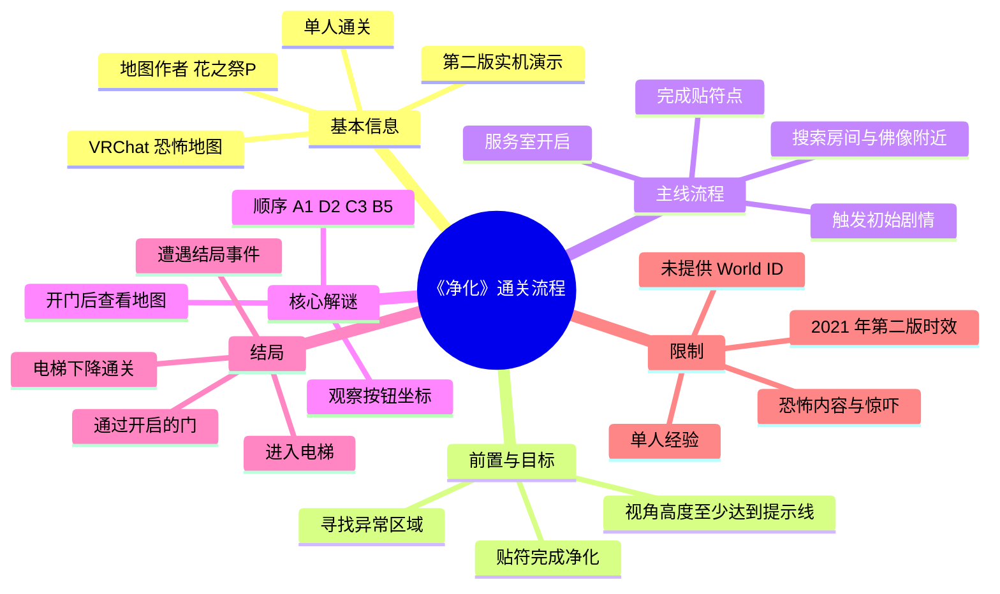
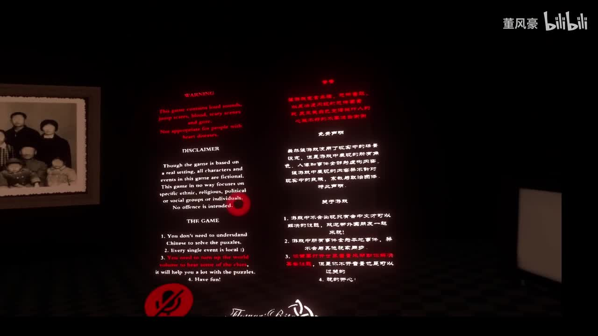
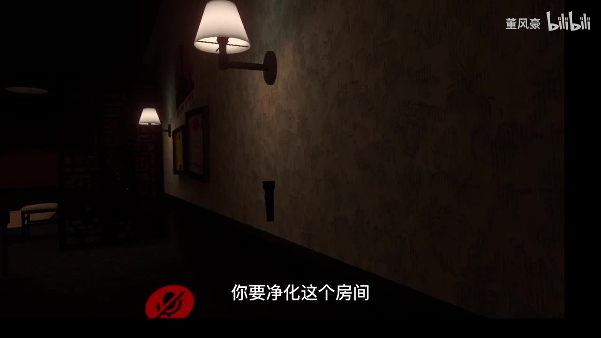
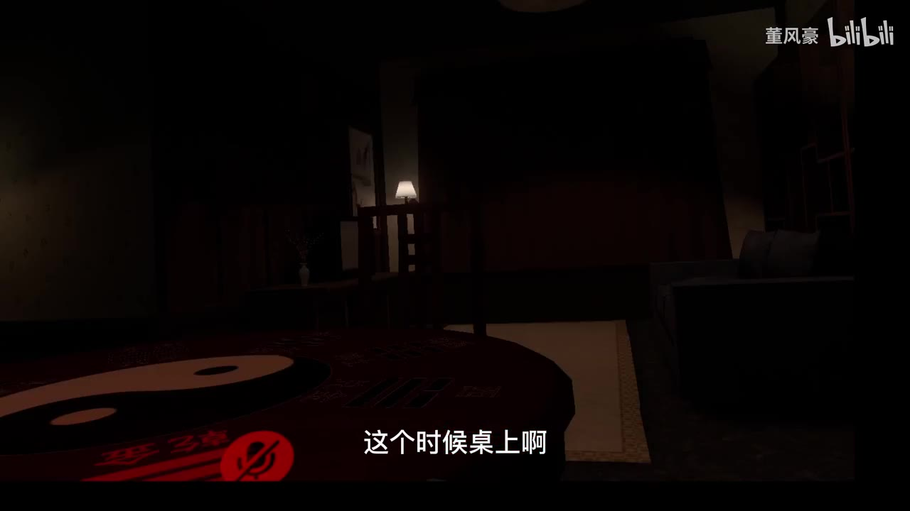
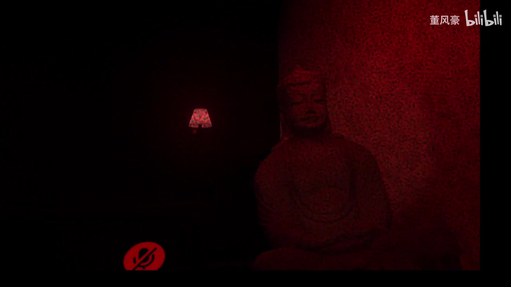

# vrchat恐怖地图《净化》通关流程

> 来源：[Bilibili 视频](https://www.bilibili.com/video/BV1jL411j7mz)<br>
> UP 主：董风豪｜分区/合集：vrchat地图｜发布时间：2021-12-17｜时长：10 分 32 秒<br>
> 地图：VRChat 恐怖地图《净化》第二版（视频分 P 名称为“净化第二版”）｜简介署名作者：花之祭P

## 小结

本视频是对 VRChat 恐怖地图《净化》的一次单人实机通关演示。UP 主一边游玩、一边口述关键交互与解谜逻辑，核心目标是对场景中带有异常/红色提示的区域进行“净化”，即在相应位置完成贴符操作，并在后段通过地图线索解开按钮机关。

最关键、可直接复用的信息是最终机关的输入顺序：**A1 → D2 → C3 → B5**。视频中说明，机关面板含有 A、B、C、D 等坐标式标记；真正的解法来自开门后房间内的一张地图：按地图上点位自上而下读取，形成上述四个坐标。UP 主置顶式热评也以 `a1.d2,c3.b5` 复述了这一顺序，可作为视频口述的交叉印证。

流程并非纯解谜：进入地图后需要注意初始视角高度，UP 主称“至少要这么高”；随后在房间、桌边、佛像附近及其他角落寻找贴符点。完成一定数量的净化后，服务室开启，再进入按钮谜题与电梯结局。因此，实操时比起只记住密码，更应优先完成全场景的贴符互动、留意剧情触发和新开门。

视频呈现的是单人游玩经验。UP 主多次表示害怕、可能需要摘下头显，这说明恐怖氛围与突发剧情会影响操作稳定性；不过其结尾明确称该地图在 **PC 和 VR** 上均可游玩。视频未提供地图 World ID、进入方式、版本号以外的更新信息，也未验证多人模式的流程差异。

时效上，视频发布于 2021 年 12 月，记录的是当时的“第二版”流程。VRChat 世界内容、交互物位置、谜题逻辑及可访问性均可能在此后变动；本文将密码和步骤限定为该视频版本的实录，不将其视为当前版本的保证。

## 思维导图



## 目录

- [视频背景、版本与前置提示](#视频背景版本与前置提示)
- [净化机制：寻找并贴符](#净化机制寻找并贴符)
- [场景搜索、剧情触发与服务室](#场景搜索剧情触发与服务室)
- [核心解谜：地图推导按钮顺序](#核心解谜地图推导按钮顺序)
- [离开房间、电梯与通关结局](#离开房间电梯与通关结局)
- [完整操作清单](#完整操作清单)
- [关键参数、经验与限制](#关键参数经验与限制)
- [字幕比对](#字幕比对)
- [评论分析](#评论分析)
- [处理记录](#处理记录)

## 视频背景、版本与前置提示 [00:00](https://www.bilibili.com/video/BV1jL411j7mz?t=0)

视频开头，UP 主说明自己将单人游玩，并介绍该地图是中文创作者制作的恐怖地图。视频简介中给出的地图作者为**花之祭P**；ASR 将该名称多次识别为“花枝GP”，属于语音识别误差，本文以视频元数据简介为准校正。

画面中的提示板包含免责声明与游戏说明。根据可辨认的英文/中文画面信息，游戏强调以下事项：

1. 不必理解中文才能解决谜题；
2. 每个故事仅在本地保存；
3. 建议将游戏内音量调高，声音有助于解谜；
4. 祝游玩愉快。

这些说明中，“提高音量有助于解谜”与视频中出现的收音机、电话声音相互呼应，但视频没有完整演示所有音频线索是否为通关必需条件，不能进一步推断其具体作用。



> 图：画面展示中英文免责声明及游戏提示。它直接支持“声音可能辅助解谜”“不要求理解中文”等前置信息，也表明视频进入的是带有明确内容提示的恐怖地图环境。

UP 主还提到，进入后“视角至少要这么高”，并在高度达到要求后开始探索。视频没有给出数值、菜单路径或具体校准方式，因此只能确认**存在最低视角高度要求**，无法据此提供准确的身高/摄像机参数。

## 净化机制：寻找并贴符 [00:35](https://www.bilibili.com/video/BV1jL411j7mz?t=35)

视频将基础玩法概括为“净化这个房间”。从 UP 主的操作说明可整理为：

- 在环境中寻找出现红色异常提示的区域或可交互位置；
- 对应位置会有符纸/贴符目标；
- 在目标位置完成贴符；
- 当一个区域的符纸均完成后，UP 主称“天上一张符”，以此判断该处已完成净化。

这里“天上一张符”的具体视觉表现和是否适用于全部区域，受原视频暗场与 ASR 表述影响，无法完全确定；但“按红色/异常点位搜索、逐一贴符”的主线机制是明确的。



> 图：暗色走廊画面中直接出现“你要净化这个房间”的字幕。该关键帧清楚说明本关的主任务不是击败敌人，而是完成房间净化交互。

UP 主在初始房间内提到桌上有“挂着……几个方位、几个符就好了”，ASR 在此处对物品名称及句意识别不完整。可确认的是：**桌面/桌边存在与符纸数量或方位有关的观察信息**。实际游玩时，应检查桌面、墙面、家具侧边和走廊尽头等容易漏看的区域，而不宜仅在正面视野寻找。



> 图：关键帧展示室内桌面、唱片机/桌面设备以及后方生活空间。它说明贴符/线索点可能位于家具附近，具有提醒玩家进行近距离环视搜索的价值；画面本身不能证明该设备一定是必需谜题物件。

## 场景搜索、剧情触发与服务室 [02:00](https://www.bilibili.com/video/BV1jL411j7mz?t=120)

在贴符过程中，UP 主先后提到佛像附近存在交互点，并表示某些操作会“触发剧情”。视频中出现诵念式音频及恐怖氛围变化，UP 主在单人状态下明显感到紧张。对流程而言，这一段的可操作结论是：

1. 贴完当前可见符纸后，不要立即离开；
2. 检查佛像周边和已经探索过的房间；
3. 等待或主动触发剧情反馈；
4. 若仍显示尚缺符纸，应回查先前区域、墙角和门边。



> 图：画面展示红色光效下的佛像与走廊空间，对应视频中提到的佛像区域及恐怖剧情氛围。它的价值在于标记一处应重点检查的场景节点，而非证明佛像本身就是唯一解谜机关。

视频中，UP 主会口头数剩余数量，如“还差几个”“差三个”“还差一个”。这些数字是其当时进度反馈，并没有形成完整、稳定的全图符纸总数记录，因此本文不把它们整理为固定的收集数量。更可靠的做法是以游戏内是否还存在未完成的贴符点、是否出现开门或剧情推进为准。

之后，UP 主发现并确认“服务室开了”。这意味着前置净化和/或剧情触发完成后，地图会开放新的门或空间。视频未明确区分“服务室开启”的唯一触发条件究竟是全部贴符、某个剧情还是两者组合；实操中应把它视为**完成当前阶段后出现的进度标志**。

## 核心解谜：地图推导按钮顺序 [06:25](https://www.bilibili.com/video/BV1jL411j7mz?t=385)

服务室开启后，视频进入唯一被明确完整讲解的机关谜题。UP 主提醒这个开关“有顺序”，并读出面板上的坐标式按钮标记，包括：

- `A1、A2、A3、A4`
- `B1、B2、B3、B4`
- `C3、C4、C5`

ASR 对完整按钮列表有遗漏或混杂，视频口述中又出现 `D2`，因此不能把上述 ASR 列表当成面板的完整布局；能够确定的是，机关使用“字母 + 数字”的坐标标记，并且正确答案含有 `D2`。

### 线索位置与推导方法

UP 主说明，解谜线索不在佛像物件上，而是在“把门开开”后房间内的一张地图。其推导过程如下：

1. 地图上的第一个点对应 `A1`；
2. 第二个点按“从上往下”的位置读取，对应数字 `2`，形成 `D2`；
3. 后续点位以同样方法读取；
4. 最终得到四步顺序：`A1、D2、C3、B5`。

视频原话中“同理 C3B5”，结合后续实际输入和置顶热评，可确认最后两项应拆分为 `C3` 与 `B5`，而不是一个连续编码。

### 可直接使用的输入顺序

```text
A1 → D2 → C3 → B5
```

输入正确后，UP 主确认门开。热评第一条由 UP 主本人发布，内容为“最后的解密顺序：a1.d2,c3.b5”，与视频流程一致；该评论是对结果的重复说明，不是独立于视频外的额外机制证据。

| 项目 | 视频中可确认的信息 |
| --- | --- |
| 谜题入口 | 服务室/新开启区域内的开关机关 |
| 线索来源 | 开门后房间里的一张地图 |
| 读取逻辑 | 根据地图点位顺序读取对应坐标 |
| 必需输入数 | 4 个 |
| 正确顺序 | `A1 → D2 → C3 → B5` |
| 成功反馈 | 门开启 |

> 注意：视频未清晰给出机关面板的完整排布、失败输入后的惩罚或重置规则。若当前地图版本发生变更，应优先以地图内线索为准。

## 离开房间、电梯与通关结局 [08:05](https://www.bilibili.com/video/BV1jL411j7mz?t=485)

机关门开启后，UP 主说明“基本上这就结束了”，接着前往出口方向并进入电梯。但视频立即强调“没有那么简单”：在接近/进入出口阶段，出现英文语音 **“Why are you leaving me?”**，UP 主随即翻译为“你为什么要离开我”，之后还遭遇一次恐怖事件。

这一段的流程重点不是新的密码，而是不要把“门开”误判为即时结算：

1. 确认机关门已开启；
2. 穿过新通道前往电梯；
3. 面对结局阶段的声音与恐怖事件；
4. 进入电梯；
5. 等待电梯下降和结局文字/场景反馈。

UP 主在电梯中确认开始下降，期间画面出现“电梯事故故障”“鬼门关”等具有恐怖叙事色彩的文字/口述内容，最后给出“通关了”的结论。由于 ASR 对这些文字的识别质量不稳定，本文不将其延伸解释为地图明确的世界观设定。

视频结尾，UP 主评价花之祭P制作的游戏“非常棒”，并希望作者能做出更好的地图；同时称 **PC 和 VR 都可以玩**。这是 UP 主对该视频版本体验的评价与兼容性陈述，未提供最低配置、控制器要求或 PC 模式的具体操作差异。

## 完整操作清单 [00:20](https://www.bilibili.com/video/BV1jL411j7mz?t=20)

以下按视频展示顺序整理。带有“建议”的内容是基于视频操作形成的实用归纳，不是地图明示规则。

1. **调整初始视角高度**  
   确保视角达到地图提示的最低高度。视频只说明“至少要这么高”，没有数值。

2. **阅读入口提示并保持音频可听**  
   画面提示建议提高游戏音量。建议在能承受恐怖音效的前提下保留声音，以免遗漏声音线索。

3. **开始净化房间**  
   在走廊、室内、桌边、墙面和角落寻找红色异常/可贴符位置。

4. **逐一完成贴符**  
   看到符纸目标后完成交互；完成区域后留意画面和环境是否给出净化完成反馈。

5. **检查佛像与剧情点**  
   佛像附近存在视频实际探索到的重点区域。触发剧情后，继续查看是否出现新的符纸点或新开门。

6. **确认服务室是否开放**  
   当 UP 主完成前段进度后，服务室开启。若门未开，应回查是否漏掉贴符点。

7. **在新区域寻找地图线索**  
   不要将佛像当作按钮谜题的唯一线索；视频明确指出线索在开门后的房间地图中。

8. **按顺序操作按钮**  
   输入：
   ```text
   A1 → D2 → C3 → B5
   ```

9. **通过开启的门前往电梯**  
   开门后仍有结局恐怖事件，不要因遭遇语音或惊吓而中断流程。

10. **进入电梯并等待下降结束**  
    UP 主以电梯下降后的反馈认定通关完成。

## 关键参数、经验与限制 [09:55](https://www.bilibili.com/video/BV1jL411j7mz?t=595)

### 视频中明确出现的参数/事实

| 类别 | 内容 | 可靠性说明 |
| --- | --- | --- |
| 视频时长 | 632 秒（10 分 32 秒） | 元数据 |
| 地图版本称呼 | “净化第二版” | 视频分 P 元数据 |
| 地图作者 | 花之祭P | 视频简介；优先于 ASR 误识别 |
| 游玩人数 | 单人实机演示 | 视频内容 |
| 支持方式 | PC 和 VR 都可以玩 | UP 主结尾陈述，未给出技术细节 |
| 初始视角 | 需至少达到提示高度 | 有要求，无数值 |
| 主任务 | 搜索并贴符净化房间 | 视频口述与画面 |
| 最终密码 | `A1 → D2 → C3 → B5` | 视频讲解与 UP 主热评一致 |
| 结局出口 | 电梯下降 | 视频实机过程 |

### 可迁移的通关经验

- **先清场，再解锁。** 视频显示，前段的贴符净化与剧情推进是开启后续区域的前提。卡关时优先回查漏点，而不是反复尝试机关。
- **将环境音视为潜在线索。** 入口提示明确建议提高音量，视频也出现收音机、电话和语音；但不要把每段音频都当作密码，视频未证明其全部具有强制解谜功能。
- **对坐标类谜题保留“线索优先”原则。** `A1 → D2 → C3 → B5` 适用于视频录制版本；真正可泛化的方法是先找到地图，再按点位顺序映射到按钮坐标。
- **为恐怖剧情预留操作余量。** UP 主因紧张多次停顿并提到摘头显。独自游玩时建议使用舒适的移动设置、适当音量，并在不适时暂停。

### 信息限制与时效性

1. 本视频为 2021 年 12 月的第二版流程，不能保证当前 VRChat 世界仍可访问，亦不能保证交互位置与谜题未调整。
2. 视频未提供 World ID、搜索关键词、作者主页链接、推荐人数、最低配置和具体进入步骤。
3. 视频只完整验证了单人通关，不足以证明多人模式是否共享进度、是否需要全员操作或会触发不同事件。
4. ASR 缺少逐句时间戳，且暗场、惊吓音效和口语化表达造成若干专有名词与场景文字误识别。
5. 本文仅依据提供的视频、元数据、关键帧、ASR 和可获取评论整理；没有补充外部检索信息。

## 字幕比对 [00:00](https://www.bilibili.com/video/BV1jL411j7mz?t=0)

本次任务**已执行 ASR**。未提供可用的 Bilibili 站内字幕，因此不能进行逐句对照或从站内字幕补足时间戳。

| 字幕来源 | 完整性 | 专有名词 | 时间轴 | 主要问题 |
| --- | --- | --- | --- | --- |
| Bilibili 站内字幕 | 未提供可用字幕 | 无法评估 | 无法评估 | 无可用文本，不能用于转写校对 |
| 本次 ASR 字幕 | 覆盖整段语音的大致内容，但有大量口语断句与漏识别 | 存在误识别 | 未提供逐句时间戳 | 人名、佛教词汇、环境文字及个别句子识别不稳定 |

### 最终字幕采用与校正

正文以**本次 ASR**作为口述内容来源，并以视频元数据、关键帧、前后语境和 UP 主热评进行有限校正；没有站内字幕可供合并。主要校正项如下：

| ASR 表述 | 采用表述 | 校正依据 |
| --- | --- | --- |
| “花枝GP”“花极GP” | 花之祭P | 视频简介明确写有“vrchat地图 《净化》作者：花之祭P” |
| “进化这个房间” | 净化这个房间 | 视频标题为《净化》；关键帧字幕显示“你要净化这个房间” |
| “A1、D2、C3、B5”附近的零散重复 | `A1 → D2 → C3 → B5` | UP 主口述操作成功，且热评重复给出相同顺序 |
| “这屋有张地图” | 开门后房间内有一张地图 | ASR 上下文明确用于说明机关解法 |
| “Why are you leaving me?” | 保留英文并译为“你为什么要离开我” | ASR 识别出英文，UP 主紧接着给出中文解释 |

对于收音机、电话、诵念音频、场景文字以及符纸总数，ASR 有明显不完整或错字，且缺乏站内字幕佐证，本文只记录能够由上下文确认的程度，不将其扩写为确定设定。

## 评论分析 [10:20](https://www.bilibili.com/video/BV1jL411j7mz?t=620)

仅处理本次可获取的热评前三条。评论属于用户表达或补充，不自动等同于独立验证事实。

1. **董风豪（3 赞）：`最后的解密顺序：a1.d2,c3.b5`**  
   - 观点/补充：直接给出最终机关密码。  
   - 价值：评论者是视频 UP 主，且内容与视频内的讲解、实际输入结果一致，因此对检索通关步骤有较高参考价值。  
   - 边界：该评论没有说明地图版本范围、输入失败机制或多人差异；其可信度来自与视频本身一致，而不是额外证据。

2. **Momoroko（2 赞）：`看着就不错`**  
   - 观点/补充：对地图观感表示正面评价。  
   - 价值：反映至少有观众认可视频呈现出的地图氛围。  
   - 边界：未涉及玩法、技术性能或谜题正确性，不能作为质量、可玩性或兼容性的验证。

3. **希尔希尔希尔薇（1 赞）：`感谢`**  
   - 观点/补充：表达对攻略内容的感谢。  
   - 价值：侧面表明该流程视频对部分观众有实用帮助。  
   - 边界：没有描述是否已按攻略成功通关，不能作为流程在其他版本中仍然有效的证据。

## 处理记录

- Worker ID：`worker-mri3sp0r-0d15ab26`
- 模型：`gpt-5.6-terra`
- 调用工具与素材：任务提供的视频元数据、素材清单、12 张关键帧路径、ASR 字幕、可获取热评前三条；未引入未提供的外部资料。
- 使用的应用工具：视频素材整理结果（`merged.mp4`、`audio/audio.wav`、`frames/`、`comments/comments.json`、`asr/`）；本次 ASR 已执行。
- 字幕选择：站内字幕未提供可用版本；采用本次 ASR 为主体，并用元数据、关键帧、上下文及 UP 主热评校正“花之祭P”“净化”“A1 → D2 → C3 → B5”等关键信息。
- 关键帧选择依据：  
  - `frames/frame-001.jpg`：入口声明和游戏提示，支撑前置条件；  
  - `frames/frame-002.jpg`：直接出现“净化这个房间”，支撑主任务；  
  - `frames/frame-003.jpg`：展示桌边室内搜索环境，说明需检查家具周边；  
  - `frames/frame-004.jpg`：展示佛像及红色恐怖场景，对应剧情/重点搜索区域。  
  未将未展示内容的其他关键帧强行用于正文，避免从未核验画面中推断事实。
- 评论范围：仅分析成功获取的热评 3 条，未扩展到普通评论或不可获取内容。
- 缓存清理：素材清单未提供缓存清理执行结果；未声称已清理，保留 `merged.mp4`、音频、帧图、ASR 和评论产物的记录状态。
- 未解决问题：缺少地图 World ID、当前可访问状态、完整符纸数量、完整按钮布局、多人模式规则、PC/VR 具体配置与站内字幕；这些内容均不能依据现有素材补写。
