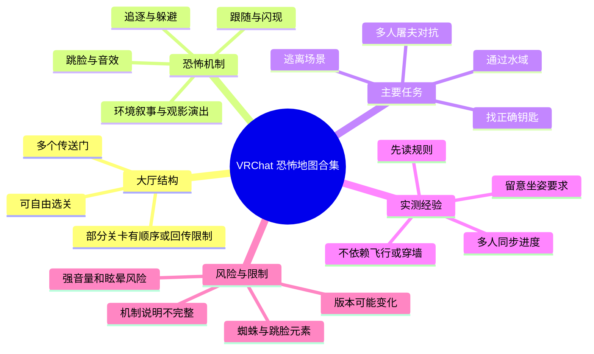
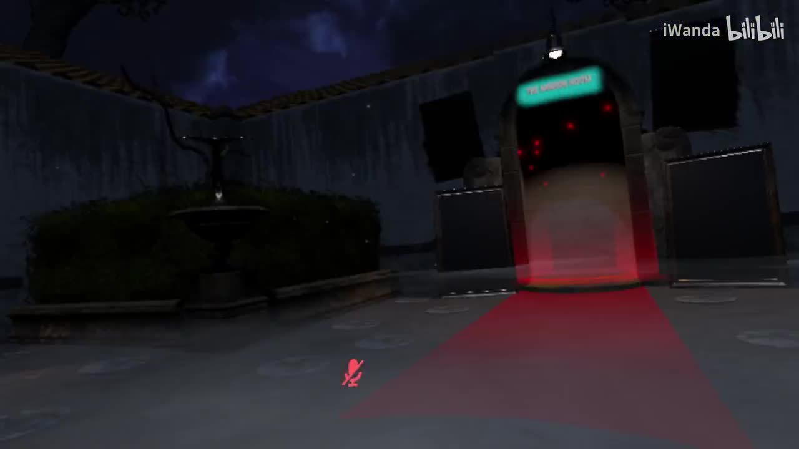
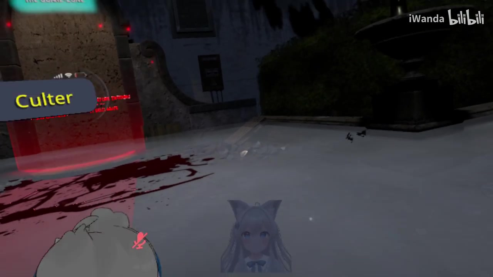
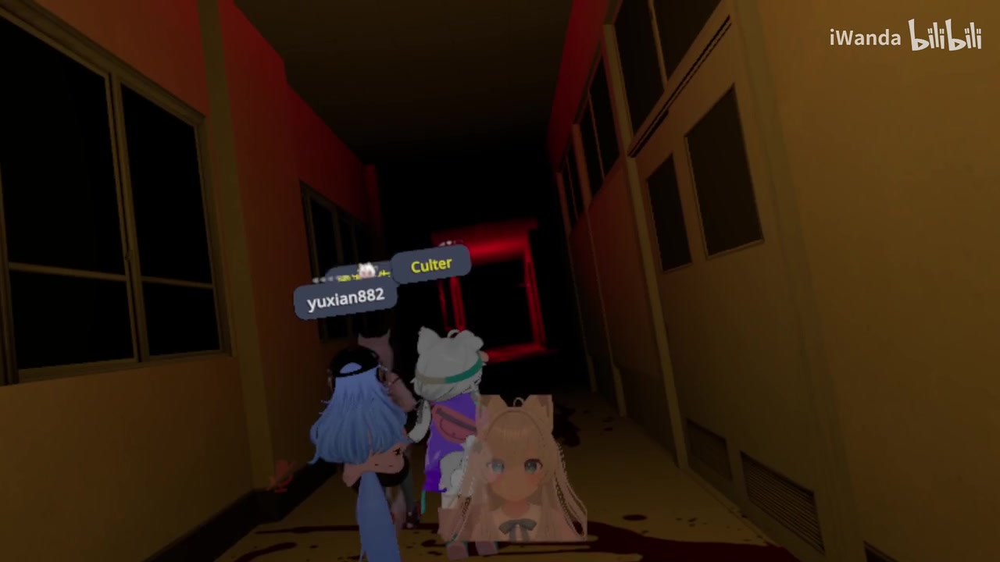
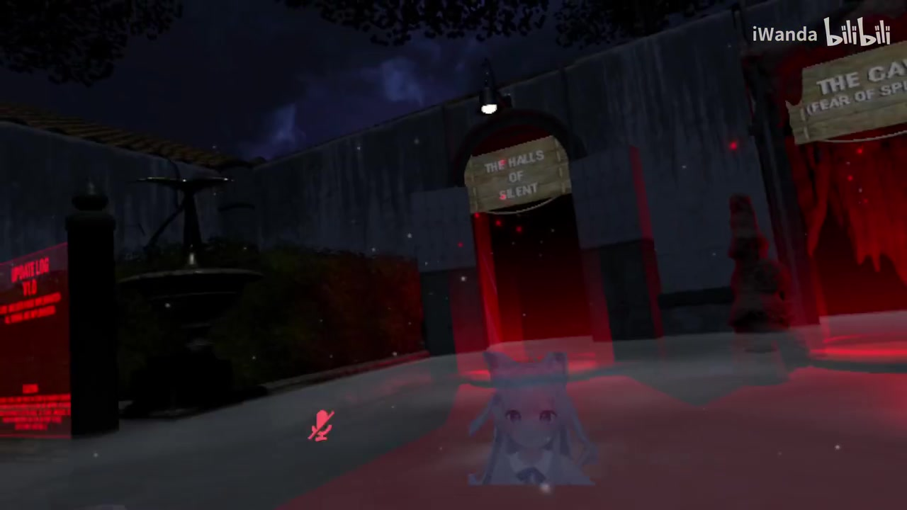

# 【vrchat】恐怖地图复活之大合集

> 来源：[Bilibili 视频](https://www.bilibili.com/video/BV1d84y1U7ET) 
> UP 主：水水兑水｜发布时间：2023-09-29｜时长：52 分 40 秒｜分辨率：1920×1080 
> 视频简介：`officialSayon - The Hub`

## 小结

视频记录了一组玩家在 VRChat 恐怖地图合集大厅中连续体验多个短关卡的过程。合集的组织方式是：大厅内设有多个传送门，门后各自对应一关；玩家可自由选择入口，但视频中提到部分关卡存在推荐或实际的顺序关系，未按顺序进入时可能被送回大厅。

内容重点不是某一张地图的完整攻略，而是对合集关卡机制与恐怖表现的实测：早期部分关卡以跟随、视觉异化、贴脸和环境音效为主，威胁较低；后续出现追逐、躲避、找钥匙、逃离路径、观影式演出、游泳躲鲨鱼，以及多人屠夫对抗等玩法。UP 主多次肯定作者的场景想象力、怪物建模和物理交互，并认为多数单关时长较短，适合作为新人恐怖地图的集中体验入口。

可迁移的游玩经验包括：进图前先读入口说明；对追逐图优先确认终点、钥匙和可通行路线；多人找钥匙时同步“已取钥匙”和“未探索房间”；剧场地图必须注意坐姿/座位限制；若发现飞行、穿墙、传送等异常，不应将其当作正常通关方法。视频还反映出世界音量设置未必能压低某些角色或模型发声，需按实际菜单与对象属性进一步排查。

视频展示的恐怖元素包括蜘蛛、玩具熊、飞蛾、小丑/笼中怪、恐龙、鲨鱼、木偶、修女、贞子式爬行怪、舔食者式怪物等；对跳脸、蜘蛛、追逐、强噪声音效敏感的玩家应谨慎进入。热评中也有观众明确希望寻找“不靠跳脸杀”的地图，说明惊吓方式是该合集的实际筛选维度之一。

这不是新闻报道，也未给出世界链接、作者主页、版本号、更新日志或准确关卡总数。视频发布于 2023 年，VRChat 世界的可访问性、机制、房间规则、性能表现和入口内容均可能在之后变化；文中所有玩法均以视频录制时的实况为准，而非当前可复现承诺。

## 思维导图

## 目录

- [背景、范围与时效性](#背景范围与时效性)
- [合集大厅与入图方式](#合集大厅与入图方式)
- [前段短关：跟随、蜘蛛与物理手部](#前段短关跟随蜘蛛与物理手部)
- [中段关卡：玩具熊、飞蛾与追逐](#中段关卡玩具熊飞蛾与追逐)
- [任务型关卡：钥匙、水域与木偶](#任务型关卡钥匙水域与木偶)
- [教堂、医院与观影式恐怖演出](#教堂医院与观影式恐怖演出)
- [贞子式逃脱、黑暗迷路与红房间](#贞子式逃脱黑暗迷路与红房间)
- [多人猎杀图与未解规则](#多人猎杀图与未解规则)
- [实操步骤、参数与避坑](#实操步骤参数与避坑)
- [关键帧索引](#关键帧索引)
- [字幕比对](#字幕比对)
- [评论分析](#评论分析)
- [处理记录](#处理记录)

## [背景、范围与时效性](https://www.bilibili.com/video/BV1d84y1U7ET?t=0)

这是一次多人 VRChat 实况体验，而非经过系统标注的地图评测。视频开头即进入名为合集枢纽的场景，并围绕“传送门—单独关卡”的模式展开。UP 主口头提到“每一个都是一关”“每个都比较简短”，并建议以后可把新人直接带到该大厅自行挑选恐怖地图。

视频提供的可确认信息如下：

- 平台为 **VRChat（VRC）**，标签包括“VR”“恐怖地图”“VRChat”。
- 视频时长为 **3160 秒（52:40）**，单 P。
- 简介写有 `officialSayon - The Hub`；该字符串可视为大厅或世界相关线索，但视频没有进一步解释其确切含义，也未给出可直接检索的世界链接。
- 画面中既有 VR 视角，也有玩家之间的语音交流。UP 主提到自己此前曾以 PC 模式游玩某图、如今已使用 VR，说明不同设备下的沉浸感和不适程度可能不同。
- 视频未讨论现实新闻、平台政策或地图更新，因此不存在需要整理的新闻结论。

> **时效性说明：** 本视频录制并发布于 2023 年。世界作者可能调整传送门、规则文本、碰撞、怪物触发、可飞行性和多人模式平衡；应将本文当作录制版本的体验记录。

## [合集大厅与入图方式](https://www.bilibili.com/video/BV1d84y1U7ET?t=20)

开场大厅带有夜景、红色入口光效与多扇传送门。玩家先对入口按钮与英文说明进行试探，能辨认到诸如 `Disclaimer`、`Do you want more words?` 等英文文本，但语音并未完整翻译规则。

玩家随后确认的要点包括：

1. **先看/听右侧说明或测试内容。** 有人建议“先点右边的，播放测试音乐之类的”，之后再进入左侧入口。
2. **每个传送门对应一关。** 参与者说明“每一个都是一关”，可以自己挑选。
3. **顺序并非完全无关。** 虽然可以随便进，但玩家称某些入口“按顺序来的”，并出现“没按顺序来被送回来”的现象。该说法来自实况交流，没有完整规则文本佐证，不能概括为所有关卡强制线性。
4. **大厅可作为分流点。** UP 主评价可把传送门放在大厅里，让新玩家自行选择；这是使用建议，不是地图作者公开功能说明。

> 图：画面展示夜景大厅、发红光的入口及周边设施，是理解“一个大厅连接多个短关”的关键视觉证据。红色路径与门洞也说明玩家的主要交互对象是入口传送门，而不是传统菜单。

> 图：该帧同时保留玩家化身、传送门与地面血迹等恐怖主题布景，可用于辨别视频采用的是多人第一人称实况，而非单人预渲染演示。

## [前段短关：跟随、蜘蛛与物理手部](https://www.bilibili.com/video/BV1d84y1U7ET?t=100)

### 跟随型开局关

较早的一关以恐怖校园/室内走廊氛围呈现。玩家称怪物“没有威胁，只要一直跟着你而已”，同时指出人物有闪现感、背景音乐很大。这里的“无威胁”是该次游玩中的判断，不等于不会触发任何惊吓。

值得注意的音频问题：

- UP 主把**世界音量**调低后，仍觉得女性角色/怪物的声音很大。
- 其推测可能不是世界音量，而是“模型的音量”或独立声源导致。
- 最终采取“直接给它关了”的处理，但未说明具体是关闭何项设置、是否为本地菜单操作，因此无法复写为准确菜单路径。

### K5 山洞与蜘蛛恐惧提示

随后入口文字被读作“`K5 山洞（蜘蛛恐惧症）`”。玩家评价蜘蛛模型“做得好真”，甚至称为其在 VRC 中见过很真实的蜘蛛。另有玩家区分 PC 与 VR 感受：PC 下“没事”，VR 下则不确定或更具压力。

这关带来的实际筛选建议是：

- 有蜘蛛恐惧症者不应仅凭“山洞”名称进入，应先留意入口括号提示。
- VR 的近景比例、立体感与头部追踪可能放大恐惧；PC 体验不能替代 VR 风险评估。
- 视频中未出现可关闭蜘蛛模型的无障碍选项。

### 《The House of Limbs》式手部异化关

视频中出现被提及为 `The House of Limbs` 的关卡。参与者注意到手部具有扭曲、可被掰动的物理互动效果，并直接评价“这是有物理的”。这类关卡的重点不是追逐，而是身体意象、模型形变和近距离交互造成的不适。

UP 主给出的整体评价是该合集“每个都好玩”“每个都比较简短”。这反映的是本次体验中的主观观感；未给出每关时长、完成率或失败条件等量化数据。

## [中段关卡：玩具熊、飞蛾与追逐](https://www.bilibili.com/video/BV1d84y1U7ET?t=450)

### 玩具熊：公共门控与贴脸预期

进入“玩具熊”相关关卡后，玩家立刻将其判断为可能“贴脸”的设计。实况中出现以下机制观察：

- 门似乎是公共状态：一名玩家提到“公共的，一个人调都能看到”，另一人也能观察到相应变化。
- 团队围绕“把门关了”“别把门开了”进行沟通。
- 玩家确认地图可通过传送方式离开，且主目标未必复杂，可能是“走出去”。

这里的经验是，在多人房间中，**门、开关或触发器可能共享**。不要假设自己关闭的门只影响本地；对恐怖追逐图而言，公共开关会直接影响队友安全感和路线。

> 图：多人化身在狭窄、昏暗、带红色尽头光源的走廊内移动，直观呈现恐怖图的多人协作状态与狭窄视野压力。它适合对应公共门控、队友聚集和潜在贴脸威胁的讨论。

### “公园”与飞蛾

下一段被称作“公园”的图中，玩家提到大量飞蛾，并赞赏作者的想象力优于自己见过的一些“劣质”内容。视频没有明确说明飞蛾是否造成伤害；可确认的只是其作为密集视觉元素制造氛围。

### `The Circle`：笼中怪物与电锯声

名为 `The Circle` 的关卡看起来像电影院或马戏团环境：地面有爆米花、气球等布景。玩家确认笼子里的怪物会追人，需要躲避；随后听到电锯声，并提到小丑恐惧。

实况路线决策包括：

- 怪物靠近后，玩家选择避开并继续向前。
- 某种“星星”对象或怪物被描述为看见人会加速。
- 一名玩家依据自身视角选择左右路线，并成功抵达终点。
- 玩家尝试开启飞行，但当时“开不了了”；不能依赖飞行来通过。

这段可归纳为：**追逐图的正常通关逻辑应是观察敌人、绕行与寻找终点，而非等待管理员功能或移动漏洞。**

## [任务型关卡：钥匙、水域与木偶](https://www.bilibili.com/video/BV1d84y1U7ET?t=900)

### `Barnes nightmare`：三房间与正确钥匙

在被识别为 `Barnes nightmare` 的关卡中，屏幕规则被参与者概括为：

- 为逃离该地点，需要找到**正确的钥匙**；
- 有**三个房间**；
- 每人或各房间的钥匙分配与正确性并不直观。

实况中有人找到钥匙并开门，也有人不确定两把钥匙哪一把正确；另有人称第三个房间没有钥匙、紫色区域剩余两处有钥匙。这些是多人即时观察，不能断言为固定刷点。玩家还提到拿某把钥匙可能触发背后出怪、怪物会把人举起，但没有完整录到机制说明。

**适用步骤：**

1. 进入后先确认三房间结构。
2. 队友分房搜寻时，立即报出颜色、位置、是否已拿取钥匙。
3. 不确定钥匙正确性时，先尝试对应门，而非反复在已搜索房间停留。
4. 预期拾取或开门后有背后惊吓，避免独自站在狭窄死角。

### 进大海：鲨鱼与越界风险

水域关入口被概括为“禁止游泳”，但玩家回忆该关有鲨鱼，需要游到对岸且不能被咬。实况中有人开启/尝试飞行并飞出墙外，说明该次房间可能存在移动权限或边界漏洞。

视频明确展示/口述的风险：

- 水中存在鲨鱼追击或抓取威胁。
- 画面中还出现大型章鱼/乌贼类景观，玩家感叹其壮观。
- 飞行可能导致直接越出地图边界，因此不应作为推荐路线。
- 一名玩家已到达后，其他人可回传/返回集合，但具体传送条件不清楚。

### 木偶走廊：回头会动的恐惧原型

接下来出现布满人偶/木偶的场景。玩家联想到《神秘博士》中“回头时木头人会动”的桥段；随后出口文字提示“出口被封住了，请你回到入口”。此段属于环境叙事式流程：玩家按提示折返，木偶和脚步声加强压迫感，实况评价为“走一个过场，还不太吓人”。

该段说明并非每关都以高频跳脸为目标，部分关卡通过**规则反转（出口封闭）+ 折返路线 + 环境音**来制造张力。

## [教堂、医院与观影式恐怖演出](https://www.bilibili.com/video/BV1d84y1U7ET?t=1350)

### 教堂与《修女》视觉引用

教堂关卡中，参与者看到类似恐怖电影《修女》的海报或画面，并预期经典的“画框中角色突然扑向玩家”桥段。实际体验中出现画框惊吓，玩家感叹其“经典电影场景”。

需要区分的是：视频只说明其**视觉上让玩家联想到**《修女》，并不能据此确认地图获得授权、直接复刻了电影素材，或有完整电影剧情。

### 医院：`Sit` 模式、座位与卡死风险

医院关是视频中规则限制最明确的一段。玩家从英文提示中理解到：

- 需要处于 VRC 的 **Sit（坐姿）模式**，而不是 Stand（站姿）状态；
- 否则屏幕可能出现 bug 或卡住；
- 不要单独坐某一把椅子，否则可能出不去；该句是参与者对英文的推测，语义未完全确认。

之后玩家进入类似剧场的空间，强调：

- 不要随意点击错误位置坐下；
- 应在指定座位就坐；
- 等所有人就位后再触发播放/倒计时。

该关以精神医疗或“洗脑”主题演出展开：画面与灯光变化、椅子转动、注射动作、怪物展示和近景恐怖依次发生。UP 主提到坐着玩时更有“坐在现场”的感觉，体现 VR 的姿势同步会增强演出沉浸感。

> **重要限制：** 视频中曾出现“没有足够空间来录像，录一半没空间了”的情况。这是录制设备/存储空间问题，并非地图玩法。若自行录制 VRChat 长视频，应在进入长演出前检查可用磁盘空间。

## [贞子式逃脱、黑暗迷路与红房间](https://www.bilibili.com/video/BV1d84y1U7ET?t=1950)

### 贞子式房间搜钥匙：多人信息不同步

一张被玩家称为“贞子”的图要求探索房间并寻找钥匙后逃脱。恐怖点包括从电视/地面爬出的角色、爬行怪与步行怪持续跟随。实况中团队出现明显的信息不对称：

- 有人称自己捡到两把钥匙；
- 也有人称“一把钥匙都没见到”；
- 有人能看到出口/红圈，未拿钥匙的人却看不见；
- 一楼被重复搜索后，团队才意识到可能需要上楼；
- 最终部分人选择直接离开，原因是怪物持续跟随造成干扰。

这说明该关的关键并不是单纯躲怪，而是**钥匙状态与出口可见性可能绑定玩家进度**。多人游玩时，不能只由拿到钥匙的队友判断“出口已开”；应确认每位需要通关的成员是否完成对应条件。

### 舔食者式怪物与后段质量评价

随后出现被玩家联想到《生化危机》舔食者的怪物。视频只能证明玩家作出了外形联想，并不能确认怪物模型来源。UP 主则主观评价“后面就越来越水了”，这是一种观看/游玩感受，不代表后段地图存在客观质量下降。

### `The Wide`：纯黑路线与负面英文语音

`The Wide` 段落以黑暗空间、英文负面台词和寻找路径为主。可听到的英文包括类似：

- `I wish I never met you.`
- `Do you truly think that I would ever care for such a loser as you?`
- `The only reason why you keep making mistakes is because you are a mistake.`

玩家在黑暗中难以判断箭头或通路，尝试找路、回到椅子附近，并最终找到出口。此类图的压力来源偏向语言攻击、方向感丧失和黑暗环境，而非明确追逐机制。

### 红色房间：按钮、拍片布景与 bug

最后的“红色房间”曾让玩家“第一次一直不知道怎么过”。玩家发现可按 `Open` 按钮，推测场景像拍电影/拍片房间，并见到摄像头、红色空间与电锯元素。过程中出现无法起身、疑似座位或触发 bug 的情况，有人建议尝试座位等方式恢复。

视频没有提供稳定的修复步骤，因此只能得出：

- 该关在本次房间中发生了异常状态；
- 若卡住，可尝试等待队友、重新触发座位/交互或离开重进；
- 以上仅是实况临时应对，不保证适用于当前版本。

## [多人猎杀图与未解规则](https://www.bilibili.com/video/BV1d84y1U7ET?t=2780)

视频结尾进入一张多人游戏图。玩家阅读到的规则片段可概括为：

- “猎杀的人格/屠夫”需要使用攻击键或扳机键；
- 存在攻击模式与传送模式；
- 作为 hunter/屠夫可能可获得某种能力；
- 屠夫似乎能听到其他人的声音。

但规则没有被完整、可靠地翻译，实测中出现关键疑问：“好人要怎么赢？”玩家没有得到明确答案，并最终评价该图“不知道好人怎么玩”“好人没法赢”。

因此，这张图的知识结论应保持保守：

| 项目 | 视频中可确认 | 未能确认 |
| --- | --- | --- |
| 角色 | 存在屠夫/猎杀方与其他玩家 | 角色数量、阵营完整名称 |
| 操作 | 提到攻击键、扳机键、攻击/传送模式 | 各模式的准确按键与冷却 |
| 信息机制 | 提到屠夫可听到他人声音 | 声音距离、是否为全局语音 |
| 胜负 | 玩家能够互相追逐、攻击 | 好人明确胜利条件、平衡性 |
| 结论 | 本次体验未弄清规则 | 不可据此断言地图设计失衡 |

如果要重新体验该图，优先事项不是直接开局，而是由一人完整阅读英文规则、录下规则板，并先确认逃生方的目标、复活方式、回合结束条件与地图边界。

## [实操步骤、参数与避坑](https://www.bilibili.com/video/BV1d84y1U7ET?t=3000)

以下内容按视频实况提炼，区分“可执行建议”与“不可确定项”。

### 建议的游玩流程

1. **先在大厅辨认入口名称和警告。**  
   尤其留意蜘蛛恐惧、游泳、钥匙、坐姿等关键词；不要只看门的装饰风格。

2. **优先按作者提示或玩家已验证的顺序进图。**  
   虽可自由选门，但视频中存在未按顺序而被送回的情况。

3. **进入任务图先确认目标。**  
   - 钥匙图：确认钥匙数量、房间数、对应门及是否共享进度。  
   - 追逐图：确认敌人从哪里出现、终点在哪里、是否存在安全区。  
   - 水域图：确认泳道与敌人位置，不将飞行或越界视作标准解法。  
   - 剧场图：确认哪里能坐、何时触发开始、是否要求全员入座。

4. **多人持续同步状态。**  
   报告“拿到哪把钥匙”“哪个房间搜过”“门是否关闭”“谁还未到出口”。贞子式关卡表明，同队成员可能因为进度不同而看见不同出口提示。

5. **遇到强音或不适时先处理设置。**  
   视频中世界音量调低后仍有大音量对象。若降低世界音量无效，需检查是否有独立玩家/头像/媒体声源设置；具体路径因客户端版本和世界实现不同而异。

6. **卡住时不要假定是谜题。**  
   红房间与医院段均出现 bug 或座位相关异常。先判断是否是卡位、坐姿状态、房间同步或世界 bug，再尝试等待、重新交互、退出重进。

### 视频中涉及的参数、状态与限制

| 项目 | 视频信息 | 使用限制 |
| --- | --- | --- |
| 总时长 | 3160 秒，即 52:40 | 不是单图时长 |
| 视频规格 | 1920×1080，横向画面 | 不代表 VR 内实际渲染性能 |
| 设备状态 | 玩家提及 PC 与 VR 两种体验 | 未说明具体头显、电脑配置或帧率 |
| 音量 | 世界音量调低后仍有大声对象 | 不足以定位具体音源类别 |
| 坐姿 | 医院图要求/建议 Sit 模式 | 英文提示未被完整校对，规则可能更新 |
| 飞行 | 有人尝试开启，曾不可用，也曾飞出墙外 | 不应作为通关方法 |
| 多人开关 | 玩具熊图的门疑似公共状态 | 不能外推到所有关卡 |
| 存储空间 | 录制中出现空间不足 | 属于录制端问题，不是世界机制 |

### 身体与内容风险

- **惊吓敏感：** 跳脸、持续跟随、蜘蛛、怪物贴脸、强环境音和黑暗迷路频繁出现。
- **VR 眩晕：** 医院演出中的椅子转动、过山车式视角变化、游泳及追逐可能引发不适。
- **音量风险：** 部分对象声源可能异常响亮，建议在可快速静音的环境中体验。
- **现实健康事件：** 视频后段有参与者口述误服药物、担心过量并暂时挂机。这是其个人即时情况，不构成医学信息或处理建议；遇到现实用药疑虑应按药品说明并联系专业医疗/急救渠道。

## [关键帧索引](https://www.bilibili.com/video/BV1d84y1U7ET?t=35)

本次正文选用的关键帧均来自提供素材，选择标准是：能够直接呈现合集入口结构、多人 VR 视角或典型恐怖走廊环境，且不会将无法从画面确认的地图机制当作事实。

| 文件 | 画面价值 | 正文用途 |
| --- | --- | --- |
| `frames/frame-001.jpg` | 夜景大厅与红光传送门 | 说明合集以传送门大厅组织多个关卡 |
| `frames/frame-002.jpg` | 玩家视角、化身、血迹装饰与入口 | 说明多人实况与恐怖主题场景设计 |
| `frames/frame-003.jpg` | 多个入口与门牌的大厅视角 | 补充“选关枢纽”空间证据 |
| `frames/frame-004.jpg` | 多名玩家处于昏暗走廊 | 对应多人协作、公共门控与狭窄视野压力 |

> 图：门牌与相邻入口使“合集并非单线地图，而是由多个门分流”的结构更直观。画面中文字不完整，故未据此扩展出具体门名或关卡规则。

## [字幕比对](https://www.bilibili.com/video/BV1d84y1U7ET?t=0)

本次任务同时提供了 Bilibili 站内字幕与已执行的 ASR 字幕。两者都是自动转写性质的口语文本，均缺少逐句时间戳，且在英语、地图名、角色名和多人重叠语音处存在明显误识别。

| 字幕来源 | 完整性 | 专有名词 | 时间轴 | 主要问题 |
| --- | --- | --- | --- | --- |
| Bilibili 站内字幕 | 覆盖了从大厅到多人猎杀图的大部分对话，整体较连贯 | 能保留 `K5`、`The House of Limbs`、`Barnes nightmare`、`The Circle` 等部分片段，但仍有大量错词 | 未提供逐句精确时间码 | 中英混说、多人抢话、口头语和怪物名称误识别较多；部分句子语义断裂 |
| 本次 ASR 字幕 | 同样覆盖全片，包含更多英文残片与重复口语 | 对 `Disclaimer`、`Sit`、`Open`、部分英文台词有一定捕捉，但地图名与中文词常漂移 | 未提供逐句精确时间码 | 错别字、同音替换、繁简混杂更明显；如“钥匙/药手”“飞蛾/飞鱼”等混淆，局部句段不可直接引用 |

### 最终采用策略

采用**站内字幕为主、ASR 为交叉校验、视频上下文与关键帧为边界约束**的合并整理策略，未将任何一份字幕视为逐字可靠文本。具体处理如下：

- “每一个都是一关”“按顺序进入可能被送回”“世界音量调低仍很吵”“医院图需 Sit 模式”等核心信息，两份字幕均能找到相近语义，故纳入正文。
- `The Circle`、`Barnes nightmare`、`The House of Limbs` 等英文地图名在转写中不稳定；正文保留为“被玩家读作/提及为”，而不是强行确认为官方完整名称。
- ASR 中大量“钥手/药手”等文本按上下文校正为“钥匙”，但未据此补充具体钥匙数量或固定位置。
- “VRC 的 Sit 模式”来自玩家对屏幕英文说明的解释；由于原始英文并未完整可靠转写，正文明确标注为实况理解与风险提示，而不是官方操作文档。
- 视频中存在“修女”“贞子”“舔食者”等称呼；它们反映玩家的联想或俗称，**不等同于模型版权来源、角色官方名称或地图授权信息**。

## [评论分析](https://www.bilibili.com/video/BV1d84y1U7ET?t=3150)

仅处理当前可获取的热评前三条，不扩展到未提供评论，也不将评论内容作为已验证事实。

1. **究极串子王｜2 赞**  
   评论希望获得“不含跳脸杀”的地图推荐，并明确表示反感依赖贴脸惊吓的设计。该观点与视频中多次出现“贴脸”“怪物突然扑来”的体验相呼应，说明观众可能需要按惊吓机制筛选地图。评论没有给出具体地图名称或推荐答案，因此不能补充为地图清单。

2. **ZaKe-Aang｜2 赞**  
   评论仅包含表情 `[新月冰冰_呆suki]`，没有可分析的事实主张、玩法反馈或补充信息。它可视为情绪互动，不宜作内容结论。

3. **秋雨冬落_｜1 赞**  
   评论称“终于在首页刷到vrc好友了”，表达对 VRC 熟人/同好内容被算法推荐的惊喜。这能说明该观众具有 VRC 社群关联或兴趣，但不能证明视频参与者之间的现实关系，也不能据此推断账号增长、推荐机制或社群规模。

## [处理记录](https://www.bilibili.com/video/BV1d84y1U7ET?t=3159)

- **Worker ID：** `worker-mri24eea-7db640f7`
- **模型：** `gpt-5.6-terra`
- **调用工具与素材：** 基于任务提供的元数据、视频素材清单、Bilibili 站内字幕、已执行的 ASR 字幕、热评前三条及关键帧路径进行整理；未调用外部检索来补充地图作者、世界链接或当前版本信息。
- **字幕选择：** 本次 ASR 已执行。采用“站内字幕为主、ASR 交叉核验”的合并策略；对无法可靠还原的英文专名、多人重叠语音和规则文本保持保守表述。
- **关键帧依据：** 选取 `frame-001`、`frame-002`、`frame-003`、`frame-004`，原因是它们直接展示传送门大厅、多人第一人称化身与昏暗走廊环境，能支撑正文的空间结构与多人游玩描述；未把未展示的关键帧强行关联到具体机制。
- **评论范围：** 仅分析可获取热评前三条，未处理其他 5 条回复。
- **缓存清理：** 素材清单未提供实际缓存目录、删除命令或清理回执；因此无法验证缓存是否已清理，记录为“未获得可验证的缓存清理结果”。
- **未解决问题：** 各传送门的官方世界名、URL、作者、准确关卡数量、当前可用性、多人猎杀图的好人胜利条件、医院图原始英文规则及红房间 bug 的稳定复现/修复方式，均未能从提供素材中可靠确认。
