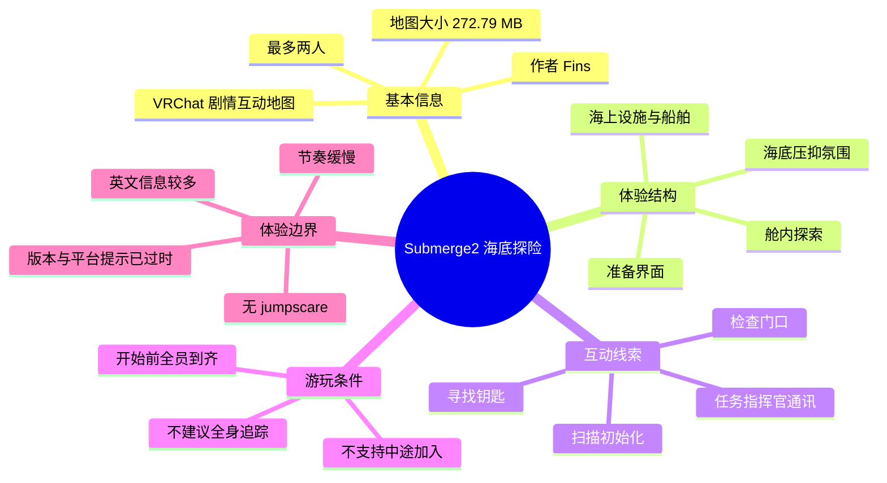
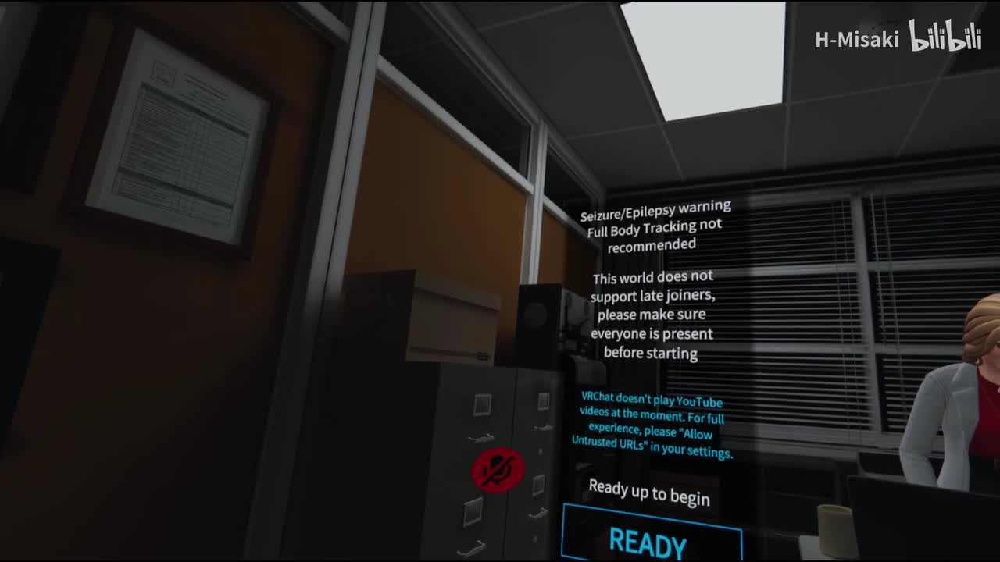
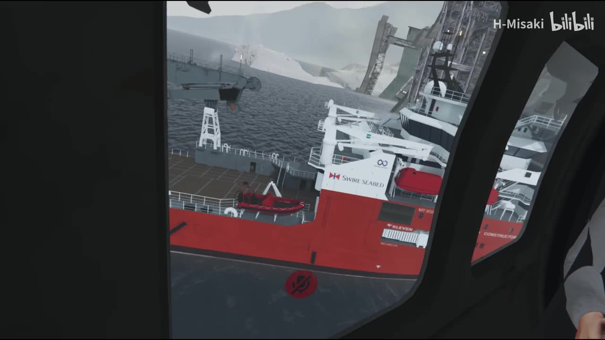
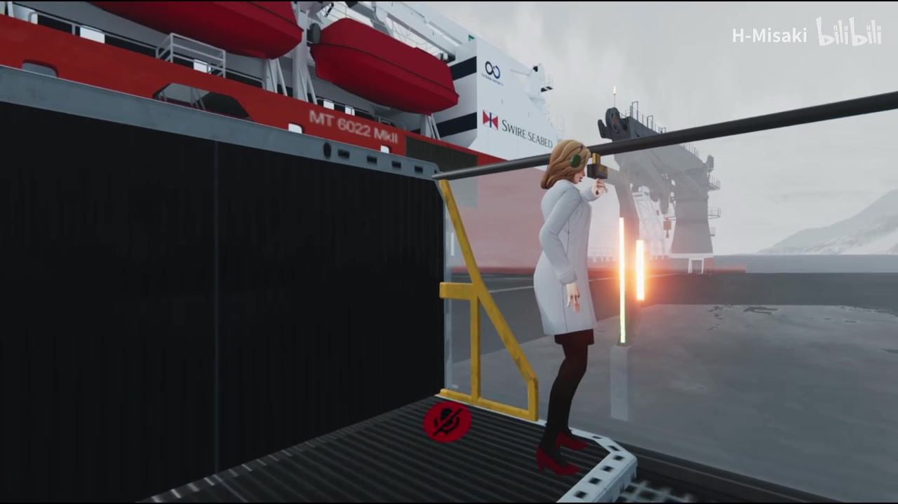
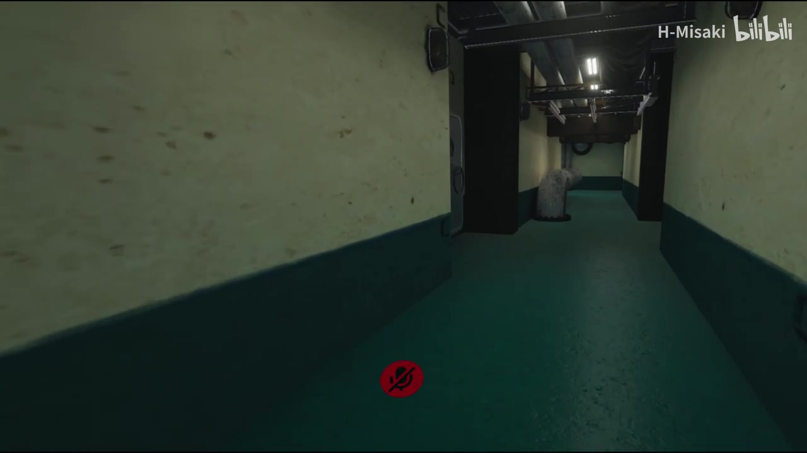

# 【VRChat】大型剧情向互动地图“沉没2”来一场刺激的海底探险！

> 来源：[Bilibili 视频](https://www.bilibili.com/video/BV1A54y1k7Hk) 
> UP 主：H-Misaki｜发布时间：2020-11-16｜视频时长：09:44｜分辨率：1920×1080 
> 分类收藏：`vrchat地图`

## 小结

本视频记录了 UP 主 H-Misaki 游玩 VRChat 剧情互动地图 **《Submerge2》** 的过程。根据视频简介，地图作者为 **Fins**，体积为 **272.79 MB**，设计为最多两人共同体验的海底探险剧情；视频素材中的场景包括任务准备界面、海上工程/船舶甲板、舱内走廊与疑似积水区域。

体验的核心不是高速战斗，而是以环境、英文任务广播和逐步探索构建叙事。开场界面明确提示：地图不建议使用全身追踪（Full Body Tracking）、不支持中途加入者，且开始前应确保所有参与者到齐。对准备组队游玩的玩家而言，这些规则意味着应在进入前组好固定队伍并同步开始。

视频简介特别说明，地图“节奏比较缓慢”，抵达海底后会转为压抑、惊悚的氛围，但**没有 jumpscare（突发惊吓）**。因此，它更适合愿意观察场景、接受缓慢推进和英文语音信息的双人合作玩家，而不是希望获得强刺激恐怖体验或快速通关体验的玩家。

可见的任务信息显示，流程中有“任务指挥官将联系玩家”“扫描初始化（Scan initialized）”“检查门口”“门被锁住，可能需要在别处找钥匙”等线索。这表明地图至少包含任务触发、环境扫描、门禁/钥匙式探索等互动环节；不过 ASR 没有时间码，且识别文本存在较多错漏，因此不能据此还原完整剧情或确认所有角色、地点与任务因果。

信息具有明显时效性：视频发布于 2020 年，VRChat 的世界兼容性、媒体播放机制、内容审核策略与地图版本均可能已发生变化。尤其是开场所说的“YouTube 视频当前不能在 VRChat 中播放”与“允许 Untrusted URLs”的说明，应视为该视频录制时期的界面提示，不应直接当作当前 VRChat 的操作结论。

## 思维导图

## 目录

- [视频定位与已知参数](#视频定位与已知参数)
- [进入前的规则与准备](#进入前的规则与准备)
- [场景与叙事线索](#场景与叙事线索)
- [互动流程与可迁移经验](#互动流程与可迁移经验)
- [时间轴索引与关键帧](#时间轴索引与关键帧)
- [限制、风险与时效性](#限制风险与时效性)
- [字幕比对](#字幕比对)
- [评论分析](#评论分析)
- [处理记录](#处理记录)

## [视频定位与已知参数](https://www.bilibili.com/video/BV1A54y1k7Hk?t=0)

这是一段 VRChat 地图游玩记录，而非地图作者发布的正式说明或教学文档。标题将地图称为“大型剧情向互动地图‘沉没2’”，简介给出了较为明确的游玩条件与设备信息：

| 项目 | 素材中可确认的信息 |
| --- | --- |
| 地图名 | `Submerge2` |
| 地图作者 | Fins |
| 地图体积 | 272.79 MB |
| 人数限制 | 最多 2 人 |
| 节奏 | 简介称“比较缓慢” |
| 氛围变化 | 到达海底后压抑、惊悚 |
| 突发惊吓 | 简介明确称没有 jumpscare |
| 录制设备 | 小派 8K PLUS + INDEX 手柄 + HTC Tracker ×3 |
| 视频总时长 | 584 秒（09:44） |

设备信息只能说明 UP 主此次录制所用配置，**不能推出该地图必须使用上述头显、控制器或三枚定位器**。相反，地图内的警示文字还明确写有“不推荐 Full Body Tracking”，这与简介中“使用 HTC Tracker ×3”并不矛盾：录制者可以拥有并启用追踪设备，但地图本身不建议以全身追踪作为游玩方式。

> 图：画面展示进入世界前的准备区及英文注意事项，包括“Seizure/Epilepsy warning”“Full Body Tracking not recommended”“不支持 late joiners”“开始前确保所有人都在场”，下方有 `READY` 按钮。它是判断地图联机规则和进入条件的直接视觉依据。

## [进入前的规则与准备](https://www.bilibili.com/video/BV1A54y1k7Hk?t=0)

### 1. 在固定双人队伍完成集合后再开始

开场提示写明该世界“不支持 late joiners（中途加入者）”，并要求开始前确认所有人已经到场。结合简介中的“两人限制”，较稳妥的实践方式是：

1. 先确认队伍人数不超过 2 人。
2. 两名玩家都进入同一实例并完成语音、移动和交互确认。
3. 由队伍确认后再按下 `READY` 或对应的开始按钮。
4. 不应把“先开始、随后让队友传送进入”作为默认方案；这可能触发地图不支持的加入流程。

这里的“最多两人”来自视频简介；“不支持中途加入”和“开始前全员到齐”来自关键帧中的世界提示。二者共同指向固定小队式开局，但素材没有展示房间创建、实例权限或掉线后的恢复机制，因此这些部分不能进一步推断。

### 2. 谨慎处理媒体与外部链接提示

准备界面还出现了与 VRChat 内媒体播放相关的提示：当时的文字称 VRChat 当前不播放 YouTube 视频；如需完整体验，请在设置中允许 `Untrusted URLs`。这至少表明地图可能包含通过外部资源加载的影音或网页内容。

建议的实际处理原则：

- 仅在理解外部链接风险的前提下调整客户端设置；
- 若不愿开启不受信任 URL，应接受地图中的部分媒体内容可能无法正常呈现；
- 开启后若仍无法播放，不应仅凭本视频判断故障原因，因为平台功能和地图资源均可能已更新或失效；
- 不要将该提示等同于“当前 VRChat 必须允许不受信任 URL 才能播放视频”。

### 3. 注意视觉与舒适度风险

世界内文字包含癫痫/光敏风险警示，且视频简介描述后段具有压抑惊悚气氛。对于容易晕动、对闪烁敏感，或不喜欢幽闭与深海压迫感的玩家，应先评估自身接受程度。素材未给出具体的舒适度设置、移动模式、闪烁频率或可跳过节点，故不能给出确定的规避参数。

## [场景与叙事线索](https://www.bilibili.com/video/BV1A54y1k7Hk?t=0)

### 海上设施与任务出发点

关键帧可见玩家从舱内透过窗口观察海面、工程船及大型海上设施；另一画面则展示船舶甲板上的角色与工业设备。船体/设施上可辨识到 `SWIRE SEABED`、`MT 6022 Melli` 等英文标识，但素材不足以证实它们在剧情中的具体设定，只能确认它们是场景中出现的环境文字。

> 图：画面以舷窗/门窗框出海面、船舶与工业设施，建立了“从海上平台或船舶出发”的空间感。它有助于理解本地图不是直接从海底场景开始，而是先以海上作业环境铺垫。

> 图：画面中可见红白相间的大型船体、甲板护栏、工业装置和一名角色。这张图的价值在于补充了环境尺度与双人游玩时的同行感，但不能据此确认该角色的身份或其是否为 NPC。

### 英文语音与任务通信

本次 ASR 在前段捕获到若干英文任务台词，包括：

- “Mission Commander will contact us shortly.”
- “Angela Mason speaking”
- “You got it boss”
- “We'll be ready”
- “Pilot … activation process”（中间专有名词识别不可靠）
- “Mission completed / complete / accomplished / finished / achieved”

这些文本表明视频中存在英文对话或系统播报，内容至少涉及任务指挥、角色自报姓名、准备状态与任务完成等概念。但 ASR 将多段相近语句识别为不同“任务完成”表述，且没有提供逐句时间码；因此不能确认它们是否全部为原始台词，也不能以此编排完整的任务阶段。

### 舱内积水与压迫感

视频关键帧展示了低矮、陈旧的工业走廊，地面积水明显，顶部有管线和照明设备。这与简介中“抵达海底后气氛压抑惊悚”的描述在视觉风格上相互印证：地图利用狭窄通道、污渍墙面、积水和受限视野营造紧张感，而非依赖突发惊吓。

> 图：画面呈现被水淹没的舱内通道、裸露管线和较暗的纵深空间，是“海底后段压抑感”的关键视觉证据。它只能说明环境设计的氛围，不足以证明发生了灾难、泄漏或特定剧情事件。

## [互动流程与可迁移经验](https://www.bilibili.com/video/BV1A54y1k7Hk?t=0)

素材未提供可逐秒校验的操作录屏说明，以下流程仅整理**视频可见规则、简介信息及 ASR 中的交互线索**，用于降低初见地图时的迷失概率，而不是正式攻略。

### 可确认或较强线索支持的流程

1. **进入准备区并阅读规则**  
   留意全身追踪、癫痫风险、媒体链接、晚加入限制等提示；队友均在场后再开始。

2. **在海上作业场景中接受任务信息**  
   ASR 提到“任务指挥官将很快联系”，说明语音广播可能承载任务背景。英文理解困难的玩家宜与队友分工：一人专注听取广播，另一人负责观察场景与交互物。

3. **按环境引导推进至设施内部/深处**  
   视频中能看到船舶甲板、舱内与积水走廊，且简介说明会“到达海底”。具体的下潜装置、路线及触发顺序在给定素材中不可确认。

4. **遇到扫描和门禁时检查附近线索**  
   ASR 出现“Scan initialized”“Stand by”“3D 扫描”“检查门口”“这个锁住了，可能在某个地方有钥匙”等内容。至少可以将其作为探索策略：遇到锁门时不要重复尝试同一交互点，应回查相邻房间、任务面板、扫描提示或可拾取物。

5. **保持双人同步与语音沟通**  
   这是由地图的两人限制、不可中途加入与剧情氛围共同导出的实践建议。它不是视频明示的强制同步机制；若地图允许单人启动，素材并未充分展示。

### 不应从素材中推断的内容

- 未证实钥匙的外观、固定刷新位置或是否存在多把钥匙；
- 未证实扫描具体由何种按钮、道具或系统完成；
- 未证实是否有分支结局、失败条件、战斗机制或存档点；
- 未证实“Mission complete”类 ASR 文本对应最终通关；
- 未证实任何现实世界船舶、机构或人物与地图剧情有关。

## [时间轴索引与关键帧](https://www.bilibili.com/video/BV1A54y1k7Hk?t=0)

> 说明：提供的 ASR 文本**没有逐句时间码**，关键帧清单也未附带抽帧秒数。因此以下时间轴以可验证的起点、视频总时长和内容阶段组织为主；除 `00:00` 与 `09:44` 外，不为场景切换编造精确秒数。

| 时间轴 | 内容 | 证据与可信度 |
| --- | --- | --- |
| [00:00](https://www.bilibili.com/video/BV1A54y1k7Hk?t=0) | 世界准备界面与开始条件 | 关键帧直接可见；高 |
| [00:00 起](https://www.bilibili.com/video/BV1A54y1k7Hk?t=0) | 英文任务/角色通信 | ASR 可见，但无原文校对和时间码；中低 |
| [中段，精确秒数未提供](https://www.bilibili.com/video/BV1A54y1k7Hk?t=0) | 海上船舶、甲板及作业设施场景 | 关键帧直接可见；高 |
| [后续，精确秒数未提供](https://www.bilibili.com/video/BV1A54y1k7Hk?t=0) | 舱内、积水走廊与探索氛围 | 关键帧直接可见；高 |
| [后续，精确秒数未提供](https://www.bilibili.com/video/BV1A54y1k7Hk?t=0) | 扫描、锁门、找钥匙线索 | ASR 可见，但时间与操作对象未校对；中低 |
| [09:44](https://www.bilibili.com/video/BV1A54y1k7Hk?t=584) | 视频结束 | 元数据时长 584 秒；高 |

关键帧选择以“能独立证明地图规则、空间结构与氛围”的信息密度为依据，而不是以画面美观度为唯一标准：`frame-001` 用于规则，`frame-002` 与 `frame-004` 用于海上场景和空间尺度，`frame-003` 用于水下/舱内压迫感。

## [限制、风险与时效性](https://www.bilibili.com/video/BV1A54y1k7Hk?t=0)

### 素材证据限制

1. **无可用站内字幕**：无法以官方/上传者提供的文本校对英文剧情。
2. **ASR 误识别较多**：如“Pilot CuthLink”“Nuwer/Nuclear”等词无法可靠复原，多个“任务完成”版本也可能来自重复播报、背景音或识别重复。
3. **ASR 无时间码**：无法把具体台词严谨绑定到视频中的精确画面。
4. **关键帧没有抽帧时间信息**：不能将图片强行标注为某一秒发生的事件。
5. **仅为游玩记录**：视频不等于完整攻略；未展示的机制不能视为不存在。

### 游玩与内容限制

- 人数上限为两人，且世界提示不支持中途加入。
- 地图节奏偏慢，英文信息可能成为理解门槛。
- 海底/封闭空间的压抑感可能不适合部分玩家；无 jumpscare 不等同于没有心理紧张或视觉不适。
- 地图体积为 272.79 MB 是视频简介给出的历史数值，下载大小可能因版本、缓存和平台资源变化而不同。
- 录制使用的硬件是 UP 主个人配置，不是最低配置或推荐配置结论。

### 时效性判断

视频发布于 2020 年 11 月；本次素材抓取时间为 2026-07-12。VRChat 的世界可访问性、`Untrusted URLs` 设置位置、YouTube/视频播放能力、地图资源依赖以及地图本体是否仍更新，均需以当前客户端与世界页面实际状态为准。本文保留的是视频当时可证实的体验记录，不对当前可玩性作保证。

## [字幕比对](https://www.bilibili.com/video/BV1A54y1k7Hk?t=0)

| 字幕来源 | 完整性 | 专有名词 | 时间轴 | 主要问题 |
| --- | --- | --- | --- | --- |
| Bilibili 站内字幕 | 未提供可用字幕，无法使用 | 无法核验 | 无 | 不存在可供比对的站内字幕文件 |
| 本次 ASR 字幕 | 覆盖到部分英文广播、中文语句和交互提示，但不完整 | `Angela Mason` 识别相对清楚；`Pilot CuthLink`、`Nuwer/Nuclear` 等不可靠 | 未提供逐句时间码 | 中英混杂、语义跳跃、疑似重复识别，“任务完成”相关句出现多个版本 |

本次 ASR 已执行，但由于站内没有可用字幕，无法进行逐句交叉校对。正文采取“**视觉证据优先，ASR 仅作线索**”的策略：

- 通过关键帧确认的英文规则包括：不推荐全身追踪、不支持中途加入、开始前全员到场，以及有关不受信任 URL 的提示。
- ASR 中较稳定、可作为任务结构线索使用的内容包括：任务指挥官联系、扫描初始化、检查门、门锁住、可能寻找钥匙。
- `Submerge2`、Fins、272.79 MB、两人限制和“无 jumpscare”等关键资料，优先采用视频简介，而不依赖 ASR。
- 未对 ASR 中未能由画面、简介或上下文确认的人名、技术名词和任务结局做强行修正或补写。

## [评论分析](https://www.bilibili.com/video/BV1A54y1k7Hk?t=0)

仅处理本次可获取的热评前三条；评论反映的是观众主观预期，不作为地图机制或质量的已验证事实。

1. **亿鸽萝卜｜5 赞**  
   评论：“想去。但是不想做英语听力[大哭]”  
   观点是对地图有游玩兴趣，但担心英语语音理解成本。该反馈与 ASR 中大量英文任务广播相吻合，说明语言门槛可能影响部分中文玩家的体验；不过它没有提供翻译、攻略或地图实际难度的客观证据。

2. **凉星狸子Official｜1 赞**  
   评论：“看起来好棒！有空去玩！”  
   评论表达了对画面和概念的正向印象，能侧面说明视频呈现的海底探险题材具有吸引力，但未提供关于地图时长、稳定性、恐怖程度或互动质量的具体补充。

3. **甄胖｜1 赞**  
   评论：“估计我操作全程懵逼脸”  
   评论担忧操作与解谜理解难度。这与素材中“扫描—检查门—寻找钥匙”的探索线索有一定关联，但仍是评论者的预期而非实测结论。视频素材不足以量化地图操作复杂度，也无法确认是否有引导不足的问题。

## [处理记录](https://www.bilibili.com/video/BV1A54y1k7Hk?t=0)

- Worker ID：`worker-mri3t0px-8b394786`
- 模型：`gpt-5.6-terra`
- 调用工具与素材：视频元数据、视频抽取产物清单、关键帧、站内字幕检测结果、本次 ASR 文本、热评数据。
- 使用的应用工具：素材读取与结构化整理；未提供可验证的逐帧时间戳、逐句 ASR 时间码或完整站内字幕文件。
- 字幕选择：站内字幕未提供可用版本；已执行本次 ASR。正文未将 ASR 作为完整逐字稿，而是将其作为低至中可信度的任务线索，并以视频简介和关键帧可见文字优先校验。
- 关键帧选择依据：选取 `frame-001.jpg` 证明世界规则，`frame-002.jpg` 与 `frame-004.jpg` 展示海上船舶/设施和空间关系，`frame-003.jpg` 展示积水舱内环境及压抑氛围；均已使用相对路径 `frames/` 引用。
- 热评处理范围：仅分析已获取的热评前三条，未扩展至其他评论或将主观评价视为事实。
- 缓存清理：未提供缓存目录、清理命令或清理执行回执；因此不能声称已完成缓存清理。
- 未解决问题：地图当前是否仍可进入、当前版本体积与兼容性、媒体播放设置是否仍适用、完整剧情、任务精确时间轴、ASR 中不可靠专有名词及钥匙/扫描的具体操作方式，均无法由给定素材确认。
