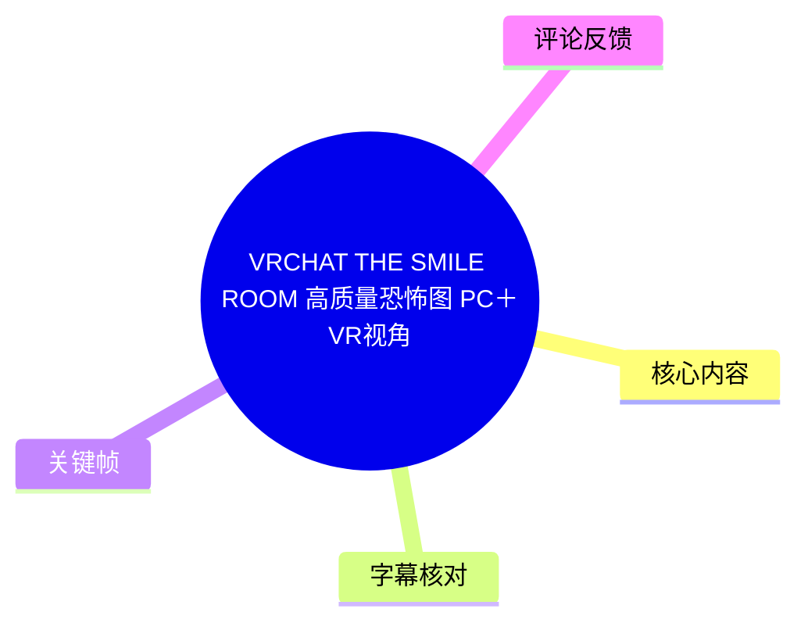
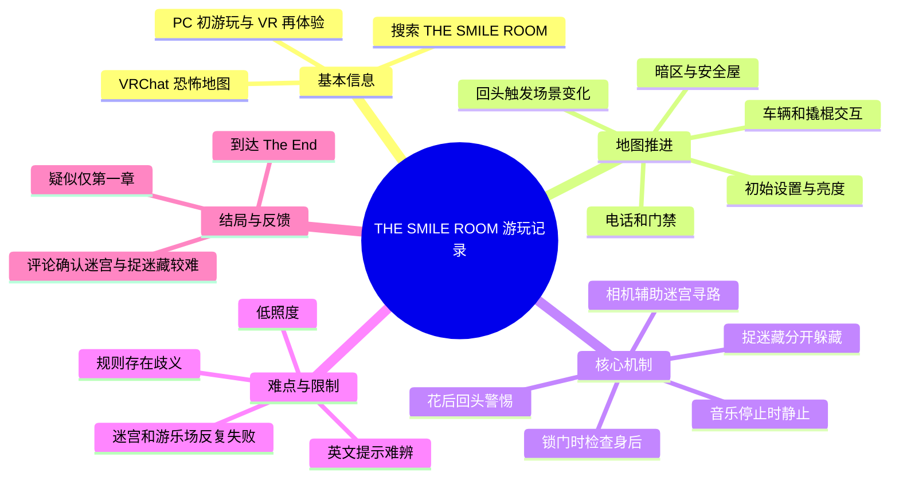
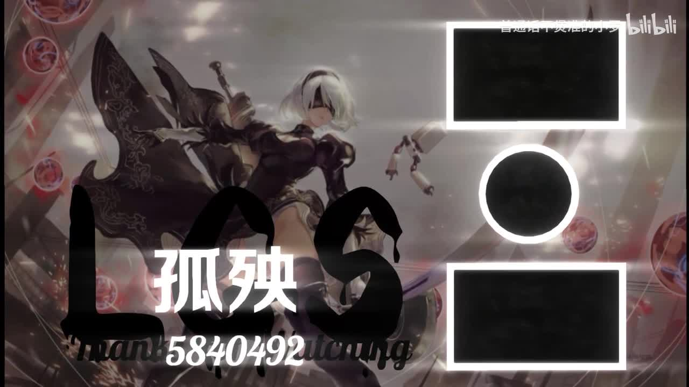
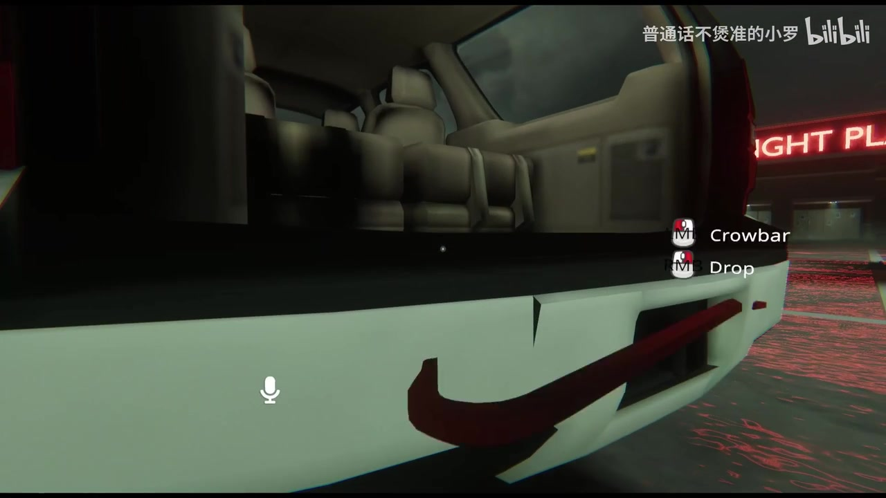
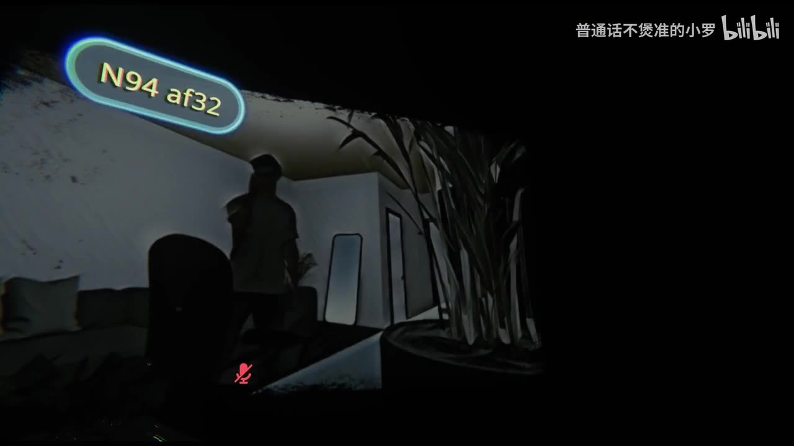
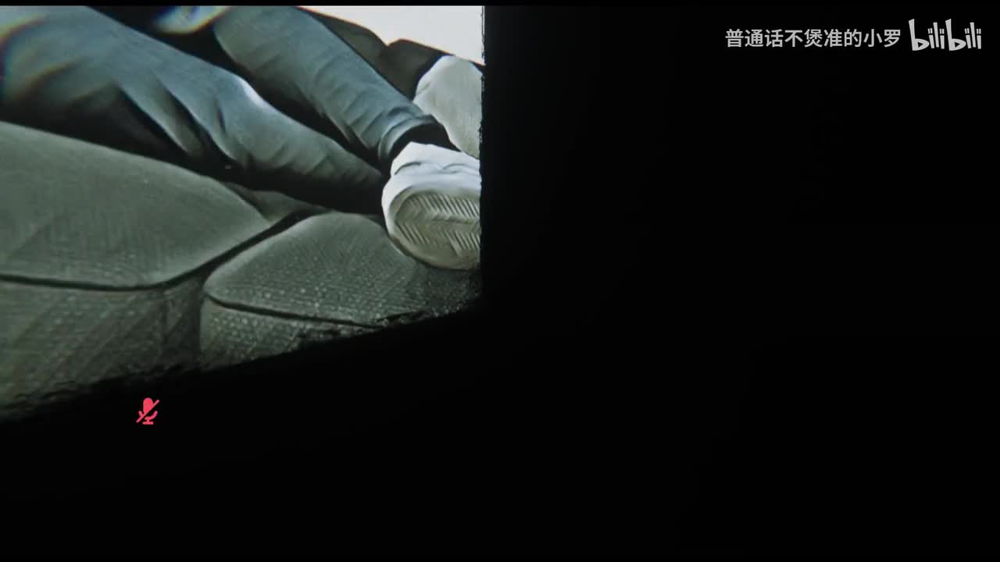

# VRCHAT THE SMILE ROOM 高质量恐怖图 PC＋VR视角

> 来源：[Bilibili 视频](https://www.bilibili.com/video/BV168411a7Zu) 
> UP 主：孤殃zero ｜发布时间：2022-10-27 ｜视频时长：1:28:16 
> 分 P：P1「PC初游玩」55:19；P2「VR游玩伪速通」32:57。

## 小结

视频记录了两名玩家在 VRChat 恐怖地图 **THE SMILE ROOM** 中的完整游玩过程，分别呈现 PC 初见与 VR 视角下的再次推进。UP 主在简介中说明，可在 VRChat 内搜索 `THE SMILE ROOM` 游玩，并称其为一张“挺高质量的游戏图”。

地图并非单纯线性步行体验，而是由暗区探索、道具交互、回头触发的场景变化、电话/门禁推进、捉迷藏、音乐停顿判定、迷宫寻路及末段逃跑等多个机制组成。实况中最有价值的信息不在于一条可靠的标准速通路线，而在于玩家不断试错后归纳出的机制：**门锁住时留意回头后的变化；遇到花或异常陈设时警惕背后；捉迷藏需要分开躲且避免重复位置；迷宫可用相机辅助观察；音乐停下时应停止移动。**

体验的核心难点是可见度低、英文提示理解困难、多人协作规则不透明，以及部分区域的路线和失败条件没有被完全确认。玩家自述前段多次卡关，并在游乐场/迷宫相关段落反复死亡；最终也明确表示没有完全弄明白某些追逐或剧情规则。因此，本文将“实况中成功发生的操作”与“玩家当场推测”分开记录，不将未证实的猜测写成地图定论。

视频发布于 2022 年，素材抓取于 2026-07-13。VRChat 世界内容、入口、交互逻辑和可用性都可能在此后变更；搜索名称和视频中的路线仅可作为历史参考。该视频含黑暗环境、突发惊吓、怪物追逐音效与恐怖画面，不适合对相关内容敏感者。

## 思维导图

## 目录

- [视频背景、分段与时效性](#视频背景分段与时效性)
- [P1：PC 初游玩的探索与机制发现](#p1pc-初游玩的探索与机制发现)
  - [启动、亮度与前期探索](#启动亮度与前期探索)
  - [车辆、撬棍与暗区推进](#车辆撬棍与暗区推进)
  - [回头机制、电话与场景变化](#回头机制电话与场景变化)
  - [捉迷藏：位置、模型与失败条件](#捉迷藏位置模型与失败条件)
- [P2：VR 视角的迷宫与终段](#p2vr-视角的迷宫与终段)
  - [音乐停止判定与相机观察](#音乐停止判定与相机观察)
  - [游乐场迷宫、红门与逃跑](#游乐场迷宫红门与逃跑)
  - [结局与剧情理解边界](#结局与剧情理解边界)
- [可复用的游玩步骤与注意事项](#可复用的游玩步骤与注意事项)
- [关键帧索引](#关键帧索引)
- [字幕比对](#字幕比对)
- [评论分析](#评论分析)
- [处理记录](#处理记录)

## 视频背景、分段与时效性 [00:00:00](https://www.bilibili.com/video/BV168411a7Zu?t=0)

该视频属于 UP 主的“vrchat地图”收藏，标题明确标示为 PC 与 VR 两种视角。元数据将视频分为两个部分：

| 分 P | 标题 | 时长 | 画面规格 | 内容定位 |
| --- | --- | ---: | --- | --- |
| P1 | PC初游玩 | 55:19 | 1920×1080 | 两名玩家初次探索、试错、理解主要机制。 |
| P2 | VR游玩伪速通 | 32:57 | 3840×2160 | VR 视角下再次游玩，仍包含迷宫与机关探索，并非严格无失误速通。 |

UP 主简介给出的实际游玩入口是：在 VRChat 中搜索 **`THE SMILE ROOM`**。简介同时留下 VRC ID“孤殃ZERO”，但视频并未提供地图作者、世界链接、版本号、最大人数、平台兼容性或硬件要求等信息，无法据此确认当前是否仍可按同名搜索进入同一版本。

“高质量”是 UP 主的主观评价。视频所能支持的客观观察是：地图具有车辆、住宅/走廊、暗区、电话、衣柜、迷宫、游乐场、NPC/怪物及英文交互提示等多个场景与交互元素；但不能据此推导其制作成本、性能优化程度或完整章节数量。

## P1：PC 初游玩的探索与机制发现 [00:00:00](https://www.bilibili.com/video/BV168411a7Zu?t=0)

### 启动、亮度与前期探索 [00:00:00](https://www.bilibili.com/video/BV168411a7Zu?t=0)

开局的 ASR 可辨识到 `Start Game`、`Setting` 等界面词。玩家指出设置中存在亮度调整项，并在“恐怖游戏应该调暗”与“太暗看不清”的取舍间讨论。其实际做法是将亮度调至中等，但仍表示难以看清环境。

这段对后续游玩有直接意义：

1. **地图本身大量依赖低照度环境。** 玩家多次说“好暗”“这里好黑”“我也看不到”。
2. **刻意调暗会保留恐怖氛围，但提高寻路和识别交互物的成本。**
3. **模型发光可作为临时照明。** 玩家后来建议换“有亮度的模型”或打开模型灯光；这属于玩家在 VRChat 中使用自身 Avatar 特性的应对方式，不应理解为地图内置手电必定可用。
4. 前段包含故事/文字信息，但实况玩家对英文、剧情和部分词语的理解有限，未形成可验证的完整剧情解读。

> 图：该关键帧呈现视频中的开场/展示画面及画中画区域。它有助于确认视频为实况录制与观看画面混合呈现，而非纯地图宣传片；但画面本身不提供可靠的地图规则信息。

### 车辆、撬棍与暗区推进 [00:00:00](https://www.bilibili.com/video/BV168411a7Zu?t=0)

前期玩家提到车厢/车附近存在棍状道具，并实际拿到 **Crowbar（撬棍）**。画面交互提示可见：

- `M1 Crowbar`：使用或持有撬棍；
- `M3 Drop`：丢弃道具。

玩家描述需要“敲那个门”，说明撬棍与门或障碍推进有关；不过 ASR 无法完整保留具体门的位置与交互结果，不能断言所有门都必须使用撬棍。

> 图：关键帧清晰展示车辆尾部、地面环境以及右侧的 `Crowbar`、`Drop` 操作提示，是确认地图存在可拾取道具及鼠标按键交互的直接视觉依据。

随后进入暗区。玩家试图寻找出口和亮处，提到安全屋、断电后需要走一段路、门需要寻找等信息。实况中可归纳为：**遇到黑暗区域时，优先观察可见光源、门、电视机等显著物件，并避免仅凭直觉持续冲入死路。**

### 回头机制、电话与场景变化 [00:00:00](https://www.bilibili.com/video/BV168411a7Zu?t=0)

中段是视频中最明确的机制归纳之一。玩家将它类比为《P.T.》式体验：走廊似乎会循环，正向推进不一定有效；当门锁住或环境停滞时，回头观察可能是必要操作。

实况中的具体观察包括：

- 某些门“锁死”后，需要“回头看一下”；
- 玩家发现“多了一只脚”“变样了”等场景变化；
- 有人总结“看到花基本上你后面都有东西”，即花/花卉布景可能是回头或背后出现异常的提示；
- 玩家多次强调“都是一直往前走……然后再回头看”“疯狂回头”。

这些内容适合视为**实况中的有效探索策略**，而不是已被地图文本明确规定的完整机制。视频没有给出每一次变化的准确触发条件：可能与走廊循环、门锁状态、玩家位置或事件进度共同有关。

电话也是一个明显的推进节点。玩家多次提示“走去接电话”，随后出现不能移动、鬼靠近、需要进入某区域等事件。由于对话重叠、ASR 漏识较多，无法可靠还原电话完整台词，但可确定电话并非背景摆设，而是推进流程中的交互目标之一。

> 图：该帧显示低照度室内空间、同伴名牌与语音状态标识，说明本次体验包含多人实时协作。它解释了视频中大量“你在哪”“走前面”“看后面”的口头协调，也说明玩家对路线的判断并非单人操作。

### 捉迷藏：位置、模型与失败条件 [00:00:00](https://www.bilibili.com/video/BV168411a7Zu?t=0)

视频后半段进入捉迷藏机关。玩家辨认出提示中存在类似 `Closer, closer, closer` 的语音/文字，并理解为需要躲藏。现场可用的主要掩体是衣柜，且多人合作下的规则比单人直觉更复杂。

根据玩家反复试验、英文提示的零碎翻译与失败记录，可整理出以下较高可信度信息：

| 观察到的规则或现象 | 证据来源 | 可靠性说明 |
| --- | --- | --- |
| 需要在指定时机躲入衣柜等掩体。 | 多次进入衣柜、关门、被抓或未被抓的实况。 | 高：行为和结果均在实况中反复出现。 |
| 两名玩家不应躲在同一个位置。 | 玩家读到/翻译为“不要躲在同一个地方两次”，并决定分开。 | 中：原始英文提示未完整、清晰地保留。 |
| 同一位置可能不能连续使用两次。 | 玩家多次讨论“不能躲在同一个地方两次”。 | 中：为玩家对提示的解释，未做系统验证。 |
| 需要在光熄灭后开始游戏，且可能有约 10 秒的倒计时。 | ASR 出现 `Game start when the lights go out`；玩家提到“数十秒”。 | 中高：英文短句识别较明确，但完整规则仍缺失。 |
| Avatar 体积/碰撞可能影响躲藏成功。 | 玩家推测应换“小点的模型，不能穿模”，并实际换模型再试。 | 中：属于排障假设，视频未展示碰撞判定逻辑。 |
| 该段可能需成功躲避多次。 | 有人推测“躲它三次才算赢”，之后才推进。 | 低至中：玩家推测，无法确定是否为固定次数。 |

这段的实际经验是：进入机关前先确认每个人拥有独立的衣柜或掩体；不要默认多人可共用同一个藏点；若明明躲藏仍失败，尝试更小、不易穿模的 Avatar，并严格等待灯光/语音提示，而非提前冲出。

## P2：VR 视角的迷宫与终段 [00:55:19](https://www.bilibili.com/video/BV168411a7Zu?t=3319)

P2 标注为“VR游玩伪速通”，从分 P 元数据可确定起点为视频第 3319 秒。所谓“伪速通”不等同于无死亡、无探索的标准竞速流程：实况仍出现迷路、讨论英文提示、反复死亡和临场验证。

### 音乐停止判定与相机观察 [00:55:19](https://www.bilibili.com/video/BV168411a7Zu?t=3319)

VR 段出现一个与音乐节奏相关的移动判定。玩家先推测“停的时候不要动”，随后在角色死亡后再次确认“应该一停就不要再动了”。这是视频中最可执行的规则之一：

- 音乐播放时：玩家尝试移动；
- 音乐停止时：应立即静止；
- 未能及时停止可能触发失败/被抓。

不过视频未明确说明是否只判定身体移动、摇杆输入、头部动作或 Avatar 碰撞，也没有给出该机制的官方文字规则。因此，VR 玩家应预留反应时间，并避免在音频转折时进行大幅移动。

迷宫阶段，玩家发现可通过 VRChat 相机进行辅助观察和找路，虽然相机“不能拉大放”。他们通过相机确认门位于附近，并口述一段不完整路线：“左边，然后右边，左边然后右面”。这不是可复现的完整路线图，因为起点、朝向和岔路编号均未记录，但说明相机具有两项实用价值：

1. 在第一人称黑暗或转角受限时辅助查看远处；
2. 让一名玩家观察、另一名玩家移动，降低盲走概率。

> 图：该帧展示低可见度环境中的局部恐怖画面。它直观说明玩家频繁抱怨看不清、需要调整亮度或借助发光模型/相机的原因，同时也体现该地图以近距离突发视觉信息制造惊吓。

### 游乐场迷宫、红门与逃跑 [00:55:19](https://www.bilibili.com/video/BV168411a7Zu?t=3319)

玩家将某一分支称为“游乐场”，并明确表示这是最难处理的段落之一。过程中他们尝试辨认多个门、地下室、楼梯、不同层级与红门位置；其间多次死亡。

可从实况中整理出的流程性线索如下：

1. 进入疑似游乐场/迷宫的区域；
2. 依据音乐停顿规则控制移动；
3. 使用相机或同伴视角寻找出口与楼梯；
4. 寻找红色门；
5. 在楼梯和蓝色通道附近反复校正位置；
6. 找到正确通道后继续推进；
7. 末段出现明显的“跑跑跑”“别往后看”指令，形成逃跑场景。

“红门在最下面”“第二层”“往下的蓝色通道”等说法在实况中前后有互相修正，反映玩家当时并不确定。因此更稳妥的表述是：**红门与楼梯/层级通道相关，玩家需要在迷宫中结合相机观察和多人通信定位，而非机械套用单一方向口诀。**

玩家还提到可以使用一个被 ASR 识别为 “D” 的功能来侦查敌人是否接近，但认为不可使用过多次。该按键/物品名称、冷却与次数限制均不清楚，不能把它写成确定的按键攻略；最多可作为“地图可能存在有限次数的敌情侦测辅助”的待验证线索。

### 结局与剧情理解边界 [00:55:19](https://www.bilibili.com/video/BV168411a7Zu?t=3319)

终段玩家进入一个包含人物/NPC、店铺或门口对话的区域，随后画面出现 `the end`。玩家认为这像是在讲述一个故事，但也坦言“还是没有搞明白”追人环节如何游玩，并推测“这只是第一章”“还有后续”。

因此，关于结局只能确认：

- 本次录制抵达了画面文字 `the end`；
- 玩家主观感觉故事尚有后续或章节未尽；
- 视频没有提供足以还原完整叙事、角色关系、怪物身份或章节结构的清晰文本；
- “第一章”和“还有后续”均为玩家当场判断，不可视为地图官方章节信息。

## 可复用的游玩步骤与注意事项 [00:00:00](https://www.bilibili.com/video/BV168411a7Zu?t=0)

以下步骤严格依据视频内出现的操作与试错经验整理，适合首次进入同类版本地图时参考。

### 1. 进入前：确认入口与显示条件

1. 在 VRChat 搜索 `THE SMILE ROOM`。
2. 启动后检查 `Setting` 中的亮度选项。
3. 亮度不要一味压低：视频表明暗度会直接影响找门、识别道具和辨认同伴。
4. 多人游玩时预先约定语音分工，例如一人带路、一人观察后方或使用相机确认岔路。

**限制：** 视频未展示地图 URL、房间权限、推荐人数及 PC/VR 的具体兼容配置，需在当前 VRChat 内自行确认。

### 2. 前期探索：优先找明确交互物

1. 留意车辆、门、电话、电视机、发光处等显著对象。
2. 拾取到撬棍时，注意界面的 `M1 Crowbar` 与 `M3 Drop` 提示。
3. 若遇到门或障碍，不要假设所有门均能直接打开；先检查是否遗漏道具、电话或前置触发。
4. 黑暗环境中可尝试利用发光 Avatar 或同行者的视野补充照明。

### 3. 走廊循环：门锁住时改变观察方向

1. 向前推进后若反复遇到锁门、死路或相似场景，不要只重复前进。
2. 回头检查环境变化，包括花、墙面、脚部/人影或其他新增物。
3. 出现花或异常装饰时尤其注意背后；这是玩家总结出的高频惊吓线索，不保证每次都触发。
4. 将此类设计理解为“观察变化”优先于“纯路线记忆”的玩法。

### 4. 捉迷藏：避免共用掩体与重复位置

1. 等待灯光熄灭、倒计时或机关提示后再开始躲藏。
2. 多人应分配不同衣柜/掩体，避免同点躲藏。
3. 若上一轮使用某衣柜后失败，下一轮优先换位置。
4. 躲入后避免过早离开；视频中玩家多次因不明确的触发时机而被抓。
5. 如果持续莫名失败，检查 Avatar 是否过大、穿出柜体或碰撞异常；尝试切换更小模型。

**注意：** “连续躲同一位置必失败”“必须成功三次”等规则均未被视频完全验证，应以现场英文提示和当前版本机制为准。

### 5. 音乐与迷宫：用音频控制动作、用相机辅助判断

1. 在音乐控制区域，音频停止时立刻停止移动。
2. 不要只依赖肉眼寻找出口；视频中玩家用相机寻找门和确认通道。
3. 相机可用于远距观察，但视频显示其无法放大，因此仍需靠近关键岔路确认。
4. 对红门、楼梯、蓝色通道等地标进行口头同步；不要仅说“这里”，应补充相对方向和层级。
5. 终段出现追逐时，优先按提示向前跑，避免回头干扰判断。

## 关键帧索引 [00:00:00](https://www.bilibili.com/video/BV168411a7Zu?t=0)

| 关键帧 | 用途 | 正文价值 |
| --- | --- | --- |
| `frames/frame-001.jpg` | 开场/展示布局 | 说明视频为实况观看与录制画面的组合呈现。 |
| `frames/frame-002.jpg` | 暗处恐怖局部 | 支持“低能见度是实际游玩障碍”的分析。 |
| `frames/frame-003.jpg` | 室内与同伴名牌 | 支持多人协作、语音沟通与同伴定位的描述。 |
| `frames/frame-004.jpg` | 车辆与撬棍提示 | 直接佐证地图存在撬棍道具与 `M1`/`M3` 交互提示。 |

未在正文选用的其余候选帧未附带可验证的时间戳、清晰画面说明或与文本机制直接对应的素材信息，因此不强行解读，以避免把不确定画面关联到错误事件。

## 字幕比对 [00:00:00](https://www.bilibili.com/video/BV168411a7Zu?t=0)

本次任务**已执行 ASR**。站内字幕与 ASR 的覆盖效果差异很大，最终采用“ASR 为主体、画面与上下文交叉校正、保留不确定性”的整理策略。

| 字幕来源 | 完整性 | 专有名词 | 时间轴 | 主要问题 |
| --- | --- | --- | --- | --- |
| Bilibili 站内字幕 | 极低；提供内容几乎全部为“♪ 音乐 ♪”。 | 无法识别地图名、道具、规则或玩家对话。 | 未提供可用的逐句时间信息。 | 仅标记背景音乐，不能支撑内容整理。 |
| 本次 ASR 字幕 | 较高；覆盖大量玩家对话、部分英文提示和流程事件。 | 可识别 `Start Game`、`Setting`、`Crowbar`、`Drop`、`Remember`、`Closer`、`Game start when the lights go out`、`the end` 等，但多处误识。 | 输入文本未附逐句时间戳；只能结合分 P 起点建立章节级时间轴。 | 对话重叠、环境音、口语夹杂英文及低声说话导致错字、断句和人名误识较多。 |

### 采用与校正原则

- **采用 ASR 的原因：** 站内字幕只记录音乐，无法覆盖实况知识。
- **关键画面校正：** `Crowbar` 与 `Drop` 由关键帧中的 UI 英文直接确认，不只依赖 ASR。
- **上下文校正：** ASR 中的“手镜筒”等不连贯词语不直接写入结论；“相机”仅在玩家反复提及“用相机来看”、并以其寻找门的上下文中保留。
- **未强行校正的内容：** 部分人名/昵称、怪物名称、英文长提示、地名及故事文本识别不稳定，本文不据此补全或翻译。
- **时间轴限制：** 由于字幕材料没有逐句起止时间，除视频起点和 P2 已知边界外，本文不编造精确事件秒数。

## 评论分析 [00:00:00](https://www.bilibili.com/video/BV168411a7Zu?t=0)

仅处理本次可获取的热评前三条。评论均为玩家个人体验，可作为难度与机制的旁证，不可替代地图官方规则或完整验证。

1. **橙子刨冰HQ（4 赞）**  
   评论称五人联机时，其中一人未被抓到便“直接保送”，其余四人在迷宫玩不下去，并认可视频让自己获得“云通关”满足感。  
   - 补充价值：与视频中迷宫/游乐场反复死亡、路线难找的情况一致，说明该段对多人队伍可能同样构成障碍。  
   - 可信度边界：“保送”可能是特定版本、房间状态或多人触发结果，视频未验证这一规则，不能作为固定机制。

2. **桦桦桦桦雄（2 赞）**  
   评论称“听歌声走那段太吓人了，不敢玩了”。  
   - 补充价值：与视频中“音乐停止就不要动”的音频判定段落相互呼应，表明声音不只是氛围，也显著影响恐怖感。  
   - 可信度边界：评论未说明具体失败机制或位置，不能据此推断“歌声”一定对应某一种怪物行为。

3. **小雅爱吃海底捞（2 赞）**  
   评论认为捉迷藏“很奇怪”，称队伍莫名通关，只能找到两个柜子，其他位置都会被找到。  
   - 补充价值：与视频中捉迷藏规则不清、衣柜位置有限、多人躲藏多次失败的观察高度一致。  
   - 可信度边界：该评论同样无法确认“两个柜子”是否为地图固定数量，也无法证明“莫名通关”的具体触发条件。

## 评论分析

本次流程未获取到可用热评，因此不推断观众态度或额外结论。

## 处理记录

- **Worker ID：** `worker-mri3sp0r-0d15ab26`
- **模型：** `gpt-5.6-terra`
- **调用工具与素材：** 使用任务提供的 Bilibili 元数据、分 P 信息、站内字幕、已执行的 ASR 字幕、热评 JSON、关键帧路径及已提供的关键帧画面进行整理；未调用外部网页补充地图资料。
- **字幕选择：** 站内字幕存在但内容仅为音乐标记；本次 ASR 已执行且提供主要语音信息。正文以 ASR 为主体，以可见 UI、分 P 元数据和上下文进行保守校正。
- **关键帧依据：** 选择能直接支撑正文的开场布局、低照度恐怖环境、多人同屏协作、车辆撬棍 UI 四类画面；其中 `frame-004` 对道具交互的证据强度最高。
- **缓存清理：** 素材清单仅报告 `merged.mp4`、音频、帧、字幕、ASR 与评论等输出路径，未提供缓存清理执行日志；因此只能记录为“未获得可验证的清理结果”，不虚构已清理状态。
- **未解决问题：** 地图当前版本及入口可用性、官方作者与章节数量、完整剧情、捉迷藏精确胜利条件、敌情侦测功能的按键/次数限制、迷宫精确路线，以及 ASR 中部分英文提示和昵称，均无法仅凭现有素材可靠确认。
