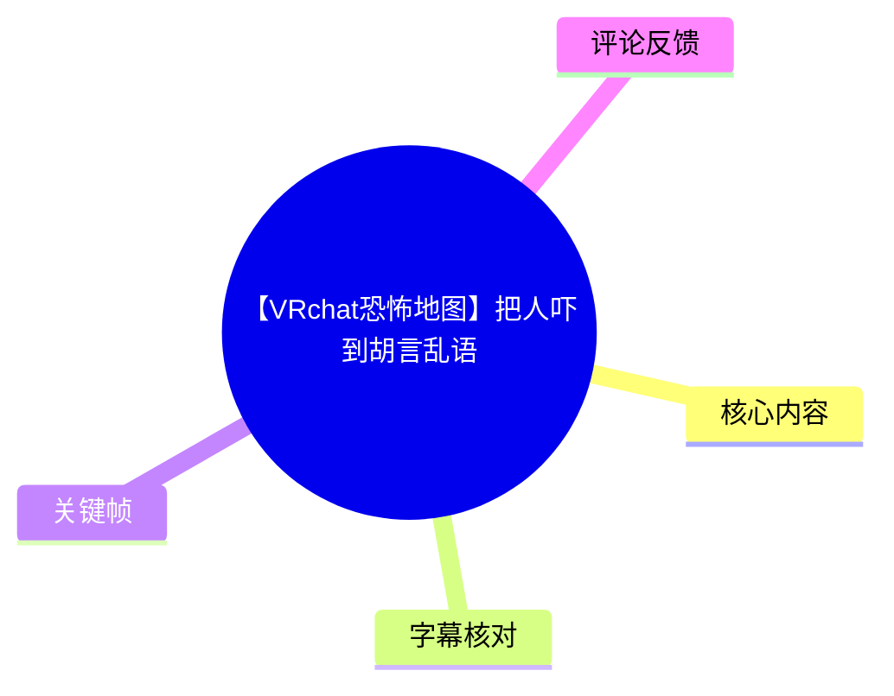
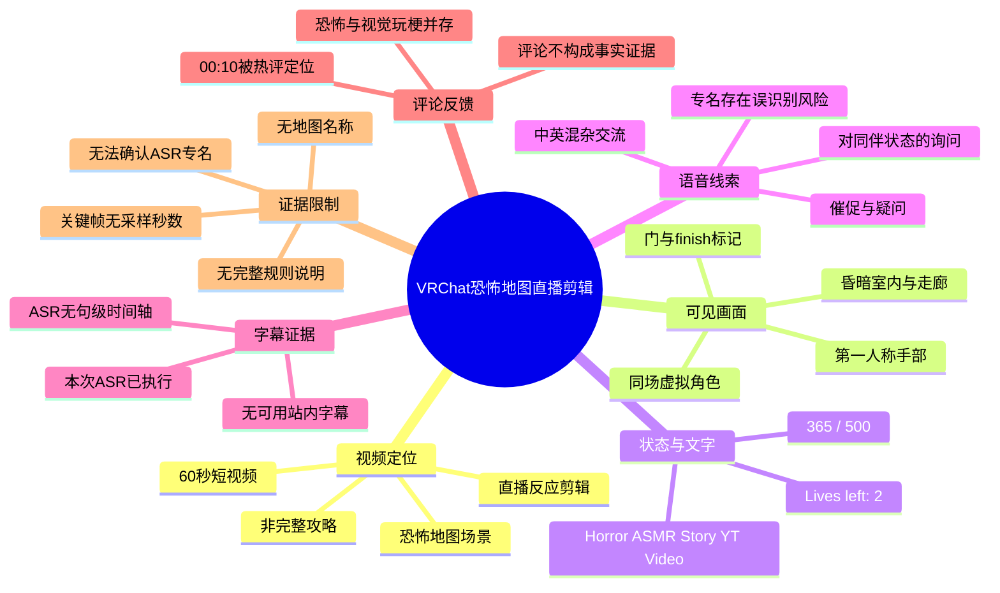
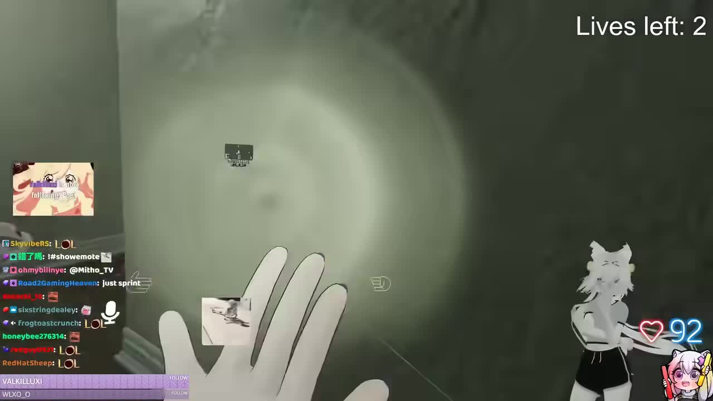
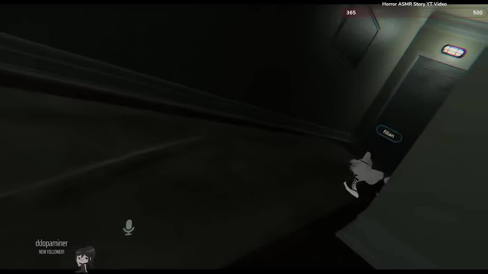

## 小结

《【VRchat恐怖地图】把人吓到胡言乱语》是 UP 主 **TREAOo** 发布的一段 60 秒 VRChat 恐怖地图直播剪辑，发布于 2023-05-27，收录于 `vrchat地图` 集合。视频重点是昏暗恐怖场景中的第一人称探索、多人语音交流及直播间互动，而非完整介绍某张地图的规则或通关流程。

画面可明确确认两类信息：其一，恐怖场景中存在 `Lives left: 2`（剩余生命：2）的状态提示；其二，另一处走廊画面中出现 `Horror ASMR Story YT Video`、`365 / 500` 与门旁 `finish` 等文字。这说明视频所展示的场景至少带有生命数、计数或目标标记，但现有素材不足以确认地图名称、地图作者、具体任务目标、失败条件及通关机制。

本次已执行 ASR，但没有获得句级时间戳；其结果包含中英混杂对话，也存在专名或英文短语误识别的可能。例如 `RaffleGator`、`Lana`、`Lena`、`kick` 等词均无法由站内字幕或关键帧交叉证实。因此，本文将 ASR 作为语境线索，而不将其中未验证的名称、平台或处罚含义视为事实。

视频适合用于观察 VRChat 恐怖直播短剪辑的构成：黑暗且受限的第一人称视野、明确但不完整的风险 UI、直播聊天叠加层，以及受惊后碎片化的语音反应。它不适合作为具体地图攻略、VRChat 设备设置教程或完整剧情复盘依据。

视频发布于 2023 年，素材抓取时间为 2026-07-13。地图可用性、VRChat 世界内容、直播叠加界面、简介外链及视频互动统计均可能已经变化；本文仅记录本次素材中可核验的信息。

## 思维导图

## 目录

- [视频信息与时效性](#视频信息与时效性-0000)
- [时间轴：画面、语音与机制线索](#时间轴画面语音与机制线索-0000)
- [关键帧解读](#关键帧解读-0000)
- [可提炼的直播与剪辑经验](#可提炼的直播与剪辑经验-0000)
- [参数、技术信息与限制](#参数技术信息与限制-0000)
- [字幕比对](#字幕比对-0000)
- [评论分析](#评论分析-0010)
- [处理记录](#处理记录-0000)

# 视频信息与时效性 [00:00](https://www.bilibili.com/video/BV1Zm4y1x7f6?t=0)

| 项目 | 信息 |
| --- | --- |
| 标题 | 【VRchat恐怖地图】把人吓到胡言乱语 |
| BV 号 | `BV1Zm4y1x7f6` |
| UP 主 | TREAOo |
| 视频链接 | <https://www.bilibili.com/video/BV1Zm4y1x7f6> |
| 发布时间 | 2023-05-27 |
| 时长 | 60 秒 |
| 分辨率 | 1920 × 1080 |
| 画面旋转 | 0，无旋转 |
| 分 P | 单 P |
| 收藏集合 | `vrchat地图` |
| 视频简介 | 提供 YouTube 链接：<https://www.youtube.com/watch?v=E9pDnsG8FC8> |
| 标签 | 恐怖、地图、直播、惊悚、可爱、胡言乱语、恐怖地图、twitch、VRChat、vtuber |

标题、标签及关键帧共同表明：这是一段围绕 VRChat 恐怖地图游玩的直播片段。视频并未在现有素材中提供世界名称、地图作者、房间链接或玩法说明，因此不能将其进一步识别为某张特定地图。

素材抓取时的页面统计为：播放 507,135、点赞 8,332、收藏 9,454、投币 134、分享 552、弹幕 95、回复 270。该数据仅代表抓取时的页面状态，不应视为长期固定数值。

# 时间轴：画面、语音与机制线索 [00:00](https://www.bilibili.com/video/BV1Zm4y1x7f6?t=0)

> **时间轴说明**：视频总长 60 秒，但提供的两张关键帧没有原始采样时间，本次 ASR 也没有句级时间戳。因此，除热评明确标记的 `00:10` 外，以下时间轴只使用可确认的整体时间范围，不虚构镜头出现的精确秒点。

| 时间 | 可确认内容 | 证据与可得结论 | 无法确认的内容 |
| --- | --- | --- | --- |
| [00:00](https://www.bilibili.com/video/BV1Zm4y1x7f6?t=0) | 视频开始进入 VRChat 恐怖场景剪辑。 | 标题、标签与关键帧均指向 VRChat 恐怖地图游玩情境。 | 无法证明 `00:00` 必然对应任一所给关键帧。 |
| [00:00–00:59](https://www.bilibili.com/video/BV1Zm4y1x7f6?t=0) | 存在第一人称探索与低照度室内环境。 | 关键帧中可见第一人称虚拟手部、灰暗空间、走廊、门体及局部灯光。 | 无法由现有素材复原完整移动路线或镜头顺序。 |
| [00:00–00:59](https://www.bilibili.com/video/BV1Zm4y1x7f6?t=0) | 场景存在生命数、计数或目标标记。 | 画面文字包括 `Lives left: 2`、`365 / 500`、`finish`。 | 无法确认初始生命数、扣除生命的条件、`365 / 500` 的用途及 `finish` 是否为可交互终点。 |
| [00:00–00:59](https://www.bilibili.com/video/BV1Zm4y1x7f6?t=0) | 音轨中存在催促、困惑、惊讶与中英混杂交流。 | ASR 识别到“我們要做什麼？”、“快點！”、“你還好嗎？”、“I don't get the joke”等短句。 | ASR 无时间戳，无法将台词绑定至具体镜头或事件。 |
| [00:10](https://www.bilibili.com/video/BV1Zm4y1x7f6?t=10) | 热评集中指向该时间点。 | 热评第二名仅写“00:10”，获得 1,502 赞。 | 评论未说明具体画面或台词，不能据此断言此处发生了某种确定的惊吓或角色动作。 |
| [00:59](https://www.bilibili.com/video/BV1Zm4y1x7f6?t=59) | 60 秒短剪辑结束。 | 元数据标注时长为 60 秒。 | 素材未提供结尾内容的逐帧描述。 |

## ASR 对话线索 [00:00](https://www.bilibili.com/video/BV1Zm4y1x7f6?t=0)

本次 ASR 输出如下，保留其原始语言混杂状态：

1. 「我們要做什麼？」
2. 「快點！」
3. 「為什麼我們需要一個閃電？」
4. 「你還好嗎？為什麼要打噴嚏？」
5. 「我的天啊，我被 RaffleGator 了」
6. 「什麼？」
7. 「沒有」
8. 「我被禁止了，Lana」
9. 「我被封了」
10. 「Lana」
11. 「I don't get the joke」
12. 「It's ok, I'll see you on kick」
13. 「Ok」
14. 「謝謝你」
15. 「Lena？」
16. 「WOW？」

可相对稳妥地从中提取的语境包括：

- “我們要做什麼？”与“快點！”反映出参与者对下一步行动存在不确定性，同时有催促情绪。
- “你還好嗎？”、“我的天啊”与“WOW？”属于对同伴或现场情况的即时反应，符合标题中“把人吓到胡言乱语”的剪辑主题。
- “I don't get the joke”表明音轨中存在英语交流，整体是中英混杂的多人对话环境。
- “為什麼我們需要一個閃電？”可能涉及道具、环境效果、英文误听或自动翻译结果；画面未能确认“闪电”是地图机制，因此不能据此推定玩法。
- `RaffleGator`、`Lana`、`Lena`、`kick` 无法通过站内字幕、关键帧文字或上下文可靠校正。它们可能是人名、用户名、英语词组、平台名或 ASR 误识别，均不应被写作已确认事件。

# 关键帧解读 [00:00](https://www.bilibili.com/video/BV1Zm4y1x7f6?t=0)

## 第一人称视角、直播互动与生命数 [00:00](https://www.bilibili.com/video/BV1Zm4y1x7f6?t=0)

> 图：该关键帧可直接确认第一人称虚拟手部、低照度灰暗环境，以及右上角的 `Lives left: 2`。左侧还叠加了聊天消息、关注提示与麦克风图标，右侧可见虚拟形象和心形数值 `92`。其价值在于同时呈现“恐怖地图游玩画面”与“直播互动界面”两层信息。

该帧中的 `Lives left: 2` 是当前素材中最明确的玩法状态参数。它只能证明拍摄该帧时界面显示“剩余生命：2”，不能证明玩家初始拥有多少生命、何种情况会失去生命、生命归零后是否结束或可否复活。

第一人称手部强化了沉浸感：观众从玩家视角观看黑暗空间，较难预先判断前方内容。画面左侧的聊天区可见多条 `LOL` 等即时反馈，表明恐怖体验同时被直播观众围观和评论；但聊天内容不能用于反推每条消息对应的具体事件。

右侧的虚拟形象、心形图标和 `92` 数值为画面叠加元素。现有素材无法确认这些元素属于 VRChat 原生 UI、直播软件组件、直播平台插件还是创作者自定义布局，因此只能描述其“存在于画面中”，不能确定其系统来源或功能。

## 走廊、门体与目标文字 [00:00](https://www.bilibili.com/video/BV1Zm4y1x7f6?t=0)

> 图：该关键帧呈现狭窄而昏暗的走廊空间、门体、局部顶灯，以及画面上方的 `Horror ASMR Story YT Video`、`365`、`500`。门侧可见 `finish` 文字，右下方可见一名虚拟角色局部。该图的价值在于为“场景具有目标或进度相关视觉线索”提供直接画面依据。

画面中的暗色走廊、墙体遮挡、门体与局部照明会压缩可见空间，使玩家难以预判前方环境。这是恐怖场景中常见的视觉设计方式，但视频没有解释其地图设计意图，因此只能将其描述为画面效果，而不应断言为开发者的具体设计策略。

`finish` 是门侧可见的原文。它可以安全地理解为与“结束”或“完成”有关的标记，但不能直接等同于“已经通关”或“该门可作为终点交互”。视频素材未说明玩家是否进入该门、是否完成目标，亦未给出触发条件。

画面上方的 `365` 与 `500` 以同一横向条目出现，可记录为 `365 / 500` 式计数线索。它可能代表进度、分值、收集数量、计时或其他内部数值，但没有足够证据确定具体含义。`Horror ASMR Story YT Video` 同样应按原画面文字保留，不能据此确认地图名称就是该字符串。

# 可提炼的直播与剪辑经验 [00:00](https://www.bilibili.com/video/BV1Zm4y1x7f6?t=0)

## 恐怖直播短剪辑的组成方式 [00:00](https://www.bilibili.com/video/BV1Zm4y1x7f6?t=0)

从现有画面和 ASR 线索看，这段视频的传播重点不是复杂剧情，而是将恐怖环境、游戏状态和即时反应压缩到较短时长中。

1. **第一人称与低可见度环境共同制造未知感**  
   虚拟手部、灰暗走廊、门体与有限照明让观众共享玩家的受限视野。即使没有明确跳脸画面，无法预判前方内容本身也会形成紧张感。

2. **“剩余生命”提供即时风险信息**  
   `Lives left: 2` 向观众传达当前处于有限容错状态。其规则没有被说明，但“生命有限”这一信号能够让观众快速理解玩家处于有压力的游玩状态。

3. **直播聊天放大反应性内容**  
   画面保留聊天消息、关注提示与角色叠加层，使视频不仅记录游戏内事件，也记录观众实时参与。恐怖体验与聊天区的娱乐化反应并置，是直播剪辑常见的情绪放大结构。

4. **碎片化语音可作为“受惊反应”而非剧情证据**  
   ASR 中的催促、询问、困惑、英语短句和惊叹，适合支撑“交流混乱、反应即时”的整体气氛；但它们缺乏时间码和说话人信息，不能被整理成完整剧情线。

## 复盘这类素材的建议步骤 [00:00](https://www.bilibili.com/video/BV1Zm4y1x7f6?t=0)

如需将本视频作为 VRChat 恐怖直播剪辑样本，可采用以下核验流程：

1. **区分地图画面与直播叠加层**  
   - 地图画面：走廊、门、局部灯光、第一人称手部、可能的关卡文字。  
   - 直播层：聊天消息、关注提示、麦克风图标、虚拟形象、心形数值。  
   - 对来源不明的 UI，不应直接归因于 VRChat 原生功能。

2. **原样记录可见文字与参数**  
   本素材可直接记录的内容为：
   - `Lives left: 2`
   - `Horror ASMR Story YT Video`
   - `365 / 500`
   - `finish`

   未被视频解释的数值、词语或按钮，不应自行补全为玩法规则。

3. **将 ASR 视作候选文本，优先寻找可交叉验证证据**  
   本视频没有可用站内字幕，ASR 也没有时间戳。对于疑似人名、平台名、处罚信息或道具名称，应保留不确定性，不将其转写为确定的人物关系或游戏事件。

4. **将时间点评论视为回看提示，而非情节结论**  
   热评“00:10”说明观众认为该位置值得注意。若要解释 10 秒处的具体内容，仍需依赖原视频画面、音轨或可靠字幕，而不能仅凭评论推断。

# 参数、技术信息与限制 [00:00](https://www.bilibili.com/video/BV1Zm4y1x7f6?t=0)

## 已知参数 [00:00](https://www.bilibili.com/video/BV1Zm4y1x7f6?t=0)

| 项目 | 已知值 | 说明 |
| --- | --- | --- |
| 视频时长 | 60 秒 | 单 P 短视频。 |
| 分辨率 | 1920 × 1080 | 横向 16:9 画面。 |
| 旋转信息 | 0 | 无旋转。 |
| 场景状态 | `Lives left: 2` | 仅代表关键帧出现时的可见生命数。 |
| 计数文字 | `365 / 500` | 可见，但含义未获说明。 |
| 目标相关文字 | `finish` | 位于门侧，交互和完成条件未知。 |
| 画面标题文字 | `Horror ASMR Story YT Video` | 可见于第二张关键帧顶部。 |
| 音频语言表现 | 中英混杂 | 基于本次 ASR 输出。 |
| 站内字幕 | 未提供可用字幕 | 无法用于逐句核验。 |
| ASR 时间轴 | 无句级时间戳 | 无法绑定具体镜头。 |

## 关键限制与时效性 [00:00](https://www.bilibili.com/video/BV1Zm4y1x7f6?t=0)

- **地图身份未确认**：现有标题只写“VRchat恐怖地图”，没有可核验的世界名称、地图作者、房间 ID 或地图链接。
- **玩法规则未确认**：`Lives left: 2`、`365 / 500` 与 `finish` 的关系未被视频解释，无法推断完整通关流程。
- **关键帧无采样时间**：两张图片能证明画面元素存在，不能证明其在视频中的准确发生秒数。
- **ASR 无时间轴与说话人区分**：无法将每句台词可靠匹配给某名参与者、某个镜头或具体受惊事件。
- **ASR 专有词可能不准确**：`RaffleGator`、`Lana`、`Lena`、`kick` 没有其他素材支撑，必须保留为待核实文本。
- **直播组件来源不明**：聊天、关注提示、虚拟形象、心形 `92` 可能来自不同软件或自定义布局，不应默认是 VRChat 原生功能。
- **页面与外链具时效性**：视频发布于 2023 年；至本次抓取时间，地图、外链、平台功能和互动统计均可能已发生变化。
- **不存在新闻时效内容**：视频素材没有提供新闻事件、版本公告、软件更新说明或可验证的行业变动，因此无可整理的新闻结论。

# 字幕比对 [00:00](https://www.bilibili.com/video/BV1Zm4y1x7f6?t=0)

| 字幕来源 | 完整性 | 专有名词 | 时间轴 | 主要问题 |
| --- | --- | --- | --- | --- |
| Bilibili 站内字幕 | 未提供可用字幕 | 无从评估 | 无 | 无法进行逐句交叉校对、翻译校正或说话人确认。 |
| 本次 ASR 字幕 | 有限，覆盖多条短句 | 不稳定，部分词语无法验证 | 无句级时间戳 | 中英混杂；缺乏上下文；无法确认人名、平台名与事件含义。 |

**字幕选择结论：采用本次 ASR 作为唯一可获得的语音线索，不与站内字幕合并。**

站内字幕状态为“未提供可用站内字幕”，因此无法执行站内字幕与 ASR 的逐句比对；但本次 ASR 已执行，且其输出已用于识别视频中存在催促、疑问、惊叹和中英混杂交流这一总体特征。

可由关键帧直接校正或确认的，仅限画面文字：

| 文字 | 校验依据 | 结论 |
| --- | --- | --- |
| `Lives left: 2` | `frames/frame-001.jpg` | 可直接确认。 |
| `Horror ASMR Story YT Video` | `frames/frame-002.jpg` | 可直接确认。 |
| `365 / 500` | `frames/frame-002.jpg` | 可直接确认其为画面计数形式，含义未知。 |
| `finish` | `frames/frame-002.jpg` | 可直接确认门侧存在该文字，实际功能未知。 |
| `RaffleGator` | 无站内字幕、无对应画面文字 | 保留为 ASR 候选，不认定为实体名称。 |
| `Lana`、`Lena` | 无站内字幕、无对应画面文字 | 保留为 ASR 候选，不确认人物身份或拼写。 |
| `kick` | 无站内字幕、无对应画面文字 | 无法确认是否指某个平台、动作或其他表达。 |

# 评论分析 [00:10](https://www.bilibili.com/video/BV1Zm4y1x7f6?t=10)

> 以下仅处理可获取热评前三条。评论反映观众的表达与互动倾向，不构成视频剧情、人物身份、地图规则或创作者意图的事实证明。

## 1. 就舅服你｜1,502 赞｜“00:10” [00:10](https://www.bilibili.com/video/BV1Zm4y1x7f6?t=10)

- **评论观点**：该评论以时间码形式提示观众回看 `00:10`。
- **可提供的信息**：可以确认该时间点受到较多观众关注，是视频中的潜在高光定位点。
- **可信度与限制**：评论没有描述 10 秒处发生了什么，无法据此判定是惊吓、角色动作、画面构图、台词还是其他笑点。应回看原视频验证具体原因。

## 2. 韭菜味冰淇淋｜1,471 赞｜“胆小和好色必须有一个” [00:10](https://www.bilibili.com/video/BV1Zm4y1x7f6?t=10)

- **评论观点**：评论将“胆小”与“好色”并列，是对恐怖内容和角色视觉元素的调侃。
- **可提供的信息**：说明部分观众的注意力并不只集中于恐怖氛围，也可能关注画面内虚拟角色的视觉呈现。
- **可信度与限制**：这是主观玩笑，不代表视频一定包含成人内容，也不能据此判断创作者的制作意图或角色身份。

## 3. 年蛙Vchelle｜1,328 赞｜“非常好屁股[支持]——❤️来自湖的南边” [00:10](https://www.bilibili.com/video/BV1Zm4y1x7f6?t=10)

- **评论观点**：评论聚焦角色身体局部，并以玩梗方式表达支持。
- **可提供的信息**：结合关键帧中可见的虚拟形象局部，可判断角色外观是观众讨论的一部分。
- **可信度与限制**：该评论未提供具体时间点、角色名称或画面描述，不能据此识别人物，也不能以此替代对视频主题的整体判断。

# 处理记录 [00:00](https://www.bilibili.com/video/BV1Zm4y1x7f6?t=0)

- **Worker ID**：`worker-mri3t0px-8b394786`
- **模型**：`gpt-5.6-terra`
- **依据的素材工具产物**：视频元数据、`merged.mp4`、`audio/audio.wav`、`frames/`、`info.json`、`comments/comments.json`、`subtitles/`、`asr/` 对应的已提供结果。
- **使用的整理工具链信息**：素材包显示已完成视频合并、音频导出、关键帧提取、字幕目录准备、ASR 输出与评论获取；本文仅依据所提供的结果整理，未补充素材外信息。
- **字幕选择**：站内字幕未提供可用版本；本次 ASR 已执行，作为唯一可用语音文本来源。由于 ASR 缺少时间戳并包含疑似专名误识别，未将不确定文本写作确定事实。
- **关键帧选择依据**：
  - `frames/frame-001.jpg`：包含第一人称虚拟手部、昏暗空间、`Lives left: 2`、聊天区、关注提示、麦克风图标及虚拟形象，可用于说明直播叠加层与生命状态。
  - `frames/frame-002.jpg`：包含走廊、门体、局部照明、`Horror ASMR Story YT Video`、`365 / 500` 与 `finish`，可用于说明场景氛围及目标/进度线索。
  - 两帧均未提供采样秒数，因此未强行关联至某个精确时间点。
- **评论处理范围**：仅分析可获取热评前三条，未扩展至其他评论、楼中楼回复或未提供的评论数据。
- **缓存清理**：提供素材中没有缓存清理的执行日志或结果，无法确认是否已清理；因此不声明“缓存已清理”。
- **未解决问题**：地图名称、地图作者、完整规则、`365 / 500` 的含义、`finish` 的交互逻辑、初始生命数、ASR 中 `RaffleGator`/`Lana`/`Lena`/`kick` 的准确含义，以及关键帧的原始采样时间，均无法从现有素材可靠确认。

## 评论分析

本次流程未获取到可用热评，因此不推断观众态度或额外结论。
