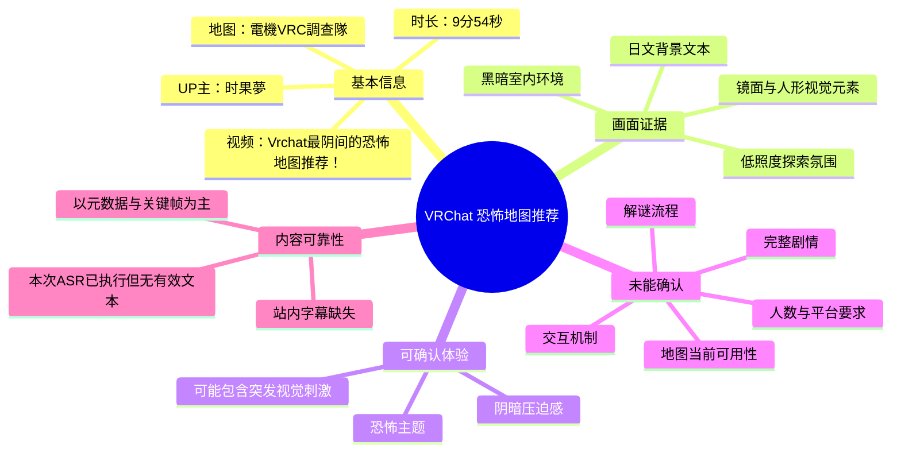
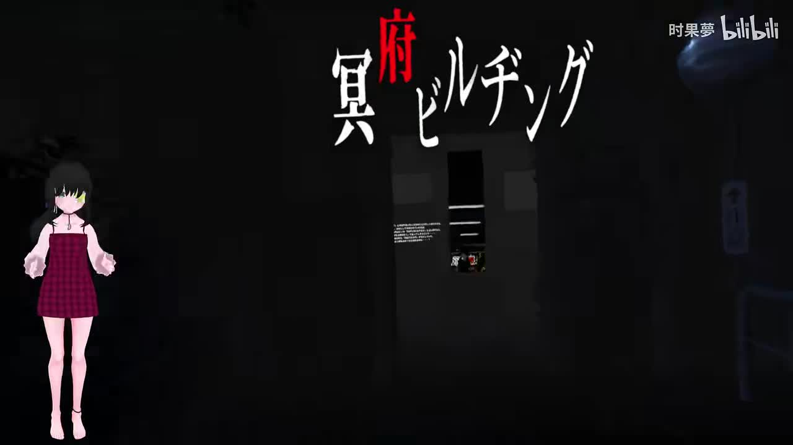
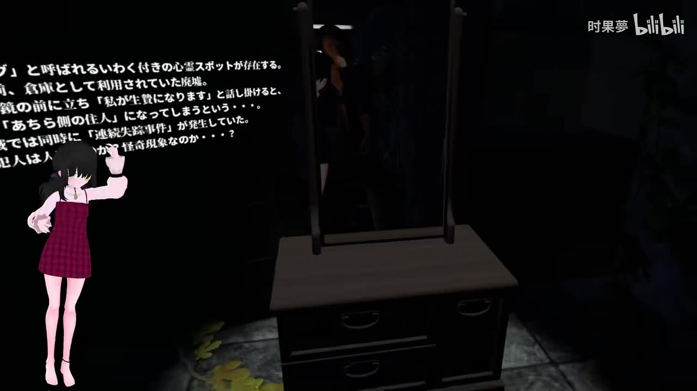
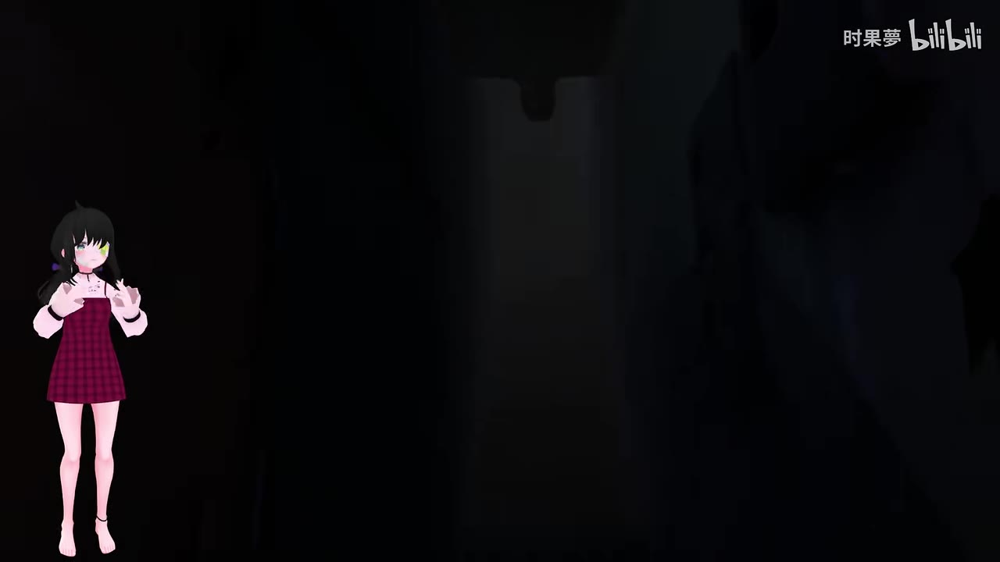
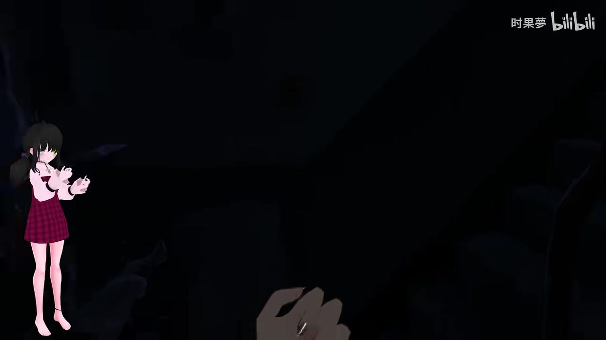

# Vrchat最阴间的恐怖地图推荐！

> 来源：[Bilibili 视频](https://www.bilibili.com/video/BV1Th4y167ni)<br>
> UP 主：时果夢｜发布时间：2023-10-08 17:30:00｜视频时长：9 分 54 秒<br>
> 地图名称：`電機VRC調查隊`｜画面规格：1920 × 1080

## 小结

视频是一段关于 VRChat 恐怖地图的体验与推荐内容。根据视频标题、简介及画面中出现的标题文字，UP 主推荐的地图名称为 **`電機VRC調查隊`**；简介未提供地图链接、作者、容量、人数要求或进入方式，因此这些信息不能由本素材确认。

从可见关键帧看，视频的主要体验方向是黑暗室内探索、带有日文文本的事件/背景说明、镜面或人形异常视觉元素，以及低照度环境中的压迫感。片头画面直接以“最阴间”（日文画面中可见“最”“闇”等字样）强调其恐怖风格定位。

这不是一份可复现的完整通关攻略：本次 ASR 虽已执行，但未产出可用的语音转写文本；站内字幕也未提供。因此，视频中可能存在的具体路线、交互按钮、谜题解法、触发条件、游玩时长与剧透内容，均无法可靠整理，不能补写或推断。

适合正在寻找 VRChat 恐怖地图、且能接受黑暗环境、突发视觉惊吓和日文场景文本的玩家作为初步筛选参考。对光敏感、容易因跳脸/惊吓画面不适，或希望获得明确操作流程的观众，建议先观看原视频并谨慎进入地图。

时效性方面，视频发布于 2023 年 10 月。VRChat 世界的公开状态、名称可检索性、作者更新及兼容性可能已经变化；本笔记仅确认视频发布时简介所写的地图名称，不保证 2026 年仍可通过同一名称进入。

## 思维导图



## 目录

- [视频定位与可确认信息](#视频定位与可确认信息)
- [地图名称与进入前准备](#地图名称与进入前准备)
- [画面中的恐怖设计线索](#画面中的恐怖设计线索)
- [可迁移的游玩经验](#可迁移的游玩经验)
- [技术参数、限制与时效性](#技术参数限制与时效性)
- [字幕比对](#字幕比对)
- [评论分析](#评论分析)
- [处理记录](#处理记录)

## [视频定位与可确认信息](https://www.bilibili.com/video/BV1Th4y167ni?t=0)

视频标题为“Vrchat最阴间的恐怖地图推荐！”，标签包含“惊悚”“恐怖”“地图推荐”“虚拟现实”“VRChat”“虚拟Up主”。这些元数据表明内容定位是 VRChat 恐怖世界推荐与体验展示，而非开发教程、新闻播报或通用 VR 设置教程。

简介只明确写出：

```text
地图名称：電機VRC調查隊
```

因此可确认的核心对象只有这个地图名。名称中包含日文汉字与拉丁字母 `VRC`，检索时宜保留原始写法；但素材没有提供 VRChat 世界链接、世界 ID、作者名或搜索结果，不能保证仅凭该名称就一定能定位到当前版本。



> 图：画面将虚拟形象置于黑暗场景左侧，中央是带醒目红色字的日文标题/标识区域。它直接支持视频的“阴暗恐怖地图”定位，也显示本片以游戏内实录画面搭配虚拟形象呈现。

## [地图名称与进入前准备](https://www.bilibili.com/video/BV1Th4y167ni?t=20)

### 已知信息

- **地图名**：`電機VRC調查隊`
- **平台语境**：VRChat。
- **内容类型**：恐怖地图体验/推荐。
- **画面语言线索**：关键帧中存在日文说明文本。
- **视频时长**：594 秒。

### 素材未给出的关键参数

以下项目对实际游玩很重要，但在现有元数据、可用字幕及关键帧中都没有得到可靠答案：

| 项目 | 当前结论 |
| --- | --- |
| 世界链接或 World ID | 未提供 |
| 地图作者与版本号 | 未提供 |
| 推荐人数/最大人数 | 未提供 |
| 是否支持单人完成 | 未确认 |
| 是否需要 PCVR、桌面模式或特定平台 | 未确认 |
| 是否存在强制镜头、追逐、跳脸或闪烁效果 | 画面暗示存在恐怖视觉刺激，但具体机制未确认 |
| 完整剧情与结局 | 未确认 |
| 预计通关时长 | 未提供 |
| 存档、重开或断线处理 | 未提供 |

### 实际检索与游玩建议

以下是基于已知地图名和恐怖题材给出的通用准备建议，不应视为视频中明确演示的操作步骤：

1. 在 VRChat 的 Worlds/世界搜索中，以原样输入 `電機VRC調查隊`。
2. 若未找到，检查全角字符、日文字符及 `VRC` 是否输入正确；本素材没有提供可替代的英文名或世界 ID。
3. 进入前确认自己可以接受黑暗画面和恐怖氛围；视频关键帧显示可见度较低，画面信息依赖局部光照。
4. 若与朋友同行，可先约定语音联络方式与中止游玩的条件；这是恐怖地图的安全体验建议，并非原视频披露的玩法要求。
5. 如遇到世界下架、改名或不可用，应以 VRChat 当前搜索结果和作者页面为准。

## [画面中的恐怖设计线索](https://www.bilibili.com/video/BV1Th4y167ni?t=120)

### 黑暗空间与文字叙事

第二张关键帧中，左侧能看见大段日文白字说明，右侧为昏暗家具、镜面/竖直反光区域及疑似人形影像。画面以难以一眼辨明的环境细节制造不确定感：玩家需要在低亮度环境里辨认文本、家具和远处对象。



> 图：该帧同时呈现叙事文本与室内异常视觉元素。它说明地图并不只依靠全黑画面，而是将可阅读的日文信息和令人不安的环境物件并置；由于文字分辨率有限，不应据此转录或杜撰剧情。

### 低照度下的未知威胁

第三张关键帧几乎被黑暗覆盖，仅能辨认出中央偏右的竖直门框/家具轮廓，左下为 UP 主的虚拟形象。低照度会缩短观察距离，使玩家难以提前判断前方空间中是否存在事件或可交互物。



> 图：画面展示该体验中极低的可见度。它有助于理解恐怖感主要来自信息受限与空间辨识困难，而非仅靠画面中清晰可见的怪物设计。

### 第一人称手部与探索感

第四张关键帧显示第一人称视角中的手部模型，前方则为黑暗的室内结构和难辨的阴影。手部出现说明画面处于 VRChat 的角色/第一人称交互语境，但无法仅凭这一帧确认是否实际抓取、开门或使用道具。



> 图：该帧强化了“身处场景”的沉浸式视角，并表明玩家视觉注意力会被近处手部、暗处轮廓与环境声效共同牵引；不过素材未提供可靠音频文本，不能进一步判断声效设计或交互功能。

### 可确认与不可确认的边界

| 观察对象 | 可由素材支持的描述 | 不应扩展为的结论 |
| --- | --- | --- |
| 黑暗环境 | 多张关键帧呈现低亮度室内 | “全程完全无照明” |
| 日文文字 | 画面中存在日文段落 | 具体剧情、任务目标或完整翻译 |
| 人形视觉元素 | 镜面/暗处似乎存在人形影像 | 确定的怪物名称、AI 行为或追逐机制 |
| 第一人称手部 | 可见玩家手部模型 | 已确认抓取、开门、持物等交互 |
| 恐怖强度 | 标题、标签、评论及画面共同指向惊吓体验 | 对所有玩家都“最恐怖”的客观排名 |

## [可迁移的游玩经验](https://www.bilibili.com/video/BV1Th4y167ni?t=300)

由于没有有效 ASR 文本，无法从视频中提取 UP 主口述的精确路线、诀窍或操作顺序。以下经验只针对关键帧所呈现的“黑暗、室内、日文文本、潜在惊吓”场景，是可迁移的观看与游玩建议。

### 1. 先管理视觉与舒适度

- 进入前确认头显亮度、音量与游戏内显示设置处于舒适范围。
- 黑暗场景中不宜为了“看清”而盲目调高亮度至破坏黑位；应优先保证能看清近距离移动路径与 UI。
- 容易受惊、眩晕或光敏感的玩家，可先观看原视频以判断接受度，再决定是否亲自体验。
- 发生强烈不适时退出世界或摘下头显即可；不要把恐怖体验当作必须坚持完成的挑战。

### 2. 对文本信息保持核验

画面中日文文本可能承担背景交代、提示或氛围营造，但现有帧图不足以清晰辨认全部内容。建议实际游玩时：

1. 靠近文字后再阅读，不要依据远距离模糊画面猜测。
2. 对关键任务文本截图或记录原文。
3. 若使用翻译工具，应保留原文核对，避免将 OCR 误识别结果当作地图设定。
4. 不要根据本笔记推断任何剧情、人物关系或结局。

### 3. 结伴游玩时的信息同步

黑暗恐怖地图中，队友之间最有价值的信息通常是当前位置、已见线索、是否触发事件和是否需要暂停。视频素材无法确认此地图是否支持多人或是否必须单人，因此结伴游玩只是一项条件性建议：**仅当 VRChat 当前世界设置允许多人进入时适用**。

## [技术参数、限制与时效性](https://www.bilibili.com/video/BV1Th4y167ni?t=500)

### 视频与采集参数

| 项目 | 数值/状态 |
| --- | --- |
| BV 号 | `BV1Th4y167ni` |
| AV 号 | `661711652` |
| 分 P | 1 |
| 时长 | 594 秒（9 分 54 秒） |
| 分辨率 | 1920 × 1080 |
| 画面旋转 | 0 |
| 视频发布时间 | 2023-10-08 17:30:00 |
| 本次素材抓取时间 | 2026-07-12 20:55:14（元数据记录） |
| 视频标签 | 惊悚、恐怖、地图推荐、虚拟现实、VRChat、虚拟Up主 |

### 数据限制

1. **没有可用站内字幕。** 无法用官方/投稿者字幕恢复口述信息。
2. **本次 ASR 已执行，但结果为空。** 因此不能依赖 ASR 生成台词、时间戳、操作指令或剧情概述。
3. **仅提供了部分关键帧。** 关键帧可以说明可见画面，却不能替代连续视频内容；事件触发顺序和持续时间无法由静态图可靠推定。
4. **简介极短。** 只提供地图名称，没有链接、作者、版本或游玩规则。
5. **评论样本有限。** 可获取热评仅 3 条，且互动量较低，不能代表所有观众。
6. **世界状态具时效性。** 本视频发布于 2023 年；VRChat 地图可能已更新、私有化、改名、下架或改变兼容性。

### 时效性结论

视频本身是历史发布内容，适合确认“UP 主曾推荐过名为 `電機VRC調查隊` 的恐怖地图”及其大致风格。若要据此实际进入地图，必须以 VRChat 当前世界搜索和世界详情页为最终依据；任何关于地图现状的判断都不应停留在 2023 年视频的层面。

## [字幕比对](https://www.bilibili.com/video/BV1Th4y167ni?t=540)

| 字幕来源 | 完整性 | 专有名词 | 时间轴 | 主要问题 |
| --- | --- | --- | --- | --- |
| Bilibili 站内字幕 | 无可用字幕 | 无法核验 | 无法使用 | 素材明确标注“未提供可用站内字幕” |
| 本次 ASR 字幕 | 已执行但无有效文本 | 无法从 ASR 识别地图名或术语 | 无有效分段时间轴 | ASR 输出为空，不能承担内容转写任务 |

### 字幕选择与校正结论

最终**不采用任何字幕文本作为正文事实来源**。本次 ASR 已执行，但未提供可用识别结果；站内字幕同样不可用。

地图名 `電機VRC調查隊` 采用视频简介中的原文，而非来自 ASR 推断。画面中的日文说明文字因分辨率与可读性不足，不进行逐字转写或翻译。正文的恐怖环境描述主要由关键帧可见内容、标题、标签与简介交叉支持。

## [评论分析](https://www.bilibili.com/video/BV1Th4y167ni?t=570)

以下仅处理本次可获取的热评前三条。评论反映的是观众主观感受或互动意图，不作为地图机制、剧情或质量的已验证事实。

| 排名 | 评论者 | 获赞 | 评论概括 | 可用信息与可信度 |
| --- | --- | ---: | --- | --- |
| 1 | 76Jack | 2 | “小公主被吓到的样子好可爱” | 观众关注点是 UP 主受惊时的反应，侧面说明视频具有惊吓/恐怖观看效果；这是主观评价，不证明地图的具体触发内容。 |
| 2 | 元枫er | 2 | “三连换置顶” | 典型互动与支持请求，没有提供地图玩法、版本、攻略或争议信息。 |
| 3 | 宴宁c | 1 | “吓到我了，但是视频也不错” | 观众明确感到受惊，同时认可视频观感；可作为恐怖氛围有效的个人反馈，不足以量化地图恐怖程度。 |

三条热评中没有补充世界链接、作者来源、流程解法、兼容性或实际游玩风险。评论层面的共识仅限于：视频对部分观众产生了惊吓感，且 UP 主的反应是观看乐趣的一部分。

## [处理记录](https://www.bilibili.com/video/BV1Th4y167ni?t=593)

- **Worker ID**：`worker-mri24eea-7db640f7`
- **模型**：`gpt-5.6-terra`
- **调用工具与素材**：基于任务提供的 Bilibili 元数据、视频素材清单、关键帧、字幕状态、ASR 输出状态及评论 JSON 进行整理；未获得额外可验证的地图页面或连续转写文本。
- **使用的应用工具**：素材已包含合并视频 `merged.mp4`、音频 `audio/audio.wav`、关键帧目录 `frames/`、信息文件、评论文件、字幕目录与 ASR 目录；本记录只使用任务中显式提供的结果，不宣称执行了未记录的外部检索。
- **字幕选择**：站内字幕不可用；本次 ASR 已执行但输出为空；最终以简介中的地图原名、视频元数据和关键帧视觉证据为准，不用空 ASR 补全台词。
- **关键帧选择依据**：选用 `frame-001.jpg` 展示片头恐怖主题与场景入口，`frame-002.jpg` 展示日文文本、室内家具与疑似异常人影，`frame-003.jpg` 证明低照度探索特征，`frame-004.jpg` 展示第一人称手部和沉浸式场景；均服务于正文中可直接观察的画面论述。
- **缓存清理**：提供的素材记录未包含缓存清理执行结果；因此不能确认是否已清理缓存。
- **未解决问题**：地图当前链接/World ID、作者、版本、人数限制、完整剧情、谜题步骤、平台兼容性、是否仍公开可用，以及视频口述内容均无法从现有素材可靠确认。
