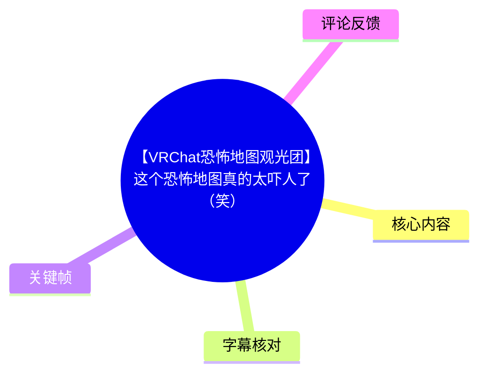
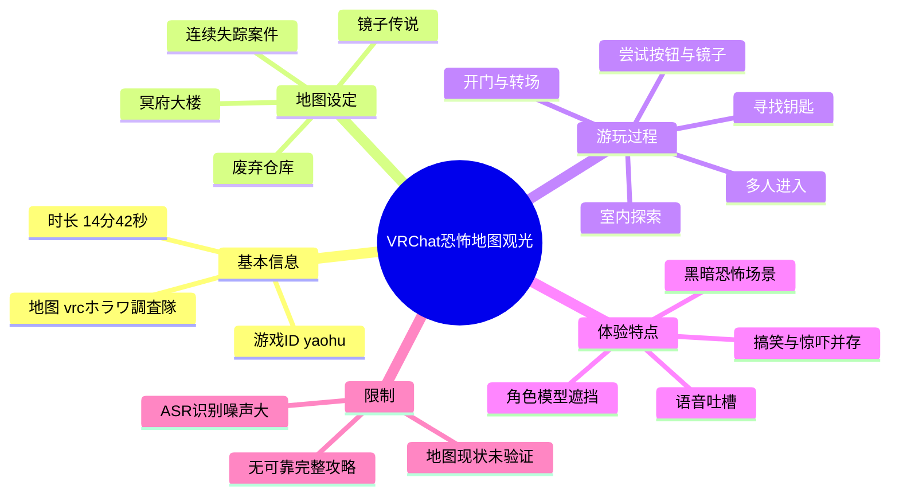
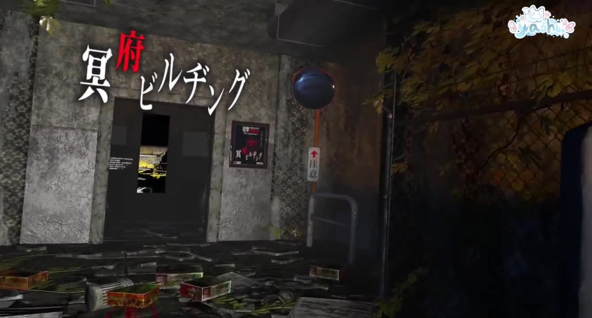
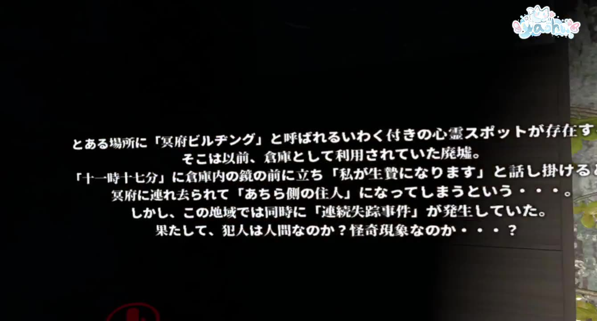
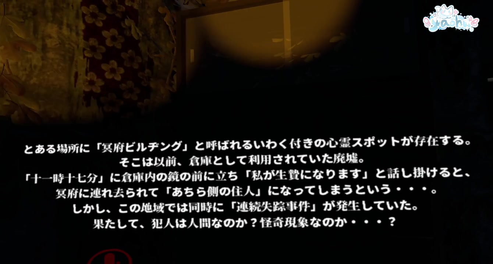

# 【VRChat恐怖地图观光团】这个恐怖地图真的太吓人了（笑）》

> 来源：[Bilibili 视频](https://www.bilibili.com/video/BV1xU4y197ix)  
> UP 主：bili_1458330  
> 发布时间：2022-06-23  
> 视频时长：14 分 42 秒（882 秒）  
> 地图名：`vrcホラワ調査隊`  
> 游戏 ID：`yaohu`  
> 画面规格：2012×1080

## 小结

这是一段多人进入 VRChat 恐怖地图 `vrcホラワ調査隊` 的实况观光记录。地图以“冥府大楼”为场景：一座曾作仓库使用的废墟，流传着在特定时间对镜子说话会被带往冥府的传说，同时当地还发生连续失踪案件。视频中的玩家一边尝试推进地图机关，一边以聊天、吐槽和玩笑消解恐怖氛围。

核心体验不在于严肃的恐怖叙事解析，而在于多人 VRChat 游玩产生的反差：地图试图通过废弃建筑、黑暗环境、镜子、钥匙、按钮、人头等元素制造惊悚感；玩家则频繁因为视角遮挡、模型比例、移动速度、道具交互和找路问题偏离主线，形成“搞笑恐怖地图”的观感。

从可辨识的游玩过程看，地图至少包含入口说明、室内探索、寻找钥匙或可交互物件、镜子相关机关、按钮与道具尝试、开门/转场，以及结尾区域等环节。玩家多次讨论“钥匙”“按钮”“镜子可以点”“棍子敲按钮”等可能的解谜路径，但 ASR 文本噪声很大，不能据此确认每个机关的精确触发条件。

视频适合希望了解早期 VRChat 多人恐怖地图氛围、组队实况互动方式，或寻找 `vrcホラワ調査隊` 这一地图线索的观众。若目的是获得无误的通关攻略，则本视频并不充分：没有清晰、完整地逐步讲解操作，且多人聊天和遮挡会降低关键信息可见性。

本片没有时事新闻、产品发布或可复用的软件配置教学。其时效性主要体现在 VRChat 地图可访问性：视频发布于 2022 年，至素材抓取时间 2026-07-13，地图 `yaohu` 是否仍公开、是否更新、原有交互是否变化，均未由素材验证。

## 思维导图

## 目录

- [视频背景与素材边界](#视频背景与素材边界)
- [地图设定：冥府大楼与失踪事件](#地图设定冥府大楼与失踪事件)
- [多人入场与恐怖氛围的反差](#多人入场与恐怖氛围的反差)
- [探索与解谜：钥匙、镜子、按钮](#探索与解谜钥匙镜子按钮)
- [实况中的交互经验与限制](#实况中的交互经验与限制)
- [时间轴梳理](#时间轴梳理)
- [关键帧](#关键帧)
- [字幕比对](#字幕比对)
- [评论分析](#评论分析)
- [处理记录](#处理记录)

## 视频背景与素材边界 [00:00](https://www.bilibili.com/video/BV1xU4y197ix?t=0)

视频标题明确将内容定位为“VRChat 恐怖地图观光团”。元数据描述给出了两个最重要的检索信息：

- **地图名**：`vrcホラワ調査隊`
- **游戏 ID**：`yaohu`

标题中的“这个恐怖地图真的太吓人了（笑）”与实际实况呈现的效果存在明显反差：参与者会受到突发画面、环境音和黑暗场景影响而惊叫，但更多时间处于互相调侃、讨论零食、评价模型，以及尝试理解机关用途的状态。因此，“恐怖”是地图的题材与布景，“搞笑”则是多人互动产生的实际观看体验。

视频未出现关于地图作者、发布版本、推荐人数、是否支持 Quest、是否需要特定 SDK、通关时长、重生机制或完整规则的可靠说明。观看者不能仅凭本片推导这些技术参数。

## 地图设定：冥府大楼与失踪事件 [00:20](https://www.bilibili.com/video/BV1xU4y197ix?t=20)

地图入口及说明文字展示了本作的叙事前提。画面中的日文标题为“冥府ビルヂング”，可理解为“冥府大楼”。文字说明的大意为：

1. 某处存在一个被称为“冥府大楼”的灵异地点。
2. 该地点曾被作为仓库使用，如今已成废墟。
3. 传言称，在“十一时十七分”站在仓库内镜子前并说出“我会成为活祭品”，会被带往冥府，成为“彼岸的住民”。
4. 与此同时，当地发生了连续失踪案件。
5. 作品以“犯人究竟是人类，还是怪异现象”为悬念。

其中“十一时十七分”“镜子”“活祭品”“连续失踪”是可由关键帧日文说明直接支持的剧情要素。它们属于地图设置，不应被理解为现实事件或真实都市传说的证明。

> 图：入口画面直接展示“冥府ビルヂング”名称、废弃建筑外观和昏暗环境，是确认地图主题、地点名称与美术基调的重要依据。

> 图：日文说明集中给出了废弃仓库、镜子仪式、十一时十七分、冥府与连续失踪案件等背景信息。相较于噪声较大的语音 ASR，这一帧对还原地图设定的价值更高。

## 多人入场与恐怖氛围的反差 [01:00](https://www.bilibili.com/video/BV1xU4y197ix?t=60)

进入场景后，玩家首先注意到前方的多位女性动漫风格 Avatar，并以“好可爱的小姐姐”等语句互动。多人同行虽然降低了孤身探索恐怖地图的压迫感，却也带来了 VRChat 实况中常见的可视性问题：

- 近距离角色模型会遮挡镜头与文本；
- 玩家体型差异会影响视线，视频中有人说自己“太矮了只能看到一对耳朵”；
- 多人聚在狭窄入口或机关附近时，角色身体与头发模型会阻塞前路；
- 角色移动、转头和镜头跟随可能导致眩晕或难以辨认可交互目标。

参与者多次评价场景模型“粗糙”或像扫描建筑制作而成。这是玩家的主观实时感受，不代表地图实际采用了何种建模、扫描或优化技术；素材没有提供制作方法或性能数据。

> 图：粉色长发 Avatar 占据前景、后方还有其他角色，直观说明多人恐怖地图中“玩家模型遮挡文本和视线”的问题，也解释了实况里频繁出现的找路与信息遗漏。

## 探索与解谜：钥匙、镜子、按钮 [04:00](https://www.bilibili.com/video/BV1xU4y197ix?t=240)

从 ASR 的上下文顺序可辨认，队伍在室内探索时持续寻找推进条件，反复提到以下对象：

| 对象 | 视频中可确认的现象 | 不可确认部分 |
| --- | --- | --- |
| 钥匙 | 玩家看到或讨论“钥匙”，后段还提到“一把很大的钥匙” | 钥匙的准确位置、是否必须拾取、对应哪扇门 |
| 镜子 | 地图背景本身强调镜子；玩家也说“这个镜子可以点” | 镜子是否真的可交互、具体触发方式及仪式台词是否要输入 |
| 按钮 | 玩家讨论“那个按键可以点”“按钮有什么用” | 按钮的功能、按下顺序、是否为有效机关 |
| 棍状道具 | 有人提出用“棍子敲外面那个按钮”的猜测 | 道具名称、是否为正确解法 |
| 门 | 语音中出现“门开了”“门在这儿”等推进性描述 | 每次开门的触发条件和目的地 |

这一段最值得提炼的不是某个确定解法，而是多人探索恐怖地图时的**协作模式**：一人发现物件或可疑位置，其他人通过口头确认、移动视角、尝试点击/接触来验证；当视觉信息被遮挡或语音不清时，队伍容易产生重复搜索和错误猜测。

### 可从视频迁移的探索步骤

以下为根据实况行为整理的通用流程，不是本地图的已验证标准攻略：

1. **先读取入口叙事文本**：确认地图是否给出时间、镜子、特定台词或地点等硬性线索。
2. **控制队形与站位**：阅读提示牌、寻找小物件时，其他玩家应主动退开，避免 Avatar 遮挡。
3. **对可疑物体分组验证**：将钥匙、门、镜子、按钮、掉落物分别报点，不要只说“这里有东西”。
4. **优先尝试视觉上明确的交互反馈**：如按钮位移、门打开、物件消失、区域转场；发生反馈后再判断是否推进。
5. **记录已检查区域**：多人语音中同一地点容易被重复搜索，最好明确“已试镜子”“按钮未见效果”等状态。
6. **注意舒适度**：黑暗场景、快速转头、近距离模型遮挡会增加眩晕感；有不适时应降低移动和镜头剧烈摆动。

## 实况中的交互经验与限制 [08:00](https://www.bilibili.com/video/BV1xU4y197ix?t=480)

视频后半段继续围绕机关和场景推进展开。可辨识片段包括：玩家称“我们被抓进来了”“我们被刷在镜子里面了”，随后继续讨论电池、按钮、镜子、钥匙、门与转场。由于 ASR 有大量错词、漏词和发言者混淆，这些话只能说明实况里出现了疑似镜面/传送式场景变化，不能据此断定地图存在特定“镜中囚禁”机制。

### 观看与游玩的几个限制

- **字幕可用性限制**：站内字幕与视频内容完全不匹配；本次 ASR 虽与视频主题相关，但错误率很高。
- **语音环境限制**：多人同时讲话、笑声、方言或口语化表达会显著降低语音转写可靠性。
- **镜头限制**：第一人称/跟随视角中，队友模型可能挡住关键物件，观众未必能看清触发过程。
- **信息限制**：素材未给出玩家平台、控制器、VR 设备、图形设置、地图版本或完整通关路径。
- **恐怖内容限制**：视频包含黑暗废墟、灵异传说、失踪事件、头部模型等恐怖元素；但整体基调被玩家玩笑显著冲淡。
- **时效性限制**：地图资料来自 2022 年视频描述。至 2026-07-13 的抓取时间，不能确认 `yaohu` 是否仍可搜索、是否私有化或已更新。

## 时间轴梳理 [00:00](https://www.bilibili.com/video/BV1xU4y197ix?t=0)

> 以下时间为根据关键帧位置与 ASR 发言顺序整理的**近似定位**，适合快速回看，不应视作逐秒精确字幕时间码。

| 时间 | 内容 | 证据与说明 |
| --- | --- | --- |
| [00:00](https://www.bilibili.com/video/BV1xU4y197ix?t=0) | 抵达“冥府大楼”入口 | 入口关键帧展示日文名称与废弃建筑外观。 |
| [00:20](https://www.bilibili.com/video/BV1xU4y197ix?t=20) | 阅读地图背景设定 | 日文说明介绍废弃仓库、镜子传说与连续失踪案件。 |
| [01:00](https://www.bilibili.com/video/BV1xU4y197ix?t=60) | 多人角色聚集、准备进入 | ASR 中出现对前方“小姐姐”的互动和“我们要进去吗”。 |
| [02:00](https://www.bilibili.com/video/BV1xU4y197ix?t=120) | 入场后的初次惊吓与场景吐槽 | 出现“吓我一跳”“调查开始”“模型怎么那么粗糙”等反应。 |
| [03:30](https://www.bilibili.com/video/BV1xU4y197ix?t=210) | 室内探索、寻找钥匙或路径 | ASR 中多次出现“需要钥匙吗”“那里有一个小姐姐”“下面有”。 |
| [05:30](https://www.bilibili.com/video/BV1xU4y197ix?t=330) | 因模型遮挡与闲聊偏离解谜 | 多人讨论体型、视野、零食与 Avatar 外观，体现实况的搞笑氛围。 |
| [07:00](https://www.bilibili.com/video/BV1xU4y197ix?t=420) | 发现头部、人影等恐怖元素 | ASR 中可辨识“这里有个人头”等描述。 |
| [08:30](https://www.bilibili.com/video/BV1xU4y197ix?t=510) | 镜子与按钮相关尝试 | 出现“被刷在镜子里面”“按钮有什么用吗”“镜子可以点”等发言。 |
| [10:30](https://www.bilibili.com/video/BV1xU4y197ix?t=630) | 讨论道具与机关解法 | 有人猜测使用棍状道具敲击外部按钮。 |
| [12:00](https://www.bilibili.com/video/BV1xU4y197ix?t=720) | 钥匙、门与转场推进 | 出现“大把钥匙”“门在这儿”“又死在车上”等片段化描述。 |
| [14:00](https://www.bilibili.com/video/BV1xU4y197ix?t=840) | 接近结尾、确认结束 | ASR 中出现“结束啦”“结束了”“就这”。 |

## 关键帧 [00:00](https://www.bilibili.com/video/BV1xU4y197ix?t=0)

### 入口环境与地图名称

> 图像价值：画面保留了“冥府ビルヂング”的场景标识、破败墙面、杂物与昏暗道路，可作为地图名称和恐怖环境设计的视觉证据。

### 剧情文本的清晰记录

> 图像价值：此帧再次清晰呈现日文设定文字，适合核对“十一时十七分”“镜子”“活祭品”“连续失踪案件”等关键叙事信息，避免依赖 ASR 错误转写。

### 多人游玩时的视野遮挡

> 图像价值：该帧显示角色模型在狭窄视野中占据大量画面，是解释玩家为何难以读提示、看清机关和保持镜头清晰的直接案例。

## 字幕比对 [00:00](https://www.bilibili.com/video/BV1xU4y197ix?t=0)

本次任务中，**站内字幕存在，但内容与该视频完全不匹配**：其内容是 A 股、白酒、上证指数、估值和投资策略分析，与 VRChat 恐怖地图实况无关。与此同时，本次 ASR 已执行，内容与视频场景和玩家对话基本对应，但因多人同步发言、口语、省略、环境声与可能的日语文本，识别质量有限。

| 字幕来源 | 完整性 | 专有名词 | 时间轴 | 主要问题 |
| --- | --- | --- | --- | --- |
| Bilibili 站内字幕 | 对本视频不可用 | 完全错误，出现“白酒”“上证指数”“巴菲特”等投资话题 | 提供文本但与画面无对应关系 | 字幕疑似串片或错误关联，不能用于正文。 |
| 本次 ASR 字幕 | 覆盖较多玩家对话，但大量断句与漏识别 | 能识别“钥匙”“镜子”“按钮”“VRChat式多人聊天”等普通词；地图日文名识别不可靠 | 未提供逐句可靠时间码，只能结合顺序近似定位 | 人声重叠、错别字、同音替换严重，部分语句不可释义。 |

### 最终字幕选择

正文以**视频元数据、关键帧中的日文可见文字、以及经上下文筛选后的本次 ASR**为依据；不采用站内字幕的任何投资内容。

重点校正如下：

- 地图名称采用元数据描述中的 `vrcホラワ調査隊`，而非 ASR 的不稳定音译。
- 游戏 ID 采用元数据中的 `yaohu`。
- “冥府大楼”“十一时十七分”“镜子前”“活祭品”“连续失踪案件”以关键帧内日文说明为准。
- ASR 中关于“钥匙”“按钮”“镜子可以点”“门开了”等内容，仅作为玩家当时观察和尝试的记录，不扩展为已证实的地图攻略。

## 评论分析 [00:00](https://www.bilibili.com/video/BV1xU4y197ix?t=0)

仅处理当前可获取的热评前三条；评论是用户表达，不作为地图机制或事实的独立证据。

1. **刘雨啊｜12 赞**  
   评论内容为面向新 V 的加油与关注鼓励。它反映出评论区存在对创作者的友好支持，但没有补充地图玩法、恐怖内容或技术信息。

2. **芜湖woho｜3 赞**  
   评论为“打卡”表情/热词，没有实质观点或可验证补充信息。可视为普通互动，不宜从中推导观看感受或地图质量。

3. **童话里的棉花糖｜1 赞**  
   评论称“这个真的吓到我了，完全被好友拉着走”。这与视频中多人同行、受惊后依赖队友推进的体验相呼应，说明至少有观众感受到地图的惊吓效果；但它属于个人感受，不能量化地图的恐怖程度，也不能确认具体受惊环节。

## 处理记录 [00:00](https://www.bilibili.com/video/BV1xU4y197ix?t=0)

- **Worker ID**：`worker-mri3t0px-8b394786`
- **模型**：`gpt-5.6-terra`
- **素材与工具**：使用任务提供的 Bilibili 元数据、视频素材清单、站内字幕文本、本次 ASR 字幕、热评 JSON，以及关键帧 `frames/` 中可见画面进行整理；本次 ASR 已执行。
- **字幕选择**：弃用与视频主题不符的站内字幕；采用关键帧文字为地图设定主证据，并有限采用本次 ASR 中可由上下文支持的玩家对话。
- **关键帧依据**：选择入口帧确认“冥府大楼”场景，选择剧情文字帧校正日文背景设定，选择多人 Avatar 帧说明实况中遮挡视野和协作困难的原因。
- **缓存清理**：素材清单仅提供 `merged.mp4`、音频、帧、字幕、ASR、评论等产物路径，未提供缓存清理执行日志；因此无法确认是否已清理缓存。
- **未解决问题**：
  - 未提供可验证的逐秒字幕时间码，时间轴为近似定位；
  - 未能从素材中确认全部机关的正确触发方式；
  - 未验证地图 `yaohu` 在 2026-07-13 是否仍可访问，以及其版本是否与视频一致；
  - 未提供地图作者、制作工具、性能配置与平台兼容性信息。

## 评论分析

本次流程未获取到可用热评，因此不推断观众态度或额外结论。
