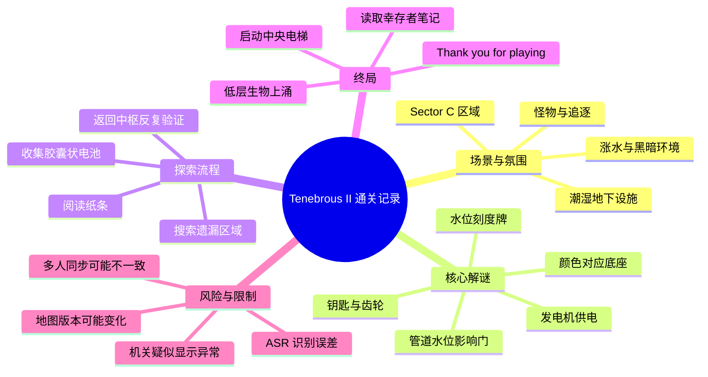
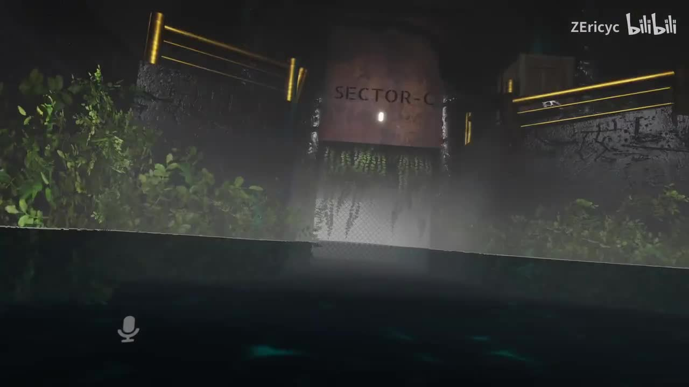
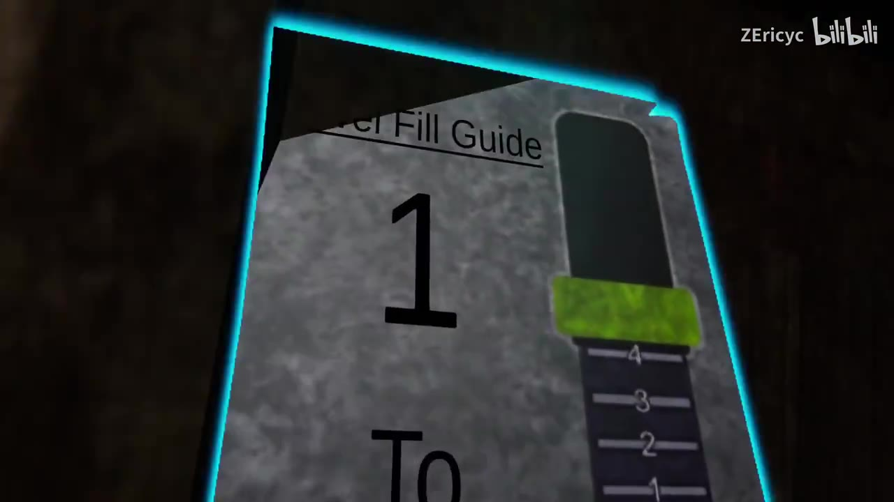
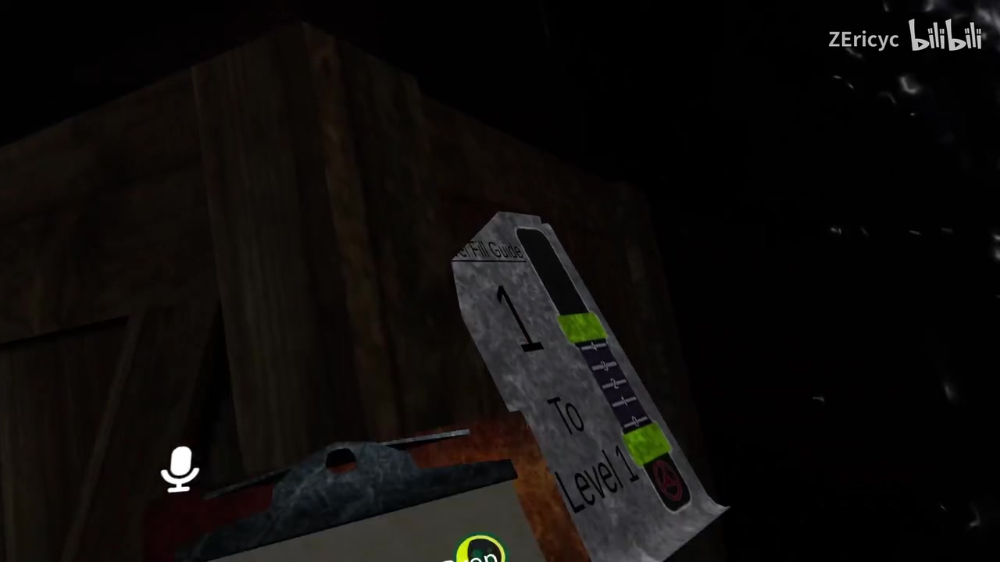
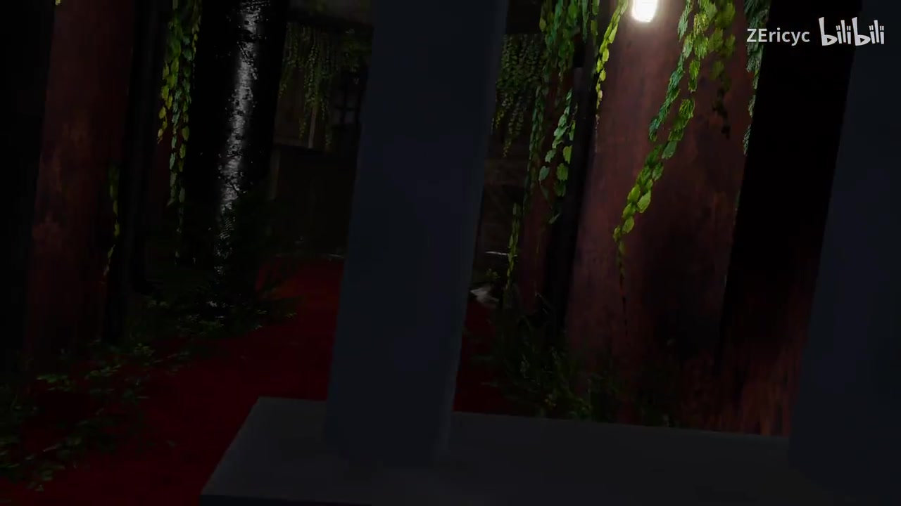

# VRChat恐怖地图 Tenebrous II 全流程通关

> 来源：[Bilibili 视频](https://www.bilibili.com/video/BV1o94y1V7Ag) 
> UP 主：ZEricyc｜发布时间：2023-10-29｜视频时长：56 分 55 秒｜分辨率：1920×1080 
> 视频简介：最墨迹的一集

## 小结

本视频记录多人游玩 VRChat 恐怖解谜地图 **Tenebrous II** 的完整通关过程。地图的主要场景是潮湿、昏暗的地下或深海设施，玩家需要在探索中阅读纸条、收集钥匙与齿轮、调节水位、启动发电机，并最终通过中央电梯相关机关离开区域。

最重要的实战经验是：地图的谜题并非只靠单一物件完成，而是围绕“**水位—门体运动—供电—可通行区域**”组成联动。队伍先根据标有数字的水位指示牌尝试调整管道水位，随后发现机关显示或水位变化存在疑似同步／显示异常；后续又因遗漏齿轮、钥匙、胶囊状电池等小型物品而多次折返。视频因此特别适合用来观察恐怖地图中常见的“先广泛搜集、再回到中枢机关验证”的解题方式。

流程中可确认的关键物件包括：带数字的水位刻度牌、钥匙、不同大小的齿轮、发电机、带颜色区分的底座、疑似电池或燃料的胶囊状装置，以及最终与中央电梯有关的供能设备。玩家还读到了与设施失控、低层生物上涌、关闭仓壁门及电梯撤离有关的文本，从而将解谜过程与地图叙事串联起来。

视频并非严格意义上的速通攻略：多人语音中存在大量即时讨论、玩笑、误判和回溯，且 ASR 没有保留句级时间码；因此本文按可核验的叙事顺序整理流程，而不把口头猜测当作地图规则。视频中提及“涨水位有 bug”，只能视为该次游玩观察，不能断言为地图的稳定机制或当前版本状态。

时效性方面，视频发布于 2023 年 10 月；VRChat 世界可能经历作者更新、交互逻辑改动或实例同步差异。本文描述的是该视频所呈现的一次通关记录，不保证适用于 2026 年或其他房间实例。

## 思维导图

## 目录

- [视频背景、范围与时间轴说明](#视频背景范围与时间轴说明)
- [设施入口与水位谜题](#设施入口与水位谜题)
- [钥匙、齿轮与供电链路](#钥匙齿轮与供电链路)
- [发电机、水鬼与环境探索](#发电机水鬼与环境探索)
- [卡关复盘：寻找胶囊状电池](#卡关复盘寻找胶囊状电池)
- [终局机关与地图叙事](#终局机关与地图叙事)
- [可复用的通关步骤与参数](#可复用的通关步骤与参数)
- [限制、时效性与风险](#限制时效性与风险)
- [字幕比对](#字幕比对)
- [评论分析](#评论分析)
- [处理记录](#处理记录)

## 视频背景、范围与时间轴说明 [00:00](https://www.bilibili.com/video/BV1o94y1V7Ag?t=0)

视频标题明确为《VRChat恐怖地图 Tenebrous II 全流程通关》，标签包括“恐怖”“全流程”“VR”“Tenebrous”“VRChat”“VRC”等。它不是地图作者发布的官方说明，而是一组玩家在 VRChat 内实际探索、讨论与完成流程的录制。

视频总长度为 **3415 秒（56 分 55 秒）**。所提供的 ASR 文本未附带逐句时间戳，关键帧清单也未提供对应提取秒数。因此，以下章节采用“剧情与操作的先后顺序”组织；章节标题中的链接统一提供视频入口时间轴，不能将其理解为未在素材中出现的精确秒级定位。

地图呈现出工业设施与自然侵蚀并存的风格：昏暗的金属结构、积水、藤蔓、狭窄通道及需要手持照明观察的环境共同构成恐怖氛围。玩家一开始便进入标识为 “SECTOR-C” 的区域。

> 图：画面可见 “SECTOR-C” 标牌、雾气、反光积水与藤蔓。这张图能直观说明本次探索的场景基调：可见度低、地面积水、环境信息需要靠近观察。

## 设施入口与水位谜题 [00:00](https://www.bilibili.com/video/BV1o94y1V7Ag?t=0)

### 发现水位异常与可读线索

队伍注意到“水一直在涨”，并在探索途中发现可翻阅的纸条。ASR 可辨识出一段与设施状态有关的内容：

- “污染成阳性，建议我们赶紧撤退。”
- “这些管道内的水位似乎决定了门的运动。”
- 另有文本提及“保持通风”，但 ASR 对完整句意识别不稳定。

其中，“管道内水位决定门的运动”是这一阶段最清晰、最直接的机制提示。玩家据此把带编号的水位装置与此前见到的数字牌联系起来，开始寻找与 **1、2、3、4、5** 等编号相关的控制位置。

> 图：指示牌上可见 “1”“To Level 1” 以及右侧分级刻度。它是辨认水位谜题输入与目标层级的重要视觉依据，比仅凭口头报数更可靠。

### 水位控制的观察结果

视频中，玩家的讨论涉及若干数字与组合，例如：

- 曾提到已知“一个是 3、一个是 1、一个 5”；
- 后续尝试或讨论过 “3、4、2”“5、4”“4、4、3”等数值；
- 有人提到“2 号就是 0”“2 号把 0 给卸了”，但上下文不足，不能据此还原完整标准答案；
- 队员之间对仪表读数出现差异：一方说“满的”，另一方说看到“3”或“滤的”。

因此，可以确认地图存在基于编号与刻度的水位操作，但**无法从现有 ASR 可靠推出一套完整、固定的数字答案**。

### 疑似同步或机关显示异常

当玩家反复调节水位时，语音明确出现：

- “他有 bug，他涨水位是有 bug 的。”
- “或者是调一个阶级的不会涨。”
- 多人看到的状态并不完全一致。

这可能意味着以下任一情况：

1. 多人实例中的机关状态同步存在延迟或不一致；
2. 某些调节操作只对特定管路／门有效；
3. 记录者将谜题机制误判为 bug；
4. 当前游玩版本的交互反馈本身不够清晰。

素材不足以裁定具体原因。对实际游玩者而言，更稳妥的做法不是只相信某一人的视觉读数，而是以**门是否开启、通道是否可走、机关是否出现新的交互状态**作为验证标准。

> 图：画面将水位刻度牌放在实际场景交互环境中，而非孤立展示。其价值在于说明该装置需要与设施中的其他门、管道或控制结构联动理解。

## 钥匙、齿轮与供电链路 [00:00](https://www.bilibili.com/video/BV1o94y1V7Ag?t=0)

### 探索中收集的物品

水位机关之外，队伍在不同区域找到并讨论了多种推进道具：

| 物品／线索 | 视频中的用途或关联 | 可确认程度 |
| --- | --- | --- |
| 钥匙 | 玩家称其可开启“那边”的锁定位置或卡相关区域 | 可确认找到钥匙；具体门位不完整 |
| 齿轮 | 至少有“大齿轮”“较厚的齿轮”等表述，疑似用于机械机关 | 可确认存在且容易遗漏 |
| 纸条／笔记 | 提供水位、设施状态和剧情信息 | 可确认 |
| 发电机 | 为某些门、区域或终局机关供电 | 可确认 |
| 胶囊状物件 | 后期被确认是电池或可供能装置 | 可确认 |
| 有颜色的底座 | 玩家认为需按底座颜色放置相应物件 | 作为玩家操作判断，可确认 |

其中，齿轮是典型的“绕路后容易漏拿”的收集物。玩家在离开某处后又重新检查，发现“这就个大齿轮”“差一点就没了”，说明地图将小型推进物放在容易被视线忽略的角落或回头路上。

### 读纸条的优先级

视频中有人认为普通印刷式“正规报道”笔记信息价值不高，而手写风格的纸条更有意思；另一位玩家则提醒“这种纸条都是冒烟的，它跟正常的笔记不一样，这都得翻译一下”。

从流程角度，这里可提炼出一个有效做法：

- **优先阅读带视觉提示的纸条**：如冒烟、特殊发光、放置位置异常；
- **普通笔记也不应直接跳过**：终局剧情证明，文本中可能包含设施运行状态、人物关系和撤离逻辑；
- **多人分工时复述关键信息**：避免只有阅读者知道线索、其他人无法将物件和机关对应起来。

## 发电机、水鬼与环境探索 [00:00](https://www.bilibili.com/video/BV1o94y1V7Ag?t=0)

### 淹水区域与恐怖事件

进入更深处后，队伍确认“发电机房被淹了”，并听到与水下怪物有关的提示和惊吓反应。有人称其为“水鬼”，描述曾看到“一个蓝色的”“铺手”或类似肢体的视觉对象；由于 ASR 错漏，无法精确确认怪物外观。

环境文字进一步强化水下威胁。ASR 保留了一段近似第一人称日志的内容，大意为：

- 水已经没到脚踝；
- 每一步都会引发不安；
- 水面之下似乎潜伏着某种存在；
- 被观察的感觉持续存在。

这段文本与玩家对“水鬼”的即时反应形成对应：积水既是影响机关的系统变量，也是制造惊吓与路线压力的场景元素。

> 图：狭窄通道被金属立柱、阴影和藤蔓分割，适合说明地图为何容易造成漏看道具、误判道路以及被突发事件打断搜索节奏。

### 发电机与门的关系

玩家发现某些门需要电力，并确认至少存在不止一个发电机位置：

- “这个需要电力。”
- “发电机转了是不是。”
- “我们一开始来的那地方也有发电机。”
- “这个发电器肯定要开这边的左边了。”
- “那个是要放啥，需要放插槽。”

由此可整理为：供电不是单一开关，而是与门、插槽、可搬运供能物等多个要素有关。玩家虽然在中段成功让部分门打开，但依然需要继续回到起始区域和中枢区域补完另一套供电条件。

### 怪物、模型与追逐段落

视频还出现了多个非纯解谜性质的恐怖或演出元素：

- 玩家在雕像或模型旁反复讨论其是否像“福瑞”造型；
- 某些光照效果使玩家角色呈现大面积黑影，大家将其当作拍照和惊吓素材；
- 有人回头时遇到怪物或事件，确认“结果是追逐的”；
- 队伍在触发事件后决定赶紧撤回。

这些内容说明 Tenebrous II 的推进不完全依赖谜题，也通过视觉异常、突然出现的生物与追逐来改变玩家行动节奏。对于实际游玩者，遇到可疑开关、拉杆或拾取物时，应先保证队伍集合并确认退路，避免一人触发事件、其余人不清楚事件内容。

## 卡关复盘：寻找胶囊状电池 [00:00](https://www.bilibili.com/video/BV1o94y1V7Ag?t=0)

### 卡关原因不是缺少解法，而是遗漏物件

中后段的主要卡点在于：队伍知道需要“找一个跟胶囊一样的东西”，也猜到它可能与电力或插槽有关，却一度找不到位置。

期间出现了多种错误方向：

- 怀疑之前丢弃的雕像就是插槽所需物；
- 在已经探索过的房间反复寻找；
- 把可交互摆件、雕像与关键物品混淆；
- 因为队友说“这边没有东西”而暂时放弃某条路；
- 试图从边缘跳出或检查空气墙外区域。

最终，玩家回到此前认为“没东西”的区域后找到了物件，并感叹“我一开始问一面……说这边没有东西”“但是我没有死心往这边看”。这段流程的核心经验是：**“队友已搜过”并不等于“区域已被完全排除”。**

### 电池与颜色底座的识别

找到的物体被玩家描述为类似“电池”、形似“太刀人一样里面那个”的胶囊状物件。之后队伍注意到：

- “应该是按另一个的，按在另一个上面的。”
- “你看底座颜色。”
- “红色的能充电。”
- “这个得放在那个红色的地方。”

这些对话支持如下操作链路：

1. 找到胶囊状电池／能量物件；
2. 观察可放置底座的颜色；
3. 将物件放入与其用途对应的红色供能位置；
4. 如果机关无反应，检查物件是否放在了错误底座，或是否需要先按住按钮／维持交互；
5. 供电后再返回原本无电的区域验证门、电梯或机器状态。

需要注意，“红色的能充电”是视频中玩家基于现场反馈得出的判断，并未得到地图官方文本的单独验证；但它确实构成该次通关中的关键操作方向。

### 避免同类卡关的搜索清单

当已知需要某个小型可搬运物、但地图推进停滞时，可以按视频经验执行：

1. **回到最近一次获得明确提示的位置**：例如插槽、无电发电机或颜色底座附近。
2. **重查被口头排除的支路**：尤其是视角低、光线暗、需要绕柱或跳上平台的位置。
3. **检查“装饰物”是否可抓取**：但不要仅因可抓取就认定它是关键道具。
4. **检查遗漏的齿轮、钥匙与可开门**：一个未打开的小门可能通向真正的推进物。
5. **携带道具时确认同步状态**：视频中曾讨论“你拿的东西就是在你手上”，说明多人房间中应让队友确认物件可见性。
6. **以机关反馈为准**：物件放入后应观察灯光、门、发电机转动或水位变化，而不是只凭猜测继续跑图。

## 终局机关与地图叙事 [00:00](https://www.bilibili.com/video/BV1o94y1V7Ag?t=0)

### 供能、反转与中央电梯

在取得电池并完成相关供能操作后，队伍讨论“反转轴”“把这玩意抠了”“你给他拔了，他不就没电了吗”等操作。虽然 ASR 无法完整还原机关构造，但能确认他们最终通过搬运、拔取或调整供能组件，成功让终局设施进入可推进状态。

随后玩家到达带有 “Thank you for playing” 字样的结尾区域，并确认此前一直讨论的装置实际是电梯或与电梯紧密关联的设施。玩家总结为：有人给装置补充了燃料／电力，但不确定电梯是否还能正常运行；不管怎样，仍选择努力活下去。

### 终局笔记中的故事信息

结尾处有较完整的剧情文本。根据 ASR，可确认的叙事要点包括：

- 日志作者为 **安德森（Anderson）和吉姆（Jim）**，或至少文本提及这两个名字；
- 他们与工作人员前往“中央电梯平台”；
- 设施情况越来越糟；
- 来自低层的生物通过涡轮机结构向上移动；
- 一行人到达电梯后做出艰难决定；
- 安德森与吉姆选择手动关闭仓壁门，将自己封闭起来；
- 他们安排电梯上的工作人员离开，并阻止其返回该层；
- 这些低层生物是设施灾难的核心威胁。

玩家将自己在流程中的身份理解为“威廉（William）”。这一判断来自他们对笔记内容与当前玩家位置的联系，但由于 ASR 对人名和句子边界识别不稳定，本文将其标记为**玩家对剧情身份的解读**，而非已由完整原文逐字确认的结论。

### “年糕”称呼的来源

玩家在结局后戏称低层怪物像“年糕”，并说刚才出现的大型怪物“长得多像一坨年糕”。这是基于外观的玩笑式称呼，不是已验证的地图官方怪物名称。整理攻略时应避免把“年糕”当作正式设定术语。

## 可复用的通关步骤与参数 [00:00](https://www.bilibili.com/video/BV1o94y1V7Ag?t=0)

以下是根据视频实际流程抽取的操作顺序。它保留关键依赖关系，但不虚构视频未能确认的固定密码或全部机关数值。

| 阶段 | 操作 | 验证方式 | 常见失误 |
| --- | --- | --- | --- |
| 1. 初始探索 | 观察区域编号、积水、可读纸条与锁门 | 记录门、刻度牌、发电机位置 | 只顾前进，未建立区域地图 |
| 2. 水位谜题 | 寻找带编号的水位牌，调整管道或相关控制 | 看门体运动、新道路或水位反馈 | 把不同队员的显示差异当作唯一依据 |
| 3. 物件收集 | 拿取钥匙、齿轮及其他可推进物 | 逐一回到对应门／机械处试用 | 漏看角落的大齿轮 |
| 4. 发电机区域 | 检查被淹房间和需要电力的门 | 发电机转动、灯光或门开启 | 忽略起始区域可能还有一台发电机 |
| 5. 追逐与回撤 | 触发恐怖事件后保持队伍沟通 | 确认所有人都回到安全路线 | 一人触发、其他人不知剧情或路线 |
| 6. 终局卡关 | 搜索胶囊状电池／供能物 | 对照底座颜色与插槽反馈 | 过度相信“这里没东西”的口头结论 |
| 7. 电梯推进 | 将供能物放入正确位置，处理反转／供电关系 | 电梯或终局区可用、出现结尾文本 | 放错底座、未观察机关反馈 |
| 8. 剧情收束 | 阅读中央电梯平台笔记 | 理解封门、撤离与低层生物背景 | 将玩家玩笑当作官方设定 |

### 视频可确认的数值与接口信息

- 视频时长：**3415 秒**。
- 画面分辨率：**1920×1080**。
- 水位刻度牌明确出现等级数字：**1、2、3、4**，对话中另有 **5** 的讨论。
- 水位控制的完整数字组合：**无法可靠确认**。
- 终局供能接口：玩家明确提到**红色底座／红色位置**，但未能从素材确认全部颜色规则。
- 地图中存在多个发电机或多个需要供电的节点：**可确认**。
- 多人实例的状态同步是否决定机关成败：**未证实**，仅存在玩家怀疑与显示差异。

## 限制、时效性与风险 [00:00](https://www.bilibili.com/video/BV1o94y1V7Ag?t=0)

### 素材层面的限制

1. **无可用站内字幕**：无法用官方或上传者校对专业名词、剧情文本和数值。
2. **ASR 无时间码且误识别较多**：例如人名、怪物外观、个别数字组合与英语短语存在不确定性。
3. **关键帧未提供对应秒数**：本文只能将其作为场景和机关的视觉证据，不能声称其对应精确时点。
4. **视频是多人语音实况**：口头讨论常包含猜测、玩笑和互相纠正，不等同于已验证攻略结论。

### 地图与版本时效性

视频发布于 2023-10-29。VRChat 地图可能因作者更新而改变：

- 物品摆放位置；
- 灯光、碰撞和空气墙；
- 发电机与水位机关的交互反馈；
- 多人同步状态；
- 怪物触发与追逐逻辑。

尤其是视频中关于“涨水位有 bug”的说法，应只作为该局体验的排障线索。若当前版本出现水位不更新、门不开或队友读数不同，应优先尝试重新进入实例、由单人操作机关、让所有人重新靠近触发区域，或寻找地图作者的更新说明；这些是通用排障建议，并非视频证明的官方解决方案。

## 字幕比对 [00:00](https://www.bilibili.com/video/BV1o94y1V7Ag?t=0)

| 字幕来源 | 完整性 | 专有名词 | 时间轴 | 主要问题 |
| --- | --- | --- | --- | --- |
| Bilibili 站内字幕 | 未提供可用字幕 | 无法核对 | 无 | 字幕抓取工具返回错误，无法获得可用文本 |
| 本次 ASR 字幕 | 覆盖了大量对话与部分笔记 | “Tenebrous II”“VRChat”可由元数据确认；人名与怪物名误差较大 | 未提供句级时间码 | 口语重叠、惊叫、多人同时说话、英文及画面文本均造成误识别 |

本次任务**已经执行 ASR**。由于站内字幕不可用，正文以 ASR 字幕为主要文本依据，并以视频元数据、关键帧可见文字及上下文交叉校正。

重点校正与保留原则如下：

- **Tenebrous II、VRChat、ZEricyc**：以视频元数据为准。
- **SECTOR-C**：由关键帧中的区域标牌直接可见。
- **水位刻度牌与 Level 1**：由关键帧中可见英文及数字确认。
- **中央电梯、安德森、吉姆、威廉**：来自 ASR 所转录的结局笔记与玩家讨论；其中人名拼写及身份关系仍可能受识别误差影响。
- **“年糕”**：明确作为玩家对怪物外观的戏称，不作为官方名称。
- **具体数字组合**：ASR 中有多处冲突或上下文缺失，未纳入固定解法。

## 评论分析 [00:00](https://www.bilibili.com/video/BV1o94y1V7Ag?t=0)

仅处理可获取的热评前三条。三条评论点赞数均为 0，且均为观看感受或玩笑，不构成地图机制、剧情或版本信息的证据。

1. **他的她的它丶**：「这不是免费聊天软件吗[doge]」
   - 观点：以 VRChat 常被视为社交／聊天平台的印象，调侃视频中的恐怖解谜玩法。
   - 补充信息：侧面说明观众对 VRChat 内容形态多样性的感受。
   - 可信度：属于玩笑，不提供可验证的地图信息。

2. **UCM-**：「我还以为是风景地图」
   - 观点：评论者起初可能因画面或标题预期是观光内容，实际进入恐怖地图。
   - 补充信息：反映地图前段的环境设计可能具有一定景观感或误导性。
   - 可信度：纯主观观感，不应推导为地图分类结论。

3. **是友川呀**：「一进来就是两条腿[doge]」
   - 观点：针对视频开头画面或 VR 第一人称角色表现进行调侃。
   - 补充信息：无关于机关、剧情或通关的有效补充。
   - 可信度：玩笑表达，不能作为事实依据。

## 处理记录 [00:00](https://www.bilibili.com/video/BV1o94y1V7Ag?t=0)

- Worker ID：`worker-mri24eea-7db640f7`
- 模型：`gpt-5.6-terra`
- 调用工具与素材：
  - 视频元数据与统计信息；
  - 素材清单中的 `merged.mp4`、`audio/audio.wav`、`comments/comments.json`、`asr/` 与关键帧目录；
  - 站内字幕获取流程；
  - 本次 ASR 转写结果；
  - 可获取热评前三条。
- 字幕选择：
  - 站内字幕：未提供可用结果，且素材警告显示字幕工具进程退出码为 1；
  - 本次 ASR：已执行，作为正文转录依据；
  - 采用方式：以 ASR 为主，结合元数据、关键帧内可见文本和上下文校正；对无法交叉确认的人名、数字和怪物称谓保留不确定性。
- 关键帧选择依据：
  - `frames/frame-001.jpg`：展示 Sector C 标识、积水和环境氛围，用于说明场景与探索条件；
  - `frames/frame-002.jpg`：展示编号 1 与水位刻度，是水位谜题最直接的视觉证据；
  - `frames/frame-003.jpg`：展示水位导向牌在实际交互环境中的位置，说明机关与场景联动；
  - `frames/frame-004.jpg`：展示狭窄、昏暗且被藤蔓侵蚀的通道，解释漏物、迷路和恐怖氛围的来源。
- 缓存清理：素材记录未提供缓存清理执行结果；本文不将“已清理”写作既成事实。
- 未解决问题：
  - ASR 缺少逐句时间戳，无法为每段对话提供可靠秒级锚点；
  - 无法确定水位谜题的完整固定数字答案；
  - 无法验证“涨水位有 bug”是否为地图稳定问题、多人同步问题或当局误判；
  - 无法通过现有素材确认当前版本的地图机关与 2023 年录制时完全一致。
