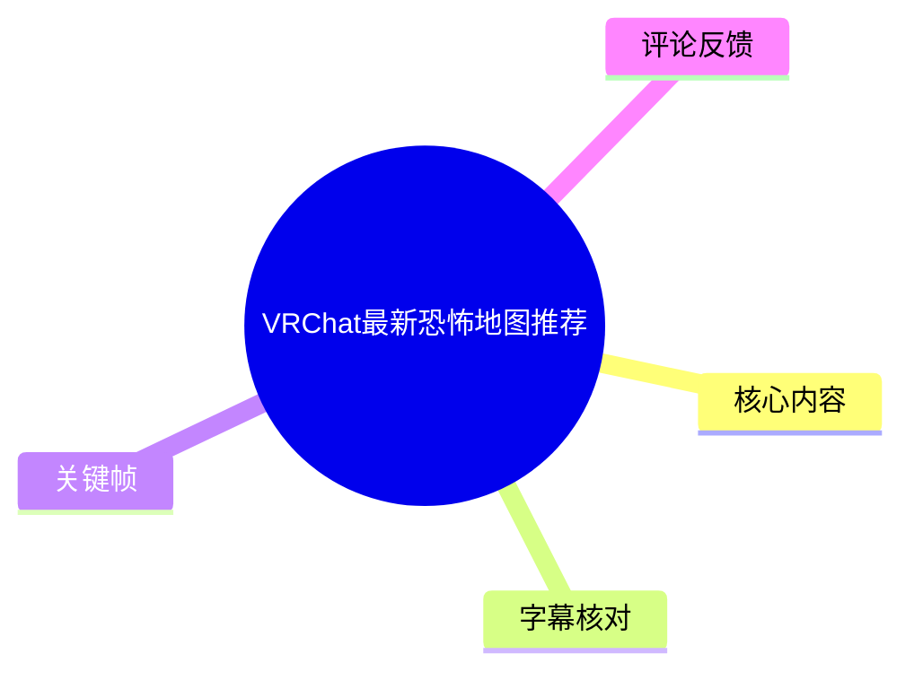
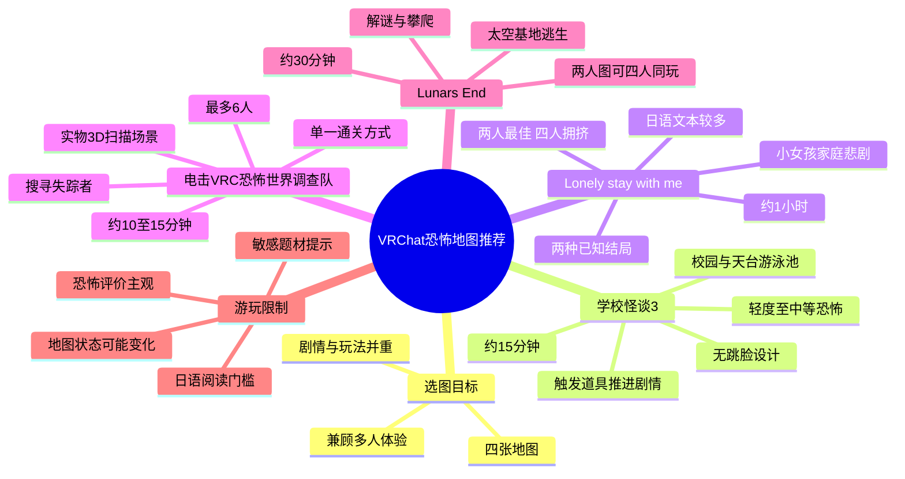
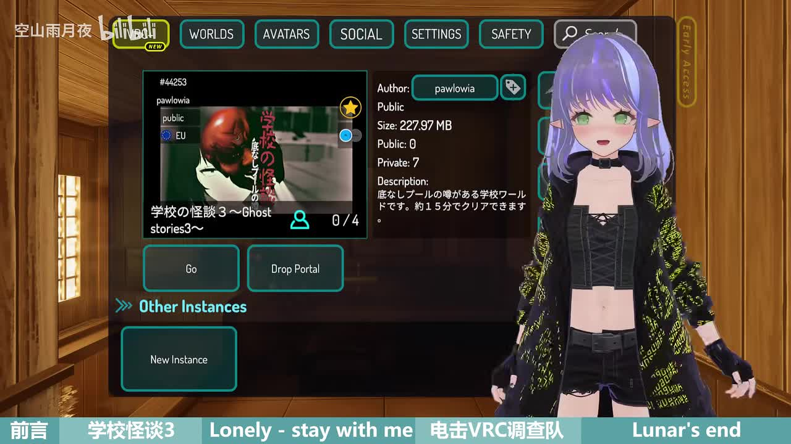
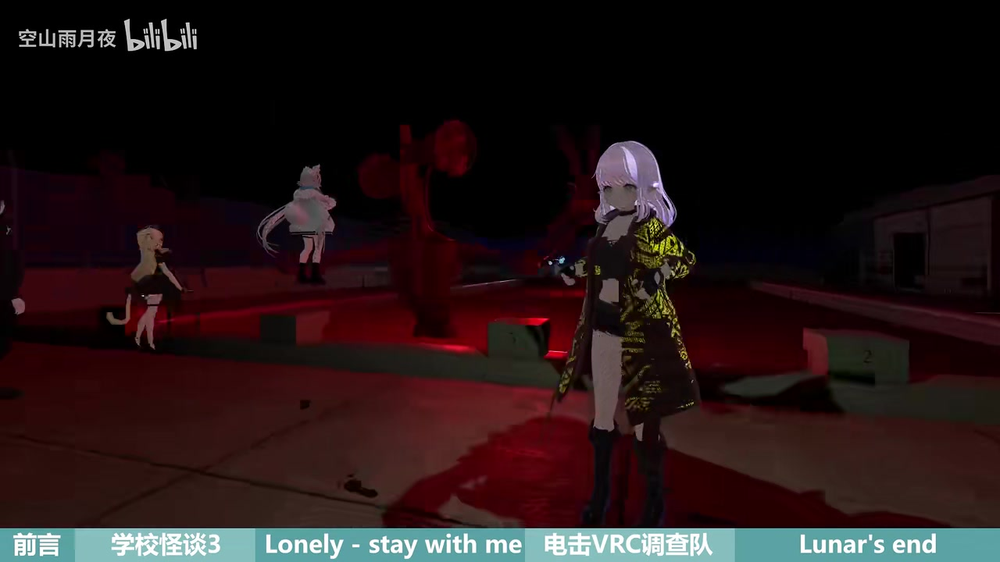

# VRChat最新恐怖地图推荐

> 来源：[Bilibili 视频](https://www.bilibili.com/video/BV1bW4y1r7gn)  
> UP 主：空山雨月夜｜发布时间：2022-06-25｜视频时长：10 分 14 秒｜分辨率：1920×1080  
> 标签：VRChat、恐怖、惊悚、解谜、学校怪谈、虚拟现实、实况

## 小结

本视频推荐了 4 张 VRChat 恐怖地图，并从剧情主题、玩法结构、预计通关时长、推荐人数、难度和恐怖强度等维度给出体验判断。四张图分别是《学校怪谈3～Ghost stories3～》、《Lonely - stay with me》、《电击 VRC 恐怖世界调查队》以及《Lunar's End》。

对于想和朋友轻度体验恐怖氛围的玩家，视频最明确的推荐方向是《学校怪谈3》：其流程约 15 分钟、无需要解谜的环节、没有“Jump Scare 跳脸”设计，且多人游玩时氛围相对欢乐。想玩剧情更黑暗、流程更长的作品，则可考虑《Lonely - stay with me》，但需要阅读较多日语文本，部分环节可能需要翻译软件辅助。

《电击 VRC 恐怖世界调查队》主打实物 3D 扫描场景，视频将其定位为中等恐怖度、约 10～15 分钟的短流程作品，最多可容纳 6 人；而《Lunar's End》则是太空逃生主题，包含独立小关卡、轻度解谜与攀爬机制，约需 30 分钟完成。

视频中的“恐怖程度”属于 UP 主个人体验判断，而非统一量表；参与者“咪露拉”的尖叫反应也被用作节目效果，不能单独作为地图客观恐怖度的依据。特别是《Lonely - stay with me》涉及家庭暴力、家庭悲剧、灾害等较沉重主题，胆小或对相关题材敏感的玩家应谨慎选择。

所有地图的可访问状态、容量设置、版本、隐藏状态与后续章节计划均具有时效性。视频发布于 2022 年 6 月，其中《Lunar's End》在视频中已被说明为较早发布的作品；UP 主提到的作者状态及地图开放情况，应以当前 VRChat Worlds 页面与作者说明为准。

## 思维导图

## 目录

- [背景、信息范围与选图方法](#背景信息范围与选图方法)
- [地图一：学校怪谈3～Ghost-stories3～](#地图一学校怪谈3ghost-stories3)
- [地图二：Lonely---stay-with-me](#地图二lonely---stay-with-me)
- [地图三：电击-VRC-恐怖世界调查队](#地图三电击-vrc-恐怖世界调查队)
- [地图四：Lunar's-End](#地图四lunars-end)
- [横向参数对比与组队建议](#横向参数对比与组队建议)
- [结论、限制与时效性](#结论限制与时效性)
- [字幕比对](#字幕比对)
- [评论分析](#评论分析)
- [处理记录](#处理记录)

## 背景、信息范围与选图方法 [00:00](https://www.bilibili.com/video/BV1bW4y1r7gn?t=0)

视频开场即说明，本期继续介绍 4 张“高质量的恐怖地图”。参与录制的咪露拉“胆小又爱玩”，参与了其中 3 张地图的体验，因此成片中包含较多尖叫声；UP 主也说明已在视频进度条上标记相关段落，方便观众避开或反复观看。

本视频的实用价值不在于完整攻略，而在于在不剧透过多流程细节的前提下，为不同偏好的玩家提供初步筛选条件：

1. **流程长度**：短至 10～15 分钟，长至约 1 小时。
2. **游玩人数**：作品虽然常标为两人图，但实际最大人数及舒适度不同。
3. **机制门槛**：有的以触发剧情为主，有的需阅读日语、使用翻译软件、解谜或进行 VR 攀爬。
4. **恐怖类型**：从渐进式氛围恐怖，到追逐、灵异调查、黑暗家庭叙事和太空怪物逃生。
5. **社交体验**：部分地图多人会提升欢乐感，部分则因室内走廊狭窄而降低体验。

> 图：关键帧展示 VRChat 的世界信息界面，以及视频为四个地图段落设置的底部导航标签。画面中可见《学校怪谈3》的世界卡片、作者栏、大小约 227.97 MB 和玩家人数栏位；它有助于理解视频是基于 VRChat 世界实际入口进行推荐，而非仅展示概念图。画面信息仅反映录制时状态，不能替代当前页面查询。

## 地图一：学校怪谈3～Ghost stories3～ [00:26](https://www.bilibili.com/video/BV1bW4y1r7gn?t=26)

### 基本定位

第一张地图为《学校怪谈3～Ghost stories3～》。UP 主说明，未玩过该系列前两作的玩家，可以前往同一作者页面寻找《学校怪谈1》与《学校怪谈2》；但三张地图均为独立故事，因此没有前作经历也不影响理解本作。

第三作仍以同一所学校为故事起点，但本次的主要场景转向**天台游泳池**。从视频给出的介绍看，它属于适合较低门槛进入的校园怪谈作品。

### 流程、机制与难度

- **剧情推进方式**：通过触发推进剧情的道具进行流程推进。
- **解谜要求**：UP 主明确表示“没有解谜元素”。
- **预计时长**：约 15 分钟。
- **难度**：中等；UP 主个人认为其比《学校怪谈2》更简单。
- **恐怖程度**：轻度至中等。
- **惊吓设计**：节奏循序渐进，**没有 Jump Scare 跳脸设计**。
- **社交适配**：和朋友一起玩时，整体气氛反而较欢乐。

因此，这张图适合以下情况：

- 想体验校园恐怖主题，但不希望处理复杂谜题；
- 需要短时间完成一局；
- 同行成员中有不太适应突脸惊吓的人；
- 更重视朋友间互动与氛围，而不追求高压恐怖体验。

### 体验片段中可见的要素

实况中出现了与学校异常环境相关的探索场景，包括门、脚印、警笛头式怪物提及、动物园风格的互动提示等。由于这些内容主要来自玩家临场交流，且字幕中部分语句受尖叫、重叠对话影响而不完整，不宜据此反推完整谜题或剧情逻辑；可确认的是，视频并未将其描述为以解谜为核心的地图。

> 图：关键帧呈现红色低照明环境中的多人探索画面，可直观说明该图利用光照、开放场景与角色位置制造不安氛围。它与 UP 主所说“节奏循序渐进、非突脸惊吓”的体验定位相呼应，但单帧不能证明具体关卡机制。

## 地图二：Lonely - stay with me [02:50](https://www.bilibili.com/video/BV1bW4y1r7gn?t=170)

### 故事题材与内容提示

第二张地图为《Lonely - stay with me》。UP 主认为，在完成游戏后回看该英文标题，会感到其含义“有点恐怖”。

视频对故事主题的概括是：它围绕一个小女孩的家庭悲剧展开，涉及淡漠的亲情、家庭暴力、人与人造成的伤害，以及天灾。UP 主以“非常黑暗”评价其基调，并直接提醒胆小玩家慎玩。

视频中的叙述还指出，玩家似乎受到匿名短信邀请，以不明身份来到小女孩家中，与她一同重新经历发生过的一切。这里的“似乎”反映为 UP 主对叙事设定的解释，不应延伸为已被本资料独立验证的完整剧情结论。

### 阅读门槛与人数限制

这张图的核心门槛不是操作难度，而是文本理解与空间容量：

- **日语阅读量**：较多。
- **辅助需求**：部分位置可能需要借助翻译软件才能过关。
- **标称类型**：两人图。
- **最大人数**：最多可进 4 名玩家。
- **实际推荐人数**：不适合太多人同时游玩。
- **原因**：主要场景位于房间走廊，4 人进入后会非常拥挤。
- **信息来源**：UP 主表示作者已在地图简介中注明这一点。

这意味着“可容纳 4 人”不等于“4 人是最佳体验”。若以完整阅读、跟随剧情和减少相互遮挡为目标，两人或更少人数更符合视频所传达的设计意图。

### 时长、结局与游玩建议

- **实测流程**：UP 主称自己花了整整 1 小时通关。
- **已知结局**：视频提到“出脱”和“赎罪”两种结局；其中“出脱”一词为站内字幕转写，含义及官方英文/日文名称未在素材中得到进一步确认。
- **未确定内容**：UP 主询问观众是否还存在第三种结局，说明第三结局在视频录制时并未被其确认。

建议实际游玩前准备：

1. 预留约 1 小时的连续时间，避免中断叙事；
2. 预先准备可识别日语文本的翻译工具；
3. 优先采用两人或小规模队伍；
4. 对家庭暴力、儿童悲剧等主题感到不适者，应避开本图；
5. 不要将视频中提及的两种结局视为唯一、最终或当前版本仍保持不变的结局列表。

## 地图三：电击 VRC 恐怖世界调查队 [05:22](https://www.bilibili.com/video/BV1bW4y1r7gn?t=322)

### 类型与系列信息

第三张为“新鲜出炉”的《电击 VRC 恐怖世界调查队》。该中文名称是 UP 主的翻译表达，UP 主也明确表示“如果翻译有误，还请谅解”，因此不应将其视为未经核实的官方中文名。

UP 主将它与另一位日本作者的“PRO 超常现象研究机构”系列进行类比：两者都涉及一队人为寻找失踪者而遭遇灵异现象的故事。不过，视频指出两者结构并不完全相同：

- “PRO 超常现象研究机构”系列被提及具有多结局设定；
- 《电击 VRC 恐怖世界调查队》在 UP 主体验中似乎只有一种通关方式；
- 根据作者发布的消息，该系列预计会有第二集，UP 主认为值得期待。

上述第二集信息是视频发布时对作者消息的转述，不能保证在当前时间仍按原计划推进。

### 参数与技术特点

| 项目 | 视频给出的信息 |
| --- | --- |
| 时长 | 约 10～15 分钟 |
| 最大玩家数 | 6 人 |
| 恐怖程度 | 中等，属 UP 主个人判断 |
| 通关结构 | UP 主体验中似乎只有一种通关方式 |
| 场景技术 | 使用实物 3D 扫描模型 |
| 现实关联 | VR 内探索地点在现实中存在 |

“实物 3D 扫描”是本图最突出的技术特点。UP 主据此指出，玩家在 VR 中探索的地点现实里也存在，并表达了由此产生的联想。需要区分的是：实景扫描可以提升场景的材质、空间和现实感，但视频没有提供具体地点、扫描流程、资产授权方式或性能参数，因此不能据此判断其制作技术细节与运行优化表现。

### 恐怖体验的主观差异

UP 主认为本图恐怖程度为中等，并因咪露拉多次尖叫而开玩笑称可以用“咪露拉指数”判定恐怖程度。这是视频的娱乐化表达。

热评中也出现不同体验：有观众认为“电击调查队”并非特别吓人，游玩时甚至有些出戏想笑。这与视频的“中等恐怖”并不构成事实矛盾，而说明恐怖感高度受玩家耐受度、同伴互动、设备沉浸感及临场状态影响。

## 地图四：Lunar's End [08:00](https://www.bilibili.com/video/BV1bW4y1r7gn?t=480)

### 发布背景与作者关联

最后推荐的是《Lunar's End》。UP 主说明它是一张于 **2019 年发布**的老图，作者为 **Fins**；该作者曾发布多张高质量地图。

视频同时推荐了该作者的潜水艇系列，尤其是《潜水艇2》。但 UP 主表示，该系列当时正在修改中，因此暂时隐藏。这里应注意：该“隐藏”状态只对应视频发布前后的信息，当前是否已恢复、改名、重制或下架，需要进入 VRChat Worlds 或作者页面确认。

### 剧情设定与关卡结构

《Lunar's End》发生在太空飞船或太空基地中：未知物种入侵人类领地，玩家需要寻找逃生出口，同时避免被这些未知物种捉到。

其结构不是单一线性追逐，而是由多个相对独立的小关卡组成：

- 一部分关卡需要解谜；
- 一部分关卡要求使用地图自带的攀爬系统；
- UP 主将攀爬体验形容为“等于 VR 健身”。

因此，这张图虽被评价为难度较轻，但对玩家的身体活动、VR 操作适应度和持续游玩能力仍可能提出要求。对于不习惯攀爬移动、容易 VR 晕动或活动空间有限的玩家，宜先保守体验。

### 人数、时长与适用人群

- **标称类型**：两人图。
- **多人体验**：4 人一起玩也没有压力。
- **预计时长**：约 30 分钟。
- **难度**：较轻。
- **恐怖程度**：中等。

相较《Lonely - stay with me》“四人会挤在走廊里”的限制，《Lunar's End》在视频中被明确评价为可承受四人组队。这使其更适合作为小团体的中等时长恐怖娱乐选择，尤其适合希望在怪物逃生之外加入简单解谜和肢体交互的队伍。

## 横向参数对比与组队建议 [09:30](https://www.bilibili.com/video/BV1bW4y1r7gn?t=570)

| 地图 | 主题/场景 | 主要机制 | 视频所述时长 | 人数信息 | 难度 | 恐怖度 | 关键限制 |
| --- | --- | --- | --- | --- | --- | --- | --- |
| 学校怪谈3～Ghost stories3～ | 学校、天台游泳池 | 触发道具推进剧情 | 约 15 分钟 | 画面世界卡片显示 0/4；视频强调适合朋友同玩 | 中等，UP 主认为较《学校怪谈2》易 | 轻度至中等 | 无解谜、无 Jump Scare 跳脸；具体实例状态需查询 |
| Lonely - stay with me | 小女孩家中、家庭悲剧 | 日语阅读、剧情推进 | UP 主实测约 1 小时 | 两人图，最多 4 人 | 未给出统一等级 | 黑暗题材，慎玩 | 日语文本多；4 人在走廊中拥挤；已知两种结局 |
| 电击 VRC 恐怖世界调查队 | 现实地点扫描的灵异调查 | 探索、逃生式恐怖流程 | 约 10～15 分钟 | 最多 6 人 | 未单列 | 中等 | 名称翻译可能不准确；UP 主认为似乎单一通关方式 |
| Lunar's End | 太空飞船/太空基地 | 小关卡、解谜、攀爬 | 约 30 分钟 | 两人图，4 人同玩无压力 | 较轻 | 中等 | 攀爬可能增加体力与 VR 操作负担；地图版本状态待核验 |

### 按需求选择

| 玩家需求 | 更适合的地图 | 依据 |
| --- | --- | --- |
| 首次体验 VRChat 恐怖地图 | 《学校怪谈3》 | 流程短、无解谜、没有跳脸设计、多人氛围较轻松 |
| 想玩完整黑暗剧情 | 《Lonely - stay with me》 | 家庭悲剧叙事浓度高，流程长，结局存在分支信息 |
| 时间较少但想体验灵异调查 | 《电击 VRC 恐怖世界调查队》 | 10～15 分钟、最多 6 人、实景扫描带来现实感 |
| 四人队伍想兼顾解谜与互动 | 《Lunar's End》 | 4 人游玩压力较小，含轻度解谜和攀爬 |
| 不愿阅读大量外语文本 | 避开或谨慎选择《Lonely - stay with me》 | 视频明确提到较多日语剧情和翻译需求 |
| 对突脸惊吓敏感 | 优先《学校怪谈3》 | UP 主明确称没有 Jump Scare 跳脸设计 |

## 结论、限制与时效性 [10:02](https://www.bilibili.com/video/BV1bW4y1r7gn?t=602)

本视频提供的核心经验是：选择 VRChat 恐怖地图时，不能只看“恐怖”标签，而应同时评估**时长、文本语言、组队人数、空间限制、交互方式和个人敏感题材**。

若希望低门槛开始，可先选《学校怪谈3》；若想进行多人短流程灵异体验，可关注《电击 VRC 恐怖世界调查队》；若偏好太空逃生、解谜与攀爬混合玩法，可选《Lunar's End》；而《Lonely - stay with me》更适合能接受黑暗主题、愿意阅读日语文本并预留较长时间的小队。

需要保留的限制包括：

1. **版本时效性**：视频发布于 2022 年 6 月，地图开放状态、容量、版本、作者说明和后续章节计划均可能已变更。
2. **地图名准确性**：尤其“电击 VRC 恐怖世界调查队”是 UP 主自述可能存在误差的翻译，搜索时应结合原始世界页、作者名或视频画面核验。
3. **恐怖评级主观**：视频中的“轻度”“中等”均是 UP 主体验判断；热评也展示了不同玩家对同一地图的不同感受。
4. **实况非全攻略**：尖叫、重叠语音和字幕识别误差导致部分实况片段不可作为流程步骤或剧情证据。
5. **无当前可用性验证**：本素材没有提供 2026 年当前世界页面检索结果，因此不能确认这些地图目前是否仍公开、是否更新或是否兼容当前客户端环境。

## 字幕比对 [00:00](https://www.bilibili.com/video/BV1bW4y1r7gn?t=0)

本次任务中**站内字幕与本次 ASR 均已提供并完成比对**。两者整体顺序一致，均覆盖四张地图的主体介绍；但实况尖叫、重叠语音、日语/英文名称和自动识别造成的错词较多。本文以站内字幕作为主体文本依据，并结合 ASR、视频元数据和关键帧中的界面文字进行有限校正；无法从素材确认的名称不作强行修正。

| 字幕来源 | 完整性 | 专有名词 | 时间轴 | 主要问题 |
| --- | --- | --- | --- | --- |
| Bilibili 站内字幕 | 较完整，覆盖开场、四图介绍及多数实况片段 | 整体较好，但存在“VR拆”“电击”等转写/翻译不确定项 | 未提供逐句时间戳 | 尖叫和多人同时说话处错漏较多；“出脱”等结局名称缺少原文核验 |
| 本次 ASR 字幕 | 较完整，覆盖主体结构 | 英文、日文和人物称呼误识别较明显 | 未提供逐句时间戳 | 如“助教”应为站内字幕中的“猪叫”语境；“家庭暴力”被误识别为“家庇暴力”；“Fins”相关表述也有歧义 |
| 最终采用方案 | 以站内字幕为主，ASR 用于交叉确认 | 《Lonely - stay with me》《Lunar's End》以两份字幕共同出现的英文形式记录 | 章节时间轴按视频内容顺序定位 | 对无法由素材确证的官方原文、结局命名及日文文本不作补写 |

### 重点校正与保留原则

- **“猪叫”**：站内字幕称视频包含较多“猪叫”，结合上下文可知是对咪露拉尖叫声的玩笑说法；ASR 将其识别为“助教”，不采用。
- **“VR拆”**：两份字幕均有“VR拆”一类音近写法，结合标题、标签和画面界面可确认讨论对象为 **VRChat**。
- **《Lonely - stay with me》**：站内字幕写作“lonely stay with me”，ASR 给出“Lonely Stay With Me”；本文保留素材中能够互相印证的英文标题形式，并以视频底部导航中显示的 `Lonely - stay with me` 作为展示写法。
- **《Lunar's End》**：站内字幕中出现“lunar and”，ASR 识别为“Lunar's End”；结合视频底部导航文字，采用《Lunar's End》。
- **作者名 Fins**：ASR 出现近音/误识别可能，站内字幕为“fans”；本文采用 ASR 的 `Fins`，但这是基于字幕交叉与语境的整理，未通过作者页面进行外部核验。
- **结局名称**：站内字幕为“出脱”和“赎罪”，ASR 为“出脱”和“负罪”。“赎罪”在语义上更通顺，本文记录为站内字幕表述，但不将其视为已核验的官方结局名称。

## 评论分析 [10:08](https://www.bilibili.com/video/BV1bW4y1r7gn?t=608)

以下仅处理本次可获取的热评前三条；评论反映的是用户个人观点或推荐，不作为已验证事实。

1. **@268500涛｜16 赞**  
   评论认为视频“针不错”，并询问 UP 主是否玩过 `beyond darkness`，称自己游玩后感到“挺震撼”。  
   - **补充价值**：提供了一张未出现在本视频中的恐怖地图候选。  
   - **可信度与限制**：这是个人游玩感受，未包含地图入口、作者、版本或具体体验条件；`beyond darkness` 是否为准确名称、是否仍可访问，均需另行核验。

2. **@天天ww｜14 赞**  
   评论表示已收藏，并称“朋友很少，找到朋友就一起去”。  
   - **补充价值**：说明视频的多人游玩定位对观众有实际吸引力。  
   - **可信度与限制**：该评论未评价地图质量或技术信息；同时视频本身提醒，并非所有地图都适合人数越多越好，尤其《Lonely - stay with me》在四人时可能过于拥挤。

3. **@Midori绿绿x｜8 赞**  
   评论认为“电击调查队”不是特别吓人，游玩时甚至有点出戏想笑，并推测原因是自己“不太怂”。  
   - **补充价值**：为《电击 VRC 恐怖世界调查队》的恐怖度提供了与 UP 主“中等”评价不同的体验样本。  
   - **可信度与限制**：该观点与视频并不冲突，反而表明恐怖感具有高度主观性；不能据一条评论得出该图“并不恐怖”的普遍结论。

## 评论分析

本次流程未获取到可用热评，因此不推断观众态度或额外结论。

## 处理记录

- **Worker ID**：worker-mri24eea-7db640f7
- **模型**：gpt-5.6-terra
- **素材与工具**：使用任务提供的视频元数据、站内字幕、本次 ASR 字幕、关键帧路径清单、热评 JSON 与封面/帧图素材；未提供可验证的外部世界页检索、地图作者页查询或逐帧 OCR 工具运行记录。
- **字幕选择**：站内字幕作为主体依据；本次 ASR 已执行并用于交叉比对。对 VRChat、`Lonely - stay with me`、`Lunar's End` 等内容结合上下文与关键帧界面文字校正；对无法确认的日文原名、结局官方名称保持谨慎表述。
- **关键帧选择依据**：选用 `frames/frame-001.jpg` 展示 VRChat 世界卡片、作者栏、容量与章节导航，支撑地图检索/选择语境；选用 `frames/frame-004.jpg` 展示红色低照明多人探索画面，支撑恐怖场景氛围说明。未对未展示内容的其余关键帧作视觉细节断言。
- **缓存清理**：素材中未提供缓存目录、清理命令或清理结果记录；因此无法确认是否已执行缓存清理，未将其表述为已完成。
- **未解决问题**：四张地图截至当前的公开状态、实际容量、更新版本、原始日文标题、作者名拼写、`Lonely - stay with me` 的官方结局名称及是否存在第三结局，均未在提供素材中获得当前可验证结论。
