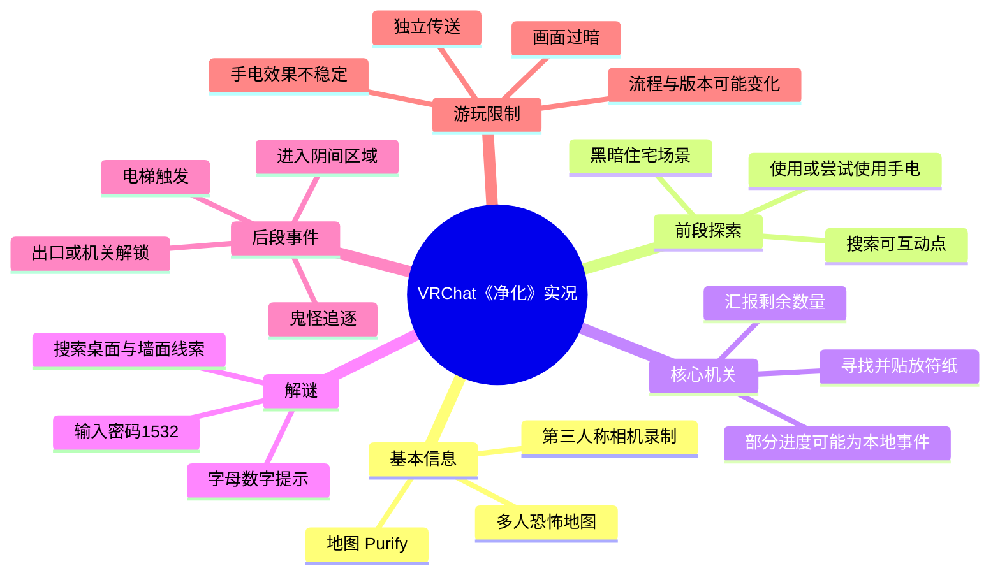
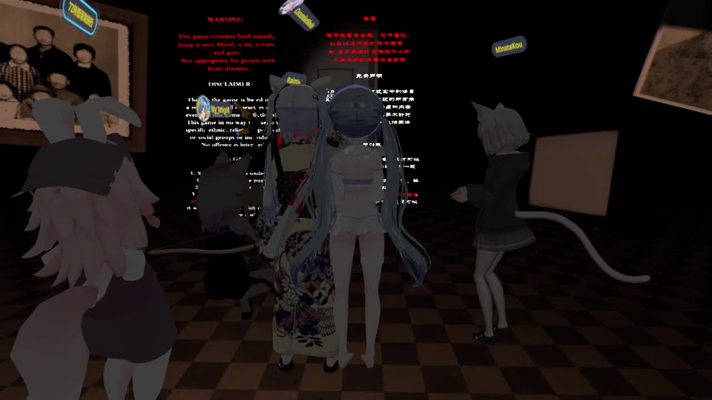
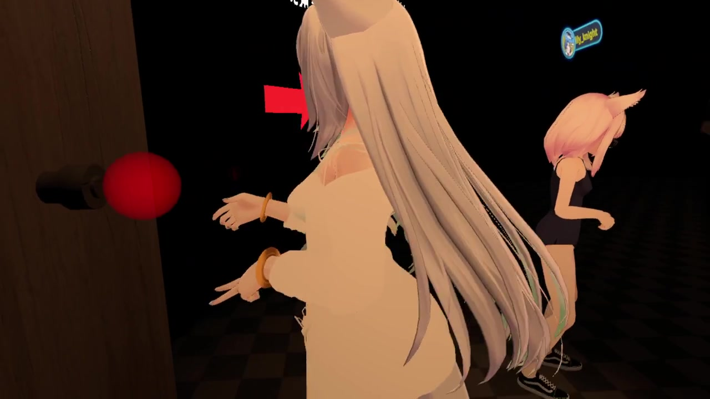
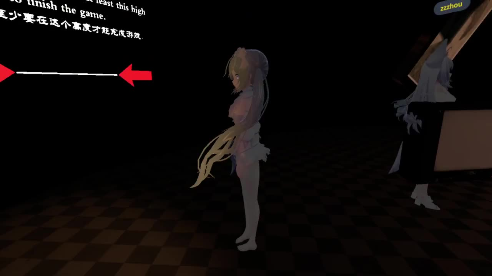

# 【VRChat】国人恐怖地图《净化》

> 来源：[Bilibili 视频](https://www.bilibili.com/video/BV1fY4y1j7Qw)<br>
> UP 主：藤原電工｜发布时间：2022-07-10｜视频时长：26:48｜分辨率：1920×1080<br>
> 地图：`Purify`（净化）｜视频简介标注相机插件：`VRChat 三人称カメラ（Booth）`

## 小结

本视频记录了多人在 VRChat 国人恐怖地图《净化》（`Purify`）中的完整游玩过程。视频并非讲解型攻略，而是以第三人称镜头拍摄玩家探索黑暗室内场景、寻找符纸、处理局部事件、破解抽屉密码、触发追逐并进入后续区域的实况。

从玩家实际沟通可整理出的核心流程是：先在住宅式场景中寻找并贴放多张符纸；在符纸收集和局部触发完成后，围绕抽屉或密码装置寻找提示；玩家根据墙面/线索中的字母与数字组合得出并输入 `1532`；随后出口或机关出现可用状态。后段通过电梯附近的触发事件进入“阴间”主题区域，但游玩录像没有清晰确认地图最终的正式结局条件。

地图的恐怖感主要来自低照明、突然音效、独立传送、狭窄空间中的视野限制，以及追逐事件。玩家多次提出手电筒“不亮”、环境过暗、被单独送入房间、触发是否同步等问题，说明该地图对队友沟通、视野设置及事件触发顺序有一定要求。

视频中可确认存在多人协作与局部独立进度并存的情况：玩家一方面共享“还差几张符”等信息，另一方面明确讨论“贴符环节应该是每个人都独立的”“全是 LOCAL 事件”。因此，不宜假设一名玩家完成互动后其他人都会同步完成；实际游玩时应让每位成员分别检查自己是否完成对应目标。

本视频发布于 2022 年，地图版本、VRChat SDK 行为、世界脚本、可见提示与碰撞/同步效果均可能在后续更新中变化。文中整理的是该录像中可观察到的流程和口述线索，不等同于当前版本的唯一通关方案。

## 思维导图



## 目录

- [视频背景与素材边界](#视频背景与素材边界-0000)
- [开场说明与多人进入地图](#开场说明与多人进入地图-0000)
- [符纸搜集：核心交互与协作方式](#符纸搜集核心交互与协作方式-0300)
- [密码机关：从字母数字线索到 1532](#密码机关从字母数字线索到-1532-1200)
- [出口、电梯与追逐事件](#出口电梯与追逐事件-1700)
- [可复用的游玩步骤与排错建议](#可复用的游玩步骤与排错建议-0000)
- [关键帧](#关键帧-0000)
- [结论、限制与时效性](#结论限制与时效性-2640)
- [字幕比对](#字幕比对-0000)
- [评论分析](#评论分析-0000)
- [处理记录](#处理记录-0000)

## [视频背景与素材边界](https://www.bilibili.com/video/BV1fY4y1j7Qw?t=0)

视频标题明确标为“国人恐怖地图《净化》”，简介给出的地图名为 `Purify`。录制者同时说明，在狭小空间使用第三人称相机“还是有点蠢”，因此画面中可能存在镜头被墙面、角色模型或黑暗环境遮挡的情况。这是理解后续“看不清”“找不到物品”反馈的重要前提。

该视频时长为 1608 秒。音频中以多人实时对话、惊吓反应和讨论解谜为主，没有稳定、系统的旁白教程。整理时将玩家反复确认、彼此核对的内容视作“实况线索”；对于因 ASR 听写不清、画面材料未提供或玩家未得出结论的部分，不补写为确定事实。

需要特别注意：素材中提供的“站内字幕”实际内容为小米 SU7 二手车收购话题，与本视频的 VRChat 恐怖地图内容完全不相符。因此，站内字幕不能作为本视频事实依据；本篇以已执行的 ASR 文本、视频元数据、关键帧与上下文互相校验后整理。

## [开场说明与多人进入地图](https://www.bilibili.com/video/BV1fY4y1j7Qw?t=0)

开场区域是低照度的室内场景，多名玩家以动漫风格 Avatar 聚集。墙上可见英文和中文的规则/警告文本，但从给定画面与 ASR 中无法可靠还原完整规则，不能据此编造具体禁令或通关条件。

玩家一开始即表现出对黑暗和未知事件的紧张，例如表示“反正我自己觉得挺吓人的”，并尝试确认可交互物：“这个可以开吗？”“不行。”这说明前期探索不是纯观赏，而是需要实际触碰、点击或靠近特定对象才能推进。

期间有人讨论互动是否共享：“那个触发都是单人的还是一起的呀？”之后又出现“全是 LOCAL 事件”的判断。`LOCAL` 是玩家的口头描述，录像未展示世界脚本实现，不能据此断言所有机关均为本地事件；但至少应把它当作重要的实战风险——队友看到的状态、触发到的演出或所处位置，未必与自己完全一致。



> 图：该帧展示多人 Avatar 在黑暗室内的集合与墙面信息区。它说明地图的开场依赖环境文本和玩家自行探索，同时也直观呈现低亮度、多人模型遮挡与第三人称视角带来的信息读取困难。

## [符纸搜集：核心交互与协作方式](https://www.bilibili.com/video/BV1fY4y1j7Qw?t=180)

中段的主要任务是寻找并贴放“符”。玩家先后提到“这边也可以贴”“这里还有，这里要贴”“贴完之后这边这个会亮”，可确认符纸或类似道具需要在多个位置完成互动，且完成后部分区域会出现发亮的状态反馈。

玩家会通过口头报数确认进度，出现过“还差 6 个”“五个”“总共是四个”“这里七个，你贴了吗”等说法。由于这些数字分别可能对应不同房间、不同玩家或不同阶段，不能将它们合并成地图固定的总符纸数量。视频能稳妥确认的仅是：符纸目标分散在客厅、桌面、厕所及多个房间附近，且玩家需要逐一检查。

一个明确的经验是：当玩家认为“都收集齐了”但仍无法进入或无法推进时，应回到已搜过的房间复查。录像中就出现一名玩家漏掉一个点位，随后发现“这个我没贴”；这使此前的协作信息与个人进度产生差异。多人模式下仅听队友报“齐了”并不足够，每个人都要核对自己的触发状态。

厕所、桌面和门口是对话中多次被提及的位置。例如玩家提示“厕所里面有”“桌上，这跟桌子上有一个”“门口一个”，这些是实况中可参考的搜寻优先级，而不是经过地图文件验证的精确坐标。若当前版本布局改变，应以场景中发光、交互提示或物件异常为准。



> 图：该帧展示玩家在狭窄、低光的室内区域靠近门边/墙面进行互动。它有助于理解符纸类目标为何容易被角色模型、镜头角度和环境暗部遮住，也支持“逐房间贴近墙面与物件检查”的操作建议。

## [密码机关：从字母数字线索到 1532](https://www.bilibili.com/video/BV1fY4y1j7Qw?t=720)

符纸阶段之后，玩家遇到一个与抽屉或密码面板相关的机关。对话中可见“你个密码怎么破解啊”“我怀疑可能是什么图案”“A1、A2 图案”，说明初始阶段玩家尚未确定密码规则，也尝试过从外部环境和房间内物品寻找线索。

随后，玩家集中读出若干疑似坐标或索引式线索，如“A1”“D2”“C3”“B5”等。ASR 对这一段的字母组合存在明显不稳定，例如同一串可能被识别为 `A1D2C3D5`、`A1D2C3B` 等；因此无法可靠复原完整的中间编码表，也不能声称字母序列本身就是最终正确答案。

录像中反复、清晰出现的最终数字是 `1532`。玩家输入或确认后表示“我听到一个锁开的声音”，并观察到中间物体“在亮”。这构成了视频内最可靠的解谜结论：在该次游玩录制的机关状态下，`1532` 是能够触发后续反馈的四位数字。

| 解谜环节 | 视频中可确认的信息 | 不应过度推断的部分 |
| --- | --- | --- |
| 线索形式 | 玩家读到字母和数字混合提示，尝试从场景中找对应关系 | 完整字母序列及其编码规则 |
| 最终输入 | 多名玩家重复确认数字 `1532` | 该密码是否适用于所有版本、所有房间 |
| 成功反馈 | 听到疑似锁开启音效；中间对象出现发亮状态 | 音效对应的具体门、锁或全局机关 |
| 后续操作 | 玩家判断可从原路、出口或下一机关继续 | 是否存在更短或唯一的标准路线 |



> 图：该帧中可见黑暗环境、红色方向箭头和玩家角色。它体现了密码阶段及后续推进依赖有限视觉提示的设计，也说明玩家在缺少明确 UI 指引时需要结合场景符号、音效和队友报点完成判断。

## [出口、电梯与追逐事件](https://www.bilibili.com/video/BV1fY4y1j7Qw?t=1020)

密码机关出现反馈后，玩家讨论“是不是可以跑路了”“出口门是可以开的”。这表明此前的锁定状态至少发生了变化，但各玩家并未同步处于同一位置：有人已经出去，有人仍在机关附近或重新进入房间。这再次与前述局部独立触发、不同步传送的现象相呼应。

之后队伍来到电梯附近。场景音频中出现英文台词 “Why are you leaving me”，玩家尝试按电梯按钮，最初判断“电梯也没开啊，还是要走楼梯”。接着他们推测需要继续前进、回头或等待鬼怪出现，以触发电梯开门。

实况后段给出了一个较具体的触发观察：有玩家总结“你按一下电梯，然后你触发那个意向，然后那鬼来追你的时候电梯会开门”。这里“意向”可能是 ASR 误识别，无法确定所指具体事件；但可保留可验证的操作顺序：**先操作电梯附近机关，再触发追逐/鬼怪靠近，电梯门才可能开启。**这不是官方机制说明，而是本次录像中的玩家经验。

玩家进入电梯后被传送至标有“欢迎来到阴间”的区域。有人评价该区域“字体品味有点差”，这是对美术风格的个人意见，不构成地图质量结论。视频在后续还提到可能进入“风景图”或其他区域，并讨论此前有人因眩晕无法长时间游玩恐怖地图；不过录像没有以明确的片尾或通关结算证明已完成全部内容。


> 图：该帧呈现地图中极端低能见度的场景。它能解释玩家在流程里频繁依赖语音报点、手电筒和音效判断，也说明这类地图在第三人称相机、显示器亮度或 Avatar 遮挡条件下会显著提高探索难度。

## [可复用的游玩步骤与排错建议](https://www.bilibili.com/video/BV1fY4y1j7Qw?t=0)

以下步骤是按视频实况重组的协作流程，用于降低遗漏与卡关概率；其中密码 `1532` 仅对应视频录制时观察到的机关状态。

1. **进入前确认视觉条件。**  
   录像中多人反映“好黑”“手电不亮”。应先检查 VRChat 客户端亮度、Avatar/镜头遮挡、第三人称相机距离与手电筒道具是否真正提供照明。视频未给出具体图形设置参数，因此不建议自行假设推荐数值。

2. **分房间搜索，不要只跟随队友。**  
   优先检查门口、墙面、桌面、厕所和可进入房间。遇到疑似符纸点位时贴近物件或墙面尝试互动；不要因为队友说已完成而跳过个人检查。

3. **用统一的报点方式汇报。**  
   建议按“房间—位置—是否已互动”报告，例如“厕所内已贴”“客厅桌上未确认”。视频中纯报“还差几个”会因每个人进度不同而造成混乱。

4. **观察完成反馈。**  
   视频中部分贴符点完成后会亮起。若没有看到亮光、没有交互音效或自身仍显示缺少目标，应视为尚未可靠完成，重新检查位置。

5. **密码阶段优先找环境线索。**  
   玩家曾翻查外部桌面、房间物品和带字母数字的提示。不要直接把未经验证的字母串当密码；录像中仅能确认最终数字输入为：
   ```text
   1532
   ```

6. **输入后检查锁声、发光与可开门状态。**  
   成功后录像中出现疑似开锁声和中间机关发亮。若本地没有反馈，可能是输入失败、触发不同步或仍有个人任务未完成。

7. **在电梯处预留追逐事件空间。**  
   按电梯后若没有立即开门，不要立即断定故障。视频中的经验是，后续鬼怪追逐或某个临近触发可能与电梯开门有关。应由部分玩家观察追逐、部分玩家守候电梯，并通过语音同步。

8. **被单独传送后先报位置再行动。**  
   视频多次出现“怎么就只剩我一个人了”。独立传送会使队伍信息断裂；被送走的玩家应描述房间特征、门锁状态和可见机关，其余玩家不要仅凭自己画面判断全队进度。

## [关键帧](https://www.bilibili.com/video/BV1fY4y1j7Qw?t=0)

本次正文选用的关键帧均来自提供的 `frames/` 目录。由于素材未提供每张抽帧的精确时间戳，下表不将文件序号伪造为视频发生时刻，而是按照其视觉内容与正文主题匹配使用。

| 文件 | 对应主题 | 选用价值 |
| --- | --- | --- |
| `frames/frame-001.jpg` | 开场集合与规则墙 | 展示多人协作、低照度与环境文本并存的初始场景。 |
| `frames/frame-002.jpg` | 路径与方向提示 | 画面中的红色箭头说明推进过程依赖有限的视觉指示。 |
| `frames/frame-003.jpg` | 近距离环境互动 | 呈现角色在狭小区域活动时的遮挡问题，适合说明搜符与交互难点。 |
| `frames/frame-004.jpg` | 黑暗氛围与可见性限制 | 直观佐证玩家反复提到“好黑”、手电不可靠的实况体验。 |

## [结论、限制与时效性](https://www.bilibili.com/video/BV1fY4y1j7Qw?t=1600)

《净化》在本次录制中呈现为强调氛围、局部搜集、密码机关与追逐演出的 VRChat 多人恐怖地图。最具操作价值的信息包括：符纸任务应逐人检查、桌面/厕所/门口等区域需要复查、录制中成功触发的密码为 `1532`、电梯推进可能需要在按键后经历追逐事件。

地图的难点不只来自谜题，也来自多人同步问题。若事件确实按本地逻辑运行，那么一名玩家完成互动或被传送，并不能保证其他人获得相同结果。最有效的团队策略不是“全员跟着一个人走”，而是明确分工搜索、逐人确认任务状态、及时报出房间和机关反馈。

视频简介提及的第三人称相机插件会影响观感：它方便录制他人反应，但在狭窄室内可能挡住交互目标、削弱第一人称恐怖体验，或让黑暗区域更难辨认。因此，视频中的探索效率和真实 VR 游玩效率不一定一致。

时效方面，本视频发布于 2022 年 7 月，且元数据抓取时间为 2026-07-12。VRChat 世界可能被作者下架、更新、重制或修改 Udon/SDK 逻辑；密码、可互动点、同步范围、传送行为和美术内容都可能变化。评论中提到“流程太短”也只是观众对当时版本的体验，不能外推为现行版本结论。

## [字幕比对](https://www.bilibili.com/video/BV1fY4y1j7Qw?t=0)

| 字幕来源 | 完整性 | 专有名词 | 时间轴 | 主要问题 |
| --- | --- | --- | --- | --- |
| Bilibili 站内字幕 | 与视频内容不对应，不能用于本片 | 出现“小米 SU7 Pro”“华为”“比亚迪”等汽车词，与《净化》无关 | 未提供可用分段时间轴 | 疑似串入另一条二手车视频的字幕，主题、人物和场景均完全不匹配 |
| 本次 ASR 字幕 | 覆盖了主要语音互动、解谜与后段事件，但存在大量口语断裂 | 可识别 `VR`、`LOCAL`、`CQB Training`、`Why are you leaving me`、`1532`、`Purify`相关语境 | 原始文本未附逐句时间戳，只能依据叙事顺序定位到视频阶段 | 中英混杂、多人抢话、惊叫和环境音导致字词误识别；部分人名、道具名和字母序列不可靠 |

### 字幕选择与校正原则

最终**不采用站内字幕**。其内容讲述的是二手小米汽车收购、车辆配置与价格，与视频标题、画面、简介和 ASR 中的 VRChat 实况全部冲突，属于不可用数据。

本次 ASR 已执行，并作为正文的主要语音依据；但仅采纳可被上下文反复印证的内容。重点校正或保守处理如下：

- `1532`：ASR 中被多次重复，且紧跟“锁开声音”“中间在亮”等成功反馈，作为本次录像中最可信的密码结果。
- `LOCAL`：保留为玩家对事件范围的描述，不扩大为对地图脚本的技术定论。
- “贴符”“符纸”：ASR 可能出现“贴服”“贴鬍子”等误识别，但结合“还差几个”“厕所里面有”“贴完会亮”等上下文，整理为符纸搜集/贴放互动。
- 电梯触发中的“触发那个意向”：该词无法由现有素材可靠校正，因此正文写为“某个后续触发/追逐事件”，不虚构具体对象。
- 字母数字线索：`A1`、`D2`、`C3`、`B5` 等片段存在，但完整顺序冲突，未将其写成确定解法。

## [评论分析](https://www.bilibili.com/video/BV1fY4y1j7Qw?t=0)

仅处理当前可获取的热评前三条；评论均是观众个人表达，不作为地图机制或视频事实的直接证据。

1. **夜-白月（1 赞）：「原来藤还记得你有个b站号」**  
   这是对 UP 主更新行为的调侃，反映评论者认为该账号更新不频繁或存在较长间隔。它不提供地图玩法信息，也不能据此确认 UP 主真实更新频率。

2. **暗月骑士想要成为魅魔（0 赞）：「抽屉顺序是多少，，」**  
   评论直接询问抽屉相关解谜顺序，说明密码/抽屉机关是观看时较容易卡住的环节。这与视频中玩家讨论字母数字提示、最终尝试 `1532` 的内容相互呼应；不过评论本身没有给出答案，不能把提问视作对解法的验证。

3. **bili_1458330（0 赞）：「就可惜流程太短了，三张国人做的地图都很棒」**  
   评论者认为流程偏短，并对三张国人制作地图给予正面评价。其中“流程太短”属于主观体验；“三张地图”缺乏地图名称和来源，无法确认具体指代，也不能据此补充视频未展示的地图系列信息。

## [处理记录](https://www.bilibili.com/video/BV1fY4y1j7Qw?t=0)

- Worker ID：`worker-mri3sp0r-0d15ab26`
- 模型：`gpt-5.6-terra`
- 调用工具与素材：视频元数据读取、素材清单读取、关键帧视觉核验、站内字幕读取、本次 ASR 字幕读取、热评 JSON 读取。
- 使用的应用工具：素材中已完成视频合并（`merged.mp4`）、音频提取（`audio/audio.wav`）、关键帧输出（`frames/`）、字幕输出（`subtitles/`）、ASR 输出（`asr/`）与评论输出（`comments/comments.json`）；本次整理未虚构额外工具调用。
- 字幕选择：站内字幕与视频主题完全冲突，判定不可用；本次 ASR 已执行并作为主依据，结合画面、元数据和上下文进行保守校正。
- 关键帧依据：选择 `frame-001` 至 `frame-004`，分别服务于开场多人环境、方向提示、近距离交互和极暗场景四个正文重点；未对未提供精确抽帧时间的图片伪造时间戳。
- 评论范围：仅分析可获取热评前三条，未延伸到其他评论或楼中楼。
- 缓存清理：素材清单仅确认产物目录与完成状态，未提供缓存清理执行日志；因此不能声称已完成物理缓存清理。
- 未解决问题：缺少关键帧精确时间、ASR 逐句时间戳及地图当前版本信息；抽屉字母数字线索的完整编码规则无法从现有 ASR 可靠还原；视频未能明确证明最终正式通关结算。
