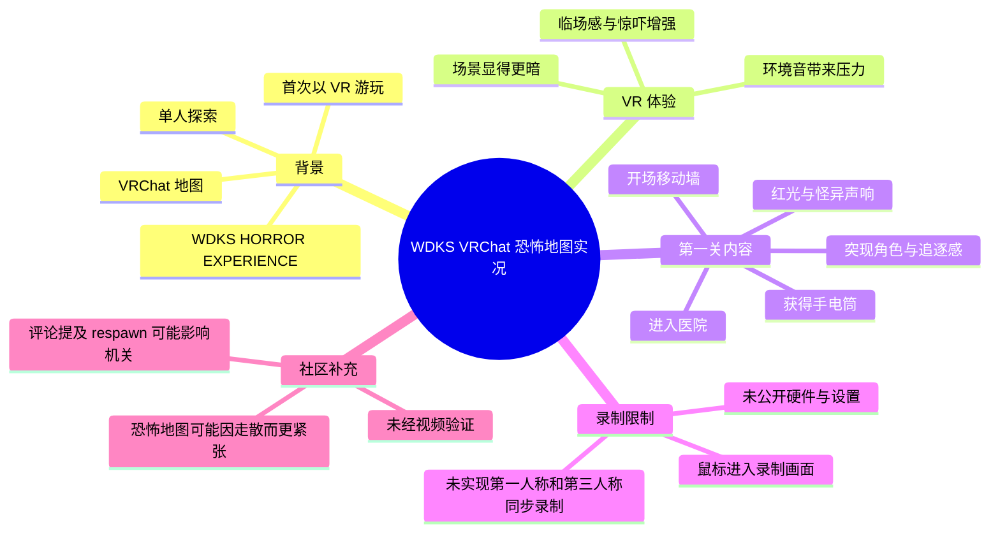
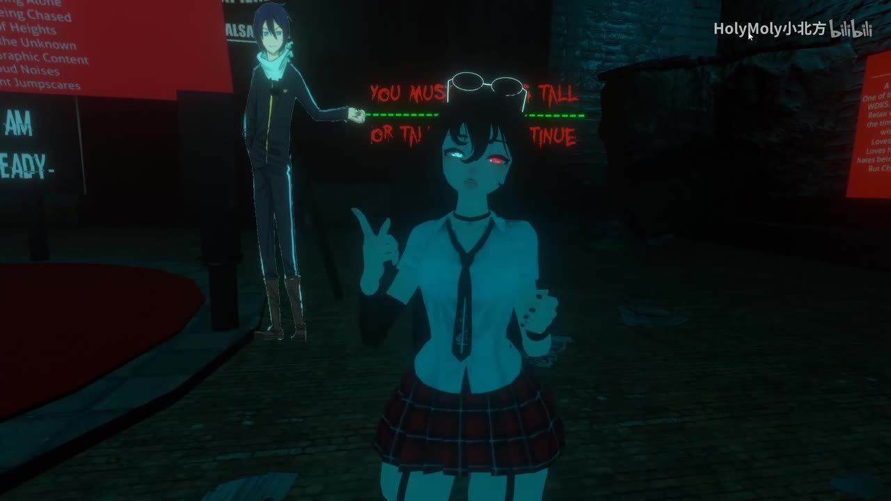
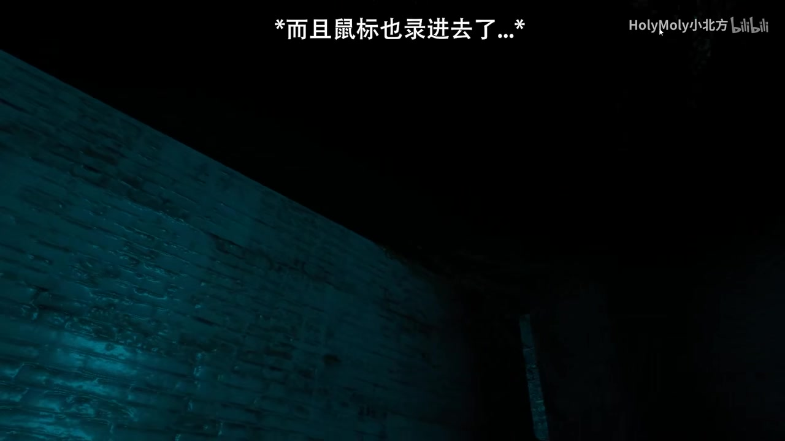

# 【VRchat恐怖地图】原来戴VR玩这么可怕刺激的吗?《WDKS/Ep.1》

> 来源：[Bilibili 视频](https://www.bilibili.com/video/BV1E4411G7ux)  
> UP 主：HolyMoly可諾莉｜分 P：WDKS恐怖地图EP1｜时长：15:59  
> 视频发布于 2019 年；以下关于地图机制、VRChat 功能及操作方式的信息均应视为当时体验记录，而非当前版本说明。

## 小结

这是一支 VRChat 恐怖地图实况视频。UP 主以首次使用 VR 设备游玩恐怖地图 **WDKS HORROR EXPERIENCE** 为主线，在独自探索的状态下记录了移动墙、昏暗场景、环境音、角色突现、红光、尸袋与医院关卡等恐怖演出。视频结尾明确说明：本集只结束到第一关，之后仍会继续游玩。

视频最明确的体验结论是：UP 主认为，佩戴 VR 后地图的暗度与临场感明显增强；她判断若通过普通 PC 屏幕观看，画面“应该不会到那么暗”。这是其个人感受，并非对 VRChat 显示参数或不同设备效果的通用测量结论。

从可复用的游玩经验看，恐怖 VR 地图的压力不只来自跳脸，还来自视野受限、强制接近触发点、听觉方向感，以及角色或机关造成的移动受阻。视频中，手电筒是医院段落的关键道具；UP 主也多次以“先向前”“不回头”等方式处理对未知事件的紧张感，但没有给出完整通关攻略。

制作层面，UP 主提到第一次用 VR 录制时遇到问题：希望同时录制第一人称与第三人称，但尚未掌握方法；画面中还出现“鼠标也录进去了”的文字提示。这说明本片是以实况反应为重点的早期 VR 录制尝试，不是经过完整多机位设计的教程。

适合希望了解早期 VRChat 恐怖地图氛围、VR 游玩恐怖内容的主观刺激点，以及 WDKS 第一关流程片段的观众阅读。需要注意，视频没有提供地图链接、VR 设备型号、显卡/帧率、亮度设置、完整操作键位或关卡通关条件，不能据此直接复现相同体验。

## 思维导图

## 目录

- [背景、素材范围与时效性](#背景素材范围与时效性)
- [开场：首次 VR 游玩与录制问题](#开场首次-vr-游玩与录制问题)
- [WDKS 的开场引导与氛围设计](#wdks-的开场引导与氛围设计)
- [第一关：医院探索与惊吓节奏](#第一关医院探索与惊吓节奏)
- [可整理的游玩经验与操作限制](#可整理的游玩经验与操作限制)
- [结尾、数据与结论](#结尾数据与结论)
- [字幕比对](#字幕比对)
- [评论分析](#评论分析)
- [处理记录](#处理记录)

## 背景、素材范围与时效性 [00:00](https://www.bilibili.com/video/BV1E4411G7ux?t=0)

视频标题标注“VRchat 恐怖地图”与《WDKS/Ep.1》，简介将游戏/平台写作 **VRchat**，并给出地图名 **WDKS HORROR EXPERIENCE**。标签还包括“恐怖游戏”“虚拟现实”“Jumpscare”“VRCHAT”等，表明内容定位是 VR 社交平台内的恐怖地图实况，而不是独立恐怖游戏的正式评测或新闻报道。

本片总长 959 秒（15 分 59 秒），仅有一个分 P：**WDKS恐怖地图EP1**。UP 主在开头说明这是她第一次戴 VR 游玩该恐怖游戏地图，并且是独自进行；在结尾则说明，对于观众而言，本集可视为第一关结束，但她本人还要继续往下玩。

视频中没有行业新闻、版本更新公告、开发者访谈、地图发布日期或平台规则说明。因此，本视频可提取的“新闻性信息”仅限于视频自身的发布与内容事实；无法据此确认地图现状、是否仍可搜索、是否改名，或其中机关在当前版本是否保持一致。

截至素材抓取时间 `2026-07-12` 的元数据快照，视频显示播放 12,370、点赞 212、收藏 195、投币 55、分享 161、评论 32、弹幕 37。这些数字是抓取时的站内统计快照，可能继续变化，不应视作视频发布当日数据。

## 开场：首次 VR 游玩与录制问题 [00:00](https://www.bilibili.com/video/BV1E4411G7ux?t=0)

UP 主开场自我介绍后强调自己“有 VR”，并说这对自己而言是重点；ASR 中还出现“而且我还上了全身”的说法。该句可确认其提及了“全身”，但素材没有明确说明是何种具体追踪设备、追踪点数量或软件配置，因此不能扩展解释为特定全身追踪方案。

她随后说明本次要玩的是近期很火的恐怖游戏地图 WDKS，并承认此前恐怖游戏视频中的惨叫带有“戏剧效果”的玩笑式表达。进入地图后，她很快遇到会移动的墙，并直接将“戴上 VR 后地图特别暗”与 PC 观看时“应该不会到那么暗”作比较。

这里可分为两层理解：

1. **视频陈述**：UP 主主观感到 VR 画面更暗、恐惧感更强。
2. **不可直接外推的部分**：暗度还会受头显面板、亮度调节、渲染设置、显示器、游戏内后处理与录制编码影响；素材没有提供上述参数，不能把她的体感视为设备之间的客观亮度对比。

> 图：画面展示昏暗环境中的虚拟角色及背景提示文字，能直观看到本片以低照度、近距离角色呈现营造紧张感的方式。它也为“VR 中场景显得更暗”的主观描述提供了视觉语境，但不能替代实际亮度测量。

视频简介同时披露了录制限制：这是 UP 主第一次用 VR 录制，想同步录第一人称与第三人称画面，却“不太会弄”。因此，观众看到的是以现有录制方案捕捉到的视角与画面，而不是完整展示身体动作、头显视角和旁观视角的多视角记录。

> 图：画面上方写有“*而且鼠标也录进去了…*”，直接对应 UP 主所说的初次 VR 录制问题。这张帧的价值在于区分“游戏本身的恐怖画面”与“录制流程造成的画面瑕疵”。

## WDKS 的开场引导与氛围设计 [04:20](https://www.bilibili.com/video/BV1E4411G7ux?t=260)

在开场区域中，UP 主依次观察到角色、黑暗通道及疑似演出性的布景。她听到或看到英文语句后继续向前，并在接近后感叹“现在才开始吗”，由此判断此前内容只是开场。

ASR 识别到“PKS 这是他们的团队名称”“我正在前进，坐下，准备好”“希望你享受这场比赛”等片段。由于 ASR 对英文、画面文字和语音来源的区分不稳定，以下仅能保守整理为：地图开场存在引导性文本或语音，要求玩家继续前进、坐下或准备接受接下来的内容；其中“PKS”的准确拼写与其具体身份无法仅凭 ASR 确认。

紧接着，UP 主表示“这是第一关，医院”。从这一节点开始，地图主题切换到医院式恐怖场景。视频没有展示关卡选择菜单、加载过程或章节标题的完整文本，故“第一关”应以 UP 主口述为依据。

此段的恐怖设计并不只是单一的跳脸：移动墙限制去向，黑暗区域隐藏空间边界，角色会以站立、接近、耳边说话或突然出现的方式制造不确定性。UP 主的即时反应——反复确认“有没有路”“里面是黑的”“为什么会有”——反映她无法预判触发逻辑。

## 第一关：医院探索与惊吓节奏 [05:15](https://www.bilibili.com/video/BV1E4411G7ux?t=315)

进入医院后，UP 主先拿到一个手机形态或被其称为“手机”的物品，随后确认获得手电筒，并说“恐怖游戏一定要有手电筒”。素材能够确认手电筒在该段被作为照明/探索道具提及，但未提供它的开关按键、续航、充电、光照范围或是否为固定剧情道具。

后续探索中，视频连续出现以下元素：

- 轮椅相关场景与声音；
- 反复出现的“10 点 35”时间信息；
- 黑暗走廊、红色闪光和怪异音响；
- 疑似尸袋、尸体或人体模型；
- 地面爬行的角色/怪物；
- 需要接近固定恐怖角色才能继续推进的桥段；
- 门开启、关闭及角色突现；
- 血液般的红色液体场景，UP 主以“番茄汁”戏称；
- 狭窄或低矮通道，她说“要用趴的”。

这些内容形成了典型的“探索—受阻—声光预警—突现—继续推进”节奏。UP 主一度说“我动不了了”或“我怎么走不了”，但素材无法确认这是地图强制限制移动、VRChat 角色控制问题、碰撞体卡住，还是她在惊吓状态下的夸张反应；应避免把它写成确定的程序故障。

### 观察到的风险与体验因素

| 因素 | 视频中的表现 | 可得出的范围 |
| --- | --- | --- |
| 低照度 | UP 主多次说 VR 中很暗，走廊和通道可见度低 | 适合说明视觉不确定性增强；不代表所有设备都会同样暗 |
| 定向声音 | UP 主抗拒“在耳边说话”，并对异响持续反应 | 声音是恐怖体验的重要组成部分 |
| 强制接近 | 她吐槽恐怖游戏常让玩家必须靠近前方的鬼 | 是视频中对桥段的主观概括，不是地图完整机制文档 |
| 空间/姿态变化 | 后段出现“要用趴的” | 可能要求低姿态通过；具体触发与替代方式未明 |
| 单人游玩 | 开头明确为一个人玩 | 会减少同伴分担紧张或协作提示，但不是通关必要条件的证明 |

> 图：近乎完全黑暗的画面突出可见度不足这一体验核心。它有助于理解 UP 主为何多次依赖手电筒、环境声和心理预期判断前方情况；同时也提醒读者，视频压缩、显示设备与 VR 头显之间的视觉效果并不等同。

## 可整理的游玩经验与操作限制 [06:00](https://www.bilibili.com/video/BV1E4411G7ux?t=360)

视频不是操作教学，但可按其实际体验整理出一套**仅适用于理解这段实况**的行动顺序：

1. **进入地图前确认内容属性**：地图为恐怖主题，且以低亮度、音效和突现为主要刺激来源。若对惊吓、幽闭环境或高沉浸内容不适，应审慎选择是否单人进入。
2. **以照明道具为探索线索**：医院段落中，UP 主获得手电筒后将其视为关键工具。视频未展示具体按钮，因此不能凭本片确定开灯、切换或互动键位。
3. **观察环境变化再前进**：移动墙、门、红光、音效和角色位置改变，都是视频中与剧情推进相邻出现的信号；但并未建立严格的一一对应触发规则。
4. **预留身体活动空间**：视频后段提到要“趴”着通过，说明 VR 恐怖地图可能利用姿态与空间感强化体验。实际是否需要物理下蹲、游戏内蹲伏或其他方式，视频未说明。
5. **接受受控演出而非寻找战斗解法**：UP 主在固定鬼怪前吐槽“你就一定得靠近他”，可见该段更接近路线/演出驱动。素材中没有武器、伤害系统、战斗操作或可选解谜路线的可靠信息。
6. **录制时预先测试视角与桌面输入**：UP 主已经遇到第一人称与第三人称无法同步录制、鼠标进入画面的问题。若以录制为目的，至少应在开录前检查捕获源、桌面叠加层与鼠标显示状态；视频未给出软件名称，因此不能提供其具体设置步骤。

需要特别区分：以上前五项是基于实况片段提炼出的体验建议，最后一项是针对 UP 主已披露录制问题的通用准备方向。它们均不是原作者提供的完整攻略、硬件指南或官方操作规范。

## 结尾、数据与结论 [14:35](https://www.bilibili.com/video/BV1E4411G7ux?t=875)

接近结尾时，UP 主结束当前片段并进行常规互动请求，包括点赞、投币、收藏和分享。她随后意识到“是不是应该开一个摄像头再来说话”，这进一步说明本片未采用完善的面部摄像头/多视角呈现方案。

她明确总结本集是自己第一次玩 VR 恐怖地图；对观众而言可认为第一关结束，但她会继续玩下去。因此，视频标题中的 `Ep.1` 与结尾口述相互印证：这不是 WDKS 的完整流程。

### 结论与限制

- **核心价值**：视频真实呈现了单人 VR 恐怖地图在暗度、空间感、方向性声音和突然演出共同作用下的紧张体验。
- **最可迁移的经验**：恐怖 VR 地图的准备重点不只是“敢不敢看鬼”，还包括适应低可见度、保持可活动空间、正确处理录制视角，以及认知到某些推进可能要求接近恐怖触发点。
- **关键缺失参数**：没有 VR 头显型号、电脑配置、刷新率、帧率、画面亮度、VRChat 版本、地图入口、操作绑定、地图作者信息或通关时长。
- **内容范围限制**：只覆盖第一关末段，未展示全图、完整结局或全部机关，不能用于编写完整攻略。
- **时效性限制**：视频发布于 2019 年，VRChat、地图可用性、世界搜索结果、客户端界面和 `respawn` 行为都可能已变化；任何当前复现都应以实际客户端与地图说明为准。

## 字幕比对 [00:00](https://www.bilibili.com/video/BV1E4411G7ux?t=0)

本次任务已经执行 ASR。素材中**未提供可用的 Bilibili 站内字幕**，因此无法进行逐句对齐，也不能由站内字幕校正专有名词。

| 字幕来源 | 完整性 | 专有名词 | 时间轴 | 主要问题 |
| --- | --- | --- | --- | --- |
| Bilibili 站内字幕 | 未提供，无法使用 | 无法核验 | 无法核验 | 素材未提供可用字幕文件 |
| 本次 ASR 字幕 | 覆盖开场、医院探索和结尾口播，但存在大量语气词与重复片段 | `WDKS`、`VRChat`、`Sony` 等部分可辨；地图全名需以简介交叉校正 | 提供文本序列，未提供逐句时间戳 | 中英混杂、惊叫遮蔽语音、环境音干扰，且部分词语识别明显不稳定 |

最终采用策略是：以**本次 ASR 为内容顺序依据**，并以元数据简介、标题、分 P 名称和关键帧作有限校正；未使用不存在的站内字幕补写内容。

重点校正如下：

- ASR 中的“今天要来玩的是 WDKS”可由标题、标签与简介中的地图名确认。
- ASR 的“PKS”可能是画面文字、语音或团队名称，但无站内字幕和清晰文字转录可验证，正文保留不确定性。
- ASR 将部分词识别为“CVR”“恐惧游戏”“番茜汁”等，结合语境分别按“VR/VRChat 相关语境”“恐怖游戏”“番茄汁式玩笑”理解，但不把这些 ASR 误识别当作正式名称。
- “Sony”只表示 UP 主在口述中说到该词；视频未展示足以确认具体设备型号的信息，未写入设备参数。
- 关键帧中的“鼠标也录进去了”可直接确认录制瑕疵，作为对 ASR 所未必完整捕捉的画面信息补充。

## 评论分析 [15:00](https://www.bilibili.com/video/BV1E4411G7ux?t=900)

以下仅处理素材可获取的热评前三条，按点赞数排序。评论是用户经验或建议，不等同于视频已验证事实。

1. **Kiroko96｜24 赞**  
   评论称自己曾与朋友玩恐怖地图，走散后蹲在角落不敢动。该评论补充了“多人同行仍可能因走散产生更强恐惧”的体验视角，与 UP 主单人游玩的紧张反应形成呼应。它是个人经历，没有指定地图，不能证明 WDKS 必然存在走散机制。

2. **账号已注销｜8 赞**  
   评论内容为“爱你”。这是直接的情感支持，不提供地图玩法、VR 设置或视频事实方面的补充信息，也不存在可分析的技术争议。

3. **账号已注销｜7 赞**  
   评论建议“进第一关之后按 respown，可以让机关失效”。该信息可能涉及 `respawn` 操作，但原文拼写为 `respown`，且视频中未演示该操作。即使评论所说在当时成立，也可能依赖地图版本、房间状态或客户端行为；不应把它当作可靠通关方法，尤其不应在当前版本未经验证时使用。

## 处理记录

- Worker ID：`worker-mri24eea-7db640f7`
- 模型：`gpt-5.6-terra`
- 调用工具与素材：基于任务提供的元数据、素材清单、ASR 文本、关键帧路径及可获取热评前三条整理；未获得可用站内字幕。
- 字幕选择：已执行本次 ASR；因站内字幕未提供，采用 ASR 为主，并以标题、简介、分 P 与画面文字进行保守校正。
- 关键帧选择依据：
  - `frames/frame-002.jpg`：展示暗色开场环境、角色与提示文字，适合说明地图氛围与开场引导。
  - `frames/frame-003.jpg`：直接显示“鼠标也录进去了”的文字，适合说明录制限制。
  - `frames/frame-004.jpg`：呈现近乎全黑的可视环境，适合说明 VR 低可见度体验。
- 缓存清理：提供的素材记录未包含缓存清理回执，无法确认是否已执行缓存清理；不作已清理的推断。
- 未解决问题：无法从现有素材确认 WDKS 地图作者、当前可用性、完整关卡流程、VR 设备/追踪方案、录制软件与具体配置；ASR 中少量英文、专名及惊叫覆盖片段无法完全校正。
