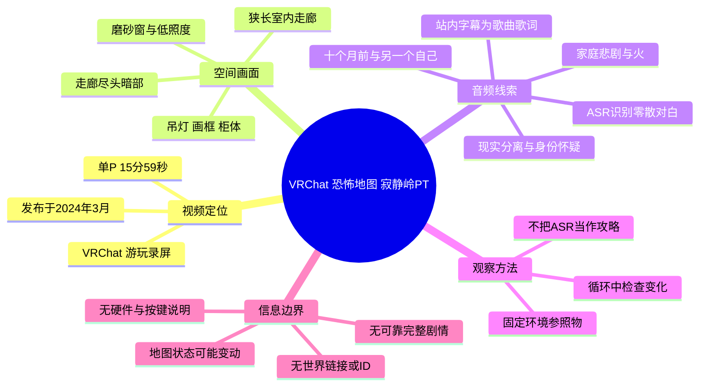
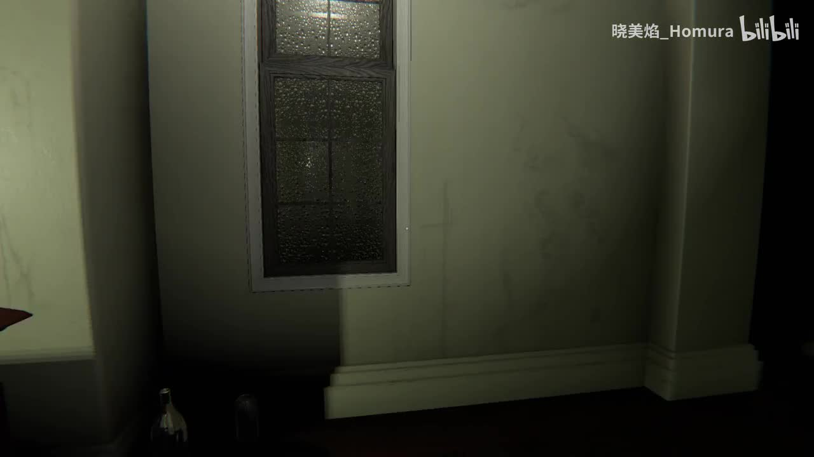
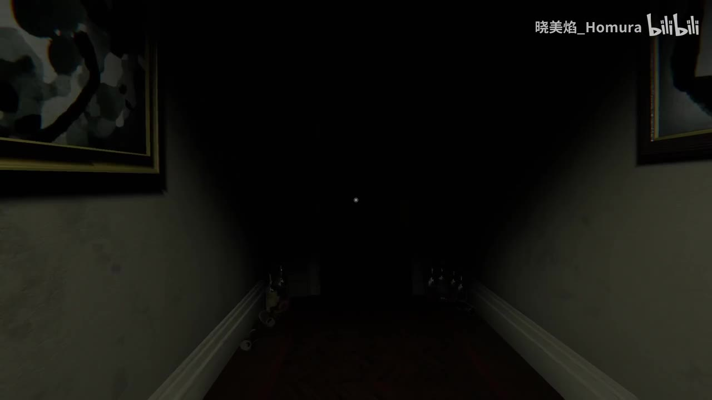
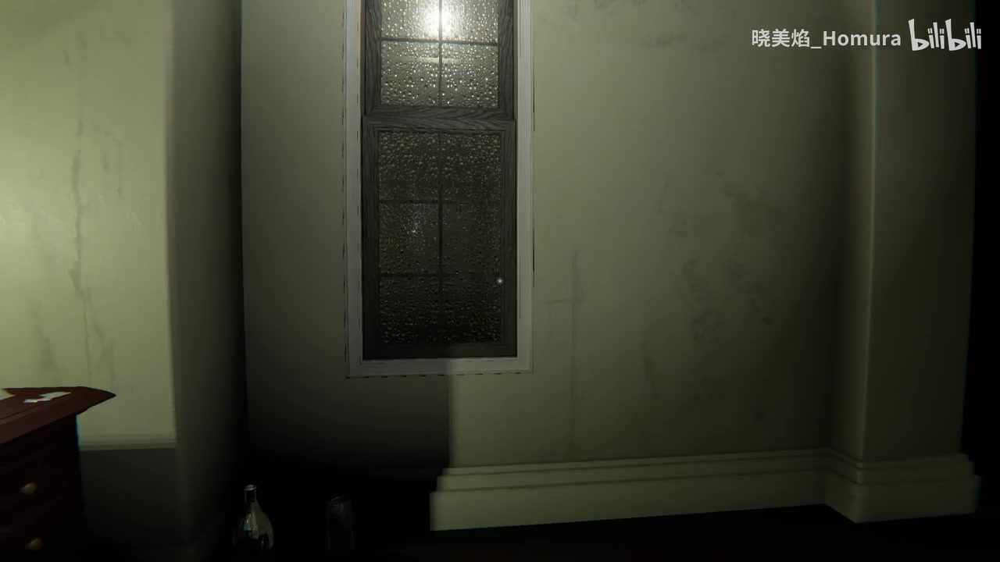
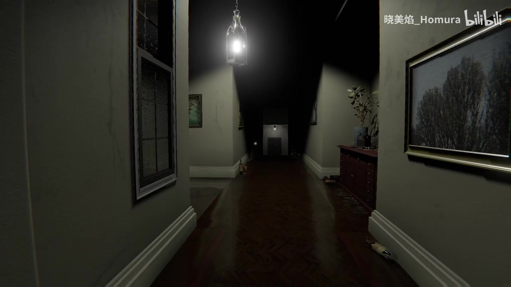

# 【VRChat】恐怖地图寂静岭PT

> 来源：[Bilibili 视频](https://www.bilibili.com/video/BV1Jw4m1o7Wi)  
> UP 主：晓美焰_Homura｜发布时间：2024-03-19｜时长：15:59（959 秒）｜画面：1920×1080  
> 标签：寂静岭、VR、惊悚、美少女、游戏、恐怖、Steam、VRChat、VRC、推荐宝藏游戏

## 小结

这是一个单 P、15 分 59 秒的 VRChat 恐怖地图游玩录像，分 P 标题为“【VRChat】恐怖游戏地图寂静岭PT”。视频标题与标签把内容定位为带有《寂静岭》PT 氛围的 VRChat 恐怖体验；但现有素材没有给出世界链接、世界 ID、地图作者、版本号、房间名称或进入步骤，因此不能将其整理为可直接复现的地图教程。

关键帧显示，视频的主要空间是一条狭长、低照度的室内走廊：磨砂窗、发黄墙面、悬挂灯具、画框、矮柜、植物与地面散落物共同构成视觉锚点，走廊远端常被阴影吞没。恐怖感主要来自封闭空间、有限视野、重复陈设和暗处不确定性，而非素材中可明确确认的战斗或怪物对抗。

本次 ASR 已执行，识别出家庭悲剧、火、十个月前、看见另一个自己、门口缝隙、不同现实和父亲等零散语句。这些内容可作为剧情氛围线索，但 ASR 存在重复、断句、用词异常和上下文缺失，不能据此断言地图的完整故事、角色关系或谜题机制。站内字幕则几乎完全由带“♪”标识的歌曲歌词构成，无法替代对白字幕。

可迁移的探索经验是：面对看似重复的走廊，应建立窗户、灯具、画框、柜体、地面物件和走廊尽头等空间基准，并在每次经过时比对变化。该方法是依据画面结构及热评“怎么感觉一直在循环”作出的保守观察建议，不是原视频明确提供的通关流程。

视频发布于 2024 年 3 月。VRChat 世界的公开状态、名称、版本、访问权限和性能表现都可能在之后变化；现有素材只能证明该视频发布时存在相应游玩录屏，不能证明地图在本次整理时仍可被搜索、进入或保持相同内容。

## 思维导图

## 目录

- [视频背景与素材边界](#视频背景与素材边界)
- [空间画面：走廊、照明与循环感](#空间画面走廊照明与循环感)
- [ASR 对白线索与剧情边界](#asr-对白线索与剧情边界)
- [观看与探索步骤](#观看与探索步骤)
- [参数、限制与时效性](#参数限制与时效性)
- [字幕比对](#字幕比对)
- [评论分析](#评论分析)
- [处理记录](#处理记录)

## 视频背景与素材边界 [00:00](https://www.bilibili.com/video/BV1Jw4m1o7Wi?t=0)

视频为单 P 内容，页面分 P 标题为“【VRChat】恐怖游戏地图寂静岭PT”，时长 959 秒。标题、分 P 标题及“VRChat”“恐怖”“寂静岭”等标签共同说明：这是以恐怖游戏地图体验为主题的 VRChat 录屏。

视频描述仅为“-”，没有补充地图来源、作者、世界搜索关键词、游玩人数、房间设置、语言、硬件、控制方式或通关说明。虽然画面是第一人称视角，中央存在小型准星样式的视觉标记，但没有控制器、键盘按键、头显边框或设置菜单，因此无法确认录制者使用的是 VR 头显还是桌面模式，也不能确认具体交互方式。

抓取时的页面统计为：417 播放、0 弹幕、9 回复、8 收藏、2 硬币、6 分享、7 点赞。上述数据仅反映元数据抓取时的页面快照，不应作为持续热度或后续增长情况的判断。

需要特别区分：标题中的“寂静岭PT”是视频发布者对地图的命名或描述；现有素材没有提供可核验的官方世界信息，因此不能推断它与其他同名或相近的 PT 作品具有相同作者、流程、谜题或结局。

## 空间画面：走廊、照明与循环感 [00:20](https://www.bilibili.com/video/BV1Jw4m1o7Wi?t=20)

已提供关键帧集中呈现住宅式室内走廊。画面以灰黄墙面、深色木地板、白色踢脚线和局部黑暗为基础；窗户、画框、柜体与吊灯形成反复出现的空间参照。走廊的纵深被照明和阴影切割，远处区域难以辨认，从而放大“前方是否发生变化”的不确定感。

> 图：该帧清楚呈现磨砂窗、墙面污渍、局部家具与右侧暗角。其价值在于展示地图并非依靠单一突发画面制造压力，而是先通过有限可见范围与光照落差建立不安感。

> 图：画面两侧有画框，中部通道向黑暗处延伸。该帧适合说明空间方向感为何容易被削弱：相似的墙面和狭窄通道会使玩家难以只凭直觉判断是否回到原处。

> 图：该帧与前一处窗户视角相近，但上方光源更明显。它可作为探索中对比亮度、窗户状态和周边陈设的参照；不过不能单凭两张截图断定地图已经发生固定事件或触发谜题。

> 图：该帧同时包含左侧窗户、顶部吊灯、右侧画框与柜体、地面散落物以及走廊尽头，是最完整的环境基准画面。它有助于理解后文“逐项比对环境变化”的观察方法，但这些物件是否为可交互道具，素材未能确认。

从现有画面可确认的互动层面仅限于第一人称环境探索。素材没有可靠展示敌人、武器、血量、背包、任务栏、收集计数、解谜面板或结算画面，因此不能写成存在战斗、追逐、物品收集或特定触发顺序。

## ASR 对白线索与剧情边界 [05:00](https://www.bilibili.com/video/BV1Jw4m1o7Wi?t=300)

本次 ASR 已执行，得到的是无时间码的零散中文转写，而非经人工校对的完整剧本。它包含一些与心理恐怖叙事相符的片段，但其中存在明显的重复、语义断裂和可能的听写错误。下表仅整理可见文本，不把推测写成事实。

| 本次 ASR 片段 | 可谨慎提取的线索 | 不能据此确认的内容 |
| --- | --- | --- |
| “在杀死了他的家人后，父亲自杀了自己，他们的房屋里有一个大厅” | 出现父亲、家人、杀害和自杀等家庭悲剧词汇。 | 叙述是否准确、人物身份、事件先后与因果关系。 |
| “你被火烧了，所以把你的悲痛都烧成烟” | 出现火、烧伤或火灾与悲痛相关的表述。 | 是否真的存在火灾场景、角色死亡或玩法机关。 |
| “十个月前”“我走过”“我只能走一步” | 可能涉及时间间隔与行动受限。 | “十个月前”具体指向什么事件，“只能走一步”是否是游戏规则。 |
| “我看到自己在自己前面走，不是真的我” | 出现双重自我、分身、幻觉或视角错位的叙事母题。 | 是否存在实体分身、镜像机制或固定谜题。 |
| “小心，门口有个隙”“这是一个分别的现实”“只有我”“你确定只有你？” | 可能涉及门口、现实分离、孤身与身份怀疑。 | “隙”“分别的现实”是否为准确原词，及其设定含义。 |
| “爸爸真是个神经病……我会回来的，我会带来我的新玩具” | 出现对父亲的负面评价、重复日常和“新玩具”的承诺。 | 说话者年龄、角色关系，以及是否与前述家庭事件属于同一段剧情。 |

其中，“这是一个分别的现实”中文表达不自然，“她要求工作”“唯一的原因是她的经理人喜欢她”等段落也缺乏可靠上下文；这些都可能是 ASR 将外语或混杂音轨错误转写后的结果。因而，本文不据此重构完整剧情，也不将其作为地图谜题提示。

此外，站内字幕为歌曲歌词，不含可用于校正上述对白的角色名、地点名或地图专有名词。若需要可靠剧情复盘，仍需获取原始语言字幕、具时间码的听写稿，或能够清楚辨认地图内文本的画面材料。

## 观看与探索步骤 [10:00](https://www.bilibili.com/video/BV1Jw4m1o7Wi?t=600)

视频没有提供明确攻略。以下是根据走廊画面、ASR 中疑似“门口”相关内容及热评中的循环观感，整理出的保守观察流程。它适用于观看或体验相似的室内循环恐怖地图，但不保证通关。

1. **先建立环境基准。**  
   首次经过走廊时，注意磨砂窗的位置、吊灯样式、画框内容、柜体、植物、地板杂物以及尽头是否可见门或光源。关键帧中的这些元素都是实际可见的参照物。

2. **重复经过时逐项比对。**  
   不要只判断“是不是又回来了”；应依次检查灯光强弱、窗户亮度、画面或挂画、家具位置、地面物件和远端暗部。循环式恐怖空间常利用细小差异制造变化感，但本素材未能证明具体哪一项会变化。

3. **优先观察门口和走廊尽头。**  
   ASR 中出现“小心，门口有个隙”这一低置信度片段，且画面结构将视觉注意力导向通道尽头。因此，门、门缝和末端光源可被列为优先观察对象；这只是探索优先级建议，不是已验证的触发条件。

4. **将语音当作氛围和叙事线索，而非操作指令。**  
   “十个月前”“另一个自己”“你确定只有你”等 ASR 内容可提示玩家注意叙事氛围，但不能据此执行固定操作，因为原句、出现时点和对应场景都未被可靠确认。

5. **不要直接套用其他 PT 相关攻略。**  
   视频没有证明该 VRChat 地图与其他“PT”作品使用同一流程。即使外部存在相近攻略，也只能作为参考，不能替代对本地图版本和场景实际状态的检查。

6. **做好惊悚内容预期。**  
   已确认画面存在黑暗、狭窄封闭空间与环境异变式氛围；ASR 还涉及家庭死亡、自杀和烧伤等敏感词。对黑暗、闪烁、心理恐怖或相关叙事敏感的观众，优先观看录屏、降低音量或避免独自体验会更稳妥。

## 参数、限制与时效性 [14:50](https://www.bilibili.com/video/BV1Jw4m1o7Wi?t=890)

### 可确认参数

| 项目 | 内容 |
| --- | --- |
| 视频平台 | Bilibili |
| 视频类型 | VRChat 恐怖地图游玩录像 |
| 视频时长 | 959 秒，约 15 分 59 秒 |
| 分辨率 | 1920×1080 |
| 分 P 数 | 1 |
| 分 P 标题 | 【VRChat】恐怖游戏地图寂静岭PT |
| 发布时间 | 2024-03-19 |
| 视频描述 | “-” |
| 抓取时弹幕数 | 0 |
| 可获取热评 | 前 3 条 |
| 站内字幕 | 有，内容主要为歌曲歌词 |
| 本次 ASR | 已执行，输出零散中文识别文本 |

### 信息限制

- **缺少地图定位资料：** 未提供世界链接、世界 ID、地图作者、版本、房间名或可复用搜索关键词，无法可靠回答“如何找到并进入该地图”。
- **缺少设备与操作资料：** 未展示 VR 头显、桌面模式、键位、控制器、性能设置、平台兼容性、Quest 支持情况或联机人数限制。
- **缺少完整流程证据：** 无法从现有关键帧和字幕证明触发条件、谜题顺序、结局、通关时长或存档规则。
- **剧情文本不可靠：** 站内字幕与 ASR 各有覆盖缺口，且 ASR 误识别风险较高，不能据此制作完整剧情设定。
- **关键帧覆盖有限：** 当前可用且有画面内容的关键帧重点是走廊环境，不能代表整段视频所有场景。
- **时间轴精度有限：** 提供的字幕与 ASR 文本均不含逐句时间码。本文标题中的时间轴链接用于视频导航，除已知视频起点与总时长外，不应理解为对白或事件的精确发生秒数。

### 时效性说明

视频发布于 2024 年 3 月，素材抓取时间为 2026-07-12。VRChat 世界可能在此期间被更新、改名、下架、设为私有或调整访问权限。当前材料没有可验证的后续状态信息，因此不能确认地图截至整理时是否仍然可访问，也不能确认其内容与视频录制时一致。

## 字幕比对 [00:00](https://www.bilibili.com/video/BV1Jw4m1o7Wi?t=0)

本次 ASR 已执行；站内字幕也可获取。两者所覆盖的内容和可用性存在明显差异。

| 字幕来源 | 完整性 | 专有名词识别 | 时间轴 | 主要问题 |
| --- | --- | --- | --- | --- |
| Bilibili 站内字幕 | 对歌曲段落提供了连续歌词文本，但未提供可用的地图剧情对白 | 未出现可核验的 VRChat 世界名、地图作者、角色名或地点名 | 所给字幕文本未附时间码 | 内容以“♪”标记的歌曲歌词为主，与 ASR 中疑似对白不对应 |
| 本次 ASR 字幕 | 识别出若干疑似对白，涉及家庭、火、十个月前、另一个自己、门口和现实 | 未能可靠识别地图名、人物名、地点名或世界 ID | 所给 ASR 文本未附时间码 | 存在重复、断句、语义异常和疑似错字，如“分别的现实”“门口有个隙” |

最终采用**并列使用、分工解释**的策略：

- 站内字幕仅用于确认音轨中存在歌曲歌词，不能用来复原恐怖地图的对白。
- 本次 ASR 用于建立低置信度剧情线索索引，但不作为逐字稿、剧情定论或操作攻略。
- 关键帧只能校正空间语境：画面确实呈现走廊、窗户、吊灯、画框、柜体和远端暗部；但无法校正“隙”的准确字词，也无法验证“现实分离”“父亲”“火”等语句对应的具体画面和人物关系。

## 评论分析 [00:00](https://www.bilibili.com/video/BV1Jw4m1o7Wi?t=0)

以下仅分析当前可获取的热评前三条。三条评论点赞数均为 0，内容均属于观众提问或观感，不能作为已验证的地图资料。

1. **人老手震枪法渣：**“VRchat怎样才能玩到”  
   - **观点与需求：** 希望了解进入 VRChat 或游玩该地图的方法。  
   - **可补充的信息：** 该评论说明观众可能将视频视作地图推荐内容。  
   - **可信度与边界：** 这是需求表达，不包含具体方法。原视频描述为空，现有素材也没有世界链接或进入流程，因此无法由本视频可靠回答。

2. **kira_zhou：**“看不懂英文能玩吗”  
   - **观点与需求：** 关注语言是否会影响游玩。  
   - **可补充的信息：** 本次 ASR 捕捉到较多疑似语音叙事，说明语言理解可能影响剧情感受。  
   - **可信度与边界：** 视频未展示语言设置、官方字幕、翻译功能或地图文字内容，不能据此断言不懂英文“能玩”或“不能玩”。

3. **mocmi：**“怎么感觉一直在循环”  
   - **观点与观感：** 认为视频呈现出持续循环的空间体验。  
   - **可补充的信息：** 已提供关键帧反复围绕相似的室内长走廊，能够解释该观感；这也与心理恐怖作品常见的重复空间设计相吻合。  
   - **可信度与边界：** 评论仅代表观看感受，不能单独证明地图存在固定循环机制、循环次数或特定触发规则。

## 处理记录 [00:00](https://www.bilibili.com/video/BV1Jw4m1o7Wi?t=0)

- **Worker ID：** worker-mri3t0px-8b394786
- **模型：** gpt-5.6-terra
- **调用工具与素材来源：** 基于任务提供的视频元数据、素材产物清单、站内字幕文本、已执行的 ASR 文本、关键帧路径和热评数据进行整理；未调用未提供的 VRChat 外部地图数据库或网页检索结果。
- **已使用的素材产物：** `merged.mp4`、`audio/audio.wav`、`frames/`、`comments/comments.json`、`subtitles/`、`asr/` 的已提供结果。
- **字幕选择：** 不单独采用任何一份字幕作为完整字幕。站内字幕用于识别歌曲歌词；本次 ASR 用于提取低置信度对白线索；两者均不作为完整剧情逐字稿。
- **关键帧选择依据：** 选用 `frames/frame-001.jpg`、`frames/frame-002.jpg`、`frames/frame-003.jpg`、`frames/frame-004.jpg`。四帧分别展示窗户与暗角、阴影中的通道、受光照亮的窗户墙面，以及包含吊灯、柜体、画框和走廊尽头的完整空间，能够直接支持环境氛围、空间参照与循环感的分析。
- **关键帧使用限制：** 未将关键帧未展示的怪物、机关、战斗、收集、结局或地图机制写入正文。
- **缓存清理：** 提供素材未附缓存清理执行日志，无法确认采集流程是否已经清理缓存；本记录不虚构清理结果。
- **未解决问题：** 地图准确世界名称、世界 ID、访问链接、作者、版本、当前公开状态、硬件要求、桌面/VR 模式、按键、游玩人数、性能要求、完整通关流程、结局、原始对白及逐句时间码，均无法从当前真实素材中可靠确定。
