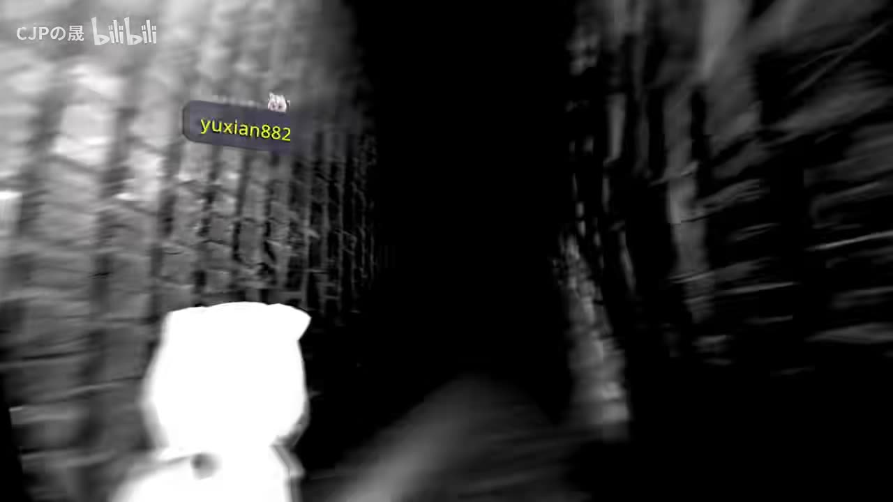
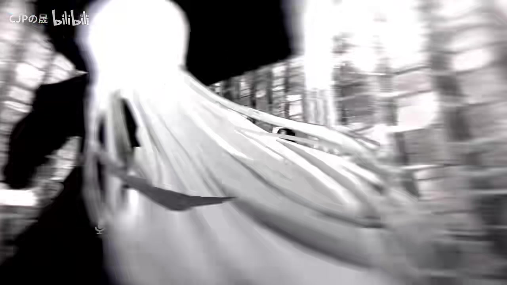
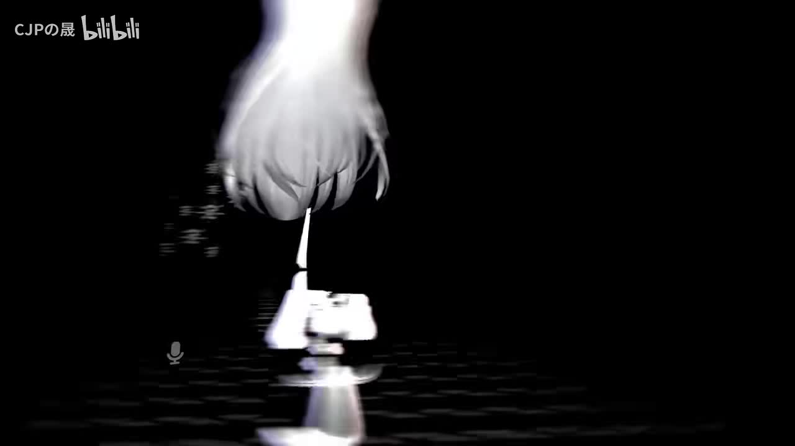

# 撒旦降临，无人生还！顶级质量的恐怖“新”图【VRChat】

> 来源：[Bilibili 视频](https://www.bilibili.com/video/BV1gV411F7RB)  
> UP 主：CJPの晟｜发布时间：2023-09-29｜时长：25 分 27 秒  
> 视频简介：UP 主称“绝版已久的恐怖图集万圣节前夕终于浮出水面”。  
> 标签：VRChat、VR、万圣节、恐怖游戏、游戏解说、游戏攻略。

## 小结

这是一段多人游玩 VRChat 恐怖地图的实录。参与者从地图入口进入后，在黑白颗粒化的迷宫、门阵、走廊与室内空间中持续遭遇音效、文字提示、角色贴脸、场景切换、重力错位和追逐事件。视频的核心并非提供可复现的通关攻略，而是记录多人在未知机制下靠观察环境、结伴行动、反复试路推进的过程。

地图的恐怖感主要来自低清黑白视觉、狭窄通道、突发大脸、持续尖叫、英文叙事文本，以及“道路循环—出口变化—角色出现”的组合。视频中可辨识到的文本包括“Do you believe in angels?”、“She is coming for you”、“Do you think murder is good?”、“Emily is her name”、“Do you want to be my friend?”等；这些提示共同指向一个名为 Emily 的角色及其“想要朋友”的叙事线索，但视频没有给出经验证的完整剧情或地图作者资料。

从体验与操作层面看，同行者选择了“第二个多人”选项进入；流程中需要频繁观察可通行门、尝试与电视和手部模型互动、跟随队友方向、在追逐或强制移动时快速前进。后段出现玩家模型变化、彼此不可见、灯光/手电功能疑似失效等限制，使沟通和集体行动变得更加重要。

UP 主在结尾评价地图“不错”“真牛”，并口述其体积“不到 50 兆能做出这个效果”。这是视频内的主观陈述，未提供地图页面、下载文件或性能测试证据，因此不能据此确认实际文件体积、平台兼容性、制作人或当前是否仍可访问。

适合希望了解 VRChat 恐怖地图演出手法、多人恐怖体验节奏，或寻找万圣节游玩氛围的读者。对闪烁、尖叫声、贴脸、血腥/身体恐怖元素敏感者需谨慎；视频没有公布确切地图名，且发布于 2023 年，地图可访问性、版本、容量与性能状况均可能已经变化。

## 思维导图

## 目录

- [背景、范围与时效性](#背景范围与时效性)
- [进入地图：黑白迷宫与“悲伤的撒旦”联想](#进入地图黑白迷宫与悲伤的撒旦联想)
- [门阵、贴脸与英文文字提示](#门阵贴脸与英文文字提示)
- [追逐、循环道路与 Emily 线索](#追逐循环道路与-emily-线索)
- [重力错位、电视事件与场景变化](#重力错位电视事件与场景变化)
- [后段机制：朋友邀请、模型变化与功能限制](#后段机制朋友邀请模型变化与功能限制)
- [终章场景与地图评价](#终章场景与地图评价)
- [多人游玩步骤与经验](#多人游玩步骤与经验)
- [参数、限制与时效性结论](#参数限制与时效性结论)
- [字幕比对](#字幕比对)
- [评论分析](#评论分析)
- [处理记录](#处理记录)

## [背景、范围与时效性](https://www.bilibili.com/video/BV1gV411F7RB?t=0)

视频记录的是一次 VRChat 多人恐怖地图游玩，分辨率为 1920×1080，时长 1527 秒。标题中的“新”带引号，简介则称这是“绝版已久”的恐怖图在万圣节前夕重新出现；这说明视频叙事强调其稀有性或重新流通，但没有提供地图链接、世界 ID、作者账号、版本号或上架状态。

开场时，玩家明确提到选择“第二个多人”选项，随后进入地图。视频内的“悲伤的撒旦”“来自暗网的游戏”等说法，是玩家在游玩时基于画面与既有网络传闻作出的联想，不应等同于地图的正式名称、来源或背景事实。

内容时效上需要区分：

- **可由视频确认的历史事实**：视频于 2023-09-29 发布；当时参与者成功进入并游玩了该地图。
- **仅为视频口述的内容**：地图曾“绝版”、文件不到 50MB、可能与某个“后母房”说法有关。
- **截至素材抓取时间（2026-07-12）仍无法确认的内容**：地图是否仍公开、具体名称、制作者、当前容量、是否支持一体机（Quest）及性能表现。

## [进入地图：黑白迷宫与“悲伤的撒旦”联想](https://www.bilibili.com/video/BV1gV411F7RB?t=20)

### [00:20](https://www.bilibili.com/video/BV1gV411F7RB?t=20) 黑白颗粒化空间与视觉基调

进入后，玩家首先注意到地图画风“挺抽象”，并称第一次见到这种风格。环境由高反差黑白墙体、模糊纹理、狭长通道构成；画面并不依赖精细写实材质，而是利用失焦、噪点、低可见度和强烈明暗对比制造不安感。

> 图：画面显示玩家身处黑白、高噪点的狭长通道，队友昵称悬浮在前方。该帧直接体现地图早期的核心压力来源：视距短、墙面纹理干扰强，且玩家需要通过队友位置判断路线。

玩家随即将墙面道路与“悲伤的撒旦（Sad Satan）”相关视频相联系，并提及“来自暗网的游戏”一类传言。这里能确认的是**玩家做出了这层联想**；地图是否实际借鉴该作品，视频未给出足够证据。

### [01:25](https://www.bilibili.com/video/BV1gV411F7RB?t=85) 初始异常与方向不确定

早期路线中，队伍听见异常声音，遇到人偶或人形物体，并被提示“turn back”。他们没有立即理解提示的触发逻辑，先尝试直走，再因通路受阻转向。此段展示了地图的基础推进模式：

1. 听见环境音或语音提示；
2. 发现视觉异常、角色或死路；
3. 在多个方向、门或墙面之间试探；
4. 由某个事件触发门开、道路可通或场景切换。

> 图：画面中白色人形近距离占据前景，背景仍是黑白通道。该帧适合说明地图以突然靠近的人形模型和镜头压迫感制造惊吓，而非只依靠传统追逐。

## [门阵、贴脸与英文文字提示](https://www.bilibili.com/video/BV1gV411F7RB?t=210)

### [03:30](https://www.bilibili.com/video/BV1gV411F7RB?t=210) 多门试错与大脸惊吓

队伍进入存在多扇门的区域。玩家连续尝试不同门，但多次遇到墙面或无法通过的路径；在反复交互和转向后，出现“大脸”贴近画面，随后找到可以继续走的方向。这里没有展示明确的解谜规则，因此不能断言“必须按某一扇门的固定顺序通过”。

视频可归纳的实际经验是：在门阵区域，单纯凭直觉选门并不可靠；需要由多人分头观察、确认门后是否为墙体、留意突发事件后是否有新通道开放。

### [04:35](https://www.bilibili.com/video/BV1gV411F7RB?t=275) “相信天使吗”与尖叫压力

地图出现英文文字：

> “Do you believe in angels?”  
> “你相信天使吗？”

玩家以玩笑方式回应，但未得到可验证的选择分支。其后出现持续尖叫、头部/人偶晃动、门打开和加速移动等演出。由于录音中存在多人喊叫和压缩失真，尖叫来源、触发条件及是否与“天使”问题有关都不能确定。

此段的重要设计在于把文字提问与立即发生的声画刺激并置：即使文本不要求输入答案，也会诱导玩家期待后续惩罚或剧情反转。

## [追逐、循环道路与 Emily 线索](https://www.bilibili.com/video/BV1gV411F7RB?t=410)

### [06:50](https://www.bilibili.com/video/BV1gV411F7RB?t=410) 追逐提示与场景重置

玩家听到英文提示：

> “She is coming for you.”  
> 可译为：“她正朝你而来 / 她要来追你了。”

队伍随即呼喊快跑、转向，并在混乱后发现“没死，场景不一样”。这表明地图至少在该段使用了追逐或假性追逐的演出，并通过传送/场景切换代替传统失败结算。视频没有显示生命值、任务 UI 或死亡结算界面，因此不能确定是否存在真正的失败条件。

### [08:00](https://www.bilibili.com/video/BV1gV411F7RB?t=480) 谋杀提问、蜘蛛意象与重复道路

后续出现：

> “Do you think murder is good?”  
> “你认为谋杀是好的吗？”

玩家回应“不好”，但同样没有展示答题输入或明确的因果反馈。之后他们看到类似蜘蛛的物体，并意识到自己似乎在重复走同一段路。屏幕文字中可辨识出：

> “Emily is her name.”  
> “她的名字叫 Emily。”

“Emily”是视频中最明确的角色名线索。地图此后持续以女性/人形角色、追逐、朋友邀请及受害叙事强化这一角色，但视频并未提供完整可读的文本序列，不能据此还原完整剧情。

> 图：前方白色人影位于黑暗空间中央，地面反光将轮廓延伸至镜头方向。该帧能说明“远处目标—狭窄通道—无法确定安全距离”的构图如何服务于追逐和预期惊吓。

## [重力错位、电视事件与场景变化](https://www.bilibili.com/video/BV1gV411F7RB?t=650)

### [10:50](https://www.bilibili.com/video/BV1gV411F7RB?t=650) 屋顶行走与方向沟通

队伍遭遇角色在屋顶或天花板上移动的场面。玩家将其戏称为“蜘蛛侠”，并且自己也出现倒着走、方向感混乱的情况。此时多人沟通集中在“面朝哪个方向”“一直往前走”“哪里有门”等具体报点。

这说明地图不只是视觉惊吓，还通过空间方向错置干扰协作：同一地点在不同玩家视角中可能难以快速说明。面对这种情况，视频中有效的沟通方式是以“面朝方向”“前方是否有门”“谁在天花板路径”等可观察信息报点，而非使用“左边/右边”这类受视角影响大的描述。

### [12:00](https://www.bilibili.com/video/BV1gV411F7RB?t=720) 电视交互与“从屏幕钻出”的演出

玩家在电视区域试图点击电视、查看屏幕内容，并讨论鬼是否会像贞子一样从屏幕钻出。随后画面确实出现人头/角色从电视方向出现的惊吓演出；这是视频中较明确的“玩家预判—地图兑现”的事件。

另有英文字幕：

> “She gets made fun of because she is different.”  
> “她因为与众不同而被嘲笑。”

这句为 Emily 的受排斥背景提供了直接文本线索，但不能单独证明她之后行为的全部动机。

## [后段机制：朋友邀请、模型变化与功能限制](https://www.bilibili.com/video/BV1gV411F7RB?t=900)

### [15:00](https://www.bilibili.com/video/BV1gV411F7RB?t=900) 独木桥、接近事件与“朋友”主题

队伍经过独木桥或窄路，部分成员掉落或被迫加速移动。随后再次出现闪烁及文本：

> “Do you want to be my friend?”  
> “你想成为我的朋友吗？”

玩家明确口头拒绝，表示想离开。此后角色靠近、眼部颜色/场景色调发生变化。视频把“成为朋友”的邀请处理成恐怖威胁，而不是和平的对话选项；但没有显示可点击的“是/否”界面，不能将口头回答视为游戏系统判定。

### [17:20](https://www.bilibili.com/video/BV1gV411F7RB?t=1040) 墙体挤压、颜色变化与模型替换

玩家走入疑似会被墙体挤压的通道，持续担心被压死；随后场景颜色变化、门再次开启。接着，多人报告模型变了、加载模型、看不到彼此，甚至怀疑自己变成了怪物。玩家还提到灯/手电“不能开了”“把咱功能都给禁了”。

在这段中可以确认的现象是：

- 参与者主观观察到头像/模型状态改变或彼此不可见；
- 他们主观判断照明功能不能使用；
- 场景继续引导他们向前，并让其在原路与新门之间选择。

但无法仅凭视频确定这是地图脚本强制替换 Avatar、VRChat 同步/加载故障，还是录制端显示异常。两种可能均应保留。

### [19:15](https://www.bilibili.com/video/BV1gV411F7RB?t=1155) 自述文本与“漂亮吗”的压力叙事

后段出现一段较长英文独白。ASR 能辨识出其中与“母亲”“让自己看起来同样漂亮”“玩得开心”“你觉得我漂亮、可爱吗”相关的片段，但英文原句受背景音影响，无法可靠逐字转写。参与者将它理解为角色试图与玩家交朋友或要求认可外貌。

因此，可稳妥归纳为：地图通过第一人称/角色独白，将 Emily 的“被嘲笑”“想要朋友”“对外貌的在意”等碎片串联起来；具体故事细节和每句英语的准确语义，应以地图内原始文本或作者说明为准。

## [终章场景与地图评价](https://www.bilibili.com/video/BV1gV411F7RB?t=1240)

### [20:40](https://www.bilibili.com/video/BV1gV411F7RB?t=1240) 血污走廊、手部物理与自动换景

在结束前的空间里，玩家经过狭窄通道、血污地面、水池/积水般的画面，并将其氛围类比为《小小梦魇》。他们又进入满是手的区域，明确尝试手部互动，确认“有物理”，即手部模型可被碰撞、推动或拉扯。

随后队伍发现前方女性角色，途中因一位玩家接电话而短暂停顿；返回后，场景已自动变换。该过程至少表明地图存在按时间、位置或事件自动转场的演出，不过具体触发器无法从素材确定。

### [23:20](https://www.bilibili.com/video/BV1gV411F7RB?t=1400) “被活活烧死”的结尾信息

终段出现树上女性角色招手、火焰/焚烧场景和旁白式文本。视频中可听到/辨识到：

> “They burned me alive.”  
> “他们活活地把我烧死了。”  
>
> “That is my story.”  
> “这就是我的故事。”

参与者将其理解为地图希望玩家同情该角色。这个理解与先前“她因不同而被嘲笑”“想要朋友”的文本形成连贯叙事，但仍属于对碎片线索的合理阅读，不是地图作者在视频外给出的正式剧情说明。

### [24:35](https://www.bilibili.com/video/BV1gV411F7RB?t=1475) UP 主评价与未解信息

结尾，UP 主对地图评价较高，称“这图不错”“真牛逼”，并表示“不到 50 兆能做出这个效果”。他还询问是否由某人制作，但没有在视频中确认制作者；紧接着出现的地图名/来源相关口述在两份字幕中都不清晰，无法可靠还原。

因此，本视频最值得保留的结论是：**这是一张依靠高密度视听演出、空间错置和碎片叙事获得强烈效果的 VRChat 恐怖地图；其正式名称、作者、分发页面和技术规格均未在现有素材中被可靠确认。**

## [多人游玩步骤与经验](https://www.bilibili.com/video/BV1gV411F7RB?t=0)

以下是根据视频实际流程整理的体验步骤，不等同于地图官方攻略，也不保证每次进入都以相同顺序触发。

1. **确认进入方式。**  
   开场口述为选择“第二个多人”选项。若复现游玩，应优先确认房间类型、实例人数限制及是否需要邀请；视频未提供具体设置页参数。

2. **进入后先结伴，不要急于分散。**  
   初始黑白迷宫能见度低、转角多，且存在声音诱导和突发人形。视频中多人虽然会短暂走散，但多数推进依赖同行者报点。

3. **在门阵或死路区逐一验证通路。**  
   不要把首次不可通行当作永久死路。视频里发生过反复试门后道路开放、门出现/消失、场景状态变化的情况。

4. **将英文提示记录为叙事线索，而非确定指令。**  
   “天使”“谋杀”“她要来追你”“Emily”“想成为朋友”等文本增强了氛围并提示角色背景；视频没有证明它们对应可选择的答题机制。

5. **追逐或强制移动时优先跟队、前进与报点。**  
   视频中“快跑”“前面有东西挡住”“转向”等沟通频繁。可用“我面前有门”“角色在天花板”“前方是墙”等描述替代容易混淆的左右方位。

6. **对电视、手部模型等显著物件尝试互动。**  
   电视区触发了关键惊吓；后段手部区域被确认存在物理互动。这些是视频里最明确的环境交互例子。

7. **出现模型、照明或可见性异常时先确认同步状态。**  
   视频内玩家报告模型被替换、彼此不可见、手电失效。由于无法确定是脚本还是客户端问题，实际游玩时应先向队友确认是否一致发生，必要时考虑重进实例。

8. **对闪烁、贴脸和高音量做好防护。**  
   视频多次出现尖叫、红色闪烁、突发大脸与近距离怪物。建议调低音量、避免长时间直视高频闪烁区域；对相关刺激敏感者不宜单独体验。

## [参数、限制与时效性结论](https://www.bilibili.com/video/BV1gV411F7RB?t=1475)

| 项目 | 视频可确认信息 | 限制或说明 |
| --- | --- | --- |
| 平台 | VRChat | 可确认。 |
| 游玩形态 | 多人游玩 | 开场提到选择“第二个多人”。 |
| 视频时长 | 1527 秒（25:27） | 元数据可确认。 |
| 视频规格 | 1920×1080 | 元数据可确认。 |
| 核心演出 | 黑白迷宫、门阵、贴脸、追逐、循环、电视、重力错位、自动换景 | 根据画面和口述整理；触发条件不完整。 |
| 互动对象 | 门、电视、手部模型 | 手部物理互动由玩家口述确认。 |
| 地图容量 | “不到 50 兆” | UP 主口述，未提供文件或页面验证。 |
| 地图名称 | 未可靠提供 | 结尾相关口述不清晰，不能据此命名。 |
| 地图作者 | 未确认 | UP 主也在询问是否为某人制作。 |
| Quest/一体机兼容性 | 未知 | 热评提出疑问，但视频和评论均未给出答案。 |
| 性能需求 | 未知 | 仅有观众担心电脑重启的玩笑式评论，不能视为测试结果。 |
| 当前可用性 | 未知 | 视频发布于 2023 年，地图状态截至素材抓取日未核实。 |

## [字幕比对](https://www.bilibili.com/video/BV1gV411F7RB?t=0)

本次任务中**站内字幕与本次 ASR 均已获取并执行**。两者都没有逐句时间戳，且均受多人同时说话、尖叫、英文语音、网络/游戏音效和口语化表达影响。

| 字幕来源 | 完整性 | 专有名词与英语 | 时间轴 | 主要问题 |
| --- | --- | --- | --- | --- |
| Bilibili 站内字幕 | 覆盖了大部分口语流程，尤其是后段剧情与结尾评价 | 可辨识“悲伤的撒旦”“Emily”“She is coming for you”等部分英文 | 未提供逐句时间码 | 大量重复、断句异常和同音误识别；个别句子语义不通。 |
| 本次 ASR 字幕 | 覆盖范围广，保留了较多环境语音与英文片段 | 对 “Do you believe in angels?”、“Do you think murder is good?”、“Emily is her name”等有一定识别能力 | 未提供逐句时间码 | 中英混杂、繁简混用明显；多人抢话时漏词、错词更突出，如将“天使”识为“Angles”等。 |

### 最终字幕采用策略

本文采用**站内字幕为主体、本次 ASR 用于交叉核对**的方式，而不是完全依赖任一版本。具体原则如下：

- 对重复出现且两份字幕相互印证的内容，作为正文事实记录，如“Emily”“她正在追你”“你想成为我的朋友吗”“他们活活把我烧死了”。
- 对英文短句，以两份字幕和上下文一致性为依据，保留可辨识原文，并提供谨慎翻译。
- 对结尾地图名、作者与来源相关的模糊音频，不强行校正；两份字幕均未能形成可靠一致的名称。
- 章节时间点依据视频总时长、事件顺序和关键帧位置进行定位，为阅读导航用途，非逐词级字幕时间码。

## [评论分析](https://www.bilibili.com/video/BV1gV411F7RB?t=0)

仅处理可获取的热评前三条。三条评论点赞数均为 4，发布时间均在视频发布后约 3—4 天；评论属于观众提问或调侃，不能替代地图资料与性能测试。

1. **兴兴不想上班**：  
   > “世界大嘛一体机版本玩的了嘛”  
   评论关注该地图能否在“一体机版本”运行，可理解为对 Quest 等独立设备兼容性的询问。视频没有回答，也没有显示运行设备或世界兼容标签，因此该问题仍未解决。

2. **一只妖秀**：  
   > “我感觉，我估计我的电脑不到半小时电脑就会重启[doge]”  
   评论以玩笑方式表达对电脑性能/稳定性的担忧，可能反映观众认为地图演出复杂或画面压迫感强。但它没有提供硬件配置、帧率、温度或崩溃记录，不构成性能结论。

3. **抹布T**：  
   > “求个地图名[脱单doge]”  
   评论直接反映视频没有清晰给出地图名称，或至少观众无法从视频中获取。结合结尾口述不清与现有素材，这一需求无法可靠满足；不应根据模糊字幕编造地图名。

## [处理记录](https://www.bilibili.com/video/BV1gV411F7RB?t=0)

- **Worker ID**：worker-mri3sp0r-0d15ab26
- **模型**：gpt-5.6-terra
- **调用工具与素材**：基于已提供的视频元数据、站内字幕、本次 ASR 字幕、热评 JSON、关键帧目录及已提供关键帧图像进行整理；未使用外部检索补充地图名、作者或兼容性信息。
- **字幕选择**：站内字幕为主、本次 ASR 交叉校对；两者均已处理。对不一致或无法听清的内容保守表述，不补写原视频未证实的信息。
- **关键帧选择依据**：选用 `frames/frame-001.jpg`、`frames/frame-002.jpg`、`frames/frame-004.jpg`。三帧分别对应远处人影压迫、黑白迷宫探索、近距离白色人形，能够直接支持“空间迷失、多人协作、贴脸惊吓”三个核心段落；其余帧未在当前正文中强行使用。
- **缓存清理**：素材清单未提供可验证的缓存删除日志；本记录不声称已执行缓存清理。
- **未解决问题**：地图正式名称、制作者、世界链接/ID、当前上架状态、实际文件体积、性能数据、一体机兼容性，以及若干英文独白的逐字文本，均无法从给定素材可靠确认。
