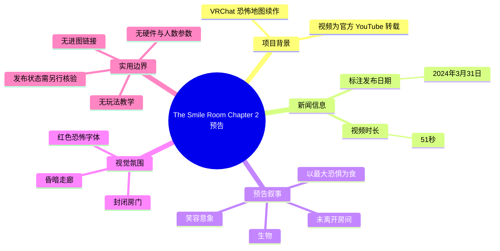
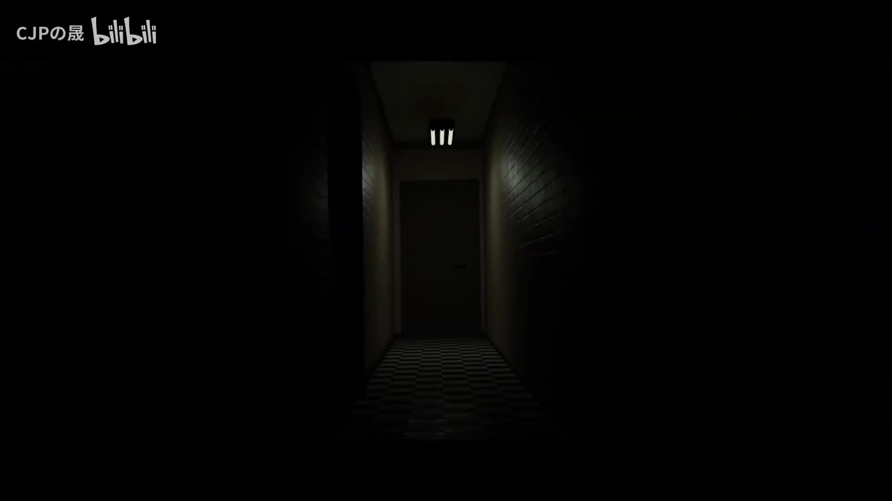
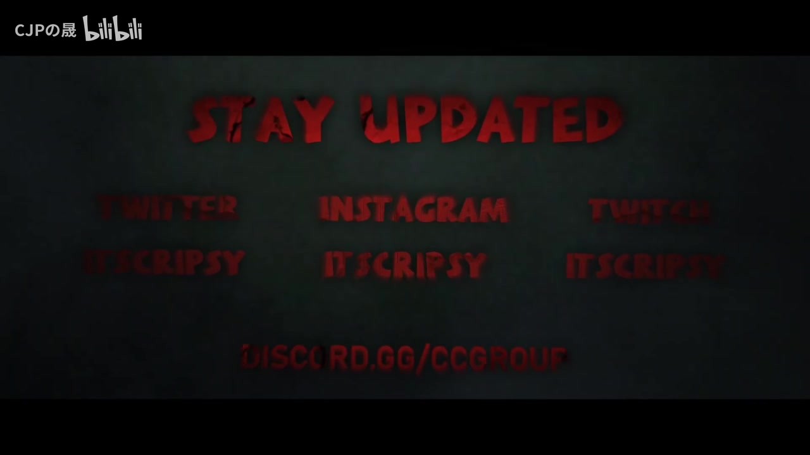

# 重磅！VRC最知名最火恐怖图《The Smile Room第二章》3月31日更新！【VRChat】【The Smile Room Chapter 2】

> 来源：[Bilibili 视频](https://www.bilibili.com/video/BV1wi4y1r7av)  
> UP 主：CJPの晟｜视频时长：51 秒｜分辨率：1920×1080  
> 视频说明：转载自原作者官方 YouTube；原说明将其称为 VRChat 恐怖地图《The Smile Room》的续作，并标注发布日期为 **2024 年 3 月 31 日**。

## 小结

这是一个时长 51 秒的《The Smile Room Chapter 2》宣传预告转载视频。其核心新闻是：作为 VRChat 恐怖地图《The Smile Room》的续作，《The Smile Room Chapter 2》计划于 **2024 年 3 月 31 日**发布／更新；该日期来自视频简介中的英文原文“Release Date: 31.03.2024”。

预告以压暗的走廊、封闭房门与红色恐怖风格文字建立氛围。ASR 可辨识的英文旁白包括“It's not just / It's a creature / It feeds on your biggest fears”，内容将威胁描述为一种会以玩家“最大的恐惧”为食的生物；另有中文语句“你从来没有离开房间”“当你进去后”“所有的这些是笑容”，但素材未提供精确时间戳和完整上下文，因此应将其视为预告片中的叙事片段，而非可据此还原的完整剧情设定。

对想关注 VRChat 恐怖地图、寻找联机惊悚体验或核对《The Smile Room》续作发布日期的读者而言，视频提供了项目名称、题材、发布节点与基础氛围信息。它**不是攻略、玩法教学或配置指南**：没有给出进图链接、平台兼容性、玩家人数、游玩时长、VR/桌面模式要求、操作步骤或内容警告分级。

日期信息具有明显时效性。视频发布于 2024 年初，所称 2024 年 3 月 31 日为当时的计划发布日期；截至素材抓取时间（2026-07-12），本资料无法据此确认地图是否按期上线、是否仍可游玩，或后续版本是否已发生变化。标题中“最知名最火”属于发布者标题的宣传性表述，现有素材没有提供排名、在线人数或下载量可供验证。

## 思维导图

## 目录

- [背景与时效性](#背景与时效性)
- [预告内容与叙事线索](#预告内容与叙事线索)
- [视觉设计与关键帧](#视觉设计与关键帧)
- [游玩准备与信息缺口](#游玩准备与信息缺口)
- [结论与限制](#结论与限制)
- [字幕比对](#字幕比对)
- [评论分析](#评论分析)
- [处理记录](#处理记录)

## 背景与时效性 [00:00](https://www.bilibili.com/video/BV1wi4y1r7av?t=0)

视频标题指向 VRChat（常简称 VRC）恐怖地图《The Smile Room》的第二章，即 **The Smile Room Chapter 2**。视频简介明确说明两项背景事实：

1. 本视频由 UP 主转载自原作者官方 YouTube，而非声明为 UP 主自行制作的地图内容。
2. 《The Smile Room Chapter 2》被描述为 VRChat 恐怖地图《The Smile Room》的续作，英文简介标注“Release Date: 31.03.2024”。

因此，本片的性质应定位为**版本／作品发布预告**，而不是对已经完成更新内容的实测报告。标题中的“3 月 31 日更新”与简介中的发布日期相互呼应，但“更新”究竟是新地图公开、续作上线还是特定版本更新，现有文本只足以确认其是续作的发布日期表述，不能进一步细化。

视频长度为 51 秒，画面规格为 1920×1080。标签包含“VR”“恐怖游戏”“预告片”“VRChat”“VRC”“The Smile Room”等，支持其恐怖地图预告的定位；但标签中的“游戏攻略”不代表视频本身提供了攻略步骤。

> **时效提醒：** 2024 年 3 月 31 日是预告中所写的历史计划日期，不等于当前可用状态。要在实际游玩前确认地图名称、World ID、开放状态、更新日志及支持的平台，应前往地图作者或相关 VRChat 页面核验；这些信息不在本视频素材内。

## 预告内容与叙事线索 [00:08](https://www.bilibili.com/video/BV1wi4y1r7av?t=8)

本次 ASR 从短片中提取到的可辨识台词如下：

> “It's not just / It's a creature / It feeds on your biggest fears”

可直接确认的是：预告把某个威胁对象称为“creature（生物）”，并称它“以你最大的恐惧为食”。这是一种服务于恐怖氛围的角色／威胁描述，暗示地图的恐惧主题可能围绕玩家心理压力或个人恐惧展开。

ASR 还识别出以下中文内容：

> “你从来没有离开房间”  
> “当你进去后”  
> “所有的这些是笑容”

其中，“你从来没有离开房间”与“当你进去后”可形成“进入房间后并未真正离开”的封闭空间叙事印象；“笑容”则与作品名中的 *Smile* 及恐怖图像意象相呼应。不过，字幕切分不完整，且没有原始时间轴、说话人及连续上下文，不能确认这些句子是否为正式旁白、屏幕文字翻译或 ASR 对混合音频的识别结果。

### 可确认内容与不可确认内容

| 项目 | 结论 | 依据与边界 |
| --- | --- | --- |
| 作品名称 | 《The Smile Room Chapter 2》 | 标题与简介直接提供。 |
| 平台／类型 | VRChat 恐怖地图续作 | 简介英文直接说明。 |
| 发布节点 | 2024 年 3 月 31 日 | 简介中的“Release Date: 31.03.2024”。 |
| 威胁意象 | 被称为“生物”，以最大恐惧为食 | 本次 ASR 英文片段。 |
| 房间与笑容意象 | 预告中存在相关语句 | 来自 ASR，但上下文不足。 |
| 完整故事、敌人机制、结局 | 无法确认 | 素材没有剧情全文或玩法说明。 |
| 当前地图状态 | 无法确认 | 历史预告日期不能替代当前页面信息。 |

## 视觉设计与关键帧 [00:18](https://www.bilibili.com/video/BV1wi4y1r7av?t=18)

预告的可见视觉信息集中于“低可见度、狭窄空间、信息不完整”的恐怖表达：黑暗覆盖画面大部分区域，走廊尽头的门成为唯一明确的视觉目标，顶部灯光不足以消除环境的不确定性。黑白格状地面与两侧墙面加强透视，将注意力推向前方封闭门体。

> 图：关键帧展示了被黑暗包围的狭窄走廊、格状地面和尽头的关闭房门。它直观呈现了预告的核心空间语言：以可视范围受限和“必须朝未知门口前进”的构图制造压迫感，也为“进入房间后”的 ASR 叙事片段提供了视觉参照。

### 片尾信息与外部关注入口 [00:40](https://www.bilibili.com/video/BV1wi4y1r7av?t=40)

另一张关键帧以红色字样显示“STAY UPDATED”，并可见多个社交平台名称与 `DISCORD.GG/CCGROUP` 文本。该画面传递的明确意图是：原作者希望观众通过社交渠道与 Discord 社群关注后续信息。

由于画面较暗且文字存在遮挡／低清晰度，除清晰可读的“STAY UPDATED”及 Discord 字符串外，不应将其他平台账号拼写、完整 URL 或社交账号名称视为可可靠复现的信息。实际访问前需从官方页面核对链接，避免因预告画面模糊而输入错误地址。

> 图：关键帧包含“STAY UPDATED”及 Discord 社群地址提示，说明预告并非提供具体进图教程，而是引导观众通过外部渠道跟进后续消息。红色、扭曲感较强的字体也延续了作品的惊悚视觉风格。

## 游玩准备与信息缺口 [00:45](https://www.bilibili.com/video/BV1wi4y1r7av?t=45)

本片没有给出可执行的进图流程，因此不能从视频中整理出“搜索地图—加入实例—完成关卡”之类的具体操作。对于希望据此实际体验的观众，以下是基于素材边界整理的核验清单，而非视频已经演示的步骤：

1. **核对地图名称。** 使用完整英文名 `The Smile Room Chapter 2` 搜索，并注意确认是否为原作者发布的官方世界。
2. **核对当前状态。** 确认世界是否公开、是否下架、是否需要特定邀请／群组权限，以及是否存在后续章节或重制版本。
3. **查看世界说明。** 重点寻找建议玩家人数、预计时长、VR 与桌面模式支持情况、语言、内容警告与性能提示。
4. **确认联机条件。** 若计划与朋友游玩，应确认可创建的实例类型、最大人数和是否存在单人／多人流程差异。
5. **评估恐怖耐受度。** 预告明确包含黑暗空间、封闭房间、恐惧与生物威胁等元素；对惊吓、幽闭场景或强烈恐怖音画敏感的玩家，应先查看更完整的内容说明或陪同体验。

### 视频中未提供的技术参数

| 参数类别 | 素材是否提供 | 说明 |
| --- | --- | --- |
| VRChat 世界链接／World ID | 未提供 | 无法仅凭本片直达地图。 |
| 支持设备与桌面模式 | 未提供 | 不能判断是否必须使用 VR 头显。 |
| 推荐玩家人数 | 未提供 | 无法确认单人、双人或多人适配。 |
| 游玩时长 | 未提供 | 51 秒仅为预告时长，不是地图流程时长。 |
| 系统性能要求 | 未提供 | 未展示画质设置、帧率或硬件需求。 |
| 解谜、追逐、战斗机制 | 未提供 | 不应从“creature”一词推导具体玩法。 |
| 完整更新内容 | 未提供 | 仅能确认续作／发布日期宣传。 |

## 结论与限制 [00:50](https://www.bilibili.com/video/BV1wi4y1r7av?t=50)

《The Smile Room Chapter 2》预告在极短时长内传达了三个主要信息：它是 VRChat 恐怖地图《The Smile Room》的续作；原说明标注的发布日为 2024 年 3 月 31 日；作品通过黑暗走廊、房门、笑容与“以最大恐惧为食的生物”等元素塑造心理恐怖感。

对内容整理而言，最可迁移的经验是：面对短预告，应把“发布日期、作品身份、原始出处”与“气氛性台词、画面联想、标题宣传语”分开记录。前者可由简介直接支持；后者只能说明预告的表达策略，不能替代玩法、剧情或当前版本信息。

本资料的主要限制包括：

- 无可用站内字幕，且 ASR 文本简短、混合中英文、没有时间码。
- 仅提供两张关键帧，无法逐镜还原 51 秒预告的完整镜头顺序。
- 无官方世界链接、作者账号完整信息、更新日志或实际游玩录像。
- 视频发布和预告日期均处于 2024 年，当前抓取时间为 2026 年，项目现状需重新核验。
- 标题中的热度与知名度描述缺乏量化材料，不作为已验证结论。

## 字幕比对

| 字幕来源 | 完整性 | 专有名词 | 时间轴 | 主要问题 |
| --- | --- | --- | --- | --- |
| Bilibili 站内字幕 | 不可用 | 无法核对 | 无 | 素材明确标注“未提供可用站内字幕”。 |
| 本次 ASR 字幕 | 较低；仅识别出若干片段 | 能识别“creature”等普通英文词，但未可靠识别作品名 | 未提供逐句时间码 | 中英文混杂、断句明显，最后一句“所有的这些是笑容”语义与上下文均不完整。 |

本次 ASR 已执行。由于站内字幕不可用，正文以**视频标题、简介和关键帧中可见文字**作为项目名称、平台、续作关系与日期的优先依据；以 ASR 作为旁白／文本线索的补充依据。

关键校正与采用原则如下：

- `The Smile Room Chapter 2`：采用标题和简介中的完整拼写，而非依赖 ASR。
- `31.03.2024`：采用简介原始日期格式，并按日-月-年理解为 2024 年 3 月 31 日。
- “It's a creature / It feeds on your biggest fears”：保留为 ASR 所识别的英文内容，不补写对象名称、攻击方式或机制。
- “你从来没有离开房间”“所有的这些是笑容”：保留其不确定性，不擅自修订成完整剧情台词。
- `DISCORD.GG/CCGROUP`：关键帧可见该字符串，但未验证其当前有效性，不能视为仍可访问的官方入口。

## 评论分析

以下仅处理本次可获取的热评前三条。评论反映的是观众态度，不构成地图质量、当前可玩性或更新状态的验证。

1. **bili_1458330（9 赞）：“好耶想玩急急急”**  
   - 观点：对续作／更新表现出明确期待，并希望尽快体验。  
   - 补充信息：没有提供地图入口、实测体验或玩法细节。  
   - 可信度判断：可用于观察期待度，但不能证明地图已经上线或可玩。

2. **ハ七（7 赞）：“恐怖图？哪有恐怖图？”**  
   - 观点：以反问或调侃方式质疑预告中的恐怖程度，也可能表示自己尚未从片段中感受到恐怖点。  
   - 补充信息：没有给出具体批评对象，无法确定是在评价地图本体、预告剪辑还是恐怖偏好差异。  
   - 可信度判断：属于主观感受，不构成对作品题材标签的反证；简介与标签仍明确将其定位为恐怖地图。

3. **一条无梦鱼（4 赞）：“我的好友有难了”**  
   - 观点：暗示评论者计划让朋友体验该恐怖内容，或以朋友将被惊吓作玩笑表达期待。  
   - 补充信息：未提供联机机制、实际玩家人数或好友游玩记录。  
   - 可信度判断：可反映恐怖内容适合社交传播的潜在印象，但不能据此确认地图支持何种多人配置。

## 处理记录

- Worker ID：`worker-mri3sp0r-0d15ab26`
- 调用模型：`gpt-5.6-terra`
- 使用的应用工具：素材采集流程已产出 `merged.mp4`、`audio/audio.wav`、`frames/`、`comments/comments.json`、`subtitles/` 与 `asr/`；本次已执行 ASR。
- 字幕选择：站内字幕未提供可用内容；采用本次 ASR 作为语音线索，并以视频标题、简介及关键帧可见文字校正项目名称、发布日期和片尾提示。
- 关键帧选择依据：`frames/frame-001.jpg` 清晰呈现走廊、门与低照度环境，适合解释恐怖空间设计；`frames/frame-002.jpg` 显示“STAY UPDATED”与 Discord 提示，适合说明片尾关注引导。两帧均直接服务于正文已有事实，未用于推断未出现的玩法。
- 评论处理范围：仅分析可获取热评前三条，未扩展至其他评论或将评论当作事实证据。
- 缓存清理：素材未提供缓存清理执行日志；因此无法确认是否已执行清理，也不将其标记为已完成。
- 未解决问题：缺少完整官方字幕、逐句时间码、地图 World ID、当前可用状态、支持人数／设备要求、实际更新日志及完整剧情与玩法说明。
