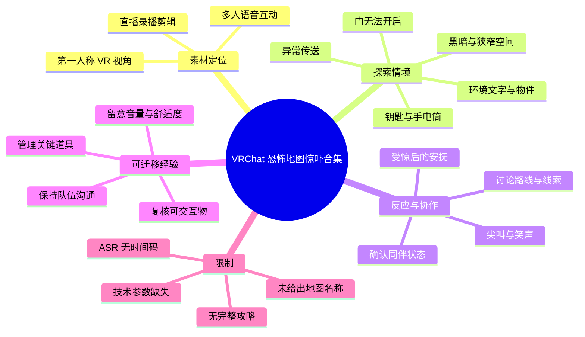
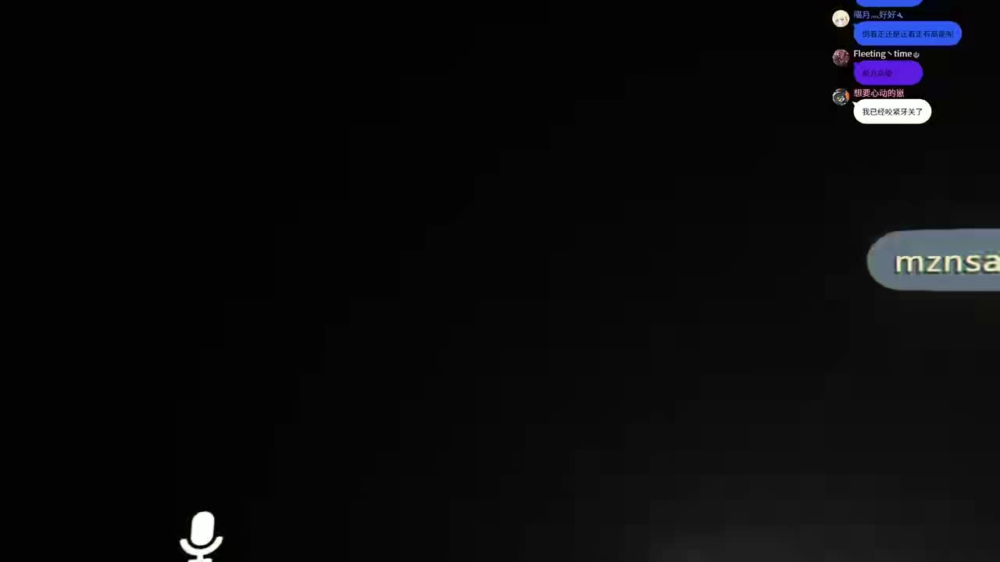
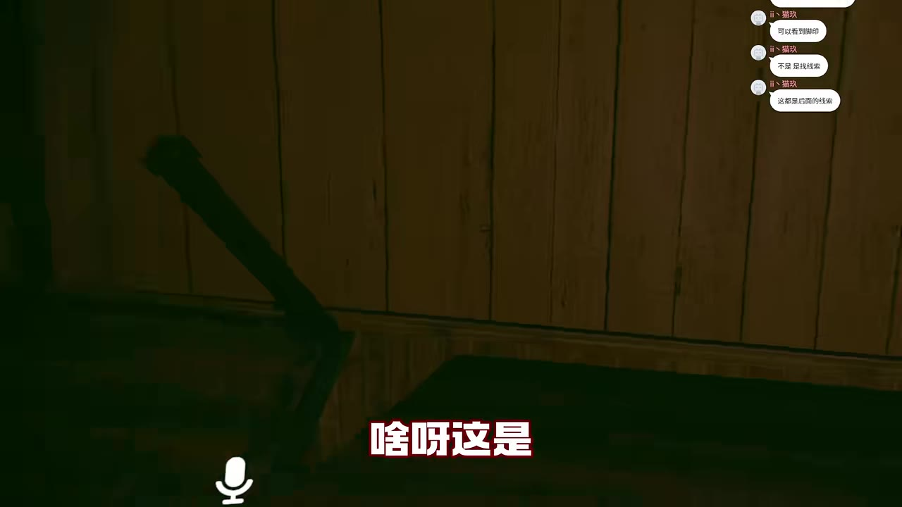
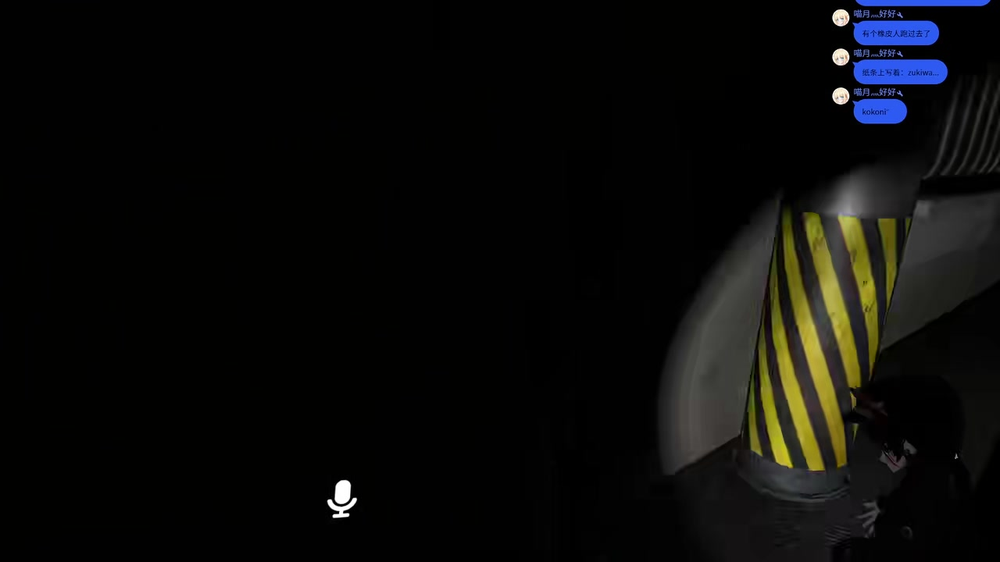
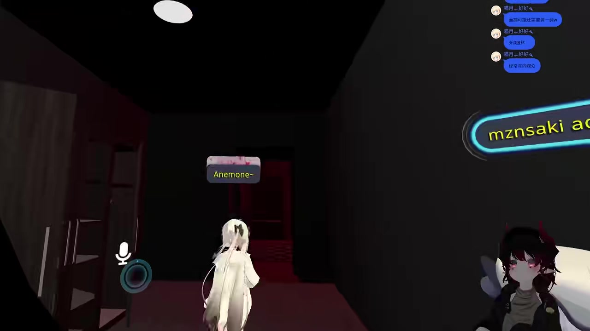

# 【VRchat恐怖地图】VR视角【惊吓合集】

> 来源：[Bilibili 视频](https://www.bilibili.com/video/BV1Fu411T7Gm)  
> UP 主：阿卡伊Akai｜发布时间：2023-10-16｜时长：04:20｜分辨率：1920×1080  
> 视频说明：素材来自自 2023 年 1 月 4 日开始的直播录播，剪入与朋友游玩 VRChat 恐怖地图时的惊吓反应。直播地址与固定直播安排见原视频简介；该安排属于发布时信息，现状需以 UP 主后续公告为准。

## 小结

这是一支以第一人称 VR 视角呈现的 VRChat 恐怖地图惊吓合集。视频重点不在介绍某一张地图的完整通关流程、名称或机制，而是截取多人探索时遇到门锁、黑暗空间、可疑环境物件、狭窄通道与突发惊吓的即时反应。

从本次 ASR 可确认，参与者在流程中至少经历了“门打不开”“被传送”“黑洞/黑暗区域”“报纸文字异常”“拿镜子”“寻找钥匙”“手电筒遗失或是否保留”等情境。多人语音的作用不仅是提供陪伴，也构成了判断环境、确认同伴位置和在受惊后缓冲情绪的协作方式。

视频可提炼的游玩经验是：恐怖地图中应优先确认队伍是否仍在同一空间、门或机关是否可交互、关键道具是否带齐；遇到异常传送、坠落或黑屏时，不宜立即把模糊视野中的内容当成明确线索。视频中的真实体验以尖叫、笑声和短促对话为主，许多语句缺少上下文，不能据此还原完整谜题解法。

对于想观看 VRChat 恐怖地图氛围、评估自己是否适合佩戴耳机观看，或准备与朋友组队游玩的观众，本片有参考价值；但它不适合作为具体地图攻略。素材未给出地图名称、版本、房间设置、VR 设备型号、操作按键、玩家人数上限或地图作者信息，因此这些技术参数均不能补充推定。

视频发布于 2023 年，且剪辑源自更早开始的直播录播。VRChat 世界内容、互动逻辑、入口可用性及主播直播安排均可能已经变化；本文仅整理提供素材所能验证的内容。

## 思维导图

## 目录

- [视频定位、来源与时效性](#视频定位来源与时效性)
- [探索片段与惊吓线索](#探索片段与惊吓线索)
  - [开场：传送与黑暗空间](#开场传送与黑暗空间)
  - [室内观察：门、报纸与异常感](#室内观察门报纸与异常感)
  - [通道探索：环境压迫与队友协作](#通道探索环境压迫与队友协作)
  - [道具与推进：镜子、钥匙、手电筒](#道具与推进镜子钥匙手电筒)
- [可复用的组队游玩步骤](#可复用的组队游玩步骤)
- [技术信息、参数与限制](#技术信息参数与限制)
- [结论与观看建议](#结论与观看建议)
- [字幕比对](#字幕比对)
- [评论分析](#评论分析)
- [处理记录](#处理记录)

## 视频定位、来源与时效性 [00:00](https://www.bilibili.com/video/BV1Fu411T7Gm?t=0)

视频标题明确标注为“VRchat 恐怖地图”与“VR视角”，标签包括“恐怖游戏、直播录像、惊吓反应、尖叫、恐怖地图、vrchat、虚拟主播”等。结合画面中的 VRChat 名牌、麦克风图标、角色形象和多人语音，可确认这是一段在 VRChat 环境中进行的多人恐怖内容录播剪辑。

本片的叙事单位是“惊吓片段”而非“从进入地图到通关的连续过程”。因此，视频中能看到探索场景、听到零散讨论和受惊反应，但没有提供以下完整信息：

- 恐怖地图的名称、作者、发布时间与当前入口；
- 每段片段之间是否来自同一张地图或同一次游玩；
- 明确的关卡目标、谜题规则、触发条件与结局；
- VR 头显、控制器、追踪方案、电脑配置和画面设置；
- 玩家角色名与现实身份对应关系；
- 每一句对话的精确发生时间。

本次素材仅提供无时间码的 ASR 文本与按序导出的关键帧，无法可靠地把每句台词精确定位到秒。为避免编造，本篇的章节时间轴统一链接至视频起点，并按照 ASR 与关键帧的先后顺序整理内容，而不虚构片段起止秒数。

> 图：画面大部分为黑暗区域，右侧可见对话/名牌元素，左下方可见麦克风图标。它直观说明视频采用多人 VRChat 语音场景，并建立了“低可见度”这一恐怖氛围基础。

## 探索片段与惊吓线索 [00:00](https://www.bilibili.com/video/BV1Fu411T7Gm?t=0)

### 开场：传送与黑暗空间 [00:00](https://www.bilibili.com/video/BV1Fu411T7Gm?t=0)

ASR 的开头先后出现“我被传送了”“No，这个门打不开”“黑洞了”“我这儿黑洞”等表达。可以确认的是，玩家至少遇到了视野或位置状态异常，并尝试处理一扇无法开启的门。

其中“黑洞”是玩家的口语描述，可能指黑暗、画面异常、空间空洞或地图视觉效果；素材未提供足够上下文，不能将其确定为特定游戏机制或程序故障。“我被传送了”同样只能确认位置变化被玩家感知，不能确认是地图的强制传送、房间同步问题，还是剪辑前后造成的语境断裂。

这一段呈现出恐怖地图的典型信息不对称：玩家的视野受限，队友状态可能不一致，而门、走廊或光照效果又会进一步提高不确定性。此时语音中出现的短促问答和尖叫，本质上是在快速确认“谁在何处”“当前是否能继续”的状态。

### 室内观察：门、报纸与异常感 [00:00](https://www.bilibili.com/video/BV1Fu411T7Gm?t=0)

ASR 随后出现“报纸上的字体不太一样，感觉像是”“注意一下啊，真的”“前面是不是有什么”“什么声”“啥呀”等内容。它们表明玩家会观察环境文本，并对前方声音、视觉对象或潜在触发物保持警觉。

> 图：画面展示昏暗的木质墙面、室内家具轮廓和“啥呀这是”的画面字幕。它为 ASR 中围绕环境物件的困惑提供了视觉语境：玩家并非处于普通明亮房间，而是在信息有限、光线压低的室内区域探索。

需要注意，“报纸上的字体不太一样”只是对环境文本的即时观察，并不能证明报纸一定是解谜核心。恐怖地图常利用文字差异制造不安或误导；在没有地图原始设计说明、连续画面或交互结果的情况下，合理做法是将其记为“待核验线索”，而不是确定攻略步骤。

ASR 中还有“你现在能回头吗”“摸一下”“这是……啥啊？”等片段。这些话反映出玩家可能在尝试通过转身、靠近或触碰来确认对象，但“摸一下”对应的是哪一个物体、是否成功触发互动，均无法由给定素材确认。

### 通道探索：环境压迫与队友协作 [00:00](https://www.bilibili.com/video/BV1Fu411T7Gm?t=0)

视频中段的 ASR 有“太恐怖了吧”“我掉下来到底了”“为什么你们不会出发吗”“可是只有我被吓”“有没有可能只吓你一个”“感觉已经走边上了”“oh my god”等反应。可以看出，不同玩家的进度、视觉触发或受惊程度可能并不完全相同。

“只有我被吓”与“有没有可能只吓你一个”的对话尤其说明：在多人恐怖体验里，恐怖事件未必会被所有成员同步看到或同样感知。可能原因包括站位、视角方向、触发范围或片段剪辑，但视频没有提供足以判定原因的证据。因此，不能断言地图采用了“单人定向惊吓”机制，只能记录为一次玩家主观体验与同伴回应。

> 图：画面中可见低照度的狭窄空间、弧形结构和黄黑警示条纹。该帧展示了恐怖氛围并非只依赖怪物画面，也由受限视野、工业感警示色和不明前路共同构成。

> 图：画面中可见多名角色、悬浮名牌和麦克风图标。它说明视频并非单人游玩，队友的可见位置、语音反馈与同行关系是理解“谁被吓到”“前方是否能走”等对话的重要背景。

从可见画面和 ASR 可归纳出一条经验：多人恐怖地图的沟通不能只停留在“害怕”或“有东西”，应尽可能补足方向、距离、道具和个人状态，例如“我被传送/掉下去了”“我这里门打不开”“前面有声音”“我在边上”。不过，这是一项从片段中抽取的通用协作建议，并非视频明确教授的标准流程。

### 道具与推进：镜子、钥匙、手电筒 [00:00](https://www.bilibili.com/video/BV1Fu411T7Gm?t=0)

后段 ASR 出现“拿个镜子”“这个呀”“钥匙”“在这啊”“你的手电筒不要了”“前面什么情况”“前面出去了吗”等内容。这能确认视频语境中至少提及镜子、钥匙和手电筒三类物件或道具。

可做出的稳妥整理如下：

1. **镜子**：有人提出“拿个镜子”，但素材没有说明镜子是否是背包物品、环境物件、解谜工具，还是用于观察身后的临时建议。
2. **钥匙**：有人说“钥匙”“在这啊”，说明队伍正在寻找、发现或确认钥匙的位置；但钥匙对应的门、获取方式与是否成功使用都未被完整呈现。
3. **手电筒**：有人提醒“你的手电筒不要了”，表明手电筒在该情境中被视为值得保留或可能遗漏的物品。低照度画面也能支持照明对探索的重要性，但不能证明该手电筒具有无限电量、固定刷新点或必需的解谜功能。
4. **出口判断**：关于“前面出去了吗”的提问显示玩家正尝试判断路线是否通向下一空间或出口；没有后续画面可验证答案。

这些片段的重点在于“物件—路径—同伴信息”的联动：发现物品后需告知队友位置，并在继续前确认是否有人遗落关键物品。但视频并未给出可复现的完整解谜序列，不能将上述道具排列成确定攻略。

## 可复用的组队游玩步骤 [00:00](https://www.bilibili.com/video/BV1Fu411T7Gm?t=0)

以下为基于视频中实际出现的门、黑暗、传送、坠落、钥匙与手电筒情境整理出的组队检查流程。它是对片段经验的归纳，不是原视频明示的地图通关教程。

1. **进入新区域后先确认成员状态。**  
   若有人说“被传送了”“掉下来了”或处于黑暗区域，先确认该成员是否仍在同一房间、是否需要原路返回或重新会合。不要仅因少数人能继续前进，就默认全员状态一致。

2. **面对无法开启的门时，记录而非重复无效操作。**  
   视频中出现“这个门打不开”。可先向队友说明门的位置和方向，再转而搜索附近环境物件、文字提示或其他通路。素材没有证明反复尝试同一扇门能解决问题。

3. **在低光环境中保持照明道具与队伍间距。**  
   手电筒被特别提及，说明照明物品值得注意。建议由持有照明的一方告知位置，并避免在黑暗、通道或转角处让成员过度分散。该建议对应视频的视觉条件，不等同于地图强制规则。

4. **对异常文字、声音和物件进行交叉确认。**  
   “报纸上的字体不太一样”“前面是不是有什么”“什么声”等台词说明环境观察是体验的一部分。若发现疑点，可由另一名玩家从不同角度复核；在无法确认前，应把它视为线索候选，而非既定答案。

5. **找到疑似关键道具后明确报点。**  
   “钥匙在这啊”展示了简短报点的价值。有效表达至少应包含物品名称与大致位置；如果道具被拿走，也应同步说明由谁携带。视频没有提供具体地图坐标，因此不能给出固定位置。

6. **突发惊吓后先稳定沟通，再决定推进。**  
   视频反复出现尖叫、笑声以及“你还好吗”“摸摸”等安抚性交流。对于容易受惊的成员，先确认其是否愿意继续、是否需降低音量或短暂停顿，比催促前进更合适。

7. **不要把剪辑片段当作完整风险提示。**  
   合集着重保留高反应时刻，无法反映整张地图的平均节奏、所有惊吓点或完整游玩时长。初次游玩应保留心理准备，且避免依赖本片预判具体触发位置。

## 技术信息、参数与限制 [00:00](https://www.bilibili.com/video/BV1Fu411T7Gm?t=0)

### 可验证的技术与素材信息

| 项目 | 可确认内容 |
| --- | --- |
| 平台与环境 | Bilibili 视频；画面与标签表明内容为 VRChat 恐怖地图游玩。 |
| 观看时长 | 260 秒，即 04:20。 |
| 画面规格 | 1920×1080，横向画面。 |
| 视角 | 标题标注“VR视角”；画面可见 VRChat 的多人语音与角色名牌元素。 |
| 音频内容 | 多人中文对话为主，夹杂 “Hello”“OK”“oh my god”“OMG”等短语，以及大量尖叫、笑声和语气词。 |
| 内容来源 | 原视频简介称其为自 2023 年 1 月 4 日开始的录播中剪出的朋友惊吓反应。 |
| 发布时统计快照 | 采集元数据记录为播放 2405、点赞 38、收藏 28、投币 10、分享 17、弹幕 1、回复 11；该数据会随时间变化。 |

### 未提供或不可据此推断的参数

下列信息在素材中没有明确给出，不能补全：

- VRChat 恐怖地图名称、世界链接、作者和版本号；
- 所使用的 VR 头显、控制器、追踪器或桌面模式情况；
- 帧率、码率、渲染分辨率、网络延迟及硬件配置；
- 房间人数、权限设置、玩家模型性能等级；
- 手电筒、镜子和钥匙的交互按键、刷新机制、是否为必要道具；
- “黑洞”“传送”“坠落”是否属于设计机关、同步异常或玩家表述；
- 各惊吓点的精确秒数及完整触发条件。

## 结论与观看建议 [00:00](https://www.bilibili.com/video/BV1Fu411T7Gm?t=0)

这支合集的核心价值是呈现 VRChat 多人恐怖体验中的临场感：黑暗视野、未知通道、声音线索、环境文字与队友反应共同放大了惊吓效果。相较于单纯观看怪物或跳脸画面，片中更突出的内容是玩家在不确定条件下不断确认门、路径、道具和同伴状态的过程。

可迁移的经验包括：在多人房间中维持报点；遇到传送、掉落或门锁时先同步状态；对钥匙、手电筒等被明确提及的物品进行携带确认；对环境中的异常文字和声音保留观察，但不在证据不足时过度解读。

观看与游玩时还应考虑舒适度。视频存在突然的高音量尖叫和惊吓反应；热评中亦有观众反馈耳机观看带来明显听觉不适。该反馈属于个人感受而非医学结论，但对音量敏感者而言，降低初始音量、避免独自深夜观看或在感到不适时停止，都是合理的风险控制方式。

由于地图信息、设备参数、完整流程和精确时间码均缺失，本文不能提供地图下载、通关、故障排除或硬件设置方面的确定答案。若要实际游玩，应以 VRChat 世界页面、地图作者说明和当前房间规则为准。

## 字幕比对 [00:00](https://www.bilibili.com/video/BV1Fu411T7Gm?t=0)

本次任务已执行 ASR。站内字幕未提供可用文件，因此无法进行逐句对照或以其校正 ASR。

| 字幕来源 | 完整性 | 专有名词 | 时间轴 | 主要问题 |
| --- | --- | --- | --- | --- |
| Bilibili 站内字幕 | 未提供可用站内字幕 | 无法评估 | 无法评估 | 没有可用文本，不能用于转写校对。 |
| 本次 ASR 字幕 | 可覆盖大量口语、感叹和部分道具词，但明显不是完整逐字稿 | 对 VRChat 名牌、昵称及部分词汇识别有限 | 未提供词句级时间码 | 多人重叠说话、尖叫、笑声与恐怖环境音造成错听；存在“黑洝洞”“火是月”“为什么榴梿没有过来”“我没再拍”等语义不稳定片段。 |

### 最终字幕选择与校正原则

最终采用**本次 ASR 作为唯一可用文本来源**，但不将其视作逐字准确字幕。整理时遵循以下原则：

- 对“门打不开”“被传送”“报纸上的字体不太一样”“拿个镜子”“钥匙”“手电筒”等语义较清楚、且能与画面氛围相互支持的内容，作为可引用的片段事实。
- 对“黑洞”保留玩家原始口语含义，不扩展解释为特定机制。
- 对“火是月”“为什么榴梿没有过来”“我没在拍/我没再拍了”等缺乏上下文、语义不稳定的识别结果，不纳入事实性结论。
- 关键帧可校正的内容仅限于场景类型：例如黑暗环境、木质室内、警示条纹通道、多人角色与名牌；关键帧未能提供地图名、角色完整昵称或道具功能，故不强行补写。
- ASR 没有时间码，不能把每一句话映射为精确的 Bilibili 秒数；本文时间轴链接仅用于回到视频，不代表逐句定位。

## 评论分析 [00:00](https://www.bilibili.com/video/BV1Fu411T7Gm?t=0)

任务要求最多处理可获取热评前三条。本次素材中实际获取到 **2 条**热评，未提供第 3 条，因此不补造第三条。

1. **污妖王手下的大巫妖**（获赞 1）  
   评论：“想和别人一起玩恐怖地图，自己一个人不敢玩[笑哭]”  
   观点是倾向于多人结伴体验恐怖地图，独自游玩会产生畏惧感。该观点与视频的多人互动形式相呼应：队友的声音和同行确实构成体验的一部分。但这是观众偏好，不代表多人游玩一定能降低所有人的恐惧，也不能证明视频中地图必须多人才能进行。

2. **秋涵江月**（获赞 1）  
   评论：“我错了我不应该带着耳机看的，我感觉我的听力已经不太想了”  
   评论表达了因佩戴耳机观看尖叫、惊吓内容而产生的听觉不适或夸张式抱怨。它补充说明视频的声音刺激可能较强，和 ASR 中密集的“啊”“OMG”“好惊悚啊”等反应相符。不过该评论是主观感受，不能据此判断实际音量数值、音频动态范围或听力损伤风险。

两条评论均没有提供地图名称、攻略、设备配置或未公开事实，因此不作为视频事实的证据来源。

## 处理记录

- Worker ID：`worker-mri3sp0r-0d15ab26`
- 模型：`gpt-5.6-terra`
- 调用工具与素材产物：已提供的视频合并文件 `merged.mp4`、音频 `audio/audio.wav`、关键帧目录 `frames/`、视频信息 `info.json`、评论文件 `comments/comments.json`、字幕目录 `subtitles/` 与 ASR 目录 `asr/` 的任务产物信息；本篇依据提供的元数据、ASR 文本、热评和关键帧进行整理。
- 字幕选择：站内字幕未提供可用文本；本次 ASR 已执行并作为唯一可用字幕来源。对语义明确部分采用，对多人重叠、尖叫和疑似错识别内容保守处理。
- 关键帧选择依据：选用 `frame-001.jpg` 展示黑暗与语音界面，`frame-002.jpg` 展示木质室内探索语境，`frame-003.jpg` 展示警示条纹通道与低照度压迫感，`frame-004.jpg` 展示多人角色、名牌和协作关系。未将关键帧未能证明的信息写为事实。
- 时间轴依据：视频总时长为 260 秒，但 ASR 未附逐句时间码、关键帧也未附对应秒数；因此未虚构片段秒点，章节统一提供视频起点时间轴链接，并在正文中按素材顺序说明。
- 评论处理范围：仅处理可获取热评的前 3 条；实际仅获得 2 条，已完整列出。
- 缓存清理：提供素材中未包含缓存清理执行结果，无法确认是否已清理，故不作“已清理”声明。
- 未解决问题：地图名称与版本、完整关卡流程、道具功能、设备参数、各片段精确时间码、ASR 中若干疑似错听语句均无法从当前素材可靠确认。
