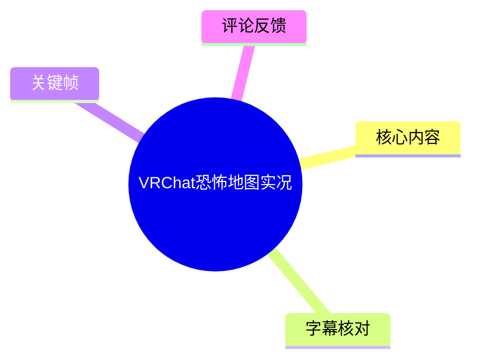
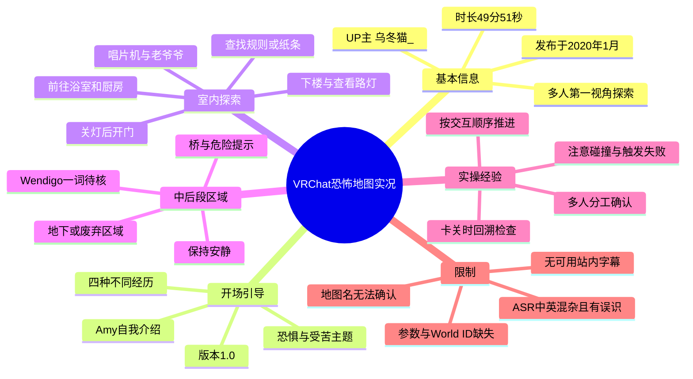
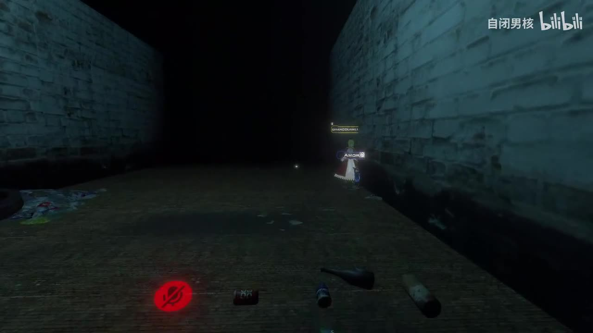
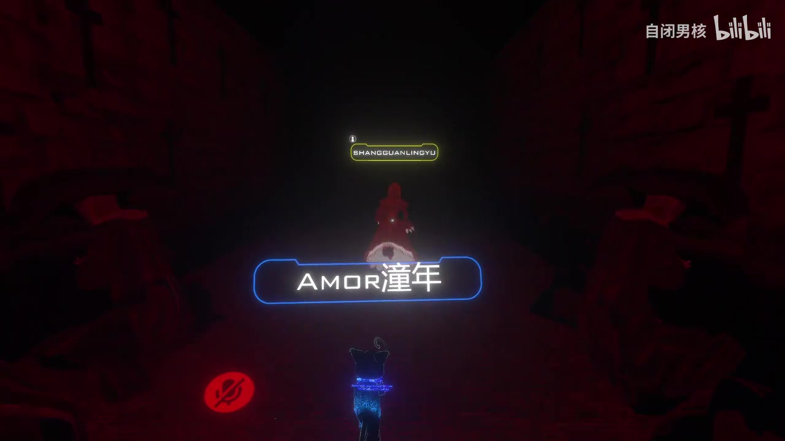
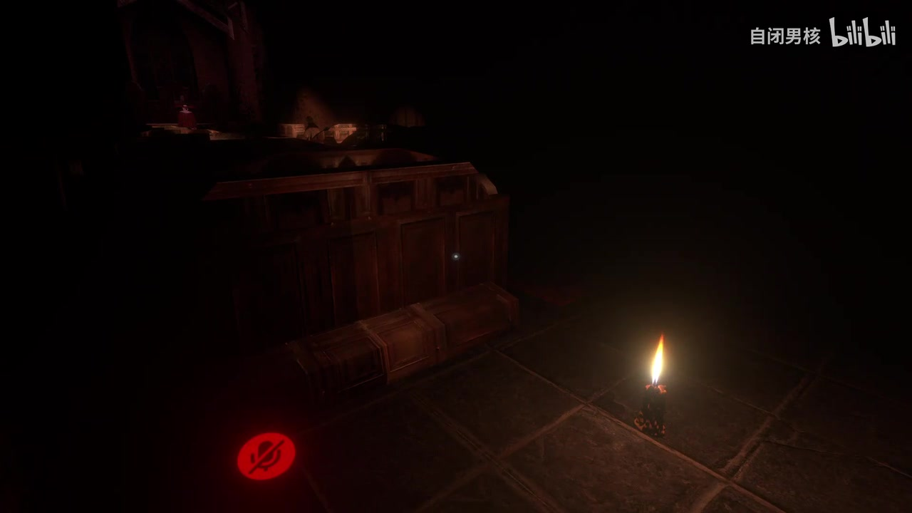
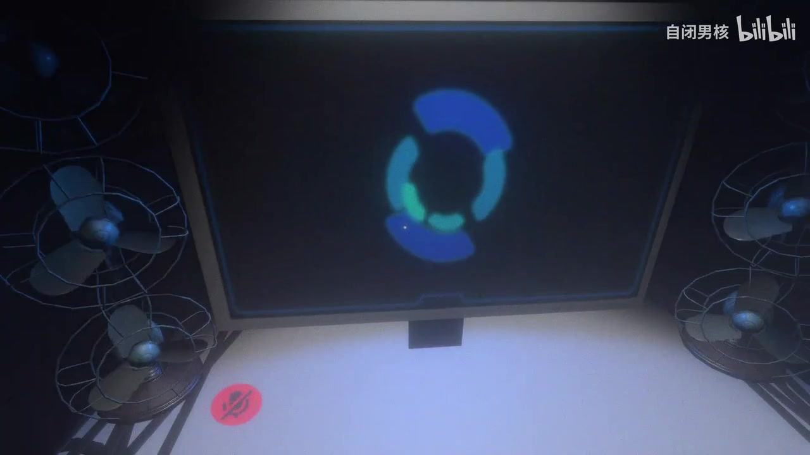

# VRChat恐怖地图实况

> 来源：[Bilibili 视频](https://www.bilibili.com/video/BV1AJ411E71u) 
> UP 主：乌冬猫_ ｜发布时间：2020-01-16 22:21:41（UTC+8）｜时长：49:51 
> 标签：VRChat、VR 游戏、第一视角、虚拟现实、STEAM、萌新、日常

## 小结

本视频是一次约 49 分 51 秒的《VRChat》恐怖地图多人实况。开头先播放了地图的英文引导：引导语自称由 “Amy” 介绍、标注“版本 1.0”，称体验将通过“四种不同的经历”呈现恐惧，并直接表达“希望你害怕”“希望你受苦”等恐怖主题。由于 ASR 对英语与专有名词识别误差较大，地图的完整名称、作者及具体机制不能据此确认。

实况主体由多名玩家共同探索。可辨识的流程包括：在室内查找规则或纸条、遵循指定顺序互动、关灯后开门、下楼、查看路灯与“老爷爷”、操作唱片机、前往浴室与厨房等。玩家反复讨论“先后顺序”，说明地图至少部分进度由事件触发或交互顺序控制，而非单纯自由漫游。

中后段场景转入更阴暗的地下或废弃区域。玩家听到与桥、危险区域、保持安静、不要离开等有关的引导文本；ASR 还识别到 “Wendigo” 一词，但其是否为地图中怪物的准确名称、是否对应实际剧情设定，均无法仅凭当前文本验证。实况中出现卡在楼梯、物件未点到、换模型、等待好友进入等情况，反映出 VRChat 地图在多人同步、碰撞和交互判定上的实际使用摩擦。

对想游玩恐怖地图的 VRChat 玩家而言，本视频的价值不在于提供完整攻略，而在于展示多人协作时的沟通模式：明确谁操作、确认已经触发的对象、按顺序回溯检查，以及在卡住或触发失败时让同伴协助验证。视频没有公开地图名、World ID、推荐人数、平台兼容性、亮度设置或具体客户端参数，因此不能直接作为复现指南。

视频发布于 2020 年 1 月，距素材抓取时间已较久。VRChat 客户端、世界内容、交互逻辑、世界可访问性及玩家模型兼容性均可能已经改变；评论区持续有人询问地图名，也侧面说明视频自身没有清晰提供可检索的世界标识。

## 思维导图

## 目录

- [视频背景与素材边界](#视频背景与素材边界)
- [开场：恐怖体验的引导语](#开场恐怖体验的引导语)
- [室内阶段：规则、灯光与顺序触发](#室内阶段规则灯光与顺序触发)
- [协作探索：路灯、唱片机与场景推进](#协作探索路灯唱片机与场景推进)
- [中后段：危险区域与地下探索](#中后段危险区域与地下探索)
- [可迁移的游玩步骤与经验](#可迁移的游玩步骤与经验)
- [技术与信息边界](#技术与信息边界)
- [关键帧索引](#关键帧索引)
- [字幕比对](#字幕比对)
- [评论分析](#评论分析)
- [处理记录](#处理记录)

## 视频背景与素材边界 [00:00](https://www.bilibili.com/video/BV1AJ411E71u?t=0)

视频标题为“VRChat恐怖地图实况”，属于收藏夹“vrchat地图”。画面分辨率为 1920×1080，单 P，时长 2991 秒。视频没有简介文字，元数据中也没有地图名称、World ID、房间链接或作者署名。

这是多人恐怖地图实况而非教学视频：玩家在探索过程中实时讨论操作，并存在惊吓、迷路、互动失败、卡住与等待好友等内容。因此，下文的“步骤”是根据实况中反复出现的操作顺序整理出的**观察性流程**，不等同于已验证的完整通关攻略。

时间轴依据 ASR 文本的先后顺序与关键帧的场景变化划分。原始 ASR 未提供逐句时间戳，故除视频总时长外，各段起止点均为便于回看的近似定位，不应视为精确事件帧。

## 开场：恐怖体验的引导语 [00:00](https://www.bilibili.com/video/BV1AJ411E71u?t=0)

开头存在一段以英语为主、夹杂中文识别结果的引导语。ASR 可辨识出以下信息：

1. 引导者称“我的名字是 Amy”。
2. 画面或语音中出现“版本 1.0”。
3. 引导语称玩家将通过“四种不同的经历”体验恐惧。
4. 出现类似 “We want you to be scared” 与 “We want YOU to suffer” 的句子，即设计目标是令玩家害怕、受压迫。
5. 引导结尾包含“希望你享受这次经历”“祝大家有个恐怖的一天”“晚安”等表述。

其中，ASR 还出现了 “Zero designed by a fish will stay on himself”“根据 WDKS 要求的恐惧”“All of this is designed to be localized”等片段，但语义不通或缺乏上下文，不能作为地图作者、设计者或机制的可靠信息。特别是 “Zero”“fish”“WDKS” 均可能是英语识别错误。

这段引导确认了地图以分阶段恐怖体验为核心，但未能确认四段体验各自的名称、进入条件或结局。

> 图：画面展示低照度砖墙通道与前方同伴的 VRChat 名牌，能直观说明本视频是多人第一视角的黑暗环境探索；画面左下角可见静音图标，也提示语音沟通是实况的重要组成部分。

## 室内阶段：规则、灯光与顺序触发 [08:00](https://www.bilibili.com/video/BV1AJ411E71u?t=480)

ASR 在室内探索部分识别到玩家围绕地点、规则与纸条进行讨论，包括“根据纪录，这应该是正确的地方”“应该有个纸条在哪”“这一定是规则的列表”“我应该去探索一下”等。由此只能确认：玩家正在寻找能够提示流程的场景内文本或物品；纸条的具体内容并未被可靠转写。

随后，队伍开始明确讨论灯光、门和顺序：

- “关掉灯光？”
- “对的，亲爱的。”
- “一定要按照规则。”
- “关了以后就可以开门了。”
- “然后就可以开。”
- “然后去楼下。”

这说明至少有一个门的开启与灯光状态相关，且可能要求在其他交互之后进行。视频没有给出按钮编号、房间布局图、光源的准确位置，也没有确认是“关闭全部灯光”还是“关闭某一盏灯”；因此可复用的结论仅是：**遇到无法开启的门时，应回查场景内的光源开关与规则提示，并严格遵循触发顺序。**

玩家还提到“点不了的啊”“我点的也不……”，反映互动对象可能出现点击未响应、瞄准不准或尚未满足前置条件的状况。不能据此断定是地图 Bug，也可能是操作顺序不正确。

> 图：场景被红色光线覆盖，前方玩家名牌清晰可见。这一帧的价值在于呈现地图以低可见度、色彩压迫和多人相互定位制造紧张感，也契合玩家需要口头确认位置与进度的实况状态。

## 协作探索：路灯、唱片机与场景推进 [18:00](https://www.bilibili.com/video/BV1AJ411E71u?t=1080)

在进一步推进中，玩家围绕数个对象重复确认，能较可靠地梳理出一条实际尝试过的交互链：

1. 先处理灯光相关交互并开门。
2. 前往楼下。
3. 查看“老爷爷”或老年男性形象。
4. 外出查看路灯。
5. 操作唱片机。
6. 再次查看“老爷爷”。
7. 前往浴室；后续讨论还指向厨房。

原始语音中存在多次互相修正，例如“点完唱片机是不是出去看一下那个啥”“回去看一下那路灯”“看完路灯之后再点唱片机吧”“点一下唱片机然后再看老爷爷”。这表明玩家并非一开始就掌握固定答案，而是在观察事件是否变化的过程中试错。

### 已出现的操作问题

- **楼梯卡住**：一名玩家说“楼梯我现在下不去”“我卡着了”，后续有同伴协助或等待其脱离。
- **对象未正确触发**：出现“那个照片我是不是没点上”等反馈，说明某些交互物需要再次确认。
- **视野不足**：玩家说“我看不清”，与地图低照明设计一致。
- **模型切换**：出现“等我换下模型”，但未说明换模型是为解决碰撞、视野还是纯粹个人操作，不能进一步推断。

在此类地图中，最有价值的协作方式是让一人执行操作、另一人观察环境变化并复述结果，避免多人同时点击导致难以判断是哪一个动作触发了事件。该建议来自视频中玩家不断核对“先看什么、再点什么”的行为模式，不是地图作者明确公布的规则。

> 图：木质家具与地面大多沉入阴影，右侧蜡烛提供局部照明。该帧直接说明“看不清”并非单纯录制问题，而是地图恐怖氛围与探索难度的重要组成；也有助于理解评论区为何会询问照明方法。

## 中后段：危险区域与地下探索 [31:00](https://www.bilibili.com/video/BV1AJ411E71u?t=1860)

中后段的 ASR 出现与危险区域有关的剧情或广播式提示，能辨识的内容包括：

- “听到我，在危险的位置，离开桥上。”
- “我们必须离开这里，现在。”
- “这地方是对公众有限的。”
- “你可能会被杀死。”
- “我们在地下……的地方。”
- “保持安静。”
- “我们会保护你们。”

ASR 还将某类事物识别为 “Wendigo”，并出现“那些东西是……我们叫 Wendigo”一类句子。由于音频混杂、语句不完整且未提供站内字幕，本文仅记录“ASR 曾识别到这一词汇”，不将其当作怪物名称或世界观设定的定论。

此阶段仍有玩家层面的实时反应，例如“啊啊啊”“哈哈哈哈”“我估计我那好友……进来，然后会被那个刚进来的彩蛋吓一跳”。这说明地图包含突发惊吓或彩蛋式事件，但无法由素材可靠确定其触发位置、触发条件及具体画面。

后段可以听到“去看小孩”“马上就通过了，再坚持一下”“Good morning”“你就是我们一直在寻找的那种人”“做得好”等台词。这些可能意味着探索临近某一阶段结束，或者触发了对玩家行为的评价；但由于缺失精确字幕与画面上下文，不能断言为正式通关结局。

> 图：蓝色环形图案出现在屏幕中央，周围排列多台风扇，与前段昏暗住宅或地下通道形成明显视觉反差。这一帧有助于说明视频并非只有单一房屋场景，而是存在风格变化的房间或事件空间；屏幕图案的具体功能未由素材确认。

## 可迁移的游玩步骤与经验 [10:00](https://www.bilibili.com/video/BV1AJ411E71u?t=600)

以下是从实况中抽取的多人探索工作流，不保证适用于其他 VRChat 恐怖世界：

### 1. 先寻找规则、纸条与可读文本

玩家将纸条或规则列表视为推进依据。进入新房间后，可优先检查：

- 门边、桌面、墙面与显眼摆件；
- 是否存在可点击的照片、按钮、唱片机或开关；
- 规则是否要求特定先后顺序；
- 某个物件互动后，照明、门、音效或角色是否发生变化。

视频未提供规则原文，不能补写其内容。

### 2. 将“照明—门—楼层”视为一组状态变化

实况中明确出现“关灯后可以开门”“然后去楼下”的操作关系。若遇到无法推进的门：

1. 确认此前是否漏掉灯光开关；
2. 确认是否需要先阅读提示或触发其他物件；
3. 关闭或切换后再次尝试开门；
4. 成功后再进入下一层或下一房间；
5. 不要在未确认前置条件时直接将无响应判为 Bug。

### 3. 对事件对象逐一验证，不要多人并发乱点

“路灯—唱片机—老爷爷—浴室—厨房”是视频中被反复讨论的对象链。实践时可采用记录方式：

| 项目 | 建议记录内容 |
| --- | --- |
| 目标对象 | 例如路灯、唱片机、照片、角色形象 |
| 操作人 | 由一人负责点击或拉动 |
| 操作前状态 | 灯是否亮、门是否开、角色是否出现 |
| 操作后变化 | 音效、画面、门锁、角色位置或新路径 |
| 是否可复现 | 由另一名玩家二次验证 |

这能减少玩家在黑暗环境中因“谁点过、有没有点到”而造成的重复试错。

### 4. 将卡住、模型与好友同步视为现场变量

视频中至少出现楼梯卡住、物件没点上、换模型与好友加入等变量。遇到此类问题可按以下顺序处理：

1. 先确认同伴是否能正常通过，区分个人碰撞问题与全队进度问题；
2. 让未卡住的玩家观察门、事件或路线是否已有变化；
3. 必要时重新靠近交互点，从不同站位尝试；
4. 若仅个别模型受阻，考虑切换模型或重新定位；
5. 对突然加入的好友，先告知当前进度和可能的惊吓事件，避免其误触或错过关键环节。

视频没有展示重进房间、实例设置、权限配置或性能调校，故不应延伸为完整故障排除方案。

## 技术与信息边界 [42:00](https://www.bilibili.com/video/BV1AJ411E71u?t=2520)

### 视频中可以确认的技术信息

| 项目 | 可确认内容 |
| --- | --- |
| 游戏/平台 | 标题与标签表明为 VRChat 内容 |
| 视角 | 第一视角实况 |
| 参与方式 | 至少有多名玩家同时探索并语音沟通 |
| 视频分辨率 | 1920×1080 |
| 视频时长 | 2991 秒，即 49 分 51 秒 |
| 画面特征 | 大量低照度、红光、烛光和黑暗空间 |
| 交互特征 | 灯、门、路灯、唱片机、照片/纸条等对象被讨论或操作 |

### 素材没有提供、不可补全的信息

- 地图完整名称；
- World ID、作者名、上传地址或当前是否仍可访问；
- 地图支持的平台与设备模式；
- 推荐人数、最大人数、房主设置；
- 世界亮度、后处理、手电或其他照明的具体实现；
- 完整谜题规则、怪物 AI、存档方式与通关条件；
- “Amy”“Wendigo”“WDKS”等词汇的准确拼写和设定关系；
- 录制使用的 VR 设备、麦克风、显卡、帧率及客户端版本。

因此，任何关于“该地图叫什么”“怎样永久照亮”“怪物具体机制如何”的回答，都不能从本视频素材中直接得出。

### 时效性

视频发布于 2020 年 1 月。VRChat 世界可能被删除、私有化、迁移、更新或因 SDK/客户端演进而改变表现；即使后续找到同名地图，也不能保证流程、亮度、碰撞和触发逻辑与视频中一致。本文中涉及的操作顺序仅适合回看这段历史实况，不构成当前版本的可执行保证。

## 关键帧索引 [00:00](https://www.bilibili.com/video/BV1AJ411E71u?t=0)

| 关键帧 | 正文用途 | 图片价值 |
| --- | --- | --- |
| `frames/frame-001.jpg` | 多人通道探索 | 展示第一视角、同伴名牌、暗色砖墙环境与语音协作痕迹。 |
| `frames/frame-002.jpg` | 红光压迫场景 | 展示地图使用红色照明强化紧张感，以及多人相互定位的必要性。 |
| `frames/frame-003.jpg` | 烛光室内探索 | 佐证场景可见度极低，可帮助理解玩家反复提及灯光与“看不清”。 |
| `frames/frame-004.jpg` | 异常设备空间 | 展示不同于普通室内的屏幕与风扇布置，提示地图场景存在变化。 |

其余关键帧文件虽在素材目录中列出，但当前可见素材未附带其对应画面与精确时间信息；为避免将未核验画面强行解释，正文未使用。

## 字幕比对 [00:00](https://www.bilibili.com/video/BV1AJ411E71u?t=0)

本次任务已执行 ASR；站内没有提供可用字幕。

| 字幕来源 | 完整性 | 专有名词 | 时间轴 | 主要问题 |
| --- | --- | --- | --- | --- |
| Bilibili 站内字幕 | 无可用内容 | 无法评价 | 无法评价 | 素材明确说明未提供可用站内字幕，无法用于转写核对。 |
| 本次 ASR 字幕 | 覆盖了开场引导、玩家对话与中后段部分台词，但存在明显缺口 | 较弱；“Amy”“Wendigo”等仅能暂记，“WDKS”“Zero”“fish”等不可靠 | 未提供逐句时间戳，仅能依语序进行段落级定位 | 中英混杂、人声重叠、口语与惊叫较多；多处中文语义不通，英语句子也有断裂或误识。 |

### 最终字幕选择

最终采用**本次 ASR 作为唯一可用文字线索**，但不将其视为逐字准确字幕。涉及剧情与专有名词时，遵循以下处理原则：

- 可从上下文和多次重复中确认的操作词，如“关灯”“开门”“楼下”“路灯”“唱片机”“浴室”“厨房”，以“玩家讨论/尝试”方式记录；
- “Amy”“版本 1.0”“四种不同经历”“We want you to be scared”等较完整的开场句子，作为引导语的可辨识内容记录；
- “Wendigo”“WDKS”“Zero designed by a fish”等识别不稳定内容，不作设定事实，只标为 ASR 结果；
- 关键帧可校正的是环境性质：黑暗通道、红色照明、烛光室内、屏幕与风扇空间；关键帧**不能**校正缺失的语音专名或谜题规则。

## 评论分析 [48:00](https://www.bilibili.com/video/BV1AJ411E71u?t=2880)

以下仅处理可获取的热评前三条，不将评论内容当作已验证事实。

1. **悄逝的风**（1 赞，2020-04-03）：  
   评论询问“这个地图的名字是啥呀”。这说明至少对该观众而言，视频标题、简介或画面中没有提供足够明确的地图名称。评论没有给出地图名，因此不能作为检索答案。

2. **水银夜月天境呇云**（0 赞，2020-06-19）：  
   评论询问 UP 主“用什么方法照亮恐怖地图”。这与视频中黑暗场景、蜡烛和玩家“看不清”的对话相互印证，表明照明效果是观众关注点。但评论本身没有答案，也不能证明 UP 使用了手电、客户端调节、模型发光或后期处理中的任何一种方式。

3. **深后玩家**（0 赞，2024-01-23）：  
   评论称“求地图名！我要带别人来点刺激”。该评论表达了希望复玩或带朋友体验的需求，也显示地图名在多年后仍未在评论可见内容中得到解决。它不提供可验证的地图信息。

三条热评的共同主题是**地图名缺失**，其中一条延伸至**照明方式**。目前可获取评论均为提问，未提供答案、攻略或可核验补充材料。

## 评论分析

本次流程未获取到可用热评，因此不推断观众态度或额外结论。

## 处理记录

- Worker ID：`worker-mri24eea-7db640f7`
- 模型：`gpt-5.6-terra`
- 调用工具与素材：基于任务提供的 Bilibili 元数据、已生成的视频/音频素材清单、已执行的 ASR 文本、关键帧目录与可获取热评数据进行整理；未提供可验证的外部检索结果。
- 使用的应用工具：素材读取、元数据解析、ASR 结果读取、关键帧引用、评论数据读取；未执行未经素材证明的地图检索或事实补全。
- 字幕选择：站内字幕无可用内容；本次 ASR 已执行并作为唯一文本依据。对 ASR 中的中英混杂、专名误识和无时间戳问题进行了显式保留。
- 关键帧选择依据：选用 `frame-001` 至 `frame-004`，因为当前可见画面能够分别支撑多人黑暗通道、红色照明、烛光室内和异常设备房间等正文描述；未对未展示内容的其他帧作推测性引用。
- 缓存清理：素材清单未提供缓存清理执行结果；无法确认是否已清理，故不宣称已完成。
- 未解决问题：地图名、World ID、作者、完整谜题规则、照明实现、当前可访问性、ASR 专有名词准确拼写及精确时间戳均未能从给定素材确认。
