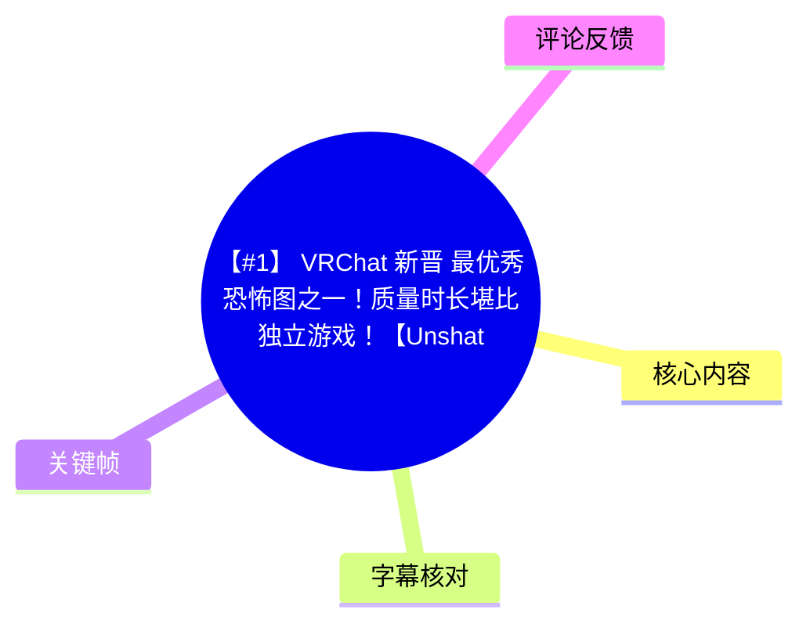
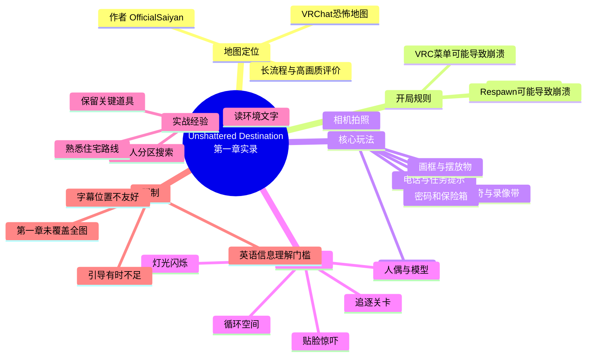
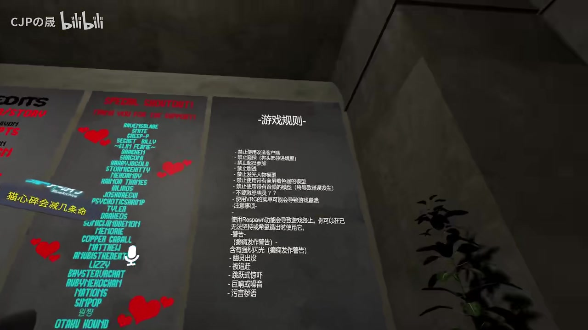
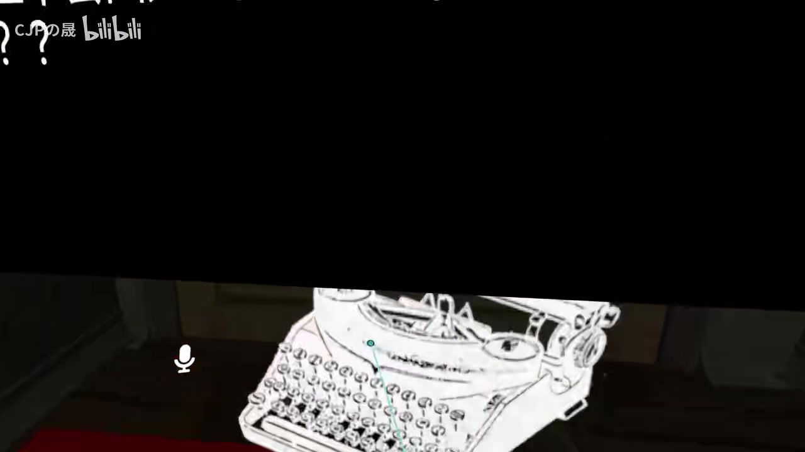
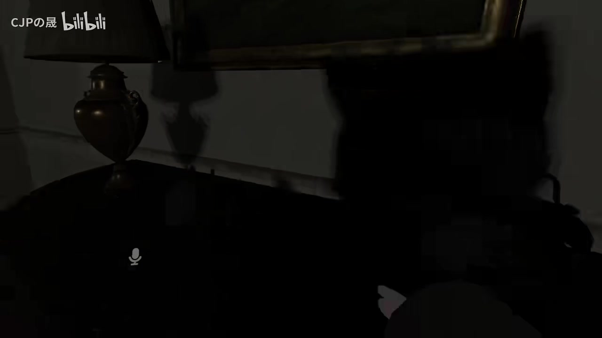
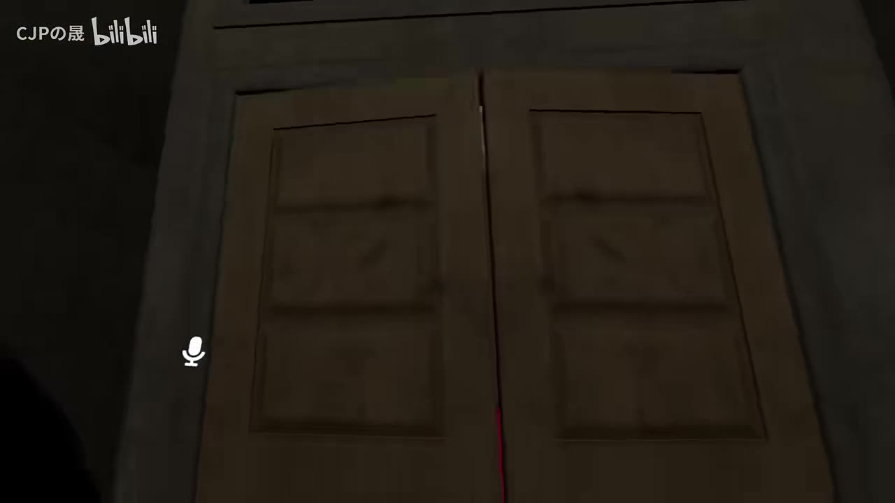

# 【#1】VRChat“新晋”最优秀恐怖图之一：`Unshattered Destination` 全流程实录

> 来源：[Bilibili 视频](https://www.bilibili.com/video/BV1vu4y147Wh)  
> UP 主：CJPの晟｜发布时间：2023-09-30｜视频时长：60:55  
> 地图作者：视频内提及为 `OfficialSaiyan`（字幕转写存在大小写与拼写识别误差，以下沿用视频中较明确的写法）

## 小结

本视频记录多人游玩 VRChat 恐怖地图 **`Unshattered Destination`** 的第一章流程。地图以可交互住宅为主要舞台，结合电话留言、任务文本、收集品、密码、保险箱、画框摆放、循环场景与追逐式惊吓，形成接近独立恐怖游戏的长流程体验。视频标题中的“质量时长堪比独立游戏”属于 UP 主对地图完成度与流程长度的评价。

最重要的实操信息是：这张地图并非单纯依靠贴脸惊吓，而是要求玩家持续阅读环境提示、探索抽屉与房间、收集并摆放关键物品。流程中出现的明确目标包括：拍摄入口/客厅/厨房等区域、寻找录像带与曲奇、取得钥匙与密码、拨打电话、寻找两颗头部、寻找三项与保险箱关联的物品，以及将画放回画框。

地图开局规则明确提示：**不要激怒幽灵**；使用 VRChat 菜单可能导致游戏崩溃；使用 Respawn 功能也可能引起崩溃，若卡死可在菜单中重置退出按钮。视频中的玩家未使用 Respawn，而是依靠游戏内死亡/重生机制推进，因此游玩前应先理解此限制，避免把平台功能误当作普通重开手段。

体验层面的优点包括较高的视觉表现、众多可开启的柜门与房间交互、渐进式恐怖节奏，以及借由循环与追逐引导玩家熟悉空间布局。视频中也提出了实际不足：部分英语剧情与任务说明不易听清；VR 字幕位置偏高，对一体机等设备的视角不够友好；部分阶段缺少足够明确的任务提示，导致队伍需要反复绕图试错。

本视频只完成第一章。UP 主在约 58 分钟处根据外部查询和自身录制时长推测，整张地图流程约为 **1.5 小时**，当前进度可能过半；这只是视频内的即时估计，并非地图作者公布的固定通关时长。视频结束时决定将后续内容拆分为第二条录制。

## 思维导图

## 目录

- [背景、版本时效与游玩前提](#背景版本时效与游玩前提)
- [开局规则与第一轮探索](#开局规则与第一轮探索)
- [第一天：相机、电话与住宅任务](#第一天相机电话与住宅任务)
- [密码、浴室线索与探索推进](#密码浴室线索与探索推进)
- [头部收集、追逐与回拨电话](#头部收集追逐与回拨电话)
- [录像带、花瓶、密室与循环结构](#录像带花瓶密室与循环结构)
- [保险箱、画框与第一章完成](#保险箱画框与第一章完成)
- [可复用的联机解谜步骤](#可复用的联机解谜步骤)
- [技术体验、优点与限制](#技术体验优点与限制)
- [关键帧索引](#关键帧索引)
- [字幕比对](#字幕比对)
- [评论分析](#评论分析)
- [处理记录](#处理记录)

## [背景、版本时效与游玩前提](https://www.bilibili.com/video/BV1vu4y147Wh?t=0)

视频发布于 2023 年 9 月 30 日，简介称该地图为 VRChat 中“新晋”必玩恐怖图之一，并提到作者回归。这里的“新晋”“作者回归”均是**发布时的宣传语境**，不能直接推导为 2026 年仍是最新地图、仍可正常访问，或当前版本内容完全不变。

视频内玩家将地图称为“图”“游戏图”，并在开始不久即感叹其流程长度和画面表现。UP 主认为自己开启高画质后，画面令恐怖感更强；同时评价其画质在 VRChat 中“算是很不错”。这些是游玩者的主观体验，实际性能会受到 PC 配置、VRChat 客户端版本、所用头显、实例人数、图形设置与地图当前版本影响。

前置条件方面，视频展示的是多人联机协作：队员会分头搜索、互相告知物品位置，并在追逐环节提醒彼此位置。因此，单人也许可以游玩，但本视频**没有验证单人流程可行性、难度或机制差异**。

## [开局规则与第一轮探索](https://www.bilibili.com/video/BV1vu4y147Wh?t=20)

进入地图后，墙面展示“游戏规则”。结合画面文字与 ASR，可确认的重点为：

1. **不要激怒幽灵。**
2. 使用 VRChat 菜单可能导致游戏崩溃。
3. 使用 **Respawn** 功能也可能导致游戏崩溃。
4. 若在菜单中遇到卡死情况，规则提示可尝试重置退出按钮；但该句细节受画面分辨率和 ASR 限制，不宜扩展解释。
5. 地图还包含常见恐怖内容警告，如闪烁/快速闪光、尖叫或噪音、污言秽语等；个别条目文字无法稳定辨认。

> 图：开局规则页是理解地图技术限制的关键帧。它直接说明 VRC 菜单与 Respawn 可能造成崩溃，玩家应在进入流程前完成设备与队伍沟通，尽量避免中途调用高风险功能。

玩家注意到入口可交互物很多：行李箱需要带走，房内有电话，多个门和柜子都可打开。队伍随后将行李放到指定位置，画面出现 **“Start Chapter”**，说明此前仍属于序章或准备区，至此才正式开始第一章。

地图采用“住宅日常空间被异常事件侵蚀”的恐怖结构：起初是可探索的房屋、厨房、客厅和卧室，随着任务推进才逐步出现模特、人偶、尸体、闪灯、文本与追逐。此结构使玩家先记忆路线，再在危险阶段利用已有空间认知行动。

## [第一天：相机、电话与住宅任务](https://www.bilibili.com/video/BV1vu4y147Wh?t=260)

第一章以“早上醒来”和接电话展开。玩家取得相机后发现其拍摄画面为黑白风格，并依照任务文本拍摄环境。视频中可辨认的任务包括：

- 拍摄厨房；
- 拍摄客厅（`living room`）；
- 拍摄入口（`entrance`）；
- 完成后返回办公室（`Get back to the office`）。

相机既是任务工具，也承担恐怖氛围营造功能：闪光与黑白成像会强化空间中异常物体的可见性。视频没有明确证明相机能用于驱鬼、阻止追逐或揭示所有隐藏物，不能将其泛化为战斗道具。

此阶段，UP 主提出一个与 VRChat 地图设计有关的观察：不少创作者没有充分考虑字幕在不同头显中的可视性。视频中任务/剧情字幕位置偏高，玩家需“斜着眼看”或抬高视角才能阅读；UP 主指出，使用 HTC 等设备的创作者未必覆盖一体机用户的视野需求。该观点来自实际体验，但没有提供具体设备型号、FOV 参数或开发文档。

> 图：该帧显示昏暗场景中的打字机和屏幕文字，体现地图通过实体布景与文字叙事并行传递线索。对于观看攻略的玩家，重点不只是看突发惊吓，还要留意家具、墙面和可阅读物。

随后任务要求探索房间、吃食物、看电视。队伍开始在抽屉、柜子和房间中寻找 **Cookie（曲奇）** 与录像带。可开启抽屉数量很多，玩家对此感到搜索成本较高；但这也表明互动设计并非只在单一固定点触发。

## [密码、浴室线索与探索推进](https://www.bilibili.com/video/BV1vu4y147Wh?t=850)

随着电视、纸条与异常人偶出现，队伍获得关于密码的提示。玩家尝试解读一段英文，理解为“当你想洗澡时会想到它”之类的指向性线索，于是前往浴室/洗漱区域（ASR 中识别为 `Bus Room`，结合语境应为浴室相关地点）。

在浴室区域，玩家发现数字 **`09 04`**，并将其用作密码推进机关。视频表现为输入密码后门或通路开启，但没有给出可独立复核的完整输入界面和全部前置条件，因此更稳妥的攻略表述是：

- 先从环境文本获取与洗澡/浴室有关的提示；
- 前往浴室区域查看可见数字；
- 该视频中读到的是 `09 04`；
- 将数字用于后续密码交互，成功开启路径。

地图在这一段开始强化“熟悉路线”的目的：地下室、电闸、厨房、卧室和入口不断被重新访问。UP 主将其类比为《生化危机》式的空间设计——让玩家先通过解谜熟悉地图，之后再面临追逐；这是其个人设计解读，而非作者的正式说明。

> 图：暗处的人偶轮廓展示了本作恐怖来源之一：玩家必须在低照度环境下辨认静止或可能移动的物件。它有助于理解为何队伍反复提到灯光、打火机与“模型是否动了”。

视频中还有打火机道具。玩家起初不理解用途，后确认可以通过右手柄的 **A 键**将打火机召唤至面前，无须一直手持。此操作来自视频中玩家的口头交流，适用于其当时的控制器映射；不同手柄或当前地图版本是否一致，未获验证。

## [头部收集、追逐与回拨电话](https://www.bilibili.com/video/BV1vu4y147Wh?t=1500)

异常事件升级后，队伍看到尸体、移动的人偶与文字 **“Find me”**。任务目标转为寻找头部。视频中可辨认的机制说明为：

- 需要在房子里找到 **两颗头部**（`Find both heads throughout the house`）；
- 敌对实体会周期性出现；
- 它在一段时间后会消失并再次出现；
- 玩家会被追逐、贴脸惊吓或击倒，随后通过地图内机制返回。

UP 主在读英文说明时正遭遇惊吓，说明本阶段同时要求信息读取与逃跑反应。实战中，队员一人报告头部位置，其他人迅速汇合；在敌人靠近时则直接喊“run”。这提示多人游玩时应减少冗长描述，采用“位置—物品—状态”格式快速报点，例如“地下室，找到一个头”“我身后有怪，先跑”。

玩家找到两颗头后返回电话推进剧情。视频中有成员被“踢了 5 次”的抱怨，但无法确认这里的“踢”是地图内死亡/传送、VRChat 实例断连还是口语夸张，因此不能据此断定地图存在稳定掉线问题。

## [录像带、花瓶、密室与循环结构](https://www.bilibili.com/video/BV1vu4y147Wh?t=2200)

回到住宅探索后，地图继续通过“看似熟悉但已变化”的环境制造压力。队伍寻找录像带并尝试在电视等位置使用；随后发现花瓶相关互动，并推断要把花放回卧室或指定位置。视频的可确认要点是：

- 录像带是重要任务物品；
- 电视与电话都会作为剧情节点反复出现；
- 花/花瓶的出现与后续摆放有关；
- 住宅内会出现新门、文字、闪烁、头部陈列等环境变化；
- 玩家会多次回到此前走过的区域。

> 图：门与门缝中异常红光是“可回访空间发生变化”的视觉例子。它强调该地图的路线并非一次性线性通道：此前不可用或普通的门，可能在剧情推进后成为新的入口或威胁来源。

在一处密室般的新区域中，玩家看到大量头部，并讨论是否要寻找斧头；但随后流程自行推进，说明“找斧头”是当时的现场推测，**不是已经验证的必要步骤**。这是观看实录攻略时需要区分的信息：玩家的即时猜测可以帮助定位方向，但不能替代最终任务文本或实际通关条件。

地图进入循环段落后，玩家认为有一点《P.T.》式体验：重复经过同一路段，但墙面、吊挂物、门、人物或环境状态会变化。UP 主也认为循环次数尚未多到令人厌烦。这是对节奏的主观评价。

## [保险箱、画框与第一章完成](https://www.bilibili.com/video/BV1vu4y147Wh?t=2850)

后半段再次出现保险箱与密码目标。队伍在住宅中寻找三项物品/线索；视频中一名玩家说“作者说有三个”，之后又称自己“好像找全三个了”。由于物品名称和完整位置未被 ASR 稳定识别，不能伪造为精确收集清单。

可确认的推进关系是：

1. 寻找保险箱相关的三项线索或物品；
2. 打开保险箱；
3. 从保险箱获得一幅画；
4. 将画放到墙上的画框处；
5. 画框完成后，路径继续开放。

这一段的敌人会频繁在背后出现，队伍需要一边找物一边躲避。对于复玩玩家，较稳妥的策略不是盲目全员围着同一抽屉搜索，而是让一人持续确认保险箱/画框状态，其他人分区域排查。

约 57 分钟，玩家在循环区域发现一个可以交互的头部，画面出现 **“Chapter complete”**，确认第一章结束。UP 主称本次录制已约一小时；随后根据查到的“约一个半小时流程”信息估算自己可能已过半，并决定将余下内容拆为第二期。第一章的实际长度因此约为本视频所记录的 1 小时，但包含队伍讨论、搜索停滞和录制交流，并不等于熟练通关所需时间。

## [可复用的联机解谜步骤](https://www.bilibili.com/video/BV1vu4y147Wh?t=330)

以下按视频实际推进逻辑整理，适合作为初次游玩的行动框架，而非保证适用于所有版本的唯一解。

### 1. 开局先读规则，不要用高风险平台功能

- 在规则墙前确认“不要激怒幽灵”及 VRC 菜单、Respawn 可能导致崩溃的警告。
- 不要因死亡、迷路或被惊吓而立刻使用 Respawn。
- 进入章节前确认队友语音正常，避免关键提示出现时无法同步。

### 2. 进入住宅后，优先做任务文本明确要求的事

- 携带/安放开局要求的行李；
- 接电话；
- 取得相机；
- 按任务依次拍摄厨房、客厅、入口；
- 完成后返回办公室。

### 3. 搜索阶段采用分区而非重复翻找

建议按楼层或房间划分，例如：

| 成员职责 | 建议区域 | 重点观察 |
| --- | --- | --- |
| A | 厨房、客厅、入口 | 曲奇、录像带、电视、电话 |
| B | 卧室与走廊 | 画、头部、人偶、墙面文字 |
| C | 地下室、浴室 | 钥匙、数字密码、电闸、隐藏通路 |

视频显示大量柜门可打开，但并非所有抽屉都有物品。每翻完一组柜子，应明确报“该区域已清”，避免队友重复搜索。

### 4. 遇到英文线索时，先识别地点指向

视频中“洗澡”相关文本将队伍引到浴室，并找到 `09 04`。面对类似提示，优先把英文中的地点词转换成房屋区域：

- `living room`：客厅；
- `entrance`：入口；
- 与 shower/bath 语义相关的提示：优先检查浴室/洗漱区域；
- `Get back to the office`：回办公室。

### 5. 道具不明时，检查控制器召唤方式

视频中打火机并非必须持续拿在手里；玩家称可通过**右手柄 A 键**调出。若当前版本同样支持该方式，可以减少手持占用。但应先在安全区域确认，不要在追逐时临时测试按键。

### 6. 追逐时以生存和报点优先

- 听到实体出现、灯光异常或队友报警后，优先撤离；
- 不要停在原地阅读长文本；
- 找到关键物后立刻报出“物品 + 区域”；
- 被追逐时说明“怪在我后面/某区域”，让其他人避免逆向撞上。

### 7. 保险箱与画框阶段检查任务链是否闭合

若已开保险箱却无法继续，应回看是否已经：

- 取出保险箱中的画；
- 把画放在墙上对应画框；
- 等待队友完成交互或靠近触发区；
- 检查此前开放的新门、电话、电视与循环区域。

## [技术体验、优点与限制](https://www.bilibili.com/video/BV1vu4y147Wh?t=440)

### 视频中体现的优点

| 维度 | 视频体现 |
| --- | --- |
| 视觉表现 | UP 主认为高画质下的场景在 VRChat 地图中表现突出，住宅陈设、暗光和模型共同构成压迫感。 |
| 交互密度 | 门、抽屉、行李、相机、电话、电视、打火机、钥匙、录像带、花瓶、保险箱和画框均参与或可能参与交互。 |
| 节奏设计 | 地图先用探索和任务建立空间认知，再加入闪烁、文本、人偶、循环和追逐。 |
| 多人氛围 | 队友的协作、惊叫、报点和判断失误增强了实录可看性，也降低了单独解谜的沉闷感。 |
| 流程规模 | 第一章本身录制约一小时，UP 主据此认为整体流程较长。 |

### 明确限制与风险

| 限制 | 影响 | 应对方式 |
| --- | --- | --- |
| 使用 VRC 菜单或 Respawn 可能崩溃 | 可能中断地图流程 | 开局先阅读规则；非必要不使用相关功能。 |
| 字幕/任务文字位置偏高 | 一体机或特定头显用户阅读不便 | 调整视角、适度提高显示清晰度；队友之间口头复述任务。 |
| 英语剧情理解门槛 | 容易错过地点、密码与任务目标 | 让一人专门负责读文本；优先提取地点、数字、动作词。 |
| 任务提示不总是充分 | 容易在旧区域反复绕路 | 记录已完成目标，按区域搜索，关注环境新变化。 |
| 恐怖内容 | 包含突然贴脸、追逐、闪烁、怪异人偶和压抑暗景 | 对此敏感者降低音量、与熟人组队、预留退出空间。 |
| 版本时效 | 视频是 2023 年实录，地图内容和 VRC SDK/平台行为可能变化 | 以地图当前规则页、更新说明和实际实例表现为准。 |

## [关键帧索引](https://www.bilibili.com/video/BV1vu4y147Wh?t=20)

本记录选用的关键帧以“能够证明机制、环境或风险提示”为优先标准，而非仅选取惊吓画面。

| 文件 | 正文位置 | 信息价值 |
| --- | --- | --- |
| `frames/frame-001.jpg` | 录像带、花瓶、密室与循环结构 | 展示门缝中的异常红光，说明同一住宅空间会随流程发生状态变化。 |
| `frames/frame-002.jpg` | 开局规则与第一轮探索 | 保留地图开局规则页，是 VRC 菜单/Respawn 风险说明的直接视觉依据。 |
| `frames/frame-003.jpg` | 第一日任务 | 打字机与文字交互画面，说明环境文字是获取线索的重要渠道。 |
| `frames/frame-004.jpg` | 密码与探索推进 | 呈现暗处人偶/模型的压迫感，关联低照度辨物、异常模型和恐怖氛围。 |

未使用其余关键帧：已提供文件路径但没有对应画面内容描述，无法在不臆测其视觉信息的前提下为其撰写准确图注。

## [字幕比对](https://www.bilibili.com/video/BV1vu4y147Wh?t=0)

本次任务中，**站内字幕与 ASR 均已执行并可获取**，但二者内容质量差异显著。

| 字幕来源 | 完整性 | 专有名词 | 时间轴/内容对应性 | 主要问题 |
| --- | --- | --- | --- | --- |
| Bilibili 站内字幕 | 对本视频无效 | 出现“小米 SU7”“南京大学”等与视频主题无关内容 | 与实际 VRChat 恐怖地图画面完全不对应 | 明显串入另一条试驾/日常视频字幕，不能作为本视频事实依据。 |
| 本次 ASR 字幕 | 覆盖了开局、探索、解谜、追逐和章节结束的大部分对话 | `OfficialSaiyan`、`Respawn`、`living room`、`entrance` 等存在识别不稳定 | 内容与地图实录、规则画面及章节完成语境相符 | 中英混杂、口语重叠、惊吓时喊叫遮挡、部分英文和房间名误识别。 |

### 最终字幕选择

正文以**本次 ASR 字幕为主**，并使用关键帧中可见的规则文字、任务文本与上下文进行有限校正；站内字幕因内容与本视频完全不符而不采用。

### 重要校正与保留原则

- `OfficialSaiyan`：ASR 出现近似转写，视频中玩家明确称其为作者名字；保留为 `OfficialSaiyan`，但不据此延伸作者身份信息。
- `living room`：结合玩家随后的中文讨论，校正为“客厅”。
- `entrance`：结合任务语境，校正为“入口”。
- `Bus Room`：ASR 结果不可靠；基于“洗澡”“洗漱”语境，在正文中仅写作“浴室/洗漱区域”，不强行确认英文原词。
- `09 04`：ASR 清晰识别为数字，正文保留其原样，但不补写未出现的密码面板逻辑。
- “作者说有三个”：为玩家即时对话，未见作者原文或规则截图，正文只描述为视频中的队员判断，不作为完全验证的机制说明。

## [评论分析](https://www.bilibili.com/video/BV1vu4y147Wh?t=0)

仅处理可获取的热评前三条。评论反映社区体验与情绪，不作为地图机制、版本状态或作者动态的已验证事实。

1. **星凌-Unreal｜13 赞**  
   评论称曾用“能隐形的恐怖模型”在该图吓路人。  
   - 观点：该地图曾被玩家用于社交式整活/惊吓。  
   - 补充价值：说明地图在恐怖爱好者社区中可能具有较强的二次互动氛围。  
   - 可信度边界：未说明模型来源、行为是否符合地图或 VRChat 社区规则，也不能证明当前仍能复现。

2. **颜彦喵呜MwM｜13 赞**  
   评论：“这地图回来了？”  
   - 观点：评论者认为该地图此前可能有过不可访问、停止更新或淡出视野的情况。  
   - 补充价值：与视频简介所称“作者回归”形成情绪层面的呼应。  
   - 可信度边界：这是问句，不足以确认地图具体下架时间、回归原因、更新内容或当前可用状态。

3. **268500涛｜12 赞**  
   评论称重新游玩后“超刺激”，并将万圣节活动前后称为恐怖图爱好者的狂欢，欢迎作者回归。  
   - 观点：再次游玩的体验评价积极，且将本图置于万圣节恐怖地图游玩场景中。  
   - 补充价值：说明该视频发布时的季节节点有助于恐怖地图传播。  
   - 可信度边界：“超刺激”是主观感受；“作者回归”没有附带可核验来源，不能替代官方更新记录。

## [处理记录](https://www.bilibili.com/video/BV1vu4y147Wh?t=0)

- **Worker ID**：`worker-mri24eea-7db640f7`
- **模型**：`gpt-5.6-terra`
- **调用工具与素材**：任务提供的视频元数据、视频素材清单、站内字幕、ASR 字幕、热评 JSON、关键帧目录与已展示关键帧。
- **使用的应用工具**：素材读取、字幕比对、ASR 文本分析、关键帧语义筛选、Markdown/Mermaid 结构化整理。
- **字幕选择**：已比较站内字幕与本次 ASR。站内字幕明显属于无关的小米汽车试驾内容，予以排除；正文采用与实际 VRChat 实录相符的 ASR，并以关键帧和语境校正有限术语。
- **关键帧选择依据**：优先选择可见规则页、文本交互、异常门缝与人偶暗景四类画面，分别服务于技术限制、解谜信息来源、环境变化和恐怖氛围说明；未对未展示内容的帧进行臆测引用。
- **缓存清理**：未提供可执行的缓存清理日志或结果；本记录不宣称已完成本地文件删除。素材清单中的 `merged.mp4`、`audio/audio.wav`、`frames/`、`subtitles/`、`asr/` 等输出路径仅作为任务输入记录。
- **未解决问题**：
  - 未提供地图当前版本、世界链接、更新日志或作者公告，无法确认 2026 年可用性与机制是否仍一致。
  - ASR 未附逐句精确时间码，正文时间轴为依据流程段落和视频总时长整理的近似定位。
  - 保险箱三项物品、若干英文剧情原句及部分房间名称受 ASR 重叠/误识别影响，未作超出素材的补全。

## 评论分析

本次流程未获取到可用热评，因此不推断观众态度或额外结论。
