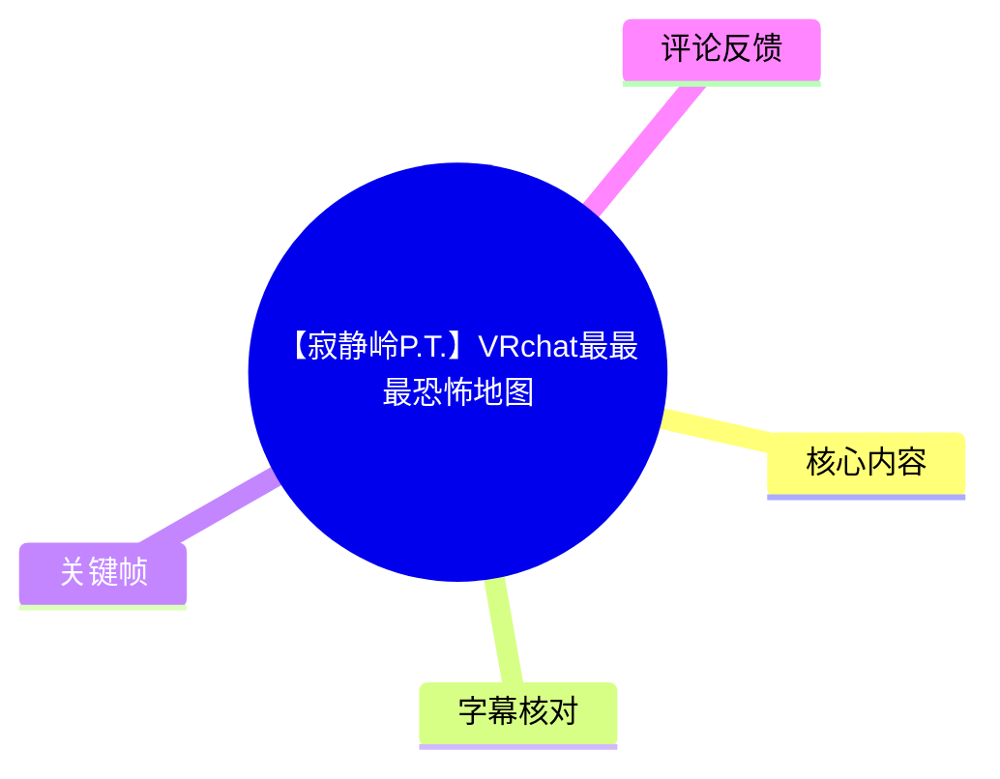
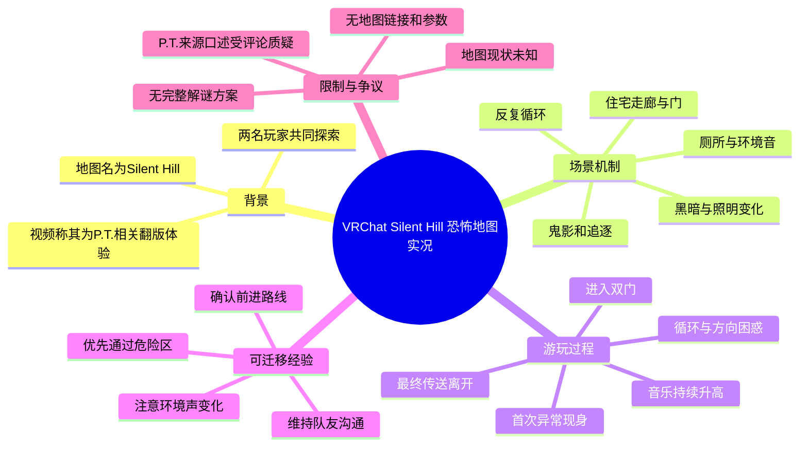
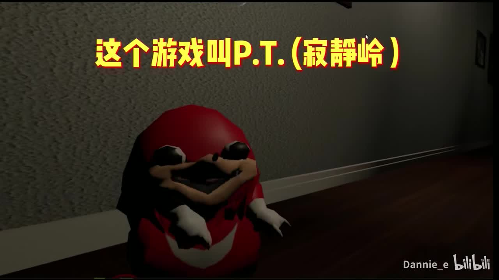
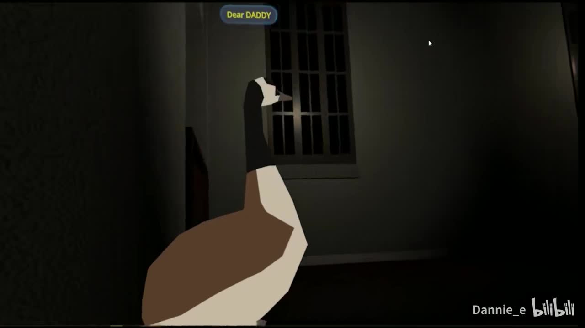
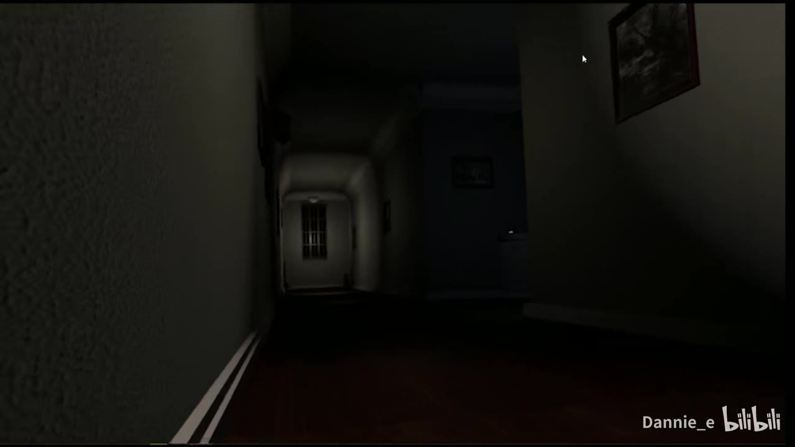
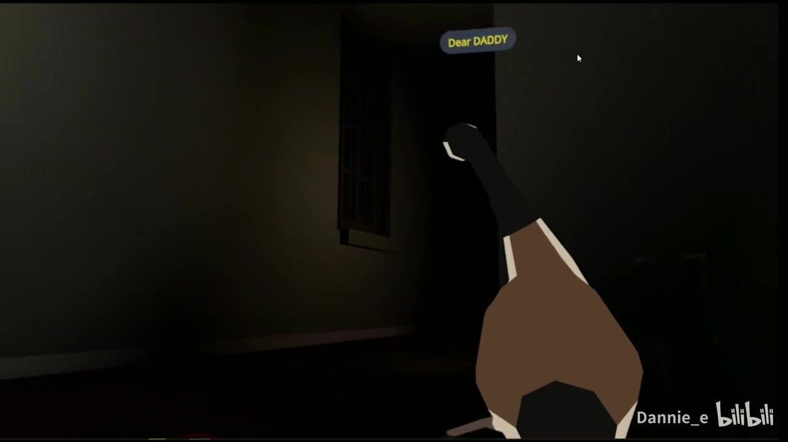

# 【寂静岭P.T.】VRchat最最最恐怖地图

> 来源：[Bilibili 视频](https://www.bilibili.com/video/BV1cy4y1E73d)  
> UP 主：Dannie_e｜合集：vrchat地图｜时长：11 分 46 秒（706 秒）  
> 标签：寂静岭、实况、第一人称、VR、STEAM、虚拟现实、VRCHAT  
> 发布于 2021-03-08；本文基于任务提供的元数据、ASR、关键帧与可获取热评整理。

## 小结

视频记录了两名玩家在 VRChat 恐怖地图 **Silent Hill** 中进行的双人探索。地图以狭长住宅走廊、反复穿门、环境音、黑暗场景、视觉异常与追逐事件制造压迫感；两人的即时惊叫、互相催促和以“背对恐怖源”缓解紧张的行为，构成了视频主要的娱乐效果。

开场中，出镜者将体验对象称作“P.T.”，并表示该作品因恐怖而被下架、后来有玩家制作翻版，VR 中也有类似体验。但这段背景口述存在明显事实风险：热评指出原版《P.T.》与 PS4 商店试玩版有关，而不是 Steam 上架作品。现有素材没有提供外部权威来源，故本文仅将其标注为“视频内说法”，不作为已验证史实。

从游玩过程可提炼出的经验不是具体通关攻略，而是恐怖地图中的协作策略：保持队友位置可见、在出现异常后快速确认前进方向、不要因恐慌而原地分散、利用较亮区域恢复方向感。视频同时显示，这些策略只能降低沟通混乱，不能保证避免惊吓、追逐或循环场景。

地图体验的核心限制是：视频没有给出地图链接、作者、房间 ID、加载方式、VR 设备型号、控制器绑定、性能设置或完整解谜条件。观众可以了解其氛围和游玩节奏，但无法仅凭本片复现同一版本或得到确定的通关流程。

内容具有时间边界。视频发布于 2021 年，VRChat 世界内容、可访问性、地图版本及平台规则均可能已经变化；截至任务素材抓取时间（2026-07-13），仍不能从所给材料确认该地图是否继续开放、是否改名或是否仍保持相同事件脚本。

## 思维导图

## 目录

- [背景、对象与信息边界](#背景对象与信息边界)
- [开场：进入走廊与 P.T. 口述](#开场进入走廊与-pt-口述)
- [恐怖机制：声音、黑暗与首次异常](#恐怖机制声音黑暗与首次异常)
- [循环走廊：协作、迷路与追逐](#循环走廊协作迷路与追逐)
- [后段升级：耳语、鬼影与结尾脱离](#后段升级耳语鬼影与结尾脱离)
- [可复用的游玩步骤与经验](#可复用的游玩步骤与经验)
- [参数、限制与时效性](#参数限制与时效性)
- [字幕比对](#字幕比对)
- [评论分析](#评论分析)
- [处理记录](#处理记录)

## 背景、对象与信息边界 [00:00](https://www.bilibili.com/video/BV1cy4y1E73d?t=0)

这是一段第一人称 VRChat 恐怖地图实况，而非地图作者制作的攻略、评测或技术教程。片中至少有两名参与者：其中一人被称为“戴尼 / 谭妮”（ASR 对人名识别不稳定），另一人多次以口头回应和催促参与互动。两人使用的虚拟形象会直接出现在走廊场景中。

UP 主在视频简介中写道：“Vrchat最恐怖地图……名字就叫Silent Hill。”因此，在本素材范围内，**可以确认的地图名称是 Silent Hill**；标题中的“寂静岭 P.T.”表达的是题材联想和体验定位，不足以证明该世界与任何官方作品具有正式授权、直接移植或版本对应关系。

视频全长 706 秒，画面分辨率为 1920×1080。素材未提供站内字幕、地图 URL、世界作者、房间实例信息和设备配置，以下时间节点依据 ASR 内容顺序及画面素材整理；因 ASR 原始文本未附逐句时间码，秒数应作为定位参考，而非逐帧事件记录。

## 开场：进入走廊与 P.T. 口述 [00:09](https://www.bilibili.com/video/BV1cy4y1E73d?t=9)

玩家刚进入一对门时就说“进入这双门就没有后路了”，另一人回答“问题不大，我们可是专业的”，随即出现“怎么走”的困惑。这一段建立了实况的基本关系：两人以轻松、逞强的口吻进入未知区域，但对路线与事件缺乏预先掌握。

约开场半分钟，出镜者口述：

- “这个游戏叫 PT”；
- 其后提及“之前是 Steam 上一部”；
- 又称其“因为太恐怖了”而被下架；
- 认为原作体验感好，因此“很多游戏大佬开始做这种翻版，VR 也有了”。

其中，“体验感好”“VR 也有了”属于出镜者的主观说明；有关平台、下架原因与原作背景的部分，则是未经本素材佐证的口述。尤其是“Steam”说法与热评提供的信息相冲突，详见[评论分析](#评论分析)。

> 图：该帧显示走廊环境、玩家形象及“这个游戏叫 P.T.（寂静岭）”的画面文字。它有助于区分“视频对体验的命名”与“可由元数据确认的 VRChat 地图名 Silent Hill”，避免把两者直接等同为官方作品关系。

## 恐怖机制：声音、黑暗与首次异常 [01:06](https://www.bilibili.com/video/BV1cy4y1E73d?t=66)

进入室内走廊后，恐怖感首先由**声音**而非直接攻击建立。玩家听到“鬼的声音”、门开启声，以及被描述为从厕所方向传来的声音。随后有人明确说“这个声音越来越不妙了”，表明音效会随着推进而改变，至少在玩家感知中承担了危险预告功能。

接着，画面和反应转向视觉威胁：两人先发现一个“特别不妙”的东西，继而询问“是个人吗”，随后确认其为需要躲避或警惕的对象。这里没有给出敌对实体的正式名称、触发条件或碰撞规则；能确认的只有玩家确实在场景里遭遇了人形/鬼影式的异常，并对其采取回避态度。

> 图：该帧呈现狭窄走廊、尽头的栅栏门与一名前方玩家。封闭构图说明地图主要以有限视距、单向空间和队友站位制造压力，也解释了玩家为什么会频繁询问该向哪里走。

约两分钟处，玩家用“背对是玩法”“背对后面我什么都不怂”自我安慰。这不是经验证的地图机制，而是一种面对恐怖画面时的临场应对方式：不直视可能出现异常的方向，以降低心理压力。很快，另一人仍持续喊“快走”，说明这种方式并未解决路线和事件本身。

> 图：该帧突出长走廊、侧门与远处弱光。它直观体现了视频中“听到声音却难以判断来源”的空间条件：可见区域很窄，房门和阴影均可能成为事件触发或惊吓来源。

## 循环走廊：协作、迷路与追逐 [03:05](https://www.bilibili.com/video/BV1cy4y1E73d?t=185)

中段出现第一次较明确的推进与回退。两人为了“观众”再次鼓起勇气，倒数“3、2、1”后冲出；其中一人短暂以为“活出去了”，却马上发现“走错方向”。这说明场景并非通过一次直线冲刺就能稳定脱离，玩家需要不断确认位置。

随后发生追逐或被追赶感强烈的事件。ASR 中有“鬼来追了”“打不开”“快走”等连续反应，且背景音乐一度消失。对恐怖游戏而言，音乐突然停止会让玩家失去预警参照；在视频中，这一变化没有让玩家放松，反而被理解为下一次异常即将出现。

约四分钟后，两人讨论“刚刚那个鬼在那二楼看呢”，一人表示没有看见，另一人提到其位于窗/玻璃附近。由于 ASR 对具体位置词转写不清，不能把它整理为精确坐标；但可以确认，玩家对异常出现位置的感知并不一致。这也是双人恐怖地图常见的沟通问题：队友可能看见不同方向、不同距离的威胁，口头描述需要尽量简短明确。

> 图：该帧中的走廊大部分处于黑暗，仅留少量边缘与门框可辨。它对应玩家反复评价“没有灯”“看着特别不妙”的段落，说明可视性下降是地图后段的重要压迫手段。

## 后段升级：耳语、鬼影与结尾脱离 [05:14](https://www.bilibili.com/video/BV1cy4y1E73d?t=314)

中后段的关键变化是场景循环感进一步强化。玩家注意到“所有都在转”，并听到持续上升的音乐；随后发现“没有门了”“新的地方了”，又很快怀疑回到了原先的门附近，得出“无限循环了”的判断。

可从这段过程归纳出地图使用的几种叙事/惊吓元素：

1. **重复空间与路线不确定性**：玩家以为自己来到新区域，又怀疑回到起点；循环本身成为压迫来源。
2. **音高或音乐强度上升**：一人明确说音乐“持续地上升”，并形容有被“吞”的感觉。这里记录的是主观听感，素材未提供音频参数，不能量化为具体分贝、频率或触发阈值。
3. **灯光状态突变**：门关闭后“没有灯”，玩家即时进入紧张状态；之后进入较亮区域时又说“至少它是亮的”，显示亮度会直接影响他们的安全感。
4. **近距离耳语与文本/语音信息**：玩家说“有人在我耳边”“在我这说话”，之后重复听到类似叙述性台词。ASR 对该段内容断句较差，无法可靠还原完整原文，但可确认地图使用了近距离语音或耳语式事件。
5. **实体再现与楼层推进**：后段玩家再度遇到鬼影，并被带往楼上或“卧室”方向；此处引发大量尖叫、逃跑和互相寻找队友的反应。

约十分钟后，玩家仍在询问“怎么走”、判断“G 就是死”等。由于没有画面内清晰的规则说明，不能断言字母 “G” 在地图中代表死亡、按键或某个正式机制；它更可能是紧张状态下的即时口头表达。临近结尾，两人确认“结束了”，随后寻找并进入“传送门”，以此离开当前体验。

## 可复用的游玩步骤与经验 [00:18](https://www.bilibili.com/video/BV1cy4y1E73d?t=18)

以下内容是依据视频中两人的实际行动整理的**双人恐怖地图游玩建议**，不是本地图的官方通关步骤，也不承诺能触发或规避特定事件。

### 1. 入场前先统一沟通方式

视频开场的“怎么走啊”表明两人并没有清晰路线信息。进入此类地图前，可先约定最基础的沟通规则：

- 队友走散时，优先报方向或最近可见地标；
- 遇到异常时，先说“前方 / 身后 / 左右”等位置，再补充描述；
- 一方明确表示不适时，另一方不要只催促冲刺，应确认是否暂停或离开。

### 2. 将环境音视为风险提示，而非确定答案

视频中的厕所声、鬼声、耳语和音乐上升都能引发玩家警觉。合理做法是：

1. 听到异常声音后先停下确认队友位置；
2. 观察声音是否随前进、回头或进门发生变化；
3. 再决定继续前进、回撤或由一人带路。

需要注意：视频没有证明任何一种声音与固定解谜动作一一对应。因此，“听到声音就往某个方向走”不是可从素材推出的规则。

### 3. 面对循环场景，记录可辨识的差异

玩家多次认为回到原处，且难以区分“新地方”与“来时的门”。在循环走廊类地图中，优先观察：

- 门是否还能开启；
- 灯光状态是否变化；
- 走廊尽头、窗户、画框等固定物是否不同；
- 是否出现新的人影、眼睛、声音或通路。

视频中“没有门了”“至少它是亮的”等反应说明，门与照明是玩家实际用于判断环境变化的线索。

### 4. 追逐或高压事件中保持同行

当玩家喊“鬼来追了”“打不开”时，两人反复互相催促“快走”。其可迁移价值在于：高压情况下，快速移动和保持彼此可见通常优于各自乱跑。视频也显示，单纯冲刺可能走错方向，因此应在通过当前危险点后立即重新确认路线。

### 5. 将离场机制作为体验边界

结尾出现“传送门”后，两人迅速进入并离开。对于 VR 恐怖体验，主动退出、切换世界或暂停体验本身是合理选择。视频中多次出现“我不玩了”“我哭了”“嗓子疼”等强烈反应；这些是娱乐化实况的一部分，但也提示实际玩家应根据自身承受能力控制时长和音量。

## 参数、限制与时效性 [11:22](https://www.bilibili.com/video/BV1cy4y1E73d?t=682)

### 素材中可确认的参数

| 项目 | 可确认信息 |
| --- | --- |
| 平台/场景 | VRChat 恐怖地图体验 |
| 地图名 | Silent Hill（来自视频简介） |
| 视频标题关联 | 标题使用“寂静岭 P.T.”表述 |
| 视频时长 | 706 秒，约 11 分 46 秒 |
| 分辨率 | 1920×1080 |
| 参与形式 | 至少两名玩家共同探索 |
| 主要场景元素 | 走廊、门、厕所相关声音、黑暗、循环、鬼影、追逐、传送门 |
| 视频发布日期 | 2021-03-08 |

### 素材中缺失、不能补写的参数

- 地图世界链接、World ID、作者与版本号；
- 是否需要特定 VR 头显、是否支持桌面模式；
- 推荐人数、最大人数、房间权限；
- 移动方式、传送/平滑移动设置、按键绑定；
- 音量、画质、帧率、网络延迟和性能优化参数；
- 事件触发条件、谜题答案、完整通关路线；
- 鬼影的正式名称、伤害/失败规则与重开机制。

### 时效性说明

视频发布于 2021 年。VRChat 的世界可见性、地图内容、作者维护状态和平台功能都可能在后续发生变动。任务提供的抓取时间为 2026-07-13，但这只表明素材在该时点被整理，**不等于**地图在该时点仍可访问，也不等于视频展示的事件、名称与版本仍然有效。

关于 P.T. 的历史来源，视频口述与第三条热评存在冲突；任务素材不包含足以裁定的外部资料，故应在实际发布攻略、史料或推荐链接前另行核验。

## 字幕比对 [00:00](https://www.bilibili.com/video/BV1cy4y1E73d?t=0)

本次任务**已执行 ASR**，但未提供可用的 Bilibili 站内字幕。

| 字幕来源 | 完整性 | 专有名词 | 时间轴 | 主要问题 |
| --- | --- | --- | --- | --- |
| Bilibili 站内字幕 | 未提供，无法使用 | 无法评估 | 无可用时间码 | 素材明确标注“未提供可用站内字幕” |
| 本次 ASR 字幕 | 覆盖全片主要对话与惊叫，但口语噪声较多 | 可识别出 P.T.、Steam、Silent Hill、VR 等；人名和部分词语不稳定 | 提供文本顺序，但未提供逐句时间码 | 中英混杂、尖叫重叠、语气词多；部分位置词、人名和叙述台词存在误识别或断句错误 |

### 最终字幕选择

正文以**本次 ASR 字幕**作为唯一可用的语言素材，并结合元数据、视频简介、评论与关键帧进行保守校正。由于没有站内字幕可对照，未进行字幕合并。

### 已校正或保留不确定性的内容

- **Silent Hill**：视频简介明确给出“名字就叫 Silent Hill”，因此作为地图名使用。
- **P.T.**：ASR 中多次识别为“PT”，结合标题与画面文字，统一写作“P.T.”；这是视频中对体验对象的称呼，不据此扩展为官方版本结论。
- **Steam 与下架说法**：ASR 可辨识到该口述，但受到热评质疑，因此保留为“视频内说法”。
- **“戴尼 / 谭妮”等称呼**：ASR 前后不一致，未将其作为确定身份信息。
- **“二楼看呢”“玻璃”等位置描述**：ASR 对词组不够可靠，正文仅保留“窗/玻璃附近”的不确定性表述，不写成精确场景机制。
- **耳语叙述内容**：ASR 转写碎片化，未将其拼接为完整剧情台词，避免编造剧情。

## 评论分析 [00:00](https://www.bilibili.com/video/BV1cy4y1E73d?t=0)

以下仅处理任务提供的热评前三条，按点赞数排序；评论内容属于观众观点或补充，不能自动视为已验证事实。

1. **徐老儿｜8 赞**  
   评论：“好喜欢小姐姐做的视频，必须次次三连[doge]”。  
   观点主要是对 UP 主内容风格的正向反馈，没有补充地图信息或技术信息。它可反映部分观众认可视频的娱乐效果，但不能推导出地图品质或恐怖程度的普遍结论。

2. **聖·耶和華｜5 赞**  
   评论：“两只鹅闯鬼屋也太搞笑了”。  
   该评论抓住了视频的核心观看体验：恐怖地图与玩家虚拟形象、即时反应之间形成反差喜剧。它与视频中大量尖叫、互相催促、临阵退缩的内容相符，但“两只鹅”是对角色形象与互动效果的戏谑性描述，不是地图机制说明。

3. **逼站博士｜4 赞**  
   评论认为视频对 P.T. 来源的介绍有误，称《寂静岭 P.T.》是小岛秀夫在科乐美时期的项目、作为“鬼打墙回廊”式试玩版上架 PS4 商店，并提到拥有正版 P.T. 的 PS4 价格较高。  
   这条评论直接指出视频中“Steam 上的作品”说法可能不准确，具有重要的事实核查价值；但评论本身仍不是任务内的权威证据。本文据此将原视频相关口述降级为待核验信息，而非直接采纳评论的所有细节（包括二手市场价格说法）。

## 评论分析

本次流程未获取到可用热评，因此不推断观众态度或额外结论。

## 处理记录

- **Worker ID**：worker-mri3sp0r-0d15ab26
- **模型**：gpt-5.6-terra
- **调用工具与素材**：任务提供的视频元数据、素材清单、ASR 字幕、关键帧清单、热评 JSON；未提供额外外部检索或地图页面核验结果。
- **字幕选择**：Bilibili 站内字幕未提供可用文件；本次 ASR 已执行，正文以 ASR 为基础，并用视频简介、元数据、关键帧及上下文进行保守校正。
- **关键帧选择依据**：选用 `frames/frame-001.jpg` 展示开场的 P.T. 文字说明与玩家形象；`frames/frame-002.jpg` 展示狭窄走廊和队友站位；`frames/frame-003.jpg` 展示长走廊、门与低照度；`frames/frame-004.jpg` 展示后段近乎无照明的压迫场景。所选帧均直接服务于地图空间、光照与双人探索的正文说明。
- **时间轴依据**：ASR 文本未附逐句时间码，章节秒数依照语义顺序和视频总时长进行定位整理，适合跳转复核，不作为精确事件帧点。
- **缓存清理**：素材清单未提供缓存清理执行回执；因此不声明已清理任何本地缓存或中间文件。
- **未解决问题**：地图链接、作者、版本、访问状态、设备与设置参数、完整解谜条件均未在提供素材中出现；视频对 P.T. 背景的说法与热评存在分歧，需通过独立权威来源进一步核验。
