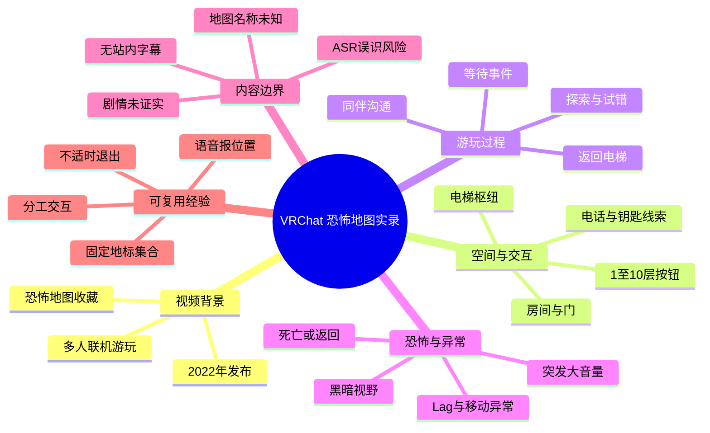
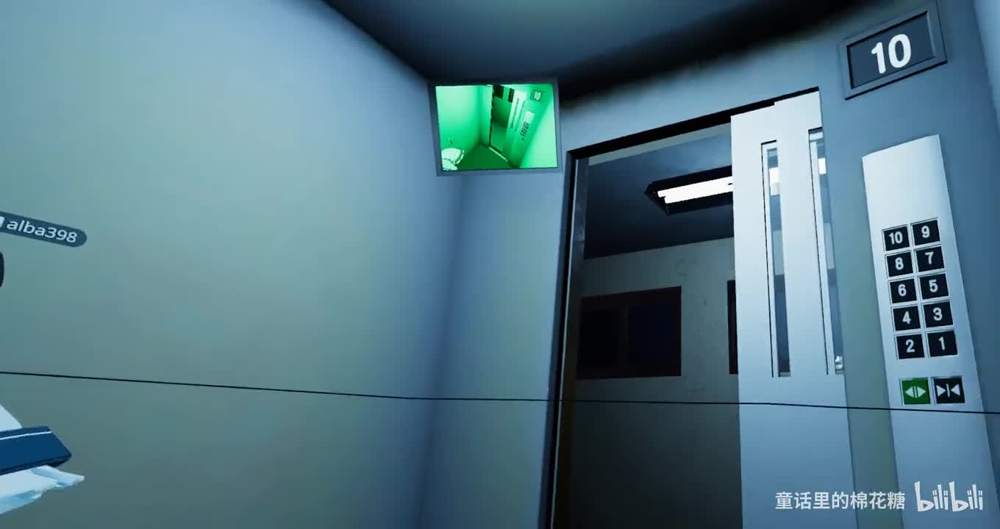
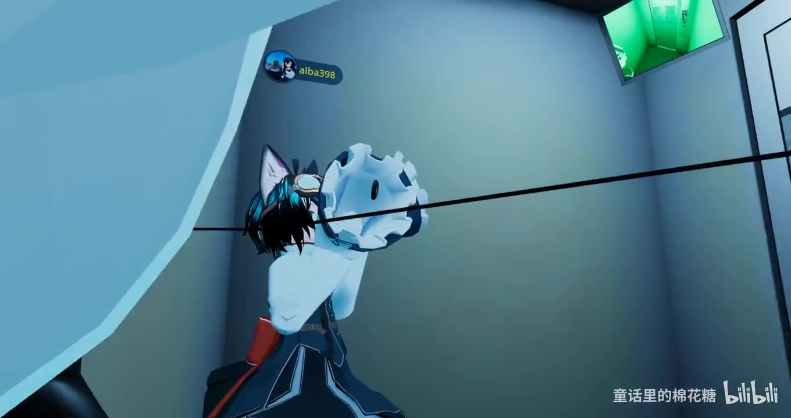
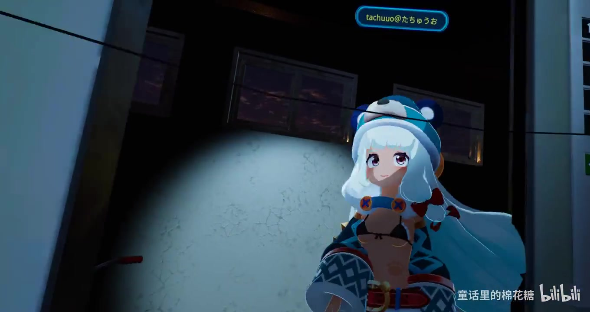

## 小结

这是一段时长 **680 秒（11 分 20 秒）**的 VRChat 多人恐怖地图游玩实录，UP 主为“童话里的棉花糖”，发布于 **2022 年 9 月 13 日**。视频标题聚焦“被恐怖地图吓坏的猫猫”，重点呈现玩家在电梯、楼层、昏暗房间等场景中探索时的沟通、犹豫、受惊与联机异常，而非一份完整的地图攻略。

画面能够直接确认：地图以电梯为重要空间节点，电梯内有 **1—10 层**按钮、楼层显示及绿色调监控画面；多名玩家使用 Avatar 同行。ASR 中反复出现开门、等待、回电梯、电话、钥匙、房间、音量过大、死亡／返回和 Lag 等线索，说明游玩过程涉及探索与机关试错，但现有素材不足以还原精确的任务链、地图名称、作者或版本。

视频简介写道“感觉剧情是跟家暴有关的”。这是 UP 主的主观剧情推测；由于无地图正式介绍、无可用站内字幕，也没有完整可验证的剧情文本，不能将其写作已证实的故事设定。

对多人游玩者而言，视频提供的可迁移经验是：以电梯等固定地标作为集合点；在黑暗或传送后主动报位置；遇到交互无响应时避免多人无序同时操作；将短暂等待、前置条件遗漏和联机同步问题纳入排查。多人陪同可能降低恐怖感，但也可能带来语音混杂、遮挡和同步复杂度。

本次素材抓取于 2026 年 7 月，但视频录制与发布于 2022 年。VRChat 世界可能已经更新、下架或改变脚本逻辑，因此本文只记录本次视频与所给素材中可观察到的内容，不能作为当前地图的固定通关方案。

## 思维导图

## 目录

- [视频背景与素材边界](#视频背景与素材边界)
- [开场：电梯、楼层与多人同行](#开场电梯楼层与多人同行)
- [探索线索：门、房间、电话与钥匙](#探索线索门房间电话与钥匙)
- [惊吓来源：黑暗、音效、状态变化与 Lag](#惊吓来源黑暗音效状态变化与-lag)
- [多人游玩的可复用步骤](#多人游玩的可复用步骤)
- [参数、限制与时效性](#参数限制与时效性)
- [字幕比对](#字幕比对)
- [评论分析](#评论分析)
- [处理记录](#处理记录)

## 视频背景与素材边界 [00:00](https://www.bilibili.com/video/BV1xg411m7Pm?t=0)

视频标题为《VRChat 被恐怖地图吓坏的猫猫》，作者为“童话里的棉花糖”，所属收藏为“vrchat地图”。视频为单 P，时长 680 秒，画面分辨率为 **1920×1016**。

可由元数据和画面确认的信息如下：

| 项目 | 可确认内容 |
| --- | --- |
| 平台 | VRChat |
| 游玩形式 | 多人联机探索 |
| 视频时长 | 680 秒，约 11 分 20 秒 |
| 发布日期 | 2022-09-13 |
| 地图类型 | 标题与标签指向恐怖地图 |
| 主要场景 | 电梯、楼层、室内房间、暗处空间 |
| 地图名称 | 素材未提供，无法确认 |
| 地图作者／版本 | 素材未提供，无法确认 |
| 剧情主题 | UP 主简介推测与家暴有关，尚未证实 |

本视频的价值主要是记录实际游玩时的反应和协作状态，而不是系统教学。语音中存在多人交谈、环境声和 ASR 断裂，因此本文会将内容分为三类：

1. **可直接验证的画面事实**：如电梯、楼层按钮、Avatar、光线条件。
2. **ASR 可辨识的玩家说法**：如“回到升降机”“有个锁匙”“又是因为 Lag”。
3. **不能确认的推断**：如完整剧情、具体机关规则、英文专名与人物名称。

## 开场：电梯、楼层与多人同行 [00:00](https://www.bilibili.com/video/BV1xg411m7Pm?t=0)

视频开场位于电梯区域。右侧墙面上可以清楚看到楼层按钮，排列为 **1—10**；门边顶部显示“10”，上方还悬挂绿色调的监控画面。电梯门处于打开状态，说明玩家可以在电梯与外部房间之间切换。

> 图：画面直接呈现电梯门、1—10 层按钮和顶部监控屏。这张关键帧是“电梯是地图空间枢纽”的视觉依据，也解释了后续对“一楼”“升降机”“回家”等说法的场景基础。

ASR 开头可辨识出“要等一段时间才能按”“好，按五次”“这里是一楼”等话语。这表明玩家正在讨论等待与操作，但没有可用的逐句时间码和人工字幕，无法确认：

- “按五次”所指的具体按钮；
- 按键次数是否为固定规则；
- 等待的时长；
- 操作是否确实推进剧情。

因此，较稳妥的结论是：**玩家曾围绕电梯或其他交互界面讨论等待与重复按键，但不能把零散对话还原为地图攻略。**

随后画面中出现带猫耳风格元素的 Avatar，以及白色的大型头部／玩偶式 Avatar。同屏用户名标签显示当前并非单人体验。标题中的“猫猫”更可能指向玩家的角色风格与受惊反应，而非地图内被正式命名的角色。

> 图：画面中两名 Avatar 处于电梯附近，其中一名角色带有猫耳风格元素。这张图用于证明多人同行和 Avatar 互动是视频体验的重要部分；它不用于推断角色身份或剧情关系。

多人同游一方面能提供陪伴，另一方面也使沟通变得复杂：语音中不断出现“你来吧”“我去哪了”“谁啊”“我们去吧”等即时确认，体现玩家需要频繁重新定位同伴与目标。

## 探索线索：门、房间、电话与钥匙 [02:30](https://www.bilibili.com/video/BV1xg411m7Pm?t=150)

中段 ASR 中可辨识到“门有两张”“我可以进去吗”“开不开”“我开了”“开了吗”“这里可以开，开不了”等片段。它们反映出游玩过程围绕进入房间、检查门的状态和尝试触发交互展开。

可从对话中保守提取的线索如下：

| 线索 | ASR 中的相关表达 | 可以记录的事实边界 |
| --- | --- | --- |
| 房间与门 | “门有两张”“我可以进去吗”“开不了” | 地图中存在房间与门类交互；具体开门条件未知。 |
| 电话 | “有个电话在”“我接电话” | 玩家注意到电话并尝试互动；电话是否为主线机关未证实。 |
| 钥匙 | “因为有个锁匙” | 有玩家认为推进与钥匙有关；钥匙位置、用途、是否取得均不明。 |
| 等待 | “要等一段时间”“可能要等时间才会来” | 玩家将部分无响应状态理解为需要等待；固定等待规则未证实。 |
| 共享状态 | “只要一个人动就能全部动” | 这是现场玩家对某机关的理解，不足以证明地图的真实机制。 |
| 返回电梯 | “回到升降机”“回家吧” | 电梯被反复用作移动或重新集合的地点。 |

视频中的探索并不顺利。玩家会问“要怎么做？追上去吗？”“好像没办法走过去”，也会因门无法打开或路径不明确而暂时停滞。这些反应说明恐怖感并非只由怪物或 Jump Scare 构成，也来自于**目标不确定、空间难辨、同伴位置不明和交互状态不透明**。

ASR 里还出现“晚安，妈妈”“一般来说是全球的”“我就是 Merry”等句子，但其语境不完整，且人物名或英文词可能存在误识。不能将这些片段直接连接成完整剧情，更不能据此确认家庭关系、角色身份或地图故事。

## 惊吓来源：黑暗、音效、状态变化与 Lag [05:00](https://www.bilibili.com/video/BV1xg411m7Pm?t=300)

画面中多次出现低照度环境。部分区域几乎完全处于黑暗中，只能看到非常有限的绿色光源或远处的轮廓。玩家在这种状态下难以确认房间结构、出口和同伴位置。

> 图：该关键帧展示画面在极低照度下只保留少量绿色区域。它直观体现恐怖地图如何通过可视范围受限制造不确定性，也是玩家反复询问位置与路线的视觉背景。

语音中可听见或识别到“声音太大了”“很大吧，吓坏人了”等反应。视频没有提供游戏或设备的音量数值，因而不能判断是地图本身混音过响、VR 设备输出过高，还是玩家个人音量设置导致；但可以确认，突发声效是这次受惊体验的重要部分。

ASR 后段还出现“突然就死了”“他们死了吗”“还可以回来了，太好了”“眩晕”等表达。就现有素材而言，可能涉及：

- 地图脚本触发的死亡或淘汰状态；
- 传送、重置或重新回到可行动区域；
- VR 游玩引发的不适感；
- 联机状态变化导致的画面或角色异常。

但这些解释均不能被当前素材完整验证。特别是“死亡”究竟是地图的剧情设定、失败判定、临时传送，还是联机问题，缺乏明确画面和可靠字幕支持。

> 图：同伴 Avatar 站在昏暗室内与电梯区域附近，人物可见但背景仍然压暗。该图说明多人在场并不会消除压迫感：黑暗环境、未知房间和有限视野仍会维持紧张体验。

关于技术问题，ASR 可辨识出“有些小问题吧”“又是因为 Lag”等表述。可确认的是，至少有玩家把部分异常归因于延迟或联机问题。不可确认的是：

- 网络延迟具体数值；
- 是否为 VRChat 服务端、房主、地图脚本或本地设备性能造成；
- Lag 是否直接导致死亡、门无法开启或无法移动。

因此，观看时应区分“地图设计造成的恐怖事件”与“联机／性能造成的异常”；视频本身没有完成这一区分。

ASR 中末段出现 `Coin Locker Baby`，同时伴随“绝对是在 locker 里面有小孩的”等说法。由于没有地图名、站内字幕和清晰语境，无法确认它是地图名称、场景名称、物件名称，还是玩家临时联想，故只保留为未核实的语音线索。

## 多人游玩的可复用步骤 [08:30](https://www.bilibili.com/video/BV1xg411m7Pm?t=510)

虽然视频不是教程，但其游玩过程可整理出适合多人 VRChat 恐怖地图的实践方法。

### 1. 先确认固定集合点

本视频中最明确的地标是电梯及其楼层面板。进入地图后，可优先完成以下动作：

1. 确认电梯位置、出口方向与当前楼层显示。
2. 约定迷路、死亡、传送或加载异常后回到电梯附近。
3. 每次离开电梯探索前，说明要去的方向或房间。
4. 发现机关后，让未参与操作的成员留意灯光、门、声音或其他场景变化。

这种做法适用于有明显中转空间的地图。它不是视频中明确给出的官方规则，而是根据其多人探索情境提炼的协作经验。

### 2. 对交互失效进行有序排查

视频里有“开不了”“反应没有”“可能要等时间才会来”等反应。遇到类似状态时，可按以下顺序排查：

1. 确认是否遗漏附近可见物件、门或前置房间。
2. 检查是否需要某位玩家先进入指定位置。
3. 由一人操作，其他人观察变化，避免多人反复抢按。
4. 短暂等待，观察是否有延迟触发的声音、灯光、门锁变化或传送。
5. 无变化时返回电梯或前一地标重新核对路线。
6. 若多人都出现移动、加载或交互异常，优先怀疑联机同步或地图状态，而不是持续无序试错。

注意：视频出现过“按五次”这类零散话语，但没有足够证据表明这是可复现的通关参数，不能机械照搬。

### 3. 把语音沟通当作导航工具

黑暗场景中，视觉信息不足，玩家常问“谁啊”“你后面在吗”“看着我”等。多人模式下，建议明确使用简短信息同步状态：

- “我在电梯／我在一楼／我在门口”；
- “我看见电话／我找到门，但打不开”；
- “我被传送了／我不能移动”；
- “我需要暂停／音量太大／感到眩晕”。

这种沟通可以降低失散和误判风险，也能帮助队友判断某个异常是否为单人问题还是全体状态变化。

### 4. 提前处理音量与不适风险

玩家明确表示声音很大、被吓到，ASR 中也出现“眩晕”。在 VR 环境中，突发声音、黑暗场景和不稳定移动可能加重不适。可采取的预防措施包括：

- 进入地图前将系统与应用音量调至可接受水平；
- 不适时优先停止操作、摘下设备或退出实例；
- 对 Jump Scare 耐受度不同的成员提前说明；
- 出现 Lag、画面卡顿或异常传送时减少快速移动；
- 不要因追求推进而忽略身体不适。

这些是一般性 VR 安全建议，不代表视频中的玩家已执行或地图有特殊的安全机制。

## 参数、限制与时效性 [10:15](https://www.bilibili.com/video/BV1xg411m7Pm?t=615)

### 已知参数

| 参数项 | 内容 |
| --- | --- |
| BV 号 | BV1xg411m7Pm |
| 视频时长 | 680 秒 |
| 时长换算 | 11 分 20 秒 |
| 分辨率 | 1920×1016 |
| 分 P | 1 P |
| 发布日期 | 2022-09-13 |
| 截止抓取时可见播放量 | 815 |
| 截止抓取时可见点赞数 | 19 |
| 截止抓取时可见评论数 | 16 |
| 电梯可见按钮 | 1—10 层 |
| 站内字幕 | 未提供可用字幕 |
| 本次 ASR | 已执行 |

### 内容限制

1. **地图身份不可确认**  
   素材没有给出地图名称、世界链接、作者、版本号或说明页，无法确认具体作品，更无法提供当前进入方式。

2. **剧情无法完整还原**  
   视频简介仅称“感觉剧情是跟家暴有关的”。没有正式剧情文本、结局说明或可靠字幕，不能把这一说法作为事实结论。

3. **ASR 存在明显误识风险**  
   文本中混有繁简转换、语句断裂、疑似跨语言识别和专有名词偏差。例如 `Merry`、`Bugly`、`阿卡丹`、`鳴吉／鳴基`、`Coin Locker Baby` 都无法完成可靠校正。

4. **章节时间轴为近似定位**  
   给定 ASR 未提供逐句时间码。本篇时间轴依据视频总时长、素材叙事顺序与关键帧顺序划分，用于快速跳转观看，不等同于逐句字幕对齐。

5. **联机异常原因未知**  
   玩家提到 Lag、无法行动、突然死亡或返回等现象，但没有性能数据、日志或地图机制说明，不能确定根因。

### 时效性说明

视频发布于 2022 年 9 月，素材抓取时间为 2026 年 7 月。VRChat 世界内容、脚本、房间人数限制、平台兼容性和性能表现都可能已变化。即使视频中的地图仍然可访问，当前体验也可能与录制时不同。

视频评论中还出现“PC 没那么恐怖”的个人体验，但无法确认评论者所用地图版本、设备、人数和设置，因此不能推广为 VRChat 恐怖地图的普遍规律。

## 字幕比对 [00:00](https://www.bilibili.com/video/BV1xg411m7Pm?t=0)

本次任务中，**站内字幕不可用，但本次 ASR 已实际执行**。由于缺少站内人工字幕，无法做逐句对齐校正；正文采用“ASR 提供线索、画面与元数据限定结论”的保守处理方式。

| 字幕来源 | 完整性 | 专有名词识别 | 时间轴 | 主要问题 |
| --- | --- | --- | --- | --- |
| Bilibili 站内字幕 | 不可用 | 无法评估 | 无法评估 | 素材明确说明“未提供可用站内字幕”。 |
| 本次 ASR 字幕 | 覆盖较多对话碎片 | 较弱，存在人名、英文词与术语误识风险 | 未提供逐句时间戳 | 多人说话重叠、语句不完整、繁简与语言识别混杂、环境声影响明显。 |

### 采用策略

最终不选择任何一份文本作为“完整逐字稿”：

- **站内字幕**：无可用文本，不能使用。
- **本次 ASR**：已执行，作为识别玩家行为与情绪反应的低置信度线索。
- **关键帧与元数据**：用于验证电梯、楼层按钮、多人 Avatar、黑暗环境等可视事实。

### 重要词语与校正边界

| 词语／语句 | 处理方式 | 原因 |
| --- | --- | --- |
| 电梯、升降机、一楼、楼层 | 保留为场景线索 | 与画面中的楼层面板和电梯相互印证。 |
| 门、房间、电话、钥匙 | 保留为玩家探索线索 | ASR 多次涉及，但具体机关逻辑未确认。 |
| Lag | 保留为玩家归因 | 只能说明玩家提及延迟，不能证明实际原因。 |
| “按五次” | 不作为攻略参数 | 缺少对象、时间点与触发结果。 |
| `Coin Locker Baby` | 原样保留并标注未核实 | 无法确认是地图名、场景名还是误识。 |
| `Merry`、`Bugly`、`阿卡丹`、`鳴吉／鳴基` | 不做擅自纠正 | 缺少站内字幕、清晰画面与上下文佐证。 |
| “剧情是跟家暴有关的” | 标为 UP 主主观推测 | 来源是视频简介，不是可验证的正式剧情文本。 |

## 评论分析 [00:00](https://www.bilibili.com/video/BV1xg411m7Pm?t=0)

以下仅分析可获取的热评前三条。评论为用户个人经验或观感，不作为地图机制的已验证事实。

### 1. 伊伊兔YIYI_：八人挤进电梯后不再恐怖

> “昨天也去玩了，8个人挤在电梯里一点也不恐怖了[笑哭]”

- **核心观点**：多人聚集能够明显缓解恐怖感。
- **补充价值**：评论直接提到电梯，与视频开场和后续反复出现的电梯空间高度相关；它支持“电梯不仅是移动节点，也是心理上的集合点”这一观看层面的判断。
- **可信度边界**：这是个人感受，不能得出“8 人一定最合适”或“人多必然不恐怖”的结论。人数、同伴关系、玩家胆量、进度和语音氛围都会影响体验。

### 2. 残存の影子：语音内容难以听懂

> “我是一句话都听不懂啊”

- **核心观点**：原视频的语音理解门槛较高。
- **补充价值**：该评价与本次 ASR 结果中大量断裂、误识和疑似语言混杂相吻合，说明观看者可能无法仅靠语音理解事件进展。
- **可信度边界**：评论没有说明其听不懂的具体原因，可能涉及语言、多人重叠说话、收音质量、口音或地图环境音，不能只归因于一种因素。

### 3. 永恒微光：PC 模式较不恐怖，人多是应对方法

> “这个图去过，pc没那么恐怖，人多也是好办法”

- **核心观点**：评论者认为桌面 PC 模式的恐怖感低于 VR，并再次提出多人同行能降低恐惧。
- **补充价值**：提示恐怖体验可能受到设备沉浸度影响；视频标题与标签中包含 VR，也使这一对比具有讨论价值。
- **可信度边界**：这是单一用户的主观体验，未说明所用地图版本、PC 设置、游玩人数或是否使用耳机，不能据此断言 PC 模式普遍更轻松。

## 处理记录 [00:00](https://www.bilibili.com/video/BV1xg411m7Pm?t=0)

- Worker ID：`worker-mri24eea-7db640f7`
- 模型：`gpt-5.6-terra`
- 任务对象：`BV1xg411m7Pm`
- 视频标题：`VRChat 被恐怖地图吓坏的猫猫`
- 素材依据：任务提供的元数据、视频产物清单、ASR 字幕、关键帧路径、热评数据与视频简介。
- 使用的素材产物：`merged.mp4`、`audio/audio.wav`、`frames/`、`comments/comments.json`、`asr/`、`info.json`。
- 字幕选择：站内字幕未提供可用内容；本次 ASR 已执行。最终采用 ASR 作为低置信度线索，结合关键帧、元数据和上下文进行保守整理。
- 关键帧选择依据：
  - `frames/frame-001.jpg`：包含电梯门、1—10 层面板、楼层显示与绿色监控画面，可直接支持“电梯为关键空间节点”。
  - `frames/frame-002.jpg`：包含猫耳风格 Avatar 与同行角色，可支持多人联机和标题中的“猫猫”视觉意象。
  - `frames/frame-003.jpg`：呈现极低照度与有限绿色光源，可支持黑暗视野是恐怖氛围来源之一。
  - `frames/frame-004.jpg`：呈现暗处的同伴 Avatar 与电梯区域，可说明同伴在场但恐怖压迫感仍存在。
- 时间轴依据：ASR 无逐句时间码；章节秒数按视频总时长、内容推进顺序与关键帧顺序作近似跳转定位，不作为精确字幕时间。
- 热评处理范围：仅处理可获取的热评前三条，未扩展至其他评论。
- 缓存清理：素材清单未提供缓存清理回执；无法确认临时缓存是否已清理，故不作已清理声明。
- 未解决问题：地图名称、地图作者、版本、当前可用性、完整剧情、电话／钥匙／柜子等机制的精确条件，以及 ASR 中疑似人名和英文专名的准确拼写，均无法由现有素材可靠确认。
