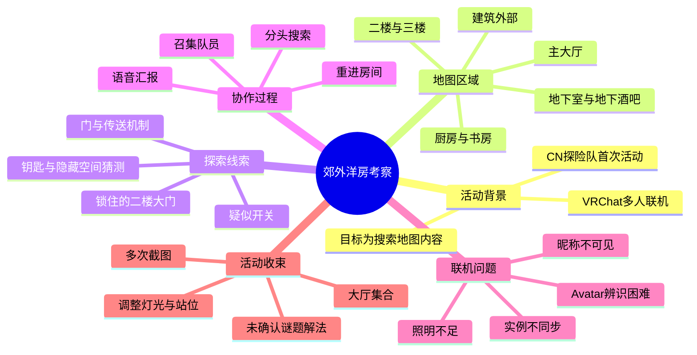
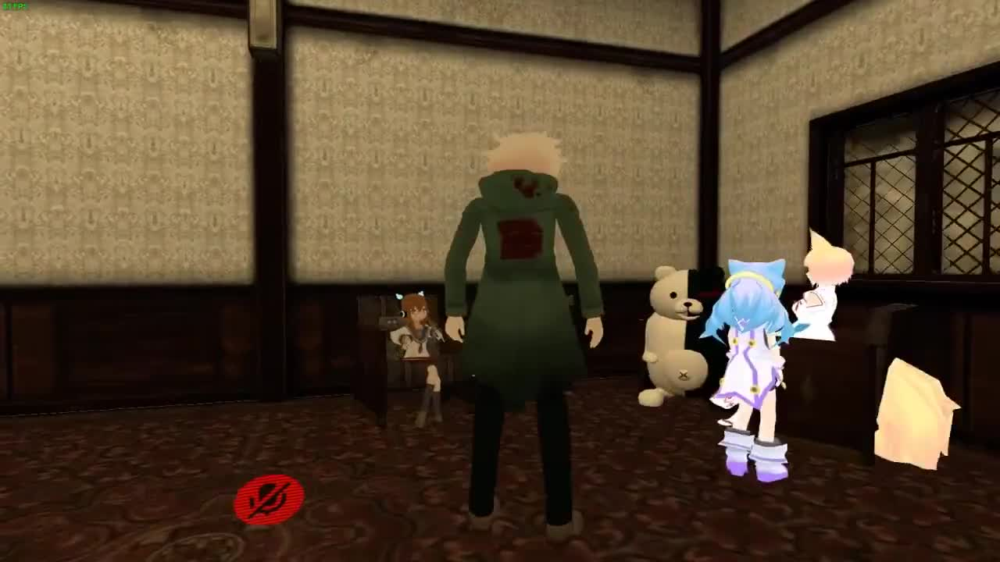
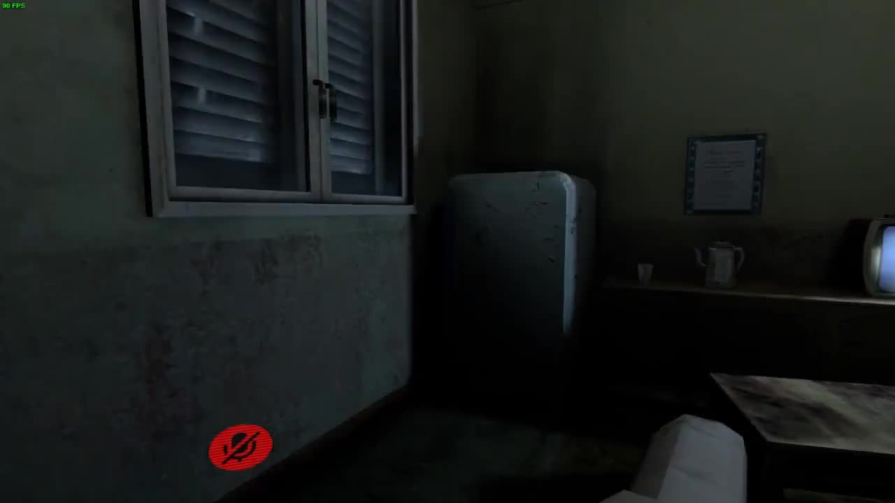
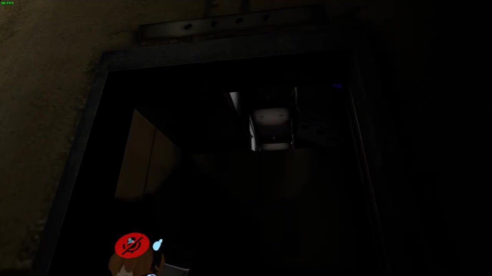
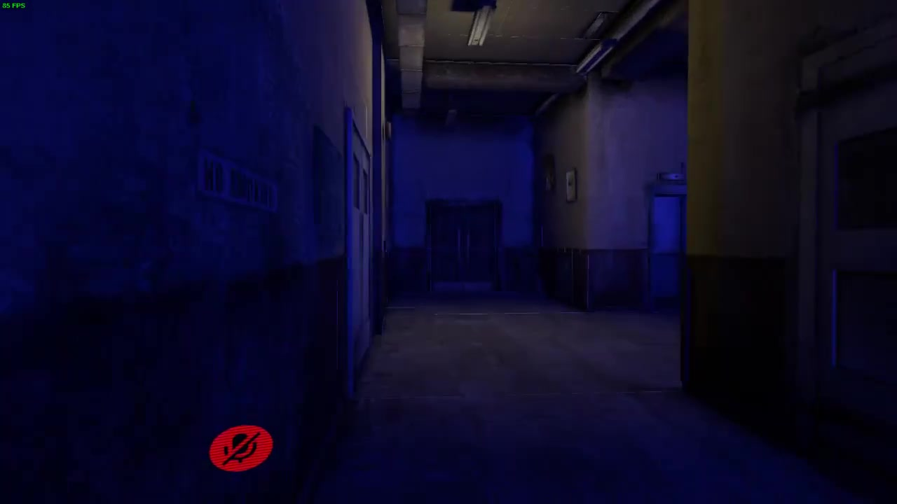

# [ VRChat ]CN探险队第一次考察“郊外洋房”

> 来源：[Bilibili 视频](https://www.bilibili.com/video/BV1nW411v7ii) 
> UP 主：KEMI_｜分区标签：网络游戏｜视频时长：44 分 37 秒｜收藏集：vrchat地图 
> 视频简介：“CN探险队第一次活动考察圆满结束”。

## 小结

本片记录了 CN 探险队在 VRChat 中对“郊外洋房”地图进行的一次多人实地探索。队员从室内主层、地下空间、二楼、三楼及建筑外部等区域展开搜索，重点关注隐藏门、可交互开关、传送机制、锁住的大门与疑似钥匙／线索等内容。

探索过程中，地图以昏暗照明、狭长走廊、地下酒吧、厨房、书房和多扇房门营造恐怖氛围。队员实际发现了可进入的地下区域、部分带传送特征的门或通路，以及大厅内可能控制照明的开关；但截至活动结束，未能确认二楼锁门的开启条件，也没有找到可被可靠验证的钥匙或额外隐藏区域。

视频展示的核心经验不是“解谜成功”，而是多人 VRChat 探索的协作流程：先按楼层和功能空间分区排查，再通过语音共享发现；遇到掉线、房间不同步、模型辨识困难或照明不足时进行重进、集合和复核；最后以大厅集合、排列站位、关闭或调整灯光并截图的方式结束活动。

可复用的技术观察包括：地图中存在门触发传送的可能性；视觉上看似通路或空洞的区域不一定可进入；透视观察只能用于判断可见空间规模，不能单独证明存在可达的隐藏区域；多人使用差异很大的 Avatar 会显著增加辨人、排位与截图难度。视频中还出现了语音距离、麦克风增益、名字不可见与不同房间实例等多人联机问题。

本片发布于 2018 年。VRChat 客户端、地图版本、房间机制、用户模型和原作者后续是否补完地图都可能已经变化。因此，视频中的入口、按钮、锁门状态及可用 Avatar 不应视为当前版本仍可复现的结论；它更适合作为一次早期中文 VRChat 社群地图考察的记录。

## 思维导图

## 目录

- [活动背景与素材边界](#活动背景与素材边界)
- [时间轴：进入洋房与初步勘察](#时间轴进入洋房与初步勘察)
- [时间轴：地下区域、酒吧与环境互动](#时间轴地下区域酒吧与环境互动)
- [时间轴：楼层搜索与锁门谜题](#时间轴楼层搜索与锁门谜题)
- [时间轴：联机协作、模型与房间问题](#时间轴联机协作模型与房间问题)
- [时间轴：汇合、结论与集体合影](#时间轴汇合结论与集体合影)
- [可复用的多人地图考察流程](#可复用的多人地图考察流程)
- [地图机制、参数与限制](#地图机制参数与限制)
- [关键帧索引](#关键帧索引)
- [字幕比对](#字幕比对)
- [评论分析](#评论分析)
- [处理记录](#处理记录)

## [活动背景与素材边界](https://www.bilibili.com/video/BV1nW411v7ii?t=0)

这是一次以“郊外洋房”为目标地图的多人 VRChat 探索记录。视频标题与简介均将其定位为“CN探险队第一次”活动，结尾处的对话也明确表明，本次活动以考察与合影为收束，而不是已经破解地图全部内容。

从视频可整理出的直接事实包括：

- 活动参与者主要以中文交流，途中遇到其他使用英语的玩家。
- 场景为多层洋房式建筑，包含大厅、走廊、房间、地下空间等。
- 队员明确搜索过一楼、二楼、三楼、负一层、负二层，并讨论过室外区域。
- 二楼大厅有一扇被认为“锁着”的大门；队员猜测可能要通过按钮或其他交互装置解锁。
- 有成员认为地图中部分门具有传送功能，且曾因门或电梯被送回起始／家中位置。
- 最终没有确认钥匙存在，也没有确认锁门后方有可进入的有效内容。

需要注意：ASR 文本没有提供逐词时间戳，以下时间轴依据完整视频时长、关键帧序列与对话发生顺序划分为**定位用的约略段落**；时间链接可用于跳转到相应阶段，但不应被理解为逐句精确定位。

## [时间轴：进入洋房与初步勘察](https://www.bilibili.com/video/BV1nW411v7ii?t=0)

### [00:00–约06:00｜观察室内布局与探索起点](https://www.bilibili.com/video/BV1nW411v7ii?t=0)

进入地图后，队员首先注意到室内的可见度、房间布局和地图细节。有人评价这张图“细节多”，也有人因环境亮度低而无法看清部分区域。探索重点很快从普通房间转向“哪里还能走”“有没有向下的路”“门能否进入”等可达性问题。

在这一阶段，队员已观察到：

1. 建筑内并非单一平面，而是存在通向不同楼层或地下空间的路径。
2. 房门、走廊和部分空间之间的关系不易从外观直接判断。
3. 照明会直接影响搜索效率；在没有足够灯光的区域，成员会失去方向感。
4. 团队通过“我刚看到”“这边有门”“跟着走”等口头指令推进，而非由单一队长全程带路。

> 图：该关键帧显示多名玩家以不同 Avatar 聚集在洋房室内。它说明本片不是单人恐怖地图试玩，而是多人语音协作探索；角色体型与画风差异也为后续的辨人、站位与截图问题提供了直观背景。

### [约06:00–约10:00｜寻找向下路线与地下入口](https://www.bilibili.com/video/BV1nW411v7ii?t=360)

队伍将注意力集中在向下通行的路线。对话中出现“可以下去吗”“我刚刚看到一个可以下走的路”“这边是死路”“这边有一个门可以下去”等连续反馈，说明成员在以实际可通行性筛选路径，而不是只凭建筑外观推测。

值得记录的探索经验是：看到楼梯、门洞或看似开口的空间，并不能保证可通过。视频里多次出现“死路”“上不去”“来过”的复核结论，反映出这张地图的空间设计会造成方向混淆。

> 图：关键帧展示一处低照度生活空间，可见冰箱、桌面器具与电视等布景。该画面说明地图的恐怖感主要来自阴暗光线、老旧室内陈设与有限视野，而非视频中已经被明确确认的追逐或怪物机制。

## [时间轴：地下区域、酒吧与环境互动](https://www.bilibili.com/video/BV1nW411v7ii?t=600)

### [约10:00–约16:00｜地下厨房、地下酒吧与拍照中断](https://www.bilibili.com/video/BV1nW411v7ii?t=600)

队员确认进入地下区域后，辨认出“厨房”“地下室有厨房”以及“地下酒吧”等场景功能。有人评价地下酒吧位置较好，并尝试处理音乐、特效与截图相关操作，如“把特效关了”“截个图”“都坐好”等。

这部分体现了 VRChat 地图探索中的两类行为交织：

- **内容搜索**：确认地下室是否还有通向其他区域的入口、房间或线索。
- **社交记录**：在风格化空间内临时组织坐下、关特效、截图等活动。

对话中还发生了角色模型与桌面碰撞、画面卡顿或位置异常等情况。此类现象不能作为地图谜题线索，应当和真正的可交互机关区分开。

> 图：该图呈现一个几乎被黑暗吞没的下方空间与狭小入口。它能帮助理解队员为什么频繁询问“能不能下去”、为何会把视觉开口误判为路径：低照度环境使空间边界和通行条件难以识别。

### [约16:00–约20:00｜照明、黑暗走廊与氛围体验](https://www.bilibili.com/video/BV1nW411v7ii?t=960)

随着探索深入，成员持续提到“好黑”“我什么都看不见”“没有灯光后面看不见”等问题，也讨论了是否能开关灯。此时恐怖体验主要来自不确定性：玩家不知道黑暗尽头是否为死路、传送点、可进入房间，还是单纯的布景。

视频中虽然有人因突然看到人物或环境而受惊，但现有素材不足以证明地图存在一个已被成功触发、可重复验证的怪物事件。应谨慎区分：

- **视频直接可见／可听见的事实**：队员在昏暗空间中受惊、部分房门或空间难以辨认。
- **队员即时猜测**：某处可能有怪物、按钮、钥匙或隐藏区。
- **未获证实的结论**：特定怪物机制、完整解谜流程、锁门后的内容。

> 图：该关键帧清晰展示蓝色环境光覆盖的长走廊、房门与尽头区域。它是解释地图视觉引导与迷路风险的关键画面：相似门洞、长走廊和低对比环境会降低多人搜索时的位置判断效率。

## [时间轴：楼层搜索与锁门谜题](https://www.bilibili.com/video/BV1nW411v7ii?t=1200)

### [约20:00–约28:00｜二楼、三楼与锁住的大门](https://www.bilibili.com/video/BV1nW411v7ii?t=1200)

队员在准备上二楼后继续检查书房、卧室式房间、大厅和各处走廊。搜索中最明确的未解问题是：二楼大厅的一扇门被认定为锁住，且该区域尚未被充分探索。

围绕该门，视频中出现了如下判断链：

1. 队员认为门处于锁定状态。
2. 有人推测可能存在按钮或某种安装／触发装置。
3. 队员又讨论过地图是否有钥匙。
4. 经多层搜索后，仍没有找到可确认的钥匙。
5. 有成员尝试或讨论透视观察，但看到的可见空间有限，无法据此确认存在可访问的大区域。

因此，最稳妥的结论是：**视频记录到一个未解决的锁门问题，而非一套已经验证的开门攻略。**

### [约28:00–约32:00｜传送门、电梯与空间复核](https://www.bilibili.com/video/BV1nW411v7ii?t=1680)

对话明确出现“这个地图是通过传送的”以及“按到这个门就可以进去了”等描述，也有成员抱怨电梯或门将其直接送回家／起点。由此可知，至少部分区域连接依赖传送触发，而不完全是连续几何空间。

这会带来两个实操后果：

- **路线不能仅靠记忆**：同一门洞、楼梯或房间可能因为触发器而产生非直观的去向。
- **重进与复核有必要**：成员被送离、卡住或位置不同步后，可能需要退出当前世界再重新加入。

视频中确有“退出这个世界然后重加一下就行了”的建议。这是一项由活动参与者提出的排障方式，但素材没有说明它是否成功修复了所有问题，也没有给出客户端版本、房间权限或网络环境等前提参数。

## [时间轴：联机协作、模型与房间问题](https://www.bilibili.com/video/BV1nW411v7ii?t=1800)

### [约30:00–约36:00｜人员走散、昵称不可见与不同实例](https://www.bilibili.com/video/BV1nW411v7ii?t=1800)

多人探索中出现了典型的 VRChat 协作障碍：

| 问题 | 视频内表现 | 对探索的影响 | 可采取的现场做法 |
| --- | --- | --- | --- |
| 队员走散 | 有人反复询问“人呢”“你们在哪呢” | 无法确认区域是否已被搜过 | 用大厅、楼梯口等固定地标作为集合点 |
| 昵称不可见 | 有人称看不到其他人的名字 | 难以区分 Avatar 身份 | 语音自报身份；避免多人使用相似模型 |
| 实例不同步 | 提到与同一地图但不在同一房间 | 看似同图，实际无法会合 | 先确认是否进入同一房间／实例，再继续协作 |
| 模型差异过大 | 大型模型、动物模型、默认模型混杂 | 遮挡视野，合影与辨人困难 | 合影前统一轮廓、大小或站位规则 |
| 麦克风听不清 | 有人建议调节麦克风增强 | 指令传达失败 | 在活动前进行音量测试，必要时复述关键指令 |

视频还记录了成员临时更换模型、有人没有自己的模型、有人使用从其他地图获得的 Avatar 等情况。这些都是参与者的现场表述；不能由此推断具体模型来源是否合法、是否仍可取得或是否适用于当前 VRChat 版本。

### [约36:00–约39:00｜与英语玩家短暂交流](https://www.bilibili.com/video/BV1nW411v7ii?t=2160)

探索途中，队伍遇到使用英语的玩家，并以简单英语说明“我们是中国人”“想找朋友”“去探索”等。随后队员判断这些玩家没有与己方一起行动，继续回到原有探索路线。

这段内容说明公开或多人房间中可能同时存在其他语言社群。对于组织活动而言，临时遇到陌生玩家并不等于对方会加入搜索；关键任务仍应由己方成员在语音和集合点中闭环确认。

## [时间轴：汇合、结论与集体合影](https://www.bilibili.com/video/BV1nW411v7ii?t=2220)

### [约37:00–约41:00｜宣布阶段性结束与大厅集合](https://www.bilibili.com/video/BV1nW411v7ii?t=2220)

在多轮搜索后，队员逐渐形成一致判断：一楼至三楼及地下区域大体都已查看，但未找到可确认的钥匙，二楼锁门也没有被打开。有人提出“如果没有的话，说明这个图就没做完”，但这只是现场推测，不能据此断言地图未完成。

随后组织者提出在“公馆门口”或大厅处集合拍照，并提醒看到其他成员时通知其回大厅等待。人数清点时出现“15个人”等口头统计，但由于人员进出、路人出现与不同房间等情况，不能将这一数字视为严谨的最终参与人数。

### [约41:00–44:37｜调整模型、灯光、站位与多次截图](https://www.bilibili.com/video/BV1nW411v7ii?t=2460)

结尾以集体合影为主。成员讨论：

- 是否关闭灯光；
- 高个或大型 Avatar 应站在后方或侧边；
- 所有人需要露出脸部；
- 不要被前方高大模型遮挡；
- 应面向拍摄者；
- 需要多拍几张、换角度并重新排列；
- 拍摄者本人是否被漏入画面。

这些细节构成了一个相对完整的多人 VRChat 合影流程：先确定背景与集合点，再按模型尺寸调整层次，检查遮挡，统一朝向，倒数拍摄，最后补拍与重排。活动结束时，成员互道辛苦，并表示之后还会有活动。

## [可复用的多人地图考察流程](https://www.bilibili.com/video/BV1nW411v7ii?t=300)

以下流程依据视频中实际出现的做法归纳；其中“建议”是对视频做法的整理，不等于视频中的所有步骤都已被明确口述为规则。

1. **入图后先建立集合地标**  
   选择大厅、主楼梯或入口等显眼位置作为默认集合点。视频后期使用大厅／公馆门口集合，证明固定地标能降低走散后的沟通成本。

2. **按区域而不是按感觉搜索**  
   可依次记录主层、地下层、二楼、三楼、室外等区域。每完成一区域，明确向队伍报告“已搜过”与“尚未确认”的位置，避免重复进入相似房间。

3. **对每个可疑入口做三项确认**  
   - 是否真的能进入；
   - 进入后是否为新区域还是回到已到过的位置；
   - 是否触发传送、掉落、卡位或回到起点。  
   视频中多次出现“死路”“来过”“传送”“回家”，说明只看入口外观不足以判断路线价值。

4. **将“线索”与“猜测”分开记录**  
   锁门、开关、可按的门、透视可见空间都可以列为线索；“一定有钥匙”“有怪物”“地图没做完”则应保留为待验证假设。没有多人复现或实际交互结果时，不应升级为结论。

5. **处理联机异常时优先恢复协作关系**  
   如果出现卡住、被传送、找不到人、名字不显示或疑似不同实例，先确认房间／实例状态；必要时按视频中提到的方式退出后重新加入。恢复队伍通信比继续单人盲搜更重要。

6. **将环境设置纳入搜索策略**  
   昏暗地图中，灯光、特效与 Avatar 发光效果会影响观察。截图时可以关特效或调整灯光；搜索时则应避免因过暗而误判死路、门洞和模型碰撞。

7. **结束前给出明确的“已证实／未证实”结论**  
   本片最终适合归档为：已探索多个楼层与地下区域；发现疑似传送和照明交互；未确认钥匙；未打开二楼锁门；未验证额外隐藏空间。

## [地图机制、参数与限制](https://www.bilibili.com/video/BV1nW411v7ii?t=1500)

### 视频可确认的机制与现象

| 项目 | 视频中可确认的内容 | 不能据此确认的内容 |
| --- | --- | --- |
| 地图结构 | 有主层、二楼、三楼、地下区域与室外相关讨论 | 完整平面图、所有区域是否相互连通 |
| 照明 | 画面整体偏暗；成员讨论开关灯与看不清 | 所有灯是否都由同一开关控制 |
| 门与传送 | 成员认为部分门可进入或具传送效果 | 每扇门的精确目的地与触发条件 |
| 电梯 | 有成员称电梯把自己送回家／起点 | 电梯是否为固定 Bug、设计机制或个体网络异常 |
| 锁门 | 二楼大厅一扇门被称为锁着 | 开锁方法、门后内容、是否真的需要钥匙 |
| 地图线索 | 发现或讨论开关、门、透视空间 | 存在完整解谜链或隐藏结局 |
| 人数 | 结尾口头清点到约 15 人 | 实际全程稳定参与人数 |

### 画面与性能信息

- 视频原始分辨率：**852 × 480**。
- 视频总时长：**2677 秒**，即 **44 分 37 秒**。
- 部分关键帧左上角可见约 **85–90 FPS** 的游戏显示，但这只是录制时特定场景、设备与设置下的瞬时画面信息，不能作为 VRChat 性能承诺。
- 画面中左下可见红色静音图标，说明至少拍摄视角曾处于麦克风静音状态；这与其他玩家是否能听见、语音系统整体状态并非同一问题。

### 时效性与复现限制

1. 视频发布于 2018 年，距离当前时间较远；VRChat 的客户端、SDK、世界加载逻辑与安全策略可能已改变。
2. “郊外洋房”的世界可能被更新、下架、重制，或与视频中版本不同。
3. 视频未提供世界链接、World ID、作者信息、客户端版本、房间类型、玩家权限与网络条件，因此无法据此编写可保证成功的进入或解谜教程。
4. ASR 对中文语音、角色名、英文词和口语存在明显识别误差；所有无法由上下文稳定确认的术语均未强行校正。
5. 这次探索本身未完成锁门／钥匙验证，故不能把“没有找到”外推为“地图绝对不存在”。

## [关键帧索引](https://www.bilibili.com/video/BV1nW411v7ii?t=0)

| 关键帧 | 使用位置 | 画面价值 |
| --- | --- | --- |
| `frames/frame-001.jpg` | 初步勘察 | 展示多人 Avatar 在洋房室内共处，说明活动的社交协作属性与模型差异。 |
| `frames/frame-002.jpg` | 地下／室内环境 | 通过冰箱、电视、桌面陈设呈现老旧生活空间的布景细节与低照度氛围。 |
| `frames/frame-003.jpg` | 寻路与地下入口 | 展示黑暗开口和下行视角，直观解释空间辨识与路径判断困难。 |
| `frames/frame-004.jpg` | 走廊与照明问题 | 展示蓝光走廊、房门与有限可视距离，是理解迷路和恐怖氛围的代表画面。 |

其余关键帧文件已在素材目录中列出，但当前提供的可视关键帧内容以以上四张最能对应正文主题，因此未在没有可核验画面描述的前提下强行解读。

## [字幕比对](https://www.bilibili.com/video/BV1nW411v7ii?t=0)

本次任务中，**站内字幕与本次 ASR 均已获取并比对**。两者质量差异显著。

| 字幕来源 | 完整性 | 专有名词／上下文 | 时间轴 | 主要问题 |
| --- | --- | --- | --- | --- |
| Bilibili 站内字幕 | 与视频内容不匹配，无法用于本片整理 | 出现电动车、保时捷 Taycan、纽北圈速、德国司机等内容，与 VRChat 洋房探索无关 | 提供文本但未见可用逐句时间信息 | 属于明显串片或错配字幕，不能作为事实依据 |
| 本次 ASR 字幕 | 基本覆盖多人探索、对话、集合和合影过程 | 能识别“地下室”“酒吧”“二楼”“传送”“Hello”“We are Chinese”等大量相关语境，但角色名、口语、方言、英文与部分地点词误识别较多 | 当前提供文本未附逐词时间戳 | 断句混乱，夹杂繁简转换错误、同音替换、无意义片段及多人重叠语音误识别 |

### 最终字幕采用策略

正文以**本次 ASR**为主要文字依据，并结合标题、简介、视频元数据、关键帧和上下文进行保守整理；站内字幕因内容完全错配而排除。

以下内容属于通过上下文可较稳妥校正的表达：

- ASR 中围绕“地下室”“厨房”“地下酒吧”“书房”“大厅”“二楼”“三楼”的连续叙述，与视频主题和关键帧环境相符，可作为区域探索记录。
- “这个地图是通过传送的”“按到这个门就可以进去了”“退出去这个世界然后重加一下”等句子，能够表达队员对传送与重进的讨论，但不应延伸成完整机制说明。
- “We are Chinese”等英语句子可确认存在对外语玩家的短暂交流。
- “二楼大厅有锁”“没有找到钥匙”在多处相关对话中反复出现，可作为本次未解问题的记录。
- 人名、角色名及部分疑似玩家昵称（如“Rocca”“Ross”“rook”等）受 ASR 影响较大，除评论中明确出现的 “rook” 外，正文不将其作为已准确识别的人名事实。

## [评论分析](https://www.bilibili.com/video/BV1nW411v7ii?t=2400)

仅分析当前可获取的热评前三条；评论是观众反馈，不作为已验证事实。

1. **伊尤利OFFICIAL｜2 赞**  
   > “我蛮喜欢那个外国妹子的 但是之后不见了”  
   该评论关注视频中出现的一位外国女性玩家，并表示其后来未再出现。这与视频中队伍遇到英语玩家、随后未继续共同行动的情节存在一定呼应，但无法据此确认评论所指玩家身份、离开原因或后续去向。

2. **黑白熊君ssj｜2 赞**  
   > “感谢对这次探险作了全程记录”  
   评论肯定视频的全程记录价值。就素材本身而言，视频确实保存了从入图、搜寻、走散、汇合到合影的完整过程；这条评论属于观看体验评价，没有额外可核验的信息主张。

3. **kurohoshi56｜1 赞**  
   > “rook上厕所那段真的是笑死我了哈哈哈哈哈”  
   评论提到“rook 上厕所”片段。ASR 中确有围绕“要上厕所”“不能让大家一起陪你看着”等玩笑对话，说明该评论指向视频中的现场互动。它反映观众将突发社交对话视为笑点，但不影响地图机制或探索结论。

## [处理记录](https://www.bilibili.com/video/BV1nW411v7ii?t=0)

- **Worker ID**：`worker-mri24eea-7db640f7`
- **模型**：`gpt-5.6-terra`
- **调用工具与素材**：任务提供的 Bilibili 元数据、视频素材清单、站内字幕文本、本次 ASR 字幕文本、热评 JSON 与关键帧目录。
- **使用的应用工具**：素材读取与结构化整理；未使用外部网页补充地图版本、世界链接、玩家身份或后续资料。
- **字幕选择**：已执行本次 ASR。站内字幕内容为汽车性能访谈，与本视频完全不符，判定为错配；正文以 ASR 为主，并使用元数据、关键帧和上下文进行保守校对。
- **关键帧选择依据**：选择 `frame-001` 至 `frame-004`，原因是其分别能够可视化多人协作、室内布景、黑暗下行空间和蓝光走廊，直接服务于活动形态、环境氛围、寻路困难和照明限制的说明。
- **时间轴依据**：ASR 仅提供顺序文本而未提供逐句时间码；章节时间为结合视频总时长、叙事先后顺序及关键帧序列建立的约略跳转点，已避免将其写成逐句精确时间。
- **缓存清理**：未生成额外临时下载缓存；任务提供的 `merged.mp4`、`audio/audio.wav`、`frames/`、`subtitles/`、`asr/`、`comments/` 等属于输入／产物目录，未删除。
- **未解决问题**：无法从现有素材确认地图 World ID、地图作者、地图当前可访问状态、锁门开启条件、钥匙是否存在、门后内容、传送触发规则及视频中所有参与者的准确身份。
