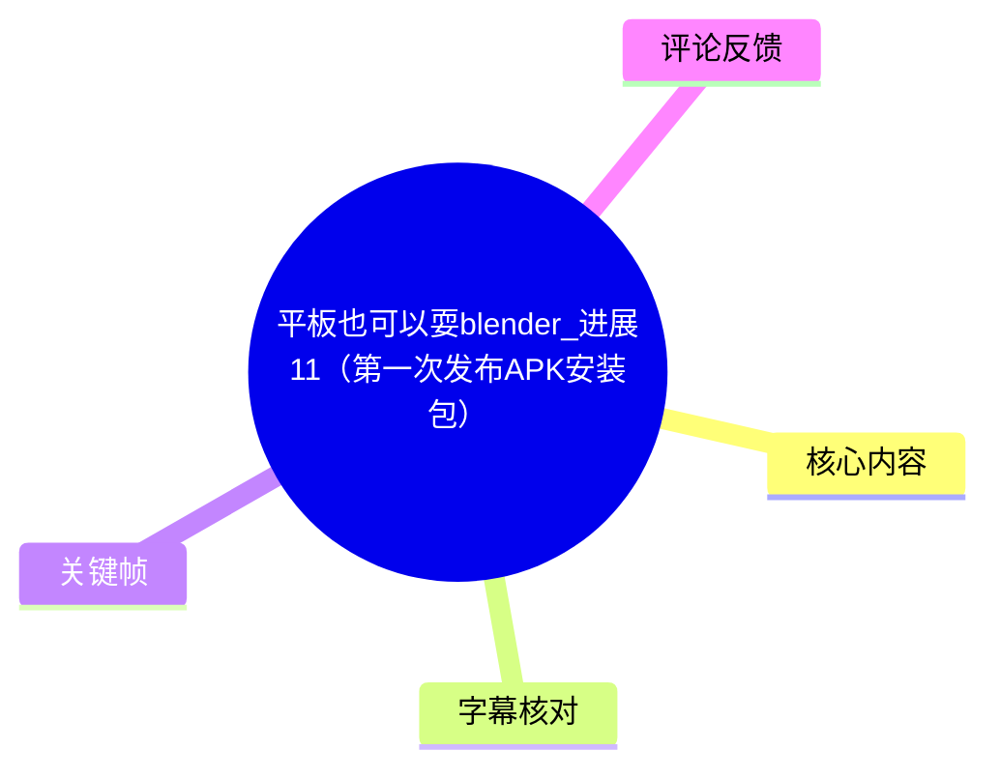
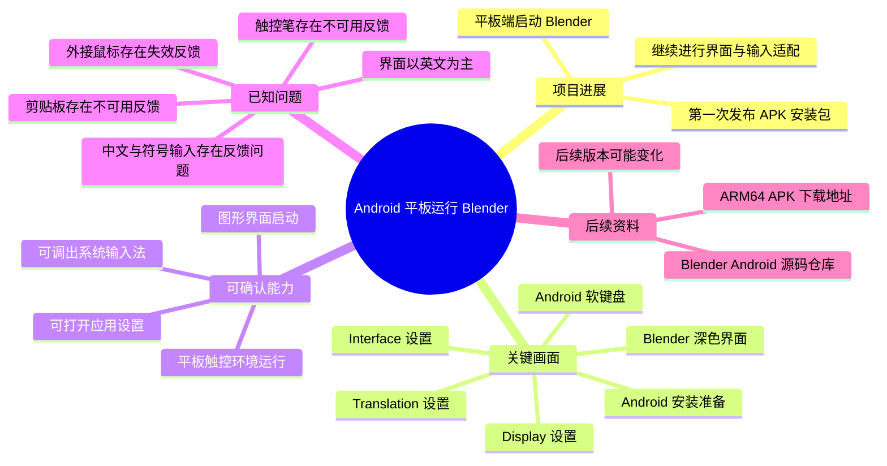
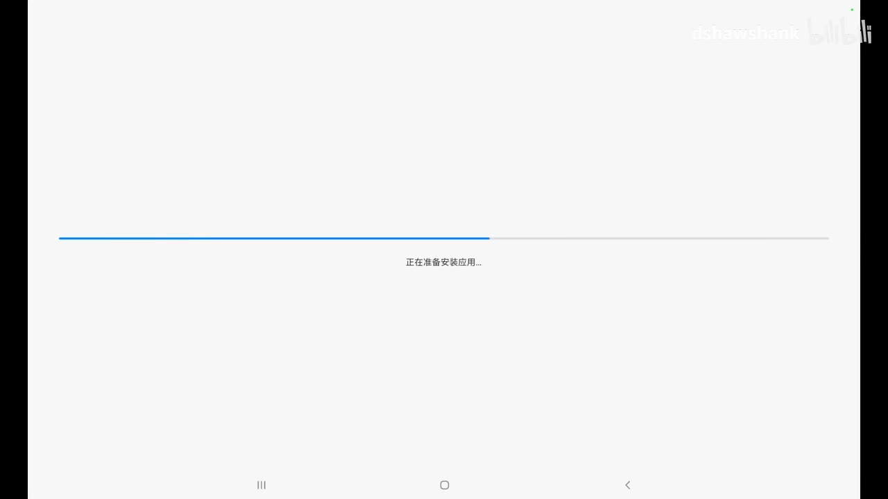
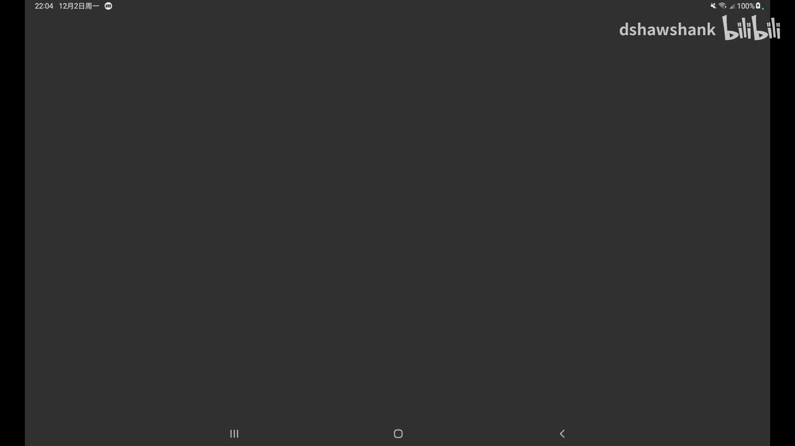
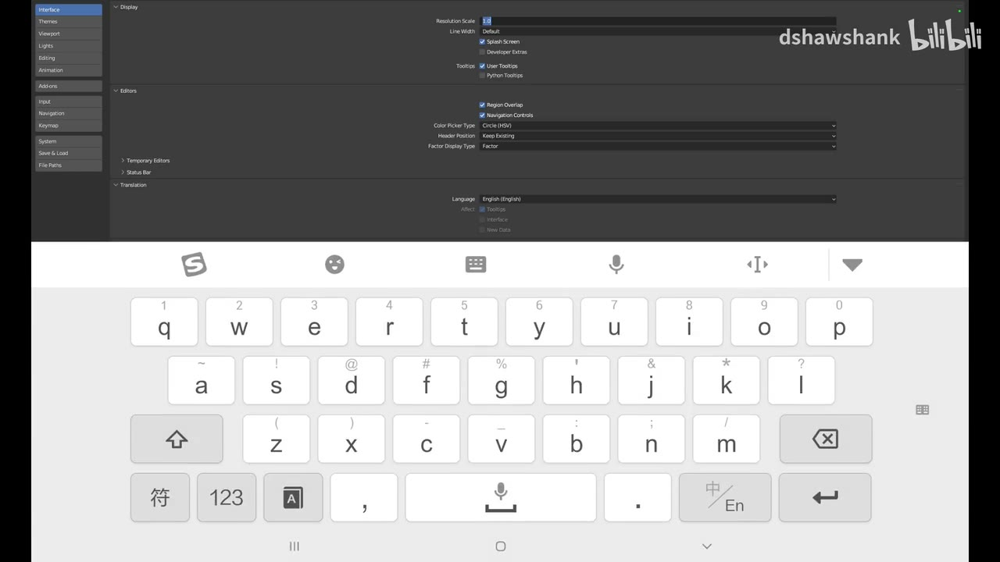
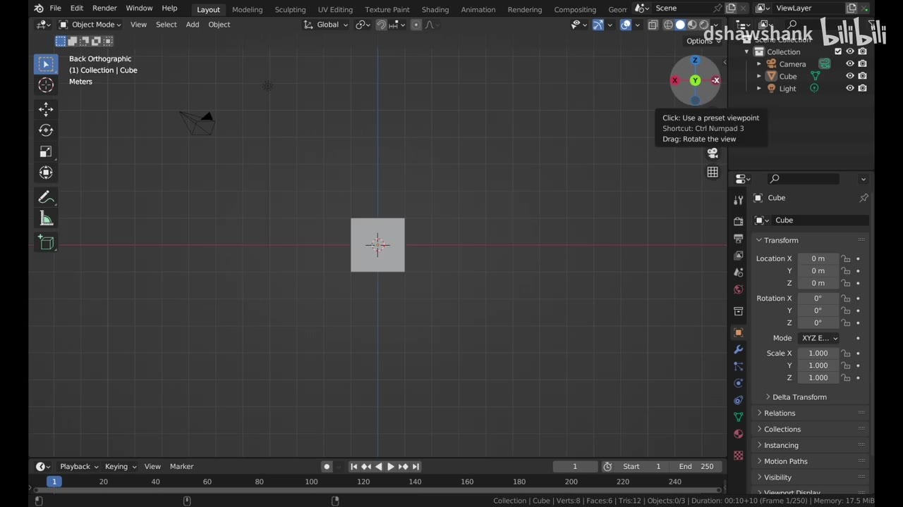

# 平板也可以耍blender_进展11（第一次发布APK安装包）

> 来源：[Bilibili 视频](https://www.bilibili.com/video/BV1UpzyYVEex)  
> UP 主：dshawshank | 发布时间：2024-12-03 | 视频时长：约 41 分 53 秒  
> 素材元数据显示：1920×1080，单 P，视频时长 2513 秒。

## 小结

本期记录的是一个面向 Android 平板的 Blender 移植或适配项目进展，重点节点是“第一次发布 APK 安装包”。从提供的关键帧可以确认，画面包含 Android 平板上的安装流程、启动后的深色界面、Blender 设置页面，以及平板软键盘输入界面。

关键画面显示，应用已经能够在 Android 平板上启动 Blender 图形界面，并进入设置中的 `Interface`、`Display`、`Translation` 等项目。画面还显示了 Android 软键盘覆盖在 Blender 界面下方，说明项目已经进入可运行、可交互和继续调试的阶段，而不只是停留在源码或编译阶段。

目前能够从真实素材确认的限制包括：界面仍以英文为主；软键盘可以弹出，但输入法、中文输入和符号输入是否完整可用，需结合评论中的实际反馈谨慎看待；外接鼠标、触控笔和剪贴板等能力也存在用户反馈问题。素材没有提供完整的安装命令、编译参数、设备型号、Android 版本、Blender 版本或性能测试数据，因此不能补写这些信息。

评论区后续信息显示，作者后来提供了 Android 相关源码仓库和一个 ARM64 APK 下载地址。但这属于评论发布时的后续补充，不应与视频首次发布时的 APK 状态完全等同。

## 思维导图

## 目录

- [项目背景与本期进展](#项目背景与本期进展)
- [从关键帧确认的运行流程](#从关键帧确认的运行流程)
- [Blender 平板界面与输入适配](#blender-平板界面与输入适配)
- [已知问题、限制与使用经验](#已知问题限制与使用经验)
- [后续源码与 APK 信息](#后续源码与-apk-信息)
- [结论与时效性](#结论与时效性)
- [字幕比对](#字幕比对)
- [评论分析](#评论分析)
- [处理记录](#处理记录)

## 项目背景与本期进展 [00:00](https://www.bilibili.com/video/BV1UpzyYVEex?t=0)

视频标题明确将本期定位为项目“进展 11”，并强调“第一次发布 APK 安装包”。结合关键帧，项目目标可以概括为：让 Blender 在 Android 平板环境中以可安装应用的形式运行，并逐步处理移动设备上的界面、输入和交互问题。

与传统桌面 Blender 使用环境相比，Android 平板具有不同的输入和窗口条件：

- 屏幕以触控为主要输入方式；
- 系统可能弹出软键盘并占用部分显示区域；
- 桌面端常见的鼠标、键盘、触控笔和剪贴板行为不一定能直接映射；
- 应用需要适配 Android 的窗口、权限、安装包和设备架构。

素材没有给出项目完整架构、编译过程或具体移植方案，因此这里只记录已被画面和评论直接支持的事实，不把一般性的 Android 开发流程当作本视频已经展示的内容。

## 从关键帧确认的运行流程 [00:00](https://www.bilibili.com/video/BV1UpzyYVEex?t=0)

### 1. Android 端准备安装应用

> 图：关键帧中可见 Android 平板安装界面，中央显示“正在准备安装应用…”，进度条正在推进。该画面是本期“第一次发布 APK 安装包”主题最直接的证据，说明素材至少展示了 APK 安装阶段，而非只有桌面端开发画面。

从该画面可以确认：

- 设备是 Android 平板形态；
- 系统正在处理应用安装；
- 安装流程已经被启动；
- 画面没有显示具体 APK 文件名、版本号、签名信息或安装来源，因此这些参数无法从素材中确定。

### 2. 应用启动后的黑色界面

> 图：关键帧显示大面积深灰或黑色界面，顶部保留 Android 状态栏，右上角可见项目视频水印。该帧有助于说明应用已经从系统安装阶段进入运行或启动阶段，但单凭这一帧无法确认是否正在加载、是否发生卡顿，也不能据此判断启动耗时。

画面中未提供可读的错误信息、崩溃提示或日志，因此不能得出“安装失败”或“运行失败”的结论。它更适合作为启动阶段的视觉记录。

### 3. Blender 界面显示

> 图：关键帧中可以看到 Blender 风格的桌面应用界面和右侧属性设置区域。该图的价值在于确认项目并非只显示 Android 容器，而是已经呈现出 Blender 的实际操作界面。

画面能够辨认出：

- Blender 风格的属性设置页面；
- 左侧设置分类列表；
- 顶部或主体区域的显示选项；
- 平板屏幕下方仍保留 Android 导航区域。

素材没有给出 Blender 版本号、具体构建号或渲染器配置，因此不能将其归入某个具体版本。

## Blender 平板界面与输入适配 [00:00](https://www.bilibili.com/video/BV1UpzyYVEex?t=0)

### 界面设置

> 图：画面可见 Blender 设置中的 `Interface` 分类，主体区域包含 `Display`、编辑器显示、工具提示、导航控件和 `Translation` 等选项。该帧能够帮助读者理解项目已经进入界面适配和设置调试阶段。

关键画面中可以辨认出以下设置项：

- `Interface`
- `Themes`
- `Viewport`
- `Lights`
- `Editing`
- `Animation`
- `Add-ons`
- `Input`
- `Navigation`
- `Keymap`
- `System`
- `Save & Load`
- `File Paths`
- `Display`
- `Resolution Scale`
- `Line Width`
- `Splash Screen`
- `Developer Extras`
- `Tooltips`
- `Region Overlap`
- `Navigation Controls`
- `Color Picker Type`
- `Header Position`
- `Factor Display Type`
- `Translation`
- `Language: English (English)`

这里最重要的可验证信息是：设置页面中的语言显示为英文。画面没有证明中文界面已经可用，也没有显示完整的语言切换结果。

### Android 软键盘

> 图：关键帧显示 Android 软键盘覆盖在 Blender 界面下方，键盘包含字母、数字、符号、麦克风和中英文切换相关按键。该图用于说明移动端输入法已经参与到 Blender 的交互过程中，但不代表所有输入场景都已正常适配。

从画面可见：

- 系统软键盘能够被调出；
- 键盘提供字母和数字输入；
- 键盘带有符号入口；
- 键盘存在中文/英文切换控件；
- 软键盘会压缩或遮挡 Blender 的可视区域。

根据可获取的第三条热评，用户反馈外接键盘无法输入中文和符号，且剪贴板无法使用；第二条热评则反馈中文乱码。评论是用户经验，不等同于视频画面中的统一测试结论，但可以作为项目当时输入适配状态的补充线索。

## 已知问题、限制与使用经验 [00:00](https://www.bilibili.com/video/BV1UpzyYVEex?t=0)

### 界面语言与文字显示

关键帧中的 Blender 设置语言为 `English (English)`，评论中又出现“中文乱码”的反馈。因此当前素材支持的谨慎结论是：

- Blender Android 运行界面至少可以使用英文；
- 中文界面或中文文本显示可能存在兼容性问题；
- 中文是否完全不可用、问题是否只出现在特定字体或输入路径，素材没有进一步说明。

不能仅凭“中文乱码”评论断言所有 Android 设备都会出现同样问题。

### 触控笔

第二条热评反馈“触控笔不能用”，并表示如果中文乱码和触控笔问题解决，体验会进一步提升。该反馈说明至少有用户在实际测试中遇到触控笔不可用问题，但素材没有提供：

- 触控笔品牌和型号；
- 平板型号；
- 是否为主动式触控笔；
- 是完全无响应，还是压感、悬停或特定操作不可用；
- 后续版本是否修复。

因此，触控笔兼容性应视为视频相关项目在当时的已知风险，而不是对所有设备的绝对结论。

### 鼠标与键盘

第三条热评给出的具体问题包括：

- 外接鼠标不起作用；
- 点击、长按等操作没有效果；
- 外接键盘无法输入中文和符号；
- 剪贴板无法使用。

这些问题直接关系到 Blender 的桌面式工作流。即使应用能够启动，若鼠标事件、长按事件、键盘文本输入和系统剪贴板没有正确映射，建模、编辑和脚本输入仍可能受到明显影响。

评论没有说明鼠标和键盘的连接方式，也没有给出设备、系统或应用版本，所以只能作为当时用户反馈记录。

### 与其他运行方式的比较

第二条热评称，测试者认为该版本“比 Linux 模拟器下的 Blender 更流畅”；第三条热评则称，将自己的动画项目放入其中测试，渲染预览体验比在 Termux 中安装 Ubuntu，再安装 ARM 版 Blender 3.6 更好。

这些比较具有以下限制：

- 属于评论者个人体验；
- 没有提供统一场景、帧率、分辨率、文件规模或测试时长；
- 没有提供设备型号与系统版本；
- 不能据此形成普遍性能排名；
- “更流畅”不等于所有功能都更完整。

可迁移的经验是：原生或更直接的 Android 应用形态，可能减少 Linux 模拟器或容器层带来的额外开销；但最终体验仍取决于输入适配、图形后端、文件兼容性和具体硬件。

## 后续源码与 APK 信息 [00:00](https://www.bilibili.com/video/BV1UpzyYVEex?t=0)

可获取的第一条热评由作者本人发布，提供了两项后续资料：

- Blender Android 相关源码仓库：<https://projects.blender.org/epai>
- Android ARM64 APK 下载地址：<https://github.com/dshawshank/APP-android_arm64/releases/download/v0.0.3/blender.on.Android.v0.0.3.apk>

需要区分视频与评论的时间关系：

1. 视频发布时间为 2024-12-03。
2. 作者这条源码与 APK 评论的发布时间戳为 2025-05-26。
3. 下载链接中的文件名包含 `v0.0.3` 和 `android_arm64`，这表明链接指向 ARM64 架构的一个版本，但素材没有提供其完整发布说明。
4. 该后续链接不能证明视频首次发布时已经提供同一版本，也不能保证链接在当前仍然有效。
5. 安装前应核对设备架构、系统兼容性、文件来源和应用签名；本素材没有提供进一步的安全验证结果。

## 方法与实践

### 素材中能够确认的操作顺序

根据关键帧的可见内容，可以整理出以下最小操作链：

1. 在 Android 平板上准备或启动 APK 安装。
2. 等待系统完成应用准备或安装过程。
3. 启动应用并等待界面出现。
4. 进入 Blender 的设置界面。
5. 查看或调整 `Interface`、`Display`、`Translation` 等相关选项。
6. 调出 Android 软键盘，检查移动端文本输入。

以上是画面中可以确认的操作阶段，不是完整的 APK 编译或发布教程。素材没有展示终端命令、Gradle 配置、NDK 参数、Blender 源码修改、签名命令或安装授权步骤，因此不应据此补写一套未经视频验证的构建命令。

### 使用后检查清单

结合关键帧和热评，实际测试时可以重点检查：

| 检查项 | 素材所示或反馈 | 当前结论 |
| --- | --- | --- |
| APK 是否能安装 | 关键帧显示系统正在准备安装 | 至少展示了安装阶段 |
| Blender 是否能启动 | 关键帧显示 Blender 界面 | 可以确认画面中出现 Blender 界面 |
| 界面语言 | 设置页面显示 English | 英文界面可见；中文状态不确定 |
| 软键盘 | 关键帧显示 Android 软键盘 | 系统软键盘可调出 |
| 中文显示 | 热评反馈中文乱码 | 存在用户反馈问题 |
| 中文与符号输入 | 热评反馈外接键盘无法输入 | 存在用户反馈问题 |
| 鼠标 | 热评反馈外接鼠标不起作用 | 存在用户反馈问题 |
| 触控笔 | 热评反馈不能用 | 存在用户反馈问题 |
| 剪贴板 | 热评反馈无法使用 | 存在用户反馈问题 |
| 性能 | 热评称比模拟器方案流畅 | 仅为个人体验，缺少统一基准 |

## 结论与时效性 [00:00](https://www.bilibili.com/video/BV1UpzyYVEex?t=0)

本期最明确的进展不是某个具体建模功能，而是项目已经达到 Android 平板 APK 安装与启动阶段，并且能够显示 Blender 的设置界面。这意味着项目具备了继续验证触控、窗口、输入法和图形交互的基础。

但“能够启动”与“适合生产使用”之间仍有明显距离。当前素材和热评共同显示，中文文字、外接鼠标、外接键盘、触控笔和剪贴板等桌面工作流相关能力仍存在问题或不确定性。对于依赖快捷键、精确指针操作、中文脚本和外部素材管理的用户，这些限制可能比单纯的启动成功更重要。

性能方面，评论者认为该方案比 Linux 模拟器或 Termux + Ubuntu + Blender ARM 方案更流畅，但没有统一测试数据，因此只能作为体验参考。不能把评论中的“更流畅”扩展为所有设备、所有工程和所有渲染任务都更快。

时效性方面，视频发布于 2024 年 12 月，作者在 2025 年 5 月的评论中又补充了源码仓库和 `v0.0.3` ARM64 APK。项目可能已经继续迭代；中文、鼠标、触控笔、键盘和剪贴板问题是否修复，需要以对应仓库和 APK 的最新说明、发行版本及实际设备测试为准。

## 字幕比对

| 字幕来源 | 完整性 | 专有名词 | 时间轴 | 主要问题 |
| --- | --- | --- | --- | --- |
| Bilibili 站内字幕 `p01-ai-zh.srt` | 有完整分段，覆盖约 0:00–26:46 | 大量内容为 iPhone、Apple Intelligence、A18、相机与充电等 | 分段时间格式规范，可换算为秒 | 字幕内容与视频标题、关键帧和评论主题明显不一致，疑似挂载了其他视频字幕 |
| 本次 ASR `asr-result.json` | 无有效语音分段，`sentenceCount=0`、`speechSeconds=0`、`speechCoverage=0` | 未产生可用专有名词 | 没有 ASR 时间段；识别语言标为 `en`，概率 0.6005859375 | ASR 输出为空，并给出“未识别到语音，请检查音轨并重试”的诊断；素材未标记 `noAudioStream=true`，因此不能据此断言源视频没有音轨 |

### 字幕选择与时间轴说明

本次处理确实检查了本次 ASR 结果，但 ASR 没有输出任何字幕或时间段。站内字幕虽然有真实的 `HH:MM:SS,mmm --> HH:MM:SS,mmm` 分段，却在内容层面明显对应另一部 iPhone 评测视频，而不是本视频的 Blender Android 项目。

因此：

- 正文不采用站内字幕的新闻、技术和参数内容；
- 不把站内字幕中的 iPhone 信息当成本视频内容；
- 不使用站内字幕的分段时间为 Blender 操作建立伪精确时间轴；
- 由于 ASR 无有效分段、关键帧清单没有提供对应时间戳，本次只能使用视频起始位置 `t=0` 作为章节链接；
- 章节时间轴不是根据文字顺序推测出的操作时间，实际操作的精确起止时间在现有素材中无法可靠确定。

关键帧与上下文校正的主要依据如下：

- 安装画面确认“APK 安装阶段”；
- Blender 设置画面确认 Android 平板上出现 Blender 界面；
- `Translation` 区域显示英文语言设置；
- 软键盘画面确认移动端输入法参与交互；
- 热评补充中文乱码、触控笔、鼠标、键盘和剪贴板问题；
- 作者热评补充源码仓库和后续 ARM64 APK 地址。

素材中的 `asrSrt` 路径虽存在，但对应的 ASR 结果明确为空；路径存在不代表生成了有效字幕。

## 评论分析

以下仅处理可获取的热评前三条。

### 热评 1：作者提供源码与 APK

- **评论者**：dshawshank
- **点赞数**：78
- **主要内容**：作者称 Blender Android APP 相关源码已放到 `projects.blender.org/epai`，并提供一个 GitHub 上的 ARM64 APK 下载地址。
- **补充价值**：这是对视频后续获取方式的直接补充，说明项目后来至少公开了源码入口和一个可下载构建。
- **可信度与限制**：评论来自作者本人，来源关联度高；但它发布于 2025-05-26，晚于视频发布时间，不能直接代表视频首发时的版本。链接是否仍可用、APK 是否适配当前 Android 版本，素材没有验证。

### 热评 2：与 Linux 模拟器方案比较

- **评论者**：霸极客湾
- **点赞数**：68
- **主要内容**：评论者测试后认为运行很流畅，比 Linux 模拟器下的 Blender 更流畅；同时指出中文乱码和触控笔不能用。
- **补充价值**：提供了实际运行体验，并指出了中文显示和触控笔两个关键限制。
- **可信度与限制**：这是单个测试者的主观体验，没有说明设备、工程、分辨率、帧率或测试方法；“更流畅”不能替代可重复的性能基准。

### 热评 3：动画项目、鼠标、键盘与剪贴板反馈

- **评论者**：LinFeng翷
- **点赞数**：41
- **主要内容**：评论者将自己的动画项目放入应用进行测试，认为渲染预览比 Termux 安装 Ubuntu 再安装 ARM 版 Blender 3.6 的方案更好；但反馈外接鼠标无效、点击和长按无效果、输入法及外接键盘无法输入符号和中文、剪贴板无法使用。
- **补充价值**：比单纯的“能启动”更进一步，涉及实际动画项目和桌面式输入工作流。
- **可信度与限制**：仍属于个人设备和个人项目下的体验；评论没有给出设备、系统、APK 版本和复现步骤，不能确认问题在所有设备上都存在，也不能判断后续是否已修复。

## 处理记录

- **Worker ID**：`worker-msaeho0y-365b05fe`
- **模型**：`gpt-5.6-terra`
- **调用工具与模型**：素材清单提供了合并视频、音频、ASR、站内字幕、关键帧和评论文件；ASR 模型为 `large-v3-turbo`，运行设备为 `cuda`，计算类型为 `int8_float16`。
- **ASR 检查结果**：本次 ASR 识别语言标为 `en`，语言概率为 `0.6005859375`，但没有任何 segments；句子数为 0、语音秒数为 0、语音覆盖率为 0。ASR 诊断要求检查音轨并使用正确音轨重试。素材没有标记 `noAudioStream=true`，所以未将其解释为“源视频没有音轨”。
- **站内字幕检查结果**：检查了 `subtitles/p01-ai-zh.srt`。该字幕有规范时间段，但内容集中在 iPhone 16、Apple Intelligence、相机、芯片、摄影风格、充电和散热，与本视频标题及关键帧中的 Android Blender 安装和设置画面不匹配。
- **字幕选择**：不采用站内字幕正文；ASR 因为空结果也无法采用。正文改以标题、关键帧和可获取的热评前三条为主要依据，并对无法确认的内容明确标注。
- **关键帧选择依据**：从提供的关键帧中选择安装准备画面、Android 深色启动画面、Blender 界面、Blender `Interface/Display/Translation` 设置画面和 Android 软键盘画面，分别用于证明安装阶段、启动阶段、应用界面、语言与界面适配、移动端输入状态。关键帧清单未提供逐帧时间戳，因此没有将文件编号推算为视频时间。
- **时间轴处理**：仅使用可靠的起始时间 `t=0` 建立章节链接；没有用错误站内字幕的时间段伪造 Blender 操作时间轴。
- **评论范围**：仅分析可获取的热评前三条，没有扩展到其他评论。
- **缓存清理**：素材清单未提供缓存清理执行结果；因此不能声称已完成缓存清理，清理状态记为“未提供”。
- **未解决问题**：无法从现有素材确认完整视频语音内容、真实 ASR 字幕、APK 的视频内版本号、编译与签名步骤、设备型号、Android 版本、Blender 版本、性能基准，以及评论中问题在后续版本是否修复。
