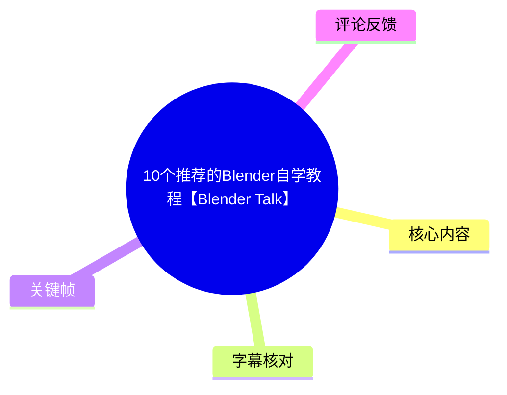
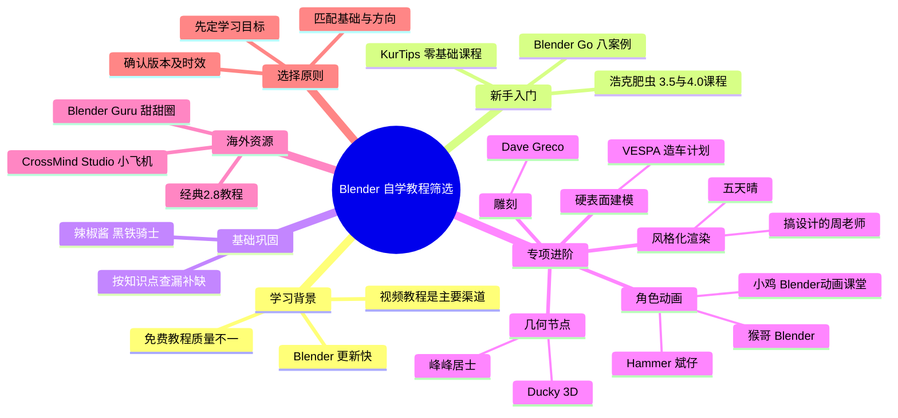
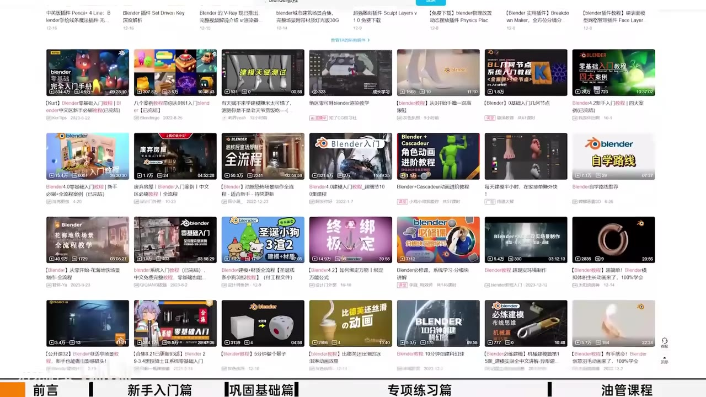
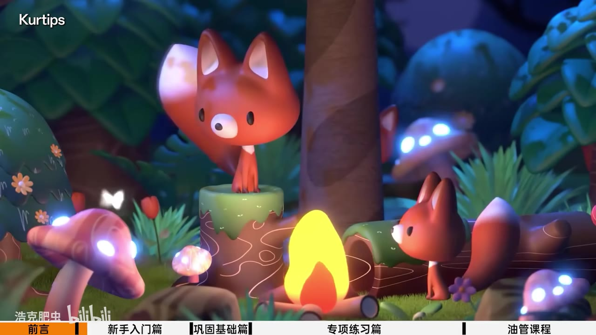
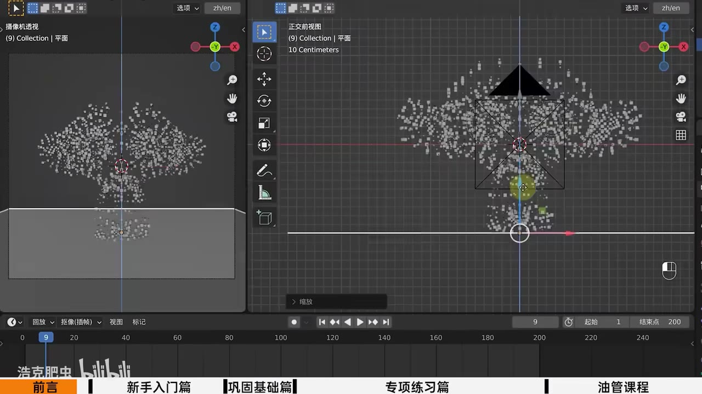

# 10个推荐的Blender自学教程【Blender Talk】

> 来源：[Bilibili 视频](https://www.bilibili.com/video/BV1m5k4YiE2e) 
> UP 主：浩克肥虫｜发布时间：2024-12-21｜视频时长：10:29｜分辨率：1920×1080

## 小结

本期视频不是 Blender 功能教学，而是一份按学习阶段与专项方向组织的教程筛选建议。UP 主浩克肥虫认为，Blender 更新较快、适配版本的书籍不易寻找，视频教程因而成为主要学习渠道；但免费教程的质量、完整性与体系差异很大，初学者容易在零散案例间消耗时间和热情。

推荐路径可概括为：**零基础先用完整案例建立操作感与成就感，入门后用“扫盲式”课程补足知识点，再按照硬表面、角色动画、几何节点、风格化渲染、雕刻、动态图形等方向做专项练习**。视频强调教程排名不分先后，选择应服从个人目标与既有基础。

面向中文新手，视频首先推荐 KurTips（ASR 误识别为 “Great Types”）的零基础课程、Blender Go 的八案例课程，以及 UP 主自身的 Blender 3.5 / 4.0 入门课程；基础巩固阶段则推荐辣椒酱的《黑铁骑士》。这些课程覆盖从基本操作、建模、材质到灯光、动画、合成等不同粒度的内容。

专项部分覆盖较广：硬表面建模可参考 VESPA 造车计划；角色动画包括小鸡 Blender 动画课堂、Hammer 斌仔和猴哥 Blender；几何节点推荐峰峰居士；材质、三渲二和水墨风格可参考搞设计的周老师与五天晴；雕刻方向推荐 Dave Greco；几何节点动态图形方向推荐 Ducky 3D。

视频也补充了 YouTube 学习源：Blender Guru 的甜甜圈教程会随 Blender 版本更新；CrossMind Studio 的小飞机教程主张以七章、七天完成从零到动画小场景的学习；“苹果”和“小蓝车”属于经典但版本较旧的 2.8 教程。这里的“七天学会”“一个月做出甜甜圈”属于视频中转述的课程宣传或经验性说法，不应理解为所有学习者都能在该时间内掌握 Blender。

本视频发布于 2024 年 12 月。涉及 Blender 版本、课程是否持续更新、创作者账号名称、课程是否免费可看及平台可访问性，均可能在后续发生变化；尤其应在学习前自行确认课程对应的 Blender 版本和视频可用状态。

## 思维导图

## 目录

- [背景、问题与推荐原则](#背景问题与推荐原则)
- [新手入门：先建立完整工作流](#新手入门先建立完整工作流)
- [基础巩固：将教程作为知识点手册](#基础巩固将教程作为知识点手册)
- [专项练习：硬表面建模与角色动画](#专项练习硬表面建模与角色动画)
- [专项练习：几何节点、风格化与水墨效果](#专项练习几何节点风格化与水墨效果)
- [海外资源、雕刻与动态图形](#海外资源雕刻与动态图形)
- [可执行的自学路线](#可执行的自学路线)
- [结论、限制与时效性](#结论限制与时效性)
- [关键帧索引](#关键帧索引)
- [字幕比对](#字幕比对)
- [评论分析](#评论分析)
- [处理记录](#处理记录)

## [背景、问题与推荐原则](https://www.bilibili.com/video/BV1m5k4YiE2e?t=0)

### 视频要解决的问题

视频开头指出，很多学习者咨询如何自学 Blender。UP 主基于个人经验整理教程来源，目的是帮助希望快速入门的学习者减少筛选成本。

其对自学环境的判断包括：

1. **Blender 更新速度快**：与版本紧密绑定的纸质书或固定教材较难长期保持适配，因此视频教程成为常见选择。
2. **Bilibili 与 YouTube 是重要渠道**：两者承载了大量免费教程，尤其在 Blender 用户增长后，免费内容显著增加。
3. **教程发布门槛低**：内容数量增加不等于学习质量一致。视频认为常见问题是案例零散、知识体系不完整，学习者可能不知道如何选课。
4. **推荐不是排名**：UP 主明确声明内容仅代表个人见解，推荐顺序不分先后。

因此，这不是“唯一正确的十个教程”清单，而是以学习阶段和专项需求为索引的选课框架。

> 图：画面展示 Blender 相关视频的检索/推荐页面，直观说明平台内容很多且类型杂，正是视频提出“需要筛选教程”的背景。画面底部也标注了“前言—新手入门篇—巩固基础篇—专项练习篇—油管课程”的结构分段。

### 选择教程前的三个判断

视频没有给出统一的学习计划表，但其推荐顺序隐含了以下判断逻辑：

| 判断维度 | 应问的问题 | 对应视频建议 |
| --- | --- | --- |
| 当前基础 | 完全不会操作，还是已完成过完整作品？ | 零基础先学完整入门案例；已入门再用系统课程巩固。 |
| 学习目标 | 想做产品、角色、短动画、风格化画面还是动态设计？ | 在基础阶段后按专项进入硬表面、动画、几何节点、渲染或雕刻。 |
| 教程结构 | 是碎片案例还是完整流程？ | 新手优先选步骤清晰、能完成作品的课程；需要查细节时使用“扫盲式”课程。 |
| 版本匹配 | 教程对应哪个 Blender 版本？ | 旧版课程仍可能有参考价值，但要注意功能位置与版本差异。 |
| 语言能力与渠道 | 能否阅读英文内容？ | 英文能力足够者可看 YouTube；B 站也可能有已翻译的搬运内容。 |

## [新手入门：先建立完整工作流](https://www.bilibili.com/video/BV1m5k4YiE2e?t=82)

### 1. KurTips：零基础入门教程

**视频时间：**[01:22–02:11](https://www.bilibili.com/video/BV1m5k4YiE2e?t=82)

视频首推 KurTips 的 Blender 零基础入门教程。ASR 将名称识别为 “Great Types / Great Typs”，但关键帧左上角可见 “Kurtips”，且热评作者本人以 **KurTips** 账号留言，因此本文采用 KurTips 作为名称。

UP 主将其描述为中文社区中“新手必刷”类型的课程，并以“小狐狸”“戴珍珠的女孩”等典型作品指代课程案例。推荐理由是：

- 实用、容易上手；
- 适合快速掌握 Blender 基本操作；
- 从零开始完成建模；
- 逐步涉及材质、粒子效果、场景搭建、动画、灯光布置与合成；
- 最终能完成自己的作品，适合作为建立正反馈的首套课程。

> 图：画面显示标有 “Kurtips” 的风格化森林狐狸场景。它对应视频提及的“小狐狸”案例，能够说明该课程并非只讲单一命令，而是以可见的完整场景成果驱动入门学习。

### 2. Blender Go：八个案例从零到一

**视频时间：**[02:11–02:35](https://www.bilibili.com/video/BV1m5k4YiE2e?t=131)

第二套推荐是 **Blender Go《八个案例教程带你从零到一入门 Blender》**。视频给出的特点是：

- 用八个小案例帮助学习者从零开始；
- 讲解较细，入门门槛低；
- 创作者具有视觉设计背景，课程会兼顾项目美感；
- 除制作流程外，也会分享项目层面的经验；
- 制作难度相对可控，适合刚开始学习的人。

此类课程的定位是通过多个短项目接触不同基础能力，而不是在一开始就深挖单一专业方向。

### 3. 浩克肥虫：Blender 3.5 入门与 Blender 4.0 零基础入门

**视频时间：**[02:35–03:20](https://www.bilibili.com/video/BV1m5k4YiE2e?t=155)

UP 主也推荐了自己的两套基础课程：

| 课程 | 视频中陈述的覆盖内容 | 视频中说明的适合对象 |
| --- | --- | --- |
| Blender 3.5 入门“10G” | 建模、UV、贴图、灯光、雕刻、渲染、骨骼绑定、物理模拟等 | 特别适合游戏从业者学习 |
| Blender 4.0 零基础入门 | 基础知识体系，并包含动画内容 | 想以 Blender 4.0 为基础开始学习的人 |

UP 主认为，若能扎实完成这两套课程，基本可以掌握他所指的 Blender 基础体系。此处是创作者对自有课程的评价，学习者仍应以课程实际章节、目标方向与可投入时间来判断是否适合。

> 图：关键帧显示 Blender 双视图与时间线，场景中存在大量点状对象/粒子效果。它有助于对应视频在新手课程中列举的粒子效果、场景组织与动画时间线等基础工作流，而非仅停留在建模操作。

## [基础巩固：将教程作为知识点手册](https://www.bilibili.com/video/BV1m5k4YiE2e?t=203)

### 辣椒酱《黑铁骑士》

**视频时间：**[03:23–03:48](https://www.bilibili.com/video/BV1m5k4YiE2e?t=203)

对于“已经基本入门、希望巩固基础”的学习者，视频推荐辣椒酱的《黑铁骑士》课程。UP 主对其定位不是快速完成一个作品，而是更接近系统复习和查询：

- 课程逻辑严谨；
- 属于“扫盲式”教学；
- 对 Blender 的知识点与细节参数有较详细的介绍；
- 适合喜欢追究原理、细节与命令含义的人；
- 遇到不会的命令时，可作为“速查手册”。

这反映出两个不同阶段的学习材料分工：

1. **案例课**解决“能不能做出东西”的问题；
2. **系统课/手册型课程**解决“为什么这样做、参数会带来什么后果”的问题。

### 巩固阶段的使用方式

视频没有给出具体练习作业。结合其“速查手册”定位，较贴合原意的使用方法是：

1. 已完成至少一个零基础案例后，再进入系统性巩固；
2. 遇到不理解的操作、命令或参数时，按知识点回查，而不是只机械复刻；
3. 将反复出现的概念与自己的项目问题对应，例如建模拓扑、材质设置、绑定或渲染参数；
4. 基础不牢时，暂缓进入复杂专项项目，以降低只会跟做、不理解流程的风险。

## [专项练习：硬表面建模与角色动画](https://www.bilibili.com/video/BV1m5k4YiE2e?t=231)

### 1. VESPA 造车计划：硬表面建模

**视频时间：**[03:51–04:39](https://www.bilibili.com/video/BV1m5k4YiE2e?t=231)

针对硬表面建模，UP 主推荐自己的 **VESPA 造车计划**。视频称其来自去年直播录制，**总时长约 10 小时**，以从一个 Box（基础立方体）开始制作一辆小摩托为主线。

视频列举的课程价值包括：

- 讲解硬表面建模的完整流程与制作技巧；
- 不只展示建模结果，也分享职业设计师接到项目后的思考与执行方法；
- 强调摩托车细节没有省略；
- 为摩托车制作了绑定，可用骨骼控制整体扭动动画，从而方便后续做动画。

对于此类课程，重点不应只放在“完成摩托车”，还应关注从参考、拆分、形体搭建、细节处理到绑定/动画准备的流程意识。视频没有展示具体快捷键、拓扑规范或建模参数，因此不应从该视频推断其具体技术实现。

### 2. 小鸡 Blender 动画课堂：角色动画进阶

**视频时间：**[04:39–05:03](https://www.bilibili.com/video/BV1m5k4YiE2e?t=279)

角色动画方向，视频推荐“小七小七我爱你”的动画课堂；不过热评整理为 **小鸡 Blender 动画课堂**，与 ASR 的“小七”不一致。由于站内字幕缺失且素材未提供创作者主页，本篇保留该名称差异，不将其强行视为已完全校正的同一账号。

视频对该课程的评价是：

- 创作者具有较多行业经验；
- 经验和思路清晰；
- 对设计/动画的底层逻辑阐释到位；
- 有很多免费课程；
- 但相对需要一定基础才能看懂。

这意味着它更适合基础巩固后、希望理解角色动画思路的学习者，而不是完全没有 Blender 操作经验的新手。

### 3. Hammer 斌仔：角色动画从零到一

**视频时间：**[05:03–05:51](https://www.bilibili.com/video/BV1m5k4YiE2e?t=303)

视频还推荐 **Hammer 斌仔**的《角色动画从零到一入门教程》。ASR 对名称识别存在“宾仔/宾载”等误差，热评写作 “hamburn 斌仔”；本文按口播可辨识部分记录为 Hammer 斌仔，并保留待核对状态。

视频认为其特点是：

- 偏向 IP 动画；
- 会讲人物建模、骨骼绑定与权重；
- 包含一个动画角色的全流程；
- 对 IP 模型和动画制作做了有效简化；
- 因而比较适合新手。

这里的“简化”意味着课程可能降低了初学者完成角色动画的前置复杂度，但不代表其能够代替更深入的角色拓扑、绑定变形、运动规律和表演训练。

### 4. 猴哥 Blender：短小动画案例

**视频时间：**[05:51–06:16](https://www.bilibili.com/video/BV1m5k4YiE2e?t=351)

动画入门部分，视频推荐猴哥 Blender 的教程，特别点名其“Blender 零基础小动画入门教程”。推荐理由包括：

- 内容小巧、条理清晰；
- 讲解有趣；
- “懒人教程”能在数分钟内呈现一个小案例；
- 教学简单、容易上手。

它适合用作短周期练习素材，但视频前文也提醒免费案例可能零散。因此，更合理的用法是：在完成一套系统入门课后，用这些短案例练习镜头、关键帧、简单物体动画或小场景表达，而非将其单独当作全部动画知识体系。

## [专项练习：几何节点、风格化与水墨效果](https://www.bilibili.com/video/BV1m5k4YiE2e?t=376)

### 1. 峰峰居士：几何节点入门与几何原理

**视频时间：**[06:16–07:04](https://www.bilibili.com/video/BV1m5k4YiE2e?t=376)

视频将几何节点视为 Blender 的重要组成部分，并推荐峰峰居士的内容。UP 主称这位创作者也是其社群中多位学习者推荐的设计师。

视频点名的课程/内容包括：

- 《Blender 3.0 几何节点小白入门》；
- 几何原理相关教程；
- 多个独立的几何节点小案例。

其特点是逻辑讲解通俗易懂，案例短小精悍、不复杂，且兼具实用性与视觉效果。对于几何节点初学者，视频的隐含顺序是先建立节点与几何逻辑的理解，再练独立案例，而非直接堆叠复杂节点网络。

### 2. 搞设计的周老师：材质、风格化渲染与水墨

**视频时间：**[07:04–07:28](https://www.bilibili.com/video/BV1m5k4YiE2e?t=424)

视频认为风格化渲染和“三渲二”是 Blender 的强项，并推荐“搞设计的周老师”的内容：

- 一套 Blender 材质全面入门教程；
- 多个水墨风格教程；
- 包含适合风格化倾向创作的有趣技巧。

其中“三渲二”通常指以三维场景/模型为基础，输出接近二维动画、插画或卡通视觉的渲染表达。视频并未说明具体使用 Eevee、Cycles、合成器或某种节点配置，因此应将其理解为课程方向，而非确定的技术配方。

### 3. 五天晴：水墨风插件与皮影效果尝试

**视频时间：**[07:28–07:59](https://www.bilibili.com/video/BV1m5k4YiE2e?t=448)

视频将五天晴称为“水墨大咖”，并陈述以下信息：

- 对方是清华美院博士；
- 自主研发了 Blender 水墨风格插件；
- UP 主认为插件效果出色；
- 其当时的最新动态是尝试制作皮影戏效果的插件；
- 按对方自述，插件约 90% 的代码由 AI 协助完成。

上述学历、插件开发状态和 AI 辅助代码比例均为视频转述或创作者自述，本文未对外部资料进行独立核验。UP 主还以调侃方式表达了对“设计师是否也要卷代码”的焦虑，并提到自己看过 Python 但没有弄明白；这属于个人感受，不构成学习 Blender 必须掌握 Python 的结论。

## [海外资源、雕刻与动态图形](https://www.bilibili.com/video/BV1m5k4YiE2e?t=481)

### 1. YouTube 资源与语言条件

**视频时间：**[08:01–08:25](https://www.bilibili.com/video/BV1m5k4YiE2e?t=481)

视频建议英语能力足够的学习者可在 YouTube 寻找 Blender 教程，也提到 B 站存在有价值的 YouTube 搬运与翻译内容。这里存在现实限制：

- 海外平台访问条件、版权状态与搬运视频可用性会变化；
- 翻译搬运的完整性、版本与授权状态不在本视频验证范围内；
- 对英文教程而言，界面操作可跟随，但专业术语、设计思路与讲解细节仍需要一定语言理解能力。

### 2. Blender Guru：甜甜圈教程

**视频时间：**[08:01–08:49](https://www.bilibili.com/video/BV1m5k4YiE2e?t=481)

视频称 Blender Guru 的甜甜圈教程是 YouTube 上经典的 Blender 入门教程，并给出两个关键信息：

- 课程会随 Blender 版本更新；
- 截至视频口播时，已更新到 **Blender 4.0** 版本。

UP 主还说“扎实学习一个月就能做出漂亮的甜甜圈”。这是对课程学习成果的鼓励性判断，并非可验证的统一学习时长标准。学习速度会受电脑性能、既有三维基础、练习密度和是否独立复做影响。

### 3. CrossMind Studio：小飞机教程

**视频时间：**[08:25–09:14](https://www.bilibili.com/video/BV1m5k4YiE2e?t=505)

视频接着推荐一个小飞机教程。ASR 将频道识别为 “Groftman Studio”，而热评整理为 **CrossMind Studio**；两者不一致。由于无站内字幕和频道页面素材，本文采用热评给出的 CrossMind Studio 作为较可能的校正，但标记为**需在实际检索时复核**。

视频中对该教程的转述为：

- 宣称七天内可以学会 Blender；
- 一共七个章节；
- 从零基础命令开始；
- 最后完成一个动画小场景。

建议将“七天学会”理解为课程的项目节奏或宣传表达，而不是对 Blender 掌握程度的保证。

### 4. 苹果与小蓝车：旧版本经典教程

**视频时间：**[08:49–09:14](https://www.bilibili.com/video/BV1m5k4YiE2e?t=529)

视频还提到“扎克大神”的苹果和小蓝车教程，并指出：

- 这是经典教程；
- 缺点是版本较老，为 Blender **2.8** 教程；
- UP 主认为 Blender 自 2.8 后界面保持一致，因此仍有参考价值。

需要谨慎理解“界面保持一致”：这最多说明总体交互框架存在延续性，不表示所有菜单位置、工具行为、渲染器特性、几何节点能力与默认参数完全相同。学习旧教程时，应把重点放在流程、造型和问题解决方法，并针对当前版本自行查找变化的命令。

### 5. Dave Greco：雕刻

**视频时间：**[09:14–09:38](https://www.bilibili.com/video/BV1m5k4YiE2e?t=554)

雕刻方向，视频推荐 “Deep Corico” 的教程，热评则写作 **Dave Greco**。考虑到热评中对多个教程名称进行了集中整理，本文以 Dave Greco 作为较可能的名称，但仍需在检索时核实。

视频对该创作者的评价集中在角色雕刻能力：

- UP 主称其为自己见过的 Blender 雕刻角色中非常流畅的一位设计师；
- 推测对方可能曾从事 ZBrush 雕刻，后转向 Blender；
- 认为其造型能力与人体解剖理解很透彻；
- 建议希望深入学习雕刻的用户观看。

“曾是 ZBrush 雕刻师”是 UP 主的推测，而非视频中已证实的履历信息；应与其作品能力评价区分开来。

### 6. Ducky 3D：几何节点动态图形

**视频时间：**[09:38–10:02](https://www.bilibili.com/video/BV1m5k4YiE2e?t=578)

对于几何节点动态图形，视频推荐 Ducky 3D 的内容，并称 B 站存在搬运版本。UP 主认为该频道对案例和教程有较好的论述，特别可能帮助 **从 C4D 转向 Blender** 的学习者。

这一建议的适用范围较明确：已有动态图形、程序化设计或 C4D 工作流经验的人，通常更容易理解“节点驱动”的思维；纯新手仍应先掌握 Blender 基础操作、对象/集合管理、材质和动画时间线等基础。

## [可执行的自学路线](https://www.bilibili.com/video/BV1m5k4YiE2e?t=602)

以下路线依据视频的推荐层级重新组织，不额外假定课程时长或具体作业要求。

### 阶段一：选择一个完整的新手案例

可从 KurTips、Blender Go 或浩克肥虫的零基础课程中选择一套主课程。核心目标不是“看完最多视频”，而是至少完成一个包含多个环节的作品。

建议关注的基础环节来自视频列举：

- 基本操作与对象编辑；
- 建模；
- 材质与贴图；
- 灯光；
- 场景搭建；
- 简单动画；
- 粒子效果；
- 合成；
- 视个人方向接触 UV、雕刻、绑定、物理模拟。

### 阶段二：用系统课程巩固薄弱点

完成第一个项目后，可使用《黑铁骑士》这类讲解细节更充分的课程回补知识点。此阶段的目标是将“跟着做过”变成“知道如何调整”。

可按问题驱动回查：

1. 不理解一个命令或参数时，先明确自己在做建模、材质、动画还是渲染；
2. 查询该知识点的概念与参数含义；
3. 在自己的小场景中更改一个变量并观察结果；
4. 将有效设置记录为个人笔记，而不要只保存截图。

### 阶段三：只选一个专项方向做完整练习

视频列出的专项方向及对应候选资源如下：

| 目标方向 | 视频推荐资源 | 适合切入点 |
| --- | --- | --- |
| 硬表面建模 | VESPA 造车计划 | 想练产品、交通工具、机械物件的形体与完整制作流程 |
| 角色动画 | 小鸡 Blender 动画课堂、Hammer 斌仔 | 已具备基础，或希望从简化 IP 动画流程入门 |
| 短小动画 | 猴哥 Blender | 需要短周期、小案例练习 |
| 几何节点 | 峰峰居士 | 想理解程序化几何、节点逻辑与独立小案例 |
| 材质、三渲二、水墨 | 搞设计的周老师、五天晴 | 希望创作非写实、风格化视觉效果 |
| 雕刻 | Dave Greco | 希望深入角色造型和人体解剖理解 |
| 几何节点动态图形 | Ducky 3D | 有 C4D / 动态设计背景，或要进入节点动态图形 |

### 阶段四：以项目目标约束学习范围

热评中“先定一个可实现的目标”的建议，与视频“按需要选择合适教程”的结论一致。一个可操作的目标应包含：

- **成果边界**：例如完成一个三渲二角色、一辆可动的小摩托，或一个小动画场景；
- **技术边界**：只覆盖本项目必要的建模、材质、绑定、动画或节点知识；
- **复做要求**：跟做结束后，在不看教程或只看笔记的情况下重新做关键部分；
- **版本记录**：注明所用 Blender 版本，避免旧教程的界面差异干扰复现；
- **复盘问题**：记录哪些是看教程会做、离开教程就不会的环节，并回到系统课程补足。

## [结论、限制与时效性](https://www.bilibili.com/video/BV1m5k4YiE2e?t=602)

### 可迁移的经验

1. **不要把碎片案例当成完整知识体系。** 短案例适合练习和建立兴趣，但需要由一门主线入门课或系统课程承接。
2. **课程选择应服务于目标。** 硬表面、角色动画、雕刻、几何节点与风格化渲染所需的能力不同，过早同时追多个方向容易造成学习负担。
3. **“完成作品”与“理解参数”需要不同材料。** 前者适合案例式课程，后者适合逻辑严谨、可查询的系统讲解。
4. **旧教程可学流程，需核对当前版本操作。** 2.8 之后的界面延续性不能替代对版本差异的实际确认。
5. **学习时长宣传不可直接套用。** 七天、一个月等说法受学习基础与练习强度影响很大。

### 视频本身的限制

- 推荐基于 UP 主个人经验，且明确声明不代表客观排名；
- 视频没有提供每门课程的链接、价格、更新时间、完整目录和授权状态；
- 多个创作者名称在 ASR 中出现识别错误，部分经热评和关键帧校正，但仍有待检索确认的项目；
- 视频重点是资源推荐，不包含可直接复现的 Blender 参数、快捷键、节点树或工程文件；
- 对五天晴插件、AI 协助代码比例、创作者履历等信息，主要是口播转述，没有在本素材内提供独立证据；
- YouTube 及 B 站搬运课程的可访问性、版本和翻译质量具有平台时效性。

### 时效性说明

视频发布于 **2024-12-21**，口播中“Blender Guru 甜甜圈教程已更新到 4.0”反映的是当时状态。到当前资料抓取时间（2026-08-01），Blender 版本和课程更新情况可能已变化；开始学习前应核验：

- 课程目标版本；
- 当前 Blender 中对应功能的名称和位置；
- 视频是否仍可访问；
- 课程是否仍免费；
- 转载/翻译课程是否完整、是否具备合法授权。

## [关键帧索引](https://www.bilibili.com/video/BV1m5k4YiE2e?t=0)

> 素材仅提供关键帧文件路径，未附每帧精确提取时间；因此正文中不为图片虚构时间点，而以其画面内容与对应口播主题作为选用依据。

| 关键帧 | 使用位置 | 画面价值 |
| --- | --- | --- |
|  | 背景与问题 | 展示大量 Blender 教程并存的检索环境，说明筛选需求。 |
|  | 新手入门 | 对应建模之外的粒子、视图、时间线等软件工作流内容。 |
|  | KurTips 推荐 | 直接展示口播提及的风格化“小狐狸”成果，使课程案例更具象。 |

## [字幕比对](https://www.bilibili.com/video/BV1m5k4YiE2e?t=0)

| 字幕来源 | 完整性 | 专有名词 | 时间轴 | 主要问题 |
| --- | --- | --- | --- | --- |
| Bilibili 站内字幕 | 未提供可用站内字幕 | 无法评估 | 无法使用 | 素材明确标注“未提供可用站内字幕”。 |
| 本次 ASR 字幕 | 较完整：29 段，覆盖约 616.75 秒，语音覆盖率 98.11% | 存在多处误识别 | 可用：SRT 提供毫秒级起止时间 | 英文频道名、人名、术语和部分汉字识别错误，如 Great Types、Groftman Studio、Deep Corico、谷歌绑定等。 |

### 最终字幕选择与校正

本次没有可用站内字幕，因此正文的时间轴以 **本次 ASR SRT** 为准；ASR 诊断显示存在音频流，语言识别为中文（置信度约 0.9985），未标记 `noAudioStream=true`，故不存在“源视频没有音轨”的情况。

ASR 的时间覆盖较完整，适合用于章节定位；但专有名词不宜原样采信。本文根据关键帧、热评整理和上下文进行了以下有限校正：

| ASR 原文/疑似误识别 | 正文采用写法 | 校正依据与置信度 |
| --- | --- | --- |
| Great Types / Great Typs | KurTips | 关键帧左上角显示 “Kurtips”，且热评第二条来自 KurTips 账号。高。 |
| 谷歌网定 | 骨骼绑定 | 与 Blender 基础课程覆盖项及后文“绑定”语境吻合。高。 |
| 硬标面 | 硬表面 | Blender 常用术语与上下文。高。 |
| 几合节点 / 几和节点 | 几何节点 | Blender 常用术语与上下文。高。 |
| 小七小七我爱你 | 小鸡 Blender 动画课堂（待核） | 热评汇总写为“小鸡 blender动画课堂”，但与 ASR 不一致。中低。 |
| Hammer 宾仔 / 宾载 | Hammer 斌仔（待核） | ASR 可辨识 “Hammer”，热评写作 “hamburn斌仔”。中。 |
| Groftman Studio | CrossMind Studio（待核） | 热评写作 CrossMindStudio，与 ASR 不一致。中低。 |
| Deep Corico | Dave Greco（待核） | 热评写作 DaveGreco，与 ASR 不一致。中低。 |
| 三宣二 | 三渲二 | Blender/CG 领域惯用表达。高。 |
| 水m / 水墨er | 水墨 | 上下文为水墨风格、插件与皮影效果。高。 |

未能通过现有素材确认的频道名称已在正文保留不确定性，未将热评内容视作已独立验证的事实。

## [评论分析](https://www.bilibili.com/video/BV1m5k4YiE2e?t=602)

> 仅处理素材中可获取的热评前三条。评论是用户观点或整理信息，不等同于已核验的课程资料。

### 1. 辉太郎动画：按阶段重整视频清单

- **点赞数：**1605
- **核心观点：**将视频涉及资源整理为“入门篇—巩固篇—专项练习—YouTube”四组，降低观众回看和检索成本。
- **补充价值：**评论明确写出 KurTips、Blender Go、辣椒酱《黑铁骑士》、VESPA 造车计划、峰峰居士、五天晴、Blender Guru、CrossMind Studio、Dave Greco、Ducky 3D 等名称。本文对若干 ASR 人名/频道名的校正部分参考了这份整理。
- **可信度与限制：**评论与视频口播的大方向一致，但其中“小鸡 Blender 动画课堂”“CrossMind Studio”“Dave Greco”等名称与 ASR 存在差异，仍应在平台搜索和原视频画面中复核，不能仅凭评论完全确认。

### 2. KurTips：对推荐表示感谢

- **点赞数：**620
- **核心观点：**KurTips 账号留言感谢 UP 主推荐。
- **补充价值：**该留言与画面中的 “Kurtips” 标识互相印证，使 ASR 中 “Great Types” 的识别错误得到较强校正。
- **可信度与限制：**这能较有力地支持“视频第一项推荐的是 KurTips”这一结论，但评论本身不提供课程版本、链接或内容更新状态。

### 3. Rsir涬：先设定可实现目标，再逐步扩展技能

- **点赞数：**316
- **核心观点：**自学最重要的是先设定可实现目标。评论者以“独立制作一个三渲二角色”为目标，学习路径从 MMD 模型导入与角色制作分析，逐步扩展到骨骼、动作、PBR 渲染、材质和几何节点动效。
- **补充价值：**该经验与视频的阶段式推荐形成呼应：不必一开始学习所有功能，而是从明确作品目标倒推所需知识。
- **可信度与限制：**这是个人学习经历，不代表所有人都应从 MMD 或三渲二角色开始；其价值在于目标拆解思路，而不是具体技术路线的普适性。

## [处理记录](https://www.bilibili.com/video/BV1m5k4YiE2e?t=0)

- **Worker ID：**worker-msaehvue-e0b94e0c
- **模型：**gpt-5.6-terra
- **调用工具与模型：**素材处理链已提供音频提取、关键帧提取、ASR、元数据及热评结果；ASR 模型为 `large-v3-turbo`，运行设备为 CUDA，计算类型为 `int8_float16`。
- **使用的素材：**`merged.mp4`、`audio/audio.wav`、`asr/transcript.srt`、`asr/asr-result.json`、关键帧目录 `frames/`、热评文件 `comments/comments.json`、视频元数据。
- **字幕选择：**未提供可用 Bilibili 站内字幕；检查并采用本次 ASR SRT 的真实分段时间。ASR 共 29 段，首段为 00:00:00.240，末段为 00:10:27.730，时间轴链接均按 SRT 起始时间换算为秒。
- **关键帧选择依据：**选取教程检索页（`frame-001`）说明信息过载与筛选背景；选取 Blender 工作界面（`frame-003`）对应新手课程覆盖的软件实践；选取 KurTips 狐狸场景（`frame-004`）对应口播中的代表案例。素材未提供关键帧的精确时间戳，故未为图片虚构时间。
- **专有名词处理：**优先依据关键帧可见文字、热评中的集中整理和 Blender 领域术语校正 ASR；对无法充分确认的“小鸡 Blender 动画课堂 / Hammer 斌仔 / CrossMind Studio / Dave Greco”保留待核标记。
- **缓存清理：**未提供缓存清理执行日志；本文未声称已执行或完成缓存清理。
- **未解决问题：**未获得站内字幕、课程链接、频道主页和关键帧精确时码；部分英文人名及频道名只能做上下文校正，无法在当前素材内完成独立验证。

## 评论分析

- 热评 1：（全是b站的） 入门篇-krutips的小狐狸，blendergo的八个案例带你从0到1，肥虫的零基础入门 巩固篇-辣椒酱的黑铁骑士 专项练习-vespa造车计划（硬表面建模），小鸡blender动画课堂（角色动画），hamburn斌仔的角色动画0到1入门教程（角色动画），猴哥blender的零基础小动画入门教程（动画入门），峰峰居士的几何节点小白入门和几何原理（几何节点），搞设计的周老师，五天晴（风格化渲染、三渲二，水墨风） （YouTube） blenderGuru的甜甜圈，CrossMindStudio的小飞机 DaveGreco（雕刻） Ducky 3d（几何节点动态）
- 热评 2：今天才刷到这个，谢谢肥虫老师的推荐
- 热评 3：自学最重要的还是先定一个可实现的目标 我当初最开始就是为了能独立弄一个三选二角色自学的 期间从mmd模型导入，到解析mmd角色的制作，再到骨骼，动作，然后学pbr的渲染中逐渐弄明白材质制作，最后为了实现一些动效学几何节点，过程循序渐进，还是很有趣的[doge]

以上内容是观众反馈摘录，只用于补充理解视频反响，不作为正文事实依据。
