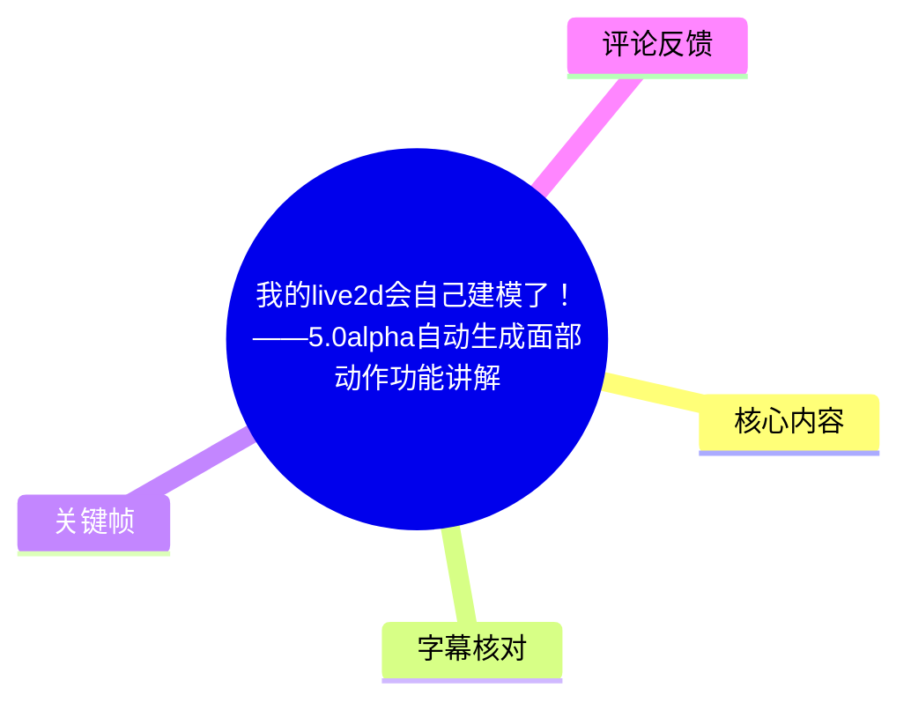
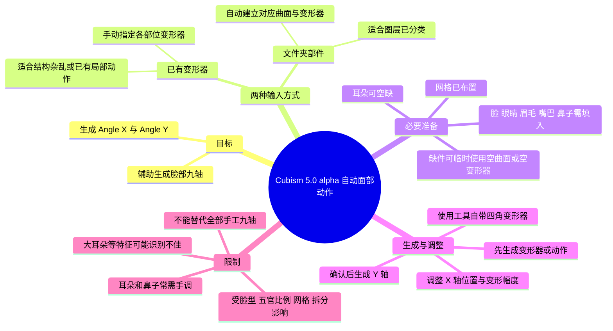
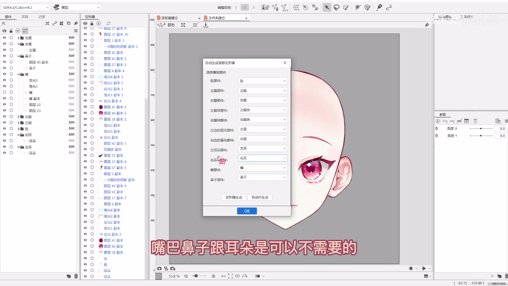
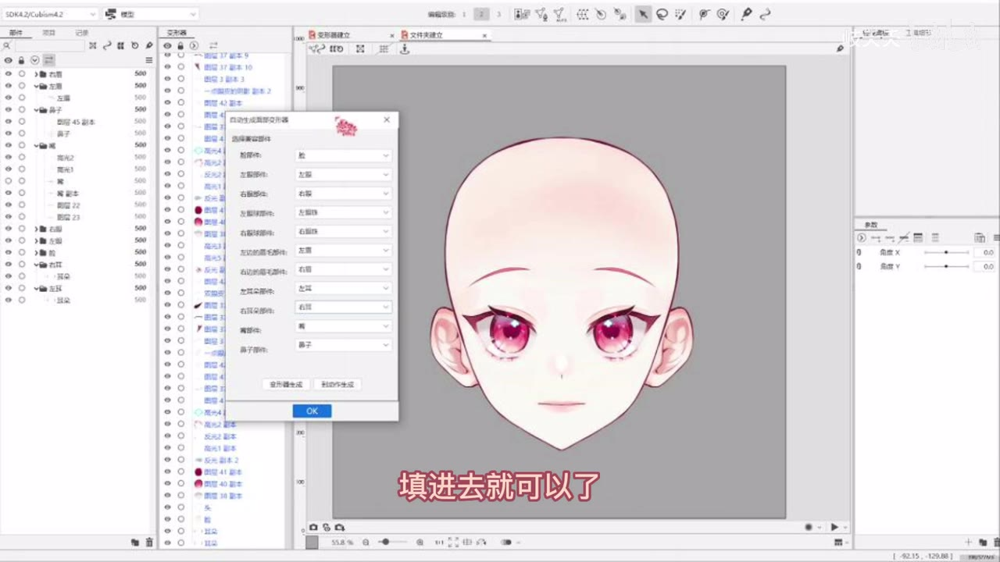

# 我的live2d会自己建模了！——5.0alpha自动生成面部动作功能讲解

> 来源：[Bilibili 视频](https://www.bilibili.com/video/BV1RT411q7ej) 
> UP 主：岐夭夭｜发布时间：2023-03-31｜视频时长：10:05｜分辨率：3840×2160  
> 主题：Cubism 5.0 alpha 的“自动生成面部动作”功能，用于辅助生成脸部九轴（Angle X / Angle Y）动作。

## 小结

视频讲解 Live2D Cubism 5.0 alpha 中的自动面部动作生成功能。UP 主将其分为两条工作流：**以文件夹中的部件为输入生成**，或在已有结构的基础上，**直接以变形器为输入生成**。两种方式都能自动建立并生成脸部的 X、Y 方向动作。

文件夹工作流适合已按脸、双眼、眼球、双眉、双耳、嘴、鼻等部位整理图层的模型。操作时需要在“自动生成面部动作”窗口中为各槽位指定对应文件夹；其中脸、眼睛、眉毛、嘴巴、鼻子是生成所需的基础项，耳朵可留空。若素材本身缺少某些必要部件，可以临时创建空曲面或空变形器填入槽位，生成结束后再删除。

变形器工作流适合图层结构较乱、未按部件建立文件夹，或已经为眨眼、张嘴等局部动作套好变形器的项目。此时需要记住并手动选择对应变形器；尤其应注意工具中的左右按**模型自身的左右**理解，而非观看者面对画面时的左右。UP 主的示例因自身命名方向相反，出现了“左眼槽位选右眼变形器”等对应关系，说明不能机械照搬名称，必须核对实际模型方向。

自动生成并非“一键完成九轴”。生成效果会受头部轮廓、五官比例、拆分质量和网格状态影响；耳朵位置、鼻子变形等局部问题仍需手动修正。UP 主认为该功能足以减少九轴制作中的部分重复工作，但不可能自动得到所有脸型上的完美角度，也未将其描述为能完全取代手工建模。

本视频发布于 2023 年 3 月，讨论对象明确为 **Cubism 5.0 alpha** 阶段功能。功能入口、名称、算法表现和正式版限制都可能已随之后的软件版本变化；实际使用应结合 UP 主简介中给出的官方 5.0 说明专栏与当前版本文档核对。

## 思维导图

## 目录

- [背景、功能范围与前置条件](#背景功能范围与前置条件)
- [文件夹部件工作流](#文件夹部件工作流)
  - [部件映射与必填项](#部件映射与必填项)
  - [自动生成 X/Y 动作及调整](#自动生成-xy-动作及调整)
  - [四角变形器与透视效果](#四角变形器与透视效果)
- [变形器工作流](#变形器工作流)
  - [适用情形与左右方向](#适用情形与左右方向)
  - [按变形器生成和修正](#按变形器生成和修正)
- [效果、限制与可迁移经验](#效果限制与可迁移经验)
- [字幕比对](#字幕比对)
- [评论分析](#评论分析)
- [处理记录](#处理记录)

## 背景、功能范围与前置条件 [00:00:01](https://www.bilibili.com/video/BV1RT411q7ej?t=1)

视频开头说明，本次介绍的是 Cubism 5.0 更新中的“自动面部动作”用法。UP 主归纳出两种输入路径：

1. **由变形器直接生成动作**：适用于模型内已存在可用的部件变形器。
2. **由文件夹内的部件生成**：将已分好的图层放在对应部件文件夹中，再由工具根据这些文件夹创建后续结构和动作。

两种路径的共同目标，是为脸部生成用于九轴表现的自动动作。视频实操中展示的参数区域包括“角度 X”“角度 Y”，也就是脸部左右转动与上下转动的两个基本方向。

使用文件夹方案前，UP 主特别提出应已做好网格（原话识别为“布好网点/网格”）。工具会基于所选部件生成对应曲面与变形器，因此部件拆分、网格和局部结构仍是自动化生成的基础，不是可以跳过的准备步骤。

## 文件夹部件工作流

### 部件映射与必填项 [00:00:25](https://www.bilibili.com/video/BV1RT411q7ej?t=25)

文件夹方案的核心是：在自动面部动作窗口中，把模型已有的部件文件夹映射到工具的指定槽位。UP 主列举的对应部件包括：

| 工具所需槽位 | 视频中的对应说明 | 是否可留空 |
| --- | --- | --- |
| 脸 | 脸部文件夹对应脸 | 不建议留空，属于基础项 |
| 左眼 / 右眼 | 左眼对应左眼、右眼对应右眼 | 不建议留空，属于基础项 |
| 左眼球 / 右眼球 | UP 主示例中使用“眼珠” | 视频中作为可映射项展示 |
| 左眉 / 右眉 | 分别对应左右眉毛 | 不建议留空，属于基础项 |
| 左耳 / 右耳 | 分别对应左右耳朵 | 可以不填 |
| 嘴 | 对应嘴部文件夹 | 不建议留空，属于基础项 |
| 鼻子 | 对应鼻子文件夹 | 不建议留空，属于基础项 |

UP 主明确指出：**耳朵可以没有，鼻子、嘴巴也可以在界面上留空**；但随后的说明又强调，若脸、眼睛、眉毛、嘴巴、鼻子这五类基础内容没有填入，自动生成可能无法执行。结合前后语境，更稳妥的操作理解是：

- 界面允许部分槽位为空；
- 但要提高生成成功率，应确保脸、眼睛、眉毛、嘴、鼻五类基础项都有可填对象；
- 对没有实际绘制部件的模型，不应直接把基础项长期空置，而应使用临时占位结构完成生成。

> 图：关键帧展示 Cubism 中“自动生成面部动作”窗口，以及脸、左右眼、眼球、眉、耳、嘴、鼻等下拉选择槽位。它直观说明文件夹方案不是自动猜测所有图层，而是需要建模者先完成部件映射。

### 缺少部件时的占位处理 [00:01:14](https://www.bilibili.com/video/BV1RT411q7ej?t=74)

若模型缺少较多部件，例如只有眼睛而没有耳朵、鼻子、嘴巴或眉毛，UP 主提供的补救方式是：

1. 新建若干**空曲面**或**空变形器**；
2. 让这些空结构临时代替缺失部件；
3. 将其填入自动生成窗口中对应的槽位；
4. 完成面部动作生成后，如这些占位对象不再需要，可将其删除。

视频强调，工具在意的是基础槽位中“有可用对象”，而不是该对象下方一定要存在某种特定绘制内容。可用其他图层替代，也可直接采用空对象作为占位。

这是一项偏实用的兼容技巧，但需要谨慎理解：视频只说明其可帮助完成生成，并未证明所有复杂模型、所有版本或所有缺件组合都能稳定获得合理结果。生成后仍应检查参数变化是否影响了不该变形的对象。

> 图：关键帧中窗口已显示多项部件映射，画面字幕提示“嘴巴鼻子跟耳朵是可以不需要的”。该图有助于理解“界面可留空”与“为基础项准备占位对象”之间的实际操作关系。

### 自动生成 X/Y 动作及调整 [00:02:02](https://www.bilibili.com/video/BV1RT411q7ej?t=122)

文件夹方案的推荐操作顺序可整理如下：

1. **整理并选择兼容部件文件夹**：确保脸部相关图层处于可映射的部件文件夹中。
2. **确认网格已准备好**：视频将“已布好网格”作为生成变形器的前提。
3. 点击**变形器生成**：工具会为各部件自动生成相应曲面/变形器。
4. 基于自动生成的曲面，开始生成 **Angle X**。
5. 在生成过程中，根据预览效果调整局部参数。
6. 确认 X 轴效果后点击 **OK**。
7. 继续生成 **Angle Y**，检查后再确认。

UP 主在 X 轴调整时给出两个具体的人工修正方向：

- **耳朵位置不对**：调节耳朵的水平位置。
- **鼻子变形不够**：调节鼻子的变形程度。

视频表述中，这些调节对应的是上方曲面/变形器的变形幅度与位置。因此，自动生成后的正确工作方式不是立刻接受结果，而是通过预览观察部位相对位置、局部形变大小，再进行局部参数校正。

> 图：关键帧显示映射窗口和完成填入后的脸部预览，字幕为“填进去就可以了”。它对应视频所述的占位思路：先满足生成所需的部件引用，再在生成后检查和清理。

### 四角变形器与透视效果 [00:03:38](https://www.bilibili.com/video/BV1RT411q7ej?t=218)

在 X、Y 轴生成后，UP 主建议直接使用工具自带的**四角变形器**（ASR 将该词部分识别为“四脚带/四脖合成”，结合语境校正为“四角变形器”），而不是先把所有内容确认完，再自行进行普通四角合成。

其对比结论是：

- 工具自带的四角变形器带有一定的透视关系；
- 在生成完成后打开查看九轴，UP 主认为整体效果优于自己手工制作的结果；
- 若先独立做好 X 轴、Y 轴，再做“单纯的四角合成”，效果不如工具自动流程中的四角变形器自然；
- 自动生成的曲面动作结合该四角变形器，能带来更接近透视的感觉。

这里应区分视频体验结论与通用事实：UP 主以自己的模型为例认为自动结果更好，但没有提供统一量化指标，也未证明该结论适用于全部画风、拆分结构或参数范围。

## 变形器工作流

### 适用情形与左右方向 [00:04:38](https://www.bilibili.com/video/BV1RT411q7ej?t=278)

第二种方案面向已有变形器的模型。视频举例：如果眼睛、鼻子、嘴巴等局部内容已经制作完成，例如眼睛已做好眨眼、嘴巴已做好张闭动作，并且这些内容被放进一个文件夹再套入变形器，那么最外层本身已经是可供选择的变形器。

该路径适合以下情形：

- 模型没有按工具期待的方式建立部件文件夹；
- 图层层级较乱，无法方便地按脸、眼、眉等文件夹重新整理；
- 拆分人员和建模人员的工作习惯不同，文件夹顺序或组织方式不适合直接使用文件夹方案；
- 已有局部动作结构，想直接利用外层变形器生成脸部动作。

操作时，需要事先记住每个部位所对应变形器的名称，并在面部动作生成界面逐项选入。

最重要的风险点是**左右方向**。UP 主说明，自动面部动作中的左右遵循“模型自己的左右”。这与观看者在画面中所见的左右可能相反，因此应以角色本体的左、右为准核对，不应只看屏幕位置。

### 按变形器生成和修正 [00:06:05](https://www.bilibili.com/video/BV1RT411q7ej?t=365)

变形器方案的实际流程如下：

1. 进入面部动作生成界面；
2. 选择以变形器为基础的生成方式；
3. 按部位名称逐一指定对应的变形器；
4. 检查左右是否按模型本体方向匹配；
5. 执行生成；
6. 查看 X 轴效果，必要时调整局部位置或位移；
7. 生成 Y 轴；
8. 使用与前述相同的四角变形器流程；
9. 点击 **OK** 并关闭窗口，完成本轮生成。

UP 主的示例中，因自身变形器命名方向与工具所要求的方向相反，映射出现了以下情况：

- “左眼”槽位实际选择“右眼”变形器；
- “右眼”槽位实际选择“左眼”变形器；
- 左右眉、左右耳也存在相反对应；
- 嘴部按自身命名选择。

这不是普遍的固定规则，而是该示例项目的命名和方向关系造成的结果。可迁移的原则是：**根据模型实际左右和变形器控制对象选择，不要仅凭名称中的“左”“右”判断。**

生成后，UP 主认为总体效果与文件夹方案相近，但耳朵位移仍可能不好看，需要手动调整。她将部分偏差归因于自己的拆分问题，也指出网格状况会影响结果。

## 效果、限制与可迁移经验 [00:07:15](https://www.bilibili.com/video/BV1RT411q7ej?t=435)

UP 主在比较两种输入方式后给出以下体验判断：

| 对比项 | 文件夹部件方案 | 直接变形器方案 |
| --- | --- | --- |
| 输入基础 | 按部位整理好的文件夹 | 已存在的部件变形器 |
| 自动结构 | 视频称会在内部套入三个变形器 | 直接利用已有变形器 |
| 适合对象 | 图层整齐、部件分类明确的模型 | 图层结构乱、没有对应文件夹的模型 |
| UP 主主观效果评价 | 变形幅度更好看、更贴近偏好的九轴幅度 | 可用，但感觉略逊于文件夹自动生成 |
| 共同后处理 | 检查耳朵、鼻子、局部位置与幅度 | 检查耳朵、鼻子、局部位置与幅度 |

关于文件夹方案内部“会套三个变形器”的说法，UP 主明确表示自己不清楚具体原理。因此，这只能记录为视频观察到的现象，不能据此推断其完整算法机制。

### 脸型、五官比例与拆分的影响 [00:08:01](https://www.bilibili.com/video/BV1RT411q7ej?t=481)

UP 主强调自动生成无法保证“完全符合完美角度”。影响生成效果的因素包括：

- 脸型是否规整；
- 五官绘制和比例是否标准；
- 头部外轮廓；
- 部件拆分方式；
- 网格质量与布置；
- 耳朵等较大或特殊特征的位置和形状。

她展示了此前实验过的案例：该模型此前没有制作九轴，网格也为自动生成；其中眉毛自动生成效果被评价为较好。随后又展示方脸 Q 版角色，说明这类脸型也能做出结果，但大耳朵可能不易被正确识别，鼻子形变可能过大，需要人工再调。

因此，自动功能更适合被定位为：

- 为九轴提供可编辑的初始结果；
- 帮助新手避开从零建立所有脸部方向动作的门槛；
- 缩短一部分重复配置和初步变形工作；
- 让建模者将精力集中在画风适配、局部修形和质量检查上。

而它不适合被理解为：

- 不需要网格、拆分和基础结构；
- 能忽略左右映射；
- 对所有角色自动给出无误的九轴；
- 可直接替代高要求商用项目中的全部手工调整。

### 最终判断与时效性 [00:09:53](https://www.bilibili.com/video/BV1RT411q7ej?t=593)

截至视频录制时，UP 主表示自己“目前没有发现其他问题”，并认为该功能用起来顺手，能解决九轴制作中不少不便之处，个人体验上很喜欢。

但该结论具有明确边界：

1. 这是基于 UP 主样例模型和当时 alpha 版本的个人使用体验；
2. 她已展示耳朵、鼻子和特殊脸型上的偏差，说明自动生成仍需要人工验收；
3. 视频发布于 2023 年，软件版本和功能实现可能已经更新；
4. UP 主简介也提示应参照最新版本说明使用，且认为该功能“暂时不会完美取代手搓”，目前主要覆盖脸部重要部位的自动匹配。

## 字幕比对

| 字幕来源 | 完整性 | 专有名词 | 时间轴 | 主要问题 |
| --- | --- | --- | --- | --- |
| Bilibili 站内字幕 | 未提供可用字幕 | 无法核验 | 无法使用 | 素材获取记录显示字幕工具因 `Invalid URL` 退出，未获得站内字幕内容 |
| 本次 ASR 字幕 | 较完整；39 段，覆盖约 537.53 秒语音，占视频约 88.91% | 存在较多同音、近音和术语误识别 | 完整；SRT 段落提供毫秒级起止时间 | “文件夹/变形器/曲面/网格/四角变形器”等词有误识别，且 08:43—08:56 附近存在约 13.61 秒无语音段 |

最终正文采用**本次 ASR 的时间轴**作为 Bilibili 时间链接依据。ASR 识别语言为中文，语言置信度为 `0.998046875`，音频时长为 `604.578` 秒；诊断信息未标记 `noAudioStream=true`，因此不能将本视频视为无音轨素材。

结合上下文、视频标题、元数据标签和关键帧画面，对以下高频词进行了审慎校正：

| ASR 常见识别 | 正文采用写法 | 校正依据 |
| --- | --- | --- |
| 文件甲、文件匣、文案夹 | 文件夹 | 视频语境为 Cubism 图层/部件层级；关键帧可见部件树与映射窗口 |
| 变性器、叠形器 | 变形器 | Live2D Cubism 常用对象名称，且视频反复描述其生成和选择 |
| 曲面 | 曲面 | 视频将其作为自动生成后可用于动作生成和调节的对象 |
| 网点 | 网格 | 与 Live2D 建模前置工作及后文“网格都是自动生成”相互印证 |
| 四脚带、四脖合成、四脚合成 | 四角变形器 / 四角合成 | 视频语境为 X/Y 后的四角控制与透视关系；保留“普通四角合成”作为对比描述 |
| 九轴 | 九轴 | 标题、标签和上下文均明确为 Live2D 脸部九轴制作 |
| 不点 | 网格 | 该词出现在“跟你的……有关系”语境，结合前文判断指网格；此处存在 ASR 不确定性，未据此扩展技术结论 |

## 评论分析

以下仅分析可获取的热评前三条；评论反映的是用户态度或经验判断，不作为已验证事实。

1. **咕隔壁（136 赞）**：“大概节省了不到百分之3的时间”  
   - 观点：对自动功能的效率提升持明显保留态度，认为节省时间有限。  
   - 与视频的关系：该评论与视频中“仍需手调耳朵、鼻子、幅度”等内容相呼应，即自动生成并未消除后处理。  
   - 可信度边界：没有提供模型复杂度、原始耗时或对比流程，无法量化“不到 3%”这一估算。

2. **豹炸就是藝術（123 赞）**：“用來糊弄幾十塊的驚喜包還過得去，正經的商單還是要乖乖搓九軸”  
   - 观点：认为该功能可用于低预算、低要求的项目，但高要求商业委托仍应手工制作九轴。  
   - 与视频的关系：与 UP 主“暂时不会完美取代手搓”的说明方向一致。  
   - 可信度边界：这是关于项目质量标准和商业实践的价值判断，不代表所有委托类型或客户要求。

3. **猫必猫（59 赞）**：“如果真的能变成生产力，各位不会觉得自己还能接到单吧”  
   - 观点：讨论自动化若大幅提升生产力，可能对 Live2D 建模接单市场产生影响。  
   - 补充意义：指出技术工具除了效率问题，也可能引发从业者对岗位与报价的焦虑。  
   - 可信度边界：视频没有提供市场数据，也没有证明该功能会造成实际就业或接单变化；该评论应视为担忧与讨论，而非行业结论。

## 处理记录

- Worker ID：`worker-msaehvue-e0b94e0c`
- 模型：`gpt-5.6-terra`
- 调用工具与素材：视频元数据读取、音频提取、关键帧提取、ASR 转写（`large-v3-turbo`，CUDA，`int8_float16`）、评论获取。
- 字幕选择：未提供可用 Bilibili 站内字幕；已检查本次 ASR，采用其 SRT 的真实起止时间生成时间轴链接，并对明显术语误识别进行上下文校正。
- ASR 状态：音频时长 `604.578` 秒，具备时间戳；诊断未出现 `noAudioStream=true`，因此按有音轨视频处理。
- 关键帧选择依据：选用 `frames/frame-002.jpg`、`frames/frame-003.jpg`、`frames/frame-004.jpg`，均对应前段文件夹部件映射界面，可直接佐证槽位选择、可选部件及填入对象的操作内容；未将未在素材画面中明确可见的界面细节写为事实。
- 站内字幕获取情况：素材记录显示字幕工具执行失败，原因是 `Invalid URL`；此为站内字幕获取结果，不影响已成功获得的音频 ASR。
- 评论范围：仅使用成功获取的热评前三条，未扩展至其他评论或弹幕。
- 清理缓存：素材中未提供缓存清理执行结果；本记录不虚构清理状态。
- 未解决问题：无法根据现有素材确认 Cubism 5.0 alpha 后续版本是否保留相同入口、参数名、内部变形器结构和生成表现；应以当前官方文档及实际软件界面为准。
