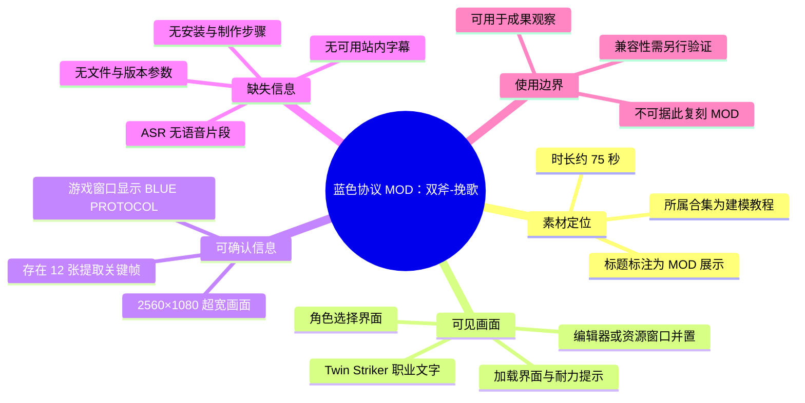
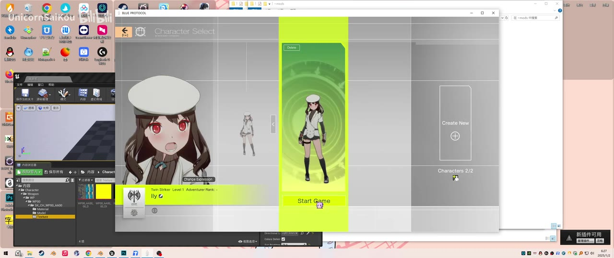
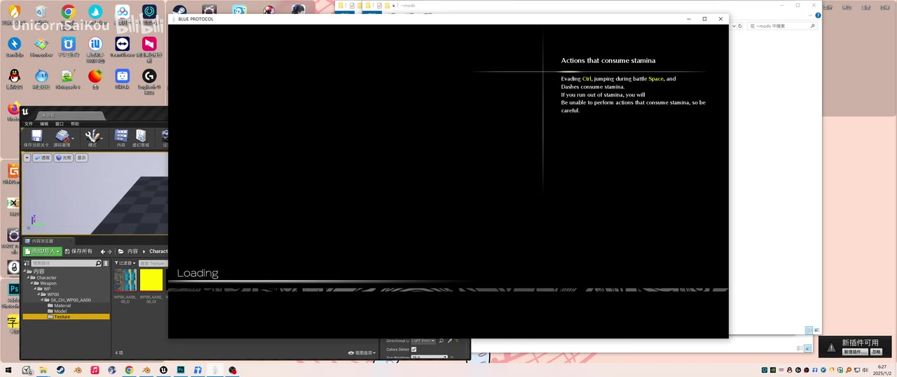
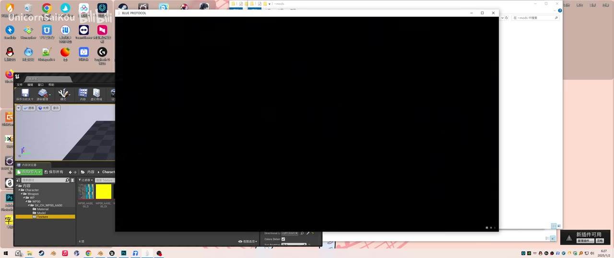

# 【蓝色协议mod】双斧 - 挽歌

> 来源：[Bilibili 视频](https://www.bilibili.com/video/BV1KurAYfEk7) 
> UP 主：UnicornSaiKou｜发布时间：2025-01-02｜视频时长：75 秒｜画面规格：2560×1080（超宽画幅）

## 小结

该视频是一段时长约 75 秒的《蓝色协议》（BLUE PROTOCOL）MOD 展示素材，标题明确标注主题为“双斧 - 挽歌”。画面可见游戏角色选择界面、加载界面，以及与游戏窗口并置的编辑器/资源管理类软件界面；角色选择界面中可辨认出职业文字 `Twin Striker`，与标题中的“双斧”主题相呼应。

视频并非可复现的完整教程：现有画面没有展示 MOD 下载地址、安装目录、替换文件、导入导出流程、建模参数、材质节点、骨骼绑定或运行命令。因此，它可作为 MOD 成果及游戏内显示状态的视觉记录，但不足以单独用于复刻该 MOD。

本次 ASR 使用 `large-v3-turbo` 对约 74.90 秒音频进行识别，结果为 **0 个语音片段**。站内也未提供可用字幕，故本文不能从语音中补充作者意图、具体操作步骤或术语解释；正文以标题、视频元数据、可见画面和热评为依据，并对无法验证之处明确保留。

视频发布于 2025 年 1 月。MOD 的兼容性会受到游戏客户端版本、资源结构、第三方工具版本和社区分发状态影响；素材中未说明适配版本，不能将该展示直接视为当前仍可安装或可正常运行的方案。

## 思维导图

## 目录

- [素材背景与信息边界](#素材背景与信息边界)
- [可见的角色与 MOD 展示](#可见的角色与-mod-展示)
- [加载画面与游戏机制文字](#加载画面与游戏机制文字)
- [制作与安装信息：素材未提供](#制作与安装信息素材未提供)
- [参数、限制与时效性](#参数限制与时效性)
- [字幕比对](#字幕比对)
- [评论分析](#评论分析)
- [关键帧索引与使用说明](#关键帧索引与使用说明)
- [处理记录](#处理记录)

## 素材背景与信息边界 [00:00](https://www.bilibili.com/video/BV1KurAYfEk7?t=0)

视频标题为“【蓝色协议mod】双斧 - 挽歌”，UP 主为 UnicornSaiKou，标签包括 `MOD`、`蓝色协议`、`MMORPG`，并被收录于“建模教程”合集。这里应区分以下层次：

- **可确认的事实**：标题和标签将其定位为《蓝色协议》相关 MOD 内容；视频画面确实能看到 `BLUE PROTOCOL` 游戏窗口。
- **可合理关联但不能扩展为已证实事实的内容**：标题中的“双斧”与画面中 `Twin Striker` 文本存在直接语义对应，但素材未展示武器的近距离细节或具体模型文件，无法验证“双斧 - 挽歌”是武器替换、角色外观替换，还是由多项资源构成的 MOD。
- **不能从合集名称推出的内容**：虽然合集名称为“建模教程”，但本条素材本身未给出建模教学步骤；不能将其当作包含建模流程、软件设置或工程文件说明的教程。

视频元数据时长为 75 秒；ASR 读取到的音频时长为 74.9013125 秒，两者仅存在常见的封装/采样精度差异。由于没有站内 SRT 或 ASR 分段时间码，除起始锚点外，本文不伪造更细的画面时间段。

## 可见的角色与 MOD 展示 [00:00](https://www.bilibili.com/video/BV1KurAYfEk7?t=0)

画面中同时出现桌面、一个资源/编辑器界面和《BLUE PROTOCOL》游戏窗口。游戏位于角色选择页面，中央角色卡以绿色高亮显示；角色身着白色帽子、白色上装与深色长袜/靴的搭配。界面左下可读取到职业文本 `Twin Striker`，旁边还有等级与冒险者等级相关的英文 UI 信息，但因画面分辨率与遮挡，除 `Twin Striker` 外不宜对其余字段作精确转写。

左侧软件窗口可见资源树、预览区域及颜色贴图/材质缩略图等界面元素。这说明录制环境中存在编辑或资源查看操作，但仅凭单帧不能严谨断定具体软件、资源格式、所用插件或已经执行的导入步骤。

> 图：该关键帧是正文最重要的可视证据之一。它同时显示 `BLUE PROTOCOL` 的角色选择页、`Twin Striker` 字样和侧边的资源编辑类窗口，有助于确认视频是在展示游戏内角色效果，而不是单纯展示静态概念图；但它没有展示 MOD 文件路径、替换动作或保存结果，不能作为安装教程依据。

从这张画面能获得的经验是：对于游戏 MOD 成果展示，至少应分别核验**游戏内实际显示**、**角色/职业上下文**和**制作端资源状态**。本视频在视觉上覆盖了前两者的一部分，并出现了制作端窗口，但没有覆盖完整的资源处理链路。

## 加载画面与游戏机制文字 [00:00](https://www.bilibili.com/video/BV1KurAYfEk7?t=0)

后续提供的关键帧显示游戏进入黑底加载界面。右侧帮助文字标题为 `Actions that consume stamina`（消耗耐力的动作），可辨识的内容包括：

- 闪避（`Evading Ctrl`）；
- 战斗中跳跃（`jumping during battle Space`）；
- 冲刺（`Dashes`）；

这些动作会消耗耐力；当耐力不足时，角色将无法进行消耗耐力的动作。该文字是游戏加载提示，并非作者对 MOD 的功能说明。

> 图：此帧保留了游戏原生加载提示与 `Loading` 状态，可说明视频至少记录到从角色选择进入加载阶段。提示内容与耐力消耗有关，不应被误读为“双斧 - 挽歌”MOD 的新增机制或参数。

素材提供的 `frame-003.jpg` 与该加载画面视觉内容高度接近，可作为加载状态的重复采样证据；但关键帧清单未提供每帧的原始时间戳，不能据此精确计算加载持续了多少秒。

> 图：该帧显示游戏窗口区域为黑屏。它的价值在于记录关键帧采样中存在加载后的无可读 UI 状态；但没有时间码、音频旁白或后续清晰游戏画面，无法判断这是场景切换、录制空白，还是其他运行状态。

## 制作与安装信息：素材未提供 [00:00](https://www.bilibili.com/video/BV1KurAYfEk7?t=0)

从现有素材中，**没有**获得以下复刻 MOD 所必需的信息：

1. MOD 的来源页面、作者授权范围或下载链接；
2. 压缩包目录结构、文件名、文件扩展名；
3. 游戏安装目录、MOD 加载器目录或目标替换路径；
4. 导入的网格、纹理、骨骼或动画资源；
5. 建模软件、版本、插件、导出格式和单位设置；
6. 材质参数、贴图通道、Shader 配置或 UV 处理方式；
7. 对 `Twin Striker` 武器模型的替换对象、资源 ID 或绑定关系；
8. 安装后校验、卸载、冲突排查和版本兼容处理；
9. 游戏官方或第三方平台对 MOD 的规则说明。

因此，不能将画面左侧窗口概括成“已完成 Unreal Engine 导入”“已通过特定工具打包”，也不能编写任何虚构的操作命令或文件路径。

若要把这类展示视频补充为可执行教程，至少需要作者额外提供以下信息：

| 所需信息 | 用途 | 本素材状态 |
| --- | --- | --- |
| 游戏与 MOD 对应版本 | 判断能否加载和是否会失效 | 未提供 |
| MOD 文件清单与目录树 | 确认安装/替换位置 | 未提供 |
| 制作工具与版本 | 保证工程可复现 | 未提供 |
| 模型、贴图与骨骼处理流程 | 复刻资源制作 | 未提供 |
| 游戏内实机战斗演示 | 检查模型、动作与武器显示 | 未提供明确可读证据 |
| 风险说明与授权信息 | 判断使用边界 | 未提供 |

## 参数、限制与时效性 [00:00](https://www.bilibili.com/video/BV1KurAYfEk7?t=0)

### 已知技术参数

| 项目 | 值 | 依据 |
| --- | ---: | --- |
| 视频标称时长 | 75 秒 | 视频元数据 |
| ASR 读取时长 | 74.9013125 秒 | ASR 覆盖诊断 |
| 分辨率 | 2560×1080 | 视频元数据 |
| 画面旋转 | 0 | 视频元数据 |
| 视频页数 | 1 P | 页面元数据 |
| ASR 模型 | `large-v3-turbo` | ASR 诊断 |
| ASR 检测语言 | 英语（概率 0.6005859375） | ASR 诊断 |
| 识别语音片段数 | 0 | ASR 诊断 |
| 可用站内字幕 | 无 | 提供的字幕素材 |

### 证据限制

- 本次 ASR 的诊断警告为“未识别到语音片段”；这表示当前音频中没有被模型识别为可转写语音的内容，**不等同于**已证明视频绝对静音。
- ASR 诊断中未出现 `noAudioStream=true` 标记，且素材包中存在 `audio/audio.wav`，因此不能写成“源视频没有音轨”。更准确的表述是：**存在已提取音频，但未识别出语音内容。**
- 没有站内字幕、ASR SRT 有效文本或分段时间码，无法以字幕起止时间建立详细章节时间轴。
- 已提供的关键帧路径为 `frame-001.jpg` 至 `frame-012.jpg`，但素材没有附带这些帧对应的精确 PTS/秒数。本文仅将视频开始设为 `00:00` 链接锚点，不根据文字顺序臆造关键帧发生秒数。
- 画面中虽然可见编辑器/资源管理类窗口，但窗口内容不足以可靠识别软件名称、工程结构、资产格式与实际操作结果。

### 时效性与风险

《蓝色协议》及其社区 MOD 的可用性具有强时效性。视频发布于 2025 年 1 月，距素材抓取时间已有间隔；客户端更新、服务状态变化、资源加密或文件结构改动都可能使旧 MOD 失效。视频没有给出版本号，因此无法判断其与任何当前环境的兼容性。

此外，MOD 的使用可能涉及游戏服务条款、账号安全、版权和资源再分发限制。视频元数据中的 `no_reprint: 1` 表示投稿设置为禁止转载；整理本视频时应尊重原作者的传播限制，不应从展示画面推导出可自由分发模型或资源文件的结论。

## 字幕比对 [00:00](https://www.bilibili.com/video/BV1KurAYfEk7?t=0)

| 字幕来源 | 完整性 | 专有名词 | 时间轴 | 主要问题 |
| --- | --- | --- | --- | --- |
| Bilibili 站内字幕 | 不可用 | 无法核验 | 无 | 素材明确标注“未提供可用站内字幕” |
| 本次 ASR 字幕 | 空 | 未输出可用专有名词 | 无有效分段 | `large-v3-turbo` 未识别到任何语音片段，`segments` 为空 |

最终未采用任何字幕文本作为正文依据，原因如下：

1. 站内字幕不可用，无法提供原始台词、术语拼写或 SRT 时间段。
2. 本次 ASR 已实际检查，读取音频时长约 74.90 秒，自动语言判断倾向英语，但输出 0 个片段；因此不存在可供比对或校正的 ASR 句子。
3. ASR 结果未标记 `noAudioStream=true`。本文不将空识别结果归因于“无音轨”，而是如实记录为“有音频提取文件、无可识别语音转写”。
4. 正文中的 `BLUE PROTOCOL`、`Twin Striker`、`Loading`、`Actions that consume stamina` 等文字来自关键帧可见 UI，而不是字幕校正结果。

受此限制，视频中是否包含背景音乐、环境声、无意义音效或难以识别的人声，无法仅由当前 ASR 输出精确区分。

## 评论分析 [00:00](https://www.bilibili.com/video/BV1KurAYfEk7?t=0)

以下仅处理当前可获取的热评前三条。三条评论点赞数均为 0，内容以即时反应为主，未提供 MOD 制作、下载、安装或兼容性的可验证补充信息。

| 评论者 | 评论内容 | 观点概括 | 可验证价值与边界 |
| --- | --- | --- | --- |
| An-Extra | “这也能有mod吗[笑哭]” | 对该游戏/内容存在 MOD 表示惊讶。 | 反映观众的意外感，不构成对 MOD 功能、来源或可用性的证明。 |
| 招財夢 | “这下不得不玩了” | 展示效果提升了其游玩兴趣。 | 属于主观的观看反馈，不能推导出游戏或 MOD 的实际体验质量。 |
| 吃瓜的毛玉 | “对?对吗?” | 对内容表达疑问或犹豫。 | 评论语义不完整，无法据此确认其质疑对象，也没有技术信息价值。 |

整体来看，热评侧重“MOD 出现在该游戏中的新鲜感”和个人情绪反馈，没有形成关于“双斧 - 挽歌”制作方法、性能、稳定性或风险的讨论。评论不能替代作者说明或实测证据。

## 关键帧索引与使用说明 [00:00](https://www.bilibili.com/video/BV1KurAYfEk7?t=0)

| 关键帧 | 正文使用 | 可见内容 | 选择理由 |
| --- | --- | --- | --- |
| `frames/frame-001.jpg` | 已使用 | 角色选择界面、`Twin Striker`、编辑器/资源窗口并置 | 信息密度最高，可同时支撑游戏、职业与制作环境三项观察。 |
| `frames/frame-002.jpg` | 已使用 | 加载界面、耐力消耗提示 | 可准确区分游戏原生加载提示与 MOD 内容。 |
| `frames/frame-003.jpg` | 未嵌入 | 与加载画面高度接近 | 与 `frame-002.jpg` 信息重复，未重复占用正文篇幅。 |
| `frames/frame-004.jpg` | 已使用 | 黑屏状态 | 记录加载后缺少可读画面的限制，避免误称为已展示实机战斗。 |
| `frames/frame-005.jpg`—`frames/frame-012.jpg` | 未使用 | 未在本次可见关键帧预览中获得可核验画面说明 | 为避免对未展示内容进行臆测，不纳入事实性正文。 |

关键帧编号反映提取文件序号，不等同于精确时间码。由于未提供各帧采样时间，本文没有为单张关键帧标注未经证实的秒数。

## 评论分析

- 热评 1：这也能有mod吗[笑哭]
- 热评 2：这下不得不玩了
- 热评 3：对?对吗?

以上内容是观众反馈摘录，只用于补充理解视频反响，不作为正文事实依据。

## 处理记录

- Worker ID：`worker-msaehvue-e0b94e0c`
- 模型：`gpt-5.6-terra`
- 调用的音频识别模型：`large-v3-turbo`，运行设备为 CUDA，计算类型为 `int8_float16`。
- 使用素材：视频元数据、ASR 覆盖诊断、ASR 空输出说明、热评前三条、关键帧清单及已提供的关键帧画面。
- 字幕检查与选择：已检查站内字幕，结果为无可用站内字幕；已检查本次 ASR，结果为 0 个语音片段。最终不采用虚构字幕，以标题、元数据和画面可见文字为主。
- 音轨判断：ASR 结果未标记 `noAudioStream=true`，且存在 `audio/audio.wav`；记录为“音频中未识别到语音”，未将其错误归因于无音轨或工具失败。
- 时间轴策略：没有站内 SRT 或有效 ASR 起止时间，故仅使用可确认的视频起始 `00:00` 作为章节链接锚点；未根据叙述顺序推测后续秒数。
- 关键帧选择依据：优先选取信息密度最高的角色选择页（`frame-001`）、可读文字最清晰的加载提示（`frame-002`）和体现画面不确定性的黑屏帧（`frame-004`）；重复加载帧不重复嵌入。
- 缓存清理：未提供缓存清理执行结果，无法确认是否已清理；不作已清理声明。
- 未解决问题：MOD 的实际文件、制作工具、安装路径、适配客户端版本、授权状态、游戏内战斗效果及当前可用性均未在素材中得到验证。
