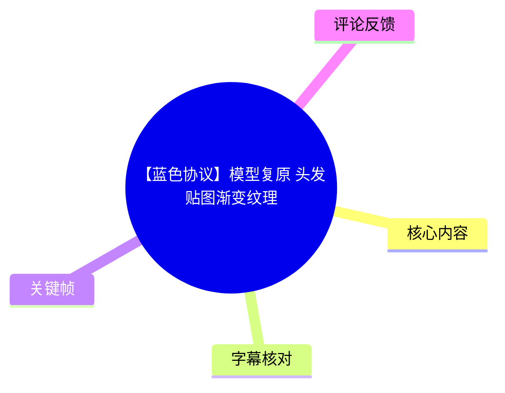
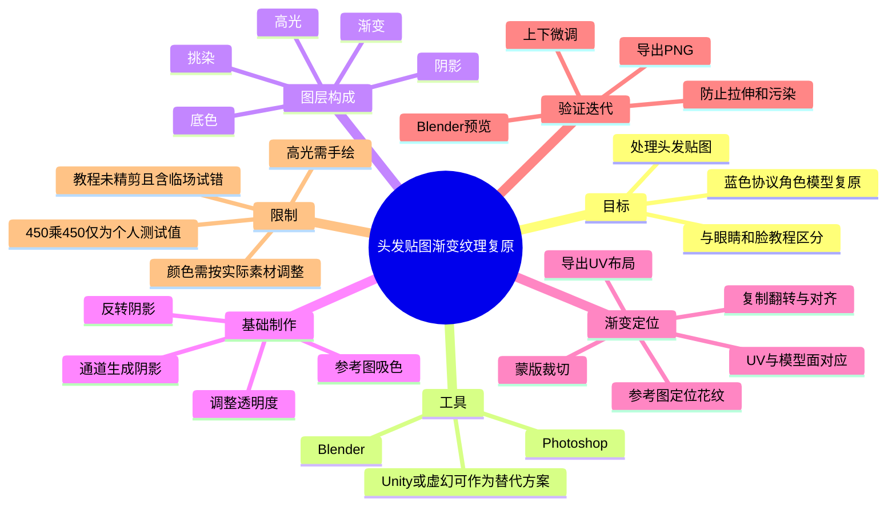
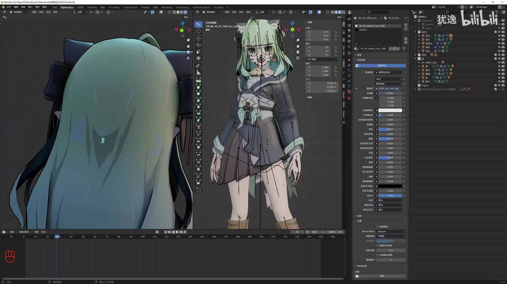
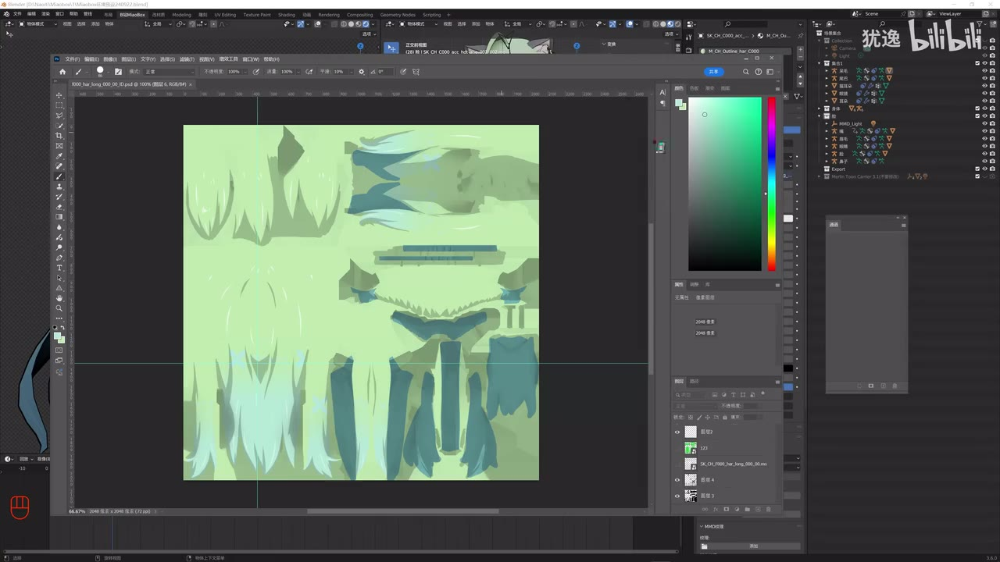
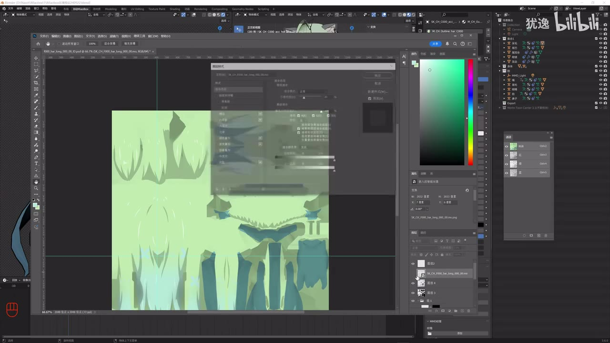

# 【蓝色协议】模型复原 头发贴图渐变纹理

> 来源：[Bilibili 视频](https://www.bilibili.com/video/BV1iHCpYuE9j) 
> UP 主：犹逸｜发布时间：2024-12-27｜视频时长：01:01:13｜分辨率：3840×2160  
> 视频说明：UP 主表示教程为自己摸索约一小时后录制，未作精剪，建议观众倍速观看并边看边做。

## 小结

本视频是针对《蓝色协议》角色模型复原的头发贴图制作实录，重点解决头发的**底色、阴影、渐变、挑染与高光**如何在 Photoshop（PS）中分层完成，并在 Blender 中反复验证映射结果。UP 主指出，头发、眼睛和脸是被问得较多的部位，本期只聚焦头发贴图。

核心思路不是将一张花纹或渐变图直接贴到模型上，而是先从 Blender 导出 UV 布局，再在 PS 内按照实际发片对应的 UV 区域摆放、复制、翻转和裁切渐变纹理。这样可避免直接投射或简单挂载图片时产生的拉伸、错位与跨发片污染。

视频给出一套可操作的图层组织：以底色为基础，通过通道信息生成阴影并降低透明度；为上下半区提取不同颜色、反转后填充，再加底色避免 PNG 透明区域造成补色时的割裂；渐变部分以单独组管理，并依赖 UV 面与参考图逐片定位。

明确参数较少但有实际意义：阴影示例透明度从 10 尝试到约 **20**；UP 主根据自己的测试将用于渐变处理的工作尺寸设为 **450×450**；参考图或辅助层的不透明度示例从 50 下调到约 **30**。这些是本例测试值，不应当理解为适用于所有模型、所有引擎的通用固定参数。

高光没有现成的自动化规则。UP 主认为原始资源中的高光并不适合直接作为贴图使用，因此建议新建图层，按照参考图和个人审美手工绘制。挑染也需要自行吸色、调高明度，并根据图层叠放结果调整颜色。

该视频发布于 2024 年 12 月，所述 PS 2025、Blender 3.6 中文界面、Unity/虚幻引擎的提及均属于当时工作流语境。视频没有给出可下载工程、完整色值、原始纹理规格或统一着色器配置；其方法更适合拥有模型、UV、参考图与基础 PS/Blender 操作能力的复原实践者。

## 思维导图

## 目录

- [背景、目标与适用范围](#背景目标与适用范围)
- [成品判断与图层拆解](#成品判断与图层拆解)
- [基础：底色与阴影](#基础底色与阴影)
- [渐变底图：双色区域、尺寸与导出](#渐变底图双色区域尺寸与导出)
- [UV 布局导出与 PS 工作底图](#uv-布局导出与-ps-工作底图)
- [按 UV 复原渐变纹理](#按-uv-复原渐变纹理)
- [蒙版、连续性与 Blender 验证](#蒙版连续性与-blender-验证)
- [补色、挑染与高光](#补色挑染与高光)
- [完整工作流与检查清单](#完整工作流与检查清单)
- [限制、风险与时效性](#限制风险与时效性)
- [字幕比对](#字幕比对)
- [评论分析](#评论分析)
- [处理记录](#处理记录)

## 背景、目标与适用范围 [00:00:01](https://www.bilibili.com/video/BV1iHCpYuE9j?t=1)

UP 主说明，本期内容是《蓝色协议》模型中头发贴图的处理方法；头发、眼睛、脸是观众提问较多的三个方向，因此单独制作一期头发教程。视频展示的是长时间的桌面实操过程，不是经过高度压缩的标准化课程。

视频展示的工作环境以 PS 和 Blender 为主：

- **PS**：制作色块、阴影、渐变、蒙版、挑染与手绘高光。
- **Blender**：查看模型、确认 UV 面与真实发片的对应关系、导出 UV 布局、加载贴图进行验证。
- **Unity / 虚幻引擎**：UP 主认为若使用游戏引擎制作，最终效果“可能会更好”；但本教程不展开引擎节点、材质参数或导入配置。

> 图：画面同时呈现 Blender 中的背部头发和角色正面模型，说明本教程并非只在二维画布中绘制，而是需要回到三维模型验证贴图位置、发片方向和整体观感。

### 前置条件

要复现本工作流，至少需要：

1. 可在 Blender 中打开的角色模型。
2. 该模型头发部分的 UV。
3. 用于判断颜色、花纹起止位置和正反面关系的角色参考图。
4. 可编辑图层、通道与蒙版的图像软件；视频使用 PS。
5. 能接受“导出—加载—观察—返回修改”的多轮迭代。

## 成品判断与图层拆解 [00:00:18](https://www.bilibili.com/video/BV1iHCpYuE9j?t=18)

UP 主先展示预期的渐变成品效果，并说明自己尝试过多种方法后，认为只使用 PS 做出的效果最接近原始观感；若直接借助 Blender 的某些工具，结果“不太好”。这里是作者的实际经验判断，并非对全部 Blender 工作流的普遍结论。

在拆解现有贴图层级时，UP 主将头发效果概括为：

- **底色**：头发整体基础颜色。
- **阴影**：增强发片层次与方向感。
- **渐变**：对应原角色发色或花纹的颜色过渡。
- **挑染**：局部加强或变化的颜色区域。
- **高光**：最后补充的手绘明亮笔触。

该拆解的关键价值在于把“看起来复杂的头发”变为可独立修改的层：颜色不对时优先调底色或挑染，位置不对时优先改渐变层与蒙版，层次不足时再考虑阴影与高光。

> 图：关键帧中可见头发 UV 岛以二维形式铺开，并呈现浅绿至蓝绿色的分区。它直观展示了“在 UV 画布中处理颜色，而非在三维视图直接涂整片头发”的工作对象。

## 基础：底色与阴影 [00:03:44](https://www.bilibili.com/video/BV1iHCpYuE9j?t=224)

### 1. 从原头发贴图开始清理

UP 主打开目标头发贴图后，先隐藏并删除当前不需要的两个内容层，再识别其中用于阴影的信息。视频强调：如果目标是纯色头发、没有复杂渐变，制作难度会低得多，因为可先完成基础色与阴影，再决定是否继续添加高光。

### 2. 用参考图确定底色

[00:04:37](https://www.bilibili.com/video/BV1iHCpYuE9j?t=277) 起，UP 主打开参考图，从目标绿色头发区域吸取或近似设置颜色，并通过色相、饱和度、明度方向进行调整后填充。

应注意：

- 参考图受到场景光照影响，屏幕上看到的颜色未必等于贴图应写入的真实基础色。
- 因此这里先求“接近”，成品完成后再统一调整色相/饱和度。
- 视频中出现“32、20、28”等临时调色口述，但没有清楚说明其分别对应哪一个固定的 HS(L/V) 字段，不能据此编造可复用的精确色值。

### 3. 基于通道处理阴影

[00:06:46](https://www.bilibili.com/video/BV1iHCpYuE9j?t=406) 起，UP 主使用贴图通道信息作为阴影依据，将阴影填为黑色。第一次结果不正确时，作者明确指出原因是**忘记反转**，反转后阴影关系才正确。

操作逻辑可整理为：

1. 保留或提取可表达原头发明暗分布的通道。
2. 将需要作为暗部的区域转换为黑色阴影层。
3. 如果黑白关系颠倒，执行反转。
4. 将底色层与阴影层建立图层组，方便统一管理。
5. 降低阴影层透明度，避免阴影过重。

### 4. 阴影透明度示例

[00:07:41](https://www.bilibili.com/video/BV1iHCpYuE9j?t=461) 中，UP 主先试了透明度 **10**，认为偏浅，随后调到约 **20**，认为“差不多”。

| 参数 | 视频示例值 | 含义与限制 |
| --- | ---: | --- |
| 阴影透明度 | 10 → 约 20 | 仅为当前绿色头发案例的目测结果；应根据底色、模型光照和目标风格调整。 |
| 阴影颜色 | 黑色 | 视频示例使用黑色填充；最终强度由透明度控制。 |
| 阴影通道关系 | 需要反转 | 取决于原通道的黑白含义，不能机械套用。 |

### 5. 导出到 Blender 检验

[00:08:03](https://www.bilibili.com/video/BV1iHCpYuE9j?t=483) 后，UP 主导出并在 Blender 中查看。纯色阶段到此已经可以得到基础效果，但仍缺少渐变和高光。

> 图：该画面适合用于检查阴影是否顺着发片方向分布。二维贴图中看似合理的明暗，在三维背视角下可能显得过浅、过重或位置错误，因此 Blender 预览是必要步骤。

## 渐变底图：双色区域、尺寸与导出 [00:09:11](https://www.bilibili.com/video/BV1iHCpYuE9j?t=551)

### 1. 找到对应渐变参考

UP 主先找到与目标头发对应的渐变图或花纹图，区分上半部分和下半部分的颜色来源。视频中以角色原始参考的上下发色关系为依据，并非用简单的线性渐变工具一拉完成。

### 2. 新建 450×450 工作画布

[00:10:32](https://www.bilibili.com/video/BV1iHCpYuE9j?t=632) 中，UP 主新建 **450×450** 的图像，并称这是自己测试后认为“最合适”的大小。

这一参数的边界非常重要：

- **450×450 是作者当前测试的个人选择**，不是模型纹理规范。
- UP 主同时说明：若用 Unity 或虚幻引擎做，应使用原始尺寸，效果应当更好。
- 视频没有说明原始贴图的完整分辨率、压缩格式、MipMap、色彩空间或引擎导入设置，因此不能将该尺寸直接推广为通用生产标准。

### 3. 按通道提取上下两种区域

[00:11:24](https://www.bilibili.com/video/BV1iHCpYuE9j?t=684) 起，UP 主新建图层，在 RGB/各通道间比较，选择自己认为更精细、适合抠取区域的通道。

后续操作是：

1. 为下半部分找对应的参考区域。
2. 根据明度及视觉结果调整颜色。
3. 填充下半区域。
4. 对上半区域使用对应区域并反转，再填入另一种颜色。
5. 将绿色底色置于下方。

### 4. 必须添加底色

[00:13:53](https://www.bilibili.com/video/BV1iHCpYuE9j?t=833) 中，UP 主特别说明不能让该图在导出 PNG 时保留透明状态。透明底在后续补色时会让颜色显得奇怪、存在割裂感。

可理解为：后续添加颜色、混色或叠层时，需要有稳定的底层颜色参与视觉合成。否则透明区域与实际头发贴图之间的关系不可控。

> 图：画面显示 PS 内头发贴图的浅色基础区、蓝绿色渐变区及图层面板。它说明了底色与渐变是通过多个图层叠加而非一次性烘焙完成，也体现了导出前需要保留可编辑层级。

## UV 布局导出与 PS 工作底图 [00:15:03](https://www.bilibili.com/video/BV1iHCpYuE9j?t=903)

### Blender 中导出 UV 布局

UP 主在 Blender 中进入 UV 贴图相关区域；视频提到 Blender 3.6 使用中文界面时，相关入口名称会显示为中文。其关键操作是导出 **UV 布局图（UV Layout）**，保存到任意便于访问的文件夹。

视频涉及的界面概念包括：

- UV 贴图/UV 编辑。
- 纹理绘制。
- 图像相关菜单。
- 导出 UV 布局图。

导出的 UV 布局图是二维坐标参照：它不负责决定颜色，而负责告诉你“PS 画布中的哪块区域，对应模型中的哪片头发”。

### 在 PS 中建立可选区的 UV 模板

[00:16:27](https://www.bilibili.com/video/BV1iHCpYuE9j?t=987) 起，UP 主将 UV 布局拖入 PS 并置顶。随后填充背景色、使用魔棒工具选择、反选或删除不需要的区域，并将结果保存。

该辅助模板的目的有两类：

1. **定位**：让渐变花纹对准正确 UV 岛。
2. **裁切/蒙版**：限定纹理只影响目标发片，而不污染其他 UV 面。

UP 主随后将这个模板隐藏保留，说明它后续仍会参与选区、蒙版或对照，而不是一次性用完就丢弃。

## 按 UV 复原渐变纹理 [00:18:28](https://www.bilibili.com/video/BV1iHCpYuE9j?t=1108)

### 1. 建立渐变组并降低辅助层不透明度

UP 主将要处理的渐变内容单独建组，并把辅助内容的不透明度先降到 **50**，又认为 **30** 足够。这样可同时看见底下 UV/已有贴图和上方参考纹理，方便对位。

### 2. 先判定现实角色上的渐变起点

[00:19:34](https://www.bilibili.com/video/BV1iHCpYuE9j?t=1174) 起，UP 主查看角色正反面参考图，判断颜色/花纹从头发的什么位置开始。其示例中，渐变大约位于发片中间、且略偏上，但这是当前发型的观察结果。

定位时不能只看二维 UV 的“上下”：

- UV 岛上方未必就是模型头顶。
- 同一片发束可能在 UV 中被拆成多个独立区域。
- 需要通过 Blender 选择模型面，确认该三角面实际位于角色正面、背面、头顶或侧面。

### 3. 纹理循环并不等于可直接平铺

[00:23:08](https://www.bilibili.com/video/BV1iHCpYuE9j?t=1388) 中，UP 主指出这是一种循环贴图：做好第一个纹理片段后可以复制排开，但不能不加判断地“一下排开”。原因是每个部件在 UV 中独立分离，真实发片间的相邻关系与二维距离未必一致。

UP 主不推荐的做法是：直接把纹理加到模型上，让图片自动映射。其观察是这样会导致图片被拉伸、效果怪异。因而选用“展开 UV 后逐片排纹理”的方式以提高还原度。

### 4. 逐片操作原则

对于每一个目标 UV 发片，可按以下顺序执行：

1. 在参考图中找花纹、色带、叶状/花瓣状边缘的起止位置。
2. 在 Blender 选中对应模型面，确认该区域具体是哪一束头发。
3. 在 PS 中移动渐变纹理到相应 UV 岛。
4. 必要时复制、水平翻转或调整方向。
5. 对比正面、背面与相邻发片，判断花纹是否连续。
6. 导出到 Blender 检查。
7. 若位置偏高或偏低，返回 PS 上下微调。

## 蒙版、连续性与 Blender 验证 [00:27:19](https://www.bilibili.com/video/BV1iHCpYuE9j?t=1639)

### 用选区与蒙版防止 UV 污染

UP 主通过按住 `Ctrl` 并点击图层缩略图获取选区，再减去无关区域，仅保留当前要处理的发片区域，然后给渐变层加蒙版。

视频的目标很明确：

- 渐变不能溢出到相邻 UV 岛。
- 一个发片上的花纹不能意外影响另一片头发。
- 两块 UV 岛如果在纹理空间重叠或会相互影响，应单独切出并各自处理。

[00:38:30](https://www.bilibili.com/video/BV1iHCpYuE9j?t=2310) 中，UP 主说明：如果两处不冲突、没有重合，可以合并处理；如果贴图会影响另一处，就必须把那一块单独切出来，再配合蒙版限制。

### 用模型面选择建立 UV—三维对应

[00:33:59](https://www.bilibili.com/video/BV1iHCpYuE9j?t=2039) 中，UP 主演示切换到面选择模式并选择三角面，以确认这个面及其相邻面在角色模型上的真实位置。视频口述“1、2、3 可以切”，结合界面语境，表达的是在 Blender 中切换选择模式并查看面对应关系；没有提供完整快捷键配置或版本差异说明。

这一步的知识点是：

- 不确定 UV 岛对应哪里时，不靠猜。
- 直接在 Blender 选面，看三维模型高亮位置。
- 以三角面、长三角、倒三角等 UV 形状作为二维识别锚点。
- 将参考图中的大花、小花、花瓣、叶子或渐变断点放到对应面上。

### 连续性优先于孤立纹理块

[00:31:45](https://www.bilibili.com/video/BV1iHCpYuE9j?t=1905) 起，UP 主反复强调花纹要呈现“连贯状态”。例如一个大花纹、相邻小花纹、叶片断点，应该根据参考图关系跨相邻发片延续，而不是在每块 UV 岛上各贴一段完全孤立的纹理。

但视频也给出例外：

- 如果两片头发在模型上距离很远、根本不相连，就不需要强行制作过渡。
- 对不相邻的区域，可以复制粘贴同类花纹，不必追求二维画布中的绝对对齐。

### 必须反复导出检查

[00:26:23](https://www.bilibili.com/video/BV1iHCpYuE9j?t=1583) 和 [00:45:21](https://www.bilibili.com/video/BV1iHCpYuE9j?t=2721) 的实操显示，二维位置看起来“差不多”后，三维模型中仍可能显得偏上或偏下。UP 主也承认自己此前没有仔细比对，导致位置出现偏差，随后需要往下调整。

> 图：该帧能够观察到多个彼此分离的头发 UV 岛。它的价值在于解释为什么不能把花纹简单拉伸到整张贴图：每块岛都可能代表不同方向、不同位置的发束，需要依靠三维验证决定其纹理落点。

## 补色、挑染与高光 [00:51:24](https://www.bilibili.com/video/BV1iHCpYuE9j?t=3084)

### 1. 补足渐变下方颜色

UP 主先隐藏部分图层，在下方新建图层，并为其添加蒙版后使用画笔补色。过程中作者发现颜色不对，建议通过吸色调整。

视频解释了一个颜色变化原因：加入渐变和底色后，下半部分会呈现蓝色与绿色的混合，上方与下方的视觉颜色未必一致。因此不能只取某一点颜色后机械填满整个区域。

### 2. 挑染层的放置

[00:53:42](https://www.bilibili.com/video/BV1iHCpYuE9j?t=3222) 起，UP 主开始处理挑染：

1. 确认参考图中哪一种蓝色属于挑染。
2. 新建图层，填充目标颜色。
3. 将图层移到合适层级。
4. 调高明度，并根据最终合成结果继续改色。
5. 将挑染放在阴影关系中正确的位置，避免误放进不合适的图层组。

视频中作者对具体层级有临场调整和自我纠正，最终表达的稳定原则是：**挑染需要在底色/渐变、阴影以及其他颜色层之间找到正确的叠放位置；颜色本身没有固定值，必须自行调试。**

### 3. 高光必须手绘

[00:57:21](https://www.bilibili.com/video/BV1iHCpYuE9j?t=3441) 后，UP 主说明原有“B 高光”看起来并不是为贴图制作准备的，不能直接拿来用。高光应对照参考图，在新建图层上手绘。

建议按视频方式理解：

- 先看参考图中高光出现在哪些发片。
- 用少量笔画顺着发束方向画。
- 单独建层，避免破坏前面的渐变、阴影和挑染。
- 高光形状、数量、强度取决于个人审美；UP 主明确称“怎么舒服怎么来”。

> 图：此帧展示图层与通道编辑同时进行的状态，适合说明挑染、高光等后期层应该保持可编辑。图中并未提供可可靠读取的完整图层名称和数值，正文不据此补造参数。

## 完整工作流与检查清单 [00:59:44](https://www.bilibili.com/video/BV1iHCpYuE9j?t=3584)

### 可复用流程

1. **准备素材**
   - 打开头发原贴图、模型和角色正反面参考图。
   - 确保能够在 Blender 中查看头发的 UV 和三维面。

2. **拆分图层职责**
   - 分别管理底色、阴影、渐变、挑染、高光。
   - 不要过早把需要反复修改的层完全合并。

3. **先做纯色基础**
   - 从参考图近似吸取基础色。
   - 以通道信息生成黑色阴影。
   - 发现黑白关系错误时反转。
   - 将阴影透明度调至与目标视觉相符；视频示例约为 20。

4. **制作双色渐变底图**
   - 为上下半部分提取/调整不同颜色。
   - 上下区域需要时使用反转关系。
   - 填入底色，避免透明 PNG 在后续补色中形成割裂。
   - 本例工作画布为 450×450，但应根据实际项目决定。

5. **导出 Blender UV 布局**
   - 将 UV Layout 导出。
   - 在 PS 中作为对位、选区和蒙版依据。

6. **按参考图逐片摆放渐变**
   - 判断花纹在哪片发束开始和结束。
   - 在 Blender 中选面确认对应 UV 岛。
   - 在 PS 中移动、复制、翻转纹理。
   - 保持真实相邻发片的纹理连续。

7. **用蒙版隔离**
   - 只保留目标 UV 面的有效部分。
   - 对有重叠或潜在污染的区域单独切分。
   - 不相邻的发片无需刻意做无意义的过渡。

8. **循环验证**
   - 导出 PNG。
   - 加载 Blender 观察正面、背面、边界和发片衔接。
   - 根据结果上下微调、重新导出。
   - 不要因为二维图“看似正确”就跳过三维验证。

9. **补色与细节**
   - 通过画笔和蒙版补充渐变下方颜色。
   - 添加挑染并调整明度、色相及层级。
   - 新建图层手绘高光。

### 导出前检查

- [ ] 底色是否完整，是否存在不应有的透明区域？
- [ ] 阴影通道是否正确反转，透明度是否过重？
- [ ] 渐变是否落在对应的真实发片，而非仅在 UV 画布看起来对齐？
- [ ] 相邻发片上的花纹是否连贯？
- [ ] 是否有渐变越界污染到其他 UV 岛？
- [ ] 发生 UV 重叠时，是否已拆分并单独蒙版？
- [ ] 挑染是否因图层叠放导致颜色失真？
- [ ] 高光是否位于独立图层，且顺着发束方向？
- [ ] 是否已经在 Blender 中从多个角度检查？

## 限制、风险与时效性 [01:00:56](https://www.bilibili.com/video/BV1iHCpYuE9j?t=3656)

### 视频已明确的限制

1. **没有固定万能参数**  
   阴影透明度、底色、渐变颜色、挑染颜色都依赖当前角色、光照、原始资源和个人判断。视频没有提供完整色板或可直接复制的精确数值。

2. **高光高度依赖手绘**  
   高光无法直接从原资源自动复用，最终需要根据参考图与个人审美绘制。

3. **UV 是核心依赖**  
   如果没有正确的模型 UV，或者无法在 Blender 中定位模型面，本教程最关键的“二维—三维对位”步骤无法可靠执行。

4. **需要多轮试错**  
   UP 主在录制过程中多次出现位置拉错、颜色不对、对齐偏高/偏低的情况。这不是可以跳过的旁枝，而是该类复原任务的真实成本：必须导出到三维视图核对。

5. **视频未精剪**  
   UP 主自己说明视频可能较长、未剪辑。部分时间包含找文件、窗口/快捷键问题、临时修正和操作停顿；学习时宜抓住关键步骤而不要把所有临场动作当成必需流程。

### 时效性说明

- 视频发布时间为 **2024-12-27**。
- 视频中提到 **PS 2025** 打开文件时会较卡，这是一段当时环境下的个人体验，不代表所有系统、版本或后续更新仍会出现相同行为。
- Blender 3.6 的中文界面名称、PS 菜单位置、Unity/虚幻版本和纹理导入规则可能随软件版本变化。
- “PS 最还原”“引擎会更好”“Blender 某些工具效果不好”均是 UP 主针对其案例与测试条件的经验判断，不能替代跨软件、跨着色器、跨项目的系统评测。
- 视频未讨论版权、模型来源授权、游戏资源使用边界及发布规范；实际使用外部游戏资产时，应自行确认相关权利与平台规则。

## 字幕比对

| 字幕来源 | 完整性 | 专有名词 | 时间轴 | 主要问题 |
| --- | --- | --- | --- | --- |
| Bilibili 站内字幕 | 完整覆盖视频主要口述，段落自然 | “PS”“Blender”“Unity”“虚幻”“UV”等大多可辨 | 站内 SRT 提供真实起止时间，可直接定位 | 个别口语、数字和术语不够规范，如“界面/渐变”等存在识别混淆；操作停顿处信息稀疏。 |
| 本次 ASR（large-v3-turbo） | 有时间戳，语音覆盖诊断为 37.71%，适合覆盖有说话的片段 | Blender、Unity、UV 等部分识别正确 | ASR 分段时间完整可用，首段 00:00:01.020，末段 01:01:09.730 | 错字和误识别较明显，如“摄像保护度”应结合站内字幕校正为“色相饱和度”、“萌板”应为“蒙版”、“纯颜/纯社”应为“纯色”；静音操作段形成较多间隔。 |

### 最终字幕选择与校正

本次优先采用**站内 SRT**作为正文时间轴与语句依据，同时检查并参考本次 ASR 的时间戳和覆盖诊断。原因是站内字幕对连续中文语义整体更稳定；ASR 具有可用时间戳，但在术语、口语和短语衔接上存在较多误识别。

本次 ASR 结果中**没有** `noAudioStream=true` 标记；其语言识别为中文，置信度约 **0.9917**，说明源视频存在可识别音轨，不能将 ASR 问题归因为无音轨。

已基于站内字幕、ASR 相互印证和关键帧画面校正的关键术语：

| 原始识别中出现的问题 | 正文采用表述 | 校正依据 |
| --- | --- | --- |
| “界面”“界边”“渐边”混用 | 渐变 | 站内字幕上下文与 PS 画面均指向发色渐变纹理。 |
| “萌板” | 蒙版 | 视频明确描述用于限制纹理溢出和污染其他面的图层功能。 |
| “摄像保护度” | 色相饱和度 | 站内字幕语义为完成后调整整体颜色；符合 PS 常见调色项。 |
| “UV 不集图” | UV 布局图 | 站内字幕明确为“导出 UV 布局图”。 |
| “纯颜/纯社” | 纯色 | 前后语境均为“没有渐变的头发”。 |
| “B 高光” | 原有高光资源/高光 | 音频词形不清；正文仅保留作者结论：该高光不适合直接用于制作贴图。 |

## 评论分析

以下仅基于当前可获取的热评前三条，不将评论内容视为已验证事实。

1. **栗_くり（1 赞）**  
   评论称羡慕“有技术力的能让角色复活”，自己却做不了。该评论表达了对模型复原能力的认可和学习门槛感受，但没有补充具体技术步骤、素材来源或效果验证，属于情感性反馈。

2. **雨乃茶欣（0 赞）**  
   评论“UP 主加油！看好你噢~”。这是对创作者的鼓励，没有提供教程勘误、技术补充或争议信息。

3. **迷途之子_頌樂人偶（0 赞）**  
   评论仅包含动态表情。其表达支持或喜爱倾向，但不含可供技术分析的文本信息。

整体而言，当前前三条热评未提出关于 PS 参数、UV 对位、模型来源、软件版本或教程准确性的实质性补充，也未形成争议点。

## 处理记录

- **Worker ID**：worker-msaei2qg-b29e21b6
- **模型**：gpt-5.6-terra
- **调用工具与素材**：视频元数据、站内字幕 `p01-ai-zh.srt`、本次 ASR 结果 `asr/asr-result.json`、ASR SRT `asr/transcript.srt`、关键帧目录 `frames/`、热评数据 `comments/comments.json`。
- **ASR 检查结果**：ASR 模型为 `large-v3-turbo`，识别语言为中文，语言置信度 0.99169921875；总时长约 3672 秒，语音覆盖约 37.71%，含 78 个较大无语音间隔；未标记 `noAudioStream=true`。
- **字幕选择**：以站内 SRT 为主，用本次 ASR 的真实分段时间、专有名词与语义交叉核对；对明显 ASR 错字采用站内字幕与画面语境校正。
- **时间轴依据**：章节链接均按站内 SRT 或 ASR 的实际起止秒数生成，未依据文字顺序推测位置。
- **关键帧依据**：选用展示 Blender 三维模型验证、PS 中 UV 贴图分区、图层/通道编辑的关键帧，以支撑“二维 UV 编辑—三维模型验证—分层合成”三个核心环节；图片均使用相对路径。
- **缓存清理**：所提供素材中没有缓存清理执行日志；本次整理未获得可验证的清理结果，因此不声称已清理。
- **未解决问题**：素材未提供原始 PSD、模型文件、完整纹理尺寸、可下载资源、精确色值、PS 图层混合模式和 Unity/虚幻材质配置；这些内容无法从现有视频字幕与关键帧中严谨补全。
