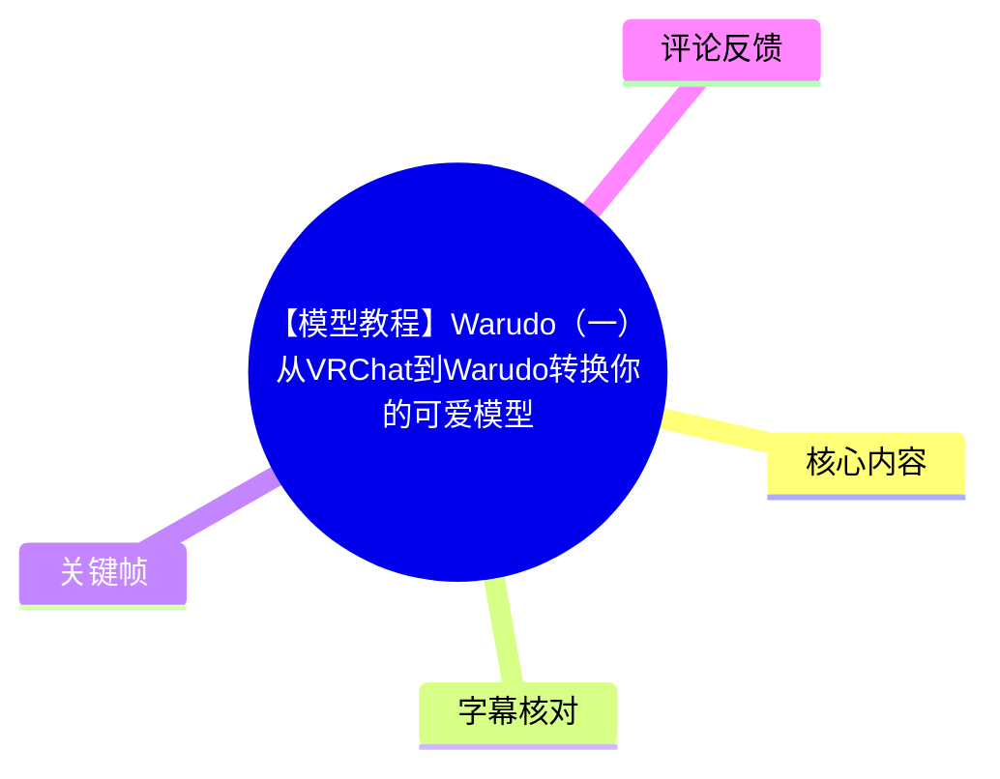
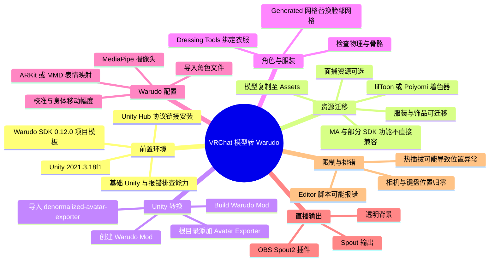
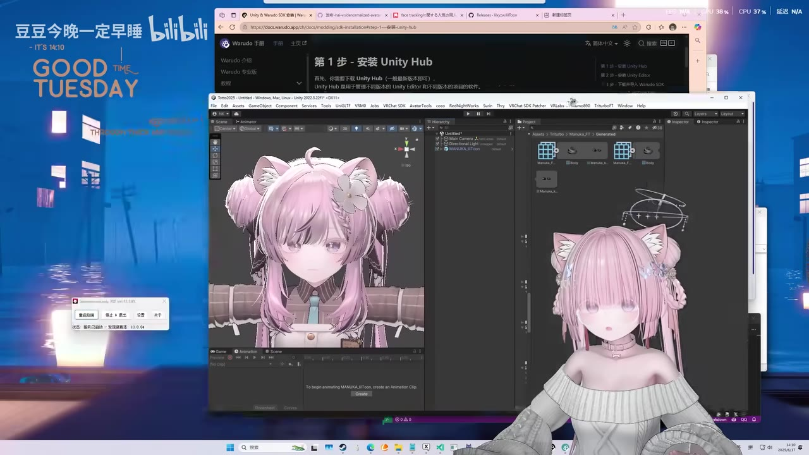
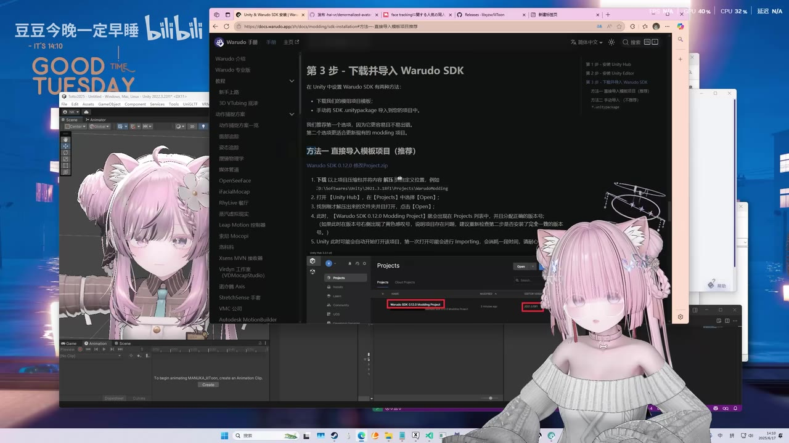
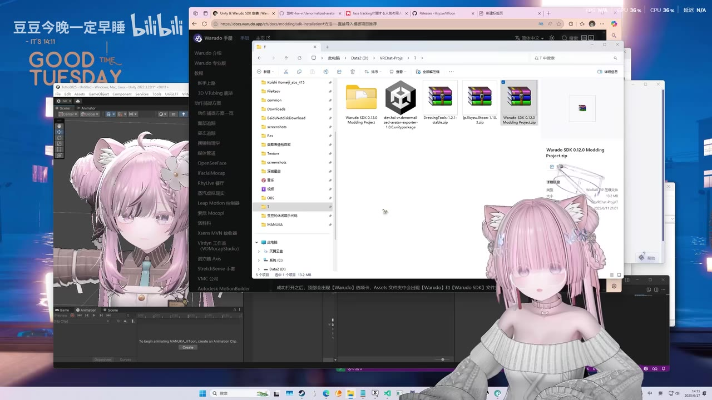
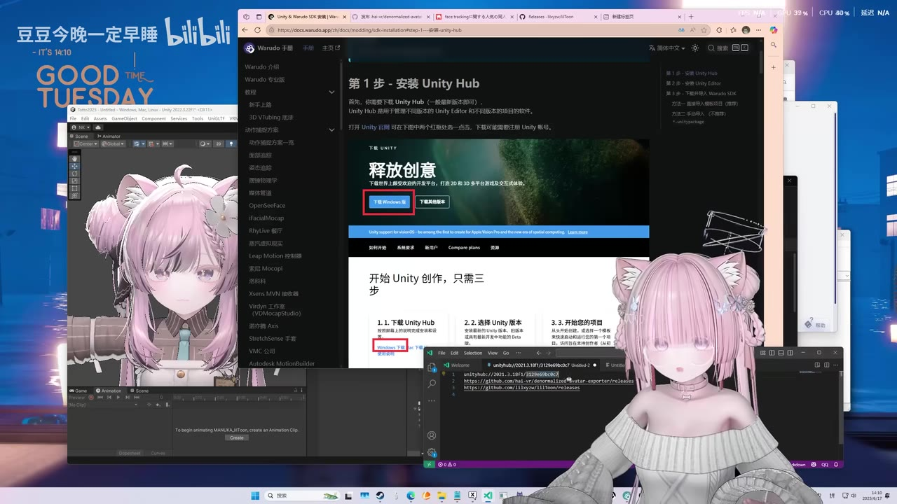

# 【模型教程】Warudo（一）从VRChat到Warudo转换你的可爱模型

> 来源：[Bilibili 视频](https://www.bilibili.com/video/BV1WCNvzBECp)<br>
> UP 主：豆豆今晚一定早睡｜发布时间：2025-06-17｜视频时长：25:17｜合集：建模教程  
> 视频数据抓取时的站内数据：9,238 播放、811 收藏、342 点赞（数据会持续变化）。

## 小结

本期内容演示一条将 **VRChat 模型迁移到 Warudo** 的实操链路：以 Warudo SDK 的 Unity 项目为基础，将模型、服装、着色器与可选的面捕资源迁入项目，使用 `denormalized-avatar-exporter` 添加导出组件并构建 Warudo Mod，最后在 Warudo 中导入角色、配置追踪、表情、透明背景与 OBS 输出。

关键环境约束是 **Warudo 项目只能使用 Unity 2021.3.18f1**。视频描述区提供了对应的 Unity Hub 协议链接、Warudo SDK 0.12.0 项目模板、模型转换工具、lilToon、Dressing Tools 和 OBS Spout2 插件链接。版本是该方案能否复现的首要条件，不能仅以“安装最新版 Unity”替代这一指定版本。

模型迁移并非 VRChat 工程的完整复制。视频明确指出：模型、服装、饰品及部分特效可以复制到新项目；但若依赖 Modular Avatar（MA）或一些 VRChat 小插件／SDK 功能，则不能直接带入或会失效，需要重新绑骨、删除不兼容脚本，或改用 Warudo 内可用的方式实现。

面部效果取决于模型是否具有可用的形态键（BlendShape）。有面捕资源时，可复制相应 Face Tracking 文件夹、替换脸部网格并在 Warudo 中映射 BlendShape；没有面捕时，视频建议使用 MMD 口型，但效果相对有限。UP 主在视频描述区进一步纠正：**有面捕的用户，BlendShape 映射使用默认 ARKit；哪个形态键更多就用哪个。**

Warudo 侧的基础运行方案是 MediaPipe 摄像头追踪；全身追踪可结合 SteamVR 与 SlimeVR 等设备。主播还讲解了透明背景、Spout 输出到 OBS、身体移动幅度约 `0.1`、角色校准、灯光与镜头效果等实用调节点，适合直播、游戏或日常 VTuber 使用。

本教程默认观众已具备 Unity 基础、能处理控制台报错、理解模型导入与资源目录；视频中的“哪里报错删哪里”是演示中的快速处理思路，不应无差别删除未知脚本。工具版本、Warudo SDK 页面、插件下载地址和兼容性均可能随发布时间后更新而变化，应先核验当前官方文档及备份工程。

## 思维导图





## 目录

- [教程目标、前置知识与版本约束](#教程目标前置知识与版本约束)
- [安装 Unity、Warudo SDK 与 lilToon](#安装-unitywarudo-sdk-与-liltoon)
- [面捕资源、BlendShape 与 Warudo 渲染能力](#面捕资源blendshape-与-warudo-渲染能力)
- [迁移模型、服装与资源的兼容性](#迁移模型服装与资源的兼容性)
- [处理报错、导入转换工具并构建 Mod](#处理报错导入转换工具并构建-mod)
- [配置面捕网格与绑定衣服](#配置面捕网格与绑定衣服)
- [在 Warudo 中导入角色与配置追踪](#在-warudo-中导入角色与配置追踪)
- [OBS 输出、校准与画面调节](#obs-输出校准与画面调节)
- [进阶功能、完整流程与热插拔排错](#进阶功能完整流程与热插拔排错)
- [资源、参数与限制清单](#资源参数与限制清单)
- [关键帧索引](#关键帧索引)
- [字幕比对](#字幕比对)
- [评论分析](#评论分析)
- [处理记录](#处理记录)

## 教程目标、前置知识与版本约束

### [教程定位与适用人群](https://www.bilibili.com/video/BV1WCNvzBECp?t=1)

视频目标是把 VRChat 使用的可爱模型转入 Warudo，并完成用于摄像头追踪、直播或游戏场景的基本配置。UP 主说明该教程本来是为朋友准备，因此默认观众至少具备以下能力：

1. 能理解部分 Unity 基本概念和工程结构；
2. 能进行模型资源导入、文件夹复制、组件添加等操作；
3. 能阅读 Unity 控制台报错，并处理不兼容资源；
4. 对 VRChat 模型上传及相关网络环境已有基础认识。

这不是从零开始的建模或 Unity 入门课，而是一个围绕“已有 VRChat 模型如何迁入 Warudo”的迁移教程。

### [硬性版本要求：Unity 2021.3.18f1](https://www.bilibili.com/video/BV1WCNvzBECp?t=25)

视频及描述区均强调，Warudo 的项目只能使用：

```text
Unity 2021.3.18f1
```

视频中通过 Unity Hub 协议短链接启动安装；描述区给出的链接为：

```text
unityhub://2021.3.18f1/3129e69bc0c7
```

将其复制至 Edge 或 Chrome 地址栏并回车，按系统提示打开 Unity Hub，再执行安装即可。

> 注意：视频口播中出现“下载新版本 Unity”的表述，但描述区明确限定为 `2021.3.18f1`。实际复现应以该精确版本为准，而不是使用当下 Unity Hub 默认推荐的最新 LTS 或最新版。



> 图：画面同时展示 Unity 工程、Warudo 文档页面和示例模型，是理解本教程“文档—Unity 转换工程—最终角色”三者关系的起点。

## 安装 Unity、Warudo SDK 与 lilToon

### [下载并解压 Warudo SDK 项目模板](https://www.bilibili.com/video/BV1WCNvzBECp?t=44)

安装 Unity 后，视频进入 Warudo SDK 项目的获取与解压。UP 主提到官方获取方式可能受网络环境影响而下载缓慢，因此在自己的教程文件包中也提供了下载资源。

描述区列出的官方文档与模板为：

- Warudo SDK 安装文档：<https://docs.warudo.app/zh/docs/modding/sdk-installation>
- Warudo SDK 0.12.0 Modding Project：<https://docs.warudo.app/sdk/Warudo%20SDK%200.12.0%20Modding%20Project.zip>
- 教程文件打包链接：<https://adou2056.lanzoul.com/idQWL2yzo8nc>

操作要点：

1. 下载 Warudo SDK Modding Project 压缩包；
2. 将项目解压到准备好的工作目录；
3. 在 Unity Hub 中以 `Unity 2021.3.18f1` 打开这个项目；
4. 等待 Unity 首次导入资源完成。



> 图：该画面显示 Warudo 文档中“下载并导入 Warudo SDK”的步骤，能够确认教程采用的是 SDK Modding Project 工作流，而不是直接在普通 Unity 空项目中随意配置。

### [导入 lilToon：Package 目录方式](https://www.bilibili.com/video/BV1WCNvzBECp?t=111)

视频以 **lilToon** 为主要示例着色器，并称部分欧美模型可能使用 Poiyomi；两者的资源迁移思路类似，但本段重点讲 lilToon 高版本以 Package 形式提供时的安装方法。

描述区提供：

```text
https://github.com/lilxyzw/lilToon/releases
```

如果资源是传统 `.unitypackage`，可按 Unity 常规方式导入。若下载的是 Package 结构，视频展示的步骤为：

1. 在 Warudo Unity 项目的 `Packages` 目录内新建文件夹；
2. 将文件夹命名为：

   ```text
   jp.lilxyzw.liltoon
   ```

3. 将 lilToon 压缩包中对应文件夹的内容解压到这个目录；
4. 视频示例使用的是 lilToon `1.10.3`；
5. 重新打开或等待 Unity 刷新项目，确认 lilToon 已被识别。

这里的重点不只是“导入着色器”，还在于保留模型材质对 lilToon Shader 的依赖；若项目没有相应 Shader，材质可能出现粉色、丢失透明效果或显示异常。



> 图：文件资源窗口中可见 Warudo SDK Modding Project、转换工具、Dressing Tools 与 lilToon 压缩包，有助于辨认本教程需要分别准备的工程、转换器、绑衣工具和着色器资源。

## 面捕资源、BlendShape 与 Warudo 渲染能力

### [面捕的必要条件：脸部网格与形态键](https://www.bilibili.com/video/BV1WCNvzBECp?t=209)

UP 主认为，如果仅使用普通摄像头方案而没有面捕资源，通常只能使用 MMD 口型，面部表现会较弱；若要获得更好的面部效果，需要为模型配置 Face Tracking 资源。

视频以 Manuka 模型为例，建议在 Booth 搜索 `face tracking`，为自己的模型寻找对应资源。重点不是特定模型名称，而是模型脸部需具备可被驱动的**形态键（BlendShape）**。

处理步骤：

1. 导入模型对应的 Face Tracking 资源；
2. 选中模型脸部对象；
3. 找到脸部对应的 `Mesh`；
4. 记住或确认该脸部网格位置；
5. 后续将 Face Tracking 资源生成的网格替换到模型脸部网格位置。

视频解释该网格承担记录和提供脸部形态数据的作用，因此它是 BlendShape 映射能否正确工作的关键资产。

### [MediaPipe、BlendShape 限幅与灯光](https://www.bilibili.com/video/BV1WCNvzBECp?t=310)

UP 主展示 Warudo 使用 **MediaPipe** 作为常用面部追踪方案。Warudo 中可对 BlendShape 参数进行映射与限幅，例如针对 `MouthSmile` 等表情设置合理范围，避免嘴部张开或笑容被驱动得过度夸张。

视频给出的调节原则：

- 不希望嘴巴张得太大时，为对应 BlendShape 设置更低的范围；
- 想增强表情幅度时再提高限制；
- 应以模型自身的形态键制作质量和实际摄像头效果为准，不宜照搬固定数值。

关于渲染，UP 主说明 Warudo 支持：

- 环境光；
- 平行光；
- 点光源；
- 摄像机相关效果，如色彩、反光、环境光、变焦、景深、色差等。

其个人习惯是以环境光打底，并避免或谨慎使用点光源，因为点光可能影响模型透明材质的视觉结果。该结论是视频作者的个人工作流经验，不等于点光源在所有模型上都不可用。

### [面捕映射的描述区纠错](https://www.bilibili.com/video/BV1WCNvzBECp?t=1060)

视频描述区含有一条比口播更明确的更正信息：

> 有面捕的朋友们 BlendShape 映射用默认的 ARKit 就好！哪个形态键多就用哪个！

因此，针对视频中“苹果手机使用某个映射、没有苹果手机则使用 MMD 或 VRM”的口播，应以此补充原则理解：

- **有面捕与较完整形态键**：优先使用默认 ARKit 映射；
- **模型具备多套形态键时**：选择形态键更完整、数量更多的一套；
- **没有适用面捕资源时**：可退回 MMD 口型方案；
- 映射是否可用仍须在角色上逐项测试，不能仅依靠预设名称判断。

## 迁移模型、服装与资源的兼容性

### [可直接复制的资源与不可直接迁移的功能](https://www.bilibili.com/video/BV1WCNvzBECp?t=406)

如果在原 VRChat 项目中已经完成衣服绑定，视频建议将模型和服装资源文件夹复制至新的 Warudo Unity 项目中。示例中，UP 主把模型与毛衣复制到项目的 `Assets` 内。

通常可尝试迁移的内容包括：

- 模型本体；
- 已准备的服装；
- 饰品；
- 部分特效；
- 对应的材质、纹理及所需着色器；
- 可选的 Face Tracking 文件夹。

但视频明确警告，某些依赖 VRChat 工作流的小插件无法直接导入或运行，例如口播中提到的 MA，以及若干“玩具类”插件。其含义是：VRChat 工程内的组件、参数系统、SDK 脚本和自动装配逻辑不必然能被 Warudo SDK 项目识别。

建议按照“先迁基础资产、再逐项验证”的顺序处理：

1. 先复制模型、材质、纹理和基本衣物；
2. 确认 Unity 中模型能正常显示；
3. 再引入面捕和绑衣工具；
4. 最后处理特效、动画或复杂交互；
5. 对无效的 VRChat SDK 依赖，寻找 Warudo 的替代方案，而非期待直接复用。

### [复制面捕资源后的 Editor 报错](https://www.bilibili.com/video/BV1WCNvzBECp?t=492)

如果模型已经有面捕配置，视频建议将对应的面捕文件夹也复制到 Warudo 项目中。UP 主特别提醒，复制后可能发生报错，原因之一是资源中含有 `Editor` 目录或编辑器专用脚本。

视频中的处理方式是删除导致报错的 `Editor` 相关内容。应注意其适用边界：

- 若报错确实来自原资源中仅服务于旧工程或旧 SDK 的 Editor 脚本，删除后可能恢复项目编译；
- 不要只按“哪里报错删哪里”机械操作；
- 删除前建议复制备份、查看 Console 的报错文件路径与依赖关系；
- 如果报错属于必需运行时组件、Shader 缺失或程序集版本不匹配，删除脚本可能引出新的问题。

## 处理报错、导入转换工具并构建 Mod

### [导入 VRChat 模型转换工具](https://www.bilibili.com/video/BV1WCNvzBECp?t=651)

本教程使用的模型转换工具为：

```text
denormalized-avatar-exporter
```

描述区提供下载地址：

```text
https://github.com/hai-vr/denormalized-avatar-exporter/releases
```

UP 主说明该插件用于帮助将 VRChat 模型转换成 Warudo 可用的格式。导入到 Unity 项目后，先将模型拖入场景或在工程中定位其根目录；即使此时仍有个别与旧资源相关的报错，视频示例仍继续演示导出流程，但实际项目应优先确认影响构建的错误是否已解决。

### [添加 Avatar Exporter、创建 Mod 与构建](https://www.bilibili.com/video/BV1WCNvzBECp?t=687)

对于未配置 Face Tracking 的基础模型，视频演示的核心转换步骤如下：

1. 将模型拖入 Unity 场景；
2. 选中模型**根目录对象**；
3. 在 Inspector 点击 `Add Component`；
4. 添加 `Deno... Avatar Exporter`（字幕与 ASR 对完整组件拼写识别不稳定，以下以视频可辨识的 Avatar Exporter 职责描述）；
5. 将模型 Avatar／根对象拖到该组件要求的引用槽位；
6. 在 Unity 顶部工具栏打开 `Warudo` 菜单；
7. 选择 `New Mod`；
8. 输入 Mod 名称；
9. 点击 `Create Mod`；
10. 在创建的 Mod 中点击 `Build Warudo Mod` 开始编译。

Mod 命名限制是：**不要与已有资源文件夹重名**。视频示例使用了 `man`，但这不是固定名称。

> 必须先创建 Warudo Mod。视频在结尾再次强调：如果没有新建 Mod，就不会出现或无法进行对应的构建步骤。

### [保存场景并执行 Build Warudo Mod](https://www.bilibili.com/video/BV1WCNvzBECp?t=927)

如果场景尚未保存，Unity 会要求先保存场景。视频建议随便选择一个合适位置保存后，再执行：

```text
Build Warudo Mod
```

UP 主的体验是 Warudo Mod 编译相较 VRChat SDK 上传流程较快；这是其主观比较，具体耗时仍取决于模型复杂度、贴图、脚本与电脑性能。

构建完成后，视频说明 Warudo 侧会以红框等方式提示需要导入角色。接下来需要从 Warudo 中打开角色文件夹，并将 Unity 构建生成的角色文件复制到该位置。

## 配置面捕网格与绑定衣服

### [将 Generated 网格替换至模型脸部](https://www.bilibili.com/video/BV1WCNvzBECp?t=794)

对于已导入 Face Tracking 资源的模型，视频在 Unity 中继续完成网格替换：

1. 将模型拖入场景；
2. 找到此前导入的 Face Tracking 资源目录；
3. 在示例资源中定位 `Generated`；
4. 找到其中生成的脸部网格资源；
5. 将该生成网格替换到模型脸部所使用的网格位置；
6. 检查模型是否出现可用面部表情。

视频以 Manuka Face Tracking 为例，但不同模型资源的目录和命名会不同；“Generated”是示例资源中的实际线索，不应假定所有面捕包都有同名文件夹。

### [使用 Dressing Tools 绑定衣服](https://www.bilibili.com/video/BV1WCNvzBECp?t=832)

视频使用 **Dressing Tools** 处理衣服绑定，并说明也可选择自己熟悉的绑骨工具。描述区资源链接：

```text
https://booth.pm/zh-cn/items/3639300
```

UP 主对兼容性的判断是：Unity `2021.3.18f1` 不算过旧，多数普通实用插件仍可使用；但一些 SDK 相关功能不可用。

视频中的操作路径以界面显示为准，大致为：

1. 将 Dressing Tools 的 `.unitypackage` 导入项目；
2. 选中 Avatar；
3. 打开工具菜单中的 Dressing Tools；
4. 选择待绑定的衣服；
5. 执行视频界面中的检查、预览和绑定操作；
6. 绑定完成后检查衣服的骨骼与物理效果。

关键验收不是“工具显示已完成”，而是：

- 衣服是否跟随身体骨骼；
- 动作时是否发生明显穿模或错位；
- 物理组件是否仍工作；
- 材质、透明和阴影是否正常；
- 重新添加导出组件后能否正常构建。



> 图：Unity 场景内同时可见模型、工程资源区及面部资源预览，适合辅助理解“模型本体—脸部网格—生成面捕网格”之间需要对应替换的关系。

## 在 Warudo 中导入角色与配置追踪

### [打开角色文件夹并导入构建产物](https://www.bilibili.com/video/BV1WCNvzBECp?t=990)

构建完成后，在 Warudo 新建场景的引导中点击“开始配置”，再打开角色文件夹。将 Unity 构建生成的角色文件复制到该文件夹，随后在 Warudo 中通过“选择角色”打开它。

视频将此作为 Unity 到 Warudo 的交接步骤：

```text
Unity：Build Warudo Mod
       ↓
Warudo：打开角色文件夹
       ↓
复制构建文件
       ↓
选择角色并确认导入
```

### [全身追踪、上半身追踪与表情映射选择](https://www.bilibili.com/video/BV1WCNvzBECp?t=1029)

视频区分两类使用需求：

| 使用需求 | 视频建议 |
| --- | --- |
| 全身追踪 | 可选择全身追踪方案，视频提及 SteamVR、SlimeVR 等设备方案。 |
| 仅上半身／普通摄像头 | 选择摄像头，并使用 MediaPipe 摄像头追踪。 |
| 有面捕资源 | 使用对应 BlendShape 映射；描述区更正推荐默认 ARKit，并选形态键更多的方案。 |
| 没有面捕资源 | 使用 MMD 口型；视频称其效果较弱。 |
| 部分模型没有合适形态键 | 可能需要在 MMD、VRM 等选项之间按模型实际制作情况选择。 |

关于头部待机丢失、形态键同步、混合模式等选项，UP 主给出的建议较偏个人习惯：

- 头部追踪丢失相关项可保留默认或按个人需求启用；
- 混合模式确认即可；
- 追踪姿态中，身体摆动与手部控制可选键盘；
- 若有触控板，也可以按设备情况选择；
- “次要”选项不建议随意勾选，UP 主认为可能导致表现奇怪。

这些配置名称可能随 Warudo 版本和界面语言发生变化，复现时应以当前版本功能说明为准。

## OBS 输出、校准与画面调节

### [透明背景与 Spout 输出至 OBS](https://www.bilibili.com/video/BV1WCNvzBECp?t=1123)

视频启用透明背景，并将 Warudo 输出方式设置为 **Spout**，以便在 OBS 中捕捉。

描述区提供 OBS 需要的 Spout2 插件：

```text
https://github.com/Off-World-Live/obs-spout2-plugin/releases/tag/1.10.0
```

基本链路为：

1. 在 Warudo 中启用透明背景；
2. 选择 Spout 作为输出方式；
3. 安装 OBS Spout2 插件；
4. 在 OBS 中添加对应的 Spout 接收源；
5. 检查透明通道、模型边缘和合成结果。

视频表述中多次将 Spout 识别为 “sport”，这是字幕／ASR 对英文术语的误识；结合描述区的 `obs-spout2-plugin` 链接，应校正为 **Spout／Spout2**。

### [键盘位置、身体移动幅度与一键校准](https://www.bilibili.com/video/BV1WCNvzBECp?t=1203)

UP 主展示了 MediaPipe 场景下的位置调整问题：若下半身没有稳定约束，头部晃动时角色整体可能显得不自然。

视频中给出的实际参数建议为：

```text
身体移动幅度：约 0.1
```

UP 主表示将该值调到约 `0.1` 后，角色不会摇晃得过分；ASR 有一处将后半句识别成 `0.2`，但站内字幕清楚写作“我是 0.1 的话”，故本笔记以站内字幕为准。

操作思路：

1. 通过变换工具调整键盘／控制位置到舒适范围；
2. 在 MediaPipe 相关设置中找到身体移动幅度；
3. 设为约 `0.1` 后观察头部晃动与下半身稳定性；
4. 每次打开软件后，可进入“角色”执行一次校准；
5. 通过一键校准让追踪姿态快速对齐。

### [灯光、摄像机特效与画面优化](https://www.bilibili.com/video/BV1WCNvzBECp?t=1308)

UP 主推荐的基础渲染组合是：

```text
环境光打底 + 平行光 +（按需要添加）点光源
```

此前又提到个人通常不开点光源，因为透明材质可能受影响。因此更准确的理解是：

- 环境光与平行光是其常用基础；
- 点光源可作为可选补充，而非强制项；
- 透明材质异常时，优先检查点光与材质 Shader 的交互；
- 镜头可调节色彩、景深、色差等，但视频不提供固定参数；
- 画面表现与模型是否在 lilToon 中进行了阴影等材质优化密切相关。

UP 主展示的模型做过额外阴影处理，口播称为类似 `rain shade` 的处理；该英文专名在两份字幕中均不稳定，无法仅依素材确定其准确功能或拼写。因此只能确认：示例模型有额外材质／阴影优化，效果会更立体；若要改善观感，可继续在 lilToon 设置中自行调整。

## 进阶功能、完整流程与热插拔排错

### [动作、待机、表情与 IK 等进阶项](https://www.bilibili.com/video/BV1WCNvzBECp?t=1408)

视频最后提到 Warudo 角色功能中还可配置：

- 动作；
- 待机动作；
- 表情动画；
- IK；
- 布娃娃／网格等相关功能；
- 对不需要组件的开关控制。

UP 主以“思考”待机效果作示例，认为这类功能对日常使用很有帮助。该部分是功能概览而非逐项教程，具体资源格式、导入路径、兼容范围与参数没有在视频中展开。

### [完整工作流复盘](https://www.bilibili.com/video/BV1WCNvzBECp?t=1447)

根据视频结尾，完整流程可整理为：

1. 安装 **Unity 2021.3.18f1**；
2. 下载、解压并打开 Warudo SDK 项目；
3. 导入模型依赖的 Shader，例如 lilToon；
4. 将模型、服装、纹理等资源迁入项目；
5. 有面捕需求时导入面捕资源，并处理脸部网格；
6. 有衣服需求时重新绑骨并检查物理效果；
7. 导入 `denormalized-avatar-exporter` 转换工具；
8. 在模型根目录添加 Avatar Exporter 并指定 Avatar；
9. 通过 `Warudo → New Mod` 创建 Mod；
10. 注意 Mod 名称不能与资源文件夹冲突；
11. 保存场景；
12. 执行 `Build Warudo Mod`；
13. 在 Warudo 中打开角色文件夹，复制构建结果；
14. 选择角色并配置 MediaPipe／全身追踪、表情映射和姿态；
15. 启用透明背景，配置 Spout 与 OBS；
16. 校准角色，并继续调节灯光、镜头、动作和表情。

### [热插拔后模型位置异常的处理](https://www.bilibili.com/video/BV1WCNvzBECp?t=1471)

视频提出一个实用排错场景：在 Warudo 中热插拔、更换模型后，角色位置可能变得异常。

UP 主给出的处理顺序：

1. 将摄像机位置归零；
2. 将变换器相关位置归零；
3. 将键盘位置归零；
4. 再重新调整键盘位置，使其与角色位置匹配。

这是一套针对“换模型后位置偏移”的恢复思路。若归零后仍异常，还应检查角色根节点、模型比例、初始姿态、追踪校准状态以及是否残留旧角色的变换设置；后半部分属于基于问题机制的排查建议，并非视频明确演示的额外步骤。

## 资源、参数与限制清单

### 视频提供的资源链接

| 用途 | 链接／版本 |
| --- | --- |
| 教程文件包 | <https://adou2056.lanzoul.com/idQWL2yzo8nc> |
| Unity 指定版本 | `unityhub://2021.3.18f1/3129e69bc0c7` |
| Warudo SDK 文档 | <https://docs.warudo.app/zh/docs/modding/sdk-installation> |
| Warudo SDK 模板 | <https://docs.warudo.app/sdk/Warudo%20SDK%200.12.0%20Modding%20Project.zip> |
| 模型转换工具 | <https://github.com/hai-vr/denormalized-avatar-exporter/releases> |
| lilToon | <https://github.com/lilxyzw/lilToon/releases> |
| Dressing Tools | <https://booth.pm/zh-cn/items/3639300> |
| OBS Spout2 插件 | <https://github.com/Off-World-Live/obs-spout2-plugin/releases/tag/1.10.0> |

### 视频明确出现的参数与选择

| 项目 | 视频中的建议／示例 | 说明 |
| --- | --- | --- |
| Unity 版本 | `2021.3.18f1` | 描述区明确为 Warudo 项目硬性限制。 |
| Warudo SDK 模板 | `0.12.0` | 视频描述区提供的模板版本。 |
| lilToon 示例版本 | `1.10.3` | 视频导入 Package 时展示。 |
| 追踪方案 | MediaPipe 摄像头 | 面部／上半身日常需求方案。 |
| 面捕映射 | 默认 ARKit | 来自描述区纠错；选择形态键更多的方案。 |
| 无面捕时口型 | MMD | 视频认为效果相对较差。 |
| 身体移动幅度 | 约 `0.1` | 用于减轻下半身因头部晃动产生的夸张摇摆。 |
| 渲染基础 | 环境光＋平行光 | 点光源按透明材质实际效果谨慎使用。 |
| OBS 输出 | Spout | 需安装 OBS Spout2 插件。 |
| Mod 构建 | `Build Warudo Mod` | 创建 Mod 后才能执行的关键步骤。 |

### 已知限制与风险

1. **版本时效性**：教程发布于 2025-06-17，所列 SDK、插件、Warudo 文档路径和下载包版本在之后可能已更新或变更。
2. **Unity 版本不可随意替换**：该教程明确要求 `2021.3.18f1`，使用其他版本可能导致项目、包或 SDK 兼容问题。
3. **VRChat 功能并非完整迁移**：MA、SDK 依赖和部分插件不能直接迁移；不能把“复制资源”理解为“复制全部 VRChat 功能”。
4. **材质依赖需要保留**：模型若依赖 lilToon、Poiyomi 或特定 Shader，缺失后可能导致材质异常。
5. **面捕取决于模型资产**：有无形态键、Face Tracking 网格是否正确、映射是否匹配，都直接影响效果。
6. **报错处理应保守**：视频示例删除 `Editor` 内容以解决迁移报错，但应先备份和确认依赖，避免误删必要代码。
7. **衣服绑定需实际验收**：工具完成不等于物理、骨骼、穿模和材质都正常。
8. **透明与灯光存在互相影响**：点光源可能影响透明表现，需在真实直播合成环境中验证。
9. **热插拔可能改变变换关系**：更换角色后应归零相机和控制位置后重新校准。

## 关键帧索引

### [环境与文档准备](https://www.bilibili.com/video/BV1WCNvzBECp?t=25)


> 价值：展示教程同时使用 Unity、Warudo 文档和模型工程的桌面环境，帮助定位“先按文档准备 SDK、再在 Unity 中处理模型”的总体工作方式。

### [Unity Hub 安装指引](https://www.bilibili.com/video/BV1WCNvzBECp?t=36)


> 价值：画面可见 Warudo 文档中的 Unity Hub 下载区域，适合对应本教程指定 Unity 环境的准备步骤。

### [Warudo SDK 模板下载说明](https://www.bilibili.com/video/BV1WCNvzBECp?t=51)


> 价值：画面明确显示“下载并导入 Warudo SDK”相关文档内容，说明所使用的是官方 Modding Project 模板路径。

### [工具文件清单](https://www.bilibili.com/video/BV1WCNvzBECp?t=80)


> 价值：资源管理器中集中出现 Warudo SDK 模板、模型转换工具、Dressing Tools 与 lilToon，是复现前核对下载物是否齐全的直观依据。

## 字幕比对

| 字幕来源 | 完整性 | 专有名词 | 时间轴 | 主要问题 |
| --- | --- | --- | --- | --- |
| Bilibili 站内字幕 `p01-ai-zh.srt` | 覆盖从 00:00:01 至 00:25:14，分段较细，整体完整 | 多处音译错误，如“挖漏斗”“六寸”“brand ship”“sport” | 可直接使用，时间分段精细 | 英文工具名、菜单名和部分插件名识别不稳定；个别句子有遗漏或重复。 |
| 本次 ASR `large-v3-turbo` | 111 段，语音覆盖约 83.48%，从 00:00:01.330 至 00:25:13.230 | 同样存在 Warudo、lilToon、Dressing Tools、Avatar Exporter、Spout 等误识 | 带真实时间戳；分段较长 | 大段合并造成菜单步骤难以定位；有两处约 10 秒的大间隔；术语误识较多。 |

### 最终字幕选择与校正原则

本次同时检查了站内字幕与 ASR 结果；`asr-result.json` 未标记 `noAudioStream=true`，且诊断显示存在 1,266.37 秒语音内容，因此源视频**具有音轨**，不存在“无音轨导致 ASR 无法工作”的情况。

正文时间轴优先采用站内 SRT 的精细起止时间，并以本次 ASR 的真实时间戳、音频覆盖诊断及关键帧画面进行交叉核对。对于明显的英文术语错误，依据视频描述区链接、可见界面和上下文作如下保守校正：

| 字幕常见误识 | 正文采用 | 校正依据 |
| --- | --- | --- |
| 挖漏斗／瓦洛多／瓦鲁斗 | Warudo | 视频标题、标签、官方文档链接。 |
| 六寸／lio tone／Liotum | lilToon | 视频描述区 GitHub 链接与常见 Unity Shader 名称。 |
| brand ship／reship | BlendShape | 面捕、形态键、ARKit 映射上下文。 |
| sport | Spout | 描述区明确给出 `obs-spout2-plugin`。 |
| jessing tool／摘心拖 | Dressing Tools | 视频描述区 Booth 链接。 |
| Deno… Avatar Exploiter | `denormalized-avatar-exporter` / Avatar Exporter | 描述区转换工具链接；组件完整显示受字幕识别限制。 |
| rain shade 相关表述 | 未确定专名，仅记录为额外阴影／材质处理 | 两份字幕均不稳定，素材不足以确认准确拼写与功能。 |

此外，视频描述区在 17:45 附近的表情映射讲解上作出明确纠错，正文已将“有面捕时使用默认 ARKit、优先选形态键更多者”作为较高优先级信息记录。

## 评论分析

以下仅处理可获取的热评前三条；评论反映的是用户体验和需求，不作为已验证技术事实。

1. **塔尔斯Tails（9 赞）**  
   评论称，委托部分服务者将 VRC 模型转 Warudo 时常出现材质怪异、转换瑕疵等问题，并询问是否有有偿协助者；对方曾建议其直接使用 VRoid 格式模型。  
   - 价值：印证“材质与模型转换质量”是实际迁移中的高频痛点。  
   - 与视频的关联：视频确实强调需迁移 lilToon 等 Shader、处理插件兼容性并检查结果。  
   - 限制：该评论未提供模型、Unity 版本、错误截图或具体服务方信息，不能据此判断 VRC 转 Warudo 普遍失败，也无法验证“VRoid 更好”的结论。

2. **小貓腻（8 赞）**  
   评论为“是小猪豆，我们有救了”，属于对 UP 主发布教程的积极回应。  
   - 价值：反映该教程切中了部分观众的模型迁移需求。  
   - 限制：没有提出技术细节、补充参数或可验证经验。

3. **羡鱼-YU已毕业（4 赞）**  
   评论为“老师，这个怎么处理啊”。  
   - 价值：说明视频评论区可能存在观众遇到具体问题后寻求帮助。  
   - 限制：当前可获取内容没有附带截图、上下文或问题对象，无法判断其指向面捕、材质、构建还是追踪问题，因此不可延伸为技术结论。

## 处理记录

- Worker ID：`worker-msaeho0y-365b05fe`
- 模型：`gpt-5.6-terra`
- 视频标识：`BV1WCNvzBECp`
- 使用素材与工具：
  - Bilibili 元数据、视频描述、标签与热评前三条；
  - 站内字幕：`subtitles/p01-ai-zh.srt`；
  - 本次 ASR：`large-v3-turbo`，CUDA，`int8_float16`；
  - ASR 时间轴文件：`asr/transcript.srt`、`asr/asr-result.json`；
  - 关键帧目录：`frames/`；
  - 多模态画面核对：提供的 Unity、Warudo 文档、资源文件窗口关键帧。
- 字幕选择：以站内 SRT 的细粒度时间段为主要时间轴依据；逐项检查 ASR，使用其时间戳与覆盖诊断辅助验证；对英文专名以视频描述区链接、画面与上下文校正。
- 音轨判断：ASR 诊断未出现 `noAudioStream=true`；识别到中文语音，语音覆盖率约 `83.48%`，因此按“有音轨”处理。
- 关键帧选择依据：选用展示 Unity 与 Warudo 文档、SDK 导入页面、工具包文件清单、模型与面部资源界面的帧，用于支撑环境准备、SDK 工作流、资源依赖与面捕网格概念；图片均使用相对路径 `frames/xxx.jpg`。
- 缓存清理：未提供可执行缓存清理日志；本记录未声称已删除工作目录、音频、帧或字幕缓存。
- 未解决问题：
  - `Avatar Exporter` 组件在字幕中存在严重英文误识，无法仅凭字幕还原完整 Unity 菜单／组件字符串；
  - 视频所称额外阴影处理的英文专名识别不稳定，未将其扩展为确定插件或参数；
  - 当前素材未提供完整关键帧时间戳映射，关键帧正文位置按对应画面内容和相邻真实字幕区段使用，不将图片文件编号误作精确视频秒数。
