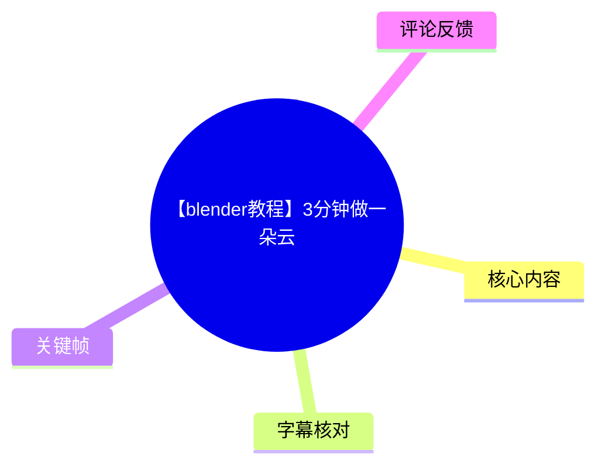
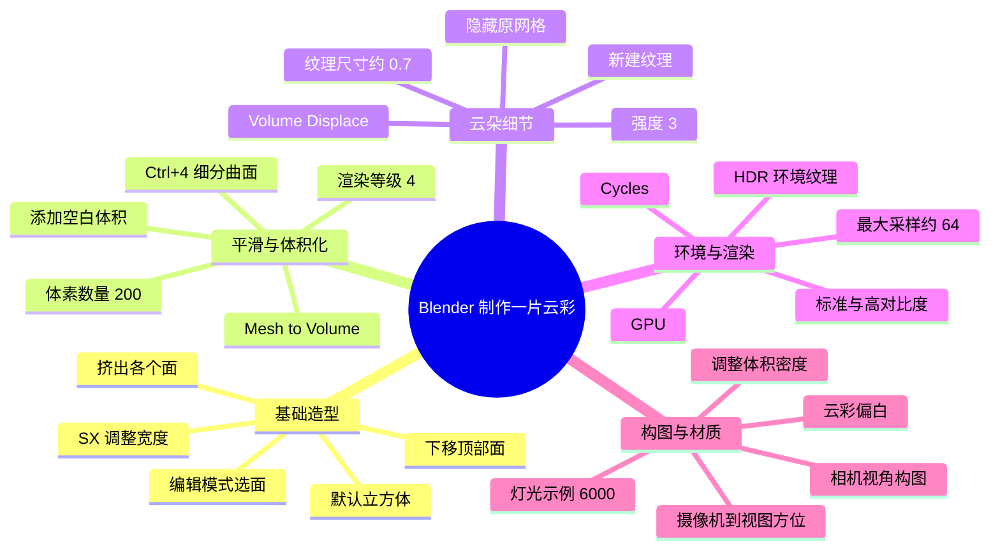
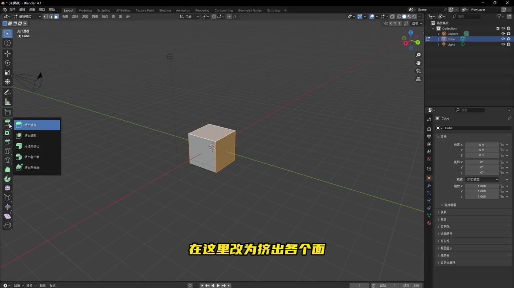
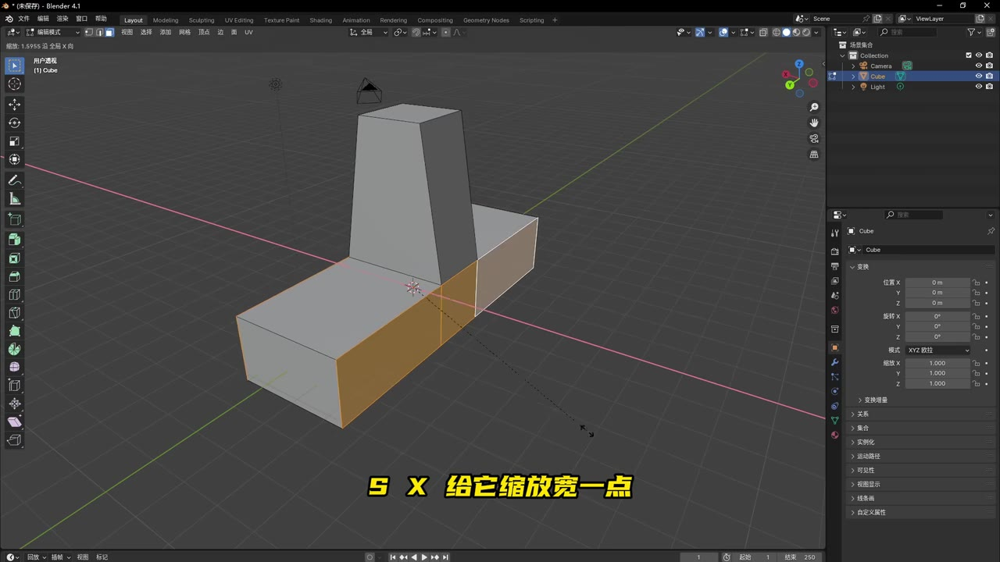
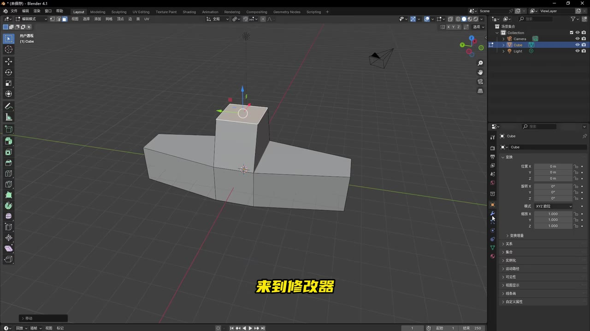
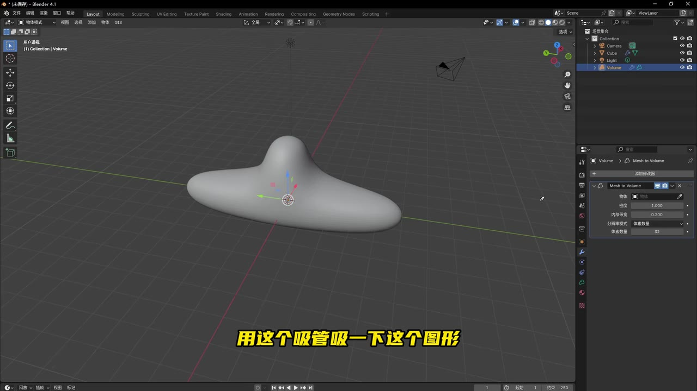

# 【blender教程】3分钟做一朵云

> 来源：[Bilibili 视频](https://www.bilibili.com/video/BV17aBXYjESR) 
> UP 主：灰色执照｜发布时间：2024-11-27｜视频时长：3 分 21 秒｜分辨率：1920×1080  
> 视频简介：3 分钟用 Blender 做一片云彩。

## 小结

本视频是一则 Blender 快速建模与渲染教程：从默认立方体出发，经由编辑模式挤出塑造基础轮廓、细分曲面平滑、`Mesh to Volume`（网格转体积）转化为体积对象，再叠加体积置换噪声，制作出一片具有起伏的云彩。

核心方法不是直接使用现成的云朵模型，而是先用低模网格控制云的总体形状，再使用体积工作流获得柔软的边缘和内部厚度。该方法的关键参数包括：细分等级与渲染等级均设为 `4`、体素数量设为 `200`、纹理尺寸约 `0.7`、体积置换强度设为 `3`、Cycles 最大采样约 `64`，以及灯光示例值 `6000`。

渲染部分使用 HDR 天空环境纹理提供背景与环境光，渲染器切换为 Cycles、设备选 GPU；色彩管理中将“查看变换”设为“标准”、胶片效果设为“高对比度”。随后通过锁定“摄像机到视图方位”来寻找构图，并在着色器编辑器中调整云的白色程度与体积密度。

教程适合已能进入 Blender 基础界面、理解对象/编辑模式、修改器和材质面板位置的初学者。视频以操作演示为主，未展示完整的节点连线、HDR 下载页面、最终渲染耗时、显卡型号或不同体积密度的精确数值，因此复现时仍需根据设备性能和画面效果自行微调。

该视频发布于 2024 年 11 月，画面中可见 Blender 4.1 界面。Blender 后续版本的中文界面译名、面板位置和部分参数默认值可能变化；教程中的参数应视为作者示例而非通用固定标准。视频不涉及新闻事件或时效性行业结论，时效性主要体现在软件版本与 HDR 素材网站可用性上。

## 思维导图

## 目录

- [视频范围、前置条件与时效性](#视频范围前置条件与时效性)
- [基础网格：由立方体塑造云的轮廓](#基础网格由立方体塑造云的轮廓)
- [细分与网格转体积](#细分与网格转体积)
- [体积置换：形成云朵起伏](#体积置换形成云朵起伏)
- [HDR 环境、Cycles 与色彩管理](#hdr-环境cycles-与色彩管理)
- [构图、材质、密度与补光](#构图材质密度与补光)
- [完整复现步骤与参数清单](#完整复现步骤与参数清单)
- [结果、限制与可迁移经验](#结果限制与可迁移经验)
- [字幕比对](#字幕比对)
- [评论分析](#评论分析)
- [处理记录](#处理记录)

## 视频范围、前置条件与时效性

视频总长 201 秒，但本次 ASR 的首段语音时间为 00:00:37.970；此前约 38 秒没有可用语音转写内容。教程主体覆盖从建模、体积化、材质与环境设置，到相机构图和最终渲染的流程。

需要具备的操作基础包括：

- 能在 Blender 中切换**编辑模式**与**物体模式**；
- 知道如何选择面、进行挤出、缩放和移动；
- 能在修改器、世界环境、渲染属性、色彩管理、材质/着色器编辑器中找到相应设置；
- 使用 Cycles 的 GPU 渲染时，需要本机 Blender 与显卡驱动配置支持相应的 GPU 计算后端。视频只说明“设备改成 GPU”，未说明硬件与后端配置方式。

视频画面中的 Blender 标题栏显示为 **Blender 4.1**。这可用于定位其界面语境，但不能据此推断当前任意版本的精确菜单名称或默认参数。

## 基础网格：由立方体塑造云的轮廓 [00:00:37](https://www.bilibili.com/video/BV17aBXYjESR?t=37)

作者从默认立方体开始，按 `Tab` 进入编辑模式并切换到面选择。其思路是把立方体的若干侧面分别拉出，使单一盒体先成为横向展开、局部隆起的低模形状。

操作要点如下：

1. 选择一个侧面，再按住 `Shift` 追加选择其他面。
2. 将挤出方式设为“**挤出各个面**”（画面字幕显示为“在这里改为挤出各个面”）。
3. 向上拉动操作环/控件，形成多块挤出的几何区域。
4. 继续选择侧边面，并通过 `S`、`X` 沿 X 轴缩放，使轮廓更宽。
5. 选择两个面后，将变换枢轴切换为“**各自的原点**”，再使用 `S`、`X` 缩小。
6. 选择顶部面并向下移动，改变中间顶部的高度关系。

这一步的目标是建立“横向云层 + 中央隆起”的大形，而不是做出最终可见的硬表面。后续的细分和体积化会显著软化几何边界，因此这里的面挤出布局仍会影响云团最终的分布。

> 图：画面显示默认 Cube 与“挤出各个面”选项。它说明作者并非直接添加云朵原始体，而是以立方体的多面挤出建立初始结构。

> 图：已挤出的网格具有左右延展与中部竖起的结构，屏幕字幕提示“`S X` 给它缩放宽一点”。该帧有助于理解云层的横向比例来自基础网格，而非后续噪声随机生成。

> 图：低模云形的顶部面正被移动，字幕提示“来到修改器”。此帧连接了手工控制形状与后续非破坏性修改器处理两个阶段。

## 细分与网格转体积 [00:00:38](https://www.bilibili.com/video/BV17aBXYjESR?t=38)

作者完成低模编辑后回到物体模式，在修改器阶段进行平滑和体积化。

### 1. 添加细分曲面

作者使用快捷键 `Ctrl + 4` 添加四级细分，并将渲染等级也改为 `4`。

- **视图等级：4**：在视口中显示较平滑的结果；
- **渲染等级：4**：最终渲染采用同等细分程度。

这意味着模型在渲染时会保持较高的平滑度，但也会提高计算开销。视频未说明是否应用修改器，按演示可理解为保留修改器链的非破坏性工作流。

### 2. 添加并设置体积对象

随后作者添加“空白体积”（ASR 原文有“体积空白”等识别误差，结合 Blender 的常见对象名称和画面中的 `Volume` 对象，应理解为添加空白体积对象），再在该体积对象上添加 **Mesh to Volume（网格转体积）**修改器。

该修改器通过吸管指定前面制作的网格作为输入。输入网格在完成引用后不再需要直接显示，因此作者将原网格隐藏，并关闭其渲染可见性。

作者把“体素数量”调整为 `200`。ASR 将该词识别为“体速数量”，但该处结合画面与 Blender 体积转换功能，应校正为**体素数量**。体素数量决定体积表示的细节程度：数值提高通常会让体积边界和细节更精细，同时增加内存占用与计算成本；视频没有提供不同数值的对比，也未给出项目尺度，因此 `200` 应作为该演示场景的参考值。

> 图：画面中 Outliner 已出现 `Volume` 对象，修改器面板显示 `Mesh to Volume`，对象轮廓已从硬边网格变成平滑的体积形。该帧直接验证了“网格作为体积来源”的工作流，也显示吸管用于指定输入对象。

## 体积置换：形成云朵起伏 [00:01:02](https://www.bilibili.com/video/BV17aBXYjESR?t=62)

体积转换后，作者继续添加一个体积置换修改器；ASR 中“形变体秩置换”等词存在明显误识别，结合 Blender 功能名称，应记录为 **Volume Displace（体积置换）**。

操作顺序为：

1. 给体积对象添加 Volume Displace 修改器；
2. 新建一个纹理；
3. 在纹理设置中选择“云”（ASR 识别成“匀续”，此处按语境校正为**云纹理/Clouds**）；
4. 将纹理尺寸调整到约 `0.7`；
5. 返回修改器，将置换强度调为 `3`。

这里的分工是：

- **基础网格**控制云的宏观轮廓和主体位置；
- **Mesh to Volume**把连续表面转化为可表现厚度的体积；
- **Clouds 纹理 + Volume Displace**为体积外形加入自然、不规则的起伏。

作者判断：强度调整到 `3` 后，“这样它就很像一片云了”。这属于作者针对当前场景的视觉判断，并非可普遍量化的物理云模拟参数。纹理尺寸 `0.7` 与强度 `3` 的效果还会受模型尺寸、体素设置、噪声纹理具体类型及 Blender 版本影响。

## HDR 环境、Cycles 与色彩管理 [00:01:27](https://www.bilibili.com/video/BV17aBXYjESR?t=87)

作者在预览效果后进入渲染阶段，首先为场景添加 HDR 天空材质。视频称可在一个网站免费下载 HDR 材质，但未说出或展示可核实的网站名称，因此不能据此确认具体来源、授权范围或下载持续可用性。

### 设置世界环境 HDRI

作者的操作路径可整理为：

1. 点击**世界环境**；
2. 在颜色旁的小圆点（插槽）中，将颜色来源改为**环境纹理**；
3. 打开先前下载的天空 HDR 材质文件。

HDRI 在这里承担两项作用：

- 作为画面中的天空背景；
- 向云体提供环境光照与反射/明暗氛围。

视频未说明 HDR 文件格式、分辨率、曝光或旋转角度；不同 HDRI 会明显改变云的亮暗方向、天空颜色和画面情绪。

### 切换 Cycles 与采样设置

作者接着进行如下渲染设置：

| 设置项 | 视频中的设置 | 作用与注意事项 |
| --- | ---: | --- |
| 渲染引擎 | Cycles | 用于体积渲染；通常比实时引擎更重。 |
| 设备 | GPU | 借助 GPU 计算；前提是本机支持并已正确配置。 |
| 最大采样 | 约 64 | 作者的示例值；实际应在画质、噪点与耗时之间取舍。 |
| 渲染最大采样 | 约 64 | ASR 口述为“渲染的最大采样也是 64 左右”；未展示降噪设置。 |

### 色彩管理

作者打开色彩管理，设置为：

| 色彩管理项 | 视频中的设置 |
| --- | --- |
| 查看变换 | 标准 |
| 胶片效果 | 高对比度 |

这些设置用于加强画面的视觉对比。视频只展示最终选择，未解释其与其他查看变换、曝光、伽马或显示设备的关系。因此，若云朵显得过暗、过曝或色彩不符合预期，应先检查 HDRI 强度、灯光、材质密度及显示变换，而不是机械固定全部参数。

## 构图、材质、密度与补光 [00:02:15](https://www.bilibili.com/video/BV17aBXYjESR?t=135)

### 锁定相机到视图并选择角度

作者展开侧边栏，在“视图”中勾选“**摄像机到视图方位**”，再按小键盘 `0` 进入相机视角。开启该选项后，用户在视图中的导航会同步驱动相机位置和朝向，从而更直观地寻找构图。

作者选择了自己认为合适的角度后，将底部区域切换为着色器编辑器。视频没有给出相机焦距、位置坐标、旋转角度或景深设置；构图需要观看者自行决定。

### 新建材质并调整云体外观

在着色器编辑器中，作者新建材质，并将云彩“稍微弄白一点”。接着在体积相关参数中调整密度：

- **密度越大，云彩越厚重。**

这句话说明密度是画面中云体厚薄、透光感与遮蔽感的重要控制项。作者未报出最终密度数值，也没有展示明确的节点类型、节点连接或颜色数值；因此，视频只能确认“创建材质、调白颜色、调整密度”这一过程，无法据此还原精确节点网络。

### 调整灯光并渲染

相机位置确定后，作者关闭不再需要的面板，发现光线偏弱，将灯光向下移动并尝试把灯光强度调为 `6000`。随后认为效果“还不错”，点击“渲染图像”获得最终成品图。

`6000` 是视频中明确给出的示例灯光数值，但未说明灯光类型、功率单位、色温、尺寸和原始数值。Blender 灯光强度的视觉效果还与灯类型、距离、曝光、HDRI 和场景尺度有关，因此不能脱离本场景直接照搬。

## 完整复现步骤与参数清单 [00:00:37](https://www.bilibili.com/video/BV17aBXYjESR?t=37)

以下按视频实际顺序汇总，带有“约”的数值均为作者口述示例。

### 操作步骤

1. 保留默认立方体，按 `Tab` 进入编辑模式并进入面选择。
2. 选取侧面和其他相关面，使用“挤出各个面”拉出多个区域。
3. 继续选择侧边面，按 `S`、`X` 将轮廓向 X 轴方向加宽。
4. 选择部分面，将枢轴点设为“各自的原点”，再次用 `S`、`X` 调整局部尺寸。
5. 选择顶部面并向下移动，形成中央与两侧高低不同的低模云形。
6. 返回物体模式，按 `Ctrl + 4` 添加细分曲面；将渲染等级同步设为 `4`。
7. 添加空白体积对象，在其上添加 Mesh to Volume 修改器，通过吸管指定前述网格。
8. 将体素数量设为 `200`；隐藏原始网格，并关闭其渲染可见性。
9. 添加 Volume Displace 修改器，新建纹理并使用云纹理。
10. 将纹理尺寸设为约 `0.7`，将置换强度设为 `3`。
11. 在世界环境中，将颜色插槽改为环境纹理，载入已下载的天空 HDRI。
12. 将渲染器设为 Cycles，设备选 GPU；最大采样约设为 `64`，渲染最大采样也约设为 `64`。
13. 在色彩管理中，将查看变换设为“标准”、胶片效果设为“高对比度”。
14. 勾选“摄像机到视图方位”，按小键盘 `0` 进入相机视图，通过视图导航寻找构图。
15. 打开着色器编辑器，新建材质；将云调得偏白，并依据厚重感调节密度。
16. 将灯光下移，尝试把灯光数值调至 `6000`。
17. 认为画面效果合适后，执行“渲染图像”。

### 关键参数表

| 模块 | 参数 | 视频示例值 | 说明 |
| --- | --- | ---: | --- |
| 细分曲面 | 视图等级 | 4 | 快捷键 `Ctrl + 4`。 |
| 细分曲面 | 渲染等级 | 4 | 与视图等级保持一致。 |
| Mesh to Volume | 体素数量 | 200 | 影响体积细节与计算负载。 |
| 体积置换纹理 | 纹理类型 | 云纹理 | ASR 原词存在误识别，按上下文校正。 |
| 体积置换纹理 | 尺寸 | 约 0.7 | 控制噪声尺度。 |
| Volume Displace | 强度 | 3 | 控制起伏程度。 |
| 渲染器 | 引擎 | Cycles | 用于体积渲染。 |
| 渲染设备 | 设备 | GPU | 依赖本机硬件支持。 |
| 渲染采样 | 最大采样 | 约 64 | 画质与耗时折中。 |
| 渲染采样 | 渲染最大采样 | 约 64 | 视频口述值。 |
| 色彩管理 | 查看变换 | 标准 | 视频中明确设置。 |
| 色彩管理 | 胶片效果 | 高对比度 | 视频中明确设置。 |
| 灯光 | 强度示例 | 6000 | 灯类型和单位未展示。 |
| 材质 | 密度 | 未给出 | 仅说明越大越厚重。 |

## 结果、限制与可迁移经验 [00:03:10](https://www.bilibili.com/video/BV17aBXYjESR?t=190)

视频最后确认，在作者当前的 HDR、相机、材质与灯光条件下，画面效果达到可接受程度，可以点击“渲染图像”输出最终成品。

### 可迁移经验

- **先控制大形，再增加细节。** 用低模挤出决定云层主轮廓，再让细分、体积化和噪声处理细节，能避免完全随机的噪声导致结构松散。
- **体素分辨率是质量与性能的平衡点。** 更高的体素数量可改善边缘和置换细节，但会带来更高的显存、内存及渲染成本。
- **云体外观由多项因素共同决定。** 置换纹理、体积密度、HDRI、局部灯光、色彩管理与相机角度都会改变最终观感，不能把单一参数当作唯一决定因素。
- **确定相机后再精修材质与光线。** 视频先完成相机构图，再围绕该构图调整云白度、密度和光照，能减少在非最终视角下反复调参的情况。

### 视频未覆盖或需自行验证的部分

1. 未给出 HDRI 的具体下载网站、文件名称、格式、授权条款和旋转设置。
2. 未展示完整的材质节点结构，无法确认云体使用的具体 Volume Shader、颜色节点或密度输入方式。
3. 未展示 Volume Displace 的所有参数，也未展示云纹理的详细类型和坐标设置。
4. 未说明 GPU 型号、显存、渲染耗时、降噪器与噪点控制方案。
5. 未给出相机焦距、灯光类型、灯光尺寸、距离、颜色与最终体积密度数值。
6. 体积渲染对硬件性能和场景尺度敏感；若出现渲染缓慢、噪点明显、云体过黑或过实，应优先从采样、密度、体素数量、灯光和 HDRI 强度入手逐项排查。
7. 视频标题称“3分钟”，而素材时长为 201 秒（约 3 分 21 秒）；标题中的“3分钟”应理解为对快速教程的概括，而非严格时长承诺。

## 字幕比对

| 字幕来源 | 完整性 | 专有名词 | 时间轴 | 主要问题 |
| --- | --- | --- | --- | --- |
| Bilibili 站内字幕 | 未提供可用字幕 | 无法核验 | 无法使用 | 字幕获取过程返回 `Invalid URL`，素材中没有可用站内 SRT。 |
| 本次 ASR 字幕 | 覆盖约 160.89 秒语音，约占全片 80.17% | 存在多处 Blender 术语误识别 | 可用，共 9 段，首段为 00:00:37.970 | 分段较长；首段把大量操作压缩在 0.7 秒内；“体素”“云纹理”“体积置换”等词误识别明显。 |

最终正文采用**本次 ASR 的真实时间轴**作为章节链接依据，并通过关键帧画面、Blender 常见功能名称和上下文对少量术语进行校正。素材未标记 `noAudioStream=true`，且 ASR 已检出中文语音，因此不能将站内字幕缺失归因于视频没有音轨。

重点校正如下：

| ASR 表达 | 正文采用表述 | 校正依据 |
| --- | --- | --- |
| “体速数量” | 体素数量 | Mesh to Volume 语境及体积对象修改器画面。 |
| “体积空白/空白体秩” | 空白体积 | 后续 Outliner 出现 `Volume` 对象，且操作衔接 Mesh to Volume。 |
| “形变体秩置换” | Volume Displace／体积置换 | 结合作者后续新建纹理、调尺寸与强度的操作语境。 |
| “匀续” | 云纹理 | 作者正在设置用于体积置换的纹理，语义指向云纹理。 |
| “渲软图像” | 渲染图像 | Blender 的常见最终渲染命令及上下文。 |

需要保留的不确定性：尽管可依据画面与操作语境校正功能名称，视频没有完整展示每个下拉菜单、节点连线和数值字段，因此本文不将未清晰显示的参数补写为事实。

## 评论分析

以下仅处理可获取热评前三条；评论是用户反馈，不构成对教程效果的独立验证。

1. **别让我坐过山车**（24 赞）：“老师，为什我打开渲染图片后是这样的……”
   - 观点：该用户在最终“渲染图像”步骤遇到了异常结果。
   - 补充价值：侧面说明新手在最后输出阶段可能遇到问题，且视频本身未覆盖渲染异常排查。
   - 局限：评论未附可识别的实际画面、报错文字、渲染设置或硬件信息，无法判断问题是相机、灯光、体积材质、Cycles 配置还是输出窗口状态所致。

2. **屿风声集**（20 赞）：“渲染出来了，感谢老师”
   - 观点：该用户表示已成功完成渲染。
   - 补充价值：说明至少有观众能够按该教程得到可渲染的结果。
   - 局限：未提供 Blender 版本、是否完全照抄参数、最终画面或具体耗时，因此不能据此确认该流程在不同设备和版本上均可直接复现。

3. **诚意的衬衣**（10 赞）：“不知道这该叫什么云，总之交作业”
   - 观点：该用户完成了练习，但对成品云的具体类型没有明确命名。
   - 补充价值：反映教程的目标更偏向风格化体积云练习，而非气象学意义上的特定云种建模。
   - 局限：这只是个人创作反馈，不能据此判断成品在真实感、物理准确性或技术参数上的优劣。

## 处理记录

- Worker ID：`worker-msaeho0y-365b05fe`
- 模型：`gpt-5.6-terra`
- 调用工具与模型：素材处理链提供音频、关键帧、ASR 结果与评论；语音识别模型为 `large-v3-turbo`，语言识别为中文，置信度 `0.9970703125`，使用 CUDA 与 `int8_float16`。
- 使用的应用工具：读取视频元数据、ASR 时间轴 SRT、ASR 分段诊断、关键帧与热评 JSON；未执行未经素材支持的外部检索。
- 字幕选择：站内字幕未提供可用结果，且字幕获取日志含 `Invalid URL`；已检查并采用本次 ASR 时间轴。章节时间均按 SRT 给出的真实起始秒数生成。
- 关键帧选择依据：`frame-001` 用于确认“挤出各个面”；`frame-002` 展示 `S X` 拉宽的低模轮廓；`frame-003` 展示进入修改器前的网格结构；`frame-004` 展示 `Volume` 对象及 Mesh to Volume 阶段。所选帧均与正文对应操作直接相关。
- 缓存清理：素材未提供缓存清理执行记录，无法确认是否已清理；本文不将其描述为已完成。
- 未解决问题：HDRI 的来源与授权、完整材质节点、体积密度数值、灯光类型与单位、相机参数、渲染耗时及第一条热评所述异常原因均未在现有素材中给出。
