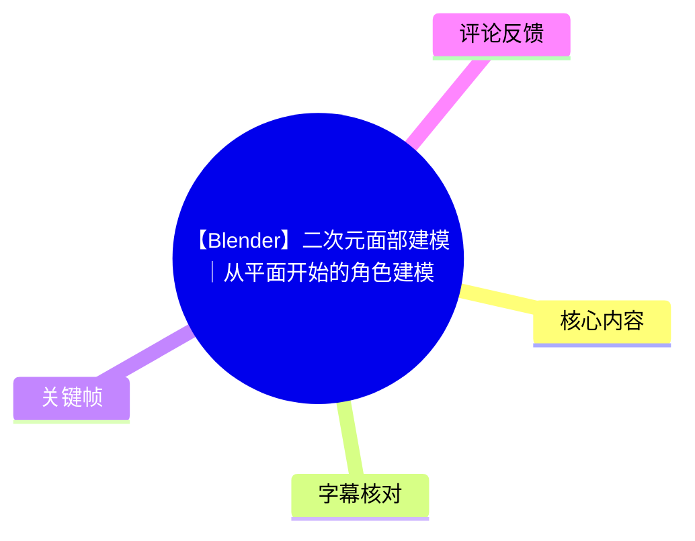
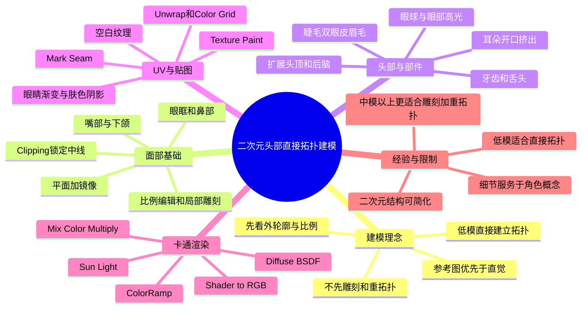
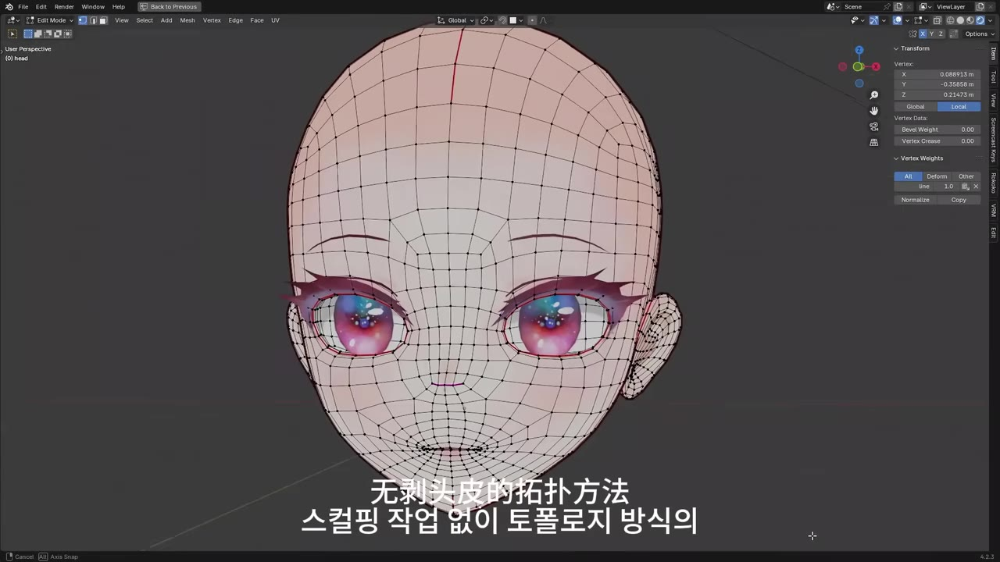
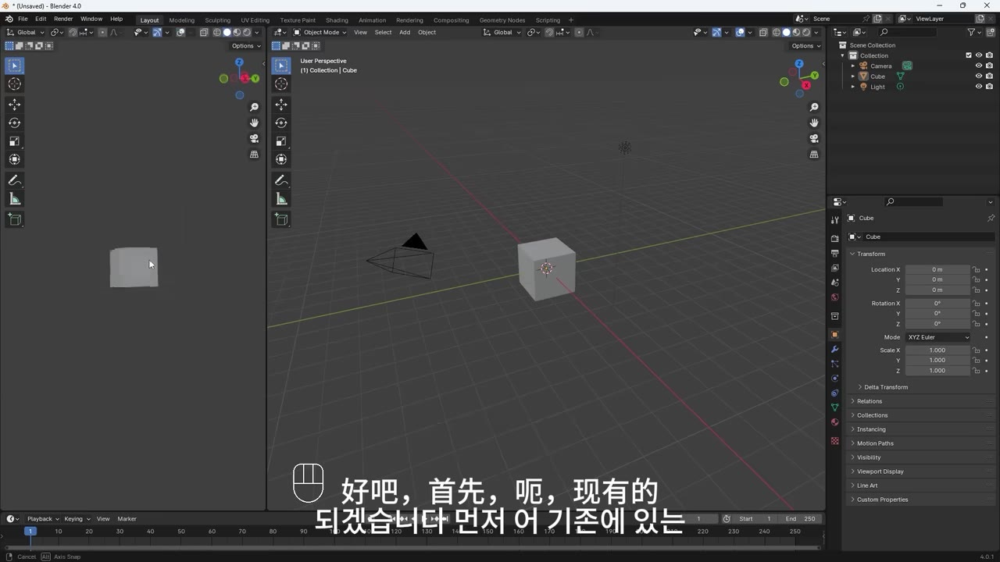
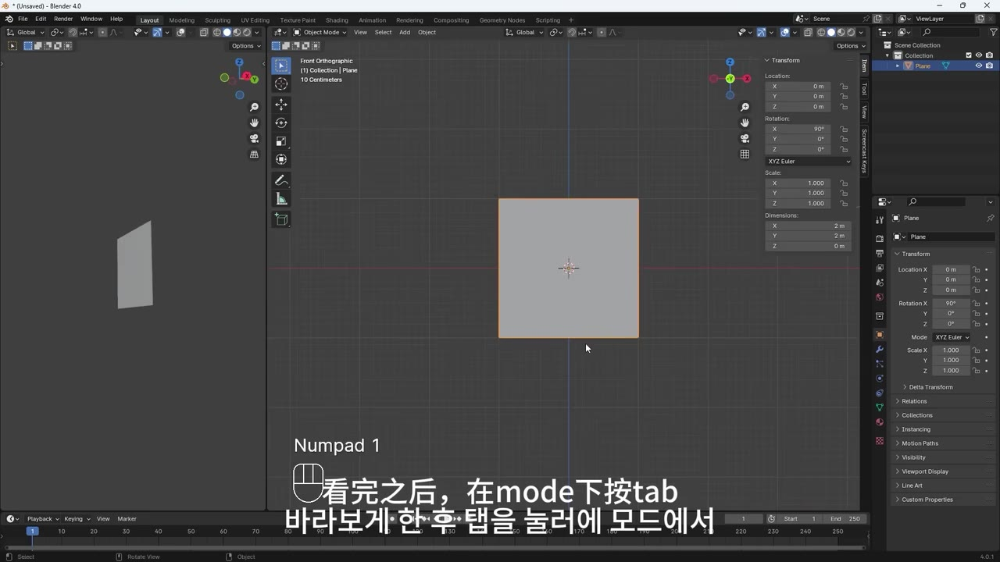
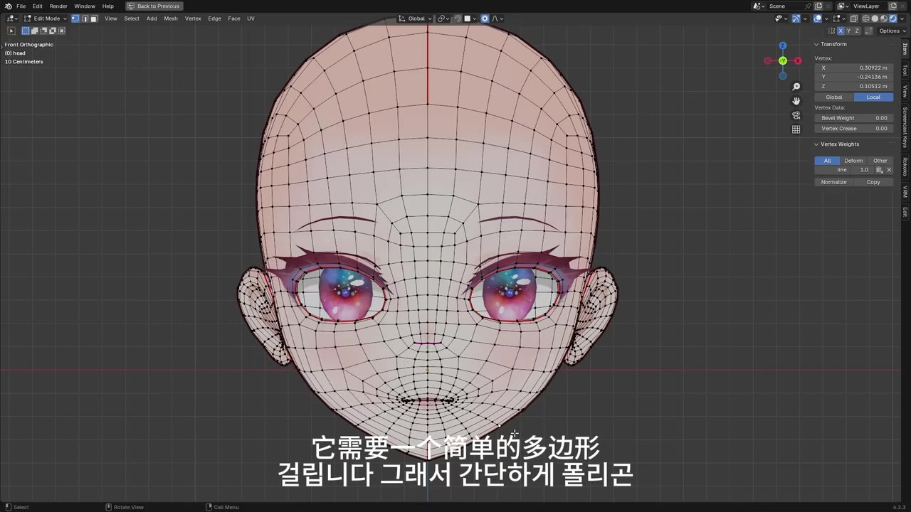

# 【Blender】二次元面部建模｜从平面开始的角色建模

> 来源：[Bilibili 视频](https://www.bilibili.com/video/BV1GAm2Y5EwB)<br>
> UP 主：布兰德自习室｜发布时间：2024-11-11｜时长：01:16:48｜分辨率：1920×1080  
> 标签：Blender、角色建模、3D 建模、二次元、经验分享、教程  
> 视频定位：以**直接拓扑式多边形建模**完成二次元角色头部，并继续制作口腔、眼部组件、UV、贴图与卡通着色。

## 小结

本视频演示了一套从 Blender 默认场景开始、以单个平面为起点的二次元角色头部建模流程。核心方法不是先高模雕刻再重拓扑，而是直接在低面数网格上通过挤出、循环切割、填面、镜像和局部雕刻，逐步搭建可用于贴图的面部拓扑。

最关键的方法论是：先保证正面与侧面的**大轮廓、面部比例和眼鼻嘴位置**，再扩展头部、制作耳朵与口腔；细节不应替代轮廓判断。作者多次强调要参照原画或参考图，避免仅凭直觉调整而得到不符合角色概念的脸型。

建模阶段的重要结构包括：面部中线镜像、眼眶内收、嘴部向内挤出形成口腔、头部前后顶点数量匹配后填面、耳部从侧脸开口挤出，以及将睫毛、双眼皮、眉毛和眼球高光拆成独立对象。对二次元角色而言，作者认为耳朵等部位不必过度写实，适度简化通常更符合风格。

后半段覆盖 UV 与贴图：先标记头部、眼内、耳周、舌头和牙齿的 UV 接缝并展开，再建立 Color Grid 检查比例与方向；之后创建空白纹理、为对象配置 Image Texture，并在 Texture Paint 中绘制肤色、眼睛渐变、耳部阴影、眼白和鼻尖细节。

渲染部分采用 Blender 节点搭建卡通阴影：以 Diffuse BSDF、Shader to RGB、ColorRamp 和 Mix Color 为核心，并用太阳光控制受光方向；通过 ColorRamp 调整阴影边界，通过其颜色调整阴影色彩。该节点链依赖 Blender 的版本、渲染引擎与节点兼容性，不能假定在所有版本或 Cycles 中表现相同。

本教程适合已经知道 Blender 基本操作、希望理解二次元头部拓扑和手工贴图流程的初学者至中级用户。视频并未给出可复用的精确人体比例、具体纹理分辨率、最终面数、完整工程文件或统一的 Blender 版本配置；其中部分按钮名称、插件名称和快捷键的转写也存在字幕识别误差，实际操作应以软件界面为准。

## 思维导图





## 目录

- [视频定位、方法选择与前置条件](#视频定位方法选择与前置条件)
- [从平面搭建面部基础](#从平面搭建面部基础)
- [面部比例、嘴部与头部闭合](#面部比例嘴部与头部闭合)
- [眼眶、口腔与眼球](#眼眶口腔与眼球)
- [耳朵、颈部、身体与口腔组件](#耳朵颈部身体与口腔组件)
- [面部细化：睫毛、双眼皮、眉毛与高光](#面部细化睫毛双眼皮眉毛与高光)
- [UV 展开与纹理绘制](#uv-展开与纹理绘制)
- [卡通着色与眼睛贴图](#卡通着色与眼睛贴图)
- [完整操作清单与参数汇总](#完整操作清单与参数汇总)
- [经验、限制与时效性](#经验限制与时效性)
- [字幕比对](#字幕比对)
- [评论分析](#评论分析)
- [处理记录](#处理记录)

## 视频定位、方法选择与前置条件 [00:00:08](https://www.bilibili.com/video/BV1GAm2Y5EwB?t=8)

作者说明，本次以**不经过常规雕刻阶段的拓扑式多边形建模**，制作二次元／亚文化角色头部。与通过数位板雕刻制作形体相比，直接多边形建模的目标是用较少的网格操作完成结构清晰、易于继续编辑与贴图的模型。

作者的比较结论如下：

- 数位板雕刻更容易追求形体准确度，也更容易依据概念图调整造型；但通常耗时更久。
- 直接拓扑建模可以较快搭出低面数角色头部，适合本视频所示的简化二次元造型。
- 两种方式都值得练习，实际制作中都会使用。
- 对于低面数模型，作者倾向本视频的直接拓扑路径。
- 对于中等面数以上、质量要求更高的模型，作者倾向先雕刻塑形，再进行 Retopology（重拓扑）。

视频仅要求使用 Blender；但要顺利复现，仍建议具备以下基础：

1. 了解对象模式、编辑模式与雕刻模式切换。
2. 了解顶点、边、面选择。
3. 熟悉 `G`、`R`、`S`、`E`、`F`、`M`、`Ctrl + R`、`Shift + D`、`P`、`K` 等常见操作。
4. 具备正交视图、侧视图、顶视图以及透视视图之间切换的能力。
5. 对参考图分析、二次元五官结构和 UV 基础概念有一定认识。



> 图：画面展示了完成度较高的角色头部线框、眼球与睫毛组件。其价值在于可直观看到本教程的最终目标并非写实头部，而是围绕大眼、简化鼻部、独立睫毛和较密面部环线组织的二次元角色拓扑。

## 从平面搭建面部基础 [00:01:01](https://www.bilibili.com/video/BV1GAm2Y5EwB?t=61)

### 1. 清空默认场景与添加平面 [00:01:01](https://www.bilibili.com/video/BV1GAm2Y5EwB?t=61)

操作起点是 Blender 默认场景：

1. 按 `A` 全选默认的相机、立方体和灯光。
2. 按 `Del` 删除。
3. 按 `Shift + A`，从 Mesh 中添加 Plane（平面）。
4. 在旋转参数中将平面绕 **X 轴旋转 90°**，使其面向正面。
5. 使用数字小键盘 `1` 进入正视图。



> 图：画面展示 Blender 的默认对象与场景结构，是教程开始前需要删除的相机、立方体和灯光。其价值在于明确本教程不是从预制头模开始，而是从空场景和一个平面建立。

### 2. 用镜像建立左右对称面部 [00:01:23](https://www.bilibili.com/video/BV1GAm2Y5EwB?t=83)

作者先只建模半张脸：

1. `Tab` 进入 Edit Mode。
2. 使用 `G` 将平面向右侧移动，给中线镜像留出位置。
3. 在 Modifier 中添加 **Mirror（镜像）**。
4. 启用 Mirror 的 **Clipping**。

Clipping 的作用是：顶点移动到镜像中心时不会穿过中线，因此能保持面部中缝闭合。作者明确将其用于防止中线顶点偏离中心。

随后：

- 选择两个顶点；
- 切换到数字小键盘 `3` 的侧视图；
- 通过 `G` 沿 Y 轴调整深度。



> 图：画面显示初始平面已转向正面，并在正交视图中操作。其价值在于说明初始网格是一张垂直放置的平面，而不是水平地面。

### 3. 切出眼眶基础 [00:02:04](https://www.bilibili.com/video/BV1GAm2Y5EwB?t=124)

作者通过 `Ctrl + R` 循环切割增加基础网格密度：

- 在横向与纵向方向各增加约 3 条边；
- 选择中央一个顶点并用 `Del` 删除；
- 旋转视角确认空缺区域，作为眼部嵌入和后续环线组织的基础。

随后可切换至 Sculpt Mode，使用 Draw Brush 对平面网格进行初步拉凸或压凹：

- 直接涂抹：向外鼓起。
- 按住 `Ctrl` 涂抹：向内压低／凹陷。

这里的雕刻并非高模雕刻流程，而是作者在直接拓扑建模过程中用于快速调整大形的一种辅助方法。

### 4. 比例编辑建立眼部和鼻部形体 [00:02:56](https://www.bilibili.com/video/BV1GAm2Y5EwB?t=176)

作者启用 Proportional Editing（比例编辑）后，移动顶点时会显示影响范围圆圈：

- 用 `G` 移动顶点；
- 用鼠标滚轮调整圆圈半径；
- 圆圈大小决定周边顶点受移动影响的范围。

使用原则：

- 小范围：适合眼角、鼻翼、嘴角等局部调整。
- 大范围：适合面颊、额头、头顶等连续大形。
- 应配合侧视图检查深度，不要只在正视图“画”出五官。

接着作者在正视图 `Ctrl + R` 加环线，拉动顶点形成鼻部；旋转视图补出鼻子体积，并使用 `F` 填补鼻部面。

> 注意：字幕中出现“Mesh F2”或“F2 插件”的说法，但转写不稳定。视频实际表达是为特定填面操作启用相关 Add-on；是否需要插件、插件的准确名称及其在不同 Blender 版本中的可用性，应以自己的 Blender 菜单为准。

## 面部比例、嘴部与头部闭合 [00:04:00](https://www.bilibili.com/video/BV1GAm2Y5EwB?t=240)

### 面部轮廓与下颌线 [00:04:00](https://www.bilibili.com/video/BV1GAm2Y5EwB?t=240)

作者以眼部末端、鼻部中线和下巴为节点扩展面部：

1. 在正视图中，拉动眼部顶点以匹配角色概念。
2. 从眼部末端顶点向下用 `E` 挤出约 3 段，形成下颌线方向。
3. 从鼻部中心顶点向下／周边挤出约 3 段边，建立鼻下与中脸结构。
4. 最后相遇的顶点用 `M` 合并至中心。
5. 选择中间四个顶点，按 `F` 填面。
6. 继续用 `Ctrl + R` 增加环线，并拉动中央顶点扩展口部区域。
7. 持续调整全脸比例。

作者将这一过程比作制作“面具”：并不是先追求局部细节，而是持续拉动顶点，使正面、侧面和斜侧面的面部轮廓共同成立。

### 用注释草图辅助判断 [00:05:16](https://www.bilibili.com/video/BV1GAm2Y5EwB?t=316)

作者指出，不依赖雕刻进行多边形建模时，容易难以判断形状。因此建议：

- 有原画时直接将其作为参考。
- 没有原画时，可通过左侧工具栏的 **Annotate（注释）** 粗略画出五官、轮廓和比例线。
- 正视图只画半边即可，配合镜像模型判断。
- 鼠标左键拖动可绘制；按住 `Ctrl` 拖动可擦除注释。

这不是正式概念设计步骤，而是一种临时的体块检查手段。作者承认示例草图很粗糙，但认为它能显著帮助确定脸型。

### 眼眶、额头与嘴部环线 [00:06:35](https://www.bilibili.com/video/BV1GAm2Y5EwB?t=395)

在粗略脸型确定后：

1. 按住 `Alt` 选择眼周边循环。
2. 用 `E` 向内挤出，形成眼眶的内侧边。
3. 旋转视图，拉动顶点调整眼形。
4. 额头区域通过下移中央两个顶点，并用 `F` 新增面来减少不必要的面、整理流向。
5. 从侧视图拉动顶点，调整为二次元角色所需的面部侧线。
6. 按住 `Alt` 选择嘴部周边边循环。
7. 使用 `E` 挤出，并用 `S` 调整大小，建立嘴部区域。
8. 用 `G` 粗略调整嘴型。

作者反复强调：正面调整结束后必须同时检查侧面。仅在正视图中看起来正确，不代表鼻子、嘴唇、下巴的前后关系正确。

### 细分表面与嘴唇塑形 [00:08:35](https://www.bilibili.com/video/BV1GAm2Y5EwB?t=515)

作者在 Modifier 中添加并应用 **Subdivision Surface（细分表面）**，随后围绕嘴部进一步加线：

- 在嘴周使用 `Ctrl + R` 增加环线。
- 可通过修改器中类似显示器的 Viewport 开关，在显示／隐藏实时细分效果之间切换，便于观察基础笼与细分效果。
- 再加一条环线作为嘴唇区域。
- 从侧视图将嘴唇顶点略向前拉出。
- 同时观察左侧或侧视图，避免只在单一角度修形。

作者的经验判断是：顶点调整本质上依赖对目标物形态的理解。角色建模的目标不是“做出一张脸”，而是做出符合概念、识别明确的角色脸。

### 头顶与后脑闭合 [00:10:39](https://www.bilibili.com/video/BV1GAm2Y5EwB?t=639)

当面部已有基本形状后，作者从面部向后延展头部：

1. 在脸部侧面选择 4 个顶点。
2. 切到数字小键盘 `7` 顶视图。
3. 沿 Y 轴以 `E` 挤出约 4 次，形成头部一侧的后延结构。
4. 从中线上方的顶点同样向上挤出约 4 次。
5. 将头部前后待连接区域的顶点数量统一为 4 个。
6. 选择四顶点使用 `F` 填面，分别补齐中央、前侧和后侧空洞。
7. 使用 `Ctrl + R` 分割环线，移动顶点校正头部曲线。
8. 对后脑同样分割并填面。
9. 增加必要环线，使头型更细化。

这里体现出一个重要拓扑策略：**先让要桥接／填补的两端顶点数量匹配，再连接面**。这比在顶点数量不一致时强行填面更容易维持四边面结构。

## 眼眶、口腔与眼球 [00:12:52](https://www.bilibili.com/video/BV1GAm2Y5EwB?t=772)

### 外轮廓优先与局部雕刻 [00:12:52](https://www.bilibili.com/video/BV1GAm2Y5EwB?t=772)

作者在头部基础完成后进入 Sculpt Mode，以 Grab Brush 调整整体形体：

- 通过左右中括号调整笔刷尺寸。
- 旋转视图后拉动网格，而非固定在一个正面角度操作。
- 优先看外轮廓，尤其是眼部、颧骨、鼻部和下颌的剪影。
- 不要过分观察内部微小细节，先确保外形正确。

作者特别警告：脸部必须参照参考图，否则容易做出“外星人脸”。这个判断是经验性建议，核心含义是二次元风格并不等于可以忽略结构；角色特征仍依赖眼眶、鼻梁、脸颊、下巴和额头之间的比例关系。

### 眼窝内收与 Grid Fill [00:15:51](https://www.bilibili.com/video/BV1GAm2Y5EwB?t=951)

眼部进一步立体化的步骤：

1. 在侧视图开启半透明／透视辅助显示。
2. 全选眼睛内侧边缘。
3. 向后沿 Y 轴挤出约两段，形成眼窝深度。
4. 再以 `E` 挤出一圈，使用 `S` 调整尺寸。
5. 将局部缩放后沿 Y 轴归零，使该区域变平。
6. 对空边界使用 **Grid Fill** 填面。
7. 在 Grid Fill 选项中调整 Span 等参数，以改善边缘方向。

> 字幕对“半透明”对应快捷键存在识别不稳定，实际应在 Blender 当前版本中通过 X-Ray、透视显示或相应视图设置确认，而不要机械照抄字幕内的键位。

### 口腔内壁与嘴唇整理 [00:17:10](https://www.bilibili.com/video/BV1GAm2Y5EwB?t=1030)

作者从嘴部边界建立口腔：

1. `Alt` 选择口腔内侧整圈边。
2. `E` 向后挤出约两段。
3. `S` 缩放并逐个调整顶点位置。
4. 控制口腔大小与后深度，避免之后牙齿和舌头互相穿插。
5. 选择第一圈挤出的边，继续整理位置。
6. 内部用 `F` 封口。
7. 旋转视图，整理唇形。
8. 对剩余空面用 `F` 快速填补。

作者还提到可使用名为 **Loft** 的工具／插件整理边缘；字幕与 ASR 都提到需要在 `Edit > Preferences > Add-ons` 中搜索并勾选启用。但“Loft”具体对应的插件、菜单路径与现行 Blender 版本是否仍可用，视频素材未提供充分界面证据，应自行验证。

### 制作眼球／虹膜组件 [00:20:19](https://www.bilibili.com/video/BV1GAm2Y5EwB?t=1219)

作者的眼球做法不是标准球体，而是适配二次元眼睛造型的扁平组件：

1. 添加 Cylinder（圆柱）。
2. 在添加圆柱的参数中，将顶点数调整为约 **18**。
3. 绕 X 轴旋转 **90°**。
4. 侧视图沿 Y 轴压缩，做成“硬币”状。
5. 删除圆柱前后两个面。
6. 选择前侧整圈边，`E` 挤出后 `S` 向内收缩。
7. `M` 合并到中心，形成带中心收束的眼球／虹膜表面。
8. 根据眼部大小调整尺寸与位置。
9. 执行 `Set Origin > Origin to Geometry`，以几何中心重设原点。
10. 用 `R` 略微旋转，使眼球看起来相对眼眶有轻微朝向。
11. 添加 Mirror 修改器，并把脸部指定为 Mirror Object，使另一侧自动生成对称眼球。
12. 再根据角色概念拉动眼球顶点，调整外形。

作者随后回到 Sculpt Mode，继续用 Grab Brush 整理整体形态，并再次强调：缺乏大量参考资料时，不应过度依赖“自己觉得像”的判断。

## 耳朵、颈部、身体与口腔组件 [00:24:14](https://www.bilibili.com/video/BV1GAm2Y5EwB?t=1454)

### 耳朵 [00:24:52](https://www.bilibili.com/video/BV1GAm2Y5EwB?t=1492)

在头部侧面多边形不足时，作者先使用 `K`（Knife）补线，让后续尽量形成四边面。

耳朵制作顺序：

1. 选择头部侧面的一个面并删除，开出耳朵位置。
2. `Alt` 选择边界循环。
3. 用 `E` 向侧面挤出。
4. 调整顶点，做出粗略耳朵轮廓。
5. 选择耳朵边缘，使用 `E` 与 `S` 向内收。
6. 选择中部四个顶点，以 `F` 填面。
7. 使用 `Ctrl + R` 并滚轮增加约 3 条分割边。
8. 其余区域以四顶点为单位用 `F` 填面。
9. 选择耳朵凹陷部位的面，向内挤出，形成耳廓内部。
10. 为自然连接突出部，选择顶点后用 `M` 合并至中心。
11. 若耳后面数不足，用 `K` 补线。
12. 拉动顶点完成外形。
13. 选择耳周边缘并以 `Shift + E` 调整边缘锐度／折痕效果，使边界更清晰。
14. 形体确认后，右键选择 **Shade Smooth** 平滑显示。

作者对二次元耳朵的建议是：不必追求过多解剖细节，适度简化的形状可能更合适。

### 颈部与简略身体 [00:32:12](https://www.bilibili.com/video/BV1GAm2Y5EwB?t=1932)

颈部制作：

- 添加 Cylinder；
- 将圆柱顶点数调整为约 **14**；
- 调整大小和位置连接头部。

作者还提示可在右上角 Outliner 中定期整理对象层级／对象列表。

身体只做粗略占位：

1. `Shift + A` 添加 Cube。
2. 添加并应用两次 Subdivision Surface。
3. 进入 Sculpt Mode，使用 Grab Brush 结合 X 轴镜像塑形。
4. 身体仅保持粗略体块，然后回到脸部继续工作。

### 牙齿与舌头 [00:34:24](https://www.bilibili.com/video/BV1GAm2Y5EwB?t=2064)

牙齿制作使用圆柱作为起点：

1. 添加 Cylinder，顶点数约 **18**。
2. 调整到嘴部附近，压扁为牙齿轮廓。
3. 删除上下两面，再删除一侧顶点。
4. 添加 Mirror。
5. 使用 `Shift + D` 复制对象，按 `Esc` 保持原位，再 `S` 缩放以确定牙齿厚度。
6. 将上侧边缘缩得比下侧更窄，留出间隙。
7. 删除牙齿后部一半顶点。
8. 将臼齿部分向内收。
9. 选择牙齿下部顶点，以 `F` 填面。
10. 对中部 Loop Cut，略微下拉顶点形成犬齿。
11. 复制牙齿制作下排牙，再缩小、旋转并按口腔结构定位。

法线检查与修复：

1. 在 Viewport Overlays 中开启 **Face Orientation**。
2. 翻转的面显示为红色。
3. 选择需要处理的面。
4. 在 `Mesh > Normals > Flip` 翻转法线。

舌头制作：

1. 添加 Cube。
2. 执行两次 Subdivide。
3. 用变形／顶点调整建立舌头大形。
4. 在 Sculpt Mode 用 Grab Brush 增加局部细节。
5. 通过半透明显示将舌头放入嘴内。
6. 必要时继续 `E` 挤出一段增加长度。

## 面部细化：睫毛、双眼皮、眉毛与高光 [00:40:54](https://www.bilibili.com/video/BV1GAm2Y5EwB?t=2454)

### 应用修改器与最终大形修正 [00:40:54](https://www.bilibili.com/video/BV1GAm2Y5EwB?t=2454)

当作者认为脸部基础完成后：

- 在 Modifier 中对 Mirror 与 Subdivision Surface 执行 Apply，合并实际网格。
- 在 Sculpt Mode 继续微调。
- 在透视视图中，作者指出默认透视存在明显变形；可以在右侧 View 选项中调整 **Focal Length（焦距）**，减轻观察时的透视扭曲。
- 使用 Draw Brush 修下颌线；直接涂抹使表面鼓起，按住 `Ctrl` 则压低表面。

这是一个重要节点：应用镜像后，模型不再保持实时对称编辑的便利。因此应确认大部分左右对称结构已经满意，再执行 Apply。视频之后仍会再次对某些对象使用镜像，说明是否应用要按对象和后续任务决定。

### 睫毛 [00:42:50](https://www.bilibili.com/video/BV1GAm2Y5EwB?t=2570)

睫毛从眼睛上方的脸部面复制而来：

1. 选择眼睛上方的面。
2. `Shift + D` 复制，按 `Esc` 原地保留。
3. 按 `P`，以 Selection 分离成独立对象。
4. 用 `Ctrl + R` 增加环线。
5. 略向前拉，形成厚度。
6. 对不足的区域增加环线。
7. 延长末端边缘。
8. 打开 Snap，将边界顶点贴合到脸部表面，再关闭 Snap。
9. 向前挤出局部面，做出睫毛前端的分叉。
10. 删除准备向上延伸的部分面。
11. 选择删除处边界，`E` 向前挤出，并用 `Ctrl + R` 补线。
12. `S` 调整大小，末端以 `M` 合并到中心，形成尖端。
13. 对其他区域重复相同方法。

作者认为睫毛是决定二次元角色性格和辨识度的重要元素，值得花时间控制：

- 分叉数量；
- 长度；
- 厚度；
- 尖端方向；
- 与上眼睑、眼球的相对位置。

### 双眼皮与眉毛 [00:48:55](https://www.bilibili.com/video/BV1GAm2Y5EwB?t=2935)

双眼皮制作：

1. 从睫毛对象选择一个面。
2. 复制并分离。
3. 开启 Snap。
4. 移动顶点，贴合脸部并确定位置。
5. 通过 `E` 挤出面。
6. 关闭 Snap。
7. 调整成自然的双眼皮线。

眉毛制作：

1. 复制双眼皮对象。
2. 向后并向上移动。
3. 定位后拉动顶点，整理眉形。

视频中的对象复用思路是：睫毛、双眼皮和眉毛均可从已有眼部局部复制并重塑。这能维持造型一致性，也减少重新起网格的成本。

### 眼睛高光 [00:51:49](https://www.bilibili.com/video/BV1GAm2Y5EwB?t=3109)

作者完成头模后发现眼球缺少“眼神光／高光”，因此追加独立高光对象：

1. `Shift + A` 添加 Plane。
2. 绕 X 轴旋转 **90°** 并放到眼睛前方。
3. 添加并应用 Subdivision Surface。
4. 缩放、压扁，塑造高光轮廓。
5. 高光可以根据角色概念做成圆形、星形、椭圆等。
6. 将大高光放到虹膜上部。
7. `Shift + D` 复制，制作下方更小高光。
8. 用 `Ctrl + J` 合并一只眼睛的两个高光。
9. 复制高光组并移动到另一只眼睛。
10. 如果视觉上仍显平淡，可额外复制高光增加层次。



> 图：画面展示正交正视图下的完整面部拓扑，能观察到头顶、眼眶、鼻部、嘴部、耳朵及独立睫毛对象的关系。其价值在于用于检查左右对称、眼间距、面部环线走向和嘴部网格密度。

## UV 展开与纹理绘制 [00:53:44](https://www.bilibili.com/video/BV1GAm2Y5EwB?t=3224)

### 应用镜像并标记接缝 [00:53:44](https://www.bilibili.com/video/BV1GAm2Y5EwB?t=3224)

在 UV 之前，作者先将仍通过镜像生成的对象逐个 Apply。原因是 UV 展开需要面对实际的完整网格，而非仅依赖实时镜像预览。

接缝标记步骤：

1. 进入 Edit Mode。
2. 从下巴区域开始选择边。
3. 在 UV 菜单中执行 **Mark Seam**。
4. 头部后方也选择至前侧相应位置，标记接缝。
5. 选择眼睛内侧边缘，Mark Seam。
6. 选择双耳周边边缘，Mark Seam。
7. 处理舌头与牙齿的接缝。
8. 如果标记错误，使用 **Clear Seam** 清除。

选择技巧：

- `Alt + 左键`：选择整条边循环。
- `Ctrl + 左键`：按路径扩展边选择。  
  > 不同 Blender 键位映射、鼠标设置或字幕转写可能导致实际操作有所差异，应以自身界面提示为准。

作者特别指出，睫毛和眉毛这类四周开放的对象不一定需要单独做复杂接缝处理。

### Unwrap 与 UV 检查图 [00:57:06](https://www.bilibili.com/video/BV1GAm2Y5EwB?t=3426)

展开流程：

1. 在左侧分屏切换 UV Editor。
2. 选择对象。
3. 在 UV 菜单执行 **Unwrap**。
4. 检查展开结果，以验证接缝位置是否合理。
5. 新建 UV 检查图：
   - 在新建图像窗口中设置所需尺寸；
   - 命名为 UV；
   - 将 Generate Type 设置为 **Color Grid**；
   - 确认。
6. 在 Image 菜单中保存 UV 图像。
7. 逐一选择 UV 岛，调整大小、位置与朝向。
8. 对眼睛的 UV 岛分配更大面积，因为作者认为眼睛在角色中占比高。

作者明确表示 UV 展开没有唯一固定规则，但应考虑：

- 各部位的重要性；
- 纹理分辨率预算；
- UV 岛之间的大小比例；
- 图案的朝向；
- Color Grid 中数字／颜色是否出现不合理拉伸或翻转。

### 配置 UV 检查材质 [00:58:44](https://www.bilibili.com/video/BV1GAm2Y5EwB?t=3524)

为查看 UV 检查图，作者：

1. 到 Material 标签页。
2. 点击 New 新建材质。
3. 为材质命名。
4. 点击 Base Color 旁边的输入点。
5. 选择 **Image Texture**。
6. 点击 Open，加载保存的 UV 检查图。
7. 将材质应用到各对象。
8. 逐个 Unwrap 并整理 UV 岛。

### 创建空白贴图与材质 [01:01:29](https://www.bilibili.com/video/BV1GAm2Y5EwB?t=3689)

正式贴图准备：

1. 新建图像。
2. 设置所需尺寸。
3. 命名。
4. 将 Generate Type 设置为 **Blank**。
5. 使用 `Image > Save As` 保存到目标文件夹。
6. 在 Material 标签新建材质。
7. 在 Base Color 中加入 Image Texture。
8. Open 载入保存的脸部／贴图图像。
9. 如仍保留 UV 检查材质，删除或替换它。
10. 将正式 Face Material 分配给各对象。
11. 临时隐藏头部，为牙齿等被遮挡物体配置材质。
12. 当所有对象都显示黑色空白纹理时，作者认为已完成映射绘制准备。

### Texture Paint 绘制 [01:03:18](https://www.bilibili.com/video/BV1GAm2Y5EwB?t=3798)

绘制内容包括：

- 肤色底色；
- 眼部颜色；
- 虹膜由下向上的暗色渐变；
- 头部后侧着色；
- 耳部阴影；
- 眼白；
- 鼻尖小点。

作者提及：

- 可以将常用颜色保存到右侧颜色调色板中。
- 面部绘制不一定要大量复杂技巧，可按个人审美和“化妆”式思维上色。
- 在绘制过程中发现嘴张得太开时，仍可回到 Edit Mode 修改模型，说明贴图前后都应持续检查形体。

需要注意：视频未说明纹理图的具体像素尺寸、笔刷强度、混色方式、颜色数值、绘制设备或导出格式。因此这些参数不能从素材中补全。

## 卡通着色与眼睛贴图 [01:08:47](https://www.bilibili.com/video/BV1GAm2Y5EwB?t=4127)

### 卡通阴影节点 [01:08:47](https://www.bilibili.com/video/BV1GAm2Y5EwB?t=4127)

作者进入 Shading 工作区，为头部搭建卡通阴影逻辑。按视频所述顺序：

1. 删除 Principled BSDF。
2. 搜索并添加 **Mix Color**。
3. 将原有颜色接入 Mix Color 的 A 输入。
4. 将 Mix Color 输出连接到 Material Output。
5. 将 Mix 模式改为 **Multiply（正片叠底）**。
6. `Shift + A` 搜索并添加 **Diffuse BSDF**。
7. 添加 **Shader to RGB**。
8. 添加 **ColorRamp**。
9. 按视频中的节点关系连接。
10. 将 ColorRamp 的颜色输出接入 Mix Color 的 B 输入。

可概括为：

```text
Diffuse BSDF
  → Shader to RGB
  → ColorRamp
  → Mix Color（B，Multiply）
  → Material Output

原有贴图/基础颜色
  → Mix Color（A）
```

作者随后：

1. 在 Object Mode 使用 `Shift + A`。
2. 从 Light 中添加 **Sun Light（太阳光）**。
3. 用 `R` 调整灯光角度。
4. 在 ColorRamp 中移动色标，控制阴影分界位置。
5. 修改 ColorRamp 的颜色，改变阴影颜色。

> 兼容性限制：`Shader to RGB` 通常与 Eevee 工作流关联更强；不同 Blender 版本、Eevee 版本或 Cycles 渲染器中的可用性、效果与节点接口可能不同。视频没有说明最终渲染引擎与全部节点参数，因此应把该部分视为视频版本下的节点思路，而非跨版本保证可直接复现的固定配方。

### 绘制眼睛贴图 [01:12:37](https://www.bilibili.com/video/BV1GAm2Y5EwB?t=4357)

最后作者继续为眼球绘制贴图。其明确建议是：

- 按个人想要的视觉效果绘制；
- 参考图像；
- 一边看参考一边逐步画；
- 不要期待单一固定眼睛公式适配所有角色。

视频在约 01:12:49 至 01:15:40 之间主要是持续绘制过程，ASR 诊断将其识别为较长无语音间隙。该段可通过画面观察到继续进行眼睛纹理绘制，但没有新增可由语音确认的具体参数、笔刷设定或节点结构。

## 完整操作清单与参数汇总 [00:01:01](https://www.bilibili.com/video/BV1GAm2Y5EwB?t=61)

### 建模流程清单

1. 删除默认场景。
2. 添加平面，X 轴旋转 90°。
3. 添加 Mirror，启用 Clipping。
4. `Ctrl + R` 建立眼部与脸部基础网格。
5. 删除局部顶点，开出眼部结构。
6. 使用比例编辑和 Draw／Grab Brush 塑形。
7. 通过 `E`、`F`、`M`、`Ctrl + R` 建立鼻部、下巴、嘴部。
8. 使用参考图或 Annotate 辅助确认比例。
9. 添加 Subdivision Surface，并在需要时开关实时显示。
10. 从侧脸顶点向后、向上挤出，闭合头顶与后脑。
11. 形成眼窝、口腔内壁、嘴唇结构。
12. 使用圆柱制作眼球／虹膜。
13. 切线、开口、挤出制作耳朵。
14. 添加颈部与简略身体。
15. 添加牙齿、下牙、犬齿、舌头。
16. 检查 Face Orientation 并翻转错误法线。
17. Apply 对称与细分等修改器。
18. 复制上眼睑面，分离制作睫毛。
19. 复制睫毛面制作双眼皮；再复制双眼皮制作眉毛。
20. 用平面与细分制作眼球高光。
21. 标记接缝、Unwrap、整理 UV。
22. 创建 UV 检查图和空白纹理。
23. 配置 Image Texture 材质。
24. Texture Paint 绘制角色颜色。
25. 使用 Diffuse BSDF、Shader to RGB、ColorRamp、Mix Color 和 Sun Light 构建卡通着色。

### 视频中明确出现的参数

| 项目 | 参数／操作 | 时间 |
| --- | --- | --- |
| 初始平面方向 | X 轴旋转 90° | [01:11](https://www.bilibili.com/video/BV1GAm2Y5EwB?t=71) |
| 面部镜像 | Mirror + Clipping | [01:23](https://www.bilibili.com/video/BV1GAm2Y5EwB?t=83) |
| 基础切线 | 横、纵方向各约增加 3 条边 | [02:04](https://www.bilibili.com/video/BV1GAm2Y5EwB?t=124) |
| 下颌线 | 向下挤出约 3 段 | [04:00](https://www.bilibili.com/video/BV1GAm2Y5EwB?t=240) |
| 鼻部下方结构 | 从中心挤出约 3 段 | [04:00](https://www.bilibili.com/video/BV1GAm2Y5EwB?t=240) |
| 头部延展 | 侧面与中线均约挤出 4 段 | [10:39](https://www.bilibili.com/video/BV1GAm2Y5EwB?t=639) |
| 头部连接 | 前后连接处各匹配为 4 个顶点 | [11:20](https://www.bilibili.com/video/BV1GAm2Y5EwB?t=680) |
| 眼球圆柱 | 顶点数约 18 | [20:19](https://www.bilibili.com/video/BV1GAm2Y5EwB?t=1219) |
| 眼球方向 | X 轴旋转 90°，Y 轴压扁 | [20:19](https://www.bilibili.com/video/BV1GAm2Y5EwB?t=1219) |
| 颈部圆柱 | 顶点数约 14 | [32:12](https://www.bilibili.com/video/BV1GAm2Y5EwB?t=1932) |
| 身体细分 | Subdivision Surface 应用两次 | [33:34](https://www.bilibili.com/video/BV1GAm2Y5EwB?t=2014) |
| 牙齿圆柱 | 顶点数约 18 | [34:24](https://www.bilibili.com/video/BV1GAm2Y5EwB?t=2064) |
| 舌头 | Cube 后 Subdivide 两次 | [39:15](https://www.bilibili.com/video/BV1GAm2Y5EwB?t=2355) |
| 卡通阴影混色 | Mix Color 模式设为 Multiply | [01:09:06](https://www.bilibili.com/video/BV1GAm2Y5EwB?t=4146) |
| UV 检查图 | Generate Type 设为 Color Grid | [57:37](https://www.bilibili.com/video/BV1GAm2Y5EwB?t=3457) |
| 正式纹理 | Generate Type 设为 Blank | [01:01:29](https://www.bilibili.com/video/BV1GAm2Y5EwB?t=3689) |

### 常用快捷键与用途

| 快捷键／命令 | 视频中的用途 |
| --- | --- |
| `A` | 全选默认对象或全部元素 |
| `Del` | 删除对象、顶点或面 |
| `Shift + A` | 添加平面、圆柱、立方体、太阳光等 |
| `Tab` | 切换编辑模式 |
| `G` | 移动对象或顶点 |
| `R` | 旋转对象／灯光 |
| `S` | 缩放 |
| `E` | 挤出边或面 |
| `F` | 填面 |
| `M` | 合并顶点 |
| `Ctrl + R` | 循环切割 |
| `K` | Knife 切割工具 |
| `Shift + D` | 复制对象或选区 |
| `P` | 分离选区 |
| `Ctrl + J` | 合并对象 |
| `Alt` 选择 | 选择边循环 |
| `Shift + E` | 调整边缘折痕／锐度效果 |
| `Ctrl` + Draw Brush | 向内压凹而非向外鼓起 |
| `[` / `]` | 调整雕刻笔刷尺寸 |
| `Numpad 1` | 正视图 |
| `Numpad 3` | 侧视图 |
| `Numpad 7` | 顶视图 |

## 经验、限制与时效性 [01:15:40](https://www.bilibili.com/video/BV1GAm2Y5EwB?t=4540)

### 可迁移的经验

1. **先结构，后细节**  
   鼻子、眼睛、嘴巴即使局部漂亮，只要侧面深度、下颌长度、头顶体积不对，角色整体仍会失衡。应在不同视图中反复确认。

2. **参考图是建模工具的一部分**  
   作者不将参考图视作可有可无的灵感来源，而是用于校正面部结构的必要依据。尤其对于二次元头部，风格化并不意味着不需要比例逻辑。

3. **先统一拓扑数量，再填补连接**  
   头部闭合时，先将前后区域顶点数统一为 4 个，再填面，有助于保持四边面为主的拓扑。

4. **二次元造型应有选择地简化**  
   耳朵、鼻部等区域若做得过度写实，可能与整体大眼、简洁轮廓的角色设计不一致。简化是风格决策，不是忽略结构。

5. **独立部件提高修改自由度**  
   睫毛、双眼皮、眉毛、眼球高光、牙齿和舌头独立成对象，便于单独调整造型、材质、层次与位置。

6. **UV 分配应服务于视觉重点**  
   作者特意让眼部 UV 岛占更大空间，反映了二次元角色中眼睛通常拥有更高的纹理细节优先级。

### 视频的限制

- 未提供最终多边形数量、纹理尺寸、工程文件、笔刷参数、色值、光照强度或最终渲染设置。
- 视频主要展示操作过程，部分步骤的精确鼠标轨迹与菜单选择需结合画面自行复现。
- 字幕中存在 Blender 术语、插件名和快捷键转写问题，例如“Loft”“Mesh F2”“半透明快捷键”等不能视为完全可靠的逐字指令。
- 本教程强调低模直接拓扑，但没有讨论绑定、表情 Shape Key、面部动画、法线烘焙、材质导出或游戏引擎适配。
- 眼睛、睫毛和高光的风格高度依赖角色概念，视频只提供一种示例路径，不构成通用比例标准。
- 卡通节点所使用的 `Shader to RGB`、ColorRamp 和灯光流程可能因 Blender 版本与渲染引擎不同而变化。

### 时效性

视频发布于 **2024-11-11**，画面中可见 Blender 4.x 界面。Blender 的 Modifier 分类、插件管理入口、节点名称、Eevee 的实现和 Texture Paint 细节都可能在后续版本发生调整。

因此：

- `Mirror`、`Subdivision Surface`、`Unwrap`、`Mark Seam`、`Image Texture` 等核心概念具有较强稳定性；
- 插件入口、节点兼容性、特定快捷键与界面布局具有版本时效性；
- 如遇视频菜单路径与当前版本不一致，应按功能名搜索，而不是严格按画面位置操作。

## 字幕比对

| 字幕来源 | 完整性 | 专有名词 | 时间轴 | 主要问题 |
| --- | --- | --- | --- | --- |
| Bilibili 站内字幕 | 覆盖从 00:00:08 至 01:16:36，整体完整 | 多处中文机器翻译不自然，术语误译较多 | 有真实 SRT 起止时间 | 如将 Plane 误译为“10 个单位的圆柱体”、将 Texture/UV 误作“音频”、将部分操作键与工具名转写错误 |
| 本次 ASR 字幕 | 230 段，语音覆盖约 1822.97 秒，占视频约 39.57%；覆盖主要讲解段 | 韩语原语义较清晰，Blender 英文术语较多但仍有识别错字 | 有真实分段时间；首句 00:00:08.240，末句 01:16:36.420 | 长时间演示段无语音；部分词识别不稳，如 Graph/Grab Brush、Alt-G、F2、Loft、特定轴向与工具名称 |

### 最终字幕选择

本次采用**ASR 的韩语原语义与精确时间轴为主**，以站内中文字幕辅助核对章节覆盖范围；对于明显的识别或翻译问题，结合两份字幕的交叉信息与提供的关键帧进行中文术语校正。

本次 ASR 诊断结果中：

- 未标记 `noAudioStream=true`；
- 音频时长约为 4607.40 秒；
- 语言识别为韩语，置信度约 0.999；
- 因此源视频存在音轨，本次 ASR 并非工具失败或无音轨替代方案。

### 重要校正说明

| 原始转写表现 | 采用的整理表述 | 校正依据 |
| --- | --- | --- |
| “Polylogy / 터폴로지” | Topology／拓扑式多边形建模 | ASR 韩语语义、视频主题与上下文 |
| “Graph Brush” | Grab Brush | 与 Blender Sculpt Mode 常见笔刷及动作描述“抓住网格塑形”相符；仍保留为可能存在转写误差 |
| “룩컷” | Loop Cut／循环切割 | 与 `Ctrl + R` 明确对应 |
| “音频地图／音频上解包” | UV Map／UV Unwrap | 站内中文字幕误译，ASR 中对应 UV Editor、Unwrap、Color Grid |
| “Mesh F2” | 视频提及需启用的相关 Add-on | 两份字幕均无法稳定确认准确插件名，不将其扩展为确定事实 |
| “Color Lamp” | ColorRamp | ASR 音译与 Blender 节点工作流对应 |
| “Sunlight” | Sun Light／太阳光 | ASR 明确提到从 Light 添加 Sunlight |
| “Alt-G 半透明” | 半透明／X-Ray 类辅助显示 | 字幕快捷键不稳定，保留功能含义，不确认唯一键位 |

## 评论分析

以下仅分析可获取的热评前三条，不将评论内容视为已验证的技术事实。

### 1. 柑柚桔子：头顶不够圆，可用头发遮挡

> “交作业，头顶不是很圆，但是到时候做头发应该可以遮住[OK]”  
> 获赞：56

评论者展示了跟做结果，并指出头顶轮廓不够圆。该反馈与视频中反复强调从多视图检查头部外轮廓相呼应：头顶与后脑的体积是直接拓扑建模的常见难点。

“用头发遮住”是角色制作中的实际补救思路，但它不是对基础头型问题的根治。若后续需要短发、露额头发型、表情动画或多角度渲染，头型问题仍可能暴露。更稳妥的做法是优先回到头部顶点和环线阶段修正大体积，再考虑发型遮挡。

### 2. 时笙竹耶：完成练习作业

> “交作业！！[胜利]”  
> 获赞：37

该评论没有给出具体技术问题，但反映出该教程具有较强的跟做属性，观众会将完成头模作为“作业”提交。它只能说明评论者自述完成了练习，不能据此推断教程对所有初学者都足够容易或步骤完全无歧义。

### 3. 白雪雇主：询问 03:48 的合并面效果

> “03:48的合并面怎么搞？F出来不是他那样的效果”  
> 获赞：46

该评论指出约 [03:48](https://www.bilibili.com/video/BV1GAm2Y5EwB?t=228) 的填面步骤难以复现。对应视频内容为鼻部附近的面生成／封口，作者提到与某个 Add-on 或特定填面工具相关。

该疑问具有参考价值，因为普通 `F` 填面效果会受以下因素影响：

- 当前选择的是顶点、边还是面；
- 选区是否构成单一闭合边界；
- 顶点数量与边界方向；
- 是否存在重叠顶点、非流形边或镜像中线未焊接；
- 是否启用了视频中提及的附加插件／工具；
- Blender 版本差异。

评论本身没有获得视频作者的可验证回复，因此不能确认评论者遇到问题的具体原因。复现时应先检查选区和网格拓扑，再核实视频所说 Add-on 的准确名称与启用状态。

## 处理记录

- Worker ID：worker-msaehvue-e0b94e0c
- 模型：gpt-5.6-terra
- 调用工具与素材：
  - 视频元数据与页面信息；
  - Bilibili 站内时间轴字幕 `p01-ai-zh.srt`；
  - 本次 ASR：`large-v3-turbo`，CUDA，`int8_float16`；
  - ASR 时间轴结果：`asr/transcript.srt`、`asr/asr-result.json`；
  - 关键帧目录：`frames/`；
  - 热评数据：`comments/comments.json`。
- 字幕选择：
  - 已检查站内字幕和本次 ASR；
  - 以 ASR 的韩语原始语义及其真实时间戳为主；
  - 用站内字幕补充比对；
  - 对显著机器翻译错误、术语错译和快捷键歧义进行了标注，不将无法确认的内容伪装为确定事实。
- ASR 音轨判断：
  - `asr-result.json` 未标记 `noAudioStream=true`；
  - 源视频存在音轨；
  - ASR 识别语言为韩语，语言置信度约 0.999；
  - ASR 语音覆盖率约 39.57%，低覆盖部分主要对应长时间无旁白操作演示。
- 关键帧选择依据：
  - 选用 `frames/frame-001.jpg` 展示完成模型与面部拓扑；
  - 选用 `frames/frame-002.jpg` 展示正视图完整头部线框结构；
  - 选用 `frames/frame-003.jpg` 展示默认 Blender 场景；
  - 选用 `frames/frame-004.jpg` 展示初始平面转正面的建模起点；
  - 图片均用于解释正文所述建模阶段与拓扑观察价值，不据此补造未出现的操作参数。
- 评论处理：
  - 仅处理素材中可获取的热评前三条；
  - 未将观众作业陈述或技术猜测当作视频事实。
- 缓存清理：
  - 未提供可执行的缓存清理日志或结果，无法确认是否已清理；本记录不虚构清理状态。
- 未解决问题：
  - 视频所述“Loft”与“Mesh F2”相关 Add-on 的准确名称无法仅凭字幕完全确认；
  - 部分半透明显示快捷键在 ASR 与站内字幕中转写不一致；
  - 视频未提供最终模型面数、纹理分辨率、完整节点参数、渲染引擎配置及工程文件。
