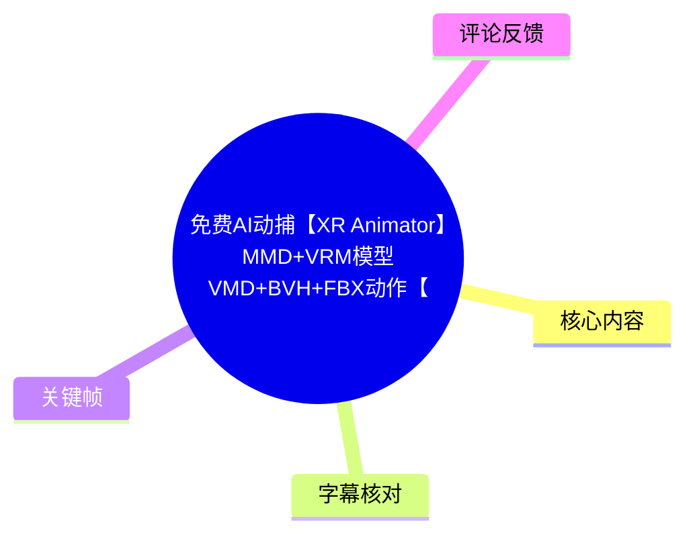
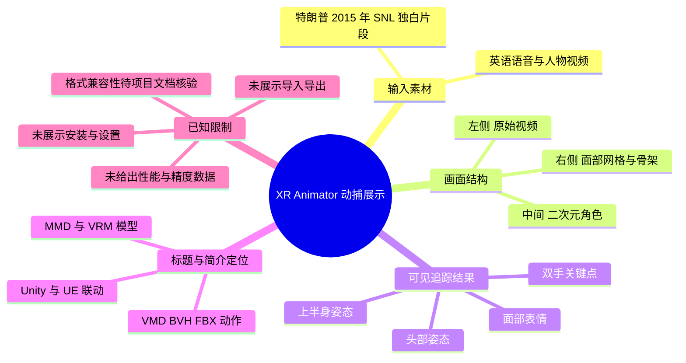
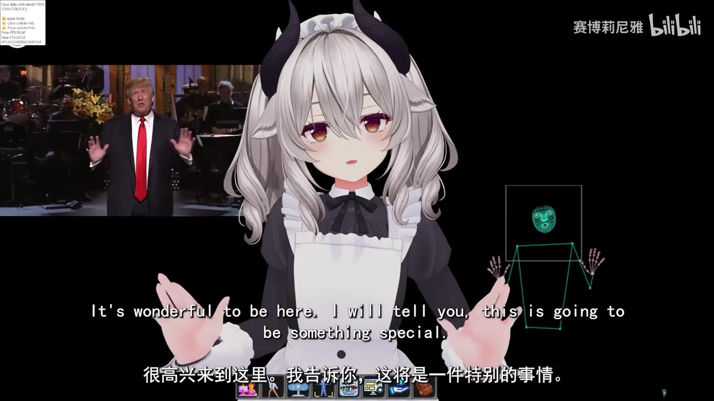
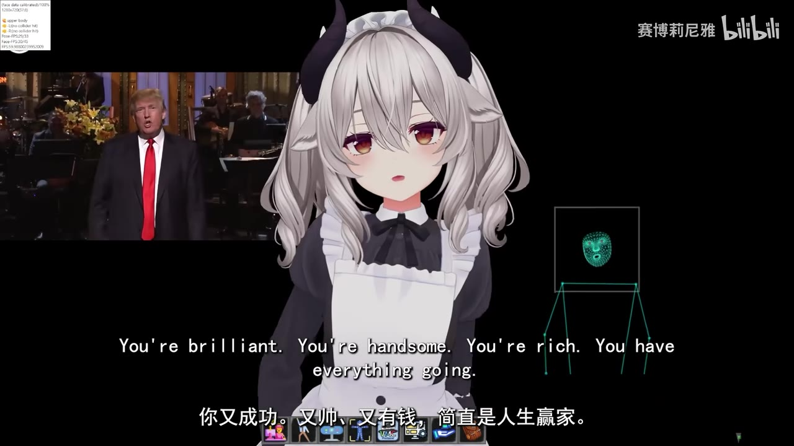
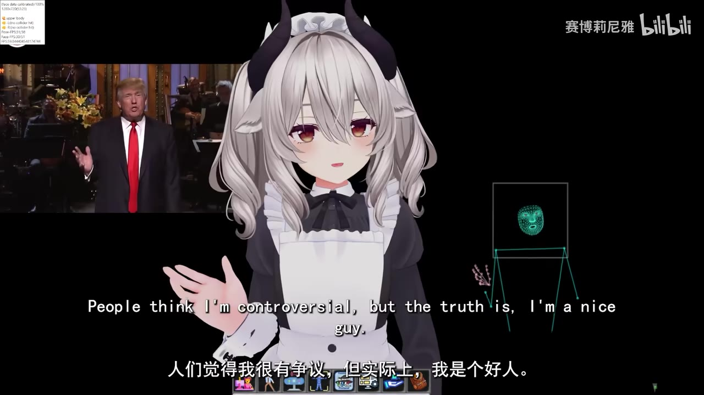
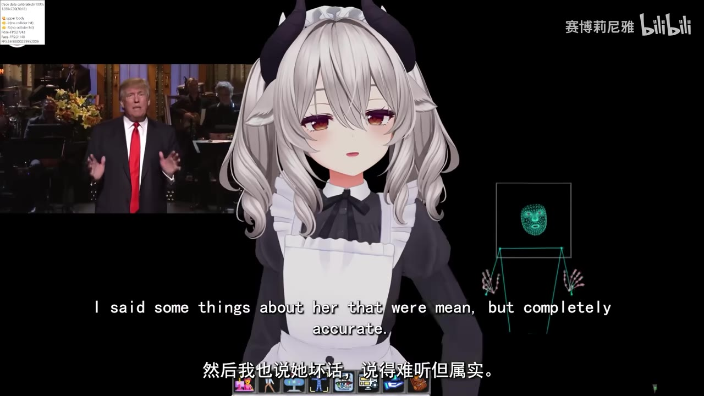

# 免费AI动捕【XR Animator】MMD+VRM模型VMD+BVH+FBX动作【实时全身+表情动捕】联动Unity+UE【特朗普2015年脱口秀】

> 来源：[Bilibili 视频](https://www.bilibili.com/video/BV1SKaHz6EYi) 
> UP 主：赛博莉尼雅｜发布时间：2025-09-01｜视频时长：03:37｜分辨率：1920×1080  
> 项目链接：<https://github.com/ButzYung/SystemAnimatorOnline>  
> 网盘分流：<https://pan.quark.cn/s/cf5483d83f8f?pwd=Bh4j>（提取码：`Bh4j`）

## 小结

本视频是一次 **XR Animator / SystemAnimatorOnline 动捕效果展示**，而非从安装到导出的完整操作教程。画面以一段特朗普在 2015 年《Saturday Night Live》（SNL）独白为输入：左侧播放原始人物视频，中间为二次元角色模型，右侧实时显示面部网格、躯干骨架与双手关键点。模型的头部、表情、手势和上半身姿态会随左侧人物画面变化。

视频最有价值的信息在于其可视化地证明了：同一界面中能够同时观察到**视频源、角色驱动结果、脸部追踪和人体/手部骨架追踪**。画面左上角还显示 `Tace data calibrated: 100%`、`1280x720@20:13`、`Face FPS` 等调试信息，表明演示处于已校准的追踪状态；但仅凭该短片无法得出具体硬件要求、实际延迟、精度指标或稳定帧率。

标题与简介宣称该工具涉及 MMD、VRM、VMD、BVH、FBX，以及 Unity、UE 联动；然而这段 217 秒的视频本体没有展示模型导入、动作录制、VMD/BVH/FBX 导出、Unity/UE 配置或参数面板。因此，这些格式与引擎兼容性在本文中仅作为**标题/简介提供的项目定位**记录，不能视为视频内已逐步验证的工作流程。

适合希望快速判断“视频驱动角色全身与表情动捕”呈现效果的 MMD、VRM、虚拟形象、桌宠或实时角色开发者阅读。若目标是立即复现生产流程，应优先查看 UP 主给出的 GitHub 仓库文档，并自行核对项目当前版本、依赖、许可和导出能力。

信息具有时效性：视频发布于 2025-09-01，项目仓库与网盘内容可能已经更新、迁移、失效或改变；本文不以视频外的后续资料补写未展示的技术细节。

## 思维导图

## 目录

- [视频定位与素材边界](#视频定位与素材边界)
- [动捕画面与可见技术信息](#动捕画面与可见技术信息)
  - [开场：视频、角色与追踪面板同屏](#开场视频角色与追踪面板同屏-0014)
  - [表情、手势与上半身的同步表现](#表情手势与上半身的同步表现-0027)
  - [动作变化与角色驱动的观察要点](#动作变化与角色驱动的观察要点-0059)
  - [结尾段落：持续追踪与音视频素材](#结尾段落持续追踪与音视频素材-0312)
- [标题功能、实际演示与复现边界](#标题功能实际演示与复现边界)
- [时间轴内容整理](#时间轴内容整理)
- [关键帧索引](#关键帧索引)
- [结论与限制](#结论与限制)
- [字幕比对](#字幕比对)
- [评论分析](#评论分析)
- [处理记录](#处理记录)

## 视频定位与素材边界 [00:00](https://www.bilibili.com/video/BV1SKaHz6EYi?t=0)

视频开头至约 00:14 没有可用语音字幕内容；自 00:14 起，原视频播放英语独白。站内中文字幕与本次英语 ASR 都表明，音轨主要来自被播放的 SNL 素材，而非 UP 主口播讲解。

因此，这支视频应理解为“使用 XR Animator 驱动角色的效果录屏”：

- **左侧窗口**：特朗普的舞台独白画面，是本次动捕演示的视觉输入。
- **中间主体**：一名白发、黑角、女仆装风格的二次元角色，承担被驱动对象。
- **右侧追踪可视化**：上方为青绿色脸部特征点/网格，下方为简化的人体躯干线框和双手关键点。
- **画面底部**：可见一排工具图标，其中包括标有 `VMC` 的图标；这只能证明该录屏界面出现了相关标识，不能仅据此确定其具体协议配置、传输状态或版本。
- **左上角调试文字**：可辨认出校准、分辨率和 FPS 等字段，但画面没有完整解释各字段含义。

标题写有“免费 AI 动捕”“实时全身+表情动捕”“联动 Unity+UE”等信息，简介提供了 `SystemAnimatorOnline` 的 GitHub 地址与网盘分流。这些是发布者给出的工具指向；视频中并未展示下载、安装或在游戏引擎中接收数据的过程。

## 动捕画面与可见技术信息

### 开场：视频、角色与追踪面板同屏 [00:14](https://www.bilibili.com/video/BV1SKaHz6EYi?t=14)

从 [00:14](https://www.bilibili.com/video/BV1SKaHz6EYi?t=14) 起，原片中的英语独白“It's wonderful to be here…”开始出现。此时演示界面已经形成稳定的三栏信息关系：输入视频在左、角色结果在中、追踪数据在右。

> 图：该帧同时显示左侧特朗普视频、中间角色与右侧脸部网格、躯干和手部关键点，是确认本视频并非单纯播放角色动画、而是展示追踪可视化链路的关键画面。左上角还可见已校准提示及与追踪相关的调试读数。

画面中可直接观察到的技术层次包括：

1. **脸部追踪层**：右侧方框内的青绿色人脸点阵/网格用于呈现脸部检测结果。
2. **人体姿态层**：脸部下方有由线段构成的躯干结构，左右两侧延伸出手臂和腿部轮廓。
3. **手部追踪层**：手的位置以密集关节点表示，区别于仅有手腕位置的简化骨架。
4. **角色驱动层**：中间角色的张口、眼睑状态、头部方向和手臂姿态会随输入片段发生变化。

不过，录屏只展示结果，不提供模型骨骼映射、面捕 BlendShape 名称、关节约束、滤波方式或校准动作。因此不能据此推断任何特定算法、模型架构或参数。

### 表情、手势与上半身的同步表现 [00:27](https://www.bilibili.com/video/BV1SKaHz6EYi?t=27)

[00:27](https://www.bilibili.com/video/BV1SKaHz6EYi?t=27) 左右，输入字幕为对特朗普外貌、财富等夸张赞美。角色保持面向镜头的上半身构图，嘴形与面部状态持续变化；右侧的脸部网格与骨架没有消失，说明演示在持续显示追踪输出。

> 图：该帧中角色嘴部打开，右侧双手关键点与躯干轮廓清晰可见；它有助于观察“角色表情结果”与“追踪数据可视化”被同时呈现，但不能单帧证明口型与音素之间存在精确的一一对应。

从演示方式可提炼的观察经验：

- 判断动捕是否可信，不能只看最终角色；应同时看源视频、骨架/关键点和角色结果是否在同一时刻保持合理关联。
- 手部追踪点虽然可见，但这段素材没有连续展示手指快速遮挡、交叉、离镜或多人场景，无法评价复杂条件下的鲁棒性。
- 中间角色基本保持正面近景，示例不适合验证下肢落脚、全身位移、转身、跳跃或大幅度运动质量。标题虽称“全身”，但视频内被清楚展示和易于比较的部分主要是脸部、上半身和双手。

### 动作变化与角色驱动的观察要点 [00:59](https://www.bilibili.com/video/BV1SKaHz6EYi?t=59)

在 [00:59](https://www.bilibili.com/video/BV1SKaHz6EYi?t=59) 至约 01:25 的段落中，输入人物谈及 Rosie O'Donnell，并以“Come on out, Rosie”引出现场演员。人物持续说话和做手势，角色相应呈现嘴部动作、头部朝向与抬起的手臂姿态。

> 图：该帧保留了输入人物的手势、角色的抬手姿态，以及右侧手部关键点和身体线框，适合用于理解本视频的验证思路：将源动作、角色动作和骨架状态并列对照。

实际使用这类工具时，可依据视频画面采用以下**检查顺序**；这是对演示方法的整理，不是视频中逐条讲授的操作步骤：

1. 准备具有清晰人物脸部和肢体的输入视频或摄像头画面。
2. 在软件中观察脸部、身体与双手关键点是否被稳定识别。
3. 查看角色是否已经被正确加载，并确认其面部与骨骼能够响应追踪结果。
4. 用原始人物的说话、抬手等显著动作，和角色的嘴形、头部、手臂变化进行对照。
5. 对于要用于动画资产的结果，额外在项目文档中确认录制、保存、导出格式和坐标轴/骨架兼容规则；本视频没有展示这一步。

### 结尾段落：持续追踪与音视频素材 [03:12](https://www.bilibili.com/video/BV1SKaHz6EYi?t=192)

[03:12](https://www.bilibili.com/video/BV1SKaHz6EYi?t=192) 后，原片进入 Larry David 现身、解释因喊话可获得 5,000 美元的笑点，随后特朗普以“作为商人，我完全理解”回应，并预告 Sia 将登场。角色仍显示在同一追踪界面内。

> 图：该帧证明演示在素材后段仍保持同样的“输入视频—角色—追踪数据”布局，适合说明该录屏贯穿了完整独白片段；但它没有展示长时间运行后的丢帧、漂移、重校准或故障恢复。

该段也说明，视频中的语言内容并不构成 XR Animator 的功能讲解。英语台词只是一段用于生成面部、口型和姿态变化的示例素材；文中不应把台词含义误写为软件操作指令。

## 标题功能、实际演示与复现边界 [00:00](https://www.bilibili.com/video/BV1SKaHz6EYi?t=0)

| 信息项 | 来源 | 视频内证据强度 | 可严谨得出的结论 |
| --- | --- | --- | --- |
| XR Animator / SystemAnimatorOnline | 标题、简介、画面 | 高 | 发布者将演示工具指向该项目，并提供 GitHub 链接。 |
| 视频驱动的角色表演 | 关键帧与整段画面 | 高 | 画面并列呈现源视频、角色和追踪骨架。 |
| 面部、躯干、双手追踪可视化 | 关键帧 | 高 | 右侧可见脸部点阵、身体线框和双手关节点。 |
| 实时性 | 视频标题 | 中 | 标题使用“实时”描述，但未给出端到端延迟、设备或测量方法。 |
| 全身动捕 | 视频标题与右侧骨架 | 中 | 可见完整人体线框；实际角色画面主要是上半身，未充分展示下肢动画质量。 |
| MMD、VRM 模型支持 | 视频标题 | 待项目文档核验 | 标题明确提及，但没有展示导入页面或具体模型文件。 |
| VMD、BVH、FBX 动作 | 视频标题 | 待项目文档核验 | 未展示录制、导出文件、格式选项或导入验证。 |
| Unity、UE 联动 | 视频标题 | 待项目文档核验 | 未展示引擎窗口、插件、网络协议或接收端效果。 |
| 免费 | 视频标题 | 待项目许可核验 | “免费”并不等同于任意用途均免费，仍应查看仓库许可证与依赖条件。 |

### 复现前应补齐的事项

视频没有给出可直接照做的安装步骤或参数，因此不能虚构命令、软件版本和导出选项。依据简介，合理的复现入口是 GitHub 仓库与网盘分流；在实际操作前至少需要自行确认：

- 当前仓库是否仍可访问，发布版本、系统要求及许可证是否变化；
- 是否需要摄像头、视频文件、GPU、浏览器权限或额外运行环境；
- VRM/MMD 模型的骨骼、面部表情形态键及坐标系是否满足工具要求；
- 标题中提到的 VMD、BVH、FBX 是否为导入、导出或中间格式，及其具体版本限制；
- 若需要 Unity/UE 联动，连接方式是插件、VMC、网络端口还是文件导入；
- 录制动作是否包含根运动、手指、表情与帧率信息，导出后是否需要在目标软件中重定向骨骼。

## 时间轴内容整理 [00:14](https://www.bilibili.com/video/BV1SKaHz6EYi?t=14)

以下时间点依据站内 SRT 的真实分段，并与本次 ASR 的时间段交叉核对。它们记录的是**演示所使用的英语节目片段**，不是 UP 主对软件的教学讲解。

| 时间轴 | 片段内容 | 与动捕演示的关系 |
| --- | --- | --- |
| [00:14](https://www.bilibili.com/video/BV1SKaHz6EYi?t=14) | 特朗普开场称“能在这里真是太棒了”，并称这会是特别时刻。 | 演示开始阶段，角色、源视频、骨架和面部网格已同屏。 |
| [00:27](https://www.bilibili.com/video/BV1SKaHz6EYi?t=27) | 台词以夸张方式称赞“唐纳德”聪明、英俊、富有，并问为何主持 SNL。 | 可观察连续说话时的角色口型与脸部状态。 |
| [00:41](https://www.bilibili.com/video/BV1SKaHz6EYi?t=41) | 回答是“没什么更好的事可做”，继而称自己是好人、不记仇。 | 源人物持续讲话，适合作为基础面部驱动样本。 |
| [00:59](https://www.bilibili.com/video/BV1SKaHz6EYi?t=59) | 谈及 Rosie O'Donnell，并说自己讲过刻薄但“完全准确”的话。 | 人物有更多手势，画面可用于对照角色上半身和手部结果。 |
| [01:10](https://www.bilibili.com/video/BV1SKaHz6EYi?t=70) | 他称排练时 Rosie 前来支持；演员 Aidy Bryant 纠正其称呼。 | 对话场景下仍保持追踪界面，未切换至设置或导出页面。 |
| [01:38](https://www.bilibili.com/video/BV1SKaHz6EYi?t=98) | 称自己懂得自嘲，节目多年来一直嘲笑自己。 | 可比较角色在不同面部状态下的表现。 |
| [01:58](https://www.bilibili.com/video/BV1SKaHz6EYi?t=118) | 另一位演员称节目“刚好了两百亿个百分点”。 | 持续展示角色驱动，不提供量化精度数据。 |
| [02:06](https://www.bilibili.com/video/BV1SKaHz6EYi?t=126) | 台词称有他在场，这是 SNL 历史上最好的独白。 | 演示结构不变。 |
| [02:28](https://www.bilibili.com/video/BV1SKaHz6EYi?t=148) | 节目插入“你以为自己很了不起……你被解雇了”的片段。 | 可看到输入内容发生镜头/内容变化时，角色端仍维持输出。 |
| [02:52](https://www.bilibili.com/video/BV1SKaHz6EYi?t=172) | 有人喊“你这个种族主义者”，特朗普表示预料到会发生。 | 声音和人物内容切换，不是工具报错或教学提示。 |
| [03:12](https://www.bilibili.com/video/BV1SKaHz6EYi?t=192) | Larry David 解释喊话可得 5,000 美元；随后预告 Sia 登场并结束。 | 演示到片段结束，未展示动作保存或导出结果。 |

## 关键帧索引 [00:14](https://www.bilibili.com/video/BV1SKaHz6EYi?t=14)

| 关键帧 | 对应内容 | 选择价值 |
| --- | --- | --- |
|  | 开场说话与角色抬手 | 最完整地交代源视频、角色、脸部网格、人体线框、手部关键点及界面调试信息。 |
|  | 连续说话阶段 | 便于观察角色口部状态与双手关键点同时出现。 |
|  | 源人物手势更明显的段落 | 可用于比较输入姿态、角色动作与右侧骨架可视化。 |
|  | 后段持续运行状态 | 证明演示结构贯穿后段，但不代表已验证长时稳定性。 |

其余提供的关键帧路径虽然可用，但本片画面布局高度一致。为避免在没有额外信息增益时重复插图，正文优先选取以上四帧，分别覆盖开场、连续讲话、手势对照和结尾持续运行四种观察目的。

## 结论与限制 [03:32](https://www.bilibili.com/video/BV1SKaHz6EYi?t=212)

这是一段对 XR Animator 动捕结果具有直观参考价值的展示：视频画面中确实同时可见输入人物、被驱动二次元角色、脸部网格、身体骨架与手部关键点。对于评估“是否能将人物视频中的脸部和上半身动作转到角色上”，它提供了直接的视觉样本。

但它不能替代技术教程或兼容性验证。视频没有演示以下关键环节：

- 软件取得、安装、启动与权限配置；
- 摄像头或本地视频的接入步骤；
- 角色模型导入，以及骨骼和表情映射；
- 校准方法、可调参数、滤波与追踪丢失处理；
- VMD、BVH、FBX 的录制或导入导出；
- MMD、VRM 的具体版本和模型限制；
- Unity、UE 的实际联动画面、插件、协议与配置；
- 运行硬件、GPU 占用、实际帧率、端到端延迟及精度对比；
- 多人、遮挡、快速运动、侧脸、下肢大位移等复杂场景的稳定性。

因此，最可迁移的经验是：评估动捕工具时，应当把“源视频—检测骨架—角色结果”放在同一时间线上对照，而不是仅凭角色端视觉效果判断。若要用于桌宠、直播、MMD 制作或游戏引擎，应在项目当前文档和自己的目标模型上完成格式、授权与稳定性验证。

## 字幕比对 [00:14](https://www.bilibili.com/video/BV1SKaHz6EYi?t=14)

| 字幕来源 | 完整性 | 专有名词 | 时间轴 | 主要问题 |
| --- | --- | --- | --- | --- |
| Bilibili 站内字幕 | 覆盖约 00:13–03:32，覆盖完整独白主体 | 中文译名中出现“罗西先生”等不自然表达；`Aidy Bryant` 被译为“艾·布莱恩特” | 分段细，起止时间可直接使用 | 个别翻译不够自然；音乐、语气词和人名语境有简化。 |
| 本次 ASR（large-v3-turbo） | 26 段，识别语音约 150.97 秒，占全片 69.69%；首句 00:14.29、末句 03:32.12 | 英语人名识别较好：Rosie O'Donnell、Aidy Bryant、Larry David、Sia 均可辨；`Who the hell is I?` 明显误识 | 有精确分段时间戳，与站内字幕整体吻合，通常相差不足约 1 秒 | 以较长英文句段输出；在 02:58 处将“Who the hell is that?”误识为“Who the hell is I?”；个别断句不自然。 |

### 采用策略与校正说明

- 本次 ASR 已被实际检查；其诊断未标记 `noAudioStream=true`，且语言判断为英语（置信度 `0.9536`），说明源视频**存在音轨**，并非无音轨素材。
- 正文的中文内容梳理以**站内中文字幕的细分时间轴**为主，以 ASR 英文原文核对语义、人名和时间覆盖。
- [02:58](https://www.bilibili.com/video/BV1SKaHz6EYi?t=178) 附近，ASR 的 `Who the hell is I?` 不符合语义；站内字幕为“我就知道会这样”，之后紧接“那个人是特朗普的种族主义者”。结合 ASR 后一句 `Who is that?` 与现场语境，本文不采用该错误识别文本，而概述为特朗普对喊话者的反应。
- `Aidy Bryant`、`Larry David`、`Sia` 等英语姓名以 ASR 原文为准，并保留中文说明；这并不意味着站内译名完全错误，而是避免将音近译名误当作人物正式拼写。
- 关键帧显示底部有中英文双语字幕，且与两份字幕的整体语义相符；关键帧用于验证演示布局与字幕确实属于输入节目片段，不用于臆测软件参数。

## 评论分析 [00:00](https://www.bilibili.com/video/BV1SKaHz6EYi?t=0)

仅处理当前可获取的热评前三条；评论反映的是用户体验或设想，不构成工具能力的已验证事实。

1. **爱喵喵的栗子（57 赞）**  
   评论设想：如果工具可自动记录动作并让桌宠自行调用，桌宠是否会变得更拟人。  
   分析：这提出了“动捕动作库 + 桌宠行为系统”的潜在应用方向。视频确实展示了角色跟随人物视频的效果，但未展示动作自动记录、标签化、检索调用、行为决策或桌宠运行逻辑。因此这是合理的产品设想，不能据此确认 XR Animator 已具备该工作流。

2. **白鸟绫乃（23 赞）**  
   评论观点：“谢谢分享 好用”。  
   分析：该评论提供了正向主观使用反馈，说明评论者可能曾成功使用相关工具；但没有说明使用平台、模型格式、硬件、版本、具体功能或问题，证据不足以外推为普遍稳定、易用或兼容全部格式。

3. **ヨイツの賢狼（6 赞）**  
   评论观点：“视频动捕这个识别很可以了”。  
   分析：这与视频中可见的人脸、人体和手部关键点效果相符，属于对演示观感的评价。由于片段主要是正面舞台人物、镜头稳定且角色也以近景为主，仍不能由此推及遮挡、侧身、快动作、多人和下肢复杂动作的识别表现。

## 评论分析

- 热评 1：up，我在想，如果能用这个工具，自动记录一些动作，然后桌宠自行调用，那是不是可以让桌宠越来越拟人？
- 热评 2：谢谢分享 好用[笑哭]
- 热评 3：视频动捕这个识别很可以了

以上内容是观众反馈摘录，只用于补充理解视频反响，不作为正文事实依据。

## 处理记录

- **Worker ID**：`worker-msaeho0y-365b05fe`
- **模型**：`gpt-5.6-terra`
- **ASR 模型**：`large-v3-turbo`，CUDA 推理，`int8_float16`；自动识别语言为英语，置信度 `0.95361328125`。
- **使用素材与工具产物**：视频元数据、站内字幕 `p01-ai-zh.srt`、本次 ASR 结果 `asr/asr-result.json`、ASR SRT `asr/transcript.srt`、热评数据 `comments/comments.json`、关键帧目录 `frames/`。
- **字幕选择**：站内中文 SRT 作为中文时间轴与正文中文转述的主要依据；本次英语 ASR 用于核对原文、人名、分段覆盖和明显误识。两者均已检查。
- **关键帧依据**：选用 `frame-001` 至 `frame-004`，因为它们稳定呈现“源视频—角色—面部/人体/手部追踪面板”的完整链路，并分别覆盖开场、持续说话、明显手势和片尾状态；未将画面中无法确认的调试字段扩展为具体技术参数。
- **评论范围**：仅分析可获取热评前三条，未扩展至普通评论或回复。
- **缓存清理**：提供的素材清单未包含缓存清理执行日志；本次整理未获得可验证的清理结果，故不宣称已删除音频、视频、帧图或 ASR 文件。
- **未解决问题**：GitHub 仓库当前可用性、许可证、安装依赖、准确支持的模型/动作格式、导出方法、Unity/UE 联动方式、性能参数及复杂场景稳定性，均未在本视频素材中展示，需以项目当前文档和实际测试为准。
