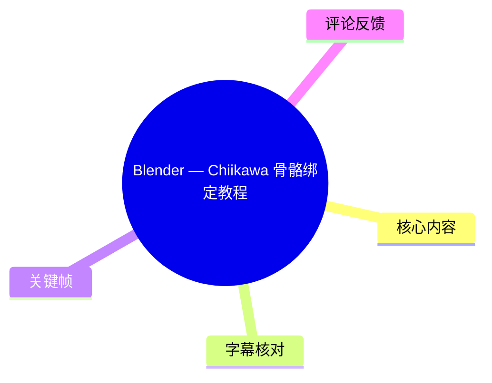
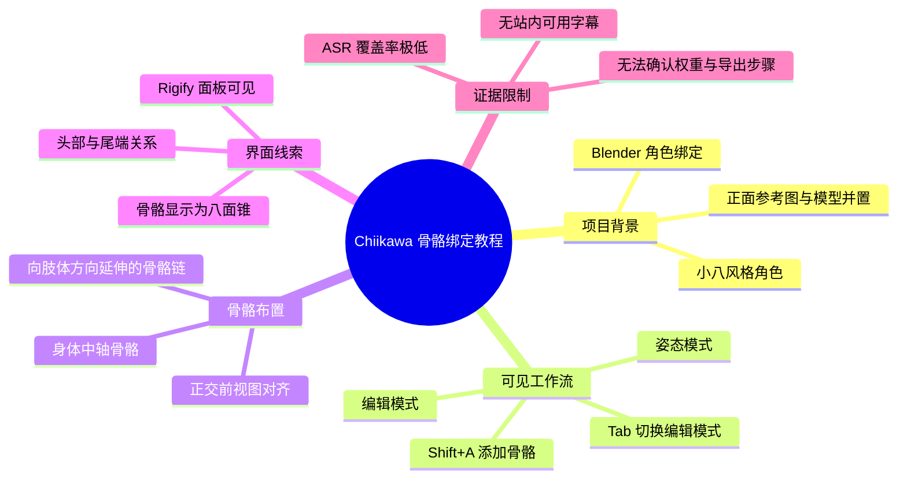
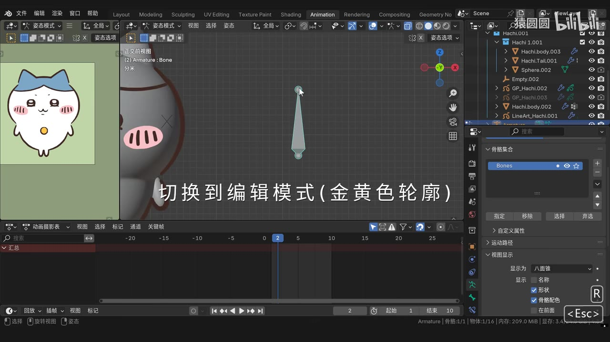
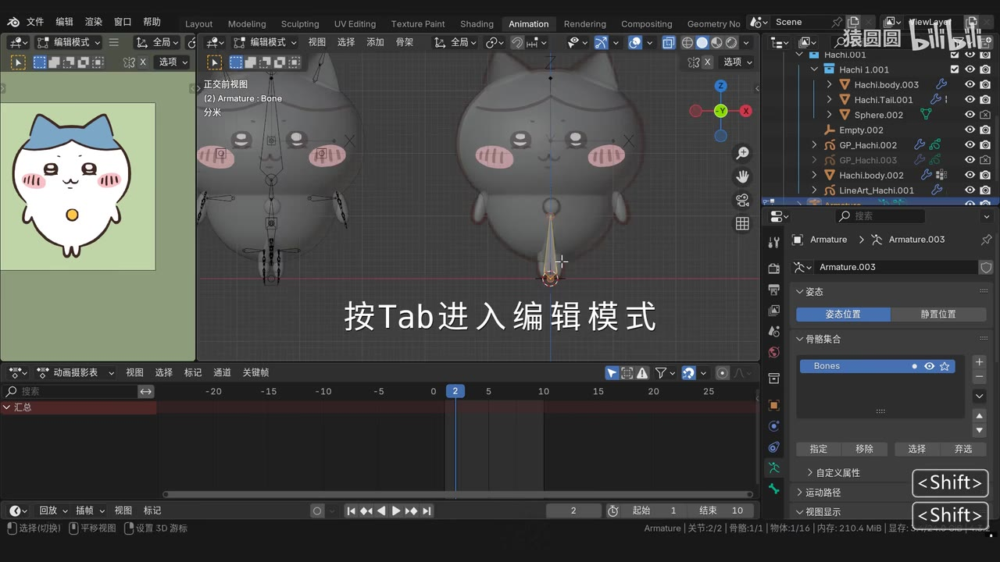
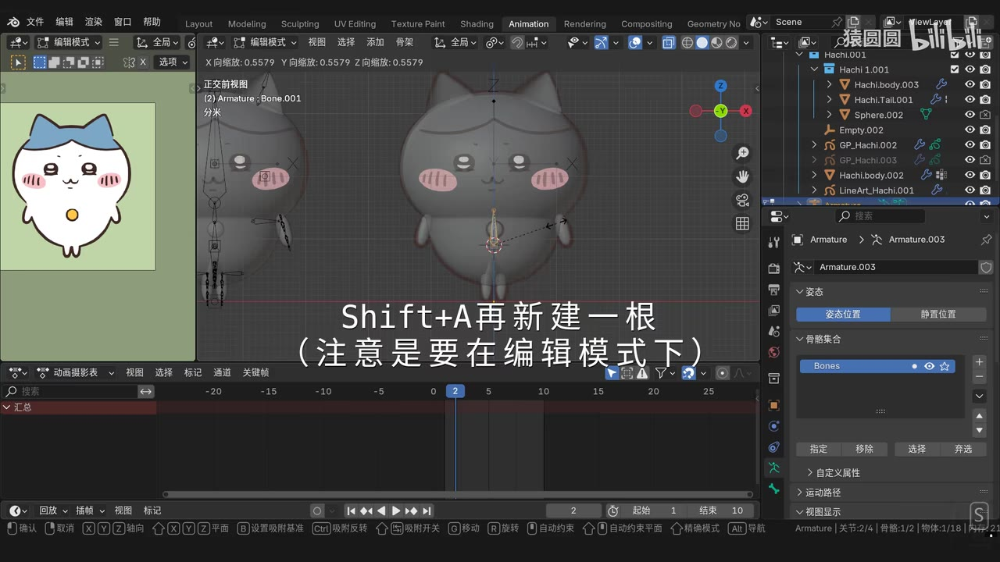
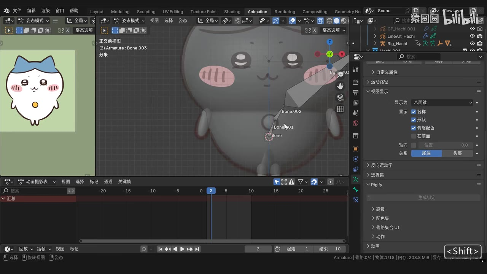

# Blender — Chiikawa 骨骼绑定教程

> 来源：[Bilibili 视频](https://www.bilibili.com/video/BV1aaKgeWEK7) 
> UP 主：猿圆圆｜发布时间：2025-02-15｜视频时长：11 分 49 秒（709 秒） 
> 视频简介：UP 主表示近期喜欢“小八”，并以该角色制作绑定教程，邀请观众“交作业”。

## 小结

- 这是一个以 Blender 为工具、围绕 Chiikawa／小八风格角色开展骨骼绑定的实操视频。可见画面显示，教程已经准备好角色模型、正面参考图和骨架对象，并在正交前视图中直接调整骨骼。
- 画面明确呈现的核心工作流是：在**姿态模式**与**编辑模式**之间切换；进入编辑模式后使用 `Shift + A` 添加新骨骼；再将骨骼沿角色身体与肢体方向放置、调整，以逐步建立可用于控制角色的骨骼链。
- 教程特别值得注意的操作前提是：画面字幕明确提醒“**Shift+A 再新建一根（注意是要在编辑模式下）**”。这说明添加骨骼的上下文模式是决定操作结果的重要条件；若处于姿态模式，不能将该操作等同于编辑骨架结构。
- 画面中还可见 Blender 的骨骼关系设置区域、“尾端／头部”关系选项、视图显示中的“八面锥”显示方式，以及 Rigify 面板。但现有证据只能确认这些界面元素被展示，**不能据此断言视频完成了 Rigify 自动生成控制器、权重绘制、父级绑定或动画导出**。
- 本次 ASR 几乎没有识别出教程讲解内容：709 秒视频仅得到约 0.74 秒、两条日语短句，语音覆盖率为 0.1%。站内也未提供可用字幕。因此本文以关键帧中可见的中文屏幕字幕、快捷键和 Blender 界面为主要依据，并对无法确认的步骤明确保留边界。
- 该视频发布于 2025-02-15；Blender 的模式名称、快捷键和骨骼编辑逻辑通常具有延续性，但具体界面布局、Rigify 面板位置及插件状态会随 Blender 版本与用户工作区配置而变化。本文不将画面未显示的软件版本、插件安装状态或参数值视为确定事实。

## 思维导图

## 目录

- [背景、素材与证据边界](#背景素材与证据边界)
- [可见的 Blender 场景与准备状态](#可见的-blender-场景与准备状态)
- [模式切换：从姿态模式进入编辑模式](#模式切换从姿态模式进入编辑模式)
- [在编辑模式中新增与布置骨骼](#在编辑模式中新增与布置骨骼)
- [骨骼关系、显示与 Rigify 界面线索](#骨骼关系显示与-rigify-界面线索)
- [可复现的操作清单与限制](#可复现的操作清单与限制)
- [时效性与结论](#时效性与结论)
- [字幕比对](#字幕比对)
- [评论分析](#评论分析)
- [处理记录](#处理记录)

## 背景、素材与证据边界 [00:00:00](https://www.bilibili.com/video/BV1aaKgeWEK7?t=0)

视频标题为“Blender — Chiikawa 骨骼绑定教程”，标签包含“小八、教程、3D、chiikawa、经验分享、动画教程、绑定、骨骼绑定、blender、乌萨奇”。其目标是将已完成的卡通角色模型置入可编辑的骨骼系统中，为后续姿势或动画控制建立基础。

画面采用 Blender 的动画工作区：左侧放置角色正面参考图，中部是角色模型与骨架的前视图，底部为时间线，右侧包含大纲视图与属性面板。参考图、模型和骨架同时显示，有助于按二维轮廓校准骨骼位置。

### 已确认的素材事实

| 项目 | 已确认内容 |
| --- | --- |
| 视频时长 | 709 秒；ASR 实测音频时长约 708.565 秒 |
| 画面规格 | 1920 × 1080 |
| 软件 | Blender；可见 Animation 工作区标签 |
| 角色对象 | 画面大纲视图中可见以 `Hachi` 命名的一组对象，例如 `Hachi.001`、`Hachi.body.003`、`Hachi.Tail.001` |
| 骨架对象 | 可见 `Armature`／`Armature.003` 等对象或数据名称，以及 `Bone`、`Bone.001`、`Bone.002`、`Bone.003` 等骨骼名称 |
| 参考依据 | 关键帧画面中的中文操作字幕、快捷键提示和 Blender UI |
| 未能确认内容 | Blender 版本、模型来源、骨骼命名规范、权重分配、约束、IK、控制器生成及最终动画效果 |

> **时间轴说明：**本次唯一可直接使用的 ASR 时间段是 00:00:00.180–00:00:01.120，但内容仅为两句极短日语识别结果，无法与后续可视化教程步骤建立可靠对应。下文各章节统一链接至视频起点，避免根据文字顺序虚构具体步骤发生时间。

## 可见的 Blender 场景与准备状态 [00:00:00](https://www.bilibili.com/video/BV1aaKgeWEK7?t=0)

关键帧显示的场景具备开始骨骼编辑所需的基本条件：

1. **正面参考图已载入。**左侧可见带蓝色蝴蝶结、粉色腮红的角色参考图；中部模型与该图并列，便于检查模型比例和肢体位置。
2. **角色模型已存在。**中间视口中的角色是立体模型，轮廓包括头部、身体、双侧手臂和底部肢体。
3. **骨架已存在且可编辑。**界面左上状态文字中可见 `Armature : Bone`，表示当前选择关联到骨架中的单根骨骼。
4. **视图使用正交前视图。**画面左上显示“正交前视图”。对于以正面卡通形象为主的骨骼定位，这能降低透视带来的视觉偏差；但视频未展示侧视图或深度方向的检查过程。
5. **骨骼显示为八面锥。**右侧“视图显示”区域的“显示为”下拉项可见为“八面锥”。该显示方式让骨骼头尾与朝向更容易辨认。

> 图：该帧同时显示参考图、角色模型、骨骼对象、时间线及大纲视图；中央的单根骨骼与角色面部区域同屏，是理解“按参考图定位骨骼”这一准备状态的直接证据。画面字幕还提示切换到编辑模式时会出现黄色轮廓。

### 操作环境中的对象管理线索

右上角大纲视图中可见多个角色相关对象与骨架相关对象。虽然不能从单帧准确还原全部层级关系，但这提示角色不是单一网格，而是可能由身体、尾部、线条或辅助对象组成。实际复现时应先确认：

- 当前选择的是 **Armature（骨架）**，而非角色网格；
- 进入的模式是要修改骨骼结构的**编辑模式**，还是用于摆姿势的**姿态模式**；
- 参考图、模型与骨架的相对位置在前视图中可对齐；
- 若模型由多个对象构成，不应仅凭骨骼存在就假设它们已经全部绑定至该骨架。

## 模式切换：从姿态模式进入编辑模式 [00:00:00](https://www.bilibili.com/video/BV1aaKgeWEK7?t=0)

画面先处于“姿态模式”，后明确展示通过 `Tab` 进入“编辑模式”。两种模式的任务不同，视频画面将它们区分得很清楚：

| 模式 | 画面中可确认的用途 | 不应混同的操作 |
| --- | --- | --- |
| 姿态模式 | 可选择骨骼并查看姿态状态；画面字幕提示切换编辑模式时，骨骼轮廓会呈黄色 | 不宜将其作为新增骨骼的前提模式 |
| 编辑模式 | 画面字幕明确写有“按 Tab 进入编辑模式”；该模式下随后执行 `Shift + A` 新建骨骼 | 不应把编辑骨架拓扑与摆姿势视为同一操作 |

> 图：该帧中央字幕明确给出“按Tab进入编辑模式”，顶部模式下拉框也显示“编辑模式”。模型前方可见沿身体中轴布置的多个骨骼，证明后续操作针对的是骨架结构而不是单纯调整网格形状。

### 为什么模式是关键限制

本视频可直接确认的快捷键组合是 `Tab` 与 `Shift + A`，但二者有严格上下文：

- `Tab`：画面字幕用它进入编辑模式。
- `Shift + A`：画面字幕强调需在编辑模式下“再新建一根”。

因此，正确的理解不是“任何状态下按 `Shift + A` 都会添加骨骼”，而是：**先选中骨架并进入编辑模式，再执行添加骨骼操作。**若当前激活对象或模式不同，快捷键可能触发其他菜单或不产生预期结果。

## 在编辑模式中新增与布置骨骼 [00:00:00](https://www.bilibili.com/video/BV1aaKgeWEK7?t=0)

本段是关键帧中证据最明确的操作环节。画面字幕直接写明：

> `Shift+A 再新建一根（注意是要在编辑模式下）`

可据此整理出以下已证实的基础步骤：

1. 选中角色所用的骨架对象。
2. 通过 `Tab` 进入编辑模式。
3. 在编辑模式下按 `Shift + A`，新增一根骨骼。
4. 参考正面角色图与模型轮廓，移动、旋转或缩放骨骼，使其落在计划控制的身体区域附近。
5. 继续用已有骨骼与新增骨骼形成局部骨骼链。

> 图：该帧保留了“Shift+A再新建一根（注意是要在编辑模式下）”的完整屏幕提示。视口中显示角色正面、中心骨骼与两侧肢体骨骼，是新增骨骼后需依据角色轮廓安排位置的可视化依据。

### 骨骼布置的可见结构

从正面画面可观察到：

- 身体中心存在从下至上排列的骨骼；
- 角色两侧手臂附近存在相应的骨骼结构；
- 右侧局部视图中，一条由多个节点组成的骨骼链从身体下部向角色右侧肢体／面部旁区域延伸；
- 骨骼名称按默认递增方式出现，如 `Bone`、`Bone.001`、`Bone.002`、`Bone.003`。

这些现象表明教程包含通过多根骨骼覆盖角色局部的过程。不过，画面未给出每根骨骼分别对应头部、躯干、手臂、腿部、尾巴或面部的完整命名解释；也未展示骨骼最终层级表，因此不能擅自补全其父子关系。

### 可迁移的实操经验

对于这种正面、低细节、轮廓驱动的卡通角色，视频画面所体现的方法可迁移为：

- **先以正面轮廓建立初始骨架。**骨骼位置要服务于角色主要动作区域，而不是只追求在网格中心。
- **逐根增补，而不是默认一次性生成完整复杂骨架。**视频明确出现手动新增骨骼，适合小型角色按实际肢体结构逐步搭建。
- **同步观察参考图和模型。**参考图可校正视觉比例，模型可避免骨骼完全脱离实际几何结构。
- **在编辑模式修改结构，在姿态模式验证动作。**这是画面中最清晰、最重要的模式分工。

## 骨骼关系、显示与 Rigify 界面线索 [00:00:00](https://www.bilibili.com/video/BV1aaKgeWEK7?t=0)

> 图：该帧展示了角色局部的一条多骨骼链，右侧属性面板可见“关系”中的“尾端／头部”选项、骨骼八面锥显示设置及 Rigify 折叠面板。它的价值在于证明教程画面涉及骨骼关系和插件界面，而非仅展示单根骨骼的移动。

### 骨骼关系设置

右侧骨骼属性面板可见“关系”区域，并显示“尾端”“头部”两个选项。这是 Blender 骨骼连接关系的界面线索：骨骼的头部与尾端是构建连续骨骼链时的重要几何端点。

但以下内容在所给证据中没有得到确认：

- 当前选中骨骼是否已设置父级；
- 是否启用了“连接”关系；
- 具体父骨骼名称；
- 是否使用了保持偏移、约束或反向运动学（IK）。

因此，合理结论是“视频画面展示了关系设置区域”，而不是“视频已完成某种特定层级绑定”。

### 骨骼显示设置

可见“视图显示”区域中：

- 显示方式为“八面锥”；
- “名称”“形状”“骨骼配色”等显示选项以复选框形式出现。

八面锥显示能直观区分骨骼的粗端、尖端和空间朝向。对于新建骨骼并判断其连接方向尤其有帮助。视频没有展示必须启用哪些复选项，因此这些显示项不应被写成强制参数。

### Rigify：仅确认面板可见

画面右侧出现 `Rigify` 折叠面板及“生成绑定”按钮区域。Rigify 是 Blender 中用于生成控制骨架的一套工具体系，但从本次关键帧无法确认：

- 是否已经安装、启用或配置 Rigify；
- 是否为骨架指定了 metarig 类型；
- 是否点击“生成绑定”；
- 是否成功生成控制器；
- 是否完成生成后网格重新绑定。

故本文只记录“Rigify 面板在画面中可见”，不能把它扩展为完整的 Rigify 工作流结论。

## 可复现的操作清单与限制 [00:00:00](https://www.bilibili.com/video/BV1aaKgeWEK7?t=0)

以下清单只整理画面可验证的操作和必要检查，不补写未呈现的绑定步骤。

### 最小复现流程

1. 在 Blender 中准备角色模型，并放置正面参考图。
2. 确认有一个 Armature 骨架对象，且当前激活对象为该骨架。
3. 切换到正交前视图，以便与角色正面轮廓比对。
4. 在模式下拉框中切换，或按 `Tab` 进入**编辑模式**。
5. 在编辑模式按 `Shift + A` 添加一根骨骼。
6. 依据角色轮廓调整新增骨骼的位置与方向，并按需要重复添加。
7. 使用八面锥显示观察骨骼头尾方向；如需处理链式结构，检查“关系”设置区域。
8. 切回姿态模式，检查骨骼是否可被选中并用于姿态编辑。

### 关键快捷键与参数

| 项目 | 画面确认值 | 使用条件 |
| --- | --- | --- |
| 进入编辑模式 | `Tab` | 当前操作对象应为骨架；画面明确以此进入编辑模式 |
| 新建骨骼 | `Shift + A` | **必须在编辑模式下**，为视频字幕的明确提醒 |
| 视图 | 正交前视图 | 画面可见；适用于按正面参考图进行位置校准 |
| 骨骼显示 | 八面锥 | 画面右侧“显示为”中可见 |
| 时间线当前帧 | 画面示例约为第 2 帧 | 仅为截图时状态，不能视为教程关键帧参数 |
| 视频时长 | 709 秒 | 元数据参数，不等于单个动画片段长度 |

### 未展示、不可替代的后续工作

一个可动画的角色绑定通常还可能涉及网格与骨架的父级关系、自动权重或手动权重、顶点组修正、骨骼约束、控制器、姿态测试和导出。然而，提供的字幕和关键帧不足以确认视频是否以及如何完成这些环节。

因此，不能仅根据本教程的可见片段推导出以下操作细节：

- 选择“自动权重”还是其他父级绑定方式；
- 任何顶点组名称、权重数值或权重绘制策略；
- IK 链长度、Pole Target、约束参数；
- Rigify 生成参数与控制器命名；
- 动画帧数、关键帧插值方式、渲染配置；
- 最终 `.blend` 文件或模型资源的获取位置。

## 时效性与结论 [00:00:00](https://www.bilibili.com/video/BV1aaKgeWEK7?t=0)

该视频的稳定价值在于展示了 Blender 骨骼编辑中的基础思路：以参考图为定位依据，区分姿态模式与编辑模式，并在编辑模式中通过 `Shift + A` 手动扩展骨骼结构。对于造型简单、正面特征明显的卡通角色，这种“从轮廓和动作区域出发”的手工骨骼布置方式具有通用性。

但本次可用材料存在明显的信息缺口。没有可用的站内字幕，ASR 也未能识别出连续讲解；关键帧只覆盖部分界面步骤。因此本文适合作为“看图复习与操作提醒”，不应替代原视频中可能包含的完整演示。

视频元数据抓取时显示：播放量 41,936、点赞 1,277、收藏 2,788、投币 347、分享 164、评论 111。这些数字反映的是抓取时状态，且抓取时间为 2026-08-01，后续可能变化，不构成教程技术正确性的证明。

## 字幕比对 [00:00:00](https://www.bilibili.com/video/BV1aaKgeWEK7?t=0)

| 字幕来源 | 完整性 | 专有名词 | 时间轴 | 主要问题 |
| --- | --- | --- | --- | --- |
| Bilibili 站内字幕 | 未提供可用字幕 | 无法评估 | 无法使用 | 素材明确标注“未提供可用站内字幕” |
| 本次 ASR 字幕 | 极低：709 秒中仅识别约 0.74 秒，覆盖率约 0.1% | 未识别 Blender、Armature、Rigify、Chiikawa 等核心词 | 有两段真实 SRT 时间轴：00:00:00.180–00:00:00.620、00:00:00.820–00:00:01.120 | 自动识别语言为日语（概率 0.6846），仅输出“おーい!”、“踊る!”；诊断提示语音覆盖低于 4% |

### 最终字幕选择

不采用本次 ASR 文本作为教程步骤转写，也无站内字幕可供替代。正文采用以下证据优先级：

1. **关键帧内的中文屏幕字幕与快捷键提示**：如“按Tab进入编辑模式”“Shift+A再新建一根（注意是要在编辑模式下）”；
2. **Blender 可见界面文字**：如“姿态模式”“编辑模式”“正交前视图”“八面锥”“Rigify”；
3. **元数据与视频简介**：用于确认标题、主题、作者、时长与发布时间；
4. **ASR 的真实时间段**：仅用于说明可用时间轴的范围与识别质量，不将其错误文本解释为教程内容。

ASR 诊断中**没有** `noAudioStream=true` 标记；素材还提供了 `audio/audio.wav`，因此不能称源视频“没有音轨”。实际情况是：音频流已被提取，但本次识别只得到极少量内容，原因可能包括无连续口述、音乐／静音占比高、音轨语言与识别不匹配或识别不完整；现有材料不足以判定具体原因。

## 评论分析 [00:00:00](https://www.bilibili.com/video/BV1aaKgeWEK7?t=0)

以下仅分析可获取的热评前三条；评论是观众反馈，不作为教程内容已经验证的证据。

| 热评 | 点赞 | 评论概括 | 可提供的信息与可信度 |
| --- | ---: | --- | --- |
| 乌哈吉11：“交作业，老师教的太好了[星星眼]” | 21 | 观众对教程表达正面评价，并以“交作业”呼应 UP 主简介。 | 说明教程获得部分观众认可，也暗示视频可能适合跟做练习；但未展示作业成品，无法据此验证教程完整性或复现成功率。 |
| 超自然朵朵姐：“oi” | 13 | 简短互动或玩梗式回应。 | 没有提供技术细节、问题反馈或额外资源信息，不能用于评价教程质量。 |
| 勇闯艺境：“老师，可以做一期表情Chiikawa绑定的教程吗” | 6 | 希望补充 Chiikawa 表情绑定教程。 | 该请求侧面表明当前视频至少未被该观众视为覆盖表情绑定；但这只是需求反馈，不能严格证明原视频完全没有涉及任何表情相关内容。 |

## 处理记录 [00:00:00](https://www.bilibili.com/video/BV1aaKgeWEK7?t=0)

- **Worker ID**：`worker-msaei2qg-b29e21b6`
- **主生成模型**：`gpt-5.6-terra`
- **ASR 模型**：`large-v3-turbo`，运行设备为 CUDA，计算类型为 `int8_float16`，自动语言识别为日语（概率 `0.6845703125`）。
- **使用的素材与工具产物**：读取任务提供的视频元数据、ASR 诊断与 SRT、关键帧清单及画面、热评前三条；素材产物包含 `merged.mp4`、`audio/audio.wav`、`asr/transcript.srt`、`asr/asr-result.json`、`frames/` 与 `comments/comments.json`。
- **字幕选择**：已检查站内字幕与本次 ASR。站内字幕无可用内容；ASR 仅有两条短句且覆盖率约 0.1%，不适用于正文转写。正文改以关键帧中的可见中文屏幕字幕、快捷键和 Blender UI 为依据。
- **关键帧选择依据**：选用 `frames/frame-001.jpg` 至 `frames/frame-004.jpg`，因为它们分别直观呈现姿态模式／编辑模式提示、`Tab` 切换、编辑模式下 `Shift + A` 新增骨骼、骨骼链与关系／Rigify 面板；未对其在完整视频中的精确秒数作无依据推断。
- **时间轴依据**：仅使用 ASR 提供的真实分段起始范围作为可核验锚点；因 ASR 没有覆盖后续操作内容，正文章节链接统一指向 `t=0`，避免伪造精确时间点。
- **缓存清理**：任务素材中未提供缓存删除或清理执行记录，不能断言已执行缓存清理。
- **未解决问题**：无法从现有材料确认 Blender 版本、完整骨架层级、骨骼父子关系、权重、约束、Rigify 生成结果、表情绑定、动画测试和最终导出流程。

## 评论分析

- 热评 1：交作业，老师教的太好了[星星眼]
- 热评 2：oi
- 热评 3：老师，可以做一期表情Chiikawa绑定的教程吗

以上内容是观众反馈摘录，只用于补充理解视频反响，不作为正文事实依据。
