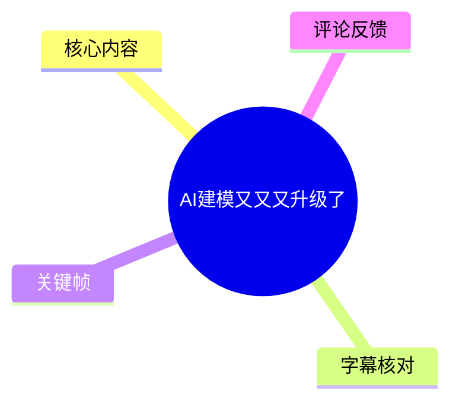
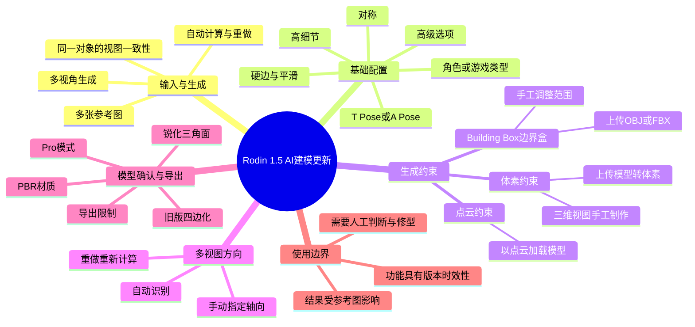
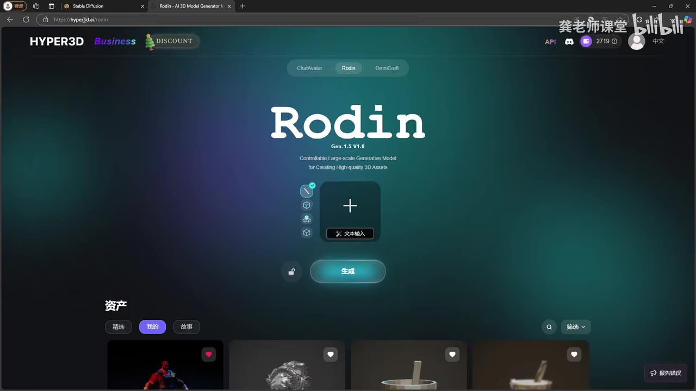
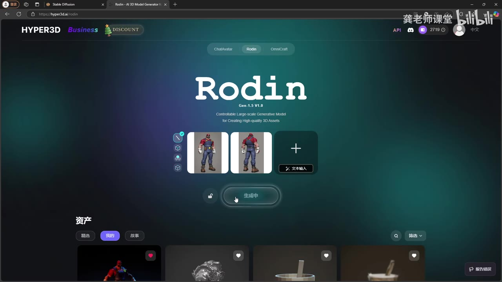
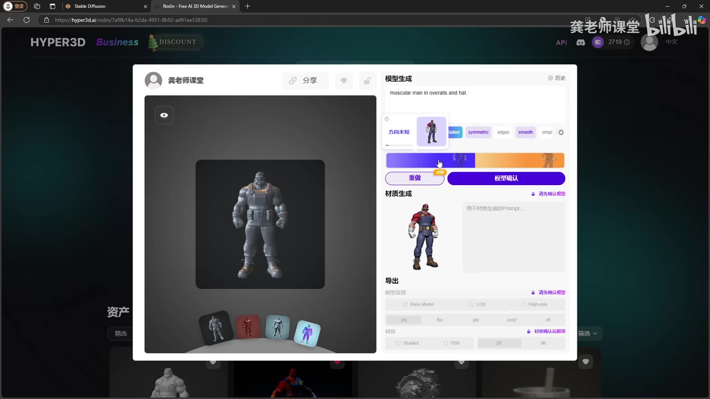

# AI建模又又又升级了

> 来源：[Bilibili 视频](https://www.bilibili.com/video/BV1R76nYpEu9) 
> UP 主：龚老师课堂｜发布时间：2024-12-31｜视频时长：10 分 15 秒｜收藏夹：建模教程  
> 视频内容以 Hyper3D 的 Rodin 为例，演示 Rodin 1.5 版本新增的多图控制、边界约束与新算法模型确认流程。

## 小结

- 本视频介绍的是 Hyper3D 平台中 **Rodin 1.5** 的更新功能。UP 主将其定位为此前 AI 建模教学内容的升级，重点不在从零讲解基础生成，而在于如何提高生成模型的可控性与结构质量。
- 工作流从导入参考图开始：可一次加入多张图，以马里奥角色的前、后视图为例进行多视角生成。视频经验是：**视角越多、且图像越能对应同一对象，生成结果通常越好**。
- 生成阶段可通过姿势、对称、高细节、硬边、平滑、简化、角色/游戏类等选项调节结果，并可通过“重做”重新计算。历史记录可用于比较并选取此前生成的不同版本。
- 版本的核心新增内容是三类约束：视频称为 **Building Box** 的边界盒、体素（Voxel）约束和点云（Point Cloud）约束。它们可通过上传 OBJ、FBX，或手工构建约束形体，限制 AI 生成物的空间范围、体积轮廓或结构走向。
- 多视图导入后，系统可自动识别方向；如果自动识别不符合预期，可以手工为图片指定前后、右前、右后等轴向关系，随后重新计算。
- 模型确认阶段新增 **Pro 模式**。视频将旧流程描述为自动四边化、整体较“软”的结果；新模式则接近抽取减面，并支持锐化三角面效果。UP 主用硬表面/建筑类资产举例，认为新算法的边缘与结构更清楚。
- 需要注意：视频中的功能界面、算法质量、导出格式与付费/额度策略均属于 **2024 年 12 月末录制时的产品状态**，之后可能已调整。视频也明确提到，使用该模式时某些导出项会变灰，不能再导出高模；AI 生成可节省起型时间，但不替代人体结构、变形和后续修型能力。

## 思维导图

## 目录

- [背景、版本与适用对象](#背景版本与适用对象)
- [多图输入与基础生成配置](#多图输入与基础生成配置)
- [历史版本与三类边界约束](#历史版本与三类边界约束)
- [多视图方向指定与重新计算](#多视图方向指定与重新计算)
- [Pro 模式、新旧算法与模型确认](#pro-模式新旧算法与模型确认)
- [贴图、导出与效果对比](#贴图导出与效果对比)
- [可复用操作流程](#可复用操作流程)
- [限制、经验与时效性](#限制经验与时效性)
- [字幕比对](#字幕比对)
- [评论分析](#评论分析)
- [处理记录](#处理记录)

## 背景、版本与适用对象 [00:00:00](https://www.bilibili.com/video/BV1R76nYpEu9?t=0)

视频开场说明，本期是 AI 建模内容的版本升级教学，操作环境为 Hyper3D 内的 Rodin 页面。画面首页显示 “Rodin Gen-1.5 V1.0”，与视频标题和简介中“Rodin 1.5 新增功能”的说法相互印证。

视频不是完整的首次入门课程：UP 主说明，软件的其他功能可参考其此前发布的 AI 建模视频，或自行试用理解。本期更适合已经能够进入 Rodin 生成页、理解参考图与基础模型生成概念，并希望处理“生成造型奇怪”“结构不够清晰”“已有模型还要继续优化”等问题的用户。

> 图：关键帧展示 Hyper3D 的 Rodin 页面、中央输入卡片和“生成”按钮，并可见 “Gen-1.5 V1.0”标识。它用于确认本期所演示的产品入口及版本语境，而非泛指所有 AI 建模工具。

## 多图输入与基础生成配置 [00:00:48](https://www.bilibili.com/video/BV1R76nYpEu9?t=48)

### 多视角参考图：提升一致性的首要输入条件 [00:00:48](https://www.bilibili.com/video/BV1R76nYpEu9?t=48)

UP 主点击加号导入图片，并以同一马里奥角色的前、后视图作为示例。系统支持继续添加多张图片，之后可以选择多视角方式生成。

视频给出的经验判断是：

1. 提供的视角越多，系统可利用的外观和轮廓信息越完整；
2. 参考图应尽量确实对应**同一个模型/对象**；
3. 在同一对象的前提下，多张图片更有利于模型效果。

这是一条工作流经验，不意味着任意数量、任意质量的图片都必然提高结果。图像之间若角色、比例、透视、服装细节或姿势不一致，仍可能给自动识别与重建带来冲突。

> 图：画面中可见两张人物正反视图已被加入输入栏，按钮显示“生成中”。该帧直观说明本视频的多视角输入并非只输入一张单图，而是将多个视图共同作为生成条件。

### 生成选项与“重做” [00:01:36](https://www.bilibili.com/video/BV1R76nYpEu9?t=96)

进入生成结果页面后，UP 主指出新版本相较此前增加了更多选项、齿轮入口、视角相关设置及模型确认选项。ASR 中可辨识的基础参数包括：

| 视频提及选项 | 视频中的作用或建议 | 使用含义 |
| --- | --- | --- |
| T Pose / A Pose | 可在常规情况下勾选 | 用于角色姿势条件；视频未说明两者的算法差别。 |
| 高细节 | 可选 | 倾向于要求更高细节。 |
| 对称（symmetric） | 可选 | 对需要左右对称的对象提供约束。 |
| 边缘更硬（edges） | 可选 | 用于加强边缘硬朗感。 |
| smooth | UP 主建议可去掉 | 视频称其会让整体结果较平整。 |
| 简单（simple，ASR 识别） | 可选标签 | 原始界面参数的精确英文含义未在素材中完整解释。 |
| 游戏/角色类型 | 下方类型标签 | 依据目标资产类别选择。 |
| 高级选项 | 可启用并配置更高内容 | 具体数值、消耗规则和全部子参数未在视频中逐项展示。 |

完成调整后点击“重做”，即可对当前条件重新计算模型。生成后，右上角的历史图标可查看已生成的版本，便于在初版与调整参数后的版本之间进行选择。

> 图：关键帧展示模型生成结果、生成标签、重做与模型确认按钮，并显示下方材质生成和导出区域。它说明参数调整、版本重算和模型确认处于同一结果处理流程中。

## 历史版本与三类边界约束 [00:02:25](https://www.bilibili.com/video/BV1R76nYpEu9?t=145)

### 历史记录：以版本比较代替单次结果定稿 [00:02:25](https://www.bilibili.com/video/BV1R76nYpEu9?t=145)

右上角的历史入口可查看此前每次生成的版本。UP 主先展示第一次生成结果，再与打开相关选项后生成的版本进行对照。其用途是让用户从多个实际结果中选择需要的版本，而不是把某一次“重做”的输出直接视为最终资产。

这一机制尤其适合参数试验：例如分别测试是否开启对称、是否保留平滑、是否加硬边，随后依据结构清晰度、轮廓和贴图可用性进行选择。

### Building Box：用边界盒约束生成范围 [00:02:49](https://www.bilibili.com/video/BV1R76nYpEu9?t=169)

视频称第一种范围限制为 **Building Box**；该英文名称由 ASR 转写得出，素材未提供可核验的站内字幕或清晰参数面板文字，因此在此保留视频转写，不将其擅自改写为其他产品术语。

其工作方式为：

1. 在顶部的约束选项中展开菜单；
2. 选择 Building Box；
3. 可上传外部创建的 OBJ、FBX 等模型，或选择手工制作；
4. 手工模式会出现一个盒子；
5. 通过拖动和前后等方向控制，调整盒子的单位和范围；
6. 确认后重新生成。

UP 主说明，生成物会被限定在设定的大范围之内。因此，当 AI 输出出现“造型奇怪”或明显超出预期区域时，边界盒可作为空间约束手段。

### 体素约束：把已有形体变成生成边界 [00:04:01](https://www.bilibili.com/video/BV1R76nYpEu9?t=241)

第二种为体素类型。可上传 OBJ、FBX，系统会将其转换为体素效果；也可在三维视图中手工创建/调整形体，加入必要的造型控制，再点击生成。

视频将这种方式解释为：把生成造型限定到一个现成模型所提供的体积或轮廓上。典型适用场景是：

- 已经生成过一个初步效果；
- 希望在该效果基础上继续优化；
- 将此前做好的模型重新导入，作为后续生成的控制条件。

这并不代表系统会无误保留全部原模型细节。视频只说明其具有“限定到现成模型”的作用，未提供精度、拓扑保真度或体素分辨率等可量化参数。

### 点云约束：与体素相近的另一种加载表示 [00:05:14](https://www.bilibili.com/video/BV1R76nYpEu9?t=314)

第三种为 Point Cloud（点云）。UP 主认为它和体素功能很像，均用于限制生成；区别在于，它将导入模型以点云形式加载，而不是以体素形式加载。

视频还说明，启用不同约束模式后，界面会显示对应图标。若不再需要某项约束，可打开该项，悬停后找到对勾/删除操作移除，使该选项不再参与生成。

## 多视图方向指定与重新计算 [00:05:38](https://www.bilibili.com/video/BV1R76nYpEu9?t=338)

当输入多张参考图时，系统默认自动识别每张图的方向。自动识别适合参考图方向明确、图像命名或视觉信息一致的场景；若用户已经明确知道图片对应的方位，可在方向设置处拖动并手动指定对应轴向。

视频中举例说明可以把不同图像指定为右前、后方、右后等方向。完成方向识别或手动调整后，仍需使用“重做”重新计算，新的方向条件才会反映在生成结果中。

可将这一过程整理为以下判断顺序：

1. 先确认多张图是否真的是同一对象；
2. 查看系统自动识别的方向是否正确；
3. 对错误或不明确的视图手工指定方位；
4. 保留或添加边界盒、体素、点云等约束；
5. 点击“重做”获得新的候选版本；
6. 在历史记录中比较新旧结果。

## Pro 模式、新旧算法与模型确认 [00:06:26](https://www.bilibili.com/video/BV1R76nYpEu9?t=386)

### 旧版四边化流程的表现 [00:06:26](https://www.bilibili.com/video/BV1R76nYpEu9?t=386)

UP 主对旧版流程的描述是：此前生成后，系统会自动将模型处理成四边面；虽然可以指定生成面数，但整体结果会显得偏“软”。这里的“软”是视频中对视觉观感的描述，主要指硬边、棱角和结构分界不够明确，并非面数或拓扑质量的完整评价。

### Pro 模式与锐化三角面 [00:06:50](https://www.bilibili.com/video/BV1R76nYpEu9?t=410)

新版本增加了 **Pro 模式**。视频将其描述为近似“抽取减面”的方式，并提到存在“锐化三角面”模式，可产生更精细的模型结果。

其核心价值在于保留更锐利的结构特征：

- 对角色的服装、靴子、护具等有明确硬边的区域，轮廓可能更清楚；
- 对硬表面资产和建筑类效果，UP 主认为新模式比此前更合适；
- 在后续 ZBrush 对比中，UP 主认为新算法的结构清晰度和准确度都优于旧算法。

模型确认后，可根据需要确认是否生成对称对象，视频中选择 “Yes”。随后才进入贴图生成、导出等后续步骤。

## 贴图、导出与效果对比 [00:07:39](https://www.bilibili.com/video/BV1R76nYpEu9?t=459)

### PBR 材质与参考强度 [00:07:39](https://www.bilibili.com/video/BV1R76nYpEu9?t=459)

在材质生成区域，视频提到 PBR 材质与“参考强度”相关设置。UP 主给出的规律是：**这两个值越大，越有利于保留原图效果**。但视频没有清楚给出两个控件的精确名称、取值范围、默认值或相互关系，因此不能据此推导具体推荐数值。

生成材质后，模型可呈现带贴图的效果。视频演示中可在预览、模型、PBR 等不同显示模式之间切换查看。

### 导出限制 [00:08:03](https://www.bilibili.com/video/BV1R76nYpEu9?t=483)

视频特别指出：如果使用前述新模式生成，导出类型中的某个选项会变灰，**不能再导出高模（High-poly）**。这是本期最明确的功能限制之一。

因此，使用 Pro/锐化三角面相关模式前，应先按交付目标判断：

- 若目标是获得轮廓和硬边更明确的基础资产，可优先测试新模式；
- 若后续流程明确需要高模导出，则应先在当前版本界面确认导出项是否可用；
- 不应仅因视觉效果更锐利，就忽略目标 DCC、游戏引擎或雕刻流程所需的模型规格。

视频展示的导出区域包含 Base Model、LOD、High-poly 及若干格式按钮，但并未逐项讲解所有格式的适配关系；未生成材质时，部分材质相关项不可用，有材质时可直接使用。

### 新旧模型在 ZBrush 中的主观对比 [00:09:15](https://www.bilibili.com/video/BV1R76nYpEu9?t=555)

UP 主将新、旧算法各自导出的模型放入 ZBrush（视频口语称“ZB”）对比，并通过 `Shift + S` 截图观察。其结论是：

| 对比维度 | 新算法/Pro 相关结果 | 旧版模式结果 |
| --- | --- | --- |
| 整体结构 | 更清楚 | 偏软 |
| 边缘棱角 | 更锐利 | 相对圆滑 |
| 准确度 | 视频认为更高 | 相对较低 |
| 演示中的影响因素 | 开启了 A Pose | 并非在所有条件上独立比较 |

这里必须保留一个重要限定：UP 主同时提到，新结果的准确性提升与其开启 **A Pose** 有关。因此，这不是严格控制变量实验，不能把全部质量提升完全归因于新算法；较合理的理解是，在该演示的输入、姿势和配置组合下，新流程呈现了更清晰的结构结果。

## 可复用操作流程 [00:00:48](https://www.bilibili.com/video/BV1R76nYpEu9?t=48)

以下流程依据视频实际演示顺序整理，适合用于角色或具有明确前后视图的资产生成。

1. **进入 Hyper3D 的 Rodin 页面**  
   确认在 Rodin 生成入口，而非其他 Hyper3D 产品页。

2. **准备一致的参考图**  
   优先准备同一对象的前、后或更多角度视图。避免混用不同姿势、比例或设计版本的图片。

3. **添加多张图片并选择多视角生成**  
   点击加号加载图片；如有多个视图，全部添加后进行多视角生成。

4. **设置基础生成条件**  
   按对象需求选择 T Pose/A Pose、对称、高细节、硬边、平滑、类型等选项。  
   - 追求更平整外观时可保留 smooth；  
   - 视频经验认为想减少整体“平整/软化”观感时可去掉 smooth；  
   - 对称角色可考虑开启 symmetric。

5. **进入高级选项并按需配置**  
   视频仅展示可启用高级配置，未提供全量参数解释；应以当前界面的提示和实际生成结果为准。

6. **检查视图方向**  
   先让系统自动识别；发现方位不符时，手动将图片拖到对应的前、后、右前、右后等方向。

7. **为异常造型添加约束（可选）**  
   - 仅需限制大致空间范围：使用 Building Box；  
   - 需沿已有体积/模型继续生成：使用体素约束；  
   - 希望以点云形态提供类似限制：使用 Point Cloud。  
   三者均可根据视频所述使用 OBJ、FBX 或手工方式建立条件，但具体兼容性仍以当前页面为准。

8. **点击“重做”重新计算**  
   方向、标签、约束等改变后，都需要重做才会进入新的生成结果。

9. **通过历史记录比较版本**  
   不要只保留最后一次输出；对照初始版本和调整后的版本，选择结构、姿势、轮廓更符合目标的候选模型。

10. **在模型确认阶段选择模型模式**  
    对硬表面或建筑等重视棱角的对象，可测试 Pro 模式及视频提到的锐化三角面效果；同时确认是否需要高模导出，避免在后段才发现导出受限。

11. **生成贴图并导出**  
    需要材质时生成 PBR；视频称相关参考强度数值更高时会更保留原图效果。根据已有材质状态和目标流程选择 Base Model、格式及其他可用导出项。

12. **在 DCC 软件中复核**  
    可导入 ZBrush 等软件检查模型结构、边缘、贴图和后续编辑需求。AI 输出适合作为起型或候选资产，仍应进行人工检查与修型。

## 限制、经验与时效性 [00:08:03](https://www.bilibili.com/video/BV1R76nYpEu9?t=483)

### 视频已明确说明的限制

- 新模式下，导出区存在变灰项，视频明确称不能再导出高模。
- 多视图的效果依赖输入是否为同一个模型；视频没有承诺不同来源或不一致视图也能稳定生成。
- 自动方向识别不是绝对可靠，必要时需人工指定轴向并重算。
- 体素、点云和边界盒是生成约束，而不是对最终造型质量的绝对保证。
- PBR 和参考强度的具体参数范围并未公开讲解，不能从视频中得出通用的数值配方。

### 可迁移的实践经验

- 将 AI 建模定位为“快速起型 + 多候选比较 + 人工修型”的流程，比将其视为一次性终稿工具更稳妥。
- 面对结构跑偏，优先增加一致的多视图和方向信息；若仍无法控制，再加入边界盒、体素或点云约束。
- 对硬表面和建筑资产，结构锐利程度是重要评价指标；应将 Pro 模式结果与旧模式、不同参数版本放在同一尺度下比较。
- 对角色资产，A Pose/T Pose、对称选项和参考图的一致性会共同影响结果，比较算法时应尽量控制这些变量。

### 时效性说明

视频发布于 2024-12-31，演示的是当时 Rodin 1.5/Gen-1.5 V1.0 界面与功能状态。Hyper3D 作为在线服务，其模型名称、页面布局、可用选项、额度、模型导出能力、格式以及收费策略均可能在之后更新。本文仅记录视频素材中可确认的操作与观点，不将其表述为当前平台的永久规则。

## 字幕比对 [00:00:00](https://www.bilibili.com/video/BV1R76nYpEu9?t=0)

| 字幕来源 | 完整性 | 专有名词 | 时间轴 | 主要问题 |
| --- | --- | --- | --- | --- |
| Bilibili 站内字幕 | 未提供可用站内字幕，无法使用 | 无法核验 | 无法核验 | 素材包明确标注“未提供可用站内字幕”。 |
| 本次 ASR 字幕 | 较完整：26 段，覆盖约 612.76 秒；语音覆盖率约 99.79% | 存在较多同音、术语与界面词误识别 | 可用：提供精确起止时间，首段 00:00:00.180，末段 00:10:12.940 | 如“光老师”“Roding”“体速”“点互”“高膜”等存在明显识别偏差或不确定转写。 |

### 最终字幕选择与校正原则

本文采用**本次 ASR 时间轴**作为章节定位依据，因为没有提供可用的 Bilibili 站内字幕；ASR 诊断未标记 `noAudioStream=true`，且识别到中文语音，语音覆盖率高，因此不存在“源视频无音轨”的情况。

结合视频元数据、关键帧画面和上下文，进行了以下必要校正或标注：

| ASR 结果 | 本文处理 | 依据 |
| --- | --- | --- |
| “光老师” | 校正为“龚老师” | UP 主元数据为“龚老师课堂”。 |
| “Roding” | 统一写为“Rodin” | 视频标题、简介和关键帧中的产品名均指向 Rodin。 |
| “体速” | 统一写为“体素” | 上下文描述为 OBJ/FBX 转换为体素效果及三维体积约束。 |
| “点互” | 统一写为“点云” | ASR 同段出现 Point Cloud，语义明确。 |
| “高膜” | 解释为“高模（High-poly）” | 同段讨论导出项变灰；关键帧导出区可见 High-poly 英文标记。 |
| “Building Box” | 保留该转写并标注待核验 | 素材未提供可核验的站内字幕或足够清晰的该菜单画面文字，不能擅自替换为其他术语。 |
| “A POS / APOS” | 统一写为“A Pose” | 与前文 T Pose 并列，且为常见角色姿势表达。 |

## 评论分析 [00:00:00](https://www.bilibili.com/video/BV1R76nYpEu9?t=0)

仅处理素材中可获取的热评前三条；评论属于个人观点或经验，不作为功能事实的验证依据。

1. **赛博空格｜108 赞**  
   - 评论观点：“起型省时间了，至少省半个小时”。  
   - 补充价值：从实际使用期待角度认可 AI 生成对初始造型阶段的效率价值，与视频“快速生成模型、再进行优化”的工作流相呼应。  
   - 可信度与限制：“省半小时”是个人估计，未说明资产复杂度、熟练度、修改成本及硬件/网络条件，不能推广为通用效率数据。

2. **阿迪王黄金战靴｜65 赞**  
   - 评论观点：熟手因掌握大型结构，更能有效使用此类工具；新手仍需练习人体结构基本功，否则面对生成失败或复杂变形人体会缺乏处理能力。  
   - 补充价值：指出 AI 工具的价值依赖使用者的判断和修型能力，尤其对应视频中多视图、方向、约束、历史版本比较等需要人工决策的环节。  
   - 可信度与限制：这是一种技能学习建议，不是关于 Rodin 功能的实测结论；但其“AI 输出需要人工判断”的方向与视频流程相容。

3. **蒋_天养｜12 赞**  
   - 评论观点：表达对 AI 可能替代岗位的担忧，并提出应多赚钱、储蓄以应对未来。  
   - 补充价值：反映评论区对生成式 AI 职业影响的焦虑。  
   - 可信度与限制：评论没有提供行业统计、岗位数据或对 3D 建模职业的具体分析，属于个人预期，不能据此得出“AI 将在何时替代人”的结论。

## 评论分析

- 热评 1：不错，起型省时间了，至少省半个小时[笑哭]
- 热评 2：对于熟手来说很有用，因为熟手对于大型结构已经胸有成竹；对于新手来说，我劝你还是老老实实练几年人体结构基本功，不然遇到生成不出来的模型或者需要变形结构的人体，你就知道什么是捉襟见肘了
- 热评 3：ai失业是迟早的事儿，还好哥已经三十多岁了，再干个7.8年，等到ai代替人的时候，也已经该隐退了，现在就是多赚钱，存钱，为将来作好打算~

以上内容是观众反馈摘录，只用于补充理解视频反响，不作为正文事实依据。

## 处理记录

- Worker ID：`worker-msaehvue-e0b94e0c`
- 整理模型：`gpt-5.6-terra`
- 调用工具与模型：音频 ASR 使用 `large-v3-turbo`，语言自动识别为中文（置信度约 `0.9976`），运行设备为 CUDA，计算类型为 `int8_float16`。
- 使用的素材工具结果：已使用合并视频、音频文件、ASR 分段 JSON、ASR SRT 时间轴、关键帧目录、视频元数据和评论 JSON；未提供可用站内字幕。
- 字幕选择：以本次 ASR 的 26 个带时间戳分段作为正文时间轴来源；ASR 覆盖约 612.76 秒、覆盖率约 99.79%。站内字幕缺失，无法进行逐句双源校对；已依据元数据、画面和上下文校正明显术语误识别，并对无法确认的 “Building Box” 保留原转写及不确定性说明。
- 关键帧选择依据：选取 `frames/frame-001.jpg` 确认 Rodin Gen-1.5 V1.0 首页和入口；选取 `frames/frame-003.jpg` 说明前后视图的多图输入；选取 `frames/frame-004.jpg` 说明生成结果、参数标签、模型确认、材质与导出区域。图片仅用于支撑画面中实际可见的界面信息。
- 缓存清理：素材中未提供缓存清理执行日志；无法确认是否已执行清理，故不将其表述为已完成。
- 未解决问题：未提供站内字幕，无法核验全部英文菜单原文；视频未展示高级选项的完整参数、数值范围、各导出格式的适配条件，以及当前版本平台是否仍保留相同功能与限制。
