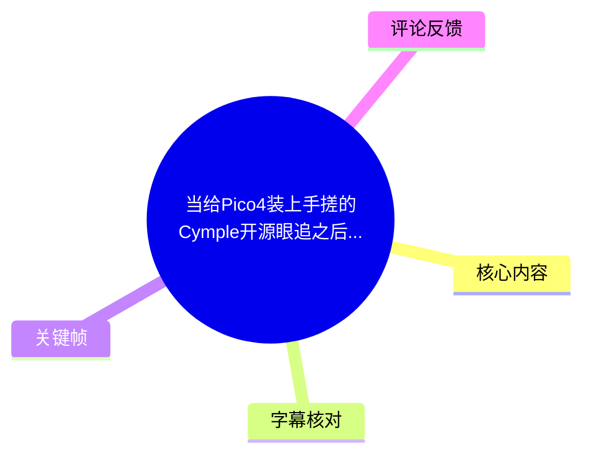
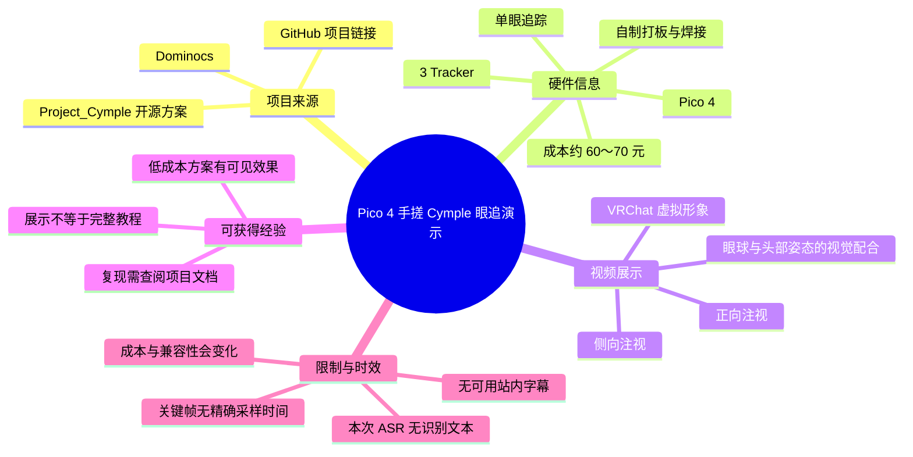
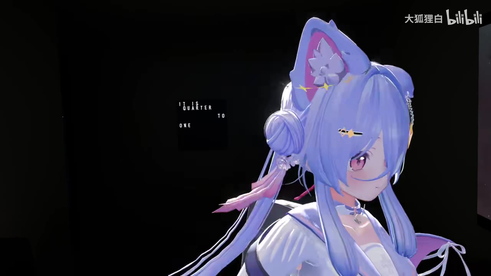
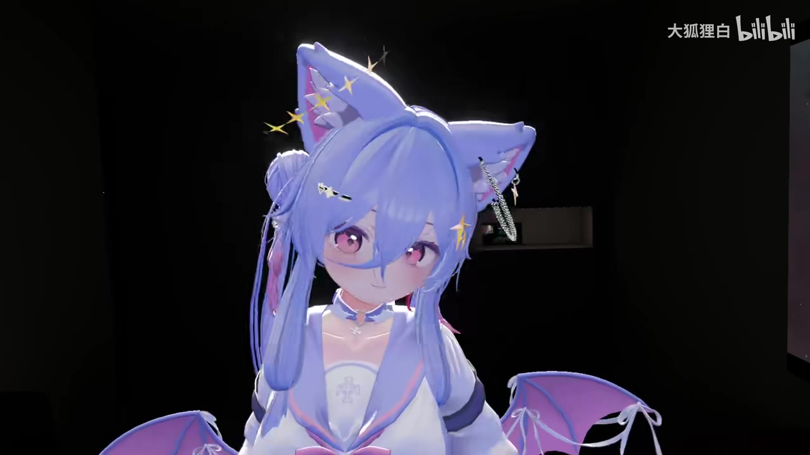
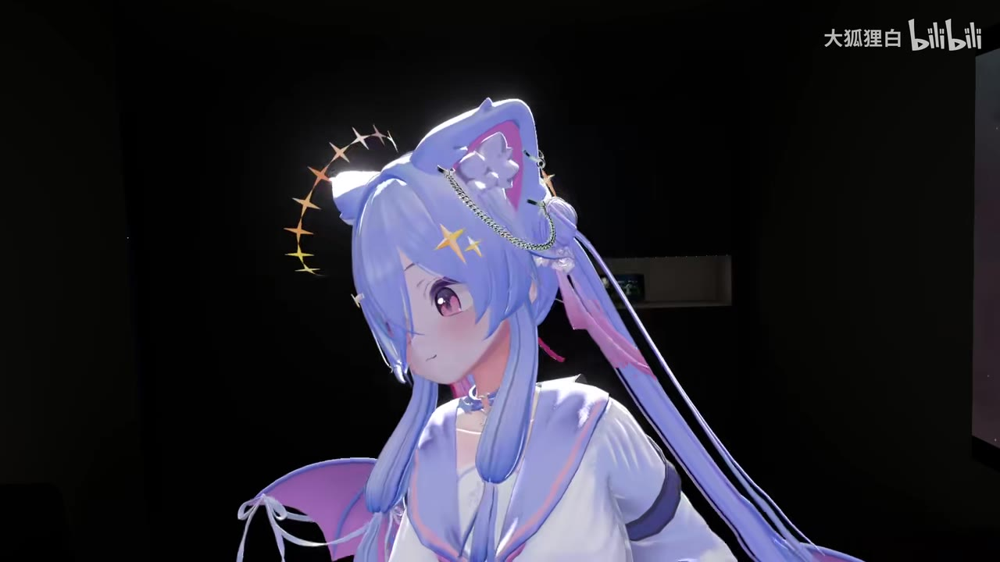

# 当给Pico4装上手搓的Cymple开源眼追之后...

> 来源：[Bilibili 视频](https://www.bilibili.com/video/BV16hKJzsEZ3) 
> UP 主：大狐狸白｜发布时间：2025-06-25｜视频时长：00:52 
> 标签：VR、演示、眼追、Pico4、VRChat

## 小结

视频是一段时长 52 秒的 VRChat 效果展示：UP 主为 Pico 4 加装了基于 **Dominocs 的 Project_Cymple 开源方案**制作的单眼追踪装置，并通过虚拟形象的眼球转动、注视方向与表情变化，展示眼追驱动后的视觉效果。

视频描述给出的关键技术信息是：该方案为**单眼追踪**；若自行打板、焊接，硬件成本约为 **60～70 元**；作者使用的整体设备组合写为 **Pico 4 + 3 Tracker**。这里的成本、设备组合均来自视频简介，应视为作者在发布时的个人实作条件，而非所有复现者都能直接达到的通用结论。

画面重点并非安装教程，而是最终效果。关键帧中可见 VRChat 二次元虚拟形象的视线分别朝侧方、正前方和偏侧方向移动；近景画面还能看出眼球朝向与头部姿态并不完全相同，因此能够直观说明眼追为虚拟形象增加了独立的注视表现。

对于想尝试低成本 VR 眼追、Pico 4 外设改装或 VRChat Avatar 表情驱动的人，本视频可作为效果参考和项目入口。它不提供可据以完整复刻的电路图、固件刷写流程、校准参数、镜头安装位置或软件配置步骤；实际复现仍需查阅项目仓库与相关文档。

时效上，视频发布于 2025-06-25，所链接的开源项目、兼容设备、固件版本、VRChat/Unity 相关工作流和元器件价格都可能在之后变化。尤其“60～70 元”属于作者当时的自制成本描述，不应直接视为当前采购报价。

## 思维导图

## 目录

- [项目背景与可验证信息](#项目背景与可验证信息-0000)
- [画面演示：虚拟形象的眼追效果](#画面演示虚拟形象的眼追效果-0000)
- [技术信息、设备与成本](#技术信息设备与成本-0000)
- [可迁移的实践经验与复现边界](#可迁移的实践经验与复现边界-0000)
- [时间轴与关键帧说明](#时间轴与关键帧说明-0000)
- [结论、限制与时效性](#结论限制与时效性-0000)
- [字幕比对](#字幕比对-0000)
- [评论分析](#评论分析-0000)
- [处理记录](#处理记录-0000)

## 项目背景与可验证信息 [00:00](https://www.bilibili.com/video/BV16hKJzsEZ3?t=0)

这支视频的主题是将手搓的 Cymple 开源眼追方案用于 Pico 4，并在 VRChat 环境中观察虚拟形象的眼部表现。标题中的“Cymple”与视频简介中给出的项目地址相对应：

- 项目作者/来源：**Dominocs**
- 项目名称：**Project_Cymple**
- 视频简介提供的地址：[https://github.com/Dominocs/Project_Cymple](https://github.com/Dominocs/Project_Cymple)
- 追踪形式：**单眼追踪**
- 作者列出的设备：**Pico 4 + 3 Tracker**
- 作者描述的自制成本：自行打板、焊接约 **60～70 元**

需要区分以下信息层级：

1. **视频与简介明确陈述的事实**：项目名称、项目链接、单眼追踪、Pico 4 + 3 Tracker，以及约 60～70 元的自制成本。
2. **画面可直接观察到的内容**：VRChat 虚拟形象出现不同的视线方向和眼部状态。
3. **无法由当前素材确认的事项**：具体摄像头型号、主控芯片、PCB 文件版本、传感器帧率、追踪算法、安装结构、眼球数据如何传入 VRChat、校准方式、延迟、丢失追踪概率及续航影响。

因此，该视频应理解为“已装配方案的效果短演示”，而不是完整的从零制作教学。

## 画面演示：虚拟形象的眼追效果 [00:00](https://www.bilibili.com/video/BV16hKJzsEZ3?t=0)

视频画面主要由黑色背景下的 VRChat 虚拟形象构成。角色在镜头前以不同角度转头、看向不同方向，并展示近距离面部画面。由于本次 ASR 没有识别出语音文本、站内字幕也不可用，不能把这些动作精确对应到作者口述的某项校准或功能说明；以下仅记录画面可见效果。

> 图：该帧显示角色以侧脸朝向镜头右侧，眼部处于侧向可见状态。它的价值在于提供眼追效果的侧视观察样本：观看者可关注眼球方向在角色面部近景中的呈现，而不是只看整体角色动作。

> 图：该帧为角色正面近景，双眼均清晰可见。它适合作为观察正面眼部表现的参考画面，包括左右眼视觉对称性、瞳孔位置和整体表情观感；但单张静帧不能证明实时响应速度或追踪精度。

> 图：角色头部转向一侧，眼睛仍呈现可辨识的方向性。该帧有助于理解视频重点是虚拟形象端的最终视觉输出，而非镜头、PCB 或软件界面的制作过程。

> 图：该特写将视线和面部表情放大。它有助于观察眼球偏转在二次元模型上的可见性，也说明展示采用了近距离镜头以凸显眼部变化；不过画面未提供校准标靶或数据叠加层，无法据此量化追踪误差。

从这些画面可以得到的有限结论是：该方案在作者当前环境中能够产生肉眼可见的虚拟形象眼部方向变化。不能仅凭成片画面推断其在快速扫视、极端眼位、强光环境、佩戴者眼镜遮挡、长时间使用或不同 Avatar 上的稳定性。

## 技术信息、设备与成本 [00:00](https://www.bilibili.com/video/BV16hKJzsEZ3?t=0)

### 已披露参数

| 项目 | 素材中可确认的信息 | 说明 |
| --- | --- | --- |
| VR 头显 | Pico 4 | 来自视频标题和简介。 |
| 眼追方案 | Dominocs 的 Project_Cymple 开源方案 | 视频简介明确给出名称与 GitHub 地址。 |
| 追踪范围 | 单眼追踪 | 视频简介明确说明。不能据此扩展为双眼凝视、瞳距估计或注视点追踪。 |
| 其他追踪设备 | 3 Tracker | 简介写为“设备 Pico4+3Tracker”，未说明具体型号、身体部位绑定或通信方式。 |
| 自制工艺 | 自己打板、焊接 | 表明作者采用了需要硬件制作能力的实现方式。 |
| 成本 | 约 60～70 元 | 仅指作者“自己打板焊接”的大概成本；未说明是否包含头显、Tracker、工具、运费、返工和外壳。 |
| 展示场景 | VRChat | 元数据标签与画面中的虚拟形象展示共同支持这一点。 |
| 视频时长 | 52 秒 | 元数据给出；属于效果展示短片。 |

### 未披露、不能补写的参数

素材未给出以下决定复现成败的技术细节，不能臆测：

- 单眼摄像头或传感器的型号、分辨率、视场角和帧率；
- PCB 原理图、打板厂、BOM、焊接难度和实际良率；
- 主控、供电、电池、线材走线和头显固定结构；
- 固件名称、版本号、刷写方式与驱动依赖；
- 眼部中心校准、视线映射、滤波、漂移补偿和重置手势；
- 到 VRChat 的参数传输方式及 Avatar 端配置；
- 端到端延迟、刷新率、追踪精度和失败边界；
- 与不同 Pico 4 固件、PCVR 串流方式、操作系统或 VRChat 版本的兼容性。

### 成本理解的正确方式

“60～70 元”不能简单理解为“任何人 70 元即可获得眼追”。视频简介限定了前提：**自己打板、自己焊接**。若将实际复现成本拆开，至少还可能涉及未被视频计入或未被说明的部分：

- 已有设备成本：Pico 4、Tracker、电脑及 VRChat 使用环境；
- 制作工具：烙铁、焊锡、万用表、调试工具等；
- 小批量 PCB 打样、元件采购、运费与备件；
- 安装支架、外壳、粘接或固定材料；
- 调试、返工和校准所花费的时间。

这些并非视频提供的报价，而是解释“自制元器件成本”和“完整可用系统成本”不能混为一谈的通用成本边界。

## 可迁移的实践经验与复现边界 [00:00](https://www.bilibili.com/video/BV16hKJzsEZ3?t=0)

### 从视频可提炼的经验

1. **先区分“效果展示”与“制作教学”**  
   视频能够证明作者的成品在展示场景中出现了可见眼部效果，但没有展示装配与配置过程。把它当作项目成果案例更合适，不宜将其当作无缺失教程。

2. **开源项目链接是进一步学习的入口**  
   视频简介提供了 Project_Cymple 仓库地址。对想复现的人而言，仓库中的 README、版本发布信息、BOM、硬件文件、固件说明和 Issue 讨论（如有）才是确认当前支持范围的主要依据。

3. **硬件动手能力是方案前提的一部分**  
   作者明确写到“自己打板焊接”。这意味着此案例不等同于即插即用外设；复现者需要评估自己的焊接、硬件调试和故障排查能力。

4. **评价效果要看动态过程而非单张截图**  
   单张关键帧只能帮助观察视觉呈现，不能测出抖动、延迟、追踪连续性和校准偏差。若要判断可用性，应在实际佩戴时测试持续注视、左右扫视、眨眼、低头和不同光照条件。

### 建议的核验步骤

以下是基于视频已给出项目入口而整理的**核验顺序**，不是视频中实际展示的操作步骤：

1. 打开 [Project_Cymple GitHub 仓库](https://github.com/Dominocs/Project_Cymple)，确认仓库是否仍可访问、许可证、文档和最近更新状态。
2. 对照项目文档核实支持的头显、单眼/双眼模式、所需主控与传感器；不要仅依据本视频标题外推兼容性。
3. 列出完整 BOM，并将“元器件成本”与“已有设备、工具、运费、打样、固定结构”分开估算。
4. 在制作前确认 Pico 4 与 PCVR/VRChat 工作链路正常，再单独处理眼追模块，避免多项故障相互混淆。
5. 按项目文档完成硬件安装与软件配置后，先进行基础校准，再在 Avatar 端检查眼部参数是否实际生效。
6. 使用动态测试而非截图检验：中心注视、左右上下扫视、头动与眼动组合、连续使用后的漂移情况。
7. 记录固件版本、软件版本和校准条件，以便后续排查兼容性变化。

### 不应从本视频直接推导的结论

- 不能断言该方案比 Pico 4 Pro 或其他原生眼追设备更准确。
- 不能断言单眼追踪一定能完整替代双眼追踪。
- 不能断言所有 VRChat 模型都能直接获得同样的眼部效果。
- 不能断言 60～70 元包含完整系统，或在当前时间仍可按该价格采购。
- 不能断言视频内展示的自然程度来自眼追本身；Avatar 的眼部绑定、表情系统、动画和镜头剪辑都可能影响观感。

## 时间轴与关键帧说明 [00:00](https://www.bilibili.com/video/BV16hKJzsEZ3?t=0)

本视频的 ASR 结果没有产生任何带时间戳的语音分段，站内字幕也未提供。因此，素材中唯一可直接确认的时间信息是视频总时长 **00:52**，以及视频起点 **00:00**。

| 时间范围 | 内容 | 证据与置信边界 |
| --- | --- | --- |
| [00:00–00:52](https://www.bilibili.com/video/BV16hKJzsEZ3?t=0) | VRChat 虚拟形象的眼部效果展示 | 可由关键帧画面确认；没有可用字幕可将具体画面动作精确对应到作者语言说明。 |
| 未提供 | 各关键帧的精确采样秒数 | 关键帧文件仅提供序号，未附带采样时间；为避免根据画面顺序虚构时间，不标注具体秒点。 |
| 未提供 | 安装、焊接、校准、软件设置时间段 | 现有画面与字幕素材均不足以确认存在这些教程段落。 |

关键帧的使用原则如下：

- 选用 `frame-001.jpg` 至 `frame-004.jpg`，因为它们共同覆盖了侧面、正面、偏头及面部特写等不同观察视角。
- 不将关键帧编号视作精确时间戳，也不根据帧序号猜测它们对应的秒数。
- 图片用于说明最终 VRChat 视觉效果，不用于证明硬件结构、算法原理、追踪指标或校准流程。

## 结论、限制与时效性 [00:00](https://www.bilibili.com/video/BV16hKJzsEZ3?t=0)

这支短视频的核心价值是提供了一个低成本、开源、自制 Pico 4 眼追方案的**成品视觉案例**。作者给出的信息表明，该方案基于 Dominocs 的 Project_Cymple，采用单眼追踪，作者以自制 PCB 和焊接方式完成，并估计相关制作成本约为 60～70 元。在 VRChat 画面中，虚拟形象确实呈现出肉眼可见的视线变化。

但视频没有提供完整技术链路，因此不能把“看起来效果好”直接等同于“易于复刻、成本固定、兼容广泛或性能可靠”。特别是单眼方案的实际使用感受可能高度依赖于硬件装配、佩戴位置、校准、软件版本、Avatar 参数与个人眼部条件。

视频发布于 2025-06-25；本整理使用的抓取元数据时间为 2026-08-01。开源项目仓库、元器件价格、Pico 4 系统版本、VRChat 更新和相关驱动支持均可能已发生变化。复现前应以项目仓库的当前文档为准，并重新核验兼容性与成本。

## 字幕比对 [00:00](https://www.bilibili.com/video/BV16hKJzsEZ3?t=0)

| 字幕来源 | 完整性 | 专有名词 | 时间轴 | 主要问题 |
| --- | --- | --- | --- | --- |
| Bilibili 站内字幕 | 不可用 | 无法核验 | 无 | 素材明确标注“未提供可用站内字幕”。 |
| 本次 ASR 字幕 | 空 | 未识别出任何专有名词 | 无可用分段 | `large-v3-turbo` 检测语言为英语（置信度约 0.601），但结果 `segments` 为空；语音时长为 0 秒、覆盖率为 0。诊断提示未识别到语音片段。 |

本次 ASR 已完成检查：音频素材路径存在，ASR 诊断中**未标记** `noAudioStream=true`，因此不能将本视频描述为“源视频没有音轨”。现有诊断只能如实说明：ASR 未识别出可用语音分段，并提示应检查可听语音或音轨选择。

由于站内字幕不可用、ASR 输出为空，正文没有采用任何转写字幕，也没有将未被素材支持的口述内容补写为教程步骤。正文的信息来源按优先级为：

1. 视频元数据与简介；
2. 已提供的关键帧画面；
3. 视频总时长；
4. 可获取热评，且仅作为观众反馈，不作为事实证据。

术语校正方面，**Cymple**、**Project_Cymple**、**Dominocs**、**Pico 4**、**VRChat** 和 **3 Tracker** 均来自视频标题、简介或元数据，而不是来自空白 ASR 文本。

## 评论分析 [00:00](https://www.bilibili.com/video/BV16hKJzsEZ3?t=0)

仅处理本次可获取的热评前三条；评论反映的是观众感受，不构成对技术性能、价格或兼容性的独立验证。

1. **爱吃虾仁炒饭的王小桃｜50 赞**  
   > “技术牛逼，身为普通人的我只能买p4p了”

   评论表达了对自制技术方案的认可，同时将其理解为对普通用户门槛较高的路线，并提到倾向购买“P4P”（通常可能指 Pico 4 Pro，但评论本身未展开）。这与视频简介中的“打板焊接”相呼应：自制方案需要额外动手能力。  
   **可信度边界**：这是使用门槛的主观评价，不能据此判断 Pico 4 Pro 的眼追性能、价格优势或与该方案的具体差异。

2. **P2-_-｜24 赞**  
   > “看看e”

   该评论文字过短，未提供可分析的技术观点、复现信息或争议内容。  
   **可信度边界**：没有足够上下文，不能作进一步解释。

3. **太陽與向日葵｜24 赞**  
   > “怎么你的效果这么好”

   评论直接肯定了视频中的视觉效果，也侧面说明画面中的视线表现对观众具有说服力。它提示实际观感可能受关注，但并未说明“效果好”的具体评价标准。  
   **可信度边界**：单一观众的视觉印象不能替代对精度、延迟、稳定性或跨设备兼容性的测试。

## 处理记录 [00:00](https://www.bilibili.com/video/BV16hKJzsEZ3?t=0)

- **Worker ID**：`worker-msaeho0y-365b05fe`
- **整理模型**：`gpt-5.6-terra`
- **ASR 模型**：`large-v3-turbo`（CUDA，`int8_float16`，自动语言识别）
- **调用工具与素材输出**：依据任务提供的媒体处理产物进行整理，包括 `merged.mp4`、`audio/audio.wav`、`frames/`、`asr/asr-result.json`、`asr/transcript.srt`、`comments/comments.json` 与视频元数据。
- **字幕检查与选择**：
  - Bilibili 站内字幕：未提供可用字幕；
  - 本次 ASR：已检查，识别结果为空，`segments: []`，无可用时间戳文本；
  - 最终选择：不采用字幕正文转写，改以视频简介、元数据和关键帧进行受限的多模态整理。
- **关键帧选择依据**：
  - 使用 `frames/frame-001.jpg`、`frames/frame-002.jpg`、`frames/frame-003.jpg`、`frames/frame-004.jpg`；
  - 这些画面覆盖角色侧视、正视、偏头和近景眼部状态，能够服务于“最终视觉效果展示”的说明；
  - 关键帧未提供精确采样时间，故未虚构秒级定位。
- **时间轴依据**：ASR 与站内字幕均无可用分段；所有章节链接统一指向唯一可确认的起点 `00:00`，视频总时长为 52 秒。
- **评论范围**：仅分析了可获取热评前三条，未延伸到其他评论。
- **缓存清理**：任务素材未提供缓存清理执行日志；无法确认是否已执行清理，不作“已清理”声明。
- **未解决问题**：无法从现有素材确认该方案的详细硬件清单、安装结构、软件配置、校准方式、实时性能、兼容范围和当前项目维护状态。

## 评论分析

- 热评 1：技术牛逼，身为普通人的我只能买p4p了
- 热评 2：看看e
- 热评 3：怎么你的效果这么好

以上内容是观众反馈摘录，只用于补充理解视频反响，不作为正文事实依据。
