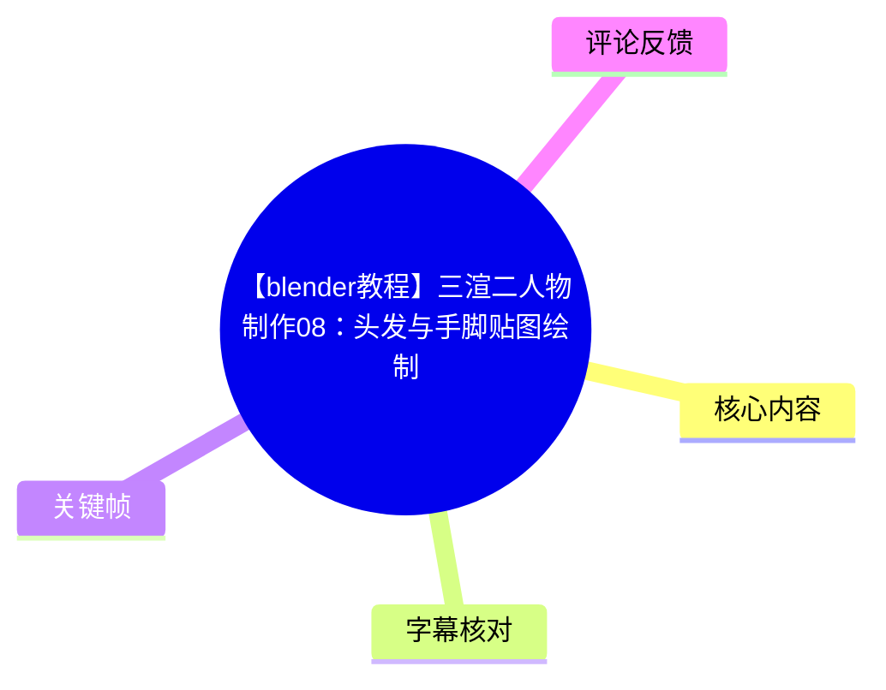
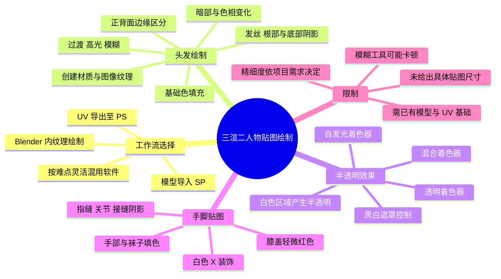
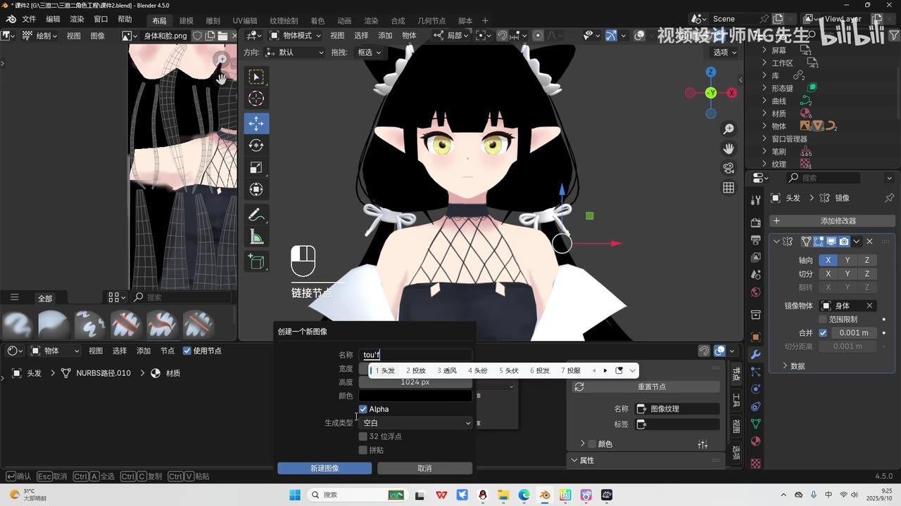
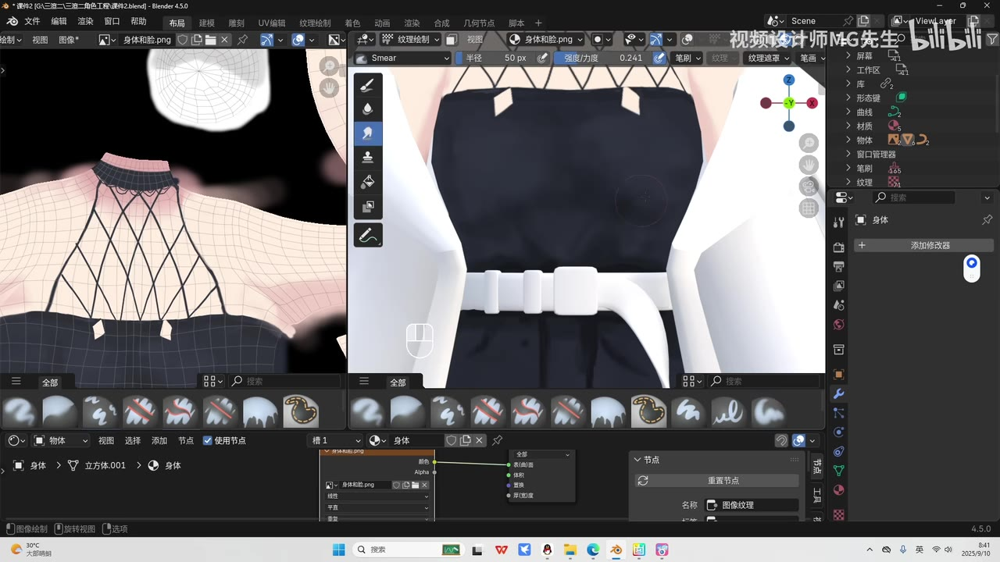
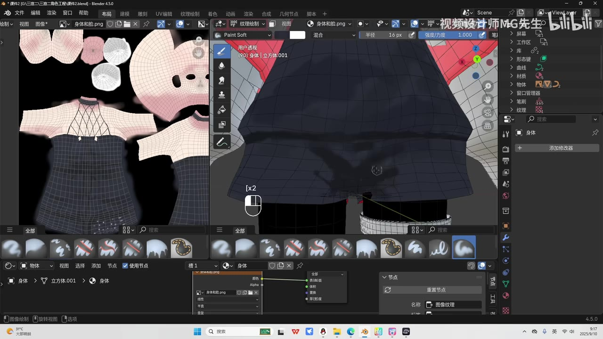
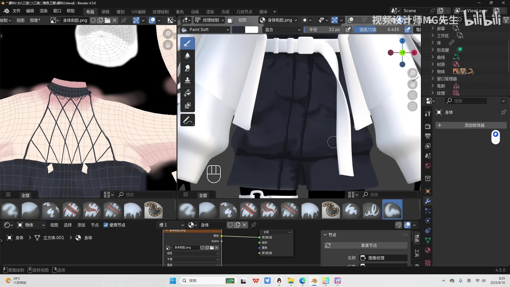

# 【blender教程】三渲二人物制作08：头发与手脚贴图绘制

> 来源：[Bilibili 视频](https://www.bilibili.com/video/BV1xzHBzdEWM) 
> UP 主：视频设计师MG先生｜发布时间：2025-09-12｜视频时长：18 分 14 秒｜分辨率：1920×1080 
> 系列：建模教程｜标签：Blender、三渲二、头发、身体、贴图绘制、3D 建模

## 小结

本集是“三渲二人物制作”系列中的贴图绘制实操，承接上一集的脸部和身体贴图，重点处理头发、手部与腿部。作者采用的主流程是在 **Blender 内直接进行纹理绘制（Texture Paint）**，而非必须导出 UV 到 Photoshop（PS）或导入 Substance Painter（SP）。

头发部分的核心不是一次性画出完整发丝，而是先建立基础色，再分层叠加暗部、过渡色、高光、边缘颜色和局部色相变化。作者强调先粗略完成表层效果，之后可按项目精度逐个细节深化；镜像头发模型只需绘制一侧，可减少重复劳动。

视频进一步演示了头发半透明效果：将自发光与透明着色器混合，并新建黑白遮罩贴图控制透明区域。作者明确说明：在遮罩上绘制 **白色** 的区域会表现为半透明；默认黑色区域则不产生该半透明效果。前刘海等需要轻透过渡的区域可通过低强度、较柔和的笔刷局部绘制。

手脚部分主要采用颜色和阴影补强立体感：手部填充肤色，袜子区域填充对应颜色，膝盖轻加红色；再在手指缝、关节、接缝等结构交界处补充阴影，并控制过渡不要过深。视频还在腿部/袜子区域添加白色 “X” 标记作为简单装饰。

本教程适合已经完成角色建模、UV 展开和基础材质准备，希望在 Blender 中快速完成三渲二手绘贴图的初学者。它展示的是工作流和局部处理思路，不提供可复现的完整数值参数、节点截图细节、贴图分辨率数值或最终工程文件；精细程度仍取决于角色设计、UV 质量、模型镜像结构与项目需求。

视频发布于 2025 年 9 月，画面显示使用 Blender 4.5.0。界面位置、节点名称及材质/透明显示行为可能随 Blender 版本、渲染引擎和材质设置不同而变化；文中以视频实际演示为准，不将其泛化为所有版本的固定操作结果。

## 思维导图

## 目录

- [背景、前置条件与工具选择](#背景前置条件与工具选择)
- [头发基础贴图：材质、图像纹理与铺底](#头发基础贴图材质图像纹理与铺底)
- [头发明暗、边缘与发丝层次](#头发明暗边缘与发丝层次)
- [利用遮罩制作头发半透明效果](#利用遮罩制作头发半透明效果)
- [手部、腿部与袜子贴图绘制](#手部腿部与袜子贴图绘制)
- [完整操作清单与经验归纳](#完整操作清单与经验归纳)
- [参数、限制与时效性](#参数限制与时效性)
- [关键帧索引](#关键帧索引)
- [字幕比对](#字幕比对)
- [评论分析](#评论分析)
- [处理记录](#处理记录)

## [背景、前置条件与工具选择](https://www.bilibili.com/video/BV1xzHBzdEWM?t=0)

作者说明，上一节已对人物脸部与身体进行了基础绘制；本集将在此基础上补全已有贴图、处理头发，并继续绘制手脚区域。

### 视频中的贴图工具选择

作者列出三种可选工作方式：

1. **Blender 内绘制**：在 Blender 中使用画笔，通过颜色、明暗与光影调整得到所需贴图。本视频以此作为主流程。
2. **导出 UV 至 PS 绘制**：可将 UV 导出后，在 Photoshop 中绘制贴图。
3. **导入模型至 SP 绘制**：也可将完整模型导入 Substance Painter 进行贴图制作。

作者的判断是：跨软件操作是灵活可选的；本集选择 Blender 内绘制是因为流程更直接，且“基本上能满足大部分贴图需求”。但当某些细节在 Blender 中不便处理时，仍可借助其他软件。

### 开始前的处理原则

- 对此前未补完的贴图进行补色，**背面也需要填充**。
- 不可见或不重要的区域可以简化处理。
- 镜头可见、角色展示时容易注意到的区域，应更细致地处理。
- 本集头发先完成表层的大体绘制，后续仍可以在纹理平面中继续精修。

## [头发基础贴图：材质、图像纹理与铺底](https://www.bilibili.com/video/BV1xzHBzdEWM?t=70)

### 1. 为头发准备可绘制贴图

视频中的操作顺序如下：

1. 选择头发模型。
2. 创建材质球。
3. 在纹理中添加图像纹理。
4. 新建贴图。
5. 作者建议贴图“可以大一点”，其理由是画面会显得更清晰。
6. 进入纹理绘制流程。

视频没有口述或展示可确认的具体贴图分辨率数值，因此不能据此确定应使用 1024、2048 或更高尺寸；“大一点”是作者的定性建议，而不是固定参数。

### 2. 使用吸管取得基础色并填充

作者通过吸取颜色的工具取得头发基础色，再直接将其填充到纹理上，建立整体底色。这个步骤的目标是先让头发具备统一的基本颜色，再开始处理层次。

### 3. 先做暗部，再让基础色产生变化

在基础色之上，作者：

- 吸取更深的颜色；
- 用画笔在需要变暗的区域填色；
- 降低笔刷强度，让暗部与底色之间形成更缓和的过渡；
- 再取基础色附近但有变化的颜色补绘；
- 提到头发内部可略带黄色，使基础色不是完全单一、平直的色块。

这里的可迁移经验是：三渲二头发的层次主要来自**颜色分区、边缘关系与受光方向**，不完全依赖复杂写实的单根发丝刻画。

> 图：画面展示 Blender 的纹理绘制工作区，左侧可查看 UV/纹理布局，右侧在角色模型上直接绘制。其价值在于说明本集采用的是“UV 贴图与模型预览并行”的 Blender 内绘制方式，而不是外部绘图软件流程。

## [头发明暗、边缘与发丝层次](https://www.bilibili.com/video/BV1xzHBzdEWM?t=160)

### 表层、前部与镜像区域的处理

作者先在头发表层做简单绘制，并指出纹理平面中存在颜色缺失的位置时，直接补上即可。之后继续处理头发前部。

视频中的头发模型为镜像结构，因此作者说明：**只需绘制一半**。这是建立在模型镜像与贴图映射对应的前提上；若角色两侧发型、UV 或纹理设计不对称，则不能机械套用这一做法。

### 过渡、高光与笔刷工具

作者按如下思路加强头发层次：

1. 补上基础过渡色。
2. 用**涂抹工具（Smear）**将颜色拉开、融合。
3. 加入高光颜色。
4. 再用涂抹工具修整高光边缘。
5. 也可使用**模糊工具（Blur）**进一步柔化。
6. 作者提示模糊工具“稍微有点卡”，因此可结合前述工具继续微调，而非完全依赖模糊。

视频只说明了工具用途和主观卡顿感，并未给出性能瓶颈、硬件配置或笔刷复杂度原因，不能据此断定所有场景下 Blur 都会卡顿。

> 图：关键帧显示 Blender 顶部工具为 Smear，画面中笔刷正在模型表面拉开颜色。虽然此帧展示的是角色身体区域，但它直观说明了视频在头发过渡处理中所使用的“涂抹融合”操作逻辑：先布色，再通过笔刷柔化边缘，而不是只保留硬切色块。

### 用面选择定位头发边缘对应的 UV 区域

针对头发边缘，作者先通过选择面来确认“它是在哪一块”，再在编辑/面选择状态下选择相应面，并区分正面和背面。

随后按面向与视觉关系处理颜色：

- **背面边缘填暗色**，使其转暗；
- **正面边缘补充颜色**；
- 继续为上部区域补色；
- 在角落点入颜色，让画面产生变化；
- 必要时对局部模糊处理。

这说明当模型表面难以直观判断笔触应该落在纹理的哪个区域时，可以反向用模型面选择与 UV 显示定位，而不是盲目在整张贴图上试画。

### 耳朵附近、湿润感与局部暗部

约 6 分 37 秒后，作者处理耳朵周边阴影，并继续补局部阴影，制作一定的“发湿”感觉。视频未给出“发湿感”的严格材质定义或物理参数；从讲述可确认的做法是通过局部颜色和阴影变化建立视觉印象。

约 8 分后，作者继续调几根单独的头发丝，强调：

- 发丝中间可以有颜色变化；
- 发根处颜色可更暗。

约 9 分 18 秒后，作者转而处理底部头发的暗部：

1. 在底部先标记暗部所在位置。
2. 简单画出区域边界，明确对应位置。
3. 确认需要暗化的是哪一片区域。
4. 再到纹理平面上进行填充。
5. 通过肩部区域补少量暗部渐变，表现头发与身体的遮挡关系。

作者在约 10 分 56 秒总结：到这里仅是“粗略”画好；若要更细，需要逐一处理每个细节。这是本节最重要的质量边界：视频演示的是可快速建立效果的基础方案，不等同于最终高精度贴图标准。

## [利用遮罩制作头发半透明效果](https://www.bilibili.com/video/BV1xzHBzdEWM?t=665)

### 节点思路

为了让头发具有半透明效果，作者按视频口述执行以下节点逻辑：

1. 添加一个着色器，并连接到**自发光（Emission）**。
2. 再添加一个**透明（Transparent）**着色器。
3. 将两者通过**混合着色器（Mix Shader）**混合。
4. 新建一张黑白贴图。
5. 将黑白贴图接入控制混合结果的链路。
6. 回到纹理绘制，在黑白图上进行绘制。

由于 ASR 对“着色器”等术语存在识别误差，结合该段操作语义，文中将“注射器/混合注寻器”校正为“着色器/混合着色器”；具体端口接法、混合因子方向及所用材质节点树，以视频画面操作为准。

### 黑白遮罩的规则

作者明确说明：

- 新建的遮罩贴图默认是**黑色**。
- 需要使用**白色**在遮罩上绘制。
- 绘制成白色的地方，会出现半透明效果。
- 可调高笔刷羽化/柔化程度，在需要的前部区域轻松涂绘。
- 最终可在头发前部形成半透明过渡。

这意味着透明并不是直接画在彩色头发贴图上，而是另建黑白遮罩控制。该分离方式使颜色绘制与透明范围能够独立修改。

> 注意：视频描述的是“白色绘制到的地方就是半透明效果”。在 Blender 的节点连接中，黑白与透明程度的对应方向可能取决于 Mix Shader 输入顺序和 Fac 接法；若实际结果相反，应检查透明着色器与自发光着色器接入混合节点的位置，而不能仅凭颜色规则强行判断。

> 图：画面中的“创建一个新图像”窗口用于新建头发相关纹理资源，且左侧已有头发 UV 布局。其价值在于对应本节“单独建立黑白遮罩贴图”的资源准备步骤；视频在此之后进入遮罩纹理绘制与节点连接。

## [手部、腿部与袜子贴图绘制](https://www.bilibili.com/video/BV1xzHBzdEWM?t=765)

### 1. 切换至身体图像纹理并处理手部底色

完成头发保存后，作者选择身体对应的图像纹理，使用画笔处理手部颜色。视频没有给出皮肤颜色的 RGB/HSV 数值，也未提供统一肤色调色板，因此实际配色需从角色已有颜色中吸取或按设计稿确定。

### 2. 袜子与膝盖颜色

视频后续选择袜子颜色并进行填充。约 13 分 40 秒处，作者处理膝盖颜色，建议“轻轻地来点红色”。

这里的“轻轻”表明膝盖红色应是低强度、局部且柔和的颜色变化，而非大面积纯红色填充。视频未说明使用的笔刷半径、强度、混合模式或颜色值。

> 图：关键帧左侧显示身体/服装 UV 布局，右侧为模型表面绘制预览，底部是笔刷资源。它的价值在于展示身体、服装和局部结构的纹理绘制关系：绘制时需要同时观察 UV 图中的区域归属与模型上的实际视觉结果。

### 3. 白色 X 装饰

约 14 分 44 秒，作者选择白色，将笔刷大小调小，在腿部/袜子区域添加一个 “X” 标记；约 15 分 10 秒表示这样即可，作为简单装饰。

ASR 将“硬度”识别为“异度改到 E”，该词无法仅凭文字可靠还原。可确认的操作事实是：作者选择白色、缩小笔刷，并绘制 X 标记；不将未能确认的界面参数写作确定结论。

### 4. 指缝、关节与接缝阴影

手部立体感处理是本节的重点之一：

1. 若希望阴影更扎实，先选择或使用现有阴影颜色。
2. 手部相应区域也用该阴影色补色，使颜色不单调。
3. 在**手指缝交界处**绘制阴影。
4. 在**关节处**增加阴影。
5. 这样手指会显得更有立体感。
6. 关节位置还可以再深一点。
7. 继续处理若干接缝。
8. 最后将手部缝隙补好，并避免过渡过深。

作者的处理原则并非无限加深阴影，而是先借由交界处加强结构，再回调过渡深度。约 18 分 4 秒，作者总结手和腿部贴图已经绘制得差不多。

> 图：关键帧展示 UV 纹理区与角色模型表面同步预览，模型上能看到衣物暗部和身体区域的色彩变化。其价值在于说明本集的整体检查方法：局部纹理笔触必须回到模型视图中确认，而不能只在二维 UV 图上判断效果。

## [完整操作清单与经验归纳](https://www.bilibili.com/video/BV1xzHBzdEWM?t=46)

以下清单按视频实际流程整理，可作为复习与操作核对表。

### A. 头发颜色绘制

1. 补齐已有角色贴图，背面同样补色。
2. 选择头发模型。
3. 创建材质球。
4. 添加并新建图像纹理。
5. 使用较大的贴图以提高画面清晰度，但视频未规定尺寸。
6. 吸取头发基础色并填充。
7. 选取暗色，在暗部区域绘制。
8. 降低笔刷强度，使明暗过渡更缓和。
9. 用接近基础色但存在色相/明度差异的颜色继续补色。
10. 为头发内部增加轻微偏黄色变化。
11. 补齐表层缺色区域，继续处理前部。
12. 若模型为镜像结构，仅绘制一侧。
13. 叠加过渡色、高光色。
14. 用涂抹工具拉开颜色；必要时用模糊工具柔化。
15. 使用面选择和 UV 显示确认头发边缘对应区域。
16. 背面边缘加暗，正面边缘补色。
17. 处理耳朵附近阴影、局部湿润感、单根发丝、发根与底部暗部。
18. 通过肩部遮挡关系补充底部头发渐变。
19. 粗略完成后，按项目要求决定是否逐区域精修。

### B. 头发半透明效果

1. 添加自发光与透明着色器。
2. 通过混合着色器混合两者。
3. 新建黑白遮罩图。
4. 将遮罩图接入透明混合控制链路。
5. 进入遮罩的纹理绘制。
6. 在默认黑底遮罩上使用白色笔刷。
7. 白色区域形成半透明效果。
8. 提高笔刷羽化/柔化程度，局部轻涂，形成自然过渡。
9. 检查头发前部的半透明效果后保存。

### C. 手脚与袜子贴图

1. 切换到身体对应的图像纹理。
2. 用画笔处理手部颜色。
3. 选择袜子颜色并填充。
4. 在膝盖区域少量加入红色。
5. 选择白色，小笔刷绘制 X 装饰。
6. 使用阴影色处理手部。
7. 优先画手指缝、关节、接缝等结构位置。
8. 视效果加深部分关节阴影。
9. 回调过深过渡，完成手部缝隙整理。
10. 在模型预览中检查手与腿部的最终效果。

## [参数、限制与时效性](https://www.bilibili.com/video/BV1xzHBzdEWM?t=655)

### 视频中可确认的参数与设置

| 项目 | 视频中可确认的信息 | 不可确认的信息 |
| --- | --- | --- |
| Blender 版本 | 关键帧界面显示 Blender 4.5.0 | 无法确认作者全部插件、偏好设置 |
| 贴图尺寸 | 作者建议新建贴图时“可以大一点”，画面更清晰 | 没有口述或提供明确像素尺寸 |
| 头发绘制颜色 | 基础色、暗色、过渡色、高光色，以及内部偏黄色变化 | 无 RGB、Hex、HSV 数值 |
| 笔刷强度 | 暗部绘制时建议降低强度；透明过渡处应提高羽化/柔化 | 具体强度、半径和笔刷预设数值未提供 |
| 透明控制 | 自发光 + 透明 + 混合着色器；黑白贴图控制；白色区域半透明 | 具体节点端口、Mix Fac 数值与混合顺序未完整口述 |
| 模型对称 | 头发模型为镜像，因此只画一半 | 不适用于所有角色、所有 UV 布局 |
| 阴影位置 | 头发背面、耳朵附近、发根、底部；手指缝、关节、接缝 | 未给出统一光源方向或色彩规范 |

### 实践限制

- **前置资产依赖**：视频默认已具备角色模型、UV、身体纹理和基础材质；不讲解建模、UV 展开或从零建立材质的完整过程。
- **细节质量不封顶**：作者明确表示当前头发仅粗略完成。若项目要求近景或高分辨率展示，仍要逐处精修。
- **镜像前提**：只画一半仅适用于镜像模型与对应贴图关系；不对称发型、左右不同装饰或独立 UV 需要分别绘制。
- **透明效果需验证渲染显示**：节点混合、黑白遮罩含义、材质混合模式和渲染引擎设置会影响透明效果。视频未完整覆盖 Eevee/Cycles 的差异与材质设置。
- **工具性能差异**：作者反馈模糊工具略卡，但未说明原因；复杂高分辨率贴图、笔刷预设和硬件条件都可能影响响应。
- **ASR 覆盖限制**：本次 ASR 有 27 个较大无语音间隔，最长为 57.11 秒。这些区段通常是实际绘制演示；文中不把未被口述覆盖的界面细节补写成确定事实。

### 时效性

本视频于 2025 年发布，关键帧显示 Blender 4.5.0。Blender 后续版本的中文译名、按钮位置、默认材质行为与透明显示选项可能变化；应优先按当前所用版本的官方界面与实际节点输出验证。视频中的审美和流程经验仍具有参考意义，但不应将其视为所有项目唯一标准。

## 关键帧索引

| 关键帧 | 画面内容 | 正文使用价值 |
| --- | --- | --- |
|  | UV 纹理与角色表面同步显示，角色衣物/身体存在局部绘制效果。 | 说明二维贴图编辑必须与三维模型预览结合检查。 |
|  | Blender 工具栏处于 Smear 状态，正在模型表面融合颜色。 | 对应头发过渡色、高光色需要通过涂抹工具柔化的操作思路。 |
|  | 左侧为身体和服装 UV，右侧为模型局部绘制预览。 | 有助于理解手脚、衣物等区域如何从 UV 图映射回模型。 |
|  | 角色正面、头发 UV 与“创建一个新图像”窗口同屏。 | 对应头发纹理/透明遮罩创建前的图像资源准备步骤。 |

> 上述关键帧仅依据所提供画面内容选取。素材未提供关键帧对应的独立时间戳，因此未将关键帧时间强行映射为视频时间；正文时间轴均以 ASR SRT 的真实起止时间换算。

## 字幕比对

| 字幕来源 | 完整性 | 专有名词 | 时间轴 | 主要问题 |
| --- | --- | --- | --- | --- |
| Bilibili 站内字幕 | 未提供可用站内字幕。素材记录显示字幕工具因 URL 无效退出。 | 无法核验 | 无可用分段 | 不能作为正文转写依据。 |
| 本次 ASR 字幕 | 共 89 段，识别语种为中文，语音时长约 350.13 秒，占全片约 32.02%。 | 存在明显同音/术语误识别，但可结合上下文校正部分词语。 | 有真实 SRT 起止时间，可用于章节时间轴。 | 大量绘制过程为无语音段；部分词语如“blend”“注射器”“混合注寻器”“雨画”等存在误识别。 |

### 最终字幕选择与校正

最终以本次 **ASR 时间轴字幕** 为正文时间定位依据，因为站内字幕未提供可用内容。ASR 结果未标记 `noAudioStream=true`，且识别诊断显示存在有效中文语音流，因此不存在“源视频无音轨”的情况。

结合 ASR 上下文、视频标题和关键帧界面，进行了以下必要校正：

| ASR 原文或近似识别 | 正文采用表述 | 校正依据 |
| --- | --- | --- |
| blend | Blender | 视频标题、软件界面与语境均指向 Blender。 |
| 绘治贴头、贴土 | 绘制贴图 | 上下文为纹理绘制流程。 |
| 油系统工具 | 吸取颜色的工具/吸管工具 | 前后语义为取得基础色，ASR 无法可靠确认确切工具名称。 |
| 注射器 | 着色器 | 半透明段明确涉及自发光、透明、混合节点。 |
| 混合注寻器 | 混合着色器（Mix Shader） | 节点混合语境与 Blender 材质节点术语。 |
| 雨画开高一点 | 笔刷羽化/柔化程度调高 | 后文是轻涂形成半透明过渡；具体界面字段无法完全确认。 |
| 异度改到 E | 未作确定术语还原 | ASR 语义不足，仅保留“选择白色、缩小笔刷、画 X 标记”的可确认事实。 |

## 评论分析

仅处理本次可获取的热评前三条；评论为用户个人体验或提问，不作为教程效果的已验证结论。

### 1. 尼莫点的日落（7 赞）

> “跟着流程走了一遍，对人物建模和纹理绘制有了一个基本的了解。对新手很友好，很不错的教程，感谢分享”

- **观点**：认为按流程实践后，获得了人物建模与纹理绘制的基础认识，并评价教程对新手友好。
- **可补充的信息**：该评论从学习体验侧面表明，系列流程对至少一位观众具有可跟随性。
- **可信度与边界**：这是个人学习反馈，没有提供作品截图、具体操作环境或遇到的问题，不能据此证明所有零基础用户都能顺利完成。

### 2. 你猜456789000（5 赞）

> “我要是完全的手残，根本不会任何绘画技巧，还有什么把头发和衣服弄得好看的方法吗？”

- **观点**：提出无绘画基础时，如何改善头发和服装视觉效果的问题。
- **与视频的关系**：视频确实依赖基础的颜色、阴影、过渡和局部装饰绘制能力；作者也承认精细效果需要继续逐细节加工。
- **未解决之处**：所给素材中没有 UP 主对该评论的回复，因此不能补写作者推荐了何种替代方法。视频本身未提供“不依赖绘画技巧”的完整替代路线，例如程序化材质、贴图素材或自动烘焙方案。

### 3. 默尔佐（4 赞）

> “[打call][打call][打call]感觉快完结了，谢谢up的付出与努力，三连了”

- **观点**：表达对系列持续更新的支持，并主观感觉课程接近完结。
- **可补充的信息**：评论体现观众将该视频视为连续课程的一部分。
- **可信度与边界**：所谓“快完结”只是评论者推测；本次素材未提供系列总集数、完结公告或后续课程计划，不能将其当作官方信息。

## 处理记录

- Worker ID：`worker-msaehvue-e0b94e0c`
- 模型：`gpt-5.6-terra`
- 输入素材：Bilibili 元数据、ASR 结果 JSON、ASR SRT、44 个关键帧路径清单、已提供关键帧画面、热评前三条。
- 工具与结果：素材处理产物包含合并视频、WAV 音频、关键帧、ASR 转写及评论数据；站内字幕抓取工具执行失败，记录原因为 `Invalid URL`。
- 字幕选择：站内字幕未提供可用内容；已检查本次 ASR，采用带真实 SRT 起止时间的 ASR 作为时间轴依据，并对少量 Blender 术语做上下文校正。
- ASR 状态：识别模型为 `large-v3-turbo`，语言为中文，语言置信度约 `0.9966`，使用 CUDA 与 `int8_float16`；结果未标记 `noAudioStream=true`，因此确认素材具有可识别音轨。
- 关键帧选择依据：选用展示 Blender 纹理绘制工作区、UV 与模型同步查看、Smear 涂抹工具及新建头发图像窗口的画面，以支撑正文关于 Blender 内绘制、颜色融合和贴图创建的说明。
- 时间轴依据：各章节链接使用 ASR SRT 已提供的真实时间分段换算为秒数，例如头发基础色从 70 秒、半透明流程从 665 秒、手脚处理从 765 秒开始。
- 缓存清理：提供的素材中未包含缓存清理执行日志；未将“已清理”写作既成事实。
- 未解决问题：未取得站内字幕；未提供关键帧逐帧时间戳；ASR 对个别界面术语和参数存在误识别，故未补造未证实的节点端口、贴图尺寸、笔刷数值或具体材质参数。
