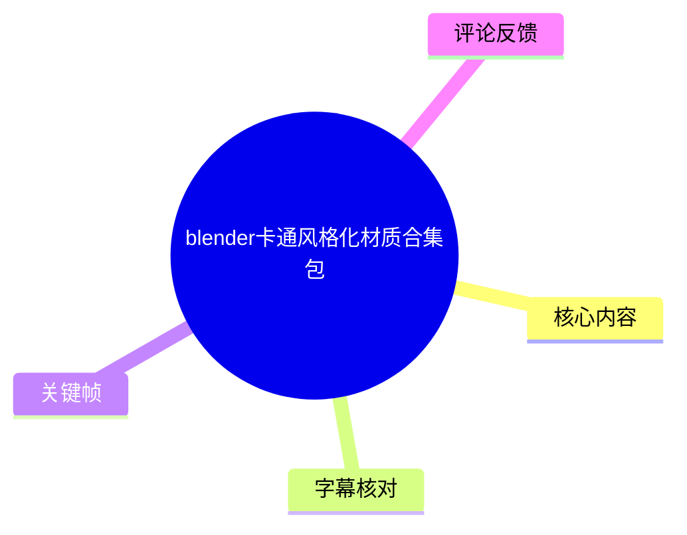
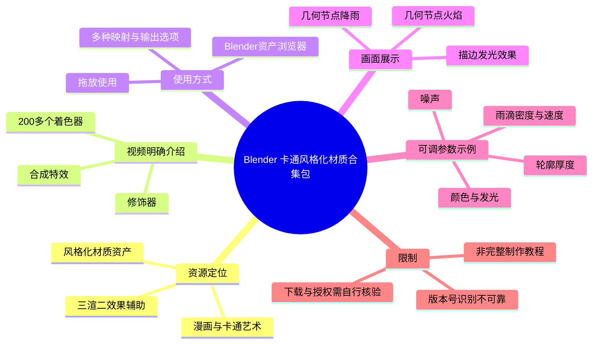
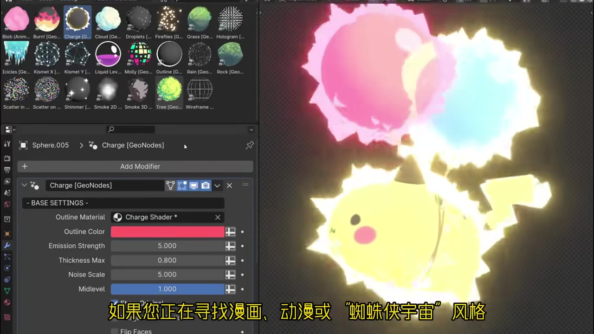
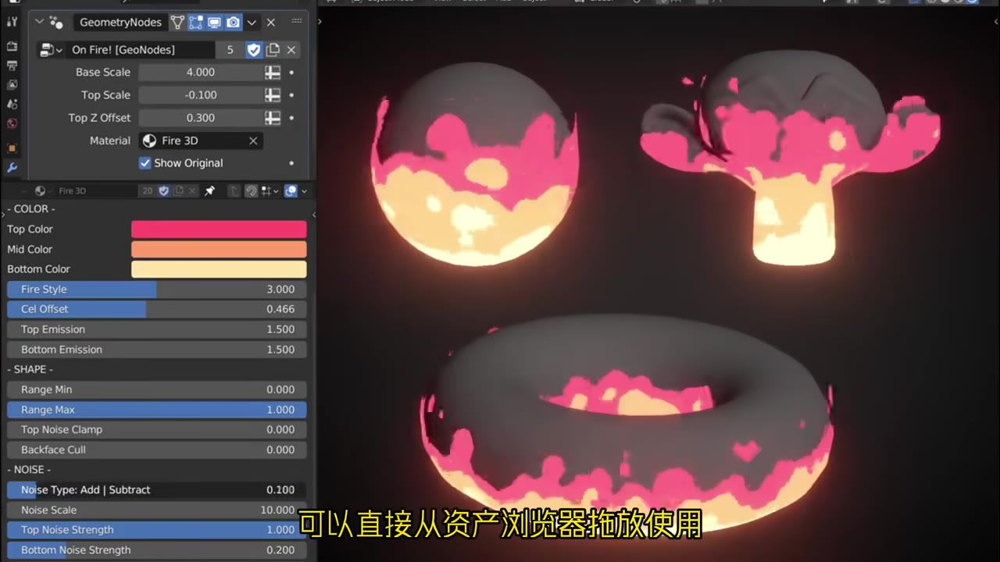
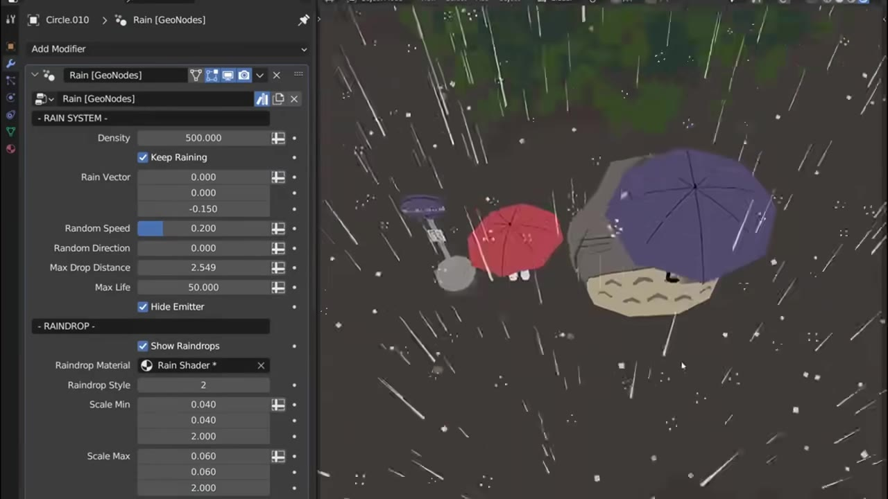
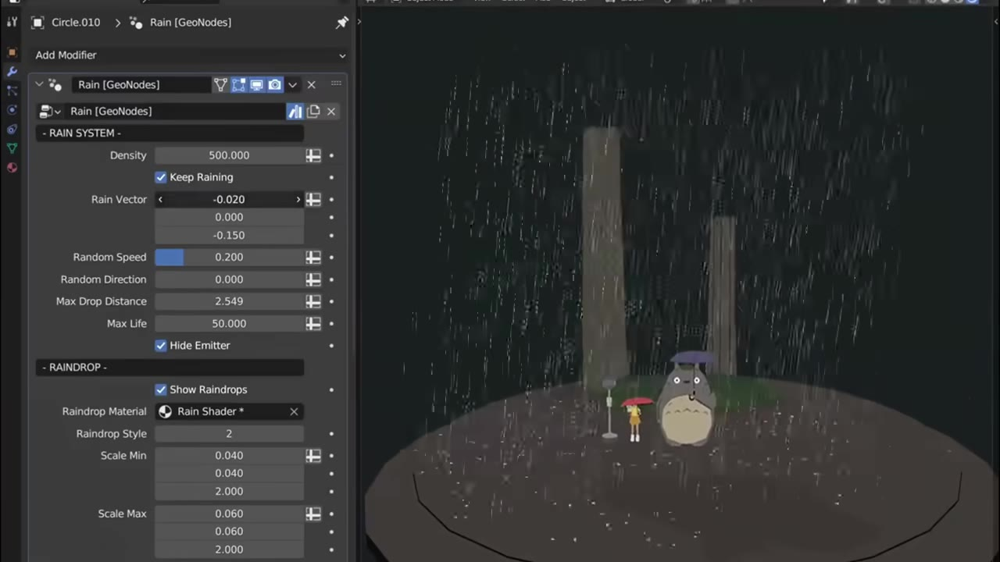

# blender卡通风格化材质合集包

> 来源：[Bilibili 视频](https://www.bilibili.com/video/BV1ctCJYBEnC) 
> UP 主：帕可模型库｜发布时间：2024-12-27｜视频时长：02:06｜分辨率：1920×1080  
> 视频简介提供下载地址：[飞书知识库链接](https://bcntp0hpfn1n.feishu.cn/wiki/OfyxwSvm5ivlNlkohpvc4vzqnYc?from=from_copylink)

## 小结

这是一支约 2 分钟的 Blender 风格化材质资产包展示视频。UP 主介绍该资源包包含 **200 多个着色器、修饰器及合成特效相关资产**，用途是辅助创建漫画、动漫及“蜘蛛侠宇宙”式的卡通／非真实感渲染效果。

视频明确强调的工作流是：资产可在 Blender 的**资产浏览器（Asset Browser）中拖放使用**；每种着色器还带有多种映射与输出选项。画面展示表明，资源不仅涉及物体表面着色，也覆盖了基于几何节点的轮廓、火焰、降雨等效果。

最值得关注的并非单一材质参数，而是其“预设化资产”思路：用户在场景中应用资产后，再通过暴露的控制项调整颜色、发光、轮廓厚度、噪声、密度、速度等参数，以快速得到风格化特效。示例画面可见火焰和雨效均以 Geometry Nodes（几何节点）修改器形式出现。

该视频更接近**资源推荐与效果演示**，不是从零搭建节点树的完整教程。它适合已经会在 Blender 中导入／管理资产，并希望快速制作三渲二、卡通场景、漫画特效的用户；初学者仍需自行补足资产库配置、材质分配、渲染与场景灯光等基础知识。

版本兼容性是关键限制。字幕与 ASR 对 Blender 版本的识别均存在明显误差：站内字幕写作“EV4”，ASR 写作“1B40”，均不能直接视为可靠版本号。视频可以确认其声称可在 Blender 的某个版本环境运行，但**无法仅依据现有素材严谨确认具体版本**，下载前应以资源页说明和当前 Blender 版本实测为准。

资源可用性具有时效性：视频发布于 2024-12-27，简介中的飞书下载页、资产内容、兼容版本和授权条件都有可能在之后变动；本整理未对下载链接可访问性、文件内容、授权范围及“200+”的逐项清单进行外部验证。

## 思维导图

## 目录

- [资源定位与适用场景](#资源定位与适用场景)
- [资产内容与工作流](#资产内容与工作流)
  - [资源规模、目标风格与资产浏览器](#资源规模目标风格与资产浏览器)
  - [关键帧：描边与高亮能量效果](#关键帧描边与高亮能量效果)
  - [关键帧：火焰几何节点效果](#关键帧火焰几何节点效果)
  - [关键帧：雨效几何节点效果](#关键帧雨效几何节点效果)
- [可复用的实践步骤与参数观察](#可复用的实践步骤与参数观察)
- [版本、资源与时效性限制](#版本资源与时效性限制)
- [字幕比对](#字幕比对)
- [评论分析](#评论分析)
- [处理记录](#处理记录)

## 资源定位与适用场景 [00:00](https://www.bilibili.com/video/BV1ctCJYBEnC?t=0)

视频开头将该内容定位为一套 Blender 风格化材质资产。站内字幕的有效信息覆盖 00:00.080–00:25.315，介绍了资源类别、使用目标和基本调用方式。

视频陈述的资源构成包括：

- **200 多个着色器**；
- **修饰器**；
- **合成特效**；
- 面向漫画与卡通风格艺术创作的资产集合。

其中，“蜘蛛侠宇宙风格”是视频用来描述目标美术方向的参照，不等于该资源与任何具体影视 IP 存在官方关联或授权关系。基于画面，较稳妥的理解是：它面向高饱和配色、明显轮廓、分层色块、发光及图形化天气效果等风格化视觉需求。

视频元数据标签中的“特效、3D、材质、卡通、风格化、三渲二、Blender、描边、着色器”也与这一定位一致；但标签只是发布者或平台元数据，不能代替资源包的完整功能说明。

## 资产内容与工作流 [00:02](https://www.bilibili.com/video/BV1ctCJYBEnC?t=2)

### 资源规模、目标风格与资产浏览器 [00:02](https://www.bilibili.com/video/BV1ctCJYBEnC?t=2)

根据站内字幕，视频在 00:02.860–00:09.290 说明资源包含“200 多个着色器、修饰、合成特效”，并称其用于创建漫画及卡通风格艺术。00:09.290–00:15.950 则点出漫画、动漫及蜘蛛侠宇宙式的风格目标。

在 00:18.750–00:20.910，视频说明资产可“直接从资产浏览器拖放”。这意味着其预期使用方式并非仅复制单个节点，而是把已注册为 Blender Asset 的项目拖入当前文件或场景。对于用户而言，资源包是否能顺利调用，通常取决于以下前置条件：

1. 已将资源文件夹正确添加到 Blender 的资产库路径；
2. 当前 Blender 版本能够读取该资产使用的节点、材质或修改器；
3. 拖入对象后，为其指定正确的目标物体、材质槽或几何节点上下文；
4. 在当前渲染器、灯光与色彩管理设置下检查最终效果。

以上四项是根据 Blender 资产浏览器的一般操作逻辑归纳的实践检查项，并非视频逐步演示的操作教程。

### 关键帧：描边与高亮能量效果 [00:09](https://www.bilibili.com/video/BV1ctCJYBEnC?t=9)

> 图：左侧可见 Blender 资产浏览器中的多个风格化资产缩略图；下方为名为 `Charge [GeoNodes]` 的修改器面板，右侧展示带高亮边缘、色彩团块和卡通角色的能量效果。该图的价值在于直观证明视频所称“资产浏览器拖放”与“风格化特效”并非抽象描述，而是以可调用资产和参数面板的形式出现。

该帧中可辨认的 `Charge [GeoNodes]` 参数包括：

| 面板项目 | 画面可见值 | 可确认含义 |
| --- | ---: | --- |
| Outline Material | `Charge Shader` | 指定轮廓材质 |
| Outline Color | 粉红色 | 控制轮廓颜色 |
| Emission Strength | `5.000` | 控制发光强度 |
| Thickness Max | `0.800` | 控制最大轮廓厚度 |
| Noise Scale | `5.000` | 控制噪声尺度 |
| Midlevel | `1.000` | 面板中的中间层级参数 |

这些数值是该展示帧中的当前示例值，不能据此推断为所有资产的默认值或推荐值。它们说明此类效果可通过材质引用、颜色、发光、厚度和噪声进行艺术化调节。

### 关键帧：火焰几何节点效果 [00:18](https://www.bilibili.com/video/BV1ctCJYBEnC?t=18)

> 图：左侧是 `On Fire! [GeoNodes]` 修改器与 `Fire 3D` 材质参数，右侧展示球体、树状物体和环形物体上的卡通火焰。该图说明资产不仅可产生一种固定火焰，而是能够适配不同基础几何体。

画面中的火焰效果采用大面积粉红、橙黄与浅色高光色块，体现出卡通化而非物理真实火焰的风格。可辨认的参数包括：

| 分组 | 参数 | 画面可见值 |
| --- | --- | ---: |
| 修改器 | Base Scale | `4.000` |
| 修改器 | Top Scale | `-0.100` |
| 修改器 | Top Z Offset | `0.300` |
| 修改器 | Show Original | 已勾选 |
| 颜色 | Fire Style | `3.000` |
| 颜色 | Cel Offset | `0.466` |
| 颜色 | Top Emission | `1.500` |
| 颜色 | Bottom Emission | `1.500` |
| 形状 | Range Min | `0.000` |
| 形状 | Range Max | `1.000` |
| 噪声 | Noise Type: Add \| Subtract | `0.200` |
| 噪声 | Noise Scale | `10.000` |
| 噪声 | Top Noise Strength | `1.000` |
| 噪声 | Bottom Noise Strength | `0.200` |

其中 `Show Original` 已勾选，表明示例中保留了原始物体；然而，具体勾选后对各类模型的视觉结果仍需在实际项目中测试。

### 关键帧：雨效几何节点效果 [00:20](https://www.bilibili.com/video/BV1ctCJYBEnC?t=20)

> 图：左侧为 `Rain [GeoNodes]` 的雨系统控制面板，右侧是在卡通角色与雨伞场景中应用后的雨线和雨滴效果。该图展示了降雨资产同时包含分布、运动和材质相关控制。

> 图：相同雨效被应用在更完整的夜景场景中，画面可见前景地面、角色、树木和大范围降雨。该图的价值在于说明特效的观感会随场景尺度、背景明暗和镜头构图改变，不能只依据局部预览判断效果。

雨效帧中可辨认的控制项如下：

| 分组 | 参数 | 画面可见值／状态 |
| --- | --- | ---|
| Rain System | Density | `500.000` |
| Rain System | Keep Raining | 已勾选 |
| Rain System | Rain Vector | `0.000`、`0.000`、`-0.150` |
| Rain System | Random Speed | `0.200` |
| Rain System | Random Direction | `0.000` |
| Rain System | Max Drop Distance | `2.549` |
| Rain System | Max Life | `50.000` |
| Rain System | Hide Emitter | 已勾选 |
| Raindrop | Show Raindrops | 已勾选 |
| Raindrop | Raindrop Material | `Rain Shader` |
| Raindrop | Raindrop Style | `2` |
| Raindrop | Scale Min | `0.040`、`0.040`、`2.000` |
| Raindrop | Scale Max | `0.060`、`0.060`、`2.000` |

这里的三分量数值应理解为画面中显示的向量或三轴尺度字段；现有素材没有说明它们分别对应哪个坐标轴或单位，因此不应擅自扩展解释。`Hide Emitter` 已勾选也提示：生成雨滴的发射几何体可以在最终画面中隐藏，从而只保留雨效本身。

## 可复用的实践步骤与参数观察 [00:18](https://www.bilibili.com/video/BV1ctCJYBEnC?t=18)

视频没有逐项展示安装与配置过程，以下流程依据视频明确展示的“资产浏览器拖放”、几何节点面板及画面可见参数整理，适合作为实际试用时的检查顺序：

1. **确认资源来源与文件说明**  
   从视频简介提供的飞书链接进入资源页，先核对资源版本、适用 Blender 版本、安装方式、授权条件及是否包含依赖文件。视频本身没有展示这些细节。

2. **将资源纳入 Blender 资产浏览器**  
   视频明确称可从资产浏览器拖放使用。实际操作前，应确认资源所在目录已被 Blender 识别为资产库；若资产缩略图未出现，应优先检查路径配置和资源文件的资产标记状态。

3. **根据目标选择资产类别**  
   - 需要角色或物体周围的图形化能量／描边时，可关注 `Charge [GeoNodes]` 类效果；
   - 需要卡通火焰时，可关注 `On Fire! [GeoNodes]`；
   - 需要场景级天气氛围时，可关注 `Rain [GeoNodes]`；
   - 资产浏览器画面还显示有云、草、全息图、液体、烟雾、线框等名称或缩略图，但视频未逐项说明其功能和参数，不能将其视为完整清单。

4. **拖放后先核查资产类型与附着对象**  
   对展示中的火焰、雨效和能量效果而言，画面都出现了 Geometry Nodes 修改器。因此拖放后应确认：该资产是添加了修改器、分配了材质，还是同时创建了新的辅助对象。不同资产的调用上下文可能不同，不能一概而论。

5. **先调整构成风格的高影响参数**  
   按画面可见控件，建议优先检查：
   - 描边效果：轮廓颜色、发光强度、最大厚度、噪声尺度；
   - 火焰效果：基础／顶部尺度、顶部偏移、三段颜色、赛璐珞偏移、噪声强度；
   - 雨效：密度、雨向量、随机速度、最大距离、寿命、雨滴尺度和雨滴材质。

6. **在完整镜头中而非局部预览中复核**  
   两张雨效关键帧表明，同一参数面板在局部角色场景与广角夜景中会呈现不同的可读性。应在最终镜头距离、背景亮度和场景尺度下检查雨线密度、发光溢出、轮廓粗细及噪声颗粒是否合适。

7. **输出前检查性能与渲染一致性**  
   视频声称可在某个 Blender 版本运行，但未展示性能数据、渲染时间、显存占用、Cycles／Eevee 的具体差异及烘焙要求。因此复杂场景中应自行测试视口流畅度、渲染器兼容性和最终输出稳定性。

## 版本、资源与时效性限制 [00:20](https://www.bilibili.com/video/BV1ctCJYBEnC?t=20)

### 可确认与不可确认的信息边界

| 项目 | 结论 | 依据与限制 |
| --- | --- | --- |
| 资源规模 | 视频称包含 200 多个着色器、修饰和合成特效资产 | 属于视频口述，未取得完整资产清单逐项验证 |
| 使用入口 | 可从 Blender 资产浏览器拖放 | 站内字幕明确陈述，关键帧也显示资产浏览器 |
| 参数可调性 | 每种着色器有多种映射和输出选项 | 视频口述；关键帧进一步显示具体数值控件 |
| 效果类别 | 可见描边／能量、火焰和降雨等效果 | 由关键帧直接可见 |
| Blender 版本 | 无法可靠确定具体版本号 | 站内字幕“EV4”与 ASR“1B40”均疑似识别错误 |
| 渲染器 | 未能确认 | 字幕与画面未明确写出 Eevee、Cycles 或其他渲染器 |
| 性能开销 | 未能确认 | 无帧率、渲染时长、显存或节点复杂度数据 |
| 下载内容与授权 | 未验证 | 简介仅给出飞书链接，现有素材未包含下载页详情 |

### 时效性说明

- 视频发布时间为 **2024-12-27**；本次抓取元数据显示 `fetchedAt` 为 **2026-08-01**。播放、收藏、点赞等统计数据只应视为该抓取时点的快照：播放 5,297、收藏 945、点赞 316、投币 95、评论 4。
- 视频简介中的下载链接在未来可能失效、迁移、更新内容或调整访问权限。
- Blender 的资产浏览器机制、几何节点接口和渲染器行为会随版本迭代变化。尤其是本视频版本号字幕不可靠时，不能据此承诺兼容性。
- 视频在约 00:25 后没有提供可用的连续语音转写内容；站内字幕另在 01:48.180–01:50.680 出现单独的“578”，但其语义、指代及画面上下文均无法确认，因此不纳入功能结论。

## 字幕比对 [00:00](https://www.bilibili.com/video/BV1ctCJYBEnC?t=0)

| 字幕来源 | 完整性 | 专有名词 | 时间轴 | 主要问题 |
| --- | --- | --- | --- | --- |
| Bilibili 站内字幕 `p01-ai-zh.srt` | 覆盖开场主要口述，另有一条 01:48 的孤立文本；未覆盖整支展示段 | `blender`、资产浏览器等基本可读；“EV4”疑似版本号误识 | 有真实分段时间轴，00:00.080–00:25.315 | 分句存在语法问题；版本词不可靠；01:48 的“578”无上下文 |
| 本次 ASR `large-v3-turbo` | 仅 1 段，00:00–00:24.540；语音覆盖率 19.6% | `Blender`识别正确；“1B40”“资层浏览器”“着色系”等错误明显 | 有时间轴，但整个开场被合并成单段 | 缺少断句；“资产”误作“资厂”；版本号、资产浏览器、着色器等词识别不稳定 |

### 最终字幕选择与校正

本整理以**站内时间轴字幕作为主字幕依据**，原因是它有较细的有效分段，可支持 00:00–00:25 的时间轴链接；同时对本次 ASR 进行了强制检查，并以其确认开场确有连续中文语音、内容主题与站内字幕大体一致。

本次 ASR 结果中**没有** `noAudioStream=true` 标记，且诊断显示识别到 24.54 秒语音，因此不能将后续信息不足归因于“源视频没有音轨”。现有 ASR 只识别出开场一句长段，视频后续主要应结合关键帧的 Blender 界面和多模态画面理解。

通过站内字幕、ASR 与关键帧交叉校正后，采用如下表述：

- `资层浏览器`／`资产浏览器`：校正为 **Blender 资产浏览器**；
- `着色系`：校正为 **着色器**；
- `资厂`：校正为 **资产**；
- 站内字幕的 `EV4` 与 ASR 的 `1B40`：均不作为确切版本名引用，统一表述为“视频声称可在某个 Blender 版本运行，具体版本待资源页核验”；
- `Charge [GeoNodes]`、`On Fire! [GeoNodes]`、`Rain [GeoNodes]`、`Fire 3D`、`Rain Shader`：来自关键帧中可见 Blender UI，按画面拼写记录。

## 评论分析 [01:48](https://www.bilibili.com/video/BV1ctCJYBEnC?t=108)

仅获取到热评前三条，评论总量较少，且均为支持性反馈，未提供可验证的技术补充、安装经验或兼容性结论。

1. **是是幺心啊**（1 赞）：“已关注！等学建模时用[doge]”  
   - 观点：表达对资源和 UP 主的关注，并计划在未来学习建模时尝试使用。  
   - 补充信息：无。  
   - 可信度与边界：这是用户的使用意愿，不代表其已下载、安装或验证过资源效果。

2. **Amartoros**（0 赞）：“好用心的视频！”  
   - 观点：肯定视频制作。  
   - 补充信息：无关于资产质量、版本、性能或下载可用性的事实信息。  
   - 可信度与边界：属于主观评价，不能据此推导资源包的技术成熟度。

3. **账号已注销**（0 赞）：“UP主加油！”  
   - 观点：对发布者的鼓励。  
   - 补充信息：无。  
   - 可信度与边界：不构成技术反馈或使用验证。

## 处理记录 [00:00](https://www.bilibili.com/video/BV1ctCJYBEnC?t=0)

- **Worker ID**：`worker-msaeho0y-365b05fe`
- **模型**：`gpt-5.6-terra`
- **ASR 模型**：`large-v3-turbo`，语言识别为中文，语言概率 `0.998046875`，运行设备为 CUDA，计算类型为 `int8_float16`。
- **使用的素材与工具产物**：视频合并文件 `merged.mp4`、音频 `audio/audio.wav`、关键帧目录 `frames/`、ASR 结果 `asr/asr-result.json`、ASR SRT `asr/transcript.srt`、站内字幕 `p01-ai-zh.srt`、评论数据 `comments/comments.json`。
- **字幕选择**：以站内字幕为主，因为其拥有 00:00.080–00:25.315 的细分真实时间轴；ASR 已核查并用于交叉验证开场主题，但其仅输出 00:00–00:24.540 的单一长段，且专有名词误识较多。
- **音轨检查**：ASR 结果未标记 `noAudioStream=true`；诊断记录到 24.54 秒语音、语音覆盖率 19.6%。因此采用“站内字幕 + ASR + 关键帧多模态画面”整理，而非将识别信息不足误判为工具失败。
- **关键帧选择依据**：选择 `frame-001.jpg`、`frame-002.jpg`、`frame-003.jpg`、`frame-004.jpg`，因为它们分别直接呈现资产浏览器与 `Charge [GeoNodes]`、`On Fire! [GeoNodes]`、`Rain [GeoNodes]` 的可见 UI 参数，以及雨效在不同场景尺度中的结果；这些画面能支撑正文关于资产形态、参数可调性和场景效果的陈述。
- **缓存清理**：提供的素材清单没有给出缓存清理执行记录；为避免编造，无法确认是否已清理缓存。
- **未解决问题**：未取得资源下载页的具体内容；未验证完整资产清单、确切 Blender 版本、渲染器兼容性、性能成本、授权许可和下载链接当前可用性。

## 评论分析

- 热评 1：已关注！等学建模时用[doge]
- 热评 2：好用心的视频！
- 热评 3：UP主加油！

以上内容是观众反馈摘录，只用于补充理解视频反响，不作为正文事实依据。
