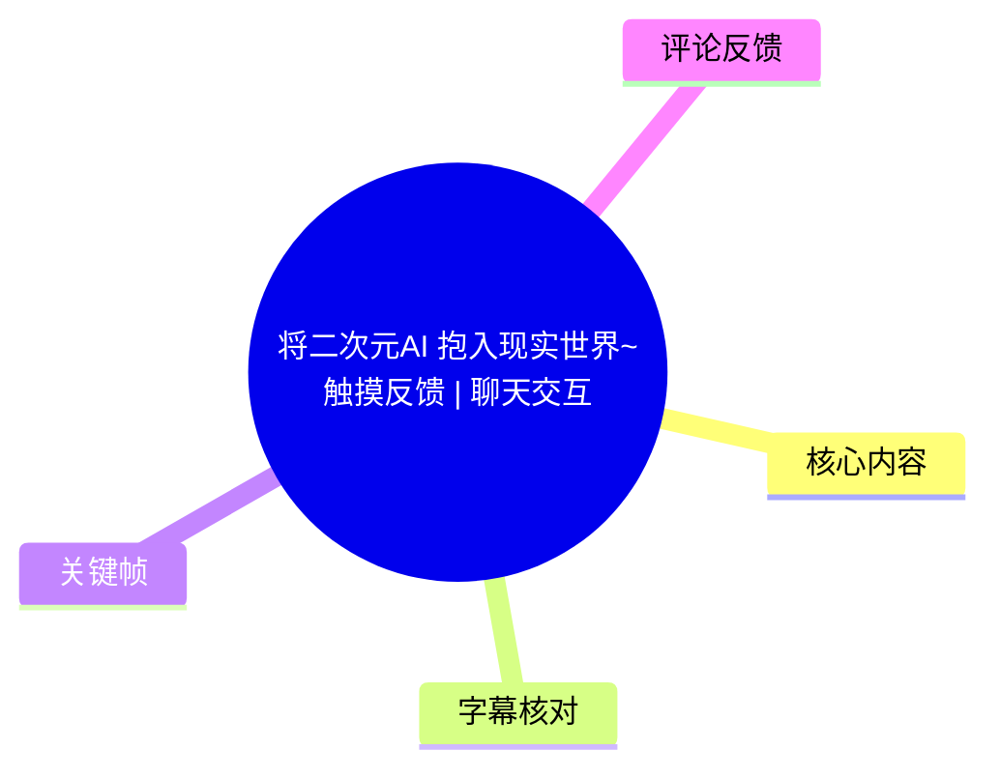
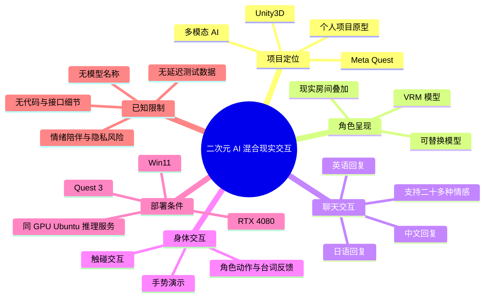
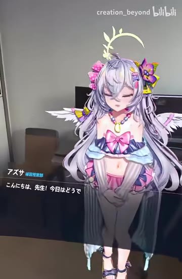
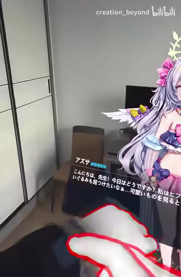

# 将二次元AI 抱入现实世界~触摸反馈 | 聊天交互

> 来源：[Bilibili 视频](https://www.bilibili.com/video/BV1Uw6JYyE2c)  
> UP 主：creation_beyond｜发布时间：2024-12-31｜时长：09:18  
> 项目说明：个人项目，基于 Unity3D 与 Meta Quest 开发，结合多模态 AI；演示实时情感聊天、触摸/手势交互与 VRM 模型替换。

## 小结

视频展示了一个将二次元 VRM 角色叠加到现实房间中的 AI 交互原型。画面以 Meta Quest 的混合现实视角呈现：虚拟角色站在真实室内环境中，可以和用户进行日语、中文、英语聊天，并对用户的触摸或手势操作作出动作、表情或台词反馈。

项目的核心并不只是“显示一个虚拟角色”，而是把**角色模型、空间环境、多语言对话、情感表达与身体交互**组合进同一体验。ASR 在约 00:29 识别到“聊天功能支持 20 多种情感”的说明；后续演示通过日语、中文、英语轮流对话，体现系统至少支持多语言回复切换。

从素材可确认的技术栈包括 Unity3D、Meta Quest、VRM 模型与多模态 AI。UP 主在视频简介中给出的实际设备是 Win11 主机、RTX 4080 与 Quest 3；其经验性结论是：若把 AI 模型推理服务部署在**同一块 GPU 的 Ubuntu 服务器**上，可达到“说完话即刻应答”的主观实时体验。该说法是作者在特定软硬件条件下的描述，并非对所有设备、模型或网络环境的性能承诺。

视频适合关注 Unity/VR 开发、VRM 虚拟角色、AI 陪伴交互和混合现实产品原型的人阅读。它是功能演示而非完整教程：没有公开模型名称、提示词、服务接口、代码架构、延迟测试数据、Quest 端部署方式或触摸识别算法，因此不能据此直接复现完整项目。

时效上，本视频发布于 2024-12-31；所展示的是当时的个人原型与设备组合。AI 推理模型、Meta Quest 系统能力、Unity/VRM 生态及部署成本均可能已经变化。视频页面抓取时的互动数据为播放约 55 万、点赞约 11 万、收藏约 4.7 万，反映其受关注程度，不构成功能质量或安全性的验证。

## 思维导图

## 目录

- [项目背景与已知条件](#项目背景与已知条件-0003)
- [混合现实角色的初始呈现](#混合现实角色的初始呈现-0003)
- [多语言、情感聊天演示](#多语言情感聊天演示-0029)
  - [日语对话](#日语对话-0037)
  - [中文切换](#中文切换-0208)
  - [英语切换](#英语切换-0403)
- [手势与触碰交互](#手势与触碰交互-0553)
- [实现路径：素材可确认的步骤与参数](#实现路径素材可确认的步骤与参数-0008)
- [结论、限制与时效性](#结论限制与时效性-0912)
- [字幕比对](#字幕比对)
- [评论分析](#评论分析)
- [处理记录](#处理记录)

## 项目背景与已知条件 [00:03](https://www.bilibili.com/video/BV1Uw6JYyE2c?t=3)

这是一个面向沉浸式角色陪伴交互的个人项目展示，而非财经、新闻或泛 AI 行业资讯视频。视频开头角色以日语“おかえり先生”（可理解为“欢迎回来，老师”）迎接用户，迅速建立了“用户与角色直接交流”的使用情境。

依据视频简介，可以确认以下项目条件：

| 类别 | 素材中可确认的信息 |
| --- | --- |
| 客户端/引擎 | Unity3D |
| 头显设备 | Meta Quest；简介具体写明 Quest 3 |
| 主机环境 | Win11 |
| GPU | RTX 4080 |
| 角色模型 | 支持 VRM 模型替换 |
| AI 特征 | 多模态 AI、实时情感聊天 |
| 交互形式 | 语音/聊天、手势、触摸反馈 |
| 作者给出的低延迟条件 | AI 推理服务部署到同 GPU 的 Ubuntu 服务器时，可“说完话即刻应答” |

这里的“同 GPU Ubuntu 服务器”只能理解为作者描述的一种部署配置：推理任务与所用 GPU 处于同一硬件资源条件下。简介没有交代是双系统、局域网服务器、容器、远程调用，还是其他架构；也没有提供模型参数、上下文长度、语音识别与语音合成方案，不能补充推断。

## 混合现实角色的初始呈现 [00:03](https://www.bilibili.com/video/BV1Uw6JYyE2c?t=3)

开场的关键价值在于展示“虚拟角色进入现实空间”的视觉效果。角色并非置于纯虚拟场景，而是被渲染在真实室内、桌面和显示器前方；这使用户可以在熟悉的物理环境中与角色进行视线、距离和身体动作层面的互动。

> 图：角色以近景出现在真实房间画面中，头顶有汗滴样式的情绪符号。该帧说明项目不仅渲染角色模型，还以图形化符号辅助传达情绪状态，是“情感聊天”视觉反馈的一部分。

> 图：全身角色站在现实室内，画面左下角出现日语对话字幕，角色名显示为“アズサ”。该帧有助于理解角色、现实背景与对话 UI 同时存在的混合现实构图；视频标签中也包含“白洲梓”，但素材未公开角色授权、模型来源或版权处理信息。

视频在约 00:08 处出现“简单演示一下……效果”的 ASR 片段，虽其中个别汉字识别不稳定，但结合画面可确认此段是总体效果展示。不能仅凭这段 ASR 判断其使用了特定空间定位、遮挡、手部追踪或深度感知 API；这些实现细节未提供。

## 多语言、情感聊天演示 [00:29](https://www.bilibili.com/video/BV1Uw6JYyE2c?t=29)

ASR 在 00:29—00:34 识别到“演示聊天功能，支持 20 多种情感，首先演示……回复”。其中“予以”等个别词语存在混杂识别，但“聊天功能”“20 多种情感”“演示回复”可与后续角色表情、台词和语言切换相互印证。

这一段展示的交互链条可以概括为：

1. 用户以某种输入方式向角色提出话题或表达情绪；
2. 系统生成目标语言的角色回复；
3. 角色在现实空间中显示台词，并配合表情、姿态或头顶图标；
4. 用户更换语言或提出新的关系性话题；
5. 角色继续以设定化人格作答。

“支持 20 多种情感”是视频中的功能宣称，但素材没有列出具体情感类别，也没有给出情绪分类标准、触发阈值、模型准确率或异常回复处理机制。因此可确认其展示了情感化表现，不能确认其情绪识别或情感状态机的具体实现质量。

### 日语对话 [00:37](https://www.bilibili.com/video/BV1Uw6JYyE2c?t=37)

演示先以日语进行。角色在 00:37 说出“こんにちは”（你好），随后围绕当天状态、与“ひふみ”学习、寻找毛绒玩偶等内容继续回应。ASR 日语识别概率为 0.738，且部分名词存在错字或连写，因此以下只保留可辨认的对话主题，不将不清晰转写视为准确台词。

可辨认的交互内容包括：

- 用户询问角色当天状态；
- 角色说计划与“ひふみ”一起学习，并提及想寻找毛绒玩偶；
- 角色表达对学习和成绩的紧张；
- 用户继续讨论“和我在一起”的感受；
- 角色作出亲密、积极的陪伴型回应。

> 图：画面中可见用户前景中的手部/控制器区域，角色位于现实房间内，左下角为日语对话文字。该帧的价值是同时呈现用户视角、空间中的角色位置与对话输出，说明交互不是静态立绘播放。

在 01:35—01:58，角色的日语回复表达了紧张、期待以及希望通过可爱的毛绒玩偶缓解压力等内容。这一示例表明对话生成会延续前文话题，但不能据此证明系统具有长期记忆、角色设定数据库或可靠的情感理解能力。

### 中文切换 [02:08](https://www.bilibili.com/video/BV1Uw6JYyE2c?t=128)

00:02:08—00:02:09 的 ASR 为“……中文”，结合紧接着的中文用户输入和中文角色回复，可以确认此处在演示切换为中文回复。

用户在 02:13 说“不用紧张”。角色随后以中文回答，大意是感谢老师关心、会努力放松，但在学习时仍可能感到紧张，并希望找到可爱的毛绒玩偶缓解压力；这些内容延续了前面的日语话题。

这段演示提供了两项可确认信息：

- 系统至少展示了中文生成/播报或文本回复能力；
- 同一聊天主题在语言切换后仍被用于回复内容，表现出短上下文连续性。

但素材没有说明“切换”发生在语言识别层、提示词层、模型层还是语音合成层；也没有展示中文识别失败、网络中断或敏感内容下的回退策略。

### 英语切换 [04:03](https://www.bilibili.com/video/BV1Uw6JYyE2c?t=243)

04:03—04:04 的 ASR 明确识别为“切换至英语回复”。用户随后问“关于玩偶你有什么想说的吗”，角色于 04:26 起用英语回答，内容包括：

- 喜欢毛绒玩偶；
- 认为某系列玩偶可爱、柔软；
- 会收集新玩偶；
- 觉得玩偶像有各自的小个性；
- 与“haifumi/ひふみ”分享玩偶会更开心；
- 反问用户是否有喜欢的毛绒玩偶。

其中系列名称被 ASR 识别为“mono friend series”，并不稳定，不能当作准确的商品、IP 或角色设定名称。

在 05:12，用户以中文表示“不喜欢玩偶，我喜欢你”。角色在 05:22—05:47 使用日语作出正向且较亲密的回应，表达很高兴、喜欢与老师待在一起、希望变得更加亲近。这展示了系统可能允许“输入语言”和“回复语言”不完全一致，也体现出陪伴型角色会对关系性表达给出拟人化回应。

> 图：角色全身处于真实室内，闭眼微笑，头顶出现汗滴样符号，左下角叠加对话区域。该帧用于说明语言回复之外还存在可见的表情/情绪符号反馈；但单帧不足以证明符号与特定情绪标签之间存在固定映射。

## 手势与触碰交互 [05:53](https://www.bilibili.com/video/BV1Uw6JYyE2c?t=353)

05:53—05:56 的 ASR 包含“演示手势功能”，随后角色再次以“おかえり先生”回应。06:13—06:16 的 ASR 则包含“触碰交互功能”。这与视频标题中的“触摸反馈”以及简介中的“触摸手势交互”一致，因而可以确认手势和触碰均属于作者重点展示的功能。

约 06:36 起出现角色日语台词，例如“これ、偽装にもならないし、防備としても頼りない”（大意：这既算不上伪装，作为防备也靠不住）以及后续“でも、なんでそんなにこっちを見てるんだ”“慣れてないから”。这些台词说明触碰或接近之后，角色会触发与当前动作相关的语音/文本内容；但以下关键技术问题均未在素材中说明：

- 输入是裸手手势、Quest 控制器、手部骨骼追踪，还是碰撞体点击；
- “触碰”检测的是手与角色哪个部位的接触；
- 是否有物理碰撞、触觉外设震动，或仅为视觉/语音反馈；
- “触摸反馈”是用户触摸角色后的角色反馈，还是用户能获得触觉反馈；
- 手势可识别的集合、阈值、误触处理和隐私数据处理方式；
- 角色的动作是否由预制动画、状态机、IK 或实时生成动作驱动。

因此，按照视频标题与简介，最稳妥的理解是：项目展示了**对手势/触碰输入作出角色侧反馈的交互能力**。若将其理解为“用户手部有物理触觉回馈”，则需要额外硬件或明确说明；当前素材不足以证实。

## 实现路径：素材可确认的步骤与参数 [00:08](https://www.bilibili.com/video/BV1Uw6JYyE2c?t=8)

视频没有给出可直接照抄的工程步骤，但从演示顺序和简介可以提炼出一个**素材支持范围内**的实现清单。以下不是原作者公开的完整教程或代码流程，而是对其已展示能力的部署要素整理。

### 1. 准备运行环境

| 要素 | 视频已知配置/要求 | 未披露部分 |
| --- | --- | --- |
| PC | Win11 | CPU、内存、Unity 版本 |
| 显卡 | RTX 4080 | 显存占用、驱动版本、并发能力 |
| XR 设备 | Quest 3 | 是否使用 Link、Air Link 或其他串流方式 |
| 引擎 | Unity3D | 渲染管线、XR 插件、目标平台 |
| 推理端 | 可部署至 Ubuntu 服务器 | 模型、API、容器、网络与鉴权方式 |

### 2. 加载并替换角色模型

简介明确写明“支持 VRM 模型替换”。在功能层面，这意味着项目需要能加载或预置 VRM 格式角色，并使其接入已有的动画、表情、语音和交互逻辑。

复现时至少要自行解决以下未公开环节：

1. VRM 导入与运行时加载方案；
2. 骨骼兼容、表情 BlendShape 映射；
3. 角色尺寸、站立位置和现实空间锚定；
4. 台词字幕与角色名称 UI；
5. 角色动作、情绪符号与回复状态的绑定。

视频没有提供角色模型文件，也没有说明模型是否可商用、是否来自原作角色改编，使用者不能默认拥有相应授权。

### 3. 接入多语言对话与情绪表达

演示顺序显示了日语、中文、英语回复，因此系统至少需要支持语言指定或语言切换。结合“20 多种情感”的功能宣称，合理的工程拆分应包含：

1. 获取用户输入；
2. 将输入连同角色设定、上下文和目标回复语言提交给 AI 服务；
3. 获得角色回复及可能的情绪标识；
4. 将文本显示到 MR 场景；
5. 使用语音、表情、动作或情绪图标呈现结果。

不过，**上述是对功能模块的抽象，而非视频披露的具体实现**。素材没有公布 LLM、TTS、ASR、视觉模型、情绪标签协议或提示词，不能将任何具体开源/闭源模型归因给作者。

### 4. 绑定手势和触碰触发器

从 05:53 后的演示可知，手势与触碰输入会参与角色交互。一个可复用的设计思路是将输入事件映射为角色状态或台词触发器，例如“接近”“注视”“触碰”“手势”对应不同反应。真正实现时仍需自行设计：

- 手部追踪可用性检测；
- 碰撞体范围与分区；
- 单次触发冷却时间；
- 触发时的动作、语音、字幕优先级；
- 多次触碰、误触和边界情况；
- 未成年人保护、内容过滤与会话退出机制。

这些均是实际产品化所需的工程与安全工作，并非视频已展示的配置参数。

### 5. 优化端到端响应时间

作者只给出了一个有条件的经验：将 AI 模型推理服务部署到**同 GPU 的 Ubuntu 服务器**，可以使用户说完话后“即刻应答”。可将其理解为减少推理链路等待的部署方向，而不能量化为固定延迟。

素材没有给出以下数据：

- 首 token 延迟；
- 完整回复延迟；
- ASR、LLM、TTS 各阶段耗时；
- 网络往返时间；
- GPU 利用率、显存用量；
- 并发用户数；
- 不同语言下的性能差异。

因此，任何“实时”的判断应以自己的设备、模型体积、网络拓扑和语音链路实测为准。

## 结论、限制与时效性 [09:12](https://www.bilibili.com/video/BV1Uw6JYyE2c?t=552)

视频在约 09:12 以“おかえり先生／ご視聴ありがとうございました”结束。其最有价值的部分，是把 AI 对话从平面聊天窗口转化为位于真实空间的角色体验：用户可以看见角色、使用不同语言交流，并通过手势与触碰引发可见的反馈。

可迁移的经验是：

- **体验层面**：角色对话、表情、动作与空间位置需要协同，才能形成“在场感”；
- **交互层面**：多语言切换与触碰反馈能丰富角色陪伴体验，但也会提高状态管理和内容安全难度；
- **部署层面**：若追求语音后迅速响应，推理端的 GPU 资源位置和链路延迟很关键；
- **资产层面**：VRM 可替换让角色资产更灵活，但模型骨骼、表情和版权问题必须单独处理。

同时应明确本视频的限制：

1. **不是完整教程**：没有工程文件、代码、接口、模型名、插件版本和部署命令。
2. **性能不可横向承诺**：RTX 4080、Quest 3、同 GPU Ubuntu 服务是作者环境，不等于其他设备也能实现相同响应速度。
3. **“触摸反馈”含义有限**：可确认角色会对触碰交互作出反馈，不能确认用户获得了专用触觉硬件的物理反馈。
4. **角色内容安全未展示**：视频中的亲密化回复属于演示场景，不代表系统对边界内容、依赖风险、诱导性内容或未成年人情境已有充分治理。
5. **版权与授权未说明**：视频标签指向特定二次元角色，模型、语音、角色设定及衍生使用的授权情况均未在素材中披露。
6. **信息具有时效性**：项目发布于 2024 年末；截至素材抓取时，软硬件和模型生态可能已经变化，部署前需核对当前 Unity、Quest、VRM 与 AI 服务的兼容性。

## 字幕比对

本任务提供的两份字幕存在明显冲突，必须以内容一致性和时间轴为基础选择。

| 字幕来源 | 完整性 | 专有名词/内容一致性 | 时间轴 | 主要问题 |
| --- | --- | --- | --- | --- |
| Bilibili 站内字幕 `p01-ai-zh.srt` | 覆盖约 00:01—08:38，表面上较连续 | 与本视频完全不符：内容是 A 股、白酒、上证指数、投资者“牛牛”等财经话题 | SRT 时间戳格式有效，但对应的不是本视频内容 | 疑似错配字幕，不能用于本文事实整理或章节定位 |
| 本次 ASR `large-v3-turbo` | 共 38 段，语音覆盖约 181.34 秒，占视频约 32.51%；存在 18 个较大静音/未识别间隔 | 与标题、视频简介和关键帧高度一致：欢迎语、20 多种情感、日/中/英切换、手势、触碰交互均能对应 | 具有逐段真实起止时间；首段 00:03.340，末段 09:13.500 | 自动识别语言判定为日语，中文、英语与日语混杂；部分人名、系列名和个别中文词识别不稳定 |

### 最终字幕选择

正文以**本次 ASR 的时间戳和内容**为主，因为其实际内容与视频主题、关键帧和简介一致。站内字幕虽然具有可用时间轴格式，但文本属于无关财经视频，已明确排除，不可作为本视频的事实依据。

本次 ASR 结果**未标记** `noAudioStream=true`，且识别诊断显示音频时长约 557.78 秒、存在实际语音段，因此源视频并非无音轨。ASR 覆盖率偏低主要可能与背景音乐、停顿、画面演示或混合语言识别有关；这是识别结果的客观限制，不应误写为“工具失败”。

经过画面、元数据和上下文校正后的处理原则：

- 画面左下角可见角色名“アズサ”；标签含“白洲梓”，因此正文仅将其描述为画面标注为“アズサ”的角色，不扩展未披露设定。
- “支持 20 多种情感”“切换中文/英语回复”“手势功能”“触碰交互功能”均采用 ASR 中有明确时间戳的片段。
- 对 ASR 中不稳定的名称，如“mono friend series”“haifumi”等，保留其不确定性，不擅自补写为确定专名。
- 关键帧用于验证“现实房间叠加角色”“字幕 UI”“用户手部进入场景”“角色表情图标”等视觉事实，不据单帧推断底层算法。

## 评论分析

以下仅分析可获取的热评前三条；评论代表用户观点，不应当作项目功能、安全性或商业前景已经被验证的事实。

### 1. 恋爱与世界定理同在｜6301 赞

> “大学专业想选人工智能，等以后尽可能造福各位啊”

这条评论表达了观众对 AI 技术和相关专业的积极期待，也反映出该项目对潜在开发者的吸引力。它没有提供有关 Unity、Quest、模型部署或项目复现的新增技术信息，因此属于愿景性反馈。

### 2. Risser_Taki｜4349 赞

> “我觉着如果我弄到了，我迟早这种大门不出二门不迈的，迟早在家里玩到精神分裂”

评论以夸张、玩笑化的方式指出沉浸式 AI 陪伴可能带来的过度使用风险：当虚拟互动足够便利、情绪反馈足够即时，部分用户可能减少现实社交或长时间沉浸其中。该观点并非对该项目造成心理伤害的事实指控，但提示开发者和用户应关注使用时长、现实社交、年龄分级与退出机制。

### 3. 虎大工业｜3111 赞

> “当高质量情绪价值获取变得如此容易，对男女关系会带来极大的变革。情绪价值本身是很值钱的，这个项目潜力无限，但是代码的加密一定要做好，防止被不法分子盯上”

这条评论提出两层观察：

1. 高质量、低门槛的情绪陪伴可能影响人际关系与消费行为；
2. 若项目具备商业价值，代码、模型接口、用户数据和内容资产需要安全保护。

其“潜力无限”“会带来极大变革”属于预测性评价，不能视为既成结论；但“代码加密”背后指向的安全问题值得具体化。实际产品不应只关注代码混淆或加密，还应考虑 API 鉴权、密钥管理、服务端权限控制、用户语音/影像数据最小化采集、日志脱敏、模型滥用防护和内容审核。

## 处理记录

- **Worker ID**：worker-msaei2qg-b29e21b6
- **整理模型**：gpt-5.6-terra
- **ASR 模型**：large-v3-turbo（CUDA，`int8_float16`，自动语言识别）
- **使用素材/工具输出**：视频元数据、视频简介、关键帧目录、站内 SRT、ASR SRT、ASR 分段诊断、热评前三条。
- **字幕选择**：检查了站内字幕与本次 ASR。站内 SRT 文本为无关的财经内容，判定为错配；采用内容与视频一致的本次 ASR 作为时间轴与正文主依据，并对不稳定词汇保留不确定性。
- **音轨检查**：ASR 结果未出现 `noAudioStream=true`；诊断显示存在音频与语音片段，因此未按“无音轨”路径处理。
- **关键帧选择依据**：选用 `frames/frame-001.jpg` 至 `frames/frame-004.jpg`，因为提供的画面分别直观呈现了角色在真实室内的叠加效果、对话字幕、用户手部进入交互视野及角色的情绪化视觉表现。关键帧未提供独立时间戳，故不将其作为章节精确时间依据；章节时间仅取自 ASR 的真实分段。
- **缓存清理**：提供的素材清单未包含缓存删除或清理日志，无法确认是否执行过缓存清理；本文不虚构清理结果。
- **未解决问题**：未提供 Unity 版本、XR 插件、VRM 导入方案、AI 模型与接口、语音链路、手势/触碰算法、延迟测试、模型授权和隐私安全方案；这些内容无法从现有素材补全。
