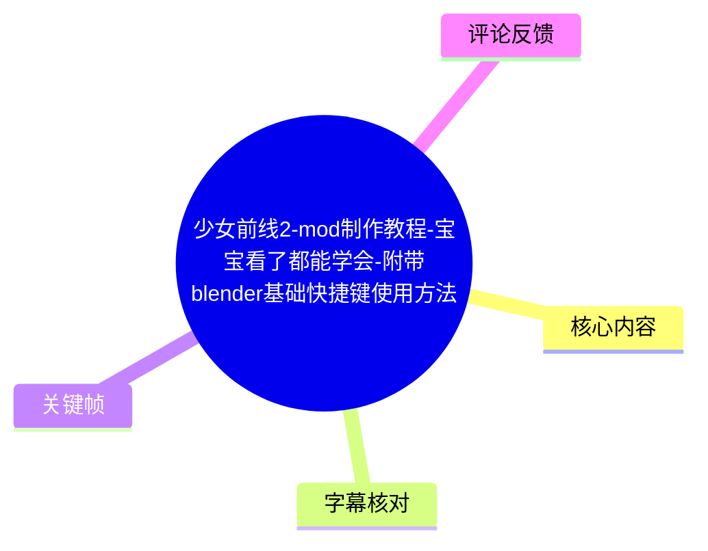
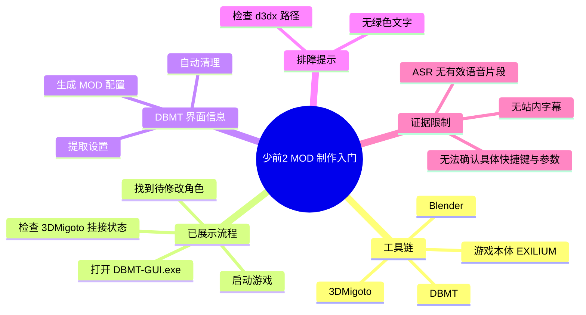
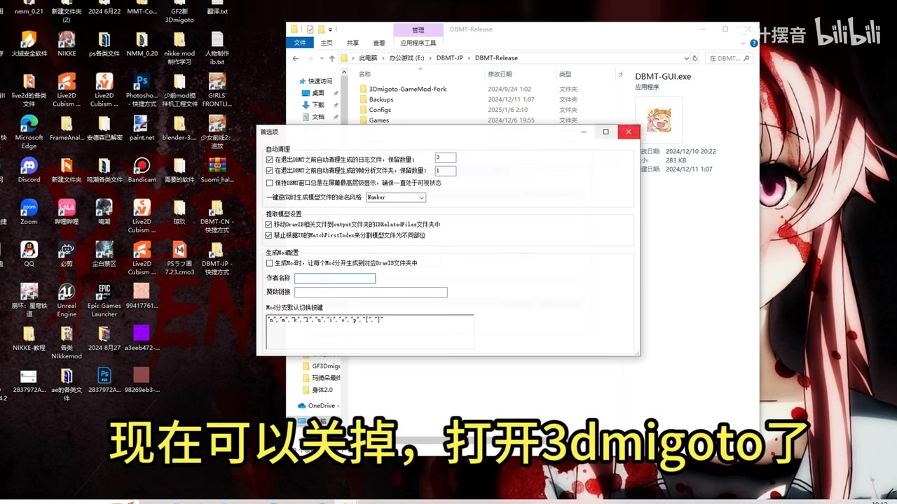
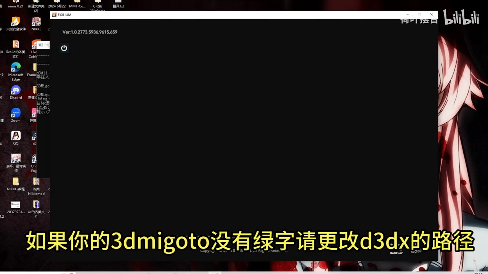
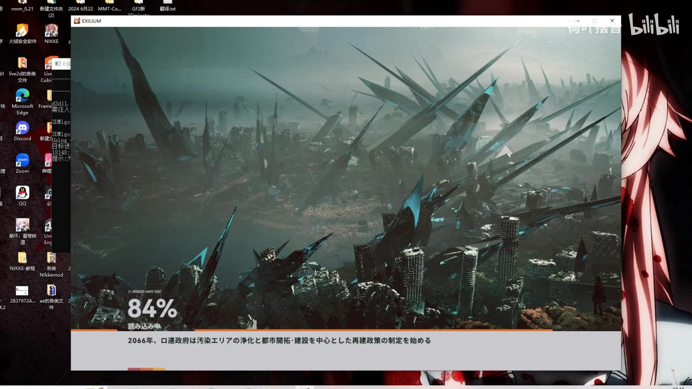
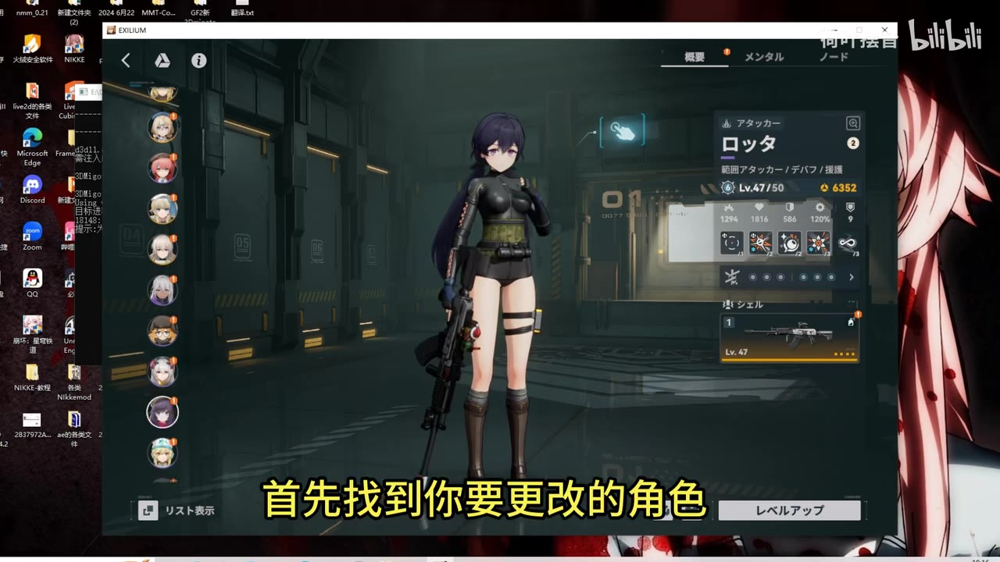

# 少女前线2-mod制作教程-宝宝看了都能学会-附带blender基础快捷键使用方法

> 来源：[Bilibili 视频](https://www.bilibili.com/video/BV1wzrLYoEFd)  
> UP 主：荷叶摆音｜发布时间：2025-01-06｜视频时长：13 分 01 秒（781 秒）  
> 视频简介提及：DBMT 作者为 `NicoMico_`；所需插件可在 [StarBobis 的 GitHub](https://github.com/StarBobis) 查找。

## 小结

本视频是一份面向《少女前线 2：追放》MOD 制作入门者的桌面录屏教程。根据可获取的画面，教程将 **DBMT 图形界面工具、3DMigoto 与游戏本体** 连接起来，演示从工具配置到进入角色界面、锁定待修改角色的基础流程。

画面明确展示了 DBMT-Release 目录中的 `DBMT-GUI.exe`，以及 DBMT 图形界面的“自动清理”“提取设置”“生成mod配置”等选项。这说明教程并非只讲 Blender 建模，而是涵盖了将模型修改最终导出、部署到游戏环境所需的工具链准备。

教程的关键前置条件是：3DMigoto 能够正确启动游戏并挂接到目标程序。视频画面中特别提示，若 3DMigoto 没有绿色文字，需要更改 `d3dx` 的路径；这属于启动/注入状态的排障提示，但素材未提供具体配置文件字段、路径示例或修改值，不能据此补全具体命令。

游戏侧演示使用了窗口标题为 `EXILIUM` 的程序，左上角可见版本字符串 `Ver:1.0.2773.5936.9615.659`。进入游戏角色界面后，画面字幕提示“首先找到你要更改的角色”，可确认角色选择是后续修改流程的起点。

标题声称附带 Blender 基础快捷键使用方法，但当前可用 ASR 没有识别出任何语音，且给出的关键帧未展示 Blender 界面或具体快捷键。因此，本文只记录这一内容属于视频标题所述范围，**不臆造快捷键列表、建模操作、导入导出参数或完整 MOD 文件结构**。

该视频发布于 2025 年 1 月；MOD 工具、游戏版本、注入方式和资源目录均可能随更新改变。尤其视频中可见的游戏版本仅代表录制时环境，不应直接视为当前版本仍可用的兼容性结论。

## 思维导图





## 目录

- [视频定位、工具来源与时效性](#视频定位工具来源与时效性)
- [DBMT 图形界面与可见配置项](#dbmt-图形界面与可见配置项)
- [3DMigoto 启动与 d3dx 路径提示](#3dmigoto-启动与-d3dx-路径提示)
- [进入游戏并定位待修改角色](#进入游戏并定位待修改角色)
- [可复现的最小操作链](#可复现的最小操作链)
- [参数、限制与风险边界](#参数限制与风险边界)
- [关键帧索引](#关键帧索引)
- [字幕比对](#字幕比对)
- [评论分析](#评论分析)
- [处理记录](#处理记录)

## 视频定位、工具来源与时效性

### 教程范围与信息来源 [视频入口](https://www.bilibili.com/video/BV1wzrLYoEFd?t=0)

视频标题将主题定位为《少女前线 2：追放》的 MOD 制作教程，并附带 Blender 基础快捷键内容。标签还包括“PS”“合成”“教程”“少前mod”“少前2”“dbmt”，表明作者意图覆盖模型/贴图处理与 MOD 工具使用的相关环节。

视频简介中提供了两项外部工具线索：

1. **DBMT 作者**：`NicoMico_`。
2. **插件来源**：[https://github.com/StarBobis](https://github.com/StarBobis)。

这些是视频元数据中的原始说明，不等同于对第三方仓库当前可用性、安全性或适配性的验证。实际使用前应自行核验仓库发布页、文件来源、游戏版本和许可条件。

当前素材没有可用站内字幕，也没有 ASR 文本时间段，因此无法从字幕建立可靠的分段时间轴。各章节统一链接到视频入口，而不将关键帧出现顺序伪造为精确视频秒数。

## DBMT 图形界面与可见配置项

### 打开 `DBMT-GUI.exe` 与界面检查 [视频入口](https://www.bilibili.com/video/BV1wzrLYoEFd?t=0)

画面中打开了资源管理器中的 `DBMT-Release` 目录，右侧文件信息显示可执行文件 `DBMT-GUI.exe`。前景为 DBMT 的“首选项”类窗口，界面内容可辨识出以下配置区域：

- **自动清理**
  - 在退出 DBMT 之前自动清理生成的日志文件；
  - 在退出 DBMT 之前自动清理生成的分析文件；
  - 保持 DBMT 窗口总是位于屏幕最顶层显示。
- **提取设置**
  - 移动 `.vb` 和相关文件到 output 文件夹；
  - 将提取的 `.ini` 和相关文件移动到指定文件夹。
- **生成 mod 配置**
  - 生成 `.ini` 文件；
  - 作者名称输入框；
  - 模组描述输入框；
  - “添加分类默认切换按键”相关的可编辑区域。

上述条目来自关键帧内可见的 UI 文本；界面中部分完整句子与默认按键内容因分辨率、遮挡或文字过小而无法可靠抄录。素材也没有提供作者实际勾选了哪些选项，因此不能断言这些配置就是推荐默认值。



> 图：画面同时展示 `DBMT-Release` 目录、`DBMT-GUI.exe` 与 DBMT 设置窗口。其价值在于确认教程采用 DBMT GUI 工作流，并保留了“自动清理、提取、生成 MOD 配置”三个操作层面的直接视觉证据。

### 可迁移理解

从界面分区可归纳出 DBMT 在该流程中的职责链：

1. **管理运行/提取产生的文件**：可见“日志”“分析文件”“output 文件夹”等字样。
2. **组织提取结果**：画面提到 `.vb`、`.ini` 等文件类型。
3. **辅助生成 MOD 配置**：可见 `.ini` 生成、作者名、模组描述和切换按键相关字段。

这是对界面功能结构的归纳，不代表视频已经展示了每一个按钮的点击顺序或全部参数含义。

## 3DMigoto 启动与 d3dx 路径提示

### 无绿色文字时检查 d3dx 路径 [视频入口](https://www.bilibili.com/video/BV1wzrLYoEFd?t=0)

视频关键帧中出现黑色的 `EXILIUM` 程序窗口，同时叠加黄色字幕：

> “如果你的3dmigoto没有绿字请更改d3dx的路径”

这条提示可拆分为两层事实：

- 教程将启动时是否出现“绿色文字”作为 3DMigoto 工作状态的观察信号；
- 若未出现该信号，作者建议检查或更改 `d3dx` 路径。

但可用素材没有给出以下决定性细节：

- `d3dx` 指代的完整文件名、配置键名或目录；
- 应修改到何处；
- 目标路径的示例；
- “绿色文字”具体内容；
- 修改后如何验证；
- 该方法是否适用于其他版本、其他图形 API 或其他游戏安装路径。

因此，正确的记录方式是将它视为**视频中的排障方向**，而不是可直接照抄的完整修复方案。



> 图：`EXILIUM` 窗口与“没有绿字请更改 d3dx 的路径”的字幕同屏，是当前素材中关于 3DMigoto 配置排障最明确的直接证据。

### 启动结果的画面证据 [视频入口](https://www.bilibili.com/video/BV1wzrLYoEFd?t=0)

随后关键帧显示 `EXILIUM` 加载画面，左下角有 `84%` 进度。这至少说明录制环境中的程序进入了加载阶段；它不能单独证明 MOD 已成功加载、资源替换已生效或所有配置均正确。

窗口左上角显示的版本为：

```text
Ver:1.0.2773.5936.9615.659
```

该版本号应仅作为录制画面证据保存。视频发布后，游戏客户端、3DMigoto、DBMT 或其插件可能已更新，旧配置不保证可直接迁移。



> 图：加载进度与版本字符串为教程运行环境提供了可核对的视觉锚点；其价值是帮助读者区分“录制时可启动的环境”与“当前环境是否仍兼容”这两个问题。

## 进入游戏并定位待修改角色

### 角色界面是修改对象的起点 [视频入口](https://www.bilibili.com/video/BV1wzrLYoEFd?t=0)

游戏加载完成后，画面进入角色信息界面，中央显示角色模型，左侧为角色头像列表。黄色字幕明确写道：

> “首先找到你要更改的角色”

这一指令表明，在捕获、提取或替换某一角色的资源之前，先在游戏内进入对应角色的展示/信息界面，是本教程所采用的准备动作。

画面右侧可见角色名“ロッタ”，角色等级显示为 `Lv.47/50`；这些内容用于定位录制示例，不应被理解为 MOD 制作所需等级条件。右侧还存在属性与装备信息，但素材不足以支持其与 MOD 流程的因果关系。



> 图：该帧把角色模型、角色列表与操作字幕同时呈现，直接说明教程下一步依赖于选定具体角色，而不是在游戏主界面或任意场景中进行。

### 该步骤的边界

目前画面只能确认“进入角色页并找到对象”。无法从素材确认以下后续动作是否已演示，或其具体操作是什么：

- 如何调用 3DMigoto 的资源捕获功能；
- 如何识别目标角色的网格、顶点缓冲区、纹理或哈希；
- 如何将导出资产导入 Blender；
- 如何用 Photoshop 处理贴图；
- 如何导出、生成或覆盖最终 MOD；
- 如何在游戏中验证替换效果；
- Blender 快捷键的具体键位与用途。

## 可复现的最小操作链

### 基于现有证据的准备顺序 [视频入口](https://www.bilibili.com/video/BV1wzrLYoEFd?t=0)

以下流程严格按现有画面和视频元数据可支持的范围整理。它是“最小准备链”，不是完整的 MOD 制作配方。

1. **准备工具来源**
   - 从视频简介获知工具生态涉及 DBMT、3DMigoto 与 StarBobis 相关插件；
   - 访问第三方链接前自行确认其来源、版本与适用范围。

2. **打开 DBMT GUI**
   - 在 `DBMT-Release` 目录中可见 `DBMT-GUI.exe`；
   - 打开后检查与自动清理、提取文件组织、`.ini` 生成有关的配置区域；
   - 是否启用具体选项，原素材未提供完整操作结果，不应擅自套用。

3. **启动并观察 3DMigoto 状态**
   - 视频以“是否出现绿色文字”作为观察点；
   - 若没有绿色文字，视频提出检查/更改 `d3dx` 路径的排障方向；
   - 由于缺少配置细节，应以所用工具版本的官方说明或项目文档为准。

4. **启动 `EXILIUM`**
   - 关键帧证明录制环境可进入游戏加载画面；
   - 录制画面显示版本 `1.0.2773.5936.9615.659`，仅供环境对照。

5. **打开角色信息界面**
   - 按画面字幕要求，先找到需要更改的目标角色；
   - 该操作建立后续资源捕获或替换所需的明确对象上下文。

6. **停止在证据边界**
   - 现有素材没有可用音频转写、站内字幕或对应关键帧来证明后续导出、Blender 编辑、重新打包与测试步骤；
   - 不应把常见 MOD 工作流中的任何惯例当作本视频已讲授的内容。

## 参数、限制与风险边界

### 可识别的参数与文件信息 [视频入口](https://www.bilibili.com/video/BV1wzrLYoEFd?t=0)

| 项目 | 可确认内容 | 证据状态 |
| --- | --- | --- |
| 视频时长 | 781 秒 | 元数据 |
| 视频画面 | 1920 × 1080 | 元数据 |
| DBMT 可执行文件 | `DBMT-GUI.exe` | 关键帧 |
| DBMT 相关目录 | `DBMT-Release` | 关键帧 |
| 可能处理的文件类型 | `.vb`、`.ini` | DBMT 界面可见文本 |
| 游戏窗口标题 | `EXILIUM` | 关键帧 |
| 录制环境游戏版本 | `Ver:1.0.2773.5936.9615.659` | 关键帧 |
| 3DMigoto 排障方向 | 无绿色文字时更改/检查 `d3dx` 路径 | 关键帧字幕 |
| 目标对象定位 | 先找到要修改的角色 | 关键帧字幕 |
| Blender 快捷键 | 标题声称包含，但未取得具体内容 | 标题；无可验证细节 |

### 重要限制

1. **无可用站内字幕**：无法依据 Bilibili SRT 建立每一句操作的精确起止时间。
2. **ASR 为空**：本次 ASR 虽生成了带时间戳能力的任务结果，但识别段落数为 0，语音覆盖为 0 秒，不能用于提取教程步骤。
3. **未标记无音轨**：诊断中没有 `noAudioStream=true` 标记；因此不能断言源视频没有音轨。当前只能如实表述为：ASR 未识别出语音，且诊断提示需确认是否存在可听语音或正确音轨。
4. **关键帧未附逐帧时间戳**：不能将帧文件顺序替代为真实视频时间，因此本文未伪造精确秒数。
5. **工具与版本时效性强**：游戏升级、反作弊策略、渲染接口、DBMT/3DMigoto 版本或资源结构变化，均可能使录制时方法失效。
6. **合规与风险未在素材中说明**：视频和元数据没有提供游戏官方对 MOD、注入工具或资源替换的许可规则。使用者应自行阅读游戏服务条款与工具许可，并自行承担兼容性与账号风险。

## 关键帧索引

### 关键帧一：DBMT 设置窗口 [视频入口](https://www.bilibili.com/video/BV1wzrLYoEFd?t=0)


> 价值：确认使用的 GUI 程序名、目录名，以及自动清理、提取、生成 MOD 配置三类设置的存在。

### 关键帧二：3DMigoto 排障字幕 [视频入口](https://www.bilibili.com/video/BV1wzrLYoEFd?t=0)


> 价值：保留教程中关于“绿色文字”和 `d3dx` 路径的原始提示，避免把口语化排障建议扩写为未经验证的具体配置方案。

### 关键帧三：游戏加载与版本 [视频入口](https://www.bilibili.com/video/BV1wzrLYoEFd?t=0)


> 价值：记录录制环境中程序已进入加载过程，并保存可见版本字符串，便于后续兼容性排查时对照。

### 关键帧四：选择目标角色 [视频入口](https://www.bilibili.com/video/BV1wzrLYoEFd?t=0)


> 价值：直观证明教程要求先在游戏内定位待修改角色，构成整个资源处理流程的对象选择步骤。

## 字幕比对

| 字幕来源 | 完整性 | 专有名词 | 时间轴 | 主要问题 |
| --- | --- | --- | --- | --- |
| Bilibili 站内字幕 | 未提供可用字幕 | 无法评估 | 无法使用 | 未取得站内 SRT/字幕文本 |
| 本次 ASR 字幕 | 为空：0 个识别片段、0 秒语音覆盖 | 未识别出 DBMT、3DMigoto、Blender 等术语 | ASR 任务具备时间戳能力，但无实际时间段 | 检测语言为英语，置信度约 0.6006；诊断提示未识别到语音，建议确认可听语音及音轨 |

本次处理已检查 ASR 结果。`asr-result.json` 的诊断显示：

- 模型：`large-v3-turbo`
- 请求语言：自动识别
- 识别语言：英语
- 识别段落：0
- 语音覆盖：0 秒
- 时长：约 780.655 秒
- 未见 `noAudioStream=true` 标记。

因此，不能将 ASR 为空解释成“视频没有音轨”，也不能把它当成已取得的字幕文本。最终采用的证据策略为：

1. 不采用站内字幕：因为未提供。
2. 不采用 ASR 逐句文本：因为结果为空。
3. 采用视频标题、简介、元数据和关键帧内可读界面/硬字幕。
4. 将无法从画面可靠确认的操作、参数和快捷键明确标记为未知。

经关键帧校正并保留的术语包括：`DBMT-GUI.exe`、`DBMT-Release`、`3DMigoto`、`d3dx`、`EXILIUM`、`.vb`、`.ini`。

## 评论分析

本次仅获取到 2 条热评，少于“热评前三条”的上限；以下不将评论内容视作已验证事实。

1. **Paddington熊-（32 赞）**  
   评论：“维普雷都能学会的mod制作教程[doge]”。  
   观点是以玩笑式夸张表达教程门槛较低、对新手友好。该评价与视频标题中的“宝宝看了都能学会”形成呼应，但没有提供具体技术补充，不能据此证明教程确实适合所有初学者。

2. **优铭夏荷（12 赞）**  
   评论：“授人以渔不如授人以鱼[doge]”。  
   评论以反转常见说法的调侃方式表达偏好，可能暗示其更期待可直接使用的成品，而非方法论教学。它不包含对教程步骤、工具兼容性或成果质量的可验证信息，也不存在明确技术争议。

3. **第三条热评**  
   未获取到。当前评论素材只包含以上两条，故不补写不存在的第三条评论。

## 处理记录

- Worker ID：`worker-msaehvue-e0b94e0c`
- 模型：`gpt-5.6-terra`
- 已提供的 ASR 模型：`large-v3-turbo`，CUDA 推理，`int8_float16` 计算类型。
- 使用的素材工具产物：视频元数据、音频文件路径、ASR 诊断与结果、关键帧目录、热评 JSON、视频简介与标签。
- 字幕选择：未提供可用 Bilibili 站内字幕；本次 ASR 输出为空且无时间段；正文改以标题、简介、关键帧可读文字和多模态画面信息为依据。
- 时间轴策略：未提供可直接使用的 SRT 起止时间，ASR 无分段，关键帧也没有附带时间码；为避免按文字顺序臆测秒数，各章节链接统一定位至视频入口 `t=0`，不宣称其为章节真实起点。
- 关键帧选择依据：选取展示 DBMT 设置、3DMigoto/d3dx 排障字幕、游戏加载版本、角色选择指令的帧，分别覆盖工具准备、故障提示、运行环境和对象定位四个已可验证环节。
- 缓存清理：提供的任务素材未包含缓存清理执行日志，无法确认是否已清理；不作已清理声明。
- 未解决问题：Blender 具体快捷键、资源捕获按键、`d3dx` 的实际配置路径、DBMT 选项最终取值、MOD 导出结构、游戏内验证结果及精确章节时间均无法由现有素材确认。
