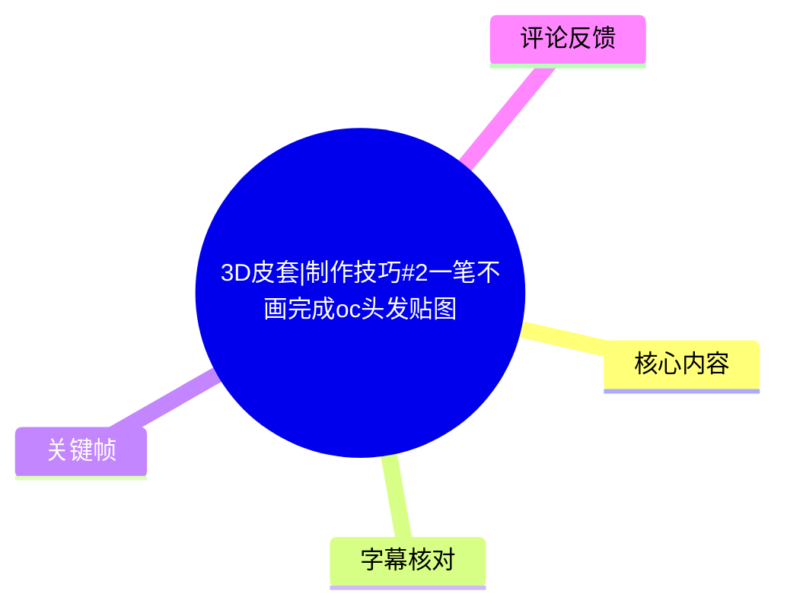
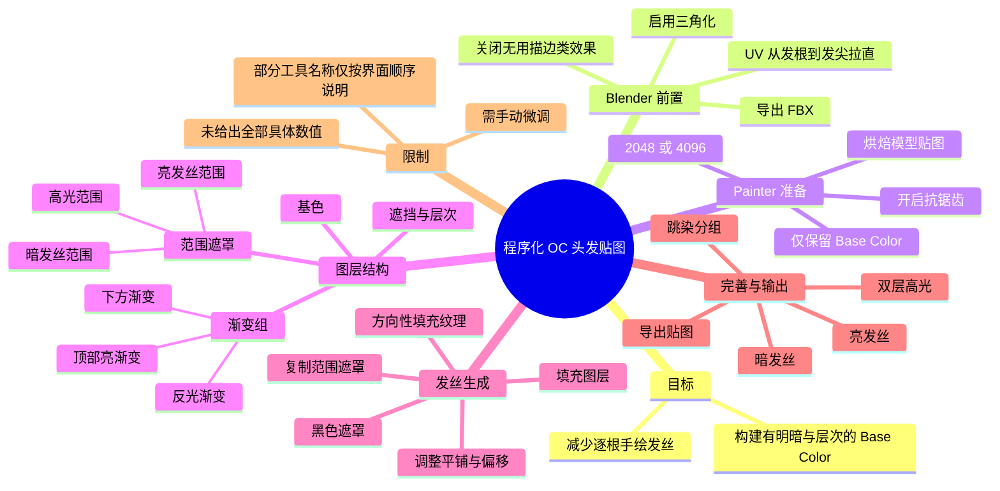
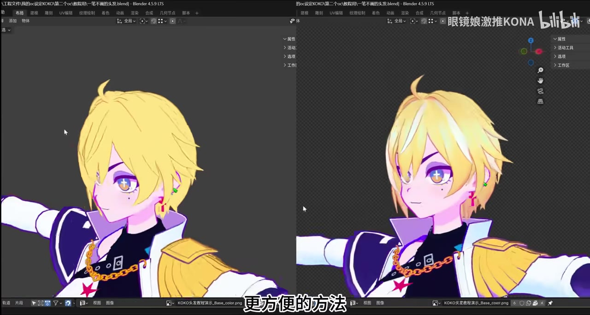
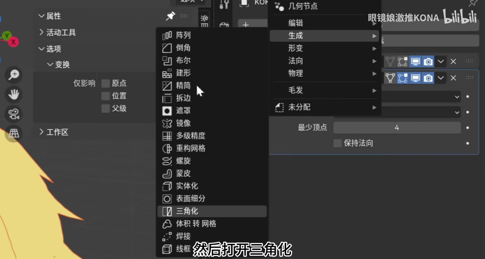
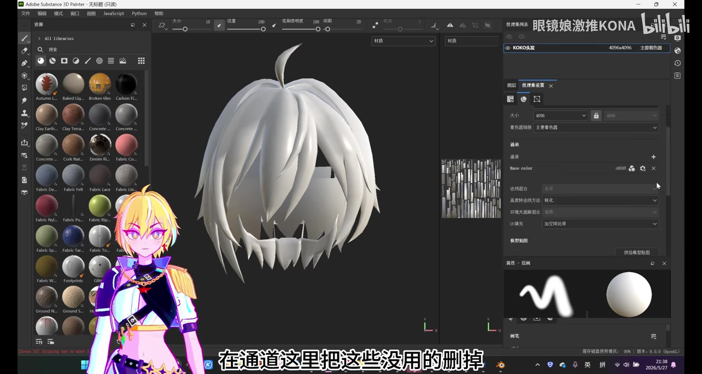
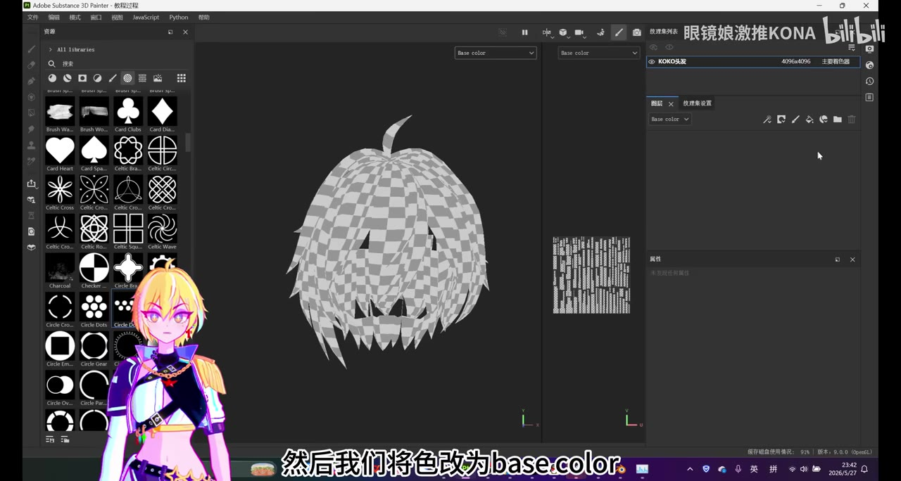

# 3D皮套|制作技巧#2一笔不画完成oc头发贴图

> 来源：[Bilibili 视频](https://www.bilibili.com/video/BV1FpGD6CESP)<br>
> UP 主：眼镜娘激推KONA ｜视频时长：19:25 ｜合集：建模教程  
> 内容定位：将 Blender 中顺直排布的头发 UV 导入 Adobe Substance 3D Painter，以生成器、黑色遮罩、填充纹理和图层复制构建程序化发丝贴图。

## 小结

视频针对 OC／Live3D 模型头发贴图中“逐根手绘发丝”耗时的问题，给出一条以 **UV 方向统一 + Substance 3D Painter 程序化图层** 为核心的替代流程。重点并非完全不需要调整，而是先通过遮罩确定不同发丝应该出现的区域，再用具备方向性的填充纹理生成细丝效果，从而减少手绘工作量。

建模端的前提是：头发 UV 要从发根到发尖自上而下拉直；随后关闭不需要的类似描边效果、启用三角化，并将头发模型导出为 FBX。这个 UV 方向是后续纹理在各发片上顺着头发生长方向排列的基础；如果 UV 走向混乱，程序纹理不能自然地表现为发丝。

贴图端仅保留 `Base Color` 通道，烘焙模型贴图时输出尺寸可选 `2048` 或 `4096`，取决于电脑配置，并需要开启抗锯齿。教程以低饱和基础色开始，依次制作顶部亮渐变、下方渐变、反光渐变和立体感，再建立暗发丝范围、亮发丝范围和高光范围。

最关键的可迁移方法是：**范围与纹理分离**。先通过生成器叠加、混合模式和滤镜塑造黑白范围；再将范围遮罩复制到使用填充纹理的图层组，使暗发丝、亮发丝、高光或反光发丝只出现在对应位置。纹理本身决定发丝的粗细、密度与规律感，范围决定其分布位置。

后半段还演示了通过复制整组图层制作跳染色：先将一组头发效果归组，例如“黄色头发”，复制后改底色并在黑色遮罩上选取需要变色的发束，再分别修改渐变、遮挡、层次等子图层颜色。最终从“文件 → 导出贴图”导出，填充选项使用“膨胀加透明度”。

视频是思路演示而非精确参数模板。UP 主明确说明录制多次后没有仔细调节细节，最终效果中暗发丝可能偏多，需要观看结果后逐项调整遮罩范围、纹理形状、平铺与不透明度。软件版本、生成器名称和部分未口述的混合模式未被完整确认，复现时应以当前界面实际名称为准。

## 思维导图





## 目录

- [问题、目标与最终效果](#问题目标与最终效果)
- [Blender：统一 UV 并导出 FBX](#blender统一-uv-并导出-fbx)
- [Substance 3D Painter：纹理集与烘焙准备](#substance-3d-painter纹理集与烘焙准备)
- [基础色、三层渐变与立体感](#基础色三层渐变与立体感)
- [暗发丝范围与暗发丝](#暗发丝范围与暗发丝)
- [层次、亮发丝与高光](#层次亮发丝与高光)
- [补充暗部与底部反光发丝](#补充暗部与底部反光发丝)
- [跳染分组与颜色重设](#跳染分组与颜色重设)
- [导出、复现清单与限制](#导出复现清单与限制)
- [字幕比对](#字幕比对)
- [评论分析](#评论分析)
- [处理记录](#处理记录)

## [问题、目标与最终效果](https://www.bilibili.com/video/BV1FpGD6CESP?t=0)

视频开场对比了两种头发外观：一侧相对简单，另一侧具有更明显的色块、明暗渐变和白色挑染等细节。UP 主提出的问题是，给 OC 绘制头发贴图时是否仍在“逐笔抠发丝”；本教程要提供的是更省时的方法，而不是完全依赖手绘笔刷。



> 图：画面同时展示较简化的头发和带有渐变、发丝及挑染细节的效果，可直接说明本流程的视觉目标：在不逐根绘制的前提下增加头发层次。

适用对象与前置条件：

- 已有头发模型，并能在 Blender 中编辑 UV；
- 可将模型以 FBX 形式导出；
- 使用 Adobe Substance 3D Painter 完成烘焙与 Base Color 贴图制作；
- 能接受以生成器、遮罩和填充纹理为主的程序化控制方式；
- 最终仍需要依据模型与审美进行手动微调，不能把本视频理解为“一键生成通用头发贴图”。

## [Blender：统一 UV 并导出 FBX](https://www.bilibili.com/video/BV1FpGD6CESP?t=14)

### 1. 将头发 UV 拉直

UP 主要求将头发的 UV “全部打直”，方向必须是：

```text
发根 → 发尖
上方 → 下方
```

该方向约定服务于后续在 Painter 中投放具有条纹／顺序感的填充纹理：当纹理沿 UV 的纵向排布时，视觉上才能接近顺着发束延伸的发丝。视频未展示 UV 自动拉直的具体 Blender 菜单操作，只明确了结果要求和方向。

### 2. 调整修改器并三角化

在导出前，UP 主要求：

1. 关闭类似“描边”这种不需要的效果；
2. 打开“三角化”；
3. 选中头发模型后导出 FBX。



> 图：关键帧显示 Blender 的修改器添加菜单中选中了“**三角化**”。其价值在于确认视频中的“打开三角化”是模型导出准备的一部分，而非 Painter 内部操作。

这里没有给出三角化修改器的更多数值配置，也没有说明是否应用修改器；因此可确认的只有“在流程中启用三角化”和“导出 FBX”两项。若项目对导出网格、绑定或引擎兼容性有额外要求，应先在副本上验证。

## [Substance 3D Painter：纹理集与烘焙准备](https://www.bilibili.com/video/BV1FpGD6CESP?t=42)

### 1. 新建项目并导入 FBX

在 Painter 中新建项目，选择刚从 Blender 导出的 FBX 并确认。站内字幕将软件误记为“PPT 文件”，而画面软件标题栏与工作区显示为 **Adobe Substance 3D Painter**；应以画面和上下文校正。

### 2. 精简纹理集通道

进入“纹理集设置”的通道区域，删去不需要的通道，只保留：

```text
Base Color
```



> 图：画面右侧纹理集设置的“通道”区域仅见 `Base color`，可验证本教程目标是输出头发颜色贴图，不是在同一套流程中制作完整 PBR 通道组。

### 3. 烘焙模型贴图

UP 主随后烘焙模型贴图，并给出以下明确参数建议：

| 项目 | 视频中的设置／建议 | 说明 |
| --- | --- | --- |
| 输出大小 | `2048` 或 `4096` | 按电脑配置选择 |
| 抗锯齿 | 开启 | 视频明确要求开启 |
| 保留通道 | `Base Color` | 前一步已清理其他无用通道 |

视频没有说明烘焙中是否启用 AO、法线等具体地图，也未提供射线距离、采样数或透明边缘处理细节。评论中有人提及 AO 黑块，但这不构成视频对 AO 问题的技术解答，见“评论分析”。

## [基础色、三层渐变与立体感](https://www.bilibili.com/video/BV1FpGD6CESP?t=82)

### 1. 创建基色

1. 将当前颜色通道设为 `Base Color`。
2. 添加填充图层。
3. 选一个饱和度不要太高的颜色。
4. 将该层命名为“基色”。



> 图：画面显示头发模型已在 `Base color` 通道下进入图层制作阶段，模型表面呈现按 UV 分块的棋盘预览；它有助于理解为何前置 UV 排布会直接影响后续纹理方向与分布。

### 2. 顶部亮渐变

在基色之上添加填充图层，并执行：

1. 添加黑色遮罩；
2. 在遮罩中添加生成器；
3. 选择列表中的“第二个”生成器；
4. 调整范围；
5. 颜色从基色取样，略微提亮并改变色相；
6. 降低不透明度；
7. 命名为“顶部渐变”。

“第二个生成器”是视频按当时界面列表顺序的描述，未提供可可靠转写的具体生成器名称；不同版本／语言界面中的顺序可能不同，应按画面效果选择能生成同类上下范围渐变的生成器。

### 3. 下方渐变与反光渐变

将“顶部渐变”复制（`Ctrl + D`）：

- 在生成器中选择视频所称的 `Fills`／“反向”选项，使方向反过来；
- 调整范围使效果向下移动；
- 再从基色取样，颜色向右下方向调整，并略改色相。

再次复制图层后：

- 改为更醒目的颜色，示例为粉色；
- 将范围拉低；
- 同样降低不透明度；
- 命名为“反光渐变”。

UP 主将上述顶部亮渐变、下方渐变和反光渐变三个图层归组，命名为“渐变”。

### 4. 以第三个生成器增加立体感

在渐变组之外新增填充图层：

1. 添加黑色遮罩；
2. 添加生成器；
3. 选择列表中“第三个”；
4. 使用视频提到的 `Fills` 选项；
5. 颜色从基色提取，向右下方向偏移，并略调色相。

视频判断该层能使头发具有“立体感”。这里的“立体感”是颜色层级造成的视觉效果，并不代表该 Base Color 流程实际改变了模型几何。

## [暗发丝范围与暗发丝](https://www.bilibili.com/video/BV1FpGD6CESP?t=221)

### 1. 先创建暗发丝范围

这是视频最关键的遮罩控制步骤。新建填充图层后：

1. 添加黑色遮罩；
2. 添加生成器，选择列表“第二个”；
3. 将第二个数值拉满，并提高相关数值；
4. 再添加一个生成器，同样选择“第二个”；
5. 使用 `Fills` 选项；
6. 将第一个生成器的模式改为 `Screen`；
7. 得到一个范围，并命名为“暗发丝范围”；
8. 继续微调范围；
9. 添加两个滤镜：
   - 第一个选择列表最下方的项目，并略微提高数值；
   - 第二个将第二个数值设为 `90`，再提高第一个数值。

视频没有完整说出两个滤镜与“第二个生成器”的名称，因此不应据此臆测为某一固定功能。可确定的是它们用于把原始范围处理为具有变化的黑白分布。

### 2. 用方向性纹理生成暗发丝

在新填充图层上：

1. 添加黑色遮罩；
2. 添加“填充”；
3. 选择“比较有顺序”的纹理／贴图；
4. 暂时关闭“暗发丝范围”以方便观察；
5. 将图层命名为“暗发丝”；
6. 在填充设置中解除锁定；
7. 将第二个数值改为 `0`；
8. 提高平铺（Tiling）。

这样，平铺后的条纹／规则纹理会在已经拉直的 UV 上形成一根根类似发丝的形状。若发丝不够密集，就换用更密的填充纹理，而不是仅依赖绘制。

### 3. 将范围遮罩复制给发丝图层

将“暗发丝”图层归组（视频口述为 `Ctrl + G`），对该组：

1. 添加黑色遮罩；
2. 在“暗发丝范围”上右键，选择复制遮罩；
3. 在暗发丝组的遮罩上执行“粘贴到遮罩”。

结果是发丝只显示在预先定义的上方与下方区域。之后：

- 将发丝颜色调暗；
- 将图层命名为“暗发丝”；
- 修改混合模式为视频画面所选模式，但字幕未可靠识别模式名称；
- 降低不透明度；
- 将前面的相关层命名为“遮挡”。

> 经验要点：**范围图层不直接承担发丝形状，填充纹理也不负责决定出现位置。** 先用遮罩确定“哪里有”，再用纹理确定“长什么样”，可更容易复用和修改。

## [层次、亮发丝与高光](https://www.bilibili.com/video/BV1FpGD6CESP?t=418)

### 1. 层次纹理

在暗发丝之外，新建填充图层并添加黑色遮罩、填充纹理：

- 选择另一种形状；
- 调整偏移与平铺；
- 从基色取色，再略作颜色调整；
- 设为与视频相同但未可靠识别名称的混合模式；
- 降低不透明度；
- 命名为“层次”。

该层的明确目的，是让头发多一点层次感，而不是生成主发丝。

### 2. 从暗发丝范围派生亮发丝范围

UP 主复制“暗发丝”以及“暗发丝范围”，关闭前面两个相关图层，调整复制出来的范围位置和混合模式，使范围上移；获得后命名为“亮发丝范围”。

这说明亮发丝范围不是从零构建，而是复用暗发丝范围的逻辑后改变分布位置。复用方式可减少重新制作遮罩的工作。

### 3. 建立亮发丝

1. 打开需要的范围图层；
2. 先关闭待制作的显示层；
3. 新建填充图层，添加黑色遮罩和填充；
4. 选择纹理；
5. 将第二个数值改为 `0`；
6. 提高平铺；
7. 颜色从基色取样并提亮；
8. 调低一个相关强度／不透明度数值；
9. 图层归组后添加黑色遮罩；
10. 复制“亮发丝范围”的遮罩并粘贴到组遮罩；
11. 根据观察继续调高强度、调整范围。

预期结果是：头发中部较亮区域出现较亮的发丝。

### 4. 从亮发丝范围派生高光范围

发丝基本完成后，UP 主继续制作高光：

1. 复制“亮发丝范围”；
2. 缩小其范围；
3. 命名为“高光范围”；
4. 新建填充图层，添加黑色遮罩与填充；
5. 选择一种纹理并提高平铺；
6. 归组并命名为“高光一”；
7. 复制“高光范围”遮罩到该组；
8. 关闭高光范围图层；
9. 示例颜色选择蓝色。

随后把“高光一”整组复制为“高光二”：

- 改为粉色；
- 可在填充设置里调整偏移；
- 或直接更换填充纹理；
- 某个数值需要改为 `0` 才能显示预期结果。

双层不同色高光能增加装饰性，但颜色选取是示例而非固定规范。

## [补充暗部与底部反光发丝](https://www.bilibili.com/video/BV1FpGD6CESP?t=755)

### 顶部过亮时补一层暗发丝

UP 主观察到顶部“有点太亮”，因此添加额外暗发丝：

1. 新建填充图层；
2. 添加黑色遮罩和填充；
3. 选用数量更多、更加密集的纹理；
4. 颜色略偏红；
5. 归组后命名“暗发丝”；
6. 打开“暗发丝范围”，重新调整其范围；
7. 将范围遮罩复制并粘贴到新暗发丝组；
8. 降低强度，观察到合适为止。

这一步体现的不是固定层数，而是以最终画面为准：亮部失控时，可在相同范围控制体系下添加更密、更暗、低透明度的发丝层进行平衡。

### 底部反光发丝

UP 主随后要在头发底部增加反光发丝，使细节更丰富：

1. 打开“暗发丝范围”；
2. 调整第二层范围，并关闭不需要的部分；
3. 将范围调低；
4. 新建填充图层，添加黑色遮罩和填充；
5. 选择填充纹理；
6. 将相关数值设为 `0`、提高平铺；
7. 归组，并复制“暗发丝范围”遮罩；
8. 关闭范围图层；
9. 使用较亮颜色，视频举例粉色或蓝色；
10. 降低不透明度。

站内字幕在约 `14:49` 后仍能记录完整操作和总结；本次 ASR 在该时段开始连续识别为“添”，不能作为可靠文本依据。因此此处的具体步骤以站内字幕为主，并以视频前文已建立的“填充纹理 + 范围遮罩复制”模式进行连贯整理。

## [跳染分组与颜色重设](https://www.bilibili.com/video/BV1FpGD6CESP?t=999)

UP 主总结完整头发效果时指出，暗发丝与亮发丝范围先划分了“每一种发丝大概在哪些范围出现”；然后再通过填充图层和纹理，决定发丝“多细、多粗”的感觉。

随后将范围图层与效果图层进行归组：

- 将几个范围放在一起；
- 将余下效果图层（包括反光发丝等）整体归组；
- 将示例组命名为“黄色头发”。

### 跳染制作方法

1. 复制“黄色头发”整组；
2. 把复制组最下面的基色先改为白色；
3. 为该组添加黑色遮罩；
4. 在遮罩中选择需要跳染的发束；
5. 将组命名为“白色头发”；
6. 分别调整子图层的颜色，例如渐变、遮挡和层次；
7. 视频示例中将“层次”改为偏蓝色。

完成后，头发可同时保留黄色、白色等不同主色区域，以及相应的发丝、渐变与反光细节。UP 主也强调示例里选取不够细致；自行调节范围或更换发丝纹理形状，效果会更好。

## [导出、复现清单与限制](https://www.bilibili.com/video/BV1FpGD6CESP?t=1134)

### 导出步骤

头发贴图制作完毕后：

1. 选择“文件 → 导出贴图”；
2. 选择保存位置；
3. 在预设／选项中选择“第三个”；
4. “填充”选择“膨胀加透明度”；
5. 导出。

“第三个”是按视频当时列表位置说明，未提供其可核验的预设名称，不应直接当作跨版本通用配置。唯一明确可复用的导出选项是“膨胀加透明度”。

### 推荐复现顺序

| 阶段 | 最少要完成的内容 | 核心检查 |
| --- | --- | --- |
| 模型准备 | UV 自根到尖拉直、三角化、FBX 导出 | 条纹纹理能否顺发束方向延伸 |
| Painter 准备 | 仅保留 Base Color、烘焙、开启抗锯齿 | 模型与 UV 显示是否正常 |
| 色彩结构 | 基色 + 顶部／下方／反光渐变 + 立体层 | 大色块是否已有基础明暗 |
| 范围结构 | 暗发丝、亮发丝、高光范围 | 黑白遮罩的位置是否符合光照设计 |
| 细丝结构 | 方向性纹理、平铺、偏移、低不透明度 | 纹理是否像发丝而非杂乱噪点 |
| 最终修正 | 补暗、底部反光、跳染 | 顶部是否过亮、暗发丝是否过多 |
| 导出 | 膨胀加透明度 | 导出结果边缘是否满足目标软件需求 |

### 限制与时效性

- **教程是思路参考。** 视频简介说明录制多次、作者“录昏头”，未仔细调节细节；成品不能视为已完全打磨的标准答案。
- **具体数值不完整。** 除 `2048 / 4096`、滤镜的一个数值 `90`、若干“第二个数值设为 0／拉满”、提高平铺和降低不透明度外，视频没有提供可直接照抄的统一数值。
- **部分名称不可靠。** 生成器“第二个／第三个”、若干滤镜以及部分混合模式仅按当时界面位置或模糊字幕说明；版本、语言和界面布局变化时必须以实际效果校正。
- **不等于零手工。** 方法免去了逐根画发丝，但仍需调整范围、颜色、透明度、平铺、偏移和纹理密度。
- **发布时效。** 元数据记录视频发布于 2026-05-28；本文只整理该视频中实际演示的工作流，不保证此后 Blender、Substance 3D Painter 或目标 Live3D／Warudo 工作流的菜单与导出预设保持不变。
- **结尾展示信息有限。** 站内字幕在 `19:13` 后仅保留“教程也是／然后选择一个”等不完整片段，未能可靠确认最终成品查看环节的完整操作，故不补写未出现内容。

## 字幕比对

| 字幕来源 | 完整性 | 专有名词 | 时间轴 | 主要问题 |
| --- | --- | --- | --- | --- |
| Bilibili 站内字幕 | 覆盖从 `00:00:00.480` 至 `00:19:16.200`，基本覆盖教程全过程 | 有较多音近误识别，如“PPT”“FBS”“三角花”“鸡舍”“透贴”；可结合画面和上下文校正 | 分段细，起止时间可直接使用 | 生成器、滤镜和混合模式名称多以“第二个／这一个”描述；末尾少量字幕不完整 |
| 本次 ASR（large-v3-turbo） | 前约 15 分钟大体覆盖；`14:49` 后持续出现大量“添”类无意义结果，无法支撑后段内容 | Blender 被识别为“Blend”，Painter 为“PT”，发丝／填充／生成器多处错字 | 时间戳完整，前段与站内字幕时间基本相近 | 后段严重退化；总语音覆盖率为 `65.24%`，不适合单独作为正文依据 |

### 最终字幕选择

本文以**站内 SRT 为主**，并对本次 ASR 进行了逐段检查和交叉验证：

- 开头至约 `14:48`：两份字幕的操作顺序、时间位置与主要语义一致，但站内字幕分段更细，专有名词相对更容易依据画面校正。
- 约 `14:49` 之后：ASR 出现连续“添”字识别，站内字幕仍保留可读操作文本，因此采用站内字幕。
- ASR 诊断中**没有** `noAudioStream=true` 标记；源视频存在音轨。后段 ASR 文本异常属于识别质量问题，不能解释为视频无音轨。
- 基于画面与上下文校正的关键术语包括：`Blender`、`Adobe Substance 3D Painter`、`FBX`、`Base Color`、三角化、填充图层、黑色遮罩、生成器、复制遮罩、粘贴到遮罩、平铺、偏移和不透明度。
- 站内字幕中的“PPT 文件”与 ASR 中的“PT”均不采用；关键帧的软件界面明确显示 Adobe Substance 3D Painter。

## 评论分析

仅处理当前可获取的热评前三条；评论是观众反馈，不是已经由视频或本文验证的技术事实。

1. **据说脆皮乳鸽很好吃**（10 赞）  
   - 评论内容：烘焙出的 AO 贴图有许多莫名黑块，询问解决方法。  
   - 价值：指出实际复现中可能遇到烘焙瑕疵。  
   - 限制：本视频主流程仅保留 `Base Color`，且没有展示 AO 黑块的诊断或修复步骤；评论未获视频内可验证的解答，不能据此推导黑块原因。

2. **lilies莉莉丝**（5 赞）  
   - 评论内容：询问能否用 Blender 材质节点做出类似效果。  
   - 价值：提出可替代工具链的方向，即将“范围遮罩 + 方向性纹理 + 分层颜色”的思想迁移到节点材质。  
   - 限制：视频没有演示 Blender 材质节点方案，也没有给出答复；是否能等效实现、如何烘焙和导出，均需另行验证。

3. **肆无忌惮DE青春**（4 赞）  
   - 评论内容：“我来了”。  
   - 价值：仅表达观看／支持，无可提炼的技术补充或争议信息。

## 处理记录

- Worker ID：`worker-msaei2qg-b29e21b6`
- 模型：`gpt-5.6-terra`
- 调用工具与素材：视频元数据、站内时间轴字幕 `p01-ai-zh.srt`、本次 ASR 的 `asr/transcript.srt` 与 `asr/asr-result.json`、47 张关键帧、热评数据 `comments/comments.json`。
- 字幕选择：以站内字幕为正文主依据；已检查本次 ASR。ASR 前段用于交叉验证时间和语义，约 `14:49` 后发生“添”字连续误识别，因此后段改用站内字幕与画面上下文。
- 关键帧选择依据：
  - `frames/frame-001.jpg`：展示开场前后效果对比，适合说明教程目标；
  - `frames/frame-002.jpg`：清晰显示 Blender “三角化”操作，支撑导出前步骤；
  - `frames/frame-003.jpg`：清晰显示 Painter 的纹理集通道与 `Base color`，支撑通道精简；
  - `frames/frame-004.jpg`：显示 Base Color 制作阶段和 UV 棋盘预览，支撑 UV 与纹理流程的关联。
- 缓存清理：未提供缓存清理执行日志；本文不声称已删除源视频、音频、关键帧或中间 ASR 文件。
- 未解决问题：
  - 未能从可靠字幕中确认“第二个／第三个”生成器、两个滤镜及部分混合模式的确切名称；
  - 未获得 AO 黑块问题的作者回复或可验证解决方案；
  - 视频结尾字幕不完整，未补写无法确认的最终展示步骤。
