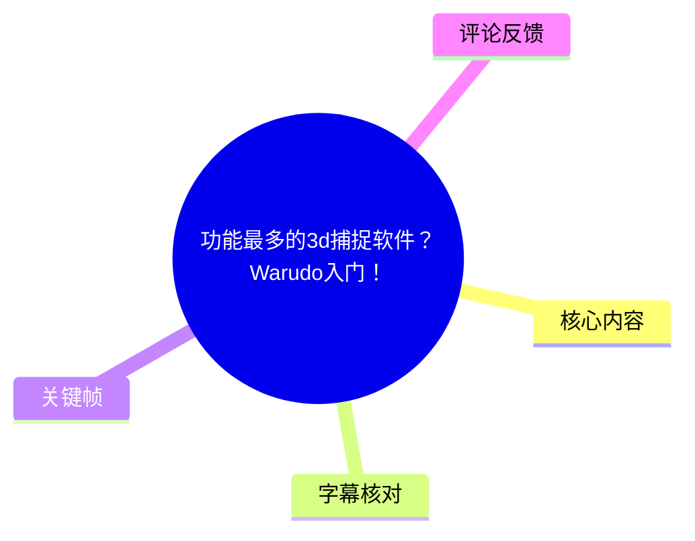
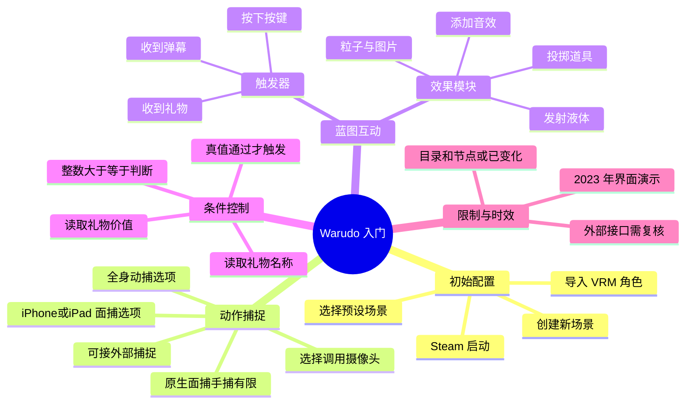
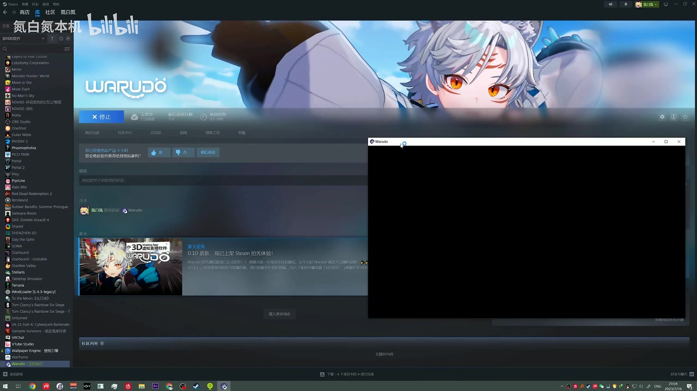
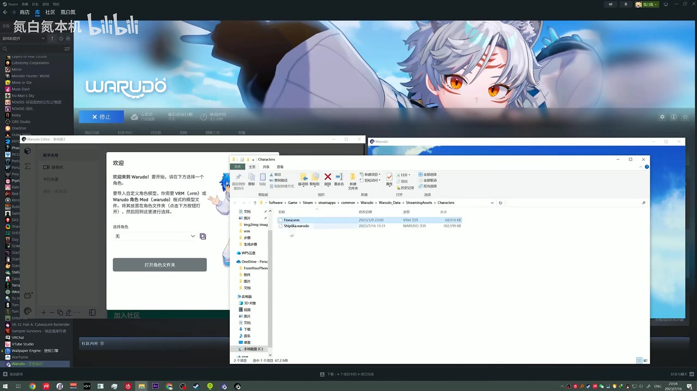
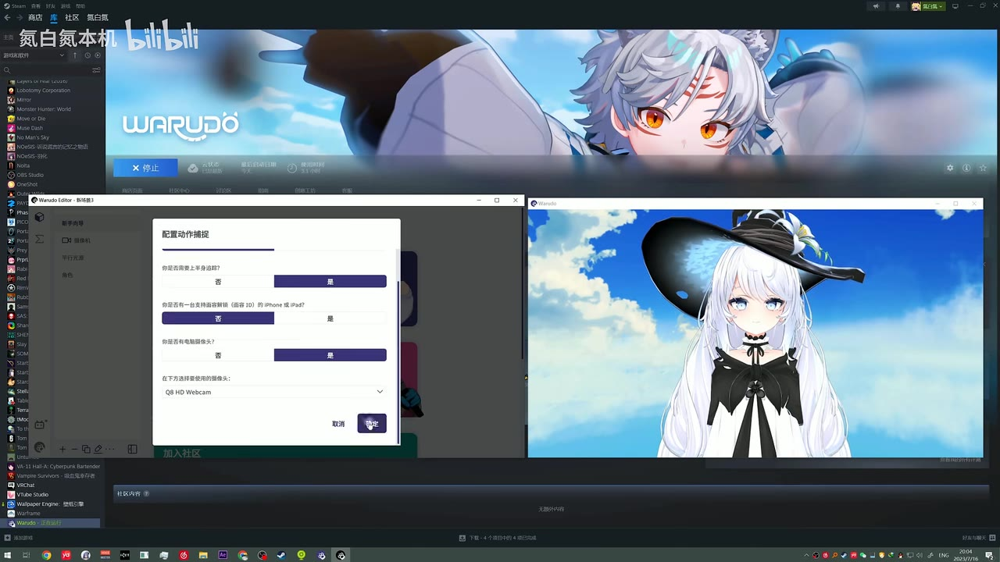

# 功能最多的3d捕捉软件？Warudo入门！

> 来源：[Bilibili 视频](https://www.bilibili.com/video/BV1rN41127D7)<br>
> UP 主：氮白氮本机｜发布时间：2023-07-16｜视频时长：09:31｜分辨率：1920×1080

## 小结

视频以 **Warudo 的初始配置与蓝图互动** 为主线，演示如何从 Steam 启动软件、导入 VRM 角色、设置动作捕捉选项，并完成一个“直播礼物/键盘按键触发向角色投掷道具”的蓝图实例。

Warudo 在视频中最突出的能力并非自身面捕精度，而是其接近 UE 风格的**节点式蓝图编程**：将“收到礼物”“收到弹幕”“按下按键”等触发器连接至道具投掷、液体发射、音效、粒子效果等模块，便可构建直播互动效果。UP 主也在简介中说明，理论上还可将弹幕作为扳机，用于切换表情、音乐或调用外部接口。

初始导入时，视频展示了将 `.vrm` 文件放入 Warudo 的 `StreamingAssets/Characters` 目录，再通过配置向导选择角色、全身动捕、是否有支持面部捕捉的 iPhone/iPad，以及要调用的摄像头。对于表情导入，UP 主的实践建议是：**表情很多时先不要导入**，否则系统会为每个表情分配快捷键，后续改键较麻烦。

蓝图示例的关键是把事件输出端与效果模块输入端直接相连：例如“收到礼物时”连接到“投掷道具”，再配置目标角色、碰撞音、发射音和发射点。键盘事件可替代直播事件用于本地测试；条件判断则可把礼物总值或变量值作为门槛，只有条件为真时才执行效果。

局限同样明确：这是 2023 年发布的入门演示，软件界面、Steam 发行状态、目录结构、B 站直播接口字段、节点名称与可用模块均可能已经变化；UP 主认为软件**自带面捕与手捕表现不佳**，建议需要较好捕捉时接入 WebMotionCapture 等外部捕捉软件。视频没有给出外部捕捉接入的详细配置步骤，也没有完整讲解粒子、随机图片等全部节点。

适合已有 VRM 模型、准备直播互动或对可视化逻辑有兴趣的虚拟主播使用者；有 UE5 或其他蓝图工具经验的读者会更容易理解。仅凭本视频不足以确认当前版本的兼容性与接口可用性，实际部署前应以当前 Warudo 文档和平台规则为准。

## 思维导图





## 目录

- [开场效果与软件定位](#开场效果与软件定位-0040)
- [创建场景与导入 VRM 角色](#创建场景与导入-vrm-角色-0058)
- [动作捕捉和表情导入配置](#动作捕捉和表情导入配置-0127)
- [蓝图与 B 站直播事件](#蓝图与-b-站直播事件-0234)
- [实例：收到礼物时投掷道具](#实例收到礼物时投掷道具-0354)
- [键盘测试、音效与通用连线规律](#键盘测试音效与通用连线规律-0445)
- [实例：礼物价值条件与变量模拟](#实例礼物价值条件与变量模拟-0555)
- [结论、限制与时效性](#结论限制与时效性-0923)
- [字幕比对](#字幕比对)
- [评论分析](#评论分析)
- [处理记录](#处理记录)

## 开场效果与软件定位 [00:40](https://www.bilibili.com/video/BV1rN41127D7?t=40)

视频开头先以成品效果展示“弹幕/礼物互动”：画面中的虚拟角色位于直播视觉场景，左侧可见聊天信息，画面中央以大字提示“弹幕/礼物互动”。这是后续蓝图教程要实现的目标效果，而不是单纯的动作捕捉展示。

UP 主在视频简介中给出软件定位：

- Warudo 可在 Steam 获取；
- 最大亮点是蓝图编程；
- 可将收到弹幕作为扳机，联动投掷物、表情、音乐乃至外部接口；
- 蓝图风格被 UP 主形容为与 UE5 相似；
- 原生面捕与手捕不是其推荐点，需要时可导入外部捕捉参数。


> 图：该帧呈现教程最终希望实现的直播互动观感，包括虚拟角色、聊天信息和“弹幕/礼物互动”提示。它说明视频核心并非建模，而是将直播事件映射到角色效果。

## 创建场景与导入 VRM 角色 [00:58](https://www.bilibili.com/video/BV1rN41127D7?t=58)

### 1. 启动并创建新场景

UP 主在约 00:58 进入新建场景流程。画面显示 Warudo 在 Steam 环境中启动，教程采用软件的配置向导完成初始角色场景搭建。



> 图：该帧证明演示环境是在 Steam 中启动 Warudo，并显示软件窗口正在加载。它可用于定位视频所演示的软件获取与启动场景，但不代表当前 Steam 页面或版本状态仍与 2023 年相同。

### 2. 放置 VRM 文件并选择角色

约 01:07，UP 主说明：若要导入自己的角色，应将 VRM 文件放至 Warudo 对应的角色目录。画面中的资源管理器路径可辨识为：

```text
Steam\steamapps\common\Warudo\Warudo_Data\StreamingAssets\Characters
```

文件列表中可见 `.vrm` 文件；随后它出现在 Warudo 的角色选择流程中。这里可整理为以下操作：

1. 准备可供 Warudo 读取的 `.vrm` 角色文件；
2. 打开 Warudo 的角色资源目录；
3. 将 VRM 文件放入 `Warudo_Data/StreamingAssets/Characters`；
4. 返回 Warudo 配置向导；
5. 在角色选择区选择导入的角色，再继续下一步。



> 图：画面同时出现 Warudo 欢迎/角色选择界面与 `StreamingAssets\Characters` 文件夹，文件扩展名为 `.vrm`。这是校正 ASR 将“VRM”“Characters”等词识别错误的重要视觉依据。

### 3. 选择预设场景

约 01:58，UP 主表示还可选择软件预设的若干场景，以决定角色所处环境；其演示中选择了一个 VR 场景。完成向导后，角色已能在预览窗口中动起来。

此处的“能动”仅表明演示中的角色已进入可被当前配置驱动的状态；视频没有给出该角色的具体骨骼、表情规范或追踪协议参数。

## 动作捕捉和表情导入配置 [01:27](https://www.bilibili.com/video/BV1rN41127D7?t=87)

配置向导的“配置动作捕捉”页包含若干判断项和设备选择。画面与语音可确认的内容包括：

- 是否需要全身动作捕捉；
- 是否拥有支持面部捕捉的 iPhone 或 iPad；
- 是否有电脑摄像头；
- 在下拉框中选择要调用的摄像头。



> 图：该帧直接展示“配置动作捕捉”页面，包含全身动捕、支持面部捕捉的 iPhone/iPad、电脑摄像头及摄像头下拉选择区；右侧角色预览便于核对配置对角色显示的影响。

### 表情导入的经验建议

约 01:39，UP 主特别提醒：表情导入**最好不要一开始就导入**，尤其是在表情数量多的情况下。其理由是软件会自动为每个表情分配快捷键，之后修改快捷键会比较困难。

这是一条工作流建议，不是软件绝对限制：

- **表情少、只作快速测试**：可直接导入；
- **表情多、需要系统化控制**：建议先完成角色与动捕基础配置，再规划表情蓝图和快捷键；
- 若初始导入阶段已经勾选表情，后续蓝图区域会出现表情蓝图，可修改各表情的快捷键。

此外，简介明确指出 UP 主对软件自带面补和手补的评价是“不行”。该结论属于作者经验判断，不等同于对所有版本、设备或角色的客观基准测试；但它给出了明确路线：需要更好捕捉时可使用 **WebMotionCapture 等外部捕捉软件**，并向 Warudo 导入参数。视频未继续展示该外部接入过程，因此不能据此推导具体协议、端口或参数格式。

## 蓝图与 B 站直播事件 [02:34](https://www.bilibili.com/video/BV1rN41127D7?t=154)

### 表情蓝图与互动蓝图

约 02:38，UP 主切换到蓝图部分，并说明：如果导入角色时选择了表情，软件会额外提供表情蓝图，可用于修改每个表情的快捷键。随后教程以“B 站弹幕互动”为例，而不是停留在表情切换。

### 直播间信息读取

约 03:00，UP 主说明需要在菜单/设置中填写自己的 **B 站直播间 ID**，Warudo 才能获取该直播间的信息。这是直播事件蓝图能够工作的重要前置条件。

可从视频确认的逻辑关系为：

```text
直播间 ID 配置
    ↓
Warudo 获取直播间事件信息
    ↓
蓝图触发器收到事件
    ↓
后续效果模块执行
```

视频没有展示直播间 ID 的具体输入字段名称、鉴权机制或错误排查流程，也未证明该接口在当前版本仍可用。因此在当前环境实操时，应以 Warudo 现行直播连接说明与 Bilibili 平台接口规则复核。

### 可用触发器和输出模块

约 03:10—03:51，UP 主列举蓝图中可用于驱动逻辑的事件，其中可明确识别的包括：

| 类别 | 视频提到的节点/事件 | 用途 |
| --- | --- | --- |
| 直播事件触发器 | 收到弹幕时 | 在收到弹幕时启动后续流程 |
| 直播事件触发器 | 收到礼物时 | 在收到礼物时启动后续流程 |
| 本地测试触发器 | 按键/键盘按下 | 无需真实直播事件也可测试效果 |
| 效果模块 | 投掷道具 | 向角色投出指定道具 |
| 效果模块 | 发射液体 | 产生液体发射效果 |
| 效果模块 | 音效 | 添加声音反馈 |
| 其他模块 | 随机粒子效果、随机图片等 | UP 主提及但未完成详细讲解 |

UP 主的核心规则是：**有输入端口的效果模块都可被事件触发**。不过这并不表示任意节点都能无条件互连；实际仍要检查端口类型是否匹配。视频中展示的是事件的执行出口连接效果模块执行入口的典型模式。

## 实例：收到礼物时投掷道具 [03:54](https://www.bilibili.com/video/BV1rN41127D7?t=234)

### 基础连线

从约 03:54 开始，UP 主用“收到礼物时”创建投掷互动。最简蓝图是：

```text
[收到礼物时]
      │ 执行输出
      ▼
[投掷道具]
      │
      └── 向目标角色投出预设道具
```

操作顺序如下：

1. 在蓝图中添加“收到礼物时”触发器；
2. 添加“投掷道具”模块；
3. 将“收到礼物时”的输出端连接至“投掷道具”的输入端；
4. 在投掷道具模块中选择要投出的物体；
5. 配置目标角色、声音与发射位置；
6. 用键盘事件或实际直播礼物测试。

UP 主强调，两个模块连接起来后，模块就已经具备可工作的基本逻辑；但投掷的具体表现仍取决于后续参数。

### 投掷道具参数

约 04:18—04:40，视频说明的可配置项包括：

| 参数 | 视频中的含义 |
| --- | --- |
| 目标角色 | 指定被投掷效果作用的角色 |
| 道具 | 选择投出的物体 |
| 碰撞音 | 道具产生碰撞时使用的声音 |
| 发射音 | 道具发出/投出时的声音 |
| 发射点 | 道具开始出现的位置 |
| 自定义参数 | 模块中其余可按效果需求调整的参数 |

UP 主举例：道具可从角色头顶投出，也可从相机方向投出。视频未提供数值型参数、物理强度、道具资源格式或碰撞体配置，不能补充为确定设置。

## 键盘测试、音效与通用连线规律 [04:45](https://www.bilibili.com/video/BV1rN41127D7?t=285)

### 用键盘按键替代直播礼物测试

约 04:45 起，UP 主为方便测试，添加“当键盘按下”触发器，示例按键为 `Alt+1`。将该键盘事件的输出连接至“投掷道具”的输入后，按下组合键即可向角色投出前面配置的物体。

```text
[当键盘按下：Alt+1]
           │
           ▼
      [投掷道具]
```

这种测试方式的价值是将“蓝图是否正确”与“直播间连接是否正常”分开排查：

1. 先用键盘事件验证道具模块、目标角色与发射点；
2. 确认效果正常后，再替换或并接“收到礼物时”；
3. 若直播时不生效，可优先检查直播间 ID、事件连接状态或触发条件，而不是重复怀疑投掷模块。

### 添加音效及通用理解方式

约 05:16，UP 主提到添加音效，并在 05:24—05:53 概括蓝图的通用理解方法：

```text
触发器的执行出口
        ↓
要被触发模块的执行入口
        ↓
设置目标角色、发射点及模块专属参数
```

例如：

- 收到礼物时 → 向角色投掷道具；
- 收到礼物时 → 发射液体；
- 键盘按下 → 添加音效或投掷道具。

这里的“出口连入口”是本视频讲述的流程连线规则；如果某节点还需要数据输入，例如角色对象、礼物金额、字符串或布尔值，则仍需将对应数据端口单独接入。

## 实例：礼物价值条件与变量模拟 [05:55](https://www.bilibili.com/video/BV1rN41127D7?t=355)

### 从礼物事件读取数据

约 05:55 起，UP 主进一步说明，“收到礼物时”不仅能触发效果，还可获取礼物数据，例如：

- 礼物名称；
- 礼物价值/总价值。

这使蓝图能根据不同礼物设置不同互动，而不是“收到任何礼物都执行同一动作”。

### 设置价值阈值

约 06:11—06:57，视频以“送大于 1 元的礼物就给主播一拳”为例，说明可加入整数比较节点。可抽象为：

```text
[收到礼物时]
    ├── 礼物总值 ──> [整数：大于等于 1] ──> 布尔结果
    └── 执行流 ─────────────────────────> 条件后的效果流程
```

视频中明确提到了“整数大于等于”以及“总值大于等于 1 输出”。从效果逻辑看，目标是只有金额达到阈值时才向角色投掷道具；但 ASR 对节点连线细节识别不完整，画面材料也未提供该时段关键帧，因此不应擅自指定其实际使用的是分支节点、布尔门节点还是某个特定节点名称。

可确认的判断规则是：

| 条件 | 输出 | 结果 |
| --- | --- | --- |
| 礼物总值/整数变量 `>= 1` | 真（True） | 允许执行投掷道具等效果 |
| 礼物总值/整数变量 `< 1` | 假（False） | 不执行投掷道具 |

### 以变量模拟真实礼物数据

约 07:41，UP 主没有直接依赖真实观众送礼，而是新建一个整数变量进行模拟，初始值示例为 `5`。随后将该整数值接入判断逻辑，用按键触发来验证。

在约 08:37—08:52，UP 主说明：当触发按键、且整数变量值大于 1 时，判断输出为真，因此会向角色投掷一个道具；实际运行结果也与此一致。

随后将变量值改为 `0`，约 09:00—09:07 说明判断会输出 `False`，因而不会投掷道具。结尾还提到可按类似方式设置不同条件，例如条件为真时投掷道具、条件为真时发射液体；由于 ASR 在最后一句专有词和表达上失真明显，不能据此还原更多精确节点配置。

### 可复用的搭建流程

将示例整理为可迁移步骤：

1. **先建立效果**：添加投掷道具、液体、音效或其他目标模块；
2. **确定触发来源**：选择直播弹幕、直播礼物或键盘按键；
3. **连接执行流程**：触发器输出端接效果模块输入端；
4. **配置对象参数**：选择目标角色、道具、发射点与声音；
5. **需要分级互动时读取事件数据**：如礼物名称或总价值；
6. **创建条件判断**：用整数比较等节点得到真/假结果；
7. **先用变量和快捷键测试**：例如变量设为 `5` 验证真分支，再设为 `0` 验证假分支；
8. **最后接入真实直播事件**：确认 ID、平台连接与触发链路。

## 结论、限制与时效性 [09:23](https://www.bilibili.com/video/BV1rN41127D7?t=563)

Warudo 在本视频中的价值可归纳为“以蓝图连接直播事件与 3D 效果”。对于想快速实现“礼物触发道具”“弹幕控制效果”“按键测试互动”的使用者，最重要的不是一次性掌握所有节点，而是掌握以下最小闭环：

```text
角色导入成功
  → 捕捉设备与场景可用
  → 触发器产生事件
  → 效果模块接收执行流
  → 参数决定对象与表现
  → 条件节点控制是否放行
```

### 视频覆盖范围

- 覆盖：Steam 启动、VRM 角色目录导入、初始动捕配置、预设场景、表情导入建议、B 站直播间 ID、事件触发、投掷道具、音效、按键测试、变量与整数条件判断。
- 未覆盖：外部捕捉软件的接入实操、B 站接口故障排查、粒子/随机图片节点的细节、完整的表情蓝图设计、资源制作规范、性能优化、场景输出与直播推流配置。

### 已知限制

1. **原生捕捉能力限制**：UP 主认为自带面捕与手捕效果不佳；这是一项经验性评价，需根据当前版本和设备自行测试。
2. **表情导入的快捷键管理成本**：表情多时自动分配快捷键会增加后续维护难度。
3. **直播依赖条件**：互动功能依赖正确的直播间 ID 与可用的平台事件读取能力。
4. **示例只验证了局部逻辑**：变量、按键、道具投掷和条件分支构成了演示闭环，但不能代替真实直播环境中的长期稳定性验证。
5. **节点类型与连线约束**：视频强调执行端口的连接方式，实际项目仍应检查数据类型与节点前置配置。

### 时效性说明

本视频发布于 2023-07-16，素材抓取时间为 2026-08-01。Warudo 的版本、Steam 可用性、角色资源目录、UI 文案、蓝图节点、Bilibili 直播事件支持方式与第三方捕捉工具接口都可能更新。本文只忠实整理视频和现有素材中能确认的内容，不将旧版演示视为当前版本的保证。

## 字幕比对

| 字幕来源 | 完整性 | 专有名词 | 时间轴 | 主要问题 |
| --- | --- | --- | --- | --- |
| Bilibili 站内字幕 `p01-ai-zh.srt` | 极低，仅有 12 段且集中在 01:35—03:09 | 基本不可用 | 有真实 SRT 时间轴，但内容与教程不符 | 出现“友军部队正在入侵据点”“敌方兵力”等明显来自游戏/其他内容的文本，与视频主题不一致 |
| 本次 ASR `large-v3-turbo` | 中等，54 段，识别语音约 308.81 秒，占全片约 54.1% | 可借上下文与画面部分校正 | 有真实分段时间轴，覆盖 00:40—09:28 | 大量同音和专名错误；存在无语音/漏识别间隔，最长约 22.31 秒 |
| 关键帧与视频元数据 | 仅覆盖所提供画面时点 | 可用于核对 Warudo、VRM、目录、界面 | 不替代字幕时间轴 | 未提供全部时段帧，不能单独还原完整操作 |

### 最终字幕选择与校正原则

本文以**本次 ASR 的时间戳**作为章节时间轴依据，因为其内容整体对应视频教程；站内字幕虽具真实 SRT 分段时间，但内容明显错配，未作为正文事实来源。ASR 检测结果未标记 `noAudioStream=true`，且报告音频时长为 `570.839375` 秒，因此源视频存在音轨，本次 ASR 也确实完成了识别；其问题是识别准确性与覆盖率，而非无音轨或工具失败。

经 ASR 上下文、视频简介及关键帧交叉校正的重点词语如下：

| ASR 原始识别 | 本文采用表述 | 校正依据 |
| --- | --- | --- |
| “vim” | `VRM` | 关键帧中可见 `.vrm` 文件；视频主题为虚拟角色导入 |
| “紧色文件夹” | `Characters` 文件夹 | 关键帧中显示 `StreamingAssets\Characters` 路径 |
| “表墙 / 表型 / 表增” | 表情 | 前后文均为表情导入与快捷键设置 |
| “全身补多” | 全身动作捕捉 | 动作捕捉配置页与语义对应 |
| “苹果苹古手机” | 支持面部捕捉的 iPhone/iPad | 关键帧配置页可见相关选项 |
| “投资道具 / 投赌道具 / 投着道具” | 投掷道具 | 全文均在描述向角色扔物体的效果模块 |
| “一滴滴这笔书” | B 站直播间 ID | 视频语义为填写直播间标识以获取直播信息 |
| “应他” | 整数 | 后文为整数比较、变量值 5 与 0 的判断 |
| “富斯” | False | 对应条件不满足时不触发效果的布尔结果 |

ASR 在开场前约 00:00—00:40 没有识别出有效语音，且中后段存在较长间隔；本文不把这些空段补写成语音内容，仅根据所给关键帧把开场定位为成品互动效果展示。

## 评论分析

仅获取到 2 条热评，少于要求的前三条；以下仅分析可获取内容，不将评论中的提问或态度视为已验证事实。

| 热评 | 点赞 | 观点与价值 | 可信度/待验证点 |
| --- | ---: | --- | --- |
| `-Akizora-----`：“我在哔哩哔哩直播姬里捏的皮套可以导出然后用到warudo里面吗” | 8 | 提出从 Bilibili 直播姬制作的角色迁移到 Warudo 的兼容性需求，说明观众关心的实际问题是角色格式导出与复用，而非只有蓝图互动。 | 这是提问，未包含回答或格式信息。视频只演示 `.vrm` 导入，不能据此确认直播姬角色能否导出为 Warudo 可用格式。 |
| `是阿爽鸭`：“好耶牛逼，到时候有啥不会就麻烦群主了” | 7 | 对教程和社群答疑表达积极反馈；与视频简介中“遇到问题可加群探讨”的信息相呼应。 | 属于态度性评论，不提供软件操作、兼容性或稳定性的可验证补充。 |
| 第三条 | — | 未在提供的热评素材中获取。 | 不补充、推测或虚构第三条评论。 |

## 处理记录

- Worker ID：`worker-msaei2qg-b29e21b6`
- 模型：`gpt-5.6-terra`
- ASR 模型：`large-v3-turbo`，语言识别为中文（置信度 `0.99658203125`），CUDA 推理，`int8_float16`。
- 使用素材与工具产物：视频元数据、音频 `audio/audio.wav`、ASR 分段结果 `asr/asr-result.json`、ASR SRT `asr/transcript.srt`、站内字幕 `p01-ai-zh.srt`、关键帧 `frames/`、热评 `comments/comments.json`。
- 字幕选择：检查了站内字幕与本次 ASR。站内字幕文本严重错配；采用 ASR 的真实分段时间轴，并结合关键帧、视频简介和上下文对少数术语进行保守校正。
- 音轨判断：ASR 结果提供了 570.839375 秒音频时长、54 个语音段，且未出现 `noAudioStream=true` 标记；因此按“存在音轨、ASR 有覆盖但误识别较多”处理。
- 关键帧选择依据：
  - `frames/frame-001.jpg`：展示开场的弹幕/礼物互动成品效果；
  - `frames/frame-002.jpg`：展示 Steam 中启动 Warudo 的环境；
  - `frames/frame-003.jpg`：展示 `.vrm` 文件与 `StreamingAssets\Characters` 路径，是角色导入路径的直接画面依据；
  - `frames/frame-004.jpg`：展示动作捕捉配置选项、摄像头选择及角色预览。
- 缓存清理：提供的素材未包含缓存清理执行记录；本文未声称已执行或完成缓存清理。
- 未解决问题：
  - 未提供当前 Warudo 版本、外部捕捉接入参数及 B 站直播接口的实时验证材料；
  - ASR 对部分节点名、末段语句和专有名词误识别较多；
  - 站内字幕错配，不能用于补足缺失内容；
  - 仅提供前段关键帧，后续蓝图具体连线主要依据 ASR 时间戳与语义整理。
