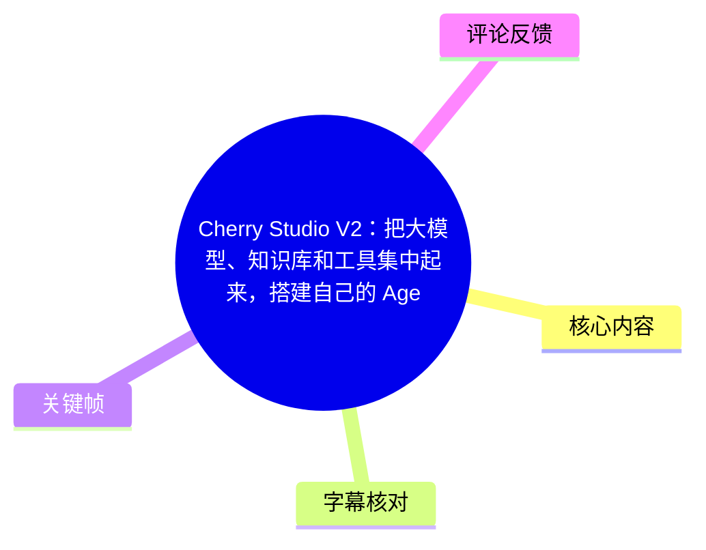
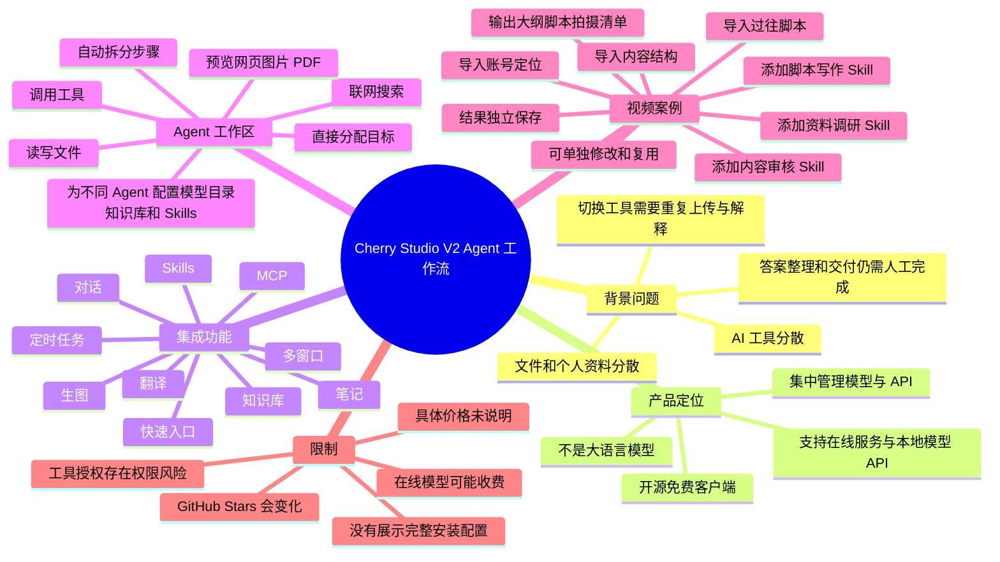
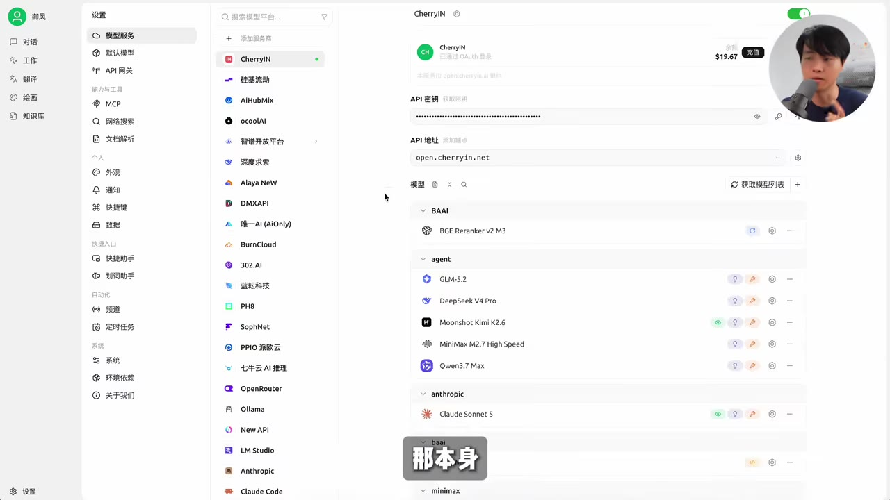
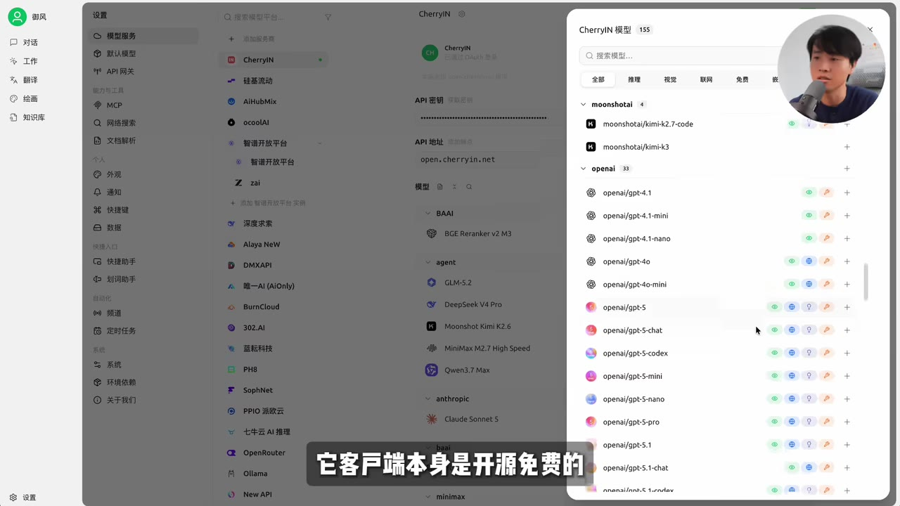
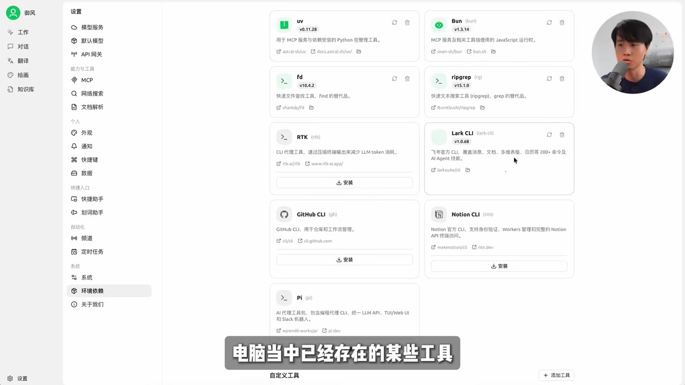
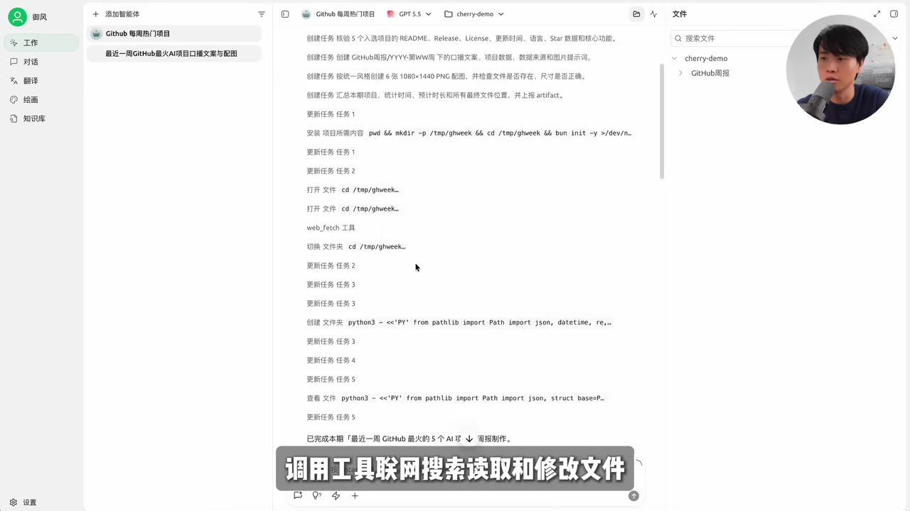

# Cherry Studio V2：把大模型、知识库和工具集中起来，搭建自己的 Agent 工作流

> 来源：[Bilibili 视频](https://www.bilibili.com/video/BV1j2MC6gErp)  
> UP 主：御风大世界 | 视频时长：282 秒 | 素材音频时长：281.301 秒

## 小结

视频从“AI 工具越来越多，但工作未必更简单”的问题切入，介绍 Cherry Studio V2 作为开源、免费的全能 AI 工作站和模型管理客户端，试图把模型、API、知识库、工具、文件和个人工作资料集中到同一套桌面工作环境中。

Cherry Studio 本身不是大语言模型，而是连接和管理模型的客户端。用户可以接入不同模型服务商、第三方兼容 API，也可以配置本地模型 API；简单任务可使用成本较低、速度较快的模型，复杂任务再切换到能力更强的模型。

视频重点不只是展示普通聊天或 AI 写稿，而是说明如何把个人的账号定位、过往内容、写作规则和审核标准整理进知识库，再通过 Research、Scriptwriting、Content Review 三个 Skills 交给 Agent 执行。Agent 会拆分步骤、搜索资料、调用知识库和 Skills，并分别产出资料整理、内容策划、完整脚本和拍摄清单。

这种方法的核心经验是：把个人的创作方法沉淀成可复用的知识库与 Skills，而不是每次只给 AI 一条临时指令。更换选题时，可以保留账号资料、写作规则和审核标准，只替换具体任务与调研内容。

适用性取决于使用场景。偶尔向 AI 提问时，普通聊天工具已经足够；如果用户同时使用多个模型、拥有自己的 API、知识库和固定工作流，并希望把它们集中到桌面客户端中，Cherry Studio V2 才更有价值。

视频中提到的“开源免费”和 GitHub 约 4.8 万 Stars 是视频制作时的陈述，不代表当前版本、当前 Stars 数量或在线模型价格。客户端免费不等于所连接的在线模型服务免费，视频也没有给出具体服务商价格、系统要求、权限安全策略或完整安装配置。

## 思维导图

## 目录

- [背景：AI 工具增多却未必让工作更简单](#背景ai-工具增多却未必让工作更简单)
- [Cherry Studio 的产品定位与模型接入](#cherry-studio-的产品定位与模型接入)
- [知识库、Skills、MCP 与桌面工作环境](#知识库skillsmcp-与桌面工作环境)
- [普通聊天与 Work Agent 的区别](#普通聊天与-work-agent-的区别)
- [视频策划案例：从个人方法到可复用工作流](#视频策划案例从个人方法到可复用工作流)
- [案例执行步骤与结果管理](#案例执行步骤与结果管理)
- [可迁移经验：沉淀自己的方法，而非只追求写稿](#可迁移经验沉淀自己的方法而非只追求写稿)
- [适用场景、限制与时效性](#适用场景限制与时效性)
- [字幕比对](#字幕比对)
- [评论分析](#评论分析)
- [处理记录](#处理记录)

## 背景：AI 工具增多却未必让工作更简单

### 工具和资料分散 [00:00:00](https://www.bilibili.com/video/BV1j2MC6gErp?t=0)

视频开头指出，使用 AI 工具的数量增加，并不必然带来更简单的工作流程。典型情境包括：

- 用一个工具查资料；
- 用另一个工具处理文件；
- 再切换到其他模型写内容；
- 文件与个人资料散落在不同平台；
- 更换工具后，需要重新上传文件并再次解释需求；
- AI 即使给出了答案，资料整理、成果交付和后续衔接仍然要由用户手动完成。

因此，视频提出的问题不是“是否缺少更聪明的 AI”，而是是否缺少一个能够把模型、工具、文件和个人资料集中管理起来的工作环境。Cherry Studio 被介绍为试图解决这一整合问题的产品。

### 产品背景与 GitHub 数据 [00:00:36](https://www.bilibili.com/video/BV1j2MC6gErp?t=36)

视频将 Cherry Studio V2 描述为“开源、免费、全能”的 AI 工作站，并称其在 GitHub 上已经获得约 4.8 万 Stars。

这里的数字属于视频发布时的产品信息，GitHub Stars 会随时间变化，不能视为当前实时数据。素材没有提供对应 GitHub 仓库链接、统计截图的具体日期或版本号，因此无法进一步核验该数字对应的准确时间点。

> 图：画面用“答案有了，交付还得自己完成”概括 AI 工作中的断点，适合说明视频为什么从单一聊天工具转向完整工作流。

## Cherry Studio 的产品定位与模型接入

### 它是模型客户端，不是大模型 [00:00:43](https://www.bilibili.com/video/BV1j2MC6gErp?t=43)

视频明确区分了 Cherry Studio 与大语言模型：

- Cherry Studio 本身不是大模型；
- 它是用于统一使用、连接和管理模型的客户端；
- 用户可以在一个客户端内管理不同模型服务；
- 具体模型能力仍然来自用户接入的在线或本地模型服务。

这一定位意味着，Cherry Studio 的价值主要在于编排和集中管理，而不是替代模型提供商本身。

### 支持多种模型服务与本地 API [00:00:48](https://www.bilibili.com/video/BV1j2MC6gErp?t=48)

视频提到可以连接：

1. 不同模型提供商；
2. 第三方兼容 API；
3. 用户自行配置的本地模型 API。

关键参数和使用策略是按任务选择模型：

- 简单任务：选择成本较低、响应速度较快的模型；
- 复杂任务：切换到能力更强的模型；
- 不同 Agent：可以分别设置不同模型，以适应不同工作目标。

素材没有提供具体 API 地址、密钥字段、模型名称、上下文长度、并发限制、费率或本地模型部署命令，因此不能据此补写具体配置步骤。

> 图：画面展示模型服务管理界面及多个服务条目，能直观说明 Cherry Studio 的核心定位是集中配置与管理模型服务，而不是单独提供某一个模型。

### 客户端免费不等于模型服务免费 [00:01:04](https://www.bilibili.com/video/BV1j2MC6gErp?t=64)

视频特别提醒：

- Cherry Studio 客户端本身被介绍为开源、免费；
- 在线模型是否收费，取决于用户选择的模型服务；
- 使用在线 API 可能产生调用费用；
- 使用本地模型是否产生服务商调用费，视频没有进一步说明。

因此，部署或使用时应将“客户端成本”和“模型/API 成本”分开评估。视频没有给出 Cherry Studio V2 的具体授权条款、在线服务价格表或免费额度。

### 视频画面中的模型列表仅作界面示例 [00:01:00](https://www.bilibili.com/video/BV1j2MC6gErp?t=60)

关键帧展示了 Cherry Studio 中的模型与服务管理界面，能看到多个服务商和模型条目。由于画面并未逐一讲解这些服务的接入条件、可用区域、价格、权限或版本，不能把画面中出现的名称理解为视频推荐清单，也不能据此推断全部模型当前仍可用。

## 知识库、Skills、MCP 与桌面工作环境

### 内置功能范围 [00:01:10](https://www.bilibili.com/video/BV1j2MC6gErp?t=70)

除模型接入外，视频称 Cherry Studio 还整合了：

- 对话；
- 翻译；
- 图像生成；
- 笔记；
- 知识库；
- Skills；
- MCP；
- 定时任务；
- 快速访问入口；
- 多窗口运行。

这些功能共同构成一个面向多类 AI 任务的桌面工作环境。视频没有逐项演示翻译、生图、笔记或定时任务的完整操作，因此只能确认其被视频作为产品能力提及，不能补充未展示的参数和行为。

### 知识库的输入与索引 [00:01:15](https://www.bilibili.com/video/BV1j2MC6gErp?t=75)

视频提到知识库支持：

- 导入本地文件；
- 导入网页内容；
- 使用本地嵌入模型建立索引。

在实际工作流中，知识库可以保存相对稳定、需要反复引用的材料，例如账号定位、历史脚本、内容结构和审核标准。视频案例正是利用这一点，将创作者个人方法预先放入知识库，让 Agent 在执行新任务时调用。

素材没有说明支持的文件格式、网页抓取规则、分块长度、嵌入模型名称、向量数据库类型、索引更新方式或检索参数，这些均属于未提供信息。

### Skills、MCP 与本地工具授权 [00:01:21](https://www.bilibili.com/video/BV1j2MC6gErp?t=81)

视频称 Cherry Studio 支持 Skills 和 MCP，并可授权 Agent 使用电脑中已经存在的某些工具。

从视频案例看，Skills 被用于把工作方法拆成可调用的步骤或能力模块，例如：

- 资料调研；
- 脚本写作；
- 内容审核。

MCP 和本地工具授权则被描述为 Agent 调用外部工具的能力入口。关键限制是：一旦允许 Agent 使用本机文件或工具，实际可访问范围、执行权限和数据安全取决于具体配置；视频没有演示权限隔离、确认机制、沙箱或审计日志，不能据此认为所有本地操作都默认安全。

> 图：画面展示可供 Agent 使用的本地工具条目，说明工作流不仅依赖模型回答，也可以把电脑中已有工具纳入执行链路。

## 普通聊天与 Work Agent 的区别

### 普通聊天：给答案，后续工作由人完成 [00:01:33](https://www.bilibili.com/video/BV1j2MC6gErp?t=93)

视频将普通聊天描述为：

1. 用户提出问题；
2. AI 返回回答；
3. 用户自行完成后续整理、编辑、保存、执行和交付。

这种模式适合临时问答或一次性内容生成，但不一定能自动完成跨工具、跨文件的连续任务。

### Work 页面：给目标，由 Agent 组织执行 [00:01:42](https://www.bilibili.com/video/BV1j2MC6gErp?t=102)

在 Work 页面中，视频展示的思路是直接给 Agent 一个目标。Agent 随后可以：

- 自主规划执行步骤；
- 调用工具；
- 进行网络搜索；
- 读取文件；
- 修改文件；
- 生成网页、图片和 PDF；
- 在界面内预览生成结果。

视频没有说明 Agent 是否每一步都需要人工确认，也没有提供失败重试、任务中断、成本控制或网络搜索来源验证的细节。因此，“自主执行”应理解为视频展示的工作流能力，不应扩大解释为完全无人监督。

### 为不同 Agent 配置独立工作环境 [00:01:54](https://www.bilibili.com/video/BV1j2MC6gErp?t=114)

视频称可以为不同 Agent 分别设置：

- 模型；
- 工作目录；
- 知识库；
- Skills。

这样可以让不同 Agent 面向不同任务运行，形成更贴合个人习惯的工作流。例如，一个 Agent 可负责资料研究，另一个 Agent 可负责脚本生产或内容审核。视频只介绍了配置维度，没有给出具体 Agent 数量限制或资源隔离方式。

> 图：画面展示 Cherry Studio 的集中式设置界面，能够帮助理解“模型、工具与工作环境统一管理”的产品主张。

## 视频策划案例：从个人方法到可复用工作流

### 案例目标：策划一条关于 Agent 的新视频 [00:02:03](https://www.bilibili.com/video/BV1j2MC6gErp?t=123)

为了测试 Work Agent 能力，作者让 Agent 策划一条新视频，题目大意为“普通人如何从零搭建一个属于自己的 Agent”。

这个任务不只是让 AI 写一篇稿子，而是要求 Agent 完成完整的信息与内容流程：

1. 搜索有关 Agent 的资料；
2. 核实相关信息；
3. 整理目标、知识库、工具、Skills 和工作流等概念；
4. 将技术内容转化为普通观众能够理解的表达；
5. 生成视频大纲；
6. 生成完整脚本；
7. 生成拍摄清单。

### 第一步：把个人资料放入知识库 [00:02:29](https://www.bilibili.com/video/BV1j2MC6gErp?t=149)

作者先向知识库中加入：

- 账号定位；
- 过往视频脚本；
- 常用内容结构。

这些资料的作用是提供稳定的背景和风格约束，使 Agent 不只依赖通用模型知识，还能参考创作者自己的工作方式。

### 第二步：添加三个 Skills [00:02:41](https://www.bilibili.com/video/BV1j2MC6gErp?t=161)

案例中添加的三个 Skills 是：

1. **资料调研**：负责搜索和整理相关资料；
2. **脚本写作**：负责将研究结果转化为视频内容；
3. **内容审核**：负责按照既定标准检查内容。

视频没有展示这三个 Skills 的具体提示词、输入输出格式、审核清单或调用条件，因此不能还原为可直接复制的配置文件。

### 第三步：在 Work 中交给 Agent 执行 [00:02:48](https://www.bilibili.com/video/BV1j2MC6gErp?t=168)

完成知识库和 Skills 配置后，作者在 Work 页面中把任务交给 Agent，并输入一段提示词。提示词的完整内容未被素材转写出来，因此不能补写具体文字。

视频描述的执行顺序是：

1. Agent 先拆解任务步骤；
2. 调用搜索能力；
3. 调用知识库；
4. 调用相关 Skills；
5. 依次完成资料整理；
6. 完成内容策划；
7. 完成脚本创作。

## 案例执行步骤与结果管理

### 结果分别保存为文件 [00:02:59](https://www.bilibili.com/video/BV1j2MC6gErp?t=179)

视频称，Agent 执行后的结果会分别保存为独立文件，包括：

- 资料或来源整理结果；
- 视频大纲；
- 完整脚本；
- 拍摄清单。

独立保存的好处是可以检查资料来源，并对某一部分进行修改，而不必推翻整个任务重新生成。

### 支持局部修改，而不是整项重做 [00:03:07](https://www.bilibili.com/video/BV1j2MC6gErp?t=187)

案例强调了结果的可编辑性：

- 可以检查资料来源；
- 可以单独调整大纲；
- 可以单独修改脚本；
- 可以单独调整拍摄清单；
- 不需要因为某一部分不满意，就让 Agent 从头重新执行整个任务。

这是一种比“一次性生成长答案”更适合实际生产的组织方式：将复杂任务拆成多个可检查、可修改、可复用的中间产物。

> 图：画面以多个信息面板汇聚到文档和交付结果，适合说明“中间结果独立保存、最终再交付”的工作流思路。

## 可迁移经验：沉淀自己的方法，而非只追求写稿

### 真正的重点不是 AI 会不会写文案 [00:03:15](https://www.bilibili.com/video/BV1j2MC6gErp?t=195)

作者明确表示，案例想展示的不是 Cherry Studio 单纯的文案写作能力，而是：

- 将自己的创作方法整理成知识库；
- 将具体工作步骤整理成 Skills；
- 将这些材料和能力交给 Agent；
- 让 Agent 按照这套方法持续产出。

也就是说，工作流的竞争力并不只来自模型本身，还来自用户对资料、流程和判断标准的整理。

### 更换选题时复用稳定部分 [00:03:31](https://www.bilibili.com/video/BV1j2MC6gErp?t=211)

当视频主题发生变化时，可以继续复用：

- 账号信息；
- 写作规则；
- 内容审核标准；
- 常用内容结构；
- 已配置的 Agent 工作流程。

只需替换：

- 本次具体任务；
- 本次需要调研的内容；
- 与新选题有关的输入资料。

由此，工作流被沉淀为一种可反复使用的生产模板，而不是每次重新从零编写提示词。

### 开箱即用 Agent 与开放式环境的区别 [00:03:43](https://www.bilibili.com/video/BV1j2MC6gErp?t=223)

视频承认，市场上有许多可以快速开始的预置 Agent 产品。但作者认为，实际工作中的以下内容因人而异：

- 使用的资料；
- 做事流程；
- 判断标准；
- 内容规范；
- 交付方式。

因此，一个预包装 Agent 不可能天然理解所有人的工作方式。视频认为 Cherry Studio V2 的价值在于提供相对开放的组合环境，让模型、知识库、Skills、工具和本地文件围绕共同目标进行组合。

### 更换模型或增加工具后仍可复用 [00:04:10](https://www.bilibili.com/video/BV1j2MC6gErp?t=250)

视频的可迁移结论是：如果资料和流程已经整理好，那么未来更换模型或增加工具时，不必把整个工作流全部推倒重来，已有材料和流程仍可继续使用。

这是一种“模型可替换、工作方法可保留”的思路。不过实际复用效果仍可能受到模型能力、提示词兼容性、工具接口变化和知识库格式等因素影响；这些因素未在视频中具体测试。

## 适用场景、限制与时效性

### 适合使用的场景 [00:04:18](https://www.bilibili.com/video/BV1j2MC6gErp?t=258)

根据视频的判断，Cherry Studio V2 更适合以下用户：

- 同时使用多个 AI 模型；
- 有自己的 API；
- 有本地文件或个人资料需要反复使用；
- 已建立知识库；
- 有固定的写作、研究或审核流程；
- 希望把这些能力集中到一个桌面客户端；
- 需要让 Agent 调用工具并产出文件。

如果只是偶尔向 AI 提问，普通聊天工具即可满足需求，没有必要为了复杂工作流引入额外配置。

### 视频没有覆盖的技术参数

素材没有提供以下信息：

- 支持的操作系统和最低硬件要求；
- Cherry Studio V2 的具体版本号；
- 完整安装步骤；
- 模型服务商的完整列表；
- API 配置示例；
- 本地模型启动命令；
- 知识库支持的文件格式和大小限制；
- 向量索引及嵌入模型参数；
- Skills 的具体编写规范；
- MCP 的安装、权限和通信配置；
- Agent 的任务并发、超时与重试机制；
- 定时任务的配置方法；
- 在线模型的价格与免费额度；
- 本地文件访问的安全隔离方式。

因此，本文可以完整整理视频所讲的产品思路与案例流程，但不能替代官方文档或实际部署指南。

### 成本、权限和准确性限制

使用时需要特别注意：

1. 客户端免费不代表模型调用免费，在线服务可能按请求、Token 或套餐收费；视频没有给出具体价格。
2. Agent 具备读写文件、联网搜索和调用工具的能力时，应先确认工作目录、授权范围和敏感数据暴露风险。
3. Agent 的搜索、资料整理和脚本生成仍需要人工检查，视频仅说明可以检查来源和修改结果，没有证明其输出必然准确。
4. 本地嵌入模型和本地 API 的可用性取决于用户自己的设备与服务配置，视频未提供性能数据。
5. GitHub Stars、模型列表、服务接口和产品功能会随版本变化，视频中的“48K Stars”和界面内容均具有时效性。

## 字幕比对

| 字幕来源 | 完整性 | 专有名词 | 时间轴 | 主要问题 |
| --- | --- | --- | --- | --- |
| Bilibili 站内字幕 p01-ai-en.srt | 覆盖完整，约 0.06–281.198 秒 | Cherry Studio、GitHub、API、Skills、MCP、Agent 等基本可辨识 | 分段细，适合章节起止时间 | 为英文字幕，个别表达存在轻微语义不自然或断句问题 |
| Bilibili 站内字幕 p01-ai-ja.srt | 覆盖完整，约 0.06–281.2 秒 | 对 Agent、Skills、MCP 等术语有对应音译 | 分段细，与英文字幕基本同步 | 为日文字幕，部分句子是口语化转述 |
| 本次 ASR `asr-result.json` / `transcript.srt` | 识别语言为中文，覆盖 29.16–281.1 秒；语音覆盖率 89.56% | 对 Cherry Studio、Skills、MCP、Agent 等存在误识别，如“Cherly”“VR”“MSP”等 | 仅 12 个长段，适合验证大段内容，不适合精确章节切分 | 开头约 29 秒没有 ASR 语音段；中文同音词、英文专名和产品名错误较多 |

本次已检查 ASR 结果，诊断中没有 `noAudioStream=true`，因此源视频存在音轨；ASR 使用 `large-v3-turbo`，识别语言为中文，语言概率为 0.99755859375，音频时长为 281.3013125 秒。ASR 首个识别段从 29.16 秒开始，但站内字幕从 0.06 秒开始并完整覆盖视频内容，说明本次 ASR 的分段覆盖不适合单独作为开头时间轴依据。

最终采用方式：

- 章节时间轴优先采用站内 SRT 的真实起始时间；
- 内容理解同时核对本次中文 ASR；
- 站内英文与日文字幕互相校验语义；
- 对 ASR 中的“Cherly Studio”“Cherry Studio VR”“MSP”等，根据站内字幕和上下文校正为 Cherry Studio、V2、MCP 等；
- 对模型、知识库、Skills、工作目录、网页、图片、PDF 等关键概念，采用站内字幕的细分时间段定位；
- 关键帧用于补充界面与流程视觉证据，不用于推测字幕未出现的技术参数。

## 评论分析

以下仅分析可获取的热评前三条，评论不等同于已验证事实。

### 1. “666”——不负Sao话话 [评论时间：2026-08-07]

这是一条简短的正向反馈，表达认可或鼓励，但没有提供产品信息、使用经验或具体质疑。由于点赞数为 0，无法据此判断其代表普遍观点。

### 2. “收费吗？”——安康打开的 [评论时间：2026-08-07]

该评论关注 Cherry Studio 的费用问题。视频对此已有区分：客户端本身被介绍为开源免费，但在线模型是否收费取决于用户选择的模型服务。视频没有给出具体服务商价格、免费额度或本地模型的成本，因此评论提出的是合理的未解答细节，不能仅凭视频判断完整使用成本。

### 3. “感觉你这个工作流，之前wb讲过吧”——揽取清辉入布囊 [评论时间：2026-08-07]

评论认为视频展示的工作流可能曾在其他内容中讲过。“wb”具体指代未在素材中说明，视频也没有提供相关前作链接，因此无法核实是否重复。即使方法理念相似，本期视频仍具体展示了知识库、三个 Skills、Agent 分步执行和结果独立保存等案例内容；是否构成重复，需要更多来源比较。

## 处理记录

- Worker ID：`worker-msiy1gt8-869047f3`
- 调用工具与模型：本次 ASR 使用 `large-v3-turbo`；知识整理模型为 `gpt-5.6-terra`
- 使用的应用工具：视频元数据、站内时间轴字幕、ASR JSON/SRT、关键帧素材、热评前三条
- 字幕选择：站内英文与日文字幕用于精确时间轴和语义交叉核验；本次中文 ASR 已检查并用于中文内容核对。由于 ASR 仅形成 12 个长段且首段从 29.16 秒开始，章节时间轴未单独依赖 ASR
- 关键帧选择依据：选用 `frames/frame-001.jpg` 说明“答案有了但交付仍需人工完成”的问题；选用 `frames/frame-002.jpg` 展示模型服务管理界面；选用 `frames/frame-003.jpg` 展示本地工具与环境检索；选用 `frames/frame-004.jpg` 展示集中式模型、工具和工作环境。图片价值均限于画面中可见的界面或概念表达
- 清理缓存：素材清单未提供缓存清理执行结果，无法确认是否实际清理；本记录不虚构清理状态
- 未解决问题：未提供 Cherry Studio V2 的具体版本号、官方仓库链接、安装命令、系统要求、支持格式、API 价格、权限隔离策略、完整 Skills/MCP 配置和模型服务当前可用性；视频中的 GitHub Stars 与模型列表具有时效性，需要以当前官方资料为准
