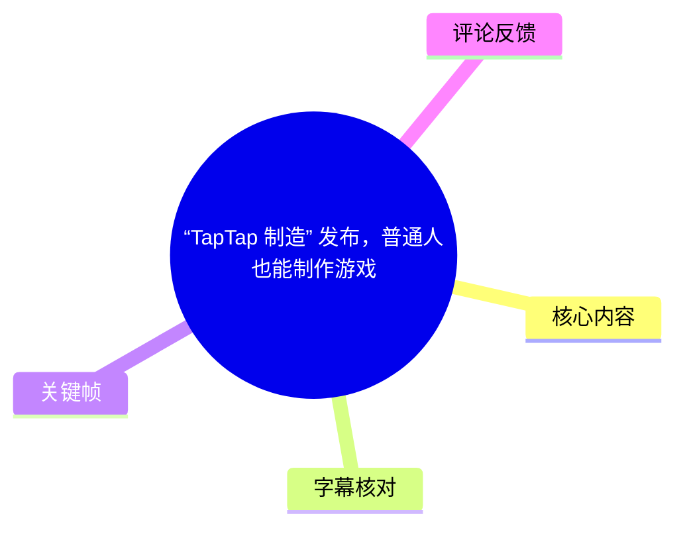
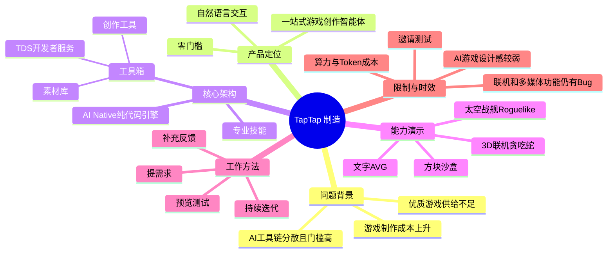
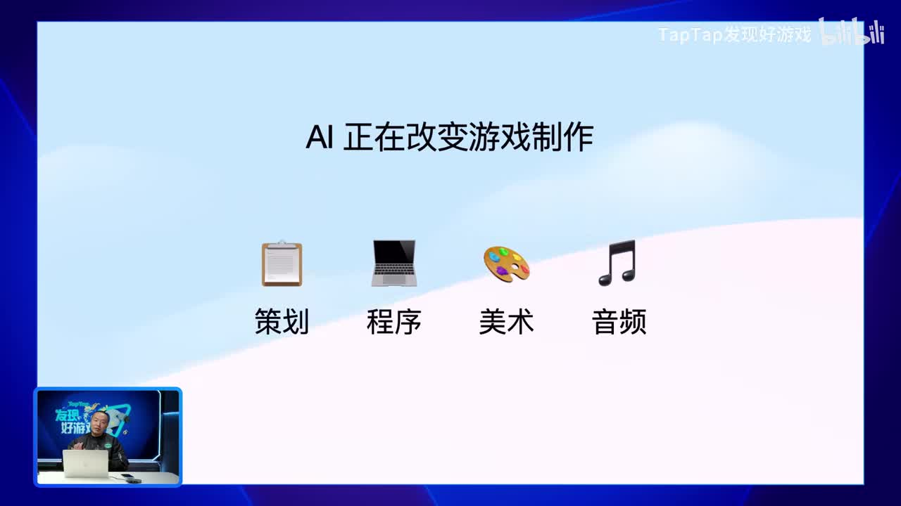
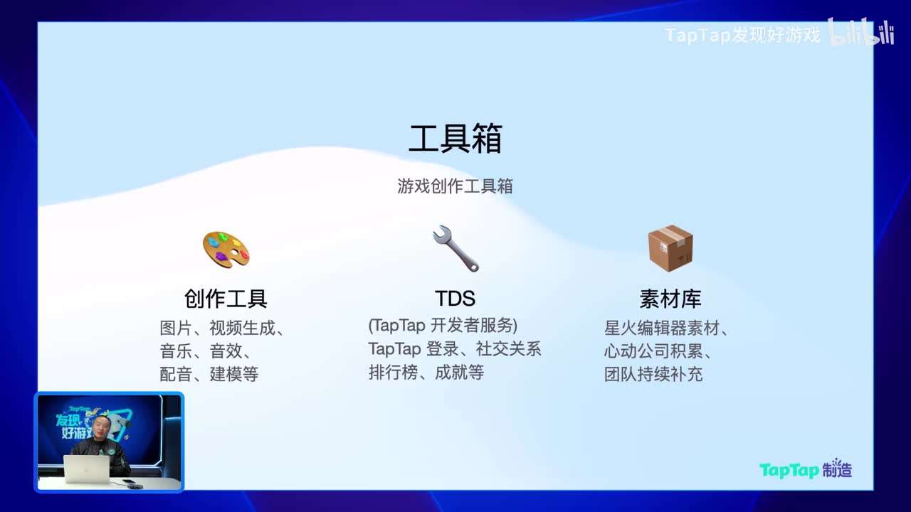
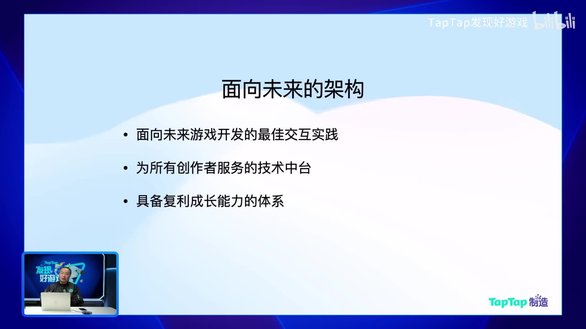
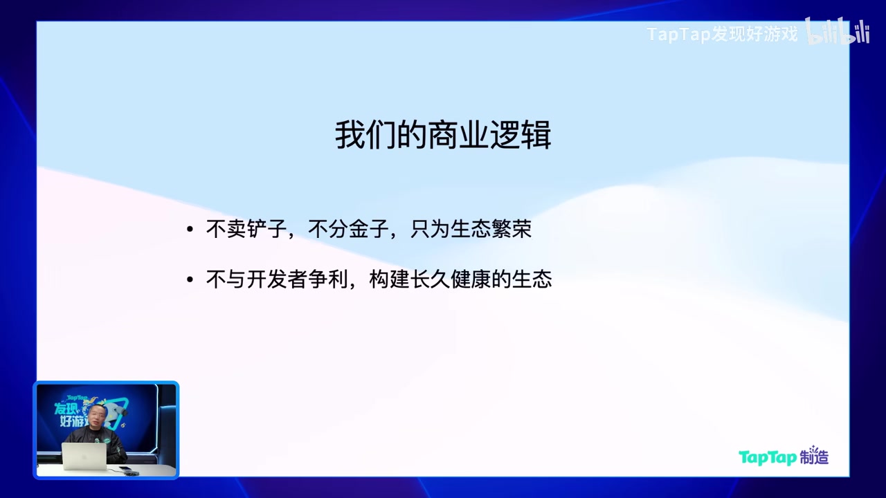

# “TapTap 制造” 发布，普通人也能制作游戏

> 来源：[Bilibili 视频](https://www.bilibili.com/video/BV1UC6zBoEvA)<br>
> UP 主：TapTap发现好游戏｜主讲：TapTap 创始人黄一孟｜时长：101 分 39 秒<br>
> 视频描述：围绕“TapTap 制造”发布与现场演示，说明 AI 游戏创作工具的架构、能力、限制及邀请测试计划。

## 小结

TapTap 发布了定位为“零门槛、一站式游戏创作智能体”的 **TapTap 制造**。黄一孟的核心判断是：AI 已能覆盖策划、程序、美术、音频等多环节，但普通人要真正用 AI 做游戏，仍面临开发环境、模型选择、工具调用、游戏引擎与部署运营等门槛；TapTap 制造试图把这些环节封装为自然语言交互。

产品的技术主张并非传统可视化编辑器，而是面向 AI 的**纯代码驱动、AI Native 游戏引擎**。视频称，该引擎基于此前“星火编辑器”的积累，具备工业级 3D 渲染与物理能力，支持 PC、Mac、手机、平板，并内置联网、运营和 TapTap 开发者服务（TDS）接入能力。创作者以对话提出需求，智能体负责调用资源、工具和服务。

演示覆盖了多个可运行原型：两小时制作的 3D 联机贪吃蛇；参考《土豆兄弟》的 3D 太空战舰 Roguelike；现场生成并持续迭代的方块沙盒游戏；以及文字 AVG 原型。展示的实际工作方式不是“一句话完成游戏”，而是“提出需求—预览—发现问题—补充上下文/错误信息—持续修改”的循环；创作者仍需判断玩法、美术、交互和体验好坏。

视频明确暴露了产品处于早期测试阶段：首次创建项目需等待云端资源分配；语音输入、预览、手机登录、TNT 爆炸、流水、联网大厅、音效、视频播放、音乐生成等均出现过问题。黄一孟也承认 AI 的游戏 sense 较弱、上下文有限、生成图像一致性不足，复杂项目依赖清晰架构与持续人工投入。

商业上，视频宣称 TapTap 制造“不向玩家收费”“不卖铲子、不分金子”，希望通过创作者与玩家汇聚形成生态；但同时说明由于 Token、算力与服务器成本较高，产品上线初期采取**预约与邀请测试**，并限制接入规模。因此，“免费”“全平台”“一站式”等均应理解为视频发布时的产品方向及官方表述，实际开放范围、能力、资费和规则可能随版本变化。

## 思维导图





## 目录

- [发布背景：为何要做游戏创作智能体](#发布背景为何要做游戏创作智能体)
- [产品架构：引擎、工具箱与专业技能](#产品架构引擎工具箱与专业技能)
- [生态、商业逻辑与邀请测试](#生态商业逻辑与邀请测试)
- [演示一：两小时制作的 3D 联机贪吃蛇](#演示一两小时制作的-3d-联机贪吃蛇)
- [演示二：方块沙盒的自然语言迭代](#演示二方块沙盒的自然语言迭代)
- [演示三：Roguelike 项目、调试与项目架构](#演示三roguelike-项目调试与项目架构)
- [演示四：联机、文字 AVG 与素材替换](#演示四联机文字-avg-与素材替换)
- [可复用的创作步骤与经验](#可复用的创作步骤与经验)
- [功能边界、限制与时效性](#功能边界限制与时效性)
- [字幕比对](#字幕比对)
- [评论分析](#评论分析)
- [处理记录](#处理记录)

## 发布背景：为何要做游戏创作智能体 [00:00:50](https://www.bilibili.com/video/BV1UC6zBoEvA?t=50)

黄一孟从 TapTap 创立约十年的目标“发现好游戏”讲起。视频中的问题定义有两面：

1. **玩家侧供给不足**：TapTap 每天有数百万玩家寻找游戏，但官方观察是，仍有不少玩家找不到符合自身偏好的作品。
2. **开发侧成本上升**：中小开发者承受资金和制作成本压力，一些熟悉的开发者被迫放弃游戏梦想；较大的游戏公司则因成本和容错压力趋于保守，类型与商业模式容易同质化。
3. **结果**：新游戏容易变得“越来越无聊”，而 TapTap 希望解决的问题是：如何让开发者以更低成本制作更多优质游戏。

视频将 AI 视为机会：AI Coding、策划辅助、图像、视频、音乐、音效等能力在近一年到一年半内快速提高。但主讲人没有把这直接等同于“普通人已能轻松做游戏”，而是指出现实障碍：

- 仍可能需要安装 IDE、Cursor、Claude Code 等工具；
- 仍难以绕开游戏引擎；
- 高质量模型通常收费且成本不低；
- 没有单一 AI 可以独立完成游戏创作全链路；
- 个人必须承担工具整合、工作流协调与工程维护。



> 图：该画面用“策划、程序、美术、音频”概括了视频对 AI 游戏制作覆盖范围的判断，是理解产品为何强调“一站式”的背景信息。

基于这些前提，TapTap 将产品定义为“零门槛的一站式游戏创作智能体”，名称为“TapTap 制造”。视频中将其核心拆为三类：**游戏引擎、工具箱、专业技能**。

## 产品架构：引擎、工具箱与专业技能 [00:07:20](https://www.bilibili.com/video/BV1UC6zBoEvA?t=440)

### AI Native 的纯代码游戏引擎 [00:07:44](https://www.bilibili.com/video/BV1UC6zBoEvA?t=464)

黄一孟将传统游戏引擎及可视化编辑器描述为“为人而设计”的工具：拖拽、可视化编程和编辑器界面降低了人的使用难度，但对 AI 而言可能形成不透明的“黑箱”。其论点是：拖拽可完成的功能，被预设在编辑器的框架内，因而限制 AI 的自由扩展。

据视频表述，TapTap 放弃了原“星火编辑器”的图形化界面路线，转向：

- **完全 AI Native**
- **纯代码驱动**
- 对 AI 更透明、可控
- 让 AI 能从全局理解项目
- 不被预定义的编辑器参数或模块限制

视频声称该引擎具备如下底座能力：

| 能力 | 视频中的说明 |
| --- | --- |
| 3D 底座 | 工业级 3D 游戏底座 |
| 图形与物理 | 高性能渲染管线、物理引擎 |
| 平台 | PC、Mac、手机、平板 |
| 联网 | 内置联网对战，可开箱即用 |
| 网络指标 | 官方称可支持高并发、低延迟，但未给出具体数值 |
| 部署与运营 | 引擎底层内置线上运营相关能力，创作者无需自行处理部署、维护等问题 |
| 成本说法 | 主讲人称这些底层能力对创作者“完全没有成本”；具体可用范围及后续规则未在视频中展开 |

需要区分的是：这些是发布演讲中的产品描述，并非独立的性能测试结果。视频未披露引擎 API、最大并发、可支持项目规模、服务等级或基础设施配置。

### 工具箱：创作工具、TDS 与素材库 [00:10:52](https://www.bilibili.com/video/BV1UC6zBoEvA?t=652)

工具箱用于解决“编程只是游戏创作的一小部分”的问题。视频列举的内容包括：

- 图片与视频生成；
- 音乐、音频、音效、配音；
- 建模、动作、绑定；
- 多种管线、工序与模型的调用。

官方的设计目标是，创作者不需要自行研究每个领域应选什么模型、怎样部署、怎样控制用量及算力；平台和智能体负责选择并调用工具。



> 图：画面将工具箱拆分为三层，并明确列出图片、视频、音乐、音效、配音、建模等素材工具，以及登录、社交、排行榜、成就等服务，能直接对应正文的能力划分。

#### TDS（TapTap 开发者服务）

视频称，TDS 可避免开发者重复实现以下基础功能：

- 用户登录与账号；
- 合规与防沉迷；
- 社交关系；
- 排行榜；
- 成就等。

过去即使有 TDS，开发者仍要完成接入工作；视频主张在智能体模式下，AI 已学会接入 TapTap 服务，因此游戏上线时这些能力可自然集成。该说法没有展示具体配置界面、接入权限或审核规则。

#### 素材库

素材库来源包括：

- 星火编辑器时期积累的模型、动作、技能、物件和地图；
- 心动公司既有游戏中“有机会复用”的素材；
- 未来持续补充的素材。

视频强调，这一层可弥补当前 AI 素材生成尚不完善的阶段性问题；但没有列出具体授权范围。因此，哪些素材可被创作者直接使用、商用或二次发布，仍需以产品实际条款为准。

### 专业技能（Skill）是长期积累层 [00:14:28](https://www.bilibili.com/video/BV1UC6zBoEvA?t=868)

“专业技能”是主讲人认为最稀缺的一层。其逻辑是：通用大模型虽然能涉足游戏，但游戏开发中有大量互联网公开内容之外的经验，例如玩法架构、交互规范、跨端 UI、资源流程、项目约束与调试方式。

视频将专业技能分为三个层级：

1. **平台级技能**：TapTap 沉淀的游戏制作知识，例如某类游戏的结构、UI 如何兼容手机与 PC。
2. **项目级技能**：某一个项目自己的美术、角色、配音、参考图、世界观和工作规范。
3. **创作者级/跨项目技能**：创作者跨多个项目可复用的偏好与知识。

该机制的目标是让知识持续沉淀、复利增长，而非每次对话从零开始。



> 图：画面浓缩了官方架构目标，尤其说明产品并不只被定义为单次生成工具，而是服务创作者的技术中台与可累积知识体系。

## 生态、商业逻辑与邀请测试 [00:16:15](https://www.bilibili.com/video/BV1UC6zBoEvA?t=975)

### 核心优势与生态闭环

视频概括的优势包括：

- **开箱即用**：引擎、知识、工具、资源整合；
- **免部署**：每位创作者拥有云端独立环境，类似一台云端电脑；
- **智能体扩展性**：可联网搜索、学习新工具、编写所需工具；主讲人举例称，即使当前没有视频生成功能，智能体也可尝试学习视频生成 API 的接入方式；
- **TapTap 生态**：从创作、上线到被玩家游玩，尽量不要求创作者离开平台或频繁复制粘贴。

视频还提出，玩家反馈是创作循环的重要组成部分：创作者将游戏发布在 TapTap 后，可获得玩家建议并持续迭代。

### 对“一句话做游戏”的校正 [00:18:15](https://www.bilibili.com/video/BV1UC6zBoEvA?t=1095)

主讲人明确否认“有 AI 就能一句话做出好游戏”的理解。视频强调：

- 产品仍有局限和限制；
- 创作者仍需要投入时间和精力；
- AI 是与人共同打磨作品的工具；
- AI 的不足不应被绝对化，但也不能被高估；
- 未来交互应支持自然语言、图片、视频等类似聊天软件的输入方式。

对于普通游戏爱好者，平台的目标不是替代审美、玩法判断与创意，而是降低“把想法变成可试玩作品”的额外成本。

### 商业逻辑与测试节奏 [00:26:09](https://www.bilibili.com/video/BV1UC6zBoEvA?t=1569)

视频中的商业表述为：

- 不向玩家收费；
- “不卖铲子，不分金子，只为生态繁荣”；
- 不与开发者争利，试图建设长期可持续生态。



> 图：该页是官方对商业模式最明确的表述。它说明愿景，但不构成对未来收费、分发、分成或资源配额政策的完整承诺。

**时效性与限制**：产品从视频发布当天起开放预约和邀请测试。官方解释采用邀请测试的原因是：

- 游戏创作智能体当前成本较高；
- Token 消耗、算力消耗和服务器要求较高；
- 前期需要限制规模以保证服务质量；
- 官方希望受邀创作者实际做游戏，并尝试把作品上线；
- 项目在公司内测约一个月，仍持续接收反馈和调整；
- 后续将随着算力、运营能力和版本完善扩大邀请范围，并可能优先邀请有想法或有制作能力的人。

因此，本视频中的可用性结论应表述为：**当时已开始预约和邀请测试，而非全面无条件开放。**

## 演示一：两小时制作的 3D 联机贪吃蛇 [00:30:36](https://www.bilibili.com/video/BV1UC6zBoEvA?t=1836)

黄一孟先展示了一款据称由自己制作的贪吃蛇游戏。视频称该作品的代码、图形、音乐均由 AI 制作，并强调其价值不在于“简单贪吃蛇”本身，而在于从 2D 匹配场景转入 3D 联机玩法的变化。

### 演示特征

- 初始是类似传统 2D 贪吃蛇的联网匹配场景；
- 匹配成功后出现“金色豆子”；
- 镜头拉远、冲破墙体，转入 3D 世界；
- 支持缩圈；
- 墙体碰撞包含粒子效果；
- 有加速道具、一次免死的防护罩、隐身幽灵等；
- 缩圈挤压到蛇身时，后半段会被挤爆，身体缩短；
- 支持鼠标跟随式操作，不需要键盘；
- 主讲人称该原型约花费两小时完成。

视频并未提供项目文件、提示词、模型清单或可复现的制作日志，因此“两小时”“全部由 AI 制作”等为演示者的自述。

### 现场错误处理 [00:34:20](https://www.bilibili.com/video/BV1UC6zBoEvA?t=2060)

演示切回 TapTap 制造界面后，左侧为创作对话，右侧为游戏预览。发生错误时，主讲人展示了当前的处理方式：

1. 从预览或引擎中复制错误信息；
2. 将错误交给 AI；
3. AI 尝试定位并修复问题；
4. 重新预览验证。

他同时说明，未来希望把“复制错误给 AI”的步骤自动化；现场出现的错误最后判断为网络问题，没有实际修复。

这揭示了产品当前更真实的使用状态：用户不必理解全部代码，但某些异常信息仍可能需要人工确认、转交和复测。

## 演示二：方块沙盒的自然语言迭代 [00:35:40](https://www.bilibili.com/video/BV1UC6zBoEvA?t=2140)

现场第一个从零创建的项目是“给我做一款我的世界”式的方块沙盒原型。视频不是在宣称复刻《我的世界》，而是用其作为可识别的方块建造玩法示例。

### 创建与资源分配

首次创建时，出现了语音输入法问题。随后主讲人解释首次项目启动较慢的原因：

- 每一个游戏项目会分配独立云主机/云端电脑；
- 当时未进行预热，首次创建从头分配资源；
- 未来正式上线后计划预先开启更多云端电脑，减少等待时间。

这也是“云端独立环境”在实际使用中带来的启动成本。

### 基础玩法与增量需求 [00:42:34](https://www.bilibili.com/video/BV1UC6zBoEvA?t=2554)

生成后的基础原型支持：

- 右键堆砖；
- 左键消除模块。

主讲人随后按自然语言提出增量需求：

1. **丰富环境**  
   “整体还可以，但太单调”，要求加入树、草和更多物件。
2. **加入 TNT 道具**  
   需要爆炸、明显砖块效果、粒子效果、火花四溅和屏幕震动。
3. **优化工具栏图标**  
   要求以程序重绘简单但更易辨识砖块类别的图标。
4. **修正 TNT 行为**  
   初版未自动爆炸，之后要求“放出来以后自己爆，不需要敲”。
5. **迭代视觉效果**  
   要求 TNT 在闪烁时仍能呈现 TNT 形象，而不只是色块。
6. **实现流水**  
   要求同高度砖块被打破后，水能流向相邻平面。
7. **转为多人联机**  
   通过一句“把这个游戏做成可以多人联机”发起较大改动。

### 代码级实现的主张 [00:48:27](https://www.bilibili.com/video/BV1UC6zBoEvA?t=2907)

主讲人强调 TNT 并非预先配置好的编辑器模块拼装，而是智能体在代码层面搜索和实现的功能。因此，官方的论点是：只要能通过代码表达，就不受传统编辑器预设模块和参数限制。

但现场也展示了相应代价：

- 预览界面发生 Bug；
- TNT 最初不爆炸；
- 后续出现炸弹不消失等错误；
- 需要复制错误代码给 AI；
- 流水在敲砖块时可工作，但被 TNT 爆炸破坏地形后未正确流动；
- 联机生成后大厅、角色重叠、音效等仍有问题。

这说明“代码级可扩展”不等于“首次生成即可正确运行”。

## 演示三：Roguelike 项目、调试与项目架构 [00:38:42](https://www.bilibili.com/video/BV1UC6zBoEvA?t=2322)

主讲人展示了自己投入时间较长的一款太空战舰游戏，玩法参考《土豆兄弟》，并称先让 AI 协助学习相关玩法与设计、形成游戏文档，再进行开发。

### 已展示的玩法与内容

- 3D 太空战舰题材；
- 20 波敌人，坚持后通关，最后有 Boss；
- 每轮结束有补给和武器选择；
- 武器可刷新、购买、形成套装属性、合成、升级；
- Roguelike 成长发生在局与局之间；
- 战舰上的炮塔会转动，尾部有烟效；
- 演示了类似太空跳跃的转场动画；
- 所有声音、图片、配音据称由 AI 制作；
- 角色、剧情跳过、战败图片随机化、武器世界观小故事等细节均可通过对话逐步补齐。

视频特别提到，3D 场景的部分元素可以直接通过引擎与代码生成，未必需要先调用独立生成式 3D 模型。

### 调试模式是新手应补齐的能力 [00:43:36](https://www.bilibili.com/video/BV1UC6zBoEvA?t=2616)

由于产品不以传统编辑器为核心，主讲人建议创作者自己建立调试入口。其示例是：

- 在游戏内点击版本号“0”打开调试/作弊模式；
- 快速跳到第 10 波、第 20 波；
- 建立仅含 Boss 的测试关卡；
- 单独验证 Boss 多阶段机制；
- 单独测试武器、敌人、特效和数值。

可复用经验是：即使 AI 帮助编写代码，**可快速验证单一变量的测试场景**仍然重要。否则每次测试后期内容都必须重新完整游玩，迭代成本会迅速上升。

### 全平台适配与云端协作 [00:44:37](https://www.bilibili.com/video/BV1UC6zBoEvA?t=2677)

视频展示并声称：

- 游戏同时支持 PC 和手机；
- 横屏、竖屏可自适应；
- TapTap 制造本身也可在手机端完整运行；
- 对话状态可同步；
- 因项目运行在云端电脑上，任意设备都可继续交互；
- 主讲人称自己约一半创作时间在手机上完成。

但现场手机投屏失败，且手机端需扫码登录。因此可以确认的是视频展示了移动端访问意图与部分界面，不能据此推导所有设备、所有游戏和所有网络环境下均已稳定支持。

### 大项目的上下文与工程结构 [01:01:18](https://www.bilibili.com/video/BV1UC6zBoEvA?t=3678)

视频对复杂项目给出的关键经验是：

- AI 的上下文能力有限；
- 文档、注释、代码结构清晰，会显著提高 AI 理解项目的效率；
- 云端电脑保留项目文档、代码和库，AI 可以查找既有实现；
- 未来计划由后台 Agent 持续帮助优化项目架构；
- 仅在单一聊天窗口中使用传统 AI，难以掌握大型项目规模。

主讲人展示的太空战舰项目，称陆续制作约两周、代码接近 **5 万行**，包含复杂 Roguelike 模块和大量武器系统，并认为其可扩展性较强。该行数和开发时长均是演示者口述，视频没有展示可核验的仓库。

## 演示四：联机、文字 AVG 与素材替换 [01:06:42](https://www.bilibili.com/video/BV1UC6zBoEvA?t=4002)

### 联机是大改动，不保证一次成功

为方块沙盒增加多人联机时，主讲人直接下达“做成可以多人联机”的指令，并承认这是较大的改动，需要智能体处理。后续演示结果显示：

- 默认大厅/房间模块属于暂时过渡方案；
- 理想状态是像贪吃蛇一样随时进入和退出，不必手动开房；
- 实测中人物发生重叠、场景混乱；
- 音效未正常播放；
- 主讲人判断可能存在联网问题；
- 联机音效比单机音效更麻烦，因为需要网络同步；
- 后续希望实现直接进入即多人、并可使用 AI 玩家辅助调试。

这部分是视频中最重要的“限制展示”之一：引擎宣称具备联网能力，但现场生成的联网玩法仍需要较多工程化调试。

### 文字 AVG 是当前较容易的类型 [01:07:11](https://www.bilibili.com/video/BV1UC6zBoEvA?t=4031)

现场还创建了二次元文字冒险 AVG Demo，需求包括：

- 一段小剧情；
- 对话；
- 角色和背景；
- 调用工具生成画面。

视频称 Galgame/文字类游戏是当前引擎“最简单”“毫无难度”的方向之一，能够处理配音、配乐、图像和设定。不过演示过程中，配音和音乐生成较慢，音乐服务疑似超时，最终选择跳过背景音乐以先处理配音问题。

主讲人的进一步判断：

- AI 生成故事往往“很普通”；
- 创作者仍要提供真正的故事、表达和审美；
- AI 适合执行与扩展，而非自动替代创作判断；
- 像素图可生成，但一致性、像素数量和精度仍可能有问题；
- 现在可以先开工，等待图像模型进步后再整体替换美术。

### 美术替换、图片输入与多线程对话

视频展示了以下交互能力：

| 操作 | 视频中的用法 |
| --- | --- |
| 截图输入 | 将当前游戏画面截图发给 AI，让其理解“图片放大一倍”等视觉要求 |
| 素材上传 | 可上传本地图片和音频 |
| 图片标注 | 可圈定对象，例如指出“这棵树太大，要砍掉” |
| 美术整体替换 | 把二次元 AVG 改为中国武侠、水墨风角色和背景 |
| 多对话并行 | 一条对话处理剧情/文档，另一条处理代码、结构或美术 |
| 文档驱动 | 上传策划文档，要求 AI 提取和实现其中描述 |
| 外部内容参考 | 可粘贴其他项目代码、文档，甚至 GitHub 链接供智能体参考 |

关于 GitHub 链接或其他平台项目“直接照着做”的说法，视频没有讨论授权、许可证、第三方版权或代码依赖处理。实际使用时必须自行确认内容来源的合法性与可再利用范围。

## 可复用的创作步骤与经验 [00:52:15](https://www.bilibili.com/video/BV1UC6zBoEvA?t=3135)

下面按照视频实际演示整理一套适用于此类 AI 游戏创作工具的工作流。它不是官方固定教程，而是从黄一孟多次操作中归纳的实践顺序。

### 1. 先写清“可验证”的最小需求

不要只说“做个好游戏”，而应包含玩法、视觉、交互与验收条件。例如视频中的 TNT 需求具有明确结构：

```text
做一个 TNT 炸药道具：
- 放置后自动爆炸，不需要敲击；
- 有明显砖块破碎效果；
- 有爆炸粒子与火花；
- 画面震动体现威力；
- TNT 闪烁时仍能看出 TNT 的外观。
```

关键经验：把“想要什么效果”说具体，尤其描述触发条件、视觉结果、交互方式和失败条件。

### 2. 先做最小可玩原型，再逐项扩展

视频中的方块沙盒不是一开始就要求地形、植被、流水、爆炸、联机和音效全部完成，而是按顺序迭代：

1. 基础放置/消除方块；
2. 增加树、草、物件；
3. 增加 TNT；
4. 修正 TNT 自动爆炸；
5. 改善图标和视觉；
6. 实现流水；
7. 再尝试联机与音效。

这种分解可让每次改动有清晰反馈，避免复杂需求同时失败时无法定位问题。

### 3. 为测试主动设计调试入口

建议在项目早期加入：

- 关卡跳转；
- 波次跳转；
- 单 Boss 测试场；
- 单武器测试场；
- 资源、技能、数值的快速配置入口；
- 版本号或隐藏按钮打开调试模式。

这不是仅面向专业程序员的工程习惯。视频的立场是：即使新手不懂代码，也应学会要求 AI 建立这些测试能力。

### 4. 用“现象 + 预期 + 参考对象”反馈 Bug

视频中对爆炸特效的反馈不是只说“不对”，而是指出：

- 当前错误表现：黄色圆球；
- 预期效果：类似敌人死亡时的黄色爆炸粒子；
- 参考来源：其他敌人的死亡效果；
- 调整要求：把粒子效果放大约 50%。

推荐模板：

```text
当前现象：……
预期行为：……
触发条件：……
参考对象/已有实现：……
验收标准：……
```

这类结构化反馈可减少模型将“修复”理解为表面替换的概率。

### 5. 将错误信息交给 AI，但必须复测

视频中复制错误代码给 AI 被认为是目前仍不完善的步骤。处理流程应是：

1. 保存错误现象和复现步骤；
2. 将引擎报错、截图或日志交给 AI；
3. 让 AI 说明修改点；
4. 在原触发条件下复测；
5. 继续测试相邻场景，例如“敲方块流水”修复后，还要测试“TNT 炸方块流水”。

视频里的流水案例说明：一个局部测试通过，并不意味着所有触发路径都已正确。

### 6. 复杂项目使用文档与并行对话

视频推荐至少开两条对话：

- **剧情/设计线程**：讨论世界观、剧情、角色、关卡、文档；
- **实现/美术线程**：处理代码、系统架构、素材与 UI。

当设计文档确认后，再要求实现线程根据更新后的文档同步修改游戏。对于大型项目，应持续要求 AI：

- 总结当前目录与模块；
- 统计或说明代码结构；
- 检查模块边界；
- 补充文档与注释；
- 定期重构。

### 7. 创作者保留最终判断权

视频反复强调 AI 不是“自动做出好游戏”的保证。创作者最不可替代的职责包括：

- 判断玩法是否好玩；
- 判断数值、武器、节奏是否合适；
- 判断美术是否一致；
- 决定剧情和主题；
- 识别“看似完成但体验不对”的结果；
- 选择何时继续修、何时收敛范围。

## 功能边界、限制与时效性 [00:56:34](https://www.bilibili.com/video/BV1UC6zBoEvA?t=3394)

### 视频明确承认的限制

| 限制 | 视频依据 |
| --- | --- |
| 不是一句话完成好游戏 | 主讲人明确要求不要高估 AI |
| AI 游戏 sense 较弱 | AI 能编程、能生成武器类型，但好效果仍需人反复调整 |
| 上下文有限 | 大项目需靠文档、注释、清晰架构和后台 Agent 维持可控性 |
| 图像一致性不足 | 像素图等素材的尺寸、精度与一致性可能不稳定 |
| 首次创建项目慢 | 云端电脑资源分配且当时未预热 |
| 配音、配乐与批量美术耗时 | 视频称生成时间较长，未来考虑 Agent 集群等优化方向 |
| 复杂联机成本高 | 水流、爆炸等状态要同步渲染，工作量大 |
| 当前产品仍有 Bug | 现场出现预览、TNT、手机登录、联机、音效、视频播放和音乐生成问题 |
| 仍可能需要人工转交错误 | “复制错误给 AI”尚未完全自动化 |
| 测试名额有限 | 算力、Token、服务器资源限制导致邀请测试 |

### 关于“支持所有游戏类型”的审慎理解 [01:11:29](https://www.bilibili.com/video/BV1UC6zBoEvA?t=4289)

主讲人表示，理论上引擎不应限制游戏类型，差别在于“做得轻松”还是“需要投入更多精力”；并称 MOBA、DOTA 类是星火引擎擅长方向，文字游戏也较容易制作。

但从现场证据看，更合理的理解是：

- **可表达性**：纯代码引擎原则上可描述很多类型；
- **可生成性**：AI 能否在有限轮次内写出可靠实现，取决于工具、知识和项目复杂度；
- **可玩性**：需要创作者测试、平衡和设计；
- **可发布性**：仍取决于账号、合规、内容审核、平台规则、版权与运营等未展开条件；
- **可维护性**：大型项目仍受上下文、架构与工程纪律影响。

### 版权、合规与外部内容风险

视频提到可上传素材、粘贴文档、参考外部代码或 GitHub 链接，也有评论提出将网络小说、漫画、影视等内容游戏化的设想。视频没有给出这些情形的授权和审核规则。

因此应避免将“技术上可以导入/参考”理解为“法律上可自由发布”。尤其涉及小说、漫画、动画、影视 IP、他人代码、素材库资产或声音时，必须确认：

- 是否拥有改编权、复制权、信息网络传播权等必要授权；
- 开源代码许可证是否允许目标用途；
- AI 生成内容及第三方素材是否满足平台规则；
- 游戏发布是否涉及防沉迷、实名认证、内容审核等合规义务。

## 字幕比对

| 字幕来源 | 完整性 | 专有名词 | 时间轴 | 主要问题 |
| --- | --- | --- | --- | --- |
| Bilibili 站内字幕 `p01-ai-zh.srt` | 不可用 | 与视频主题完全不符 | 虽有时间码，但仅约 9 分 23 秒 | 内容为“369 兰博复盘”等英雄联盟解说，显然属于错误关联字幕 |
| 本次 ASR 字幕 | 高，覆盖约 79.08% 语音时长 | 可结合上下文校正 | 完整覆盖至 01:41:30，含真实分段时间 | 自动识别中存在“TypeType”“游行”“卢尔”等误识别，以及个别英文、产品名和术语不稳定 |

### 最终字幕选择

本稿以**本次 ASR 时间轴字幕**为主。原因是：

1. 站内字幕内容与本视频标题、主讲人、演讲画面完全不一致，不能用于事实整理；
2. 本次 ASR 检测到中文音轨，语言置信度约 `0.9795`，总时长 `6098.24` 秒；
3. ASR 带有逐段时间戳，且主题与演讲内容一致；
4. `asr-result.json` 未标记 `noAudioStream=true`，说明源视频存在音轨，本次 ASR 不是无音轨条件下的替代方案。

### 通过上下文与画面校正的重要词语

| ASR 常见识别 | 本稿采用 | 校正依据 |
| --- | --- | --- |
| TypeType / Tap Tap Maker | TapTap 制造 | 视频标题、演讲上下文、画面右下角品牌标识 |
| U3D、Nreal | Unity、Unreal 的泛称表述 | 演讲语境为常见游戏引擎；原音自动转写不稳定 |
| 卢尔 | Lua | 讨论开发语言与星火编辑器积累时的语境 |
| Gale Game | Galgame | 讨论视觉小说/恋爱冒险游戏类型 |
| Look Like | Roguelike | 主讲人描述《土豆兄弟》式局外成长结构 |
| TDS | TapTap 开发者服务 | 演讲明确展开说明，关键帧亦显示该缩写 |
| “资源引擎” | 游戏引擎 | ASR 该处存在近音误识别，后续演讲完整说明引擎能力 |

## 评论分析

以下仅处理可获取的热评前三条；评论代表用户期待，不构成产品已验证能力或官方承诺。

### 1. SuperQ_Louis：期待上传自己的海战游戏

> “等我的海战游戏完全开发出来，我也要上传到 Taptap 上去……”

- **观点**：对 TapTap 作为发布与分发平台抱有积极预期，希望将未来完成的海战游戏上传。
- **补充价值**：反映用户将“TapTap 制造”理解为“创作—上传—被玩家玩到”的生态闭环，而不只是本地生成工具。
- **可信度与边界**：这是个人创作计划，不代表已完成作品，也不能据此确认任何项目均可直接发布。视频虽提到从创作到上线的生态，但具体审核、上线资格及流程未展开。

### 2. 白笑飞FrancisOWO：希望将小说等内容转为可互动游戏

> 提议将网络小说、读物，甚至漫画、动画、影视作品做成游戏，并联想到教学游戏化。

- **观点**：认为 AI 工具可能让文本内容从“可观看”扩展到“可互动”，并带来小说互动化、粉丝二创和教育游戏化的潜力。
- **与视频的关联**：视频确实展示了文字 AVG、文档上传、剧情讨论、图片生成和外部文档参考，技术路径上与“文本转互动内容”存在关联。
- **重要风险**：评论本人也提及版权。小说、漫画、影视等内容的游戏化通常涉及改编授权，不能因工具可实现就默认可发布或商业化；教育场景还会涉及内容准确性、适龄性与数据合规等额外要求。

### 3. 孙䇿：素材库与现有 Godot 项目迁移需求

> 评论者正在用 Godot 边学边做游戏，认为素材制作很耗时，希望获得测试资格，并希望支持 Godot 项目迁移或 GDScript。

- **观点**：认可 AI 对加速独立开发的潜力，尤其看重素材库；提出“迁移 Godot 项目”和“支持 GDScript”的具体需求。
- **补充价值**：该评论指出创作效率瓶颈不只在代码，也在精灵图、素材与资源管理，这与视频强调“编程只是其中一小部分”相呼应。
- **可信度与边界**：视频仅展示了可粘贴代码、文档和 GitHub 链接进行参考的能力，并未确认对 Godot 工程、GDScript、场景文件或资源依赖的正式导入与迁移支持。因此该需求仍属用户建议，不能视为已上线功能。

## 处理记录

- Worker ID：`worker-mrj0wjed-b0c290ad`
- 模型：`gpt-5.6-terra`
- 使用素材与工具：视频元数据、关键帧目录、站内 SRT、ASR 结果与 ASR SRT、热评 JSON；依据 ASR 分段时间生成 Bilibili 时间轴链接。
- 字幕选择：检查了站内字幕与本次 ASR。站内字幕内容错误关联至其他视频，弃用；采用本次 ASR 的真实时间戳，并通过标题、演讲上下文与关键帧校正专有名词。
- ASR 音轨判断：`asr-result.json` 提供了 411 个分段、中文识别结果与约 79.08% 语音覆盖率；未出现 `noAudioStream=true`，据此确认源视频存在音轨。
- 关键帧选择依据：
  - `frames/frame-001.jpg`：展示 AI 覆盖策划、程序、美术、音频，适用于背景说明；
  - `frames/frame-002.jpg`：展示工具箱的创作工具、TDS、素材库三部分；
  - `frames/frame-003.jpg`：展示“面向未来的架构”的三项目标；
  - `frames/frame-004.jpg`：展示官方商业逻辑。
- 缓存清理：本次仅基于任务内提供的素材进行整理，未执行可报告的本地缓存清理操作。
- 未解决问题：
  - 未提供 TapTap 制造官网地址、具体申请入口、API、价格规则、服务条款或测试资格规则；
  - 未提供引擎版本、支持语言完整列表、性能指标、并发上限及导入格式；
  - 视频未给出素材复用、外部代码参考和 IP 改编的授权边界；
  - 演示中的若干联网、多媒体与预览问题是否已在后续版本修复，无法从本视频确认。
