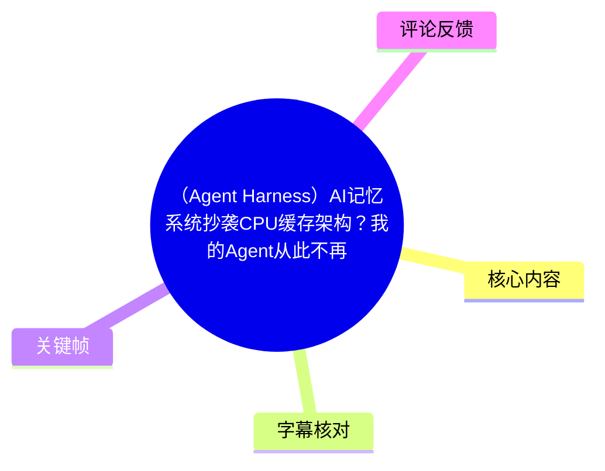
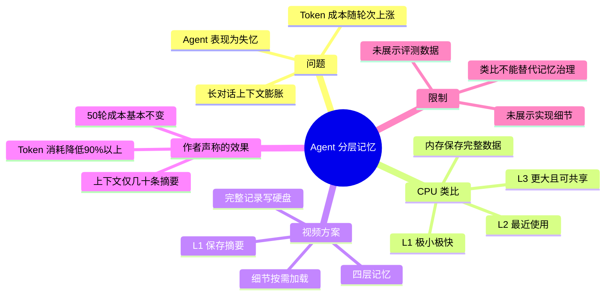
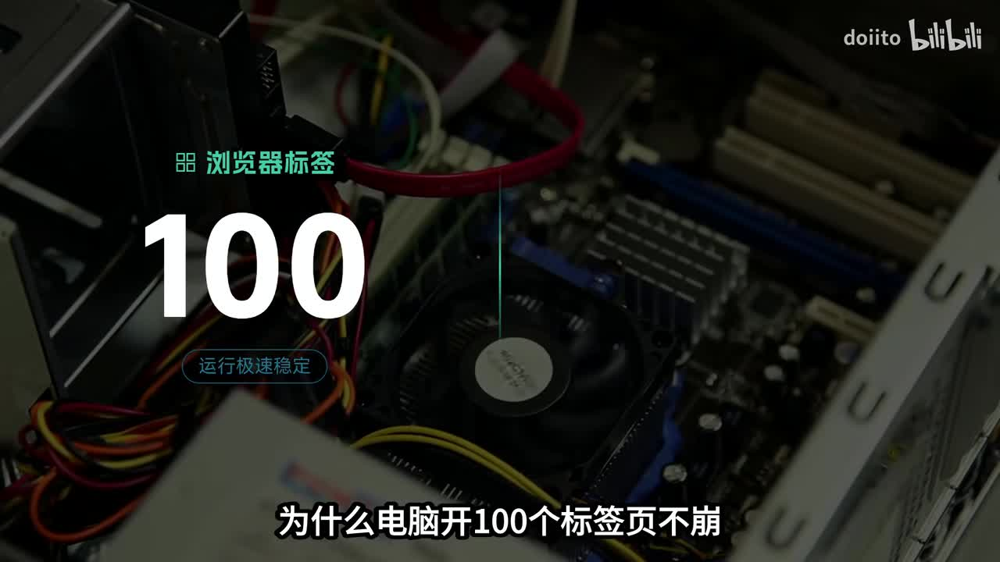
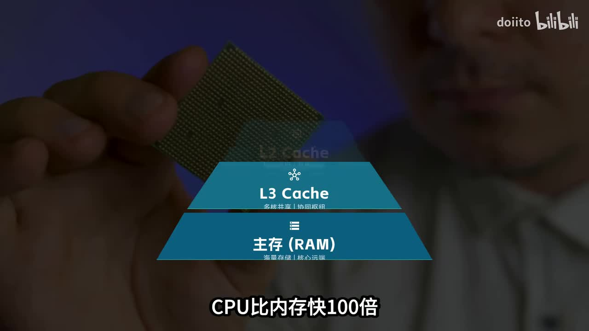
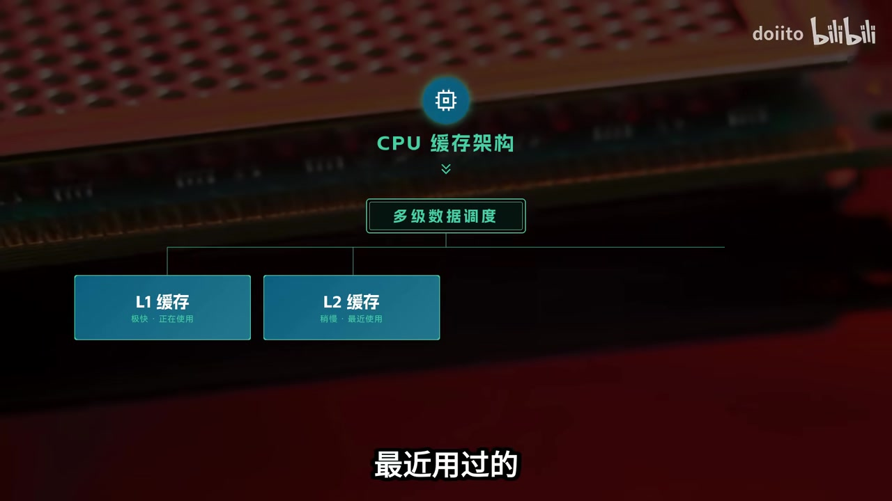

# （Agent Harness）AI记忆系统抄袭CPU缓存架构？我的Agent从此不再失忆

> 来源：[Bilibili 视频](https://www.bilibili.com/video/BV1SMVi6SEKa)  
> UP 主：doiito｜视频时长：01:20｜合集：AIcode  
> 项目链接（来自视频简介）：[Gitee / doiito / gliding_horse](https://gitee.com/doiito/gliding_horse)；[GitHub / doiito / gliding_horse](https://github.com/doiito/gliding_horse)

## 小结

视频将 AI Agent 的“多轮对话失忆”和 Token 成本递增问题，类比为 CPU 与内存之间的访问层级问题。作者的核心主张是：不要把完整历史会话持续塞进 LLM 上下文，而应像 CPU 缓存一样，按使用频率把信息分层；越常用的信息越靠近 LLM，越少用的信息越远离上下文窗口。

用于解释的 CPU 类比包括：L1 缓存很小但很快，保存正在使用的数据；L2 较大较慢，保存最近使用的数据；L3 更大、更慢且可由多核共享；内存容量最大但访问最慢，保存更完整的数据。视频以“CPU 比内存快 100 倍”说明层级化调度的动机；该数字是视频口播中的概括性表述，具体差异会随硬件和测试条件而变化。

作者称已据此实现“四层记忆系统”：L1 仅保留摘要，完整记录写入硬盘；上下文中维持“几十条摘要”，查询细节时再从硬盘按需加载。视频声称，该方案可使连续聊 50 轮后的 Token 消耗从“越聊越贵”变为“基本不变”，并“砍掉 90% 以上”。这些是作者对项目效果的陈述，视频没有展示压测方法、基线、Token 统计口径、检索准确率或延迟数据，因此不能将其视为已独立复现的性能结论。

适合关注 Agent Harness、长程记忆、上下文压缩、检索式记忆与成本控制的开发者参考。需要特别注意：CPU 缓存与 LLM 提示词上下文之间是设计类比，不是严格等价；实际系统仍需解决摘要失真、知识冲突、召回策略、权限隔离和持久化数据治理等问题。

## 思维导图





## 目录

- [问题：长上下文为何会成为 Agent 负担](#问题长上下文为何会成为-agent-负担)
- [CPU 缓存架构：分层与数据就近原则](#cpu-缓存架构分层与数据就近原则)
- [四层记忆系统：摘要常驻、原文落盘、按需加载](#四层记忆系统摘要常驻原文落盘按需加载)
- [项目与视频简介中的技术定位](#项目与视频简介中的技术定位)
- [结论、实施建议与限制](#结论实施建议与限制)
- [字幕比对](#字幕比对)
- [评论分析](#评论分析)
- [处理记录](#处理记录)

## [问题：长上下文为何会成为 Agent 负担](https://www.bilibili.com/video/BV1SMVi6SEKa?t=37)

视频以“电脑开 100 个浏览器标签页不崩，而 AI 聊 50 轮就开始失忆”为开场问题。这里的“失忆”并非指模型参数被删除，而是面向 Agent 应用时常见的工程现象：会话越长，持续注入上下文的成本越高；若为了控制上下文长度而截断、压缩或遗漏历史信息，模型就可能无法利用此前的重要约束、任务状态或事实。

作者将问题归因于“缓存没设计好”。按视频表达，LLM 的上下文窗口相当于最接近计算单元、但容量有限的 L1；若把大量原始记录长期留在这里，成本和干扰都会持续累积。这个判断描述的是一种上下文管理策略，而不是模型内部记忆机制的完整解释。



> 图：画面以“浏览器标签 100”“运行极速稳定”以及“为什么电脑开 100 个标签页不崩”为视觉引子。它清楚呈现了视频用计算机资源调度解释 Agent 长对话问题的叙事入口。

### 需要区分的两个层面

1. **上下文记忆（prompt / context）**：每轮请求中显式发送给模型的文本、摘要、工具结果和状态；视频主要讨论的就是这一层，直接影响输入 Token、延迟与注意力分配。
2. **模型参数（weights）**：通常的推理调用不会因单次提示词自动更新模型权重。视频没有讨论在线训练、微调或权重更新。
3. **外部持久化记忆**：数据库、文件、向量索引或图谱等可长期保存信息的系统。视频称将“完整记录扔硬盘”，属于这一类思路，但没有披露其具体存储格式与索引机制。

## [CPU 缓存架构：分层与数据就近原则](https://www.bilibili.com/video/BV1SMVi6SEKa?t=37)

作者用 CPU 的多级缓存解释其方案。视频口播给出的层级关系如下：

| 层级 | 视频中的定位 | 数据类型 / 使用状态 |
| --- | --- | --- |
| L1 | 极小、极快 | 正在使用的数据 |
| L2 | 稍大、稍慢 | 最近使用过的数据 |
| L3 | 更大、更慢 | 多核共享 |
| 内存（RAM） | 最大、最慢 | 保存所有东西 |

视频给出的抽象原则是：**越常用的数据，离 CPU 越近**。这是一种按热度和访问需求安排数据位置的思想；其价值并不在于把 AI 系统逐项映射为硬件，而在于避免让每次任务都面对全部历史数据。



> 图：画面叠加“L3 Cache”“主存（RAM）”与“CPU 比内存快 100 倍”的文字，帮助理解作者为何从硬件缓存层级引出 Agent 记忆分层。该图呈现的是视频的概念示意，而非项目运行截图或基准测试图。



> 图：画面直接标出“CPU 缓存架构”“多级数据调度”“L1 缓存：极快、正在使用”“L2 缓存：稍慢、最近使用”。它对应视频关于热点数据优先留在近端层级的关键论点。

### 类比的适用边界

CPU 缓存通常处理确定性的数据访问、硬件一致性和固定的读写路径；Agent 记忆则涉及自然语言语义、任务目标、摘要质量与检索排序。因而，“常用数据靠近模型”可作为系统设计原则，但不意味着缓存替换策略可以直接照搬为 Agent 记忆策略。

视频也没有交代以下实现关键点：

- “常用”如何计算：按访问次数、最近访问时间、任务相关性，还是人工标注；
- 摘要如何生成、何时刷新、是否保留事实来源；
- 硬盘中的完整记录如何建立索引、检索和排序；
- 多个 Agent、多个用户或多个项目之间如何隔离记忆；
- 摘要与原始记录冲突时如何回溯和纠错。

## [四层记忆系统：摘要常驻、原文落盘、按需加载](https://www.bilibili.com/video/BV1SMVi6SEKa?t=38)

在第二段 ASR 中，作者称自己“直接抄了这套架构”，并做了“四层记忆系统”。视频实际明确说出的操作链路如下：

1. **L1 只存摘要**：将上下文窗口中的信息压缩成摘要，而非持续保留完整历史。
2. **完整记录写入硬盘**：原始会话或完整记录不常驻上下文，转移至外部持久化位置。
3. **上下文仅保留几十条摘要**：作者称上下文里只保留“几十条摘要”；视频未给出确切条数、单条长度、摘要模板或最大 Token 预算。
4. **细节按需加载**：需要查询细节时，再从硬盘中取回。
5. **以分层替代全量累积**：目标是让对话轮数增加时，输入上下文不再无限线性膨胀。

### 视频声称的量化结果

作者称，在“聊 50 轮”的情景下，Token 消耗可从“越聊越贵”变为“基本不变”，并称能“直接砍掉 90% 以上”。这是视频中唯一明确的效果量级，但仍缺乏以下验证信息：

| 验证要素 | 视频是否提供 | 影响 |
| --- | --- | --- |
| 模型名称、上下文窗口 | 未提供 | 不同模型的成本与上下文行为不可直接比较 |
| 对话任务和数据集 | 未提供 | 无法判断结论是否适用于复杂任务、代码任务或多模态任务 |
| Token 计数范围 | 未提供 | 不清楚是否仅统计输入，是否含检索、摘要和工具调用 |
| 检索 / 摘要额外成本 | 未提供 | 外部加载、嵌入、重排和摘要也会带来成本与延迟 |
| 记忆正确率 | 未提供 | 节省 Token 不等于关键信息未丢失 |
| 与何种基线比较 | 未提供 | “90% 以上”缺少可复现的对照条件 |

因此，更严谨的表述应为：该设计**理论上可限制常驻上下文的大小，并可能显著降低长会话输入 Token 的增长趋势**；至于实际节省比例和质量损失，需要基于项目代码、配置及可复现实验进一步确认。

### 可从视频提炼的工程流程

下面的流程是对视频所述机制的整理，不是视频展示的代码或完整配置：

```text
收到新会话信息
  ↓
判断当前任务是否需要该信息
  ├─ 高频 / 当前必要 → 保留或更新到近端摘要层
  └─ 非当前必要 → 保留完整原文至外部存储
  ↓
构造 LLM 请求时
  ├─ 注入当前任务状态与少量摘要
  └─ 需要细节时，按需检索外部完整记录
  ↓
完成任务后
  └─ 生成、更新或淘汰摘要
```

实施此类方案时，应至少为每条摘要保留来源标识、时间、适用任务范围和原文定位。否则，一旦摘要发生错误压缩，系统难以回溯原始证据，也无法可靠地删除过期或冲突的信息。

## [项目与视频简介中的技术定位](https://www.bilibili.com/video/BV1SMVi6SEKa?t=62)

结尾处，作者再次概括原则：“越常用的数据离 LLM 越近，越不常用甩得越远”，并介绍项目名为 **Gliding Horse（流马）**，使用 Rust 编写，称前述内容“已经实现”，邀请观众前往 GitHub 查看。

视频简介还将项目描述为“用 Rust 构建的 AI Agent 操作系统”，并声称采用：

- 动态 PDCA 调度；
- JSON-LD 语义图谱；
- 代码级系统调用门；
- 运行时约束 Agent 行为；
- 将记忆、技能与知识整合为可追溯、可审计的工程资产。

这些内容属于视频元数据/简介提供的项目定位；本视频约 80 秒的口播重点仅在 CPU 缓存类比与分层记忆，没有演示上述机制的源码、接口、运行画面、配置方法或安全评测。阅读项目仓库时，应以仓库当前提交、文档和测试为准。

## [结论、实施建议与限制](https://www.bilibili.com/video/BV1SMVi6SEKa?t=62)

### 可迁移的经验

- 不要把“长期记忆”简单等同于“无限增加上下文”。
- 将当前任务状态、短期工作摘要、近期任务信息和完整历史分层，有助于控制输入规模。
- 摘要适合常驻上下文，但原始记录应可定位、可检索、可审计。
- 将“是否加载”作为独立决策步骤，通常比每轮无差别拼接历史更可控。

### 实施时应补齐的能力

1. **记忆分类**：至少区分稳定规则、用户偏好、任务状态、会话流水和可丢弃噪声。
2. **检索门控**：仅在任务需要时召回外部内容，并设置相关性阈值、Token 预算和结果数量上限。
3. **摘要版本化**：摘要需要关联原文和版本，避免多次压缩后事实漂移。
4. **冲突处理**：新旧规则或不同任务记忆发生冲突时，不能只按“最近”覆盖，应有优先级和人工校正入口。
5. **评测闭环**：同时测试成本、响应延迟、事实召回率、任务成功率和错误召回率，而非只统计 Token。

### 时效性与未验证项

- 视频元数据中的发布时间为 2026-06-01；项目仓库、接口、实现状态和性能可能在此后变化。
- “四层”“几十条摘要”“90% 以上”的表述均来自作者口播，视频未给出完整四层定义、容量参数和评测复现材料。
- “CPU 比内存快 100 倍”是为说明层级差异而使用的概括；实际硬件上的延迟和吞吐差异会因 CPU、内存、访问模式和指标不同而变化。
- CPU 缓存架构只提供启发式模型，不能替代对 LLM 上下文、RAG、持久化存储及安全边界的具体设计。

## 字幕比对

| 字幕来源 | 完整性 | 专有名词 | 时间轴 | 主要问题 |
| --- | --- | --- | --- | --- |
| Bilibili 站内字幕 | 未提供可用字幕 | 无法核验 | 无法使用 | 素材中没有可用站内字幕文件或分段文本 |
| 本次 ASR 字幕 | 覆盖 37.92–78.74 秒，共 3 段；诊断语音覆盖率为 51.64% | 存在误识别，如“缓写”“数损”“上下纹”“摘钥”“硬碟”“流码” | 提供 SRT 起止时间，可直接使用 | 分段过长，首段仅 0.36 秒却包含大量文本，明显不适合作为逐句精确定位依据 |

本次 ASR 已检查：识别语言为中文，语言置信度为 `0.9990234375`，模型为 `medium`，使用 CUDA 与 `float16`；检测到音轨，**未**标记 `noAudioStream=true`。因此不存在“源视频没有音轨”的情况。

最终以 **本次 ASR 的真实分段时间** 建立时间轴：`00:00:37,920`、`00:00:38,280`、`00:01:02,440`。但由于 ASR 分段异常粗糙，正文没有把其中每个词都当作精确时间点；章节链接只锚定所属的 ASR 段落起点。

结合关键帧文字与上下文，对 ASR 中的重要词语进行了谨慎校正：

| ASR 文本 | 正文采用 | 校正依据 |
| --- | --- | --- |
| 多级缓写 | 多级缓存 | 视频主题、CPU 缓存画面与语义 |
| 数损 | 数据 | “越常用的数据离 CPU / LLM 越近”的固定句式与语境 |
| 上下纹 | 上下文 | LLM Agent 记忆讨论语境 |
| 摘钥 | 摘要 | 作者随后说明 L1 仅保存摘要 |
| 硬碟 | 硬盘 | 中文语义等价，正文统一为简体常用写法 |
| 流码 | 流马 | 视频口播称项目中文名；项目英文名为 Gliding Horse |

## 评论分析

以下仅分析素材中可获取的热评前三条，不将评论观点直接视为事实。

### 1. 我为谁而狂：警惕“照搬”缓存层级与记忆污染

该评论认为，Agent 记忆具备多模态、短中长周期等特征，不能直接照搬 CPU 的三级缓存逻辑。评论建议区分“泛用记忆”和“任务/场景记忆”，分别采用长期加载与按需加载，并保留一个入口。

评论进一步以 Hermes 的使用体验为例，指出记忆空间满后反复压缩，可能使规则类、逻辑类信息在上下文中的占比下降，最终被杂乱或冲突信息污染。这一意见与正文中的“摘要漂移、冲突治理、记忆分类”风险相呼应，属于有价值的工程提醒；但其关于 Hermes 机制、比例和结果的描述是个人经验，未附可验证实验，不能据此泛化到所有记忆系统。

### 2. 赛博鲁班：将产品设计归因于 Token 商业模式

该评论认可视频提出的节省 Token 思路，并推测 Claude Code、Codex 等产品不采用类似架构，是因为其商业模式依赖 Token 消耗；同时将多 Agent、工作流等设计视作促使用户消耗更多 Token 的方式。

这是一种商业动机推测，不是视频提供的事实，也没有证据表明相关产品完全没有上下文压缩、缓存、检索或成本优化机制。评价 Agent 产品是否“故意烧 Token”，需要检查具体产品架构、计费规则、缓存策略和任务效果，不能仅由计费模式推导。

### 3. 悠久的旋律：提出“提示词会永久改变权重”的反驳

该评论反对 CPU 存储与模型 memory 的类比，并称模型 memory 存的是权重，且“每一个 prompt 都会影响模型权重”。评论试图强调 LLM 与传统存储架构的根本区别，这一点——即两者不应机械等同——值得保留。

但在通常的 LLM 推理调用中，输入提示词不会自动、永久地更新模型权重；提示词改变的是当前请求的上下文与输出分布。只有进入训练、微调或明确的在线学习流程时，权重才会被更新。因此，该评论对“类比不严格”的批评有合理部分，但其“每个 prompt 永久改变权重”的技术前提不适用于常规推理场景。

## 处理记录

- Worker ID：`worker-mrj0wbly-5dc4e50c`
- 生成模型：`gpt-5.6-terra`
- 已使用素材与工具产物：视频元数据、视频简介、`audio/audio.wav`、关键帧目录、ASR 结果 JSON、ASR SRT、热评 JSON；处理链路已产出合并视频、音频提取、关键帧提取、ASR 与评论抓取结果。
- ASR 工具信息：`medium` 模型，语言自动识别为中文，CUDA 推理，`float16` 计算类型；ASR 含时间戳。
- 字幕选择：站内字幕未提供可用文件；已检查本次 ASR，正文以 ASR SRT 的三段真实起止时间建立章节时间轴，并结合关键帧和语境修正明显错词。
- 关键帧选择依据：`frame-001.jpg` 用于说明“100 标签页”问题引入；`frame-002.jpg` 用于展示 L3 Cache 与 RAM 的层级；`frame-004.jpg` 用于呈现 L1/L2 与多级数据调度。未为未提供时间信息的关键帧编造精确时刻。
- 评论处理范围：仅处理可获取热评前三条，按“观点—补充价值—可信度/争议”分析。
- 缓存清理：未提供缓存清理执行日志；本记录不虚构已清理结果。
- 未解决问题：视频未提供四层记忆的完整定义、代码配置、检索与摘要策略、评测数据及可复现基线；“Token 降低 90% 以上”等效果仍待以项目仓库和独立实验验证。
