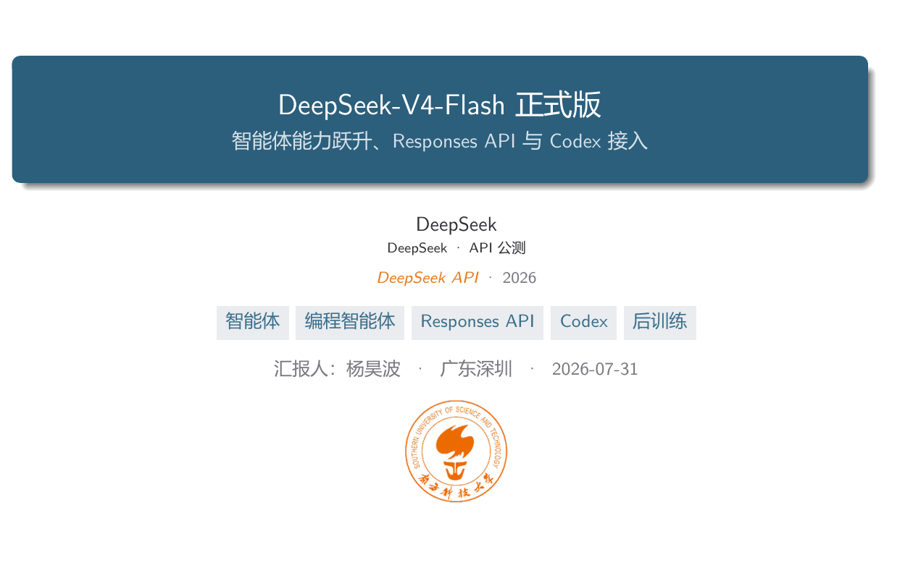
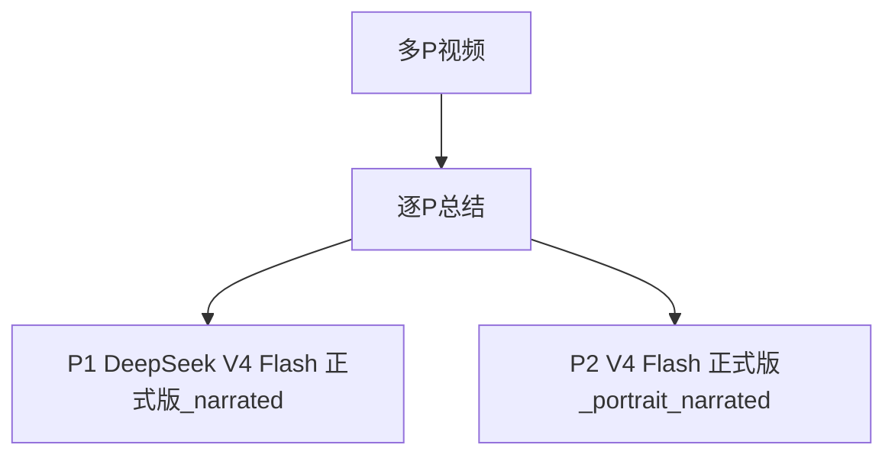

# 【突发】DeepSeek V4-Flash 正式版 — 智能体跃升，原生Responses API直连Codex · 多P视频目录

## 小结

该父任务包含 2 个 P，当前已完成 2 个。每个 P 的详细总结单独存放，并保留稳定 CID 标识。

## 思维导图

## 目录

- [P1 DeepSeek V4 Flash 正式版_narrated](parts/cid-40477329517/summary.md) · 已完成
- [P2 V4 Flash 正式版_portrait_narrated](parts/cid-40477329534/summary.md) · 已完成

## 每 P 小结

### P1 DeepSeek V4 Flash 正式版_narrated

- 状态：已完成
- CID：40477329517
- [打开本 P 完整总结](parts/cid-40477329517/summary.md)

#### 小结

视频解读了 DeepSeek 于 **2026 年 7 月 31 日**发布的 `DeepSeek-V4-Flash-0731`（简称 V4-Flash 正式版）API 公测。其定位并非新架构或全产品线换代，而是一次主要面向**编程智能体与开发者工作流**的后训练升级：模型结构、尺寸、模型名称、基础地址和既有调用方式保持不变，因此已有 V4-Flash API 用户被描述为可“零迁移”使用。

能力层面，视频依据 DeepSeek 发布图称，V4-Flash-0731 在列出的 9 项智能体基准上均超过 V4-Flash Preview 与 V4-Pro Preview；其中 DeepSWE 的绝对提升最大，相较 Flash Preview 提升 **47.1 个百分点**，相较 Pro Preview 提升 **41.6 个百分点**。但视频也明确提示：这些结果为厂商公布数据，且包含内部 DSBench 测试集，不能直接等同于跨厂商、完全可复现的独立结论。

本次最有实际接入价值的更新是原生 **Responses API**。视频称该能力目前只由 V4-Flash 支持，并可对接 OpenAI Codex 的 CLI、桌面端和 VS Code 插件工作流。需要注意，“兼容 Responses API”不意味着实现了全部 OpenAI 字段与工具：它仍是偏文本、无状态、部分兼容的实现，图片、文件、会话续接、后台执行等能力存在限制或不支持。

对于开发者，视频给出的核心规格是：V4-Flash 支持思考与非思考模式、**1M Token 上下文**、**384K Token 最大输出**、**2500 并发**；其每百万 Token 的缓存命中输入、缓存未命中输入、输出价格分别为 **0.02 元、1 元、2 元**。与 V4-Pro 相比，Flash 在并发和标价上更具优势，但 Pro 当时尚未支持 Responses API 或 Codex 接入。

适合阅读本笔记的人包括：准备将 DeepSeek API 接入代码智能体、已有 Codex 工作流并希望切换模型提供商的开发者，以及需要谨慎评估模型基准、接口兼容性和调用成本的技术决策者。所有“支持范围”“价格”“产品更新状态”均应以实际调用当日的 DeepSeek 文档和控制台为准。

### P2 V4 Flash 正式版_portrait_narrated

- 状态：已完成
- CID：40477329534
- [打开本 P 完整总结](parts/cid-40477329534/summary.md)

#### 小结

视频解读的是 DeepSeek 于 **2026 年 7 月 31 日**上线公测的 **DeepSeek-V4-Flash 正式版 API**，视频中使用的正式版本标识为 `DeepSeek-V4-Flash-0731`。其重点不是模型结构换代，而是一次面向 API 端、尤其面向编程智能体工作流的**后训练升级**：模型名称、基础地址与调用方式保持不变，因而已有调用方的迁移成本被描述为零。

能力层面，视频转述发布图称，V4-Flash 正式版在列出的 **9 项智能体基准**上均超过 `V4-Flash-Preview` 与 `V4-Pro-Preview`；其中 DeepSWE 相比 Flash Preview 的最大绝对提升为 **47.1 个百分点**。不过，这些结果属于厂商发布口径，且含两个内部 DS Bench 测试集，不能直接等同于可独立复现、跨厂商严格可比的结论。

接口层面是本次升级最有实际接入价值的部分：V4-Flash 原生支持 **Responses API**，可按视频所述接入 OpenAI Codex 的 CLI、桌面端和 VS Code 插件。它使用更丰富的事件类型组织流式响应，但并非完整等价于 OpenAI 的全部 Responses API 语义：兼容层以文本为主，图像与文件会转为占位文本；若干工具、状态管理字段与后台能力不受支持或被忽略。

选型上，视频认为 V4-Flash 以 **1M Token 上下文、384K Token 最大输出、2500 并发**以及较低单价，形成相对 V4-Pro 的性价比优势；但截至视频引用快照，**V4-Pro API、应用端和网页端均未同步更新**，V4-Pro 也不支持 Responses API/Codex 接入。高峰期双倍定价仅被预告，尚未公布具体生效日期。

本文适合希望评估 DeepSeek V4-Flash 的编程智能体能力、准备将既有 OpenAI 风格 SDK 接入 DeepSeek、或打算在 Codex 工作流中配置该模型的开发者阅读。所有价格、支持范围、基准成绩均具有明显时效性，应以实际 API 文档与控制台在调用当日显示的信息为准。

## 字幕

每个 P 的 ASR 时间戳和站内字幕位于对应 P 的产物目录。

## 处理记录

- BV：BV12tGP6XEsG
- 最后刷新：2026-08-04T00:09:10.109Z
- 产物身份：multipart:builtin-multipart:17db4904-21b0-49c3-a669-d763abab6957:BV12TGP6XESG
