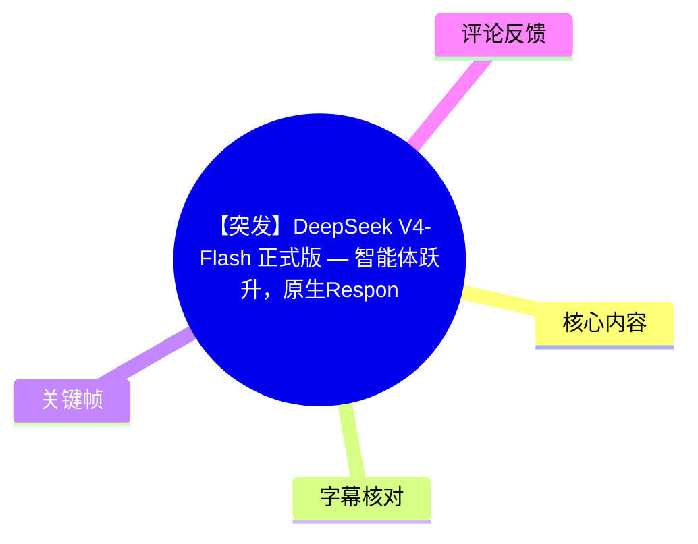
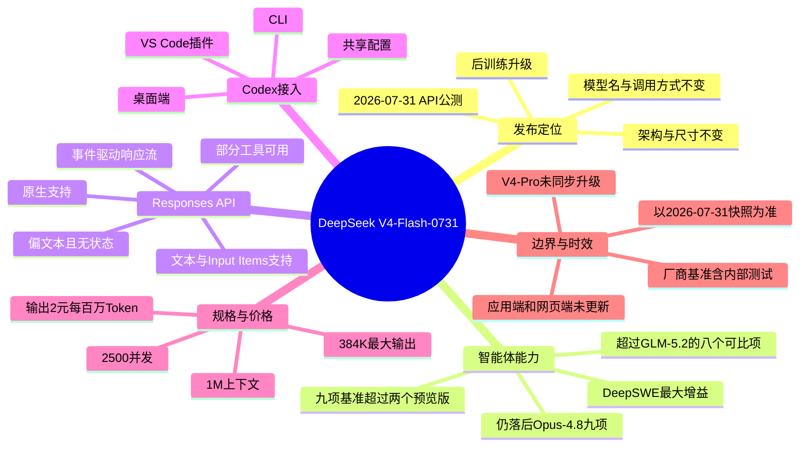
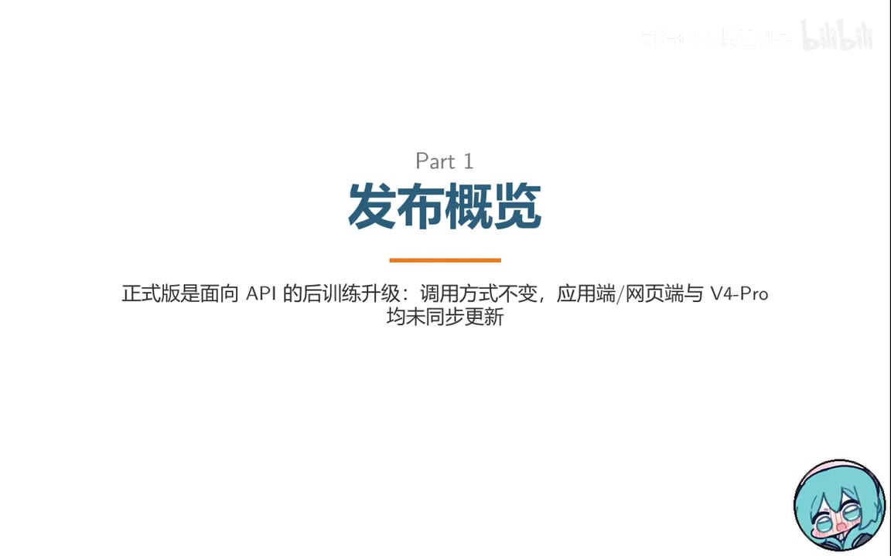
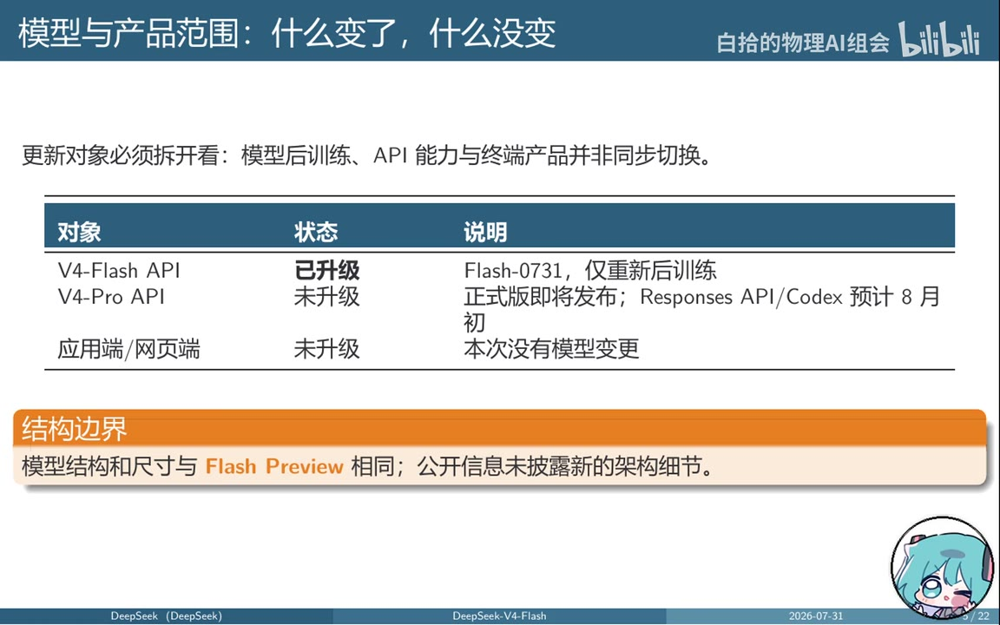
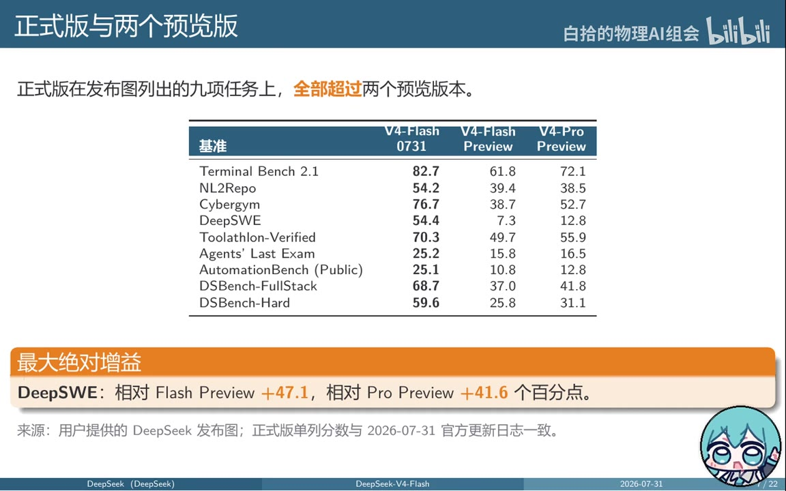
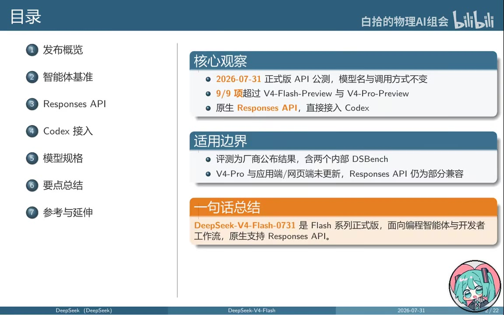

# 【突发】DeepSeek V4-Flash 正式版 — 智能体跃升，原生Responses API直连Codex

> 来源：[Bilibili 视频](https://www.bilibili.com/video/BV12tGP6XEsG)  
> UP 主：白拾的物理AI组会  
> 视频页面标注时长：1137 秒；本次可用 P1 音频/ASR 时长为 530.90 秒（约 08:50）。  
> 信息锚点：视频所述官方文档快照与发布图均截至 **2026-07-31**；这是一则具有强时效性的 API 发布解读。

## 小结

视频解读了 DeepSeek 于 **2026 年 7 月 31 日**发布的 `DeepSeek-V4-Flash-0731`（简称 V4-Flash 正式版）API 公测。其定位并非新架构或全产品线换代，而是一次主要面向**编程智能体与开发者工作流**的后训练升级：模型结构、尺寸、模型名称、基础地址和既有调用方式保持不变，因此已有 V4-Flash API 用户被描述为可“零迁移”使用。

能力层面，视频依据 DeepSeek 发布图称，V4-Flash-0731 在列出的 9 项智能体基准上均超过 V4-Flash Preview 与 V4-Pro Preview；其中 DeepSWE 的绝对提升最大，相较 Flash Preview 提升 **47.1 个百分点**，相较 Pro Preview 提升 **41.6 个百分点**。但视频也明确提示：这些结果为厂商公布数据，且包含内部 DSBench 测试集，不能直接等同于跨厂商、完全可复现的独立结论。

本次最有实际接入价值的更新是原生 **Responses API**。视频称该能力目前只由 V4-Flash 支持，并可对接 OpenAI Codex 的 CLI、桌面端和 VS Code 插件工作流。需要注意，“兼容 Responses API”不意味着实现了全部 OpenAI 字段与工具：它仍是偏文本、无状态、部分兼容的实现，图片、文件、会话续接、后台执行等能力存在限制或不支持。

对于开发者，视频给出的核心规格是：V4-Flash 支持思考与非思考模式、**1M Token 上下文**、**384K Token 最大输出**、**2500 并发**；其每百万 Token 的缓存命中输入、缓存未命中输入、输出价格分别为 **0.02 元、1 元、2 元**。与 V4-Pro 相比，Flash 在并发和标价上更具优势，但 Pro 当时尚未支持 Responses API 或 Codex 接入。

适合阅读本笔记的人包括：准备将 DeepSeek API 接入代码智能体、已有 Codex 工作流并希望切换模型提供商的开发者，以及需要谨慎评估模型基准、接口兼容性和调用成本的技术决策者。所有“支持范围”“价格”“产品更新状态”均应以实际调用当日的 DeepSeek 文档和控制台为准。

## 思维导图





## 目录

- [发布概览与更新边界](#发布概览与更新边界)
- [智能体基准：成绩、比较与可复现性](#智能体基准成绩比较与可复现性)
- [Responses API：流程、支持范围与限制](#responses-api流程支持范围与限制)
- [Codex 接入：配置思路与安全实践](#codex-接入配置思路与安全实践)
- [模型规格、并发与定价](#模型规格并发与定价)
- [结论、适用建议与时效性](#结论适用建议与时效性)
- [关键帧索引](#关键帧索引)
- [字幕比对](#字幕比对)
- [评论分析](#评论分析)
- [处理记录](#处理记录)

## 发布概览与更新边界

### API 正式版的定位 [01:14](https://www.bilibili.com/video/BV12tGP6XEsG?t=74)

视频将此次更新概括为 API 端的后训练升级，发布日期为 **2026-07-31**，模型标识为 `DeepSeek-V4-Flash-0731`。API 入口仍为 `api.deepseek.com`；视频称模型名、基础地址和调用方式均未发生变化，因此原有调用方无需为接口迁移重写接入逻辑。

视频归纳的三项新增或核心变化是：

1. **智能体能力增强**：重点面向编程智能体场景。
2. **原生支持 Responses API**：并针对 OpenAI Codex 开发者工具链进行适配。
3. **正式版本号更新**：V4-Flash API 升级至 Flash-0731。



> 图：该关键帧直接写明“正式版是面向 API 的后训练升级：调用方式不变，应用端/网页端与 V4-Pro 均未同步更新”。它是判断更新范围、避免把 API 变更误解为全产品更新的关键画面依据。

### 哪些对象更新、哪些没有更新 [01:38](https://www.bilibili.com/video/BV12tGP6XEsG?t=98)

视频强调需要将“模型后训练”“API 能力”和“终端产品”拆开看：

| 对象 | 视频所述状态 | 说明 |
| --- | --- | --- |
| V4-Flash API | 已升级 | 升至 Flash-0731，属于重新后训练。 |
| V4-Pro API | 未升级 | 视频称正式版尚未同步发布；Responses API/Codex 支持预计在 8 月初，但这属于当时预期，不应视为已落地事实。 |
| DeepSeek 应用端 / 网页端 | 未升级 | 视频称本次没有模型变化。 |
| 模型架构与尺寸 | 未变化 | 与 Flash Preview 相同，公开信息未披露新的架构细节。 |



> 图：表格将 V4-Flash API、V4-Pro API、应用端/网页端的状态分列，且明确标注结构边界。这一画面用于校正“正式版”可能造成的全线更新误解。

**解读要点：**能力提升不必然意味着参数规模、架构或客户端版本改变。对于已经在 API 侧使用 V4-Flash 的团队，主要应验证输出质量、工具调用行为、成本和限流变化；对于使用网页端或 V4-Pro 的用户，则不能假设已自动获得相同能力。

## 智能体基准：成绩、比较与可复现性

### 九项任务均超过两个预览版 [02:16](https://www.bilibili.com/video/BV12tGP6XEsG?t=136)

视频展示的发布图列出 9 项智能体相关评测，并称 V4-Flash-0731 在每一项上均超过 V4-Flash Preview 和 V4-Pro Preview。发布图中的数值如下：

| 基准 | V4-Flash-0731 | V4-Flash Preview | V4-Pro Preview |
| --- | ---: | ---: | ---: |
| Terminal Bench 2.1 | 82.7 | 61.8 | 72.1 |
| NL2Repo | 54.2 | 39.4 | 38.5 |
| Cybergym | 76.7 | 38.7 | 52.7 |
| DeepSWE | 54.4 | 7.3 | 12.8 |
| Toolthon-Verified | 70.3 | 49.7 | 55.9 |
| Agents’ Last Exam | 25.2 | 15.8 | 16.5 |
| AutomationBench (Public) | 25.1 | 10.8 | 12.8 |
| DSBench-FullStack | 68.7 | 37.0 | 41.8 |
| DSBench-Hard | 59.6 | 25.8 | 31.1 |



> 图：该帧完整呈现九项基准及三个版本的分数，是本节所有量化比较的直接视觉依据；同时标出了 DeepSWE 的最大绝对增益。

其中，**DeepSWE** 是视频强调的最大绝对增益项：

- 相较 V4-Flash Preview：`54.4 - 7.3 = 47.1` 个百分点；
- 相较 V4-Pro Preview：`54.4 - 12.8 = 41.6` 个百分点。

此外，视频口述了若干显著变化：Terminal Bench 2.1 达到 82.7，NL2Repo 达到 54.2，Cybergym 达到 76.7，AutomationBench 达到 25.1，DSBench-Hard 达到 59.6。这里的“提升”均是同一发布图中正式版与预览版列的比较，不代表对所有第三方基准或真实生产任务的普遍保证。

### 与 GLM-5.2、Opus-4.8 的位置比较 [03:04](https://www.bilibili.com/video/BV12tGP6XEsG?t=184)

视频给出的横向结论是：

- 对 **GLM-5.2**：在视频所说的 8 个可比项目中，V4-Flash-0731 全部领先。举例：
  - Terminal Bench：82.7 vs 81.0；
  - DeepSWE：54.4 vs 46.2；
  - NL2Repo：54.2 vs 48.9。
- 对 **Opus-4.8**：正式版在 9 项中均未领先。视频列出较小差距包括：
  - Agents’ Last Exam：差 0.5 个百分点；
  - AutomationBench：差 2.1 个百分点；
  - Terminal Bench：差 2.3 个百分点。
- 视频的总结性判断是：V4-Flash-0731 已显著追近 Opus-4.8，但按该发布图数据尚未超过。

### 基准结果的解释边界 [03:28](https://www.bilibili.com/video/BV12tGP6XEsG?t=208)

视频没有将基准分数包装成无条件结论，而是提示以下评测条件与限制：

- DeepSeek 使用自研的 **DeepSeek Harness 极简模式**进行评测，并称该框架将发布；
- 推理强度统一使用 **Max** 档；
- 采样参数为：
  - `top_p = 0.95`
  - `temperature = 1.0`
- `DSBench-FullStack` 是内部全栈开发测试集；
- `DSBench-Hard` 是内部编程智能体难题测试集；
- 内部数据集不能由外部研究者直接独立复现；
- 所有分数均是厂商公布结果，不宜假设不同厂商使用了等价的评测框架、推理强度与采样协议。

**实践含义：**若要决定是否换模，建议在自身仓库、真实工具权限、真实上下文长度、实际预算及团队提示词规范下做 A/B 验证。尤其应分开测试：修复缺陷、跨文件重构、命令行操作、工具调用成功率、长任务中断恢复与成本波动。

## Responses API：流程、支持范围与限制

### 事件流程与 Chat Completions 的差异 [04:13](https://www.bilibili.com/video/BV12tGP6XEsG?t=253)

视频将 Responses API 描述为本次发布的核心功能，并按如下四步梳理调用与事件生命周期：

1. 客户端通过 `client.responses.create` 创建响应；
2. 服务端依次返回诸如 `response.created`、`response.in_progress` 的状态事件；
3. 文本推理与工具调用通过各自的增量（delta）事件输出；
4. 最终以 `response.completed`、`response.incomplete` 或 `response.failed` 结束。

视频特别指出，它与传统 Chat Completions 流式接口的表现不同：这里没有传统 SSE 叙述中常见的 `data:` 形式；同时结束状态的事件类型更丰富。接入方不应仅以“收到文本流结束”判断任务成功，而应识别最终状态事件，并对 `incomplete` 与 `failed` 建立处理逻辑。

### 支持能力与兼容限制 [04:35](https://www.bilibili.com/video/BV12tGP6XEsG?t=275)

按视频表述，当时只有 **V4-Flash** 支持 Responses API；兼容层不等于完整实现全部 OpenAI Responses API 语义。视频列出的范围可整理为：

| 类别 | 视频所述支持情况 | 开发影响 |
| --- | --- | --- |
| 文本输入、Input Items | 正常支持 | 可作为常规输入路径。 |
| 图片、文件 | 会被替换为占位文本 | 不能将其当作可靠的原生多模态/文件理解接口。 |
| Function Calling | 可用 | 可用于受控函数工具调用。 |
| `web_search` | 可用 | 视频将其列为可用工具。 |
| `apply_patch` | 可用 | 面向代码修改类工作流。 |
| `file_search` | 忽略 | 不能依赖内建文件检索。 |
| Code Interpreter | 忽略 | 不应假设有托管代码执行环境。 |
| Computer Use | 忽略 | 不应假设有桌面/浏览器操控能力。 |
| MCP 协议 | 忽略 | 需要在自身系统中另行处理整合。 |
| `instructions`、消息角色 | 正常支持 | 可用于基本系统约束与消息编排。 |
| `previous_response_id` | 不支持 | 无法按该字段续接此前响应。 |
| `conversation`、`store`、`background` | 不支持 | 不具备该兼容层中的持久会话、存储或后台任务语义。 |

### 采样、并行工具与错误处理 [05:00](https://www.bilibili.com/video/BV12tGP6XEsG?t=300)

视频进一步给出请求处理边界：

- 在**非思考模式**下，`temperature` 与 `top_p` 生效；
- 在**思考模式**下，二者都不生效；
- 并行工具调用始终开启；
- 其他不支持的参数会被**静默忽略**；
- 超出上下文窗口会返回 **HTTP 400** 错误。

这些约束意味着：

1. 若应用需要严格控制随机性，必须先确认当前是否选用了思考模式。
2. 对于工具具有副作用的系统（写文件、发请求、修改工单等），应按“可能并行调用”设计幂等性、去重、权限校验和审计。
3. 因为不支持字段可能被静默忽略，建议在集成测试中主动检查响应行为，不能仅以 HTTP 成功作为功能已启用的依据。
4. 面对 1M 上下文限制，也应预留 token 估算、截断、摘要和 400 错误的恢复策略。

## Codex 接入：配置思路与安全实践

### 视频给出的接入要点 [05:33](https://www.bilibili.com/video/BV12tGP6XEsG?t=333)

视频称，在 Windows PowerShell 下可使用 DeepSeek CDN 提供的 Codex 配置脚本进行一键配置；由于本次 ASR 对命令中的 URL、脚本文件名和管道目标存在明显识别错误，且给定关键帧中未提供该命令原文，本笔记**不重建或猜测该命令**。实际执行前应以当日官方 Codex 接入指南为准，并先审查远程脚本内容。

视频可确认的配置意图包括：

- 模型设置为 `DeepSeek-V4-Flash`；
- 模型提供商设置为 `DeepSeek`；
- 推理强度设置为 `high`；
- 在 `model_providers.deepseek` 一类配置段中设置：
  - Base URL 指向 `api.deepseek.com`；
  - Wire API 选择 `responses`。
- 配置可在 Codex CLI、桌面端和 VS Code 插件间共享，一次配置可以多端复用。
- V4-Pro 当时尚不支持 Responses API 与 Codex 接入。

### 调用方式与推理档位差异 [06:16](https://www.bilibili.com/video/BV12tGP6XEsG?t=376)

视频使用 OpenAI SDK 风格调用作为示例：导入 `OpenAI` 客户端，传入 API Key 与 Base URL，再调用 `client.responses.create`，模型参数指定为 V4-Flash，按需设置 `instructions` 和 `input`，最后读取 `response.output_text`。

以下为依据视频可确认接口形态整理的**示意代码**；鉴于模型标识、SDK 版本和兼容参数可能在发布后调整，应以实时官方文档校验：

```python
import os
from openai import OpenAI

client = OpenAI(
    api_key=os.environ["DEEPSEEK_API_KEY"],
    base_url="https://api.deepseek.com",
)

response = client.responses.create(
    model="DeepSeek-V4-Flash",
    instructions="你是一个谨慎的代码助手。",
    input="请审查这个函数的边界条件。",
)

print(response.output_text)
```

视频还区分了两个使用场景的推理强度：

- 官方 Codex 接入示例使用 `high`；
- 发布图中的基准评测使用 `max`。

因此，不能把 `max` 基准成绩直接等同于 Codex 默认 `high` 档位下的实际表现；评估时应固定推理档位再进行比较。

### 安全与工程建议 [06:40](https://www.bilibili.com/video/BV12tGP6XEsG?t=400)

视频明确提醒：示例里的 API Key 只是占位符，生产部署应从安全环境变量读取，**不要把密钥硬编码在源码或演示材料中**。

进一步的工程化建议：

1. 使用环境变量、密钥管理服务或 CI/CD 的 Secret 注入机制；
2. 为不同环境配置不同密钥和最小权限；
3. 不直接执行未经核验的远程 PowerShell 脚本；
4. 在 Codex 具备修改代码或运行工具的权限时，先在隔离仓库、受限目录、非生产凭据下测试；
5. 对工具调用、代码改动和成本建立日志与预算告警。

## 模型规格、并发与定价

### V4-Flash 与 V4-Pro 对比 [06:51](https://www.bilibili.com/video/BV12tGP6XEsG?t=411)

视频称 V4-Flash 和 V4-Pro 都支持思考模式与非思考模式，但接口能力、并发能力和价格不同：

| 项目 | V4-Flash | V4-Pro |
| --- | ---: | ---: |
| 思考 / 非思考模式 | 支持 | 支持 |
| 上下文长度 | 1,000,000 Token | 1,000,000 Token |
| 最大输出 | 384,000 Token | 384,000 Token |
| Responses API | 支持 | 暂不支持 |
| 并发限制 | 2500 | 500 |
| 缓存命中输入价格 | 0.02 元 / 百万 Token | 0.025 元 / 百万 Token |
| 缓存未命中输入价格 | 1 元 / 百万 Token | 3 元 / 百万 Token |
| 输出价格 | 2 元 / 百万 Token | 6 元 / 百万 Token |

视频据此认为 Flash 的并发能力为 Pro 的 5 倍，且在所列价格下具有明显性价比优势。

### 价格时效与成本估算注意事项 [07:15](https://www.bilibili.com/video/BV12tGP6XEsG?t=435)

视频提到峰谷定价已经预告，但具体生效日期当时尚未公布，高峰时段两倍定价尚未生效。换言之，上表是视频锚定日期下的价格快照，不是长期承诺。

成本核算时，至少要区分：

- 输入是否命中缓存；
- 输入 token 与输出 token 的实际比例；
- 思考模式是否引入额外输出或推理消耗；
- 高峰时段费率是否已发生变化；
- 并发限制是否按账户、区域、模型或其他维度调整。

## 结论、适用建议与时效性

### 视频最终判断 [07:37](https://www.bilibili.com/video/BV12tGP6XEsG?t=457)

视频的四点总结可以归纳为：

1. **升级本质**：模型结构和尺寸没有变化，能力跃升主要来自重新后训练。
2. **基准位置**：在视频引用的 DeepSeek 评测表中，9 项均超过两个预览版；但仍未超过 Opus-4.8，所述差距约为 0.5 至 3 个百分点。
3. **接入价值**：原生 Responses API 使 Codex 和既有 SDK 更容易连接 V4-Flash，降低了智能体开发入口门槛。
4. **边界意识**：V4-Pro、应用端和网页端没有同步升级；兼容层仍以文本为主、无状态，且只部分兼容 OpenAI 规范。

### 适用场景

V4-Flash-0731 更适合以下任务：

- 通过 API 构建编程智能体；
- 将模型接入 Codex CLI、桌面端或 VS Code 插件；
- 使用 Function Calling、Web Search、补丁应用等视频所称可用工具；
- 需要大上下文、高并发与较低输出单价的工程工作负载；
- 希望在不修改既有 V4-Flash 调用方式的前提下升级能力的团队。

不宜仅凭视频结论直接假设其适合：

- 依赖图片、文件原生理解的多模态任务；
- 依赖 `previous_response_id`、持久会话、后台任务或内建存储的任务；
- 必须使用 Code Interpreter、Computer Use、MCP 或 File Search 的工作流；
- 需要独立可复现的第三方模型排行榜结论；
- 只使用 DeepSeek 网页端/应用端、却期望自动获得 API 正式版能力的用户。

### 时效性声明 [08:22](https://www.bilibili.com/video/BV12tGP6XEsG?t=502)

视频称其事实和数据锚定于 **2026-07-31** 的官方文档快照与用户提供的发布图，参考范围包括发布图、API 更新日志、Responses API 使用指南、Codex 接入指南、模型与价格页面。

因此，下列信息均可能在视频发布后变化：

- V4-Pro 是否已支持 Responses API/Codex；
- 应用端和网页端是否完成同步；
- 模型名称、可用区域、并发上限；
- 工具与字段兼容范围；
- 价格、峰谷定价规则及生效时间；
- 基准测试框架、运行设置和公开程度。

在部署、采购或性能承诺前，应复核 DeepSeek 当前官方文档、账户控制台限制与实际 API 返回。

## 关键帧索引

| 关键帧 | 正文用途 | 画面价值 |
| --- | --- | --- |
|  | 开篇总览 | 列出发布概览、智能体基准、Responses API、Codex 接入、模型规格等视频结构，并强调“9/9 项超过预览版”“原生 Responses API”“产品范围边界”。 |
|  | 发布定位 | 明确本次为 API 后训练升级，调用方式不变，V4-Pro 与应用端/网页端未同步更新。 |
|  | 更新边界 | 用表格分别呈现 V4-Flash API、V4-Pro API 与应用端/网页端的更新状态，并注明结构与尺寸未改变。 |
|  | 性能证据 | 展示正式版与两个预览版的九项基准分数，是量化结论的主要视觉依据。 |

## 字幕比对

| 字幕来源 | 完整性 | 专有名词 | 时间轴 | 主要问题 |
| --- | --- | --- | --- | --- |
| Bilibili 站内字幕 | 未提供可用字幕 | 无法核验 | 无法使用 | 素材明确标注“未提供可用站内字幕”。 |
| 本次 ASR 字幕 | 较完整：25 段，语音覆盖约 481.47 秒，占可用 P1 时长约 90.69% | 存在较多英文名称、API 字段和工具名误识别 | 可用：提供精确 SRT 起止时间 | 多处出现 `Responsees`、`Deep Sek`、`Touch P`、工具名连写或音译错误；首段异常密集，专名需结合画面与上下文校正。 |

### 最终字幕选择

最终以**本次 ASR 时间轴**作为章节定位依据，因为没有可用站内字幕，且 SRT 给出了可直接使用的真实起止时间。正文对文本内容采取“ASR + 已提供关键帧 + 视频元数据/描述”交叉校正的方式整理。

本次 ASR 诊断显示：

- 识别模型：`large-v3-turbo`
- 识别语言：中文，语言概率 `0.998046875`
- 可用音频时长：`530.9010625` 秒
- 首段语音：`00:00:27,000`
- 末段语音：`00:08:49,990`
- 未标记 `noAudioStream=true`，说明源 P1 存在可供识别的音轨；这不是无音轨视频。

### 已校正的关键术语

| ASR 常见写法或误识别 | 正文采用写法 | 校正依据 |
| --- | --- | --- |
| Deep Seek / Deep Sek | DeepSeek | 视频标题、元数据与关键帧。 |
| V4 Flash / V四Flash | V4-Flash / DeepSeek-V4-Flash-0731 | 标题、描述与关键帧。 |
| Responsees / Responze | Responses API、`responses.create` | 标题、视频主题与上下文。 |
| Deep SWE | DeepSWE | 基准表关键帧。 |
| NLR Repo | NL2Repo | 基准表关键帧。 |
| Cyber Dream | Cybergym | 基准表关键帧。 |
| Spank Hard / Full Stack | DSBench-Hard / DSBench-FullStack | 基准表关键帧及上下文。 |
| Touch P | `top_p` | ASR 语义上下文。 |
| API-T | API Key | 视频后段安全提示的上下文。 |

对于无法由 ASR、关键帧或元数据可靠复原的 PowerShell 脚本 URL 与命令原文，本文没有擅自补写。

## 评论分析

仅获取到 2 条热评，少于要求的“热评前三条”；以下只分析可获取内容，不将评论视为已验证事实。

1. **阿迪贝贝拉**，2 赞：`[笑哭]`  
   - 这是一条情绪表达，没有提供技术观点、补充事实或可验证信息。
   - 无法据此判断其对发布内容的具体态度，也不构成性能、价格或接口兼容性的证据。

2. **谁人书阁下**，0 赞：`有多模态了？`  
   - 该评论提出了一个实际且重要的问题：V4-Flash 是否获得原生多模态能力。
   - 视频中与此最相关的信息是：在 Responses API 兼容层里，图片和文件会被替换为占位文本；因此，**至少不能依据本视频将其认定为可通过该接口可靠处理图片/文件的原生多模态能力**。
   - 这仍不是对模型整体多模态路线的完整官方判定；应查询当前模型文档确认具体输入模态和端点支持情况。

## 处理记录

- Worker ID：`worker-msdwhq1v-6fa0a13b`
- 模型：`gpt-5.6-terra`
- 可用素材与工具产物：
  - 视频元数据与页面描述；
  - P1 合并视频：`merged.mp4`；
  - 音频：`audio/audio.wav`；
  - ASR 结果：`asr/asr-result.json`、`asr/transcript.srt`、`asr/asr-transcript.txt`；
  - 关键帧目录：`frames/`；
  - 评论数据：`comments/comments.json`。
- 字幕选择：
  - 已检查站内字幕：未提供可用站内字幕；
  - 已检查本次 ASR：有时间戳、中文识别概率高、音频存在；
  - 最终使用 ASR SRT 的真实时间段作为时间轴，并用关键帧、标题、描述和上下文校正术语。
- 关键帧选择依据：
  - `frame-001.jpg`：视频目录、核心观察和适用边界总览；
  - `frame-002.jpg`：发布定位与未同步更新范围；
  - `frame-003.jpg`：V4-Flash、V4-Pro、应用/网页端的状态表；
  - `frame-004.jpg`：九项智能体基准及 DeepSWE 增益。
- 缓存清理：未提供缓存清理执行日志；本文不声称已执行缓存删除。
- 未解决问题：
  - 页面元数据总时长为 1137 秒，但当前 P1 的音频和 ASR 仅覆盖约 530.90 秒；本文仅依据可用 P1 素材撰写，不推断剩余时长内容。
  - 无站内字幕，且 ASR 对英文专名和 PowerShell 命令存在误识别；未能被关键帧验证的脚本 URL/命令未写入正文。
  - 视频中的产品、定价、兼容性和未来发布时间均为 2026-07-31 快照，应以当前官方资料复核。
