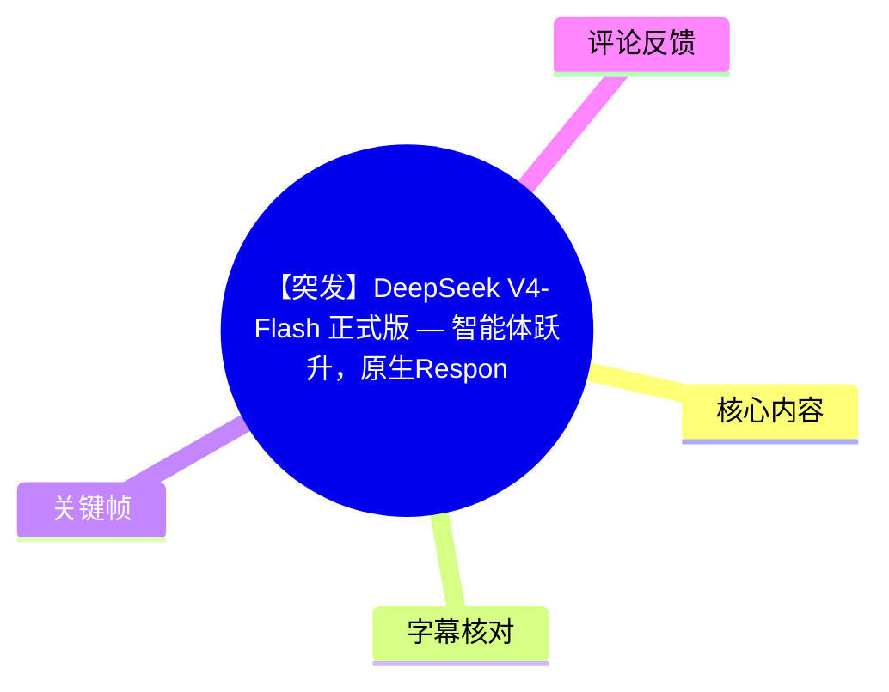
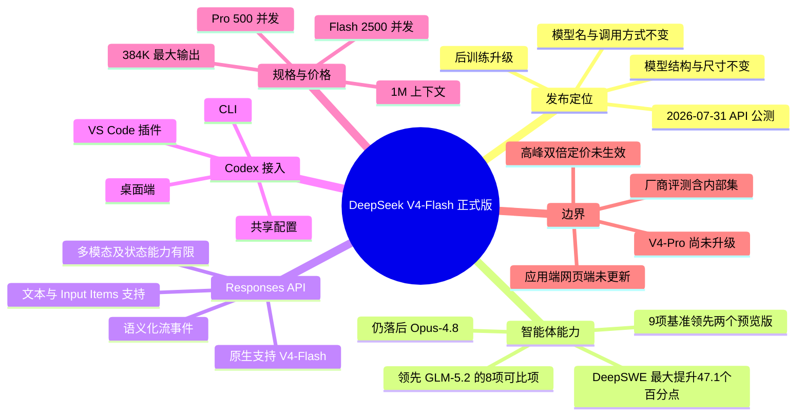
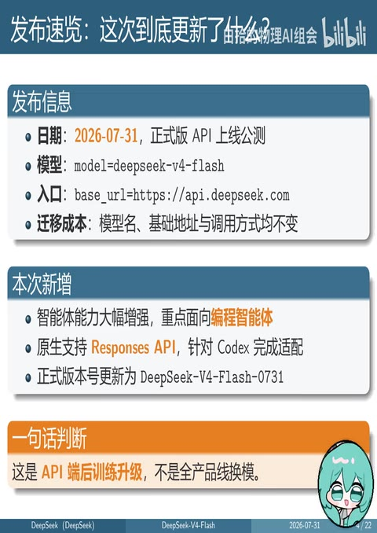
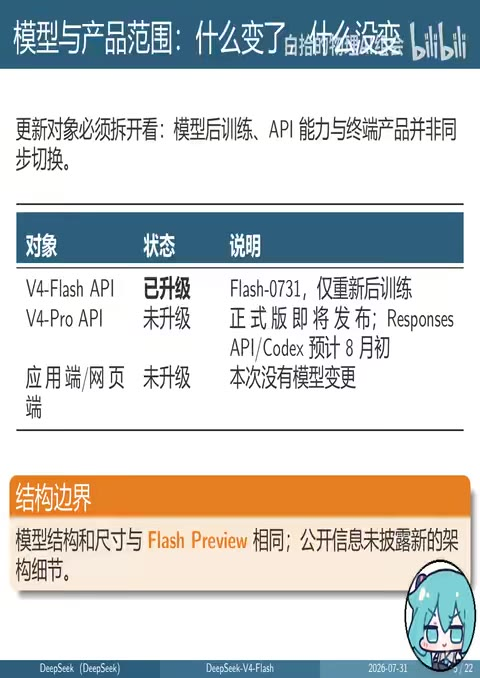
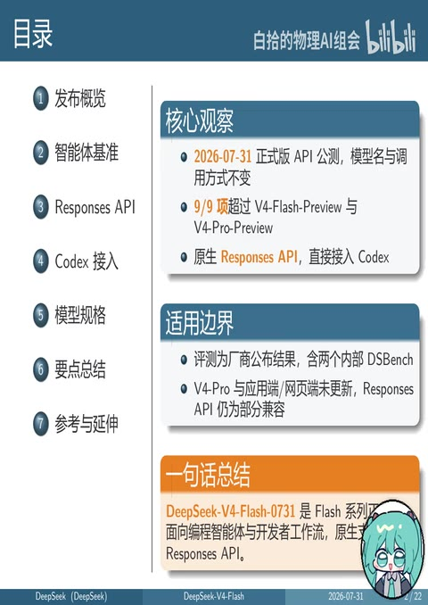

# 【突发】DeepSeek V4-Flash 正式版 — 智能体跃升，原生Responses API直连Codex

> 来源：[Bilibili 视频（P2 竖屏版）](https://www.bilibili.com/video/BV12tGP6XEsG?p=2)<br>
> UP 主：白拾的物理AI组会｜视频页标注发布日期：2026-07-31｜当前整理分 P2 时长：10 分 06 秒（整体多 P 元数据时长为 1137 秒）  
> 信息基准：视频所称的 2026 年 7 月 31 日官方文档快照及发布图；视频明确提示其内容“仅供学术交流使用”。

## 小结

视频解读的是 DeepSeek 于 **2026 年 7 月 31 日**上线公测的 **DeepSeek-V4-Flash 正式版 API**，视频中使用的正式版本标识为 `DeepSeek-V4-Flash-0731`。其重点不是模型结构换代，而是一次面向 API 端、尤其面向编程智能体工作流的**后训练升级**：模型名称、基础地址与调用方式保持不变，因而已有调用方的迁移成本被描述为零。

能力层面，视频转述发布图称，V4-Flash 正式版在列出的 **9 项智能体基准**上均超过 `V4-Flash-Preview` 与 `V4-Pro-Preview`；其中 DeepSWE 相比 Flash Preview 的最大绝对提升为 **47.1 个百分点**。不过，这些结果属于厂商发布口径，且含两个内部 DS Bench 测试集，不能直接等同于可独立复现、跨厂商严格可比的结论。

接口层面是本次升级最有实际接入价值的部分：V4-Flash 原生支持 **Responses API**，可按视频所述接入 OpenAI Codex 的 CLI、桌面端和 VS Code 插件。它使用更丰富的事件类型组织流式响应，但并非完整等价于 OpenAI 的全部 Responses API 语义：兼容层以文本为主，图像与文件会转为占位文本；若干工具、状态管理字段与后台能力不受支持或被忽略。

选型上，视频认为 V4-Flash 以 **1M Token 上下文、384K Token 最大输出、2500 并发**以及较低单价，形成相对 V4-Pro 的性价比优势；但截至视频引用快照，**V4-Pro API、应用端和网页端均未同步更新**，V4-Pro 也不支持 Responses API/Codex 接入。高峰期双倍定价仅被预告，尚未公布具体生效日期。

本文适合希望评估 DeepSeek V4-Flash 的编程智能体能力、准备将既有 OpenAI 风格 SDK 接入 DeepSeek、或打算在 Codex 工作流中配置该模型的开发者阅读。所有价格、支持范围、基准成绩均具有明显时效性，应以实际 API 文档与控制台在调用当日显示的信息为准。

## 思维导图





## 目录

- [发布概览：这是 API 端后训练升级](#发布概览这是-api-端后训练升级)
- [模型与产品范围：哪些更新、哪些没有更新](#模型与产品范围哪些更新哪些没有更新)
- [智能体基准：成绩、横向位置与可比性边界](#智能体基准成绩横向位置与可比性边界)
- [Responses API：事件流程与兼容限制](#responses-api事件流程与兼容限制)
- [Codex 接入：配置路径与安全注意事项](#codex-接入配置路径与安全注意事项)
- [模型规格、并发与定价](#模型规格并发与定价)
- [结论、适用建议与时效性](#结论适用建议与时效性)
- [字幕比对](#字幕比对)
- [评论分析](#评论分析)
- [处理记录](#处理记录)

## 发布概览：这是 API 端后训练升级 [00:01:25](https://www.bilibili.com/video/BV12tGP6XEsG?t=85)

视频将此次发布概括为：**DeepSeek-V4-Flash 正式版 API 公测上线**。其陈述的发布信息包括：

| 项目 | 视频中的信息 |
| --- | --- |
| 日期 | 2026-07-31 |
| API 入口 | `https://api.deepseek.com` |
| 模型标识 | `DeepSeek-V4-Flash`；正式版版本号为 `DeepSeek-V4-Flash-0731` |
| 升级性质 | API 端后训练升级 |
| 核心受益场景 | 编程智能体、开发者工作流 |
| 迁移影响 | 模型名、基础地址、调用方式不变，视频称迁移成本为零 |
| 新增重点 | 智能体能力增强、原生 Responses API、Codex 适配 |

视频特别区分了“能力升级”与“模型换代”：其结论是模型结构和尺寸与 Flash Preview 相同，公开信息中也没有披露新的架构细节。因此，不能从本次发布推导出参数规模、网络结构或模态能力发生了变化。



> 图：该关键帧将“2026-07-31”“`model=deepseek-v4-flash`”“`base_url=https://api.deepseek.com`”以及“API 端后训练升级”并列展示，是判断迁移范围和接入入口的直接视觉依据。

## 模型与产品范围：哪些更新、哪些没有更新 [00:02:15](https://www.bilibili.com/video/BV12tGP6XEsG?t=135)

视频强调，不能将 V4-Flash API 的更新外推到整个 DeepSeek 产品线。其给出的范围划分如下：

| 对象 | 视频所述状态 | 说明 |
| --- | --- | --- |
| V4-Flash API | 已升级 | 升级至 Flash-0731；本质是重新后训练 |
| V4-Pro API | 未升级 | 正式版预计随后发布；视频称 Responses API/Codex 预计在 8 月初跟进 |
| 应用端 / 网页端 | 未升级 | 本次没有模型变更 |
| 模型结构与尺寸 | 不变 | 与 Flash Preview 相同，未披露新架构细节 |

这里的关键经验是：评估 API 能力时，必须分别确认 **模型版本、API 产品线、客户端产品线和接口协议**。即使同属 V4 系列，V4-Pro 与 V4-Flash 在本视频所述时间点的 Responses API 支持情况不同，不能因“V4”名称相同而假定功能一致。



> 图：该关键帧用表格明确列出 V4-Flash API、V4-Pro API、应用端/网页端的不同状态，能防止把单一 API 更新误读为全产品线换模。

## 智能体基准：成绩、横向位置与可比性边界 [00:02:35](https://www.bilibili.com/video/BV12tGP6XEsG?t=155)

### 正式版相对预览版的提升

视频转述 DeepSeek 发布图称，正式版在图中列出的全部 **9 项任务**上超过两个预览版本：`V4-Flash-Preview` 与 `V4-Pro-Preview`。视频明确念出的部分数值如下：

| 基准 | Flash Preview | Pro Preview | V4-Flash 正式版 | 视频强调的结论 |
| --- | ---: | ---: | ---: | --- |
| Terminal Bench | 61.8 | 72.1 | 82.7 | 正式版高于两个预览版 |
| NLR Repo | 39.4 | 38.5 | 54.2 | 正式版高于两个预览版 |
| Cyber Gym | 38.7 | 52.7 | 76.7 | 正式版高于两个预览版 |
| DeepSWE | — | — | 54.4（横比段落提及） | 相对 Flash Preview +47.1 个百分点；相对 Pro Preview +41.6 个百分点 |
| Automation Bench | 10.8 | 12.8 | 25.1 | 正式版高于两个预览版 |
| Spank Hard | 25.8 | 31.1 | 59.6 | 正式版高于两个预览版 |

> 注：视频没有在 ASR 文本中完整逐项念出 9 个任务的全部分数；上表仅保留音频中可识别且有明确数值对应的项目，不补造未提供的数值。

### 与 GLM-5.2、Opus-4.8 的位置

视频的横向判断分两层：

1. **对 GLM-5.2**：在 8 个可比项中，V4-Flash 正式版全部领先。视频举例：
   - Terminal Bench：82.7 vs 81.0；
   - DeepSWE：54.4 vs 46.2；
   - NLR Repo：54.2 vs 48.9。

2. **对 Opus-4.8**：在 9 项中均未领先，但差距已经缩小。视频列出的最近差距为：
   - Agent’s Last Exam：差 0.5 个百分点；
   - Automation Bench：差 2.1 个百分点；
   - Terminal Bench：差 2.3 个百分点。

因此，视频的准确表述不是“V4-Flash 已全面领先头部闭源模型”，而是：它在该发布图给定条件下全面超过两个 DeepSeek 预览版、在可比项中超过 GLM-5.2，但仍未超过 Opus-4.8。

### 评测方法的限制

视频对这些成绩给出了必要的解释边界：

- 使用的是 DeepSeek 自研的 **DeepSeek Harness 极简模式**；视频称官方注明该评测框架即将发布。
- 推理强度统一为 **Max**。
- 采样参数：`top_p = 0.95`、`temperature = 1.0`。
- `Spank Full Stack` 被描述为内部全栈开发测试集。
- `Spank Hard` 被描述为内部编程智能体难题测试集。
- 内部测试集无法由外部研究者独立复现。
- 不同厂商即使公布同名或近似基准，也不能默认使用了完全一致的 harness、推理强度或采样协议。

这意味着这些数据适合用来理解 DeepSeek 自己发布版本之间的相对变化；对于跨模型采购，仍应在自身仓库、任务集、工具链、成本上限和延迟约束下做复测。

## Responses API：事件流程与兼容限制 [00:04:49](https://www.bilibili.com/video/BV12tGP6XEsG?t=289)

视频把 Responses API 定位为本次发布的核心接入能力，并描述了一个四步流式流程：

1. 客户端通过 `client.responses.create(...)` 创建响应；
2. 服务端依次发送 `response.created` 与 `response.in_progress`，用于建立和更新状态；
3. 文本、推理与工具调用分别产生语义化的 delta 事件；
4. 以 `response.completed`、`response.incomplete` 或 `response.failed` 结束。

与传统 Chat Completions 的流式接口相比，视频指出两项差别：

- Responses API 不使用传统 SSE 内容中常见的 `data:` 前缀表达方式；
- 它的事件类型更丰富，终止状态也不只是一种。

### 支持范围与不支持范围

视频明确提醒：“兼容”不表示所有 OpenAI Responses API 字段都可以使用。按视频分层整理如下：

| 层面 | 视频所述可用能力 | 视频所述限制 |
| --- | --- | --- |
| 输入 | 文本、`input items` | 图片和文件会被替换为占位文本 |
| 工具 | Function 调用、`web_search`、`apply_patch` | `file_search`、`code_interpreter`、`computer_use`、MCP 协议会被忽略 |
| 状态管理 | `instructions`、消息角色 | `previous_response_id`、`conversation`、`store`、`background` 不支持 |
| 采样参数 | 非思考模式下 `temperature`、`top_p` 生效 | 思考模式下两者均不生效 |
| 请求处理 | 并行工具调用始终开启 | 其他不支持参数静默忽略；超出上下文返回 400 错误 |
| 模型范围 | V4-Flash | 视频称当时仅 V4-Flash 支持 Responses API，V4-Pro 不支持 |

实践含义是：

- 若应用依赖图像、文件、计算机操作、MCP 或服务端长期会话，不能仅替换 `base_url` 后假定行为无差别。
- 因不支持参数可能被**静默忽略**，应在集成测试里对关键参数进行结果验证，不能只依赖 HTTP 请求成功。
- 思考模式下调节 `temperature` / `top_p` 不产生预期效果时，应先检查是否处于该模式，而非立即把问题归因于 SDK。
- 长上下文应用仍应在客户端实施 token 预算与截断策略，因为超出上限会得到 400 错误。

## Codex 接入：配置路径与安全注意事项 [00:06:21](https://www.bilibili.com/video/BV12tGP6XEsG?t=381)

视频称 Windows PowerShell 下存在一个由 DeepSeek CDN 提供的 Codex 配置脚本，可通过 `IRM` 获取后以管道传递给 `iex`，实现一键配置。由于给定 ASR 对脚本文件名和完整 URL 识别不稳定，且素材没有提供可逐字核验的命令文本，本文不重构该命令，以免生成错误的可执行脚本。

视频给出的关键配置语义是：

| 配置项 | 视频所述值 / 作用 |
| --- | --- |
| `model` | `deepseek-v4-flash` |
| `model_provider` | `deepseek` |
| `model_reasoning_effort` | `high` |
| `model_providers.deepseek.base_url` | `https://api.deepseek.com` |
| `model_providers.deepseek.wire_api` | `responses` |

视频称这套配置可在 **Codex CLI、Codex 桌面端与 VS Code 插件**间共享，因此一次配置可以多端复用。与此同时，要区分两个“推理强度”语境：

- Codex 官方示例使用 `high`；
- 发布图中的基准评测使用 `max`。

两者对应不同场景，不能把基准的 `max` 成绩直接视为日常 Codex 默认 `high` 配置下的必然表现。

### 最小调用流程

视频描述的 Python 调用逻辑为：

```python
from openai import OpenAI

client = OpenAI(
    api_key="<从安全环境变量读取>",
    base_url="https://api.deepseek.com",
)

response = client.responses.create(
    model="deepseek-v4-flash",
    instructions="按需填写系统指令",
    input="按需填写输入内容",
)

print(response.output_text)
```

上述代码反映视频叙述的接口结构；实际部署前还需按照调用当日的 DeepSeek 官方文档核实 SDK 版本、认证字段、模型名称与可用参数。

### 安全与配置检查清单

1. **不要把 API Key 硬编码**在源码、Notebook、截图或演示材料中。
2. 使用部署环境的安全环境变量、密钥管理服务或 CI/CD Secret 注入认证信息。
3. 确认 `wire_api` 指向 `responses`，否则客户端可能仍按 Chat Completions 语义发送请求。
4. 将 V4-Pro 与 V4-Flash 配置分开验证；视频所述时间点 V4-Pro 不具备 Responses API/Codex 支持。
5. 对工具调用、思考模式、参数是否生效进行端到端测试，而不只检查配置文件是否被读取。

## 模型规格、并发与定价 [00:07:50](https://www.bilibili.com/video/BV12tGP6XEsG?t=470)

视频比较了 V4-Flash 和 V4-Pro 的规格与价格。两者均支持思考模式与非思考模式，且上下文和最大输出规格相同，但接口能力、并发和价格不同。

| 项目 | V4-Flash | V4-Pro |
| --- | ---: | ---:|
| 思考 / 非思考模式 | 支持 | 支持 |
| 上下文长度 | 1,000,000 Token | 1,000,000 Token |
| 最大输出 | 384,000 Token | 384,000 Token |
| Responses API | 支持 | 暂不支持 |
| 并发限制 | 2500 | 500 |
| 缓存命中输入价格 | 0.02 元 / 百万 Token | 0.025 元 / 百万 Token |
| 缓存未命中输入价格 | 1 元 / 百万 Token | 3 元 / 百万 Token |
| 输出价格 | 2 元 / 百万 Token | 6 元 / 百万 Token |

从视频给出的数值看，V4-Flash 的并发上限是 V4-Pro 的 **5 倍**；在未命中输入和输出价格上也明显更低。若工作负载是大规模、文本为主、需要工具调用的编程智能体任务，视频因此将 Flash 定位为更具性价比的选择。

但成本估算不应只看标价：

- 必须区分缓存命中和未命中，因为两者输入价差很大；
- 输出上限虽高达 384K Token，实际成本也会随长输出显著增加；
- 高峰时段双倍定价已被预告，但视频称具体生效时间尚未公布、当时也尚未生效；
- 并发限制是服务侧限制，不等于单请求速度或端到端任务吞吐量，工具执行、重试和外部服务仍可能成为瓶颈。

## 结论、适用建议与时效性 [00:08:42](https://www.bilibili.com/video/BV12tGP6XEsG?t=522)

视频的四项总结可以归纳为：

1. **升级本质**：结构和尺寸没有变化，能力提升被归因于重新后训练。
2. **基准位置**：发布图中 9 项均领先两个 DeepSeek 预览版；对 GLM-5.2 的 8 项可比项领先；对 Opus-4.8 的 9 项仍落后，差距约为 0.5—3 个百分点。
3. **接入价值**：原生 Responses API 使 V4-Flash 可以接入 Codex 与既有 OpenAI 风格 SDK，降低编程智能体开发的接入门槛。
4. **边界意识**：V4-Pro、应用端和网页端没有同步更新；兼容层是文本优先、无状态能力有限、只部分支持 OpenAI 规范。



> 图：该关键帧浓缩了视频的主线：API 公测、9/9 基准领先预览版、原生 Responses API/Codex 接入，以及评测和产品范围限制，适合用作全片结论索引。

### 面向开发者的决策建议

- **适合优先试用的情况**：已有 OpenAI SDK 调用框架、任务以文本与编程为主、希望接入 Codex、关注高并发与 token 成本。
- **需要预先验证的情况**：依赖图片/文件输入、MCP、文件检索、代码解释器、计算机操作、后台任务或会话状态续接。
- **不应过度推断的事项**：不能由厂商发布图直接推断真实业务成功率；也不能由 V4-Flash API 升级推断网页端、应用端或 V4-Pro 已同步升级。
- **时效性要求**：视频所引资料固定在 **2026-07-31** 的官方文档快照。接口字段、模型支持范围、价格、并发配额与高峰定价策略可能后续调整，生产部署应以当前官方文档、控制台及实测响应为准。

## 字幕比对

| 字幕来源 | 完整性 | 专有名词 | 时间轴 | 主要问题 |
| --- | --- | --- | --- | --- |
| Bilibili 站内字幕 | 未提供可用字幕，无法用于转写核对 | 无法评估 | 无法评估 | 素材明确标注“未提供可用站内字幕” |
| 本次 ASR 字幕 | 较完整：29 段，覆盖约 553.82 秒语音；诊断覆盖率 91.36% | 存在较多中英混识别和词形错误 | 完整：29.29 秒至 605.36 秒均有真实 SRT 时间戳 | `DeepSeek`、`Responses`、`Codex`、基准名、参数名及脚本名称存在误识别 |

本次 ASR 使用模型为 `large-v3-turbo`，识别语言为中文，语言置信度为 0.998046875；音频时长为 606.203375 秒。诊断中**未标记 `noAudioStream=true`**，且已成功识别到连续人声，因此不存在“源视频无音轨”的情况。

最终采用策略为：**以本次 ASR 的真实时间轴为章节定位依据，以视频元数据、给定关键帧中的可见文字和上下文对专有名词做保守校正**；由于没有站内字幕，不能进行逐句版本比对。

主要校正包括：

| ASR 近似识别 | 本文采用写法 | 校正依据 |
| --- | --- | --- |
| Deep Seek / Deep Seat / Deept Seek | DeepSeek | 视频标题、元数据、关键帧标题与 API 域名 |
| V4 Flash / Flash 07 31 | V4-Flash / V4-Flash-0731 | 元数据描述与关键帧 |
| Responces / Responce | Responses / Responses API | 视频标题、标签和上下文 |
| CodeX | Codex | 视频标题、标签与功能语境 |
| Terminal Bench | Terminal Bench | ASR 上下文与基准表述 |
| Deep SWE | DeepSWE | 视频上下文中的基准名称 |
| Spank Hard | Spank Hard | 保留 ASR 所见拼写；素材未提供可核验的官方英文原文，不擅自改为其他名称 |
| API T | API Key | 调用代码语境及后续“从安全环境变量读取、不要硬编码”的说明 |
| Top 下化线 P | `top_p` | 参数上下文 |
| Base 下化线 URL | `base_url` | 配置字段语境 |
| Wire 下化线 API | `wire_api` | 配置字段语境 |

## 评论分析

仅获取到 2 条热评，少于要求的前三条；以下仅分析可获取内容，不将评论视为已验证事实。

1. **阿迪贝贝拉**（2 赞）：`[笑哭]`  
   - 观点与信息量：纯表情反馈，没有提供对模型能力、价格、接口或接入方式的可核验补充。
   - 可信度与讨论价值：不构成事实主张，无法据此延伸分析。

2. **谁人书阁下**（0 赞）：`有多模态了？`  
   - 观点与信息量：提出对多模态能力的疑问，而非断言。
   - 与视频内容的关系：视频恰好说明 Responses API 的图片和文件会被替换为占位文本，因此至少在该视频描述的 API 兼容层中，不能将其理解为已具备可用的图像/文件输入支持。
   - 可信度与结论：这是合理的待确认问题；视频并未宣称 V4-Flash 正式版新增完整多模态能力，且应用端/网页端也未同步更新。是否存在其他独立的多模态模型或接口，应查阅调用当日官方文档，不能从该评论推断。

3. **第三条热评**  
   - 未获取到。素材中的评论抓取结果仅含以上 2 条，因此不补造第三条内容。

## 处理记录

- Worker ID：`worker-msdwhr7b-45d8502a`
- 整理模型：`gpt-5.6-terra`
- ASR 模型：`large-v3-turbo`（CUDA，`int8_float16`，自动语言识别结果为中文）
- 使用素材与工具产物：
  - 视频元数据与页面信息；
  - P2 音频转写结果：`asr/transcript.srt`、`asr/asr-result.json`；
  - 关键帧目录：`frames/`；
  - 热评抓取结果：`comments/comments.json`。
- 字幕选择：
  - 已检查站内字幕：未提供可用站内字幕；
  - 已检查本次 ASR：有音频流且有完整时间戳；
  - 正文采用 ASR 的 SRT 起止时间生成时间轴链接，并对明显专有名词误识别进行元数据/关键帧辅助校正。
- 关键帧选择依据：
  - `frames/frame-002.jpg`：目录、核心观察与适用边界，适合支撑总览结论；
  - `frames/frame-003.jpg`：发布日期、模型、入口和后训练定位，适合支撑发布信息；
  - `frames/frame-004.jpg`：Flash API、Pro API、应用端/网页端的更新范围表，适合支撑产品边界；
  - 未将无法从已给素材中确认文本细节的关键帧用于补充具体参数或命令。
- 缓存清理：未提供缓存清理执行日志；本整理未宣称已执行额外缓存删除操作。
- 未解决问题：
  - ASR 未能可靠还原 PowerShell 一键配置脚本的完整 URL 与文件名，故未输出可能错误的可执行命令；
  - 9 项基准的完整逐项分数未全部出现在给定 ASR 文本中，故未补写缺失数据；
  - 视频中的定价、兼容范围与“预计随后发布”等均为 2026-07-31 快照信息，需以当前官方文档复核。
