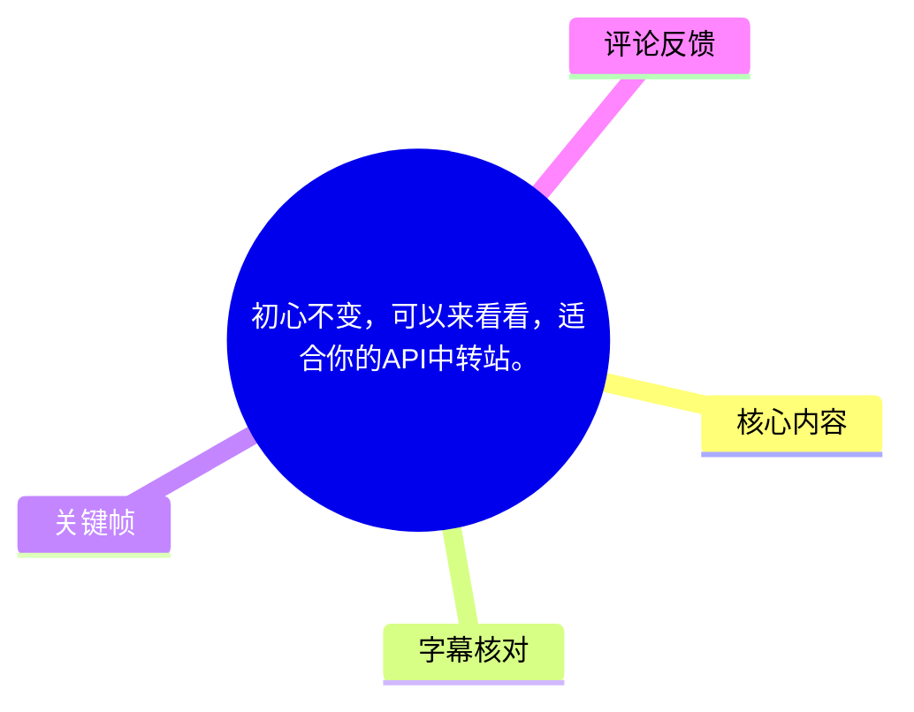
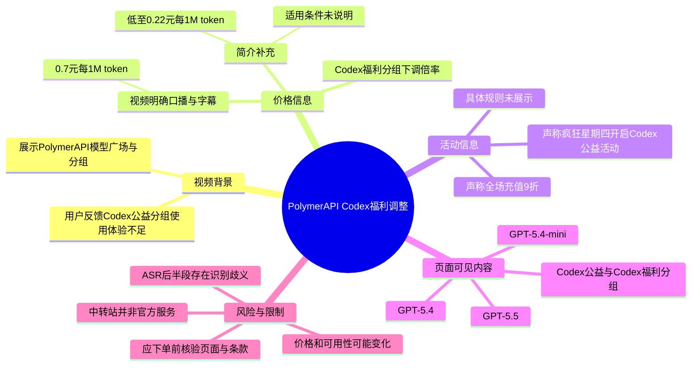
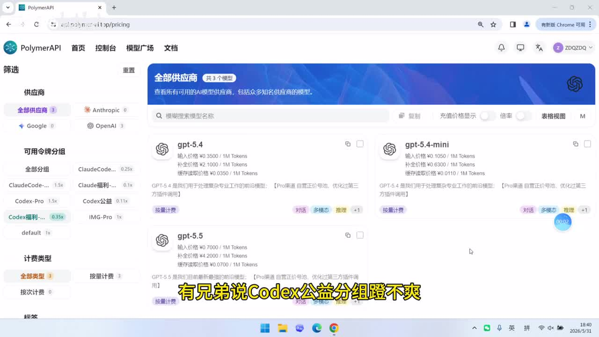
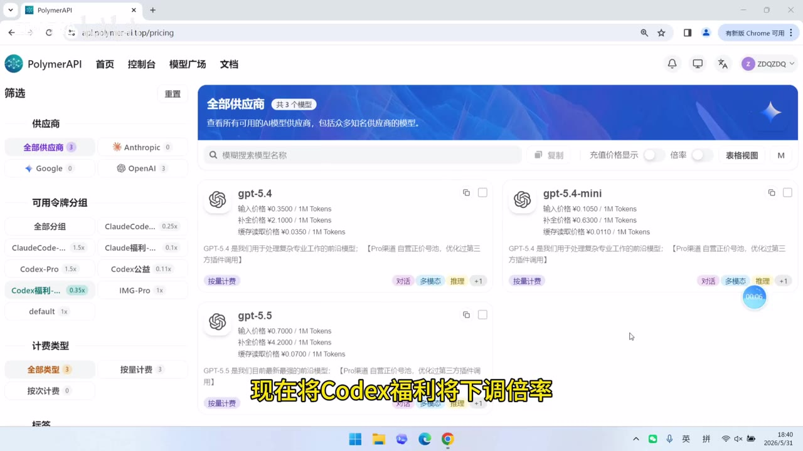
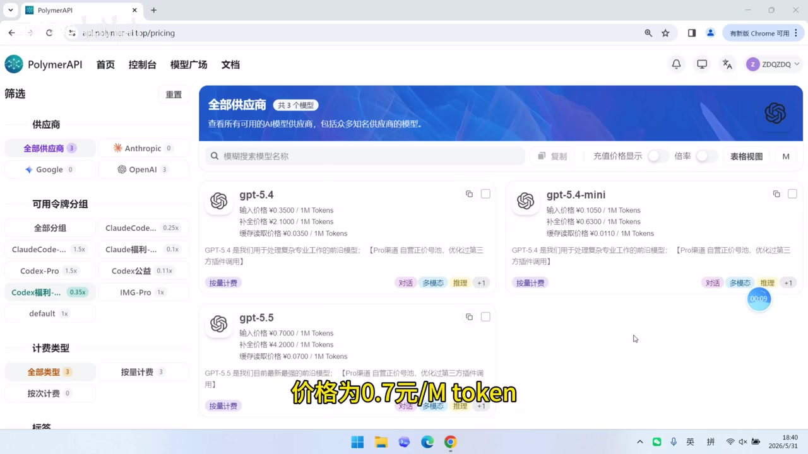

# 初心不变，可以来看看，适合你的API中转站。

> 来源：[Bilibili 视频](https://www.bilibili.com/video/BV1zDVU6zEfk) 
> UP 主：ZDQ740｜发布时间：2026-05-31｜视频时长：29 秒｜分辨率：3840×2160

## 小结

视频是 PolymerAPI 中转站的一则短促销说明，核心信息是：UP 主称因用户反馈 **Codex 公益分组使用“不爽”**，已将 **Codex 福利分组的倍率下调**，并口播及画面字幕明确给出价格为 **0.7 元 / 1M token**。

画面展示的是 PolymerAPI 的模型广场/价格页面：左侧可见多个“可用令牌分组”，其中包括 `Codex-公益`、`Codex福利...`、`Codex-Pro` 等；中间列出 GPT-5.4、GPT-5.4-mini、GPT-5.5 等模型卡片。这说明视频的语境是按分组与倍率管理的 API 聚合/中转服务，而不是 OpenAI 官方定价页。

视频后半段还宣称 Codex 公益活动改为（或固定于）“疯狂星期四”开启，并称开启活动“都是血亏但依旧坚持”；同时提到“疯狂星期四全场充值 9 折”。不过，后半段仅有一条覆盖全片的 ASR 字幕，存在多处专有名词和同音字识别错误，且所提供关键帧未覆盖该段，因此对活动开放机制应以“视频口播声称”理解，不应据此推断具体日期、资格、额度或长期稳定性。

适合已经在使用 API 中转服务、需要比较 Codex 调用成本和充值优惠的用户阅读。购买或充值前，应当直接核验服务站当前价格页、模型可用性、计费口径、限额、服务条款及退款规则。

需要特别注意时效性与口径差异：视频中的价格是 **0.7 元 / 1M token**；而视频简介另写有“定时开放 Codex 福利分组，低至 0.22 元 / 1M token”。两者可能对应不同活动、不同时间、不同分组或不同计费条件，素材不足以确认，不能将“低至”价格等同于视频中展示的常规价格。

## 思维导图

## 目录

- [背景、页面与问题定位](#背景页面与问题定位-000000)
- [Codex 福利分组价格调整](#codex-福利分组价格调整-000000)
- [活动与充值折扣：可确认内容及边界](#活动与充值折扣可确认内容及边界-000000)
- [实践核验步骤](#实践核验步骤-000000)
- [参数、限制与时效性](#参数限制与时效性-000000)
- [字幕比对](#字幕比对-000000)
- [评论分析](#评论分析-000000)
- [处理记录](#处理记录-000000)

## 背景、页面与问题定位 [00:00:00](https://www.bilibili.com/video/BV1zDVU6zEfk?t=0)

视频从 PolymerAPI 的网页录屏开始，地址栏可见 `/pricing` 路径。页面顶栏包含“首页、控制台、模型广场、文档”；当前主视图标题为“全部供应商”，左侧则是供应商与令牌分组筛选栏。

画面中可见的分组及倍率包括：

| 画面文字 | 可见倍率 | 说明 |
| --- | ---: | --- |
| ClaudeCode... | 0.25x | 名称在画面中被截断 |
| ClaudeCode-... | 1.5x | 名称在画面中被截断 |
| Claude福利-... | 0.1x | 名称在画面中被截断 |
| Codex-Pro | 1.5x | 可见 |
| Codex公益 | 0.11x | 可见 |
| Codex福利... | 0.35x | 可见，当前高亮选中 |
| IMG-Pro | 1x | 可见 |
| default | 1x | 可见 |

这里的“倍率”是页面展示字段，但视频没有解释它相对于什么基准、是否直接等于最终结算倍率，也未说明输入、输出、缓存等不同 token 类型是否采用相同口径。因此不能仅凭倍率自行反推出完整计费规则。

> 图：首帧展示 PolymerAPI 的模型页面，左侧可见 `Codex公益 0.11x` 与高亮的 `Codex福利... 0.35x`，底部字幕为“有兄弟说Codex公益分组蹬不爽”。它同时提供了用户反馈的背景及分组实际存在的画面依据。

视频的口播/烧录字幕表达的背景是：有用户认为“Codex 公益分组”使用体验不够好，UP 主因而将福利分组作为调整对象。这里的“蹬不爽”是视频字幕的原样表述，语义上应是在强调使用体验或调用体验；视频没有说明具体问题是并发、速率、可用模型、成功率还是账号限制。

## Codex 福利分组价格调整 [00:00:00](https://www.bilibili.com/video/BV1zDVU6zEfk?t=0)

视频最明确、可由画面字幕交叉确认的事实有两项：

1. **调整对象**：Codex 福利分组。
2. **宣传价格**：**0.7 元 / 1M token**。

UP 主将此次调整描述为“下调倍率”，并称该价格“几乎是成本价”。“成本价”属于发布者主观营销表述，素材中没有成本构成、上游账单、利润率或第三方价格对照，不能作为可独立验证的结论。

> 图：画面字幕写明“现在将Codex福利将下调倍率”，左侧仍高亮 `Codex福利... 0.35x`。该帧可用于确认调整讨论的是“Codex 福利”而非“Codex 公益”分组，但不能确认调整前后的全部倍率变化。

> 图：画面底部以大字写明“价格为0.7元/M token”。这是本视频中最直接的价格证据；其价值在于修正 ASR 中“每Mtoken”的无空格写法，并锁定计价单位为每 100 万 token。

### 价格信息的交叉核对

| 信息来源 | 原始表述/可见内容 | 可确认程度 | 不能确认的内容 |
| --- | --- | --- | --- |
| 视频画面与口播 | “价格为 0.7 元/M token” | 高 | 是否区分输入、输出、缓存 token；是否所有模型均适用 |
| 视频画面 | Codex 福利分组显示 `0.35x` | 中 | 该倍率对应的基准价与最终账单换算方式 |
| 视频简介 | “定时开放Codex福利分组，低至0.22元/1M token” | 高（简介确有此文字） | 0.22 元的活动时间、门槛、模型范围及能否与其他优惠叠加 |
| 视频简介 | “Codex福利分组，低至1元/100万token” | 高（简介中另有此句） | 与 0.22 元、0.7 元三个口径的先后关系 |

简介中同时出现“低至 0.22 元 / 1M token”和“低至 1 元 / 100 万 token”，加上视频的 0.7 元 / 1M token，已经形成至少三种价格口径。合理的谨慎做法是将其视为不同时间或不同活动条件下的宣传信息，**而不是可并列叠加的统一报价**。

## 活动与充值折扣：可确认内容及边界 [00:00:00](https://www.bilibili.com/video/BV1zDVU6zEfk?t=0)

ASR 将全片语音合并成一个 00:00:00–00:00:28.800 的长片段。结合该片段，后半段大意为：

- UP 主称 Codex 公益活动与“疯狂星期四”有关，识别文本为“Codex工艇由固定为疯狂星期四开启”；
- 其称每次开启活动“都是血亏”，但仍会坚持开放；
- 其提到“现在奥特曼对 Plus 账号大风特风”，该句专有名词及动词识别不稳定；
- 其宣传“疯狂星期四全场充值 9 折”。

由于没有站内字幕，且本次 ASR 未提供更细的时间切分，不能为这些后半段信息虚构更精确的秒级位置。标题统一链接到 ASR 真实分段起点 0 秒。

### 可作为视频陈述记录的活动信息

| 项目 | 视频/ASR 所述 | 证据质量 | 使用边界 |
| --- | --- | --- | --- |
| Codex 公益开放 | 与“疯狂星期四开启”相关 | 中低 | 未展示活动页面或日历，无法确认“固定”是每周固定、临时开放还是仅一次活动 |
| 活动成本 | UP 主称“每次开启都是血亏” | 低（主观陈述） | 没有财务或成本证据，不作为价格合理性的证明 |
| 充值优惠 | “疯狂星期四全场充值 9 折” | 中 | 未给出优惠码、有效期、最低充值额、是否自动生效、是否与福利分组叠加 |
| Plus 账号相关环境 | ASR 疑似提及账号封禁/限制 | 低 | 词句识别歧义较大，不能还原为确切平台政策或封号事实 |

视频简介还补充了两个与活动有关的信息：

- “1群反馈群已满，添加2群QQ号：1107621381”；
- “更多福利和第一时间获取消息，可以进群获取”。

这些是 UP 主提供的联系与社群信息，不代表平台客服、官方渠道或服务保障。

## 实践核验步骤 [00:00:00](https://www.bilibili.com/video/BV1zDVU6zEfk?t=0)

视频没有演示注册、充值或 API 调用流程，因此以下是基于视频已展示的价格页与其宣传口径整理的**核验步骤**，不是视频中实际完成的操作教程。

1. **进入视频简介所给注册地址**  
   简介给出：`https://api.polymer-ai.top/`。应自行确认域名、HTTPS 证书、登录主体和账户安全提示；不要将视频画面中的站点直接视为任何模型厂商的官方站点。

2. **在模型广场或价格页查看当前分组**  
   重点确认是否仍存在 `Codex公益`、`Codex福利` 与 `Codex-Pro` 分组，并记录对应倍率。视频画面仅能证明录制时页面存在这些分组。

3. **定位目标模型及完整单价**  
   画面列出 GPT-5.4、GPT-5.4-mini、GPT-5.5 等模型卡片，但没有展示 Codex 模型卡片的完整计费详情。应检查：
   - 输入 token 单价；
   - 输出 token 单价；
   - 缓存读写或补全 token 的单价；
   - 是否有请求次数费、并发限制或最低消费；
   - 所选分组是否真正适用于目标模型。

4. **确认“0.7 元 / 1M token”的具体条件**  
   需要明确该数值究竟是统一总价、某一 token 类型价格、折后价，还是按倍率换算出的示例。若页面最终价与视频不同，以页面下单前展示及服务条款为准。

5. **核实活动时间与充值折扣**  
   若参与“疯狂星期四”相关活动，应先查看活动页或可追溯的公告，确认开始结束时间、资格、可用分组、充值档位、折扣上限及是否可叠加。视频未提供上述参数。

6. **小额验证再扩大使用量**  
   对中转 API 而言，建议先以可承受的小额充值和低风险任务测试：模型是否可调用、响应质量是否符合预期、账单是否按页面口径扣减、失败请求是否计费、并发是否满足需求。

## 参数、限制与时效性 [00:00:00](https://www.bilibili.com/video/BV1zDVU6zEfk?t=0)

### 素材中可明确提取的参数

| 参数 | 值 | 来源 |
| --- | --- | --- |
| 视频时长 | 29 秒 | 视频元数据 |
| 视频宣传价格 | 0.7 元 / 1M token | 画面字幕、ASR |
| 画面中的 Codex 公益倍率 | 0.11x | 关键帧页面 |
| 画面中的 Codex 福利倍率 | 0.35x | 关键帧页面 |
| 画面中的 Codex-Pro 倍率 | 1.5x | 关键帧页面 |
| 充值活动宣传 | 疯狂星期四全场充值 9 折 | ASR，缺少画面佐证 |
| 简介所称最低价 | 0.22 元 / 1M token | 视频简介 |
| 反馈群 QQ | 1107621381 | 视频简介 |

### 未展示或无法确认的关键限制

- 没有提供 API Base URL、认证方式、模型 ID、请求格式或 SDK 配置。
- 没有给出 Codex 福利分组的开放时段、日/月额度、并发数、RPM/TPM 限速、排队策略或失败重试规则。
- 没有说明 0.7 元价格覆盖输入、输出、缓存还是全部 token。
- 没有展示支付方式、退款政策、账单争议处理或数据保留策略。
- 没有展示服务商与上游模型提供方之间的授权关系。
- 没有提供“疯狂星期四”折扣的起止日期、适用商品、最高优惠或叠加条件。
- 视频中出现“Plus 账号”相关说法，但其准确措辞与事实基础无法由现有素材确认。

### 时效性判断

本视频发布于 2026-05-31，价格、倍率、模型列表、活动日和折扣都属于高时效信息。尤其 API 中转站的上游成本、模型供给、可用分组和风控规则可能快速变动。本文保留的是该视频及其简介在采集时的陈述，**不构成当前可用性、价格或服务质量的保证**。

## 字幕比对 [00:00:00](https://www.bilibili.com/video/BV1zDVU6zEfk?t=0)

| 字幕来源 | 完整性 | 专有名词 | 时间轴 | 主要问题 |
| --- | --- | --- | --- | --- |
| Bilibili 站内字幕 | 无可用字幕 | 无法评估 | 无 | 抓取过程报 `Invalid URL`，未提供可用站内 SRT，不能作为转写依据 |
| 本次 ASR 字幕 | 覆盖约 28.8 秒，诊断语音覆盖率 99.38% | 存在明显误识别 | 有，但仅 1 段：00:00:00.000–00:00:28.800 | 把“公益”识别为“工艺”，将活动和专有名词识别为“工艇”“开吻”“奥特曼”“大风特风”等；缺少细粒度时间点 |

### 最终字幕选择与校正

最终采用 **本次 ASR 的时间范围** 作为时间轴基础：唯一可直接使用的真实字幕分段为 `00:00:00,000 --> 00:00:28,800`。因此正文涉及整段口播的章节均链接至 0 秒，而非根据文字内容臆测后半段发生的秒数。

文本内容则采用“ASR + 关键帧中烧录字幕 + 页面可见文字”的保守校正方式：

| ASR 文本 | 校正/处理方式 | 依据 |
| --- | --- | --- |
| `Codex工艺分组` | 记为“Codex 公益分组” | 关键帧左侧明确显示 `Codex公益`，烧录字幕也写“Codex公益分组” |
| `CodeX福利将下调倍率` | 保留为“Codex 福利分组下调倍率” | 关键帧烧录字幕与页面高亮分组共同支持 |
| `0.7元每Mtoken` | 规范为“0.7 元 / 1M token” | 关键帧烧录字幕明确显示“0.7元/M token” |
| `Codex工艇由固定为疯狂星期四开启` | 不作强行逐字订正，仅记录为“ASR 表明其与疯狂星期四开启有关” | 无后半段关键帧和站内字幕验证 |
| `奥特曼对Plus账号大风特风` | 不作为确定事实引用 | 识别歧义大，缺少独立佐证 |

ASR 诊断未标记 `noAudioStream=true`，且识别结果显示源视频存在普通话音频流；因此本任务不是无音轨场景，也不将站内字幕抓取失败视为音频工具失败。

## 评论分析 [00:00:00](https://www.bilibili.com/video/BV1zDVU6zEfk?t=0)

本次仅获取到 2 条热评，少于“热评前三条”的上限；以下仅分析可获得内容，不补造第 3 条。

1. **人杰地灵东箭南金：**“这定价有点贵啊，登不起”  
   - 观点：认为视频宣传的定价偏高，使用门槛不可接受。  
   - 价值：反映至少有用户不认同“接近成本价”的营销判断。  
   - 限制：评论未说明其比较的模型、分组、输入/输出 token 结构或竞品价格，属于个人价格感受，不能单独证明定价确实偏高。

2. **缺哔乐药丸：**发布另一个 `sub2api` 注册链接，并称“自用实测”“限时优惠”“常用模型都有”。  
   - 观点：在评论区提供了竞争性服务及推广信息，并声称可领取优惠。  
   - 价值：说明评论区存在替代服务的价格比较诉求。  
   - 风险与可信度：该内容含推广链接和优惠宣传，未提供可验证的服务条款、账单截图、长期稳定性或安全审计信息；不应将其价格、模型可用性或“自用实测”视为已验证事实，也不建议因评论直接注册或充值。

## 处理记录 [00:00:00](https://www.bilibili.com/video/BV1zDVU6zEfk?t=0)

- Worker ID：`worker-mrj0wjed-b0c290ad`
- 模型：`gpt-5.6-terra`
- 调用工具与素材：视频元数据、关键帧抽取结果（`frames/`）、音频 ASR（`medium`，CUDA、float16）、ASR SRT、ASR 诊断、热评抓取结果。
- 使用的应用工具：素材编排流程输出 `merged.mp4`、`audio/audio.wav`、`asr/transcript.srt`、`asr/asr-result.json`、关键帧目录与评论 JSON；站内字幕抓取曾返回 `Invalid URL`。
- 字幕选择：站内字幕未提供可用内容；已检查本次 ASR。采用 ASR 唯一真实分段 `00:00:00.000–00:00:28.800` 作为时间轴，并以关键帧烧录字幕和页面文字校正可确认的“Codex 公益”“Codex 福利”“0.7 元/M token”。
- 关键帧选择依据：选用 `frame-001.jpg` 说明页面、分组及用户反馈背景；选用 `frame-003.jpg` 确认福利分组倍率下调的说法；选用 `frame-004.jpg` 固定视频中最重要的价格参数。未把未提供画面证据的后半段活动细节伪装为已视觉验证事实。
- 缓存清理：未提供缓存清理执行日志；本记录不声称已完成未被素材证实的清理操作。
- 未解决问题：
  - “疯狂星期四”相关活动的精确规则、时间与叠加条件未展示；
  - “Plus 账号”相关口播存在 ASR 歧义，无法可靠还原；
  - 视频价格、简介中的多个“低至”价格及页面倍率之间的换算关系未说明；
  - 未获得站内字幕，且 ASR 只有一个覆盖全片的粗粒度时间段。

## 评论分析

- 热评 1：这定价有点贵啊，登不起
- 热评 2：sub2api https://api.vbcoding.cc/register?aff=RQ2R62DSUUAD 自用实测，限时优惠，进群找群主领10刀爽享0.07，常用模型都有

以上内容是观众反馈摘录，只用于补充理解视频反响，不作为正文事实依据。
